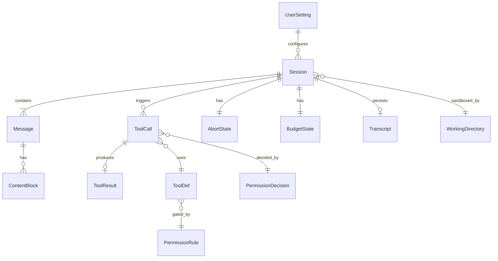

# XEYO ER 图索引

本目录说明实体关系图放在何处。为避免重复维护，**完整字段级全域 ER** 写在：

→ [../00-总计划书-可上线路线图.md](../%E6%80%BB%E7%BA%B2%E4%B8%8E%E8%B7%AF%E7%BA%BF/00-%E6%80%BB%E8%AE%A1%E5%88%92%E4%B9%A6-%E5%8F%AF%E4%B8%8A%E7%BA%BF%E8%B7%AF%E7%BA%BF%E5%9B%BE.md) 第 4 节

各阶段 **子 ER / 时序图** 写在对应 Task 文档第 3 节：

| 阶段 | 文档 | 覆盖实体 |
|---|---|---|
| Task0 | [task0](../%E4%BB%BB%E5%8A%A1%E4%B9%A6/task0-%E8%A7%A3%E9%98%BB%E5%A1%9E%E4%B8%8E%E4%B8%BB%E5%BE%AA%E7%8E%AF%E6%94%B6%E5%8F%A3.md) | Session, Message, Abort, Budget |
| Task1 | [task1](../%E4%BB%BB%E5%8A%A1%E4%B9%A6/task1-%E4%BC%9A%E8%AF%9D%E4%B8%BB%E5%BE%AA%E7%8E%AF%E5%AE%8C%E5%A4%87.md) | + ContentBlock |
| Task2 | [task2](../%E4%BB%BB%E5%8A%A1%E4%B9%A6/task2-%E5%B7%A5%E5%85%B7%E5%8D%8F%E8%AE%AE%E4%B8%8E%E6%A0%B8%E5%BF%83%E5%B7%A5%E5%85%B7.md) | ToolDef, ToolCall, ToolResult |
| Task3 | [task3](../%E4%BB%BB%E5%8A%A1%E4%B9%A6/task3-%E6%9D%83%E9%99%90%E6%B2%99%E7%AE%B1.md) | WorkingDirectory, PermissionRule, PermissionDecision |
| Task4 | [task4](../%E4%BB%BB%E5%8A%A1%E4%B9%A6/task4-%E6%9C%8D%E5%8A%A1%E7%AB%AFAPI%E7%A8%B3%E5%AE%9A.md) | Session.busy 与 API 时序 |
| Task5 | [task5](../%E4%BB%BB%E5%8A%A1%E4%B9%A6/task5-%E5%89%8D%E7%AB%AF%E4%BA%A7%E5%93%81%E5%8C%96.md) | UserSetting, LocalSession, UiMessage |
| Task6 | [task6](../%E4%BB%BB%E5%8A%A1%E4%B9%A6/task6-Java%E5%B7%A5%E5%85%B7%E8%BF%90%E8%A1%8C%E6%97%B6.md) | ToolDef.runtime |
| Task7 | [task7](../%E4%BB%BB%E5%8A%A1%E4%B9%A6/task7-%E4%BC%9A%E8%AF%9D%E6%8C%81%E4%B9%85%E5%8C%96%E4%B8%8E%E5%8F%91%E5%B8%83.md) | Transcript |
| 记忆 | [10-完整记忆体系](../%E8%AE%BE%E8%AE%A1/10-%E5%AE%8C%E6%95%B4%E8%AE%B0%E5%BF%86%E4%BD%93%E7%B3%BB.md) | Workspace, InstructionFile, WorkingSnapshot, Memdir, MemoryNote, SessionSummary, NightShiftJob |

## 全域 ER（速览，与总纲一致）

