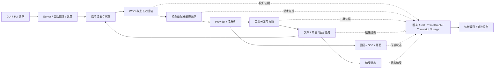

# XEYO 全链路诊断与受控 A/B 设计

日期：2026-09-24。状态：设计稿，未实现、未启用、未运行实验。

> **2026-09-24 实现后校正**（源码核查，非设计推断）：本表有三处与当时源码不符，实现按源码而非本表落。
> ① 没有 `python/config` 包；`xeyo_data_root()` 在 `python/session/workspace_path.py:54`，且 usage/transcript 各有自己的覆盖（`XEYO_USAGE_DIR`、`XEYO_SESSIONS_DIR`），并不都经过它。
> ② TraceGraph 不丢重试：每行审计都会生成独立 `event:` 节点，丢的只是 `model:` 节点上的单个 `attempt` 字段（已由 `record_attempt` 补成 `attempts` 列表）。
> ③ 用量缺的不是"按 0 记"，而是 `ledger.py:77` 在 usage 为空时**整行不写**，且 `cost_source` 只有 `api`/`estimate`、没有 `unknown` 口径；`deepseek.py` 非流式清空 `_meta_request_id` 是**有意**的归因洁净（该路径生产无调用方），不是缺陷，故未改。
> ④ 真正卡住"从出错现场点进去"的两条本表没列：`llm.failure` 原先不带 `session_id`（审计按会话查时永远看不见模型失败），以及 GUI 的 `ActivityStep` 完全不承载后端身份。

本轮范围：基于现有源码完成产品、数据流、接口与验收设计。用户选择“先出完整设计，暂不改代码”。本设计不授权新的付费调用，也不恢复 P0 全量测试。

## 1. 决策与目标

建设一个诊断中心，让用户从一次异常直接看到：发生在哪个步骤、关联哪个功能、当时输入与结果是什么、哪些事实已确认、哪些原因仍是推测，以及如何用最小实验验证。覆盖 GUI/TUI 到 server、会话恢复、上下文、模型适配器、权限、工具、后台任务、文件结果和验收。

首要决策是复用 AuditLog、TraceGraph、projection manifest、turn events、transcript、usage ledger 和 changedetect。不要建立第二套事件总线、独立因果图平台或依赖 LLM 的诊断器。

产品分成三个能力，按顺序交付：

1. **运行追查**：连通已有证据，显示步骤、失败、耗时、用量与证据缺项。
2. **自动检测**：用确定性规则检测结构错误、超时、断链和运行异常，输出可以核查的证据。
3. **受控实验**：比较提示词、WSC 或配置变化；支持免费静态对比、单请求配对、隔离任务配对。

系统承诺定位“最后一个已确认正常的边界”和“首个已确认异常的边界”。不承诺根据一次回答自动知道模型为什么犯错，不把相关性包装成根因。无证据时显示“未能归因”，而不是显示绿色或强行给某个模块定责。

## 2. 源码确认的基础与缺口

本表依据当前主工作树只读核查。WSC 唯一生产路径的提交 `1a6e293` 仍在隔离分支，不能默认主工作树已包含它。未来诊断必须记录实际运行版本及工作树状态。

| 已有能力 | 源码位置 | 可以复用什么 / 尚缺什么 |
|---|---|---|
| 审计事件与 TraceGraph | `python/audit/log.py::AuditLog`；`python/engine/trace_graph.py::TraceGraph.from_audit_rows`；`python/server/routers/audit.py` | 已能连接 session、projection、model、tool、action；查询尚未合并投影内容、用量和 transcript。 |
| 请求身份 | `python/engine/query_engine.py` 的 ExecutionContext 构造；`python/engine/query_loop.py` 的模型审计 | `trace_id=turn_id`，逻辑调用有 `model_request_id`，重试有 `attempt`；不要另造一套替代 ID。 |
| 投影结构检查 | `python/engine/projection_manifest.py::build_manifest` | 有投影 hash、消息数、tool pair 检查；hash 不能还原正文，也不是 provider 转码后的请求体 hash。 |
| 模型适配器 | `python/model/openai_compat.py`、`deepseek.py`、`anthropic.py` 的请求体构造与发送 | 已知最后的 body 构造边界；尚缺最终请求体捕获及 provider request/response ID 的关联。 |
| 工具审计及结果 | `python/tools/tool_registry.py`；`python/session/record_transcript.py` | tool call ID、model request ID、action ID、错误和时长已存在；结果正文可从 transcript 关联。 |
| 权限等待 | `python/engine/permission_coordinator.py::PermissionCoordinator.request/wait` | ASK 创建独立权限 request ID，缺原始 tool_use ID / model request ID，存在关联断口。 |
| 用量账本 | `python/usage/ledger.py` | request ID、attempt 可与模型事件关联；缺失 usage 不能当作 0。 |
| GUI 实时活动与事件重连 | `gui/src/components/ActivityLog.tsx`；`python/server/routers/sessions.py::session_task/session_turn_events` | 工具步骤、任务状态、断流与事件重放已有；event_id 每轮重编号，必须与 session_id、turn_id 一起使用。 |
| 后台 job | `python/server/routers/jobs.py`；`gui/src/components/SessionJobsBadge.tsx` | 状态与只读输出可直接纳入诊断详情。 |
| 提示词表面差异及确定性轨迹 | `python/evals/changedetect/surface.py::collect/compare`；`trace.py::collect/compare` | 能比较 system、工具描述、T_now 等变化；不能代表任务表现。已有 trace golden 测试中的 xfail 要如实展示。 |
| 小型真实引擎 A/B | `python/evals/changedetect/ab.py::_run_case`；`budget.py` | 有任务电池、fake/live、配对与预算预估。当前变体主要是环境变量；每臂仅临时 cwd 隔离。 |
| A/B 账目缺陷 | `python/evals/changedetect/ab.py::_run_case` | `cost=0.0` 没有更新便成为 `cost_cny`；现有 actual_total_cny 不能作为真实费用。`ab replay` 目前也不是真正的报告加载回放。 |
| 文件快照与恢复 | `python/engine/shadow_git.py::ShadowGit.snapshot`；`python/rewind/snapshot.py`、`service.py` | 全量快照可包含未忽略的 dirty/untracked 文件；不包含所有 ignored 数据、依赖、进程或外部服务，也不等于两个隔离实验环境。 |
| 代码树隔离 / runtime 信息 | `python/coord/worktree.py::WorktreeManager`；`python/engine/runtime_profile.py`；`runtime_checkpoint.py` | 可固定 checkout 与运行档。worktree 不是 OS 安全沙箱；runtime checkpoint 不保存完整提示词且不会自动重放副作用。 |

重要边界：现有 GUI `/bench/chat`、`/bench/fade` 是界面性能实验，不是模型提示词评测。WSC replay 和 simulator replay 是无模型调用的确定性重算，不能冒充新提示词下的模型续跑。

## 3. 用户实际看到的功能

### 3.1 日常运行

新增独立“诊断”页面，与 usage 页面同级。ActivityLog 的失败步骤和后台任务卡提供“查看诊断”，直接定位该 session / turn / tool call。设置中只放采集范围和实验预算，不把整页诊断塞进设置弹窗。

运行详情分四个视图：

- **问题**：发生了什么、最早异常步骤、功能归属、证据强度、缺少什么证据；每项都能展开原始记录。
- **步骤**：从请求到验收的时间线。等待权限、模型调用、重试、工具执行和后台任务分别显示，不把等待误报成卡死。
- **上下文**：源历史、WSC 投影、PromptAssembler 输出和适配器请求的差异；明确哪些正文未采集。
- **用量**：按请求与重试显示 hit/miss/output、用量来源、费用估算及价格版本，关联现有 usage ledger。

用户可以手动标记“这轮结果不对”，填写预期结果并固定证据。自动检测覆盖不到的逻辑错误由这个入口补足；标记不会自动触发付费实验。

### 3.2 异常卡示例（示例，不是本次实测）

```text
现象：本轮模型请求失败
已定位步骤：模型请求结构检查
功能：上下文组装
证据：请求含 tool result call_17，但缺少对应 tool call
边界：源历史中配对完整；最终投影中配对缺失
状态：结构错误已确认；任务最终失败的全部原因尚未确定
操作：查看前后差异 / 导出证据 / 生成免费复现
```

“功能归属”来自事件所在组件和明确的数据边界，不通过错误文字猜文件。显示的定位可以细到函数和记录 ID；代码行号是版本相关的附加信息，不能作为永久主键。

### 3.3 提示词实验

选择一个任务或检查点，选基线与候选提示词。界面先显示实际变更块、其他变量是否一致、能执行哪种实验、费用上限及验收方式。结果同时展示 A/B 原始回答、工具轨迹差异、文件 diff、测试结果、步数和费用，不合成一个掩盖退步的总分。

提示词自动检测到变化后，可以自动生成差异和实验计划。真实模型实验仅在用户已配置的项目/实验授权范围、隔离档和预算内自动执行；未配置时只生成计划。

## 4. 全链路边界与证据



| 边界 | 最小记录 | 能回答的问题 |
|---|---|---|
| 用户请求 / 接收 | turn 身份、输入内容引用、客户端发送/服务端接收状态 | 请求没发出、没接收，还是后续没执行？ |
| 恢复与调度 | workspace/runtime/profile、恢复来源、排队/等待状态 | 用错会话、目录、配置，还是在等其他任务？ |
| 指令与上下文 | 生效来源、内容 hash、投影 manifest、折叠 ID | 哪段提示词或历史改变了？ |
| WSC 折叠 | 原始消息范围、保留/移冷层的来源 ID、现有选择审计、预算、视图引用 | 信息在哪个确定性阶段消失？ |
| 适配器 | 转码前 projection ID、转码后 body hash、capture 状态、模型有效参数 | 引擎给适配器的内容和适配器构造的内容是否一致？ |
| 模型请求与响应 | logical request、attempt、provider ID（若有）、开始/首事件/结束、状态、usage | 网络错误、厂商错误、解析错误或重试发生在哪？ |
| 工具与权限 | tool call、model request、approval request、action、参数/结果引用、退出状态 | 模型没调用、权限未通过，还是工具执行失败？ |
| 后台任务 | job 身份、进程生命周期、最后输出/心跳、取消状态 | 合法长任务、等待输入、超时还是进程消失？ |
| 文件与验收 | 快照引用、文件变更、verifier 版本/输出/退出码 | 修改了什么、测试有没有跑、结果是否可判定？ |
| SSE / GUI | turn event cursor、断流/重连/缺口、server 完成状态 | 引擎已结束但界面没收到，还是引擎仍在运行？ |

每阶段使用已有开始/完成事件；仅给当前看不见的边界补有限事件。响应流默认只累计首事件、结束、字节与事件计数，不逐 token 记日志。WSC 细节只在实际折叠时记录，不每轮重算选择链。

## 5. 关联与存储契约

### 5.1 复用身份

- 会话/轮次：`session_id + turn_id`；沿用 `trace_id=turn_id` 的现状。
- 模型逻辑调用：`model_request_id`；实际尝试以 `(model_request_id, attempt)` 区分，避免多个 retry 覆盖成一个节点。
- 工具：原 `tool_use.id`；权限 ASK 的审批 ID 单独保留，并补 `tool_use_id` 与 `model_request_id` 作为关联字段。
- 内容投影：已有 `projection_id`；适配器最终 body 新增独立 `request_body_hash`，二者不能混用。
- 流事件：`session_id + turn_id + event_id`。后台 job / action 沿用既有 ID。
- 实验：仅新增 `experiment_id + pair_id + arm + repeat`，引用各自真实 session/turn/request。实验标记不注入模型提示词。

TraceGraph 当前展示节点会按请求 ID 合并；设计扩展时必须保留各 attempt 的事件与费用，不能只显示最后一次尝试。图中的关联边表示可追溯关系，不声称每条边都是因果关系。

### 5.2 两档采集

**轻量诊断**默认适合长期使用：已有日志、hash、结构检查、来源引用和状态关联。能定位已观测错误，不能承诺复原未保存的请求正文。

**可复现记录**适合用户接下来选定的真实测试会话：在适配器 body 构造后、发送前保存本地压缩请求体及有效参数；复用 transcript/cold 引用，固定相关 checkpoint。相同 body 按 hash 复用；不因历史增长默认无限复制。

此处“实际请求体”指适配器提交给 HTTP 客户端的完整 JSON，不宣称看到了 provider 内部最终处理的输入。若只记录规范化 JSON hash，也不冒充 TCP 字节级抓包。

凭证和认证头不进入产物。请求内容若经脱敏、截断、缺 blob 或过期删除，必须记录为 `partial/redacted/expired`，禁止标为精确回放。仅有 hash 的历史不能补造正文。

### 5.3 最少新增产物

建议放在现有 `xeyo_data_root()/diagnostics/` 下；具体目录为设计值：

```text
diagnostics/
  runs/<session>/<turn>/manifest.json       # 版本、已有证据定位、采集完整性
  reports/<report_id>.json                 # 确定性诊断结果
  captures/<body_hash>.json.gz             # 仅可复现模式保存
  experiments/<experiment_id>/manifest.json
  experiments/<experiment_id>/results.jsonl
  experiments/<experiment_id>/report.md
```

Audit/transcript/usage 保持各自权威来源，manifest 只做索引。导出时复制所需证据并附 hash，避免导出后路径失效。诊断文件写失败不能吞掉主任务错误，也不能把实验误标为成功；付费实验需要的 manifest/预算预留写失败则停止发新请求。

采集总量受可配置磁盘配额限制，失败证据和实验输入可固定保留。固定证据不足空间时报告采集缺口，不覆盖它们。诊断缓存的清理不得删除 WSC 冷层或会话原始历史。普通会话未启用完整采集时，界面明确提示可定位范围。

### 5.4 查询与进程边界

AuditLog 当前整文件筛选且仅线程内写锁，不能让所有实验 worker 无约束写同一个文件。复用 `XEYO_AUDIT_LOG` 给各实验进程独立文件，manifest 记录位置；按需合并查询，不再建并行事件系统。

诊断实时更新优先使用现成 turn-event cursor。旧 trace 接口返回截断窗口时必须显示 `complete=false` 与可继续加载的范围，不能把窗口外记录当作不存在。长期日志按现有文件策略扩展分段读取；只有实测查询瓶颈存在后才考虑索引或数据库。

## 6. 自动检测与归因规则

诊断结果必须包含：现象、阶段、组件、rule_id/版本、证据引用、影响、检测覆盖缺口，以及 `confirmed_fault / suspected_cause / unknown`。置信度用可解释的证据等级，不编造 92% 等概率。

### 6.1 首批自动规则

| 规则 | 确认依据 | 允许给出的结论 |
|---|---|---|
| 工具调用/结果不成对 | projection manifest 和源历史 ID | 请求结构在某边界损坏；不凭这一条解释全部任务失败 |
| 指令或配置漂移 | 固定基线 hash 与当前实际生效内容不同 | 哪段内容发生变化；不自动评价更好/更坏 |
| WSC 冷引用不可读 | 已发出的路径/行范围读失败或证据 hash 不符 | 可恢复性故障；按折叠记录定位生成步骤 |
| 冻结头意外变化 | 同一折叠区间内头 hash 变化且无合法折叠事件 | 前缀稳定性不变量失败 |
| Provider/流解析失败 | attempt 的状态码、异常类型、解析错误 | 厂商返回错误/传输失败/适配器解析失败；429 不等于提示词错误 |
| 权限等待或拒绝 | ASK/DENY/resolved/timeout 与工具 ID | 执行被哪条实际权限结果阻断；不把预期拒绝都计成产品 bug |
| 工具或进程失败 | 退出码、错误类型、stderr 引用、worker 终止记录 | 工具失败步骤及证据；测试失败和“测试无法运行”分开 |
| 事件流缺口 | server cursor 与客户端 ack/stream_gap | 显示链路缺口；server 完成且客户端缺尾部时指向传输/显示边界 |
| 未完成执行 | 已确认进程退出，或超出既定 deadline 且无结束记录 | 执行中断/超时；没有 finish 事件本身不证明进程已死 |
| 重复动作/错误 | 有界窗口内相同工具参数和错误签名重复 | “重复失败”信号；不自动断言死循环或改写模型计划 |
| 用量缺失/错配 | request/attempt 没有对应 usage、重复账目或非法计数 | 费用未知/账目异常，不能按 0 元处理 |
| 验收异常 | 用户指定 verifier 的输出及退出状态 | 通过/失败/执行错误/未执行；模型说“通过”不等于已通过 |

卡住检测同时看任务状态、权限等待、模型重试、最后流事件和后台进程状态。观察者与被观察任务在同一阻塞点时也会失效，因此复用 server/client 健康信息；真正的实验 worker 由父进程监督 deadline 和退出。不能仅凭模型长时间不输出文字就判死锁。

这些规则默认只显示与记录，不自动修改提示词、恢复工作区、杀进程或重试。已有预算和取消机制仍在执行层生效。

### 6.2 信息丢失定位

按顺序查同一项事实的来源：

1. 源历史中是否存在；不存在则不是这次 WSC 丢失。
2. 结构化事件/状态中是否存在；不存在则检查提取阶段。
3. 是否进入候选；候选缺失则查查询或候选发现。
4. 是否被选择；没选中则查预算、硬保护和选择理由。
5. 是否已发射；已选而未发射则查组装/冻结。
6. 最终 provider body 是否仍包含；若组装输出有而 body 没有，查适配器。
7. 若在冷层，句柄是否可读、模型是否实际调用、结果是否进入后续请求。

这条链对有明确来源/标识符的事实可自动执行。对“模型应该理解的一句隐含约束”没有可靠的确定性全自动真值；需要用户标记或任务验收辅助。不能因为输入里出现某个词就判断模型已经理解。

若事实在热层仍失败，WSC 仍可能通过信息顺序或噪声影响模型；此时只能排除“该事实被直接删掉”，不能排除 WSC 的全部影响。

### 6.3 证据强度

- **观测事实**：某请求失败、某工具返回错误、某字段缺失。
- **定位结论**：同一输入在确定性链路的具体边界破坏不变量，可本地重现。
- **候选原因**：现象与提示词/信息变化相符，但没有受控干预。
- **实验支持**：受控配对在保存的条件下出现一致差异，记录样本量和不确定性。

一个故障可有多个原因。展示首个异常、传播影响和其他候选，不要求所有结果压成唯一 root cause。出现同一错误的 A/B 两臂也不能逻辑上排除所有交互因素。

## 7. 自动 A/B 的三种模式

### A0：静态差异与确定性重算，零模型调用

复用 changedetect surface/trace 与 WSC replay。比较 system、工具 schema、T_now、WSC 投影、结构约束、token 估算和冻结前缀变化。输出“改了什么、哪些机械约束受影响”。不输出“模型表现提高”。

提示词文件变更可以自动触发 A0，合并短时间内的重复变更，避免每次保存都重扫全部会话。

### A1：同检查点单次响应配对

固定原始历史、工具 schema、模型及生成参数，只替换指定提示词块或压缩策略，产生两份响应并并排显示。保留工具调用协议，但不执行模型建议的工具调用。两臂结果可用确定性的字段/结构判分；其余显示给用户复核。

A1 回答“下一步输出或选择是否变化”，不能证明整题成功。原检查点已包含旧提示词影响下的历史，因此它测的是检查点之后的替换效果，不等同于从任务开始采用新提示词。

### A2：隔离环境中的真实任务配对

两臂从同一可复制检查点或任务起点启动，分别执行真实工具，最后运行同一个 verifier。原任务工作区不被当作任何实验臂。适用于检验提示词或 WSC 对任务成功、错误修改、步骤与多轮经济性的影响。

首版 A2 只支持已经明确隔离文件、进程和外部副作用的 runtime。仅临时 cwd 或 git worktree 不满足这一条件。网络读取若结果可变化，记录外部状态/响应或承认不完全可复现；具有外部写入副作用的工具默认不进入自动配对。

无法得到等价环境时停在 A0/A1，并显示缺少什么，不能把近似环境称作同检查点实验。

## 8. 实验输入与可比性

一个不可变 experiment manifest 至少包含：

- 任务、pair、repeat、A/B 变体定义及唯一允许变化项。
- 代码 commit + dirty patch/内容 hash、runtime profile、工具 schema、权限配置。
- 工作区快照、未跟踪文件、外置数据清单及不包含的 ignored 文件；环境/依赖和外部服务约束。
- 原始历史与 blob 清单、system/用户 prompt 的内容版本、checkpoint、最终请求捕获引用。
- 模型的完整名称、provider、有效参数、seed（厂商支持时）、时间与响应 ID。
- 任务验收器、成功条件、允许命令、终止条件和证据保留规则。
- 价格版本、货币、保守预算、最大请求/重试/输出/轮数/时间。

Shadow Git 可以帮助获取 dirty/untracked 内容，但不能通过恢复用户当前目录来“制造实验臂”。先固定快照，再导出两个副本；必须验证两臂起始文件清单/hash 一致。依赖 ignored 数据的任务若未显式补入，则标为不具备 A2 条件。

基线与候选采用独立进程，隔离环境变量、WSC 内存状态、session cache 和工具状态；当前 A/B 在进程内修改 `os.environ` 的方式不适合并发自动实验。创建 worktree/快照等共享 Git 操作按现有锁串行化。

完整历史臂必须真发送完整历史，不能通过关闭 WSC 回旧 C2。若超出模型窗口，标为该检查点 raw 臂不可执行，不静默裁尾后继续叫 Full Context。

相同参数和 seed 也不承诺云模型逐字确定。实跑应记录顺序，允许 AB/BA 平衡，按任务/检查点配对分析。生产上下文缓存不能假装被可靠清空；记录实际命中与请求顺序，避免将先后顺序的缓存效应误当作提示词收益。

## 9. 判分、报告与实验结论

每项结果分别报告，不用一个加权总分吞掉问题：

| 维度 | 记录 |
|---|---|
| 任务 | verifier 通过/失败/运行错误/未运行，原始证据与版本 |
| 变更 | 文件 diff、用户指定断言、越界修改；无法机器判定的“错误修改”标需复核 |
| 行为 | 工具次数、有效模型调用、重试、轮数、重复错误、冷层读取 |
| 上下文 | token、来源覆盖、预算、实际发送内容、前缀变化 |
| 性能 | 模型/工具/上下文/排队分别计时，非流式总耗时与首事件延迟分开 |
| 费用 | 厂商 usage、价格依据、估算/账单来源、未知请求数与保守上界 |

输出 A-only 成功、B-only 成功、均成功、均失败和执行无效的配对计数；无效试验也占预算，不能从费用或失败记录中删除。小样本标“探索性”，无显著差异不等于等价。轨迹首次不同可帮助阅读，但不是自动根因。

若要进行 Leave-One-Block-Out，仅对已经怀疑的块做单独受控实验，不能默认遍历所有块并消耗额度。块间可能互补，移除后的性能差不能视为普适、可相加的 utility 标签。

### 9.1 预算执行

复用产品 BudgetTracker 与 changedetect 计划，但增加**实验级统一上限与持久预留**：每次请求发出前，按最坏输入计费、最大输出及计费类别预留，完成后用 usage 对账。两臂、重试和所有 repeat 共享这一个上限，不能各自得到全额预算。

缺价格、缺可信输入上界或出现 usage 不明的调用，不能按 0 释放预留。取消/超时可能仍计费，保留该次最大预留并停止可能越界的新请求。运行中断后读已落盘状态，未知请求不自动重发。试验接近上限时宁可标未完成，也不隐含透支。

DeepSeek 或其他 provider 的价格从用户确认的配置/有效价格版本读取，明确币种和汇率；不将当前代码 `actual_total_cny=0` 沿用到新报告。除非取得真实账单，否则 UI 称“按 usage 估算”，不用“实付”冒充。

当前对话的 ¥4 授权属于先前测试，不能自动转换为这个新功能永久、循环的付费授权。

## 10. 模块与接口方案

以下新增路径和 API 均为建议，尚不存在。既有巨石文件只留必要调用点。

| 模块 | 职责 | 复用点 |
|---|---|---|
| `python/diagnostics/collect.py` | 按现有身份合并证据、标注缺口与来源 | AuditLog、TraceGraph、projection manifest、transcript、usage |
| `python/diagnostics/rules.py` | 小型确定性规则与可解释 Finding | 既有 invariant/error/status；不建通用规则 DSL |
| `python/diagnostics/capture.py` | 可选请求体捕获、hash、manifest、配额 | 适配器 body 构造边界；复用现有 data root |
| `python/diagnostics/report.py` | 同一结构输出 JSON/Markdown | 查询结果、实验结果，不调用模型 |
| `python/evals/changedetect/` 增量扩展 | prompt 变体、manifest、真实报告回放、配对结果、记账 | 保留现有任务电池/engine 驱动/预算，不另起一套 evaluator |
| 小型实验 supervisor 模块 | 独立 worker、隔离档、超时/取消、实验预算预留 | 既有 runtime profile、BudgetTracker、worktree/snapshot |
| `python/server/routers/diagnostics.py` | 报告查询、导出、实验计划与受控执行 | 既有 audit、session/job API；必须沿用工作区访问权限 |
| `gui/src/features/diagnostics/` | 运行详情、问题、上下文差异、A/B 结果 | ActivityLog、jobs、usage、现有路由布局 |

现有 `query_loop.py` 只接入必要的投影引用/阶段结束记录。provider 适配器只增加捕获调用和响应身份提取。权限协调器只补关联 ID。诊断服务不持有模型执行计划，不把诊断建议塞回模型 system/T_now/tool result。

建议 API：

- `GET /v1/diagnostics/runs?session_id=...`：有界运行列表与覆盖情况。
- `GET /v1/diagnostics/runs/{turn_id}?session_id=...`：证据链、finding、缺项，分页 cursor。
- `POST /v1/diagnostics/runs/{turn_id}/pin`：固定所需证据，不修改任务内容。
- `POST /v1/diagnostics/experiments/plan`：生成差异、输入可用性、隔离要求、预算；不发模型请求。
- `POST /v1/diagnostics/experiments`：依据明确实验配置启动；有 idempotency key，重连不重复执行。
- `GET /v1/diagnostics/experiments/{id}`、`POST .../{id}/cancel`：进度、结果、取消。

请求体和源码正文不是普通审计摘要。远程用户查询必须经过会话/工作区权限检查，导出前显示包含范围；不因为已有 audit API 可读就公开全部捕获内容。

## 11. 实施顺序和验收

### 阶段一：运行可追查

先关联已有 ID、manifest、transcript、usage，补 ASK 关联和 attempt 展示，提供诊断详情页与 Markdown 导出。支持数据不完整时的明确降级。

验收用少量固定故障样本：模型错误、工具失败、权限等待、流缺口、缺 usage、重试。每个 finding 能回到原始证据；正常等待不误判故障；多次 retry 不漏计。旧日志字段缺失仍能展示，不凭空补值。

### 阶段二：记录可复现、免费差异

增加选定会话的最终请求捕获、WSC 折叠来源记录和 A0。用户第一次就能看到“提示词哪里变了”和“本次实际传了什么”。

验收请求正文/hash 对得上、credential 不落盘、截断/脱敏不标完整、冻结头可核验；注入文件写失败与进程中断，任务不被观察器拖死，报告正确标缺项。记录开/关不能改变模型可见消息或工具执行结果。

### 阶段三：受预算控制的 A1

修复 A/B 用量和费用口径，持久化实验 manifest，支持选定提示词块、单请求配对、真实报告加载与输出并排比较。先用 fake provider 验证两臂单变量与预算边界，再考虑用户授权的付费冒烟。

验收并发/重试/超时/崩溃恢复均不突破实验预留、不重复发送未知请求；无 usage 标未知；模型输出中的工具调用不在 A1 执行。

### 阶段四：合格环境的 A2

从一个已验证隔离的任务类型开始，实现 snapshot → 两个独立 worker → verifier → 结果对比。未满足隔离/环境等价性的任务拒绝标成 A2。

验收两臂起始清单一致、互不污染、原工作区未改、外部副作用受限、verifier 版本一致、无效运行也记账。正常执行只需一次预算授权配置，不逐工具向用户追问实验许可。

### 性能与可靠性

不凭空指定“低于 1 ms”或“100% 根因识别”。在固定短/长会话上比较记录开关的每请求耗时分布、磁盘增量和查询 p95/p99；首版不全局每轮扫描日志、不中途重复投影、默认不逐 token 写盘。实测开销明显时先减少捕获和重复序列化，再考虑更复杂索引。

测试只跑对应模块和定向集成场景，优先 fake provider/故障注入；这份设计不要求恢复此前会卡住的 P0 全量运行。测试过程本身也须有 deadline、退出状态和持久结果，不能再次只留一个悬空进度。

## 12. 新机制准入审查

| 新增内容 | 已测/确认缺口 | 为什么现状不够 | 复杂度与风险 | 保留条件 |
|---|---|---|---|---|
| 证据合并与详情页 | 现有 trace 未接合 manifest、正文和 usage；GUI 未消费 audit | 只看 ActivityLog 无法关联全链路 | 有界 join、兼容旧字段；错误 ID 合并会误归因 | 固定故障样本可逐步定位，缺项明确 |
| ASK 原始调用关联 | 审批 ID 与 tool_use ID 分离 | 现有字段无法精确 join | 少量字段传递；旧记录降级 | 权限等待能关联唯一原调用 |
| 可选最终请求捕获 | 现有 hash 在 provider 转码前且不可逆 | transcript 无法复原所有最终请求变换 | 存储/脱敏/写入开销 | 选定请求可重建，正文与发送边界一致，观察器不改变任务 |
| 小型规则集 | 已有错误分散，无统一证据化诊断 | 状态日志不等于定位报告 | 误报、正常等待被误判 | 有故障注入和正常对照；无证据不定责 |
| 实验 manifest 与配对差异 | 当前 AB 不记录通用 prompt 版本/完整检查点 | 无法确认只改一个变量 | 样本与版本管理 | 输入可追溯，差异清晰，失败记录不丢 |
| 实验级预留账本 | 当前 A/B cost 未更新；调用级预算不能覆盖整个批次 | 中断/并发可重复花费或漏账 | 预留状态与崩溃恢复 | fake 计费边界验证，未知调用不释放为零 |
| A2 隔离 worker | 临时 cwd/worktree 不隔离真实副作用 | 无法安全自动执行相同任务两次 | 最大复杂度、环境不等价风险 | 限定 runtime 先证明隔离；不合格场景停在 A0/A1 |

不进入首版：LLM 自动根因裁判、自动改写提示词、自动部署更优变体、全仓库因果图、全量常驻双跑、万能工具录制回放、分布式观测平台、自动多指标权重优化。它们没有解决首版证据断链所必需的收益。

## 13. 对用户的具体建议

先交付“诊断详情 + 关键记录补齐 + 免费提示词差异”，让正常使用留下可核验数据；然后接 A1；只在真正等价、隔离的任务环境里接 A2。完整设计覆盖这些能力，首版不应一次把所有机制装上。

日常遇到问题时的目标操作是：点击异常 → 看最早异常边界与原始证据 → 固定检查点 → 免费重算 → 必要时执行已授权预算内的配对。即使最终原因仍不能证明，也应清楚说明已经排除了什么、下一步需要什么证据。

本轮交付仅此设计文档。现有工作树的 WSC/GUI 在途修改、隔离分支和付费预算均未变更。
