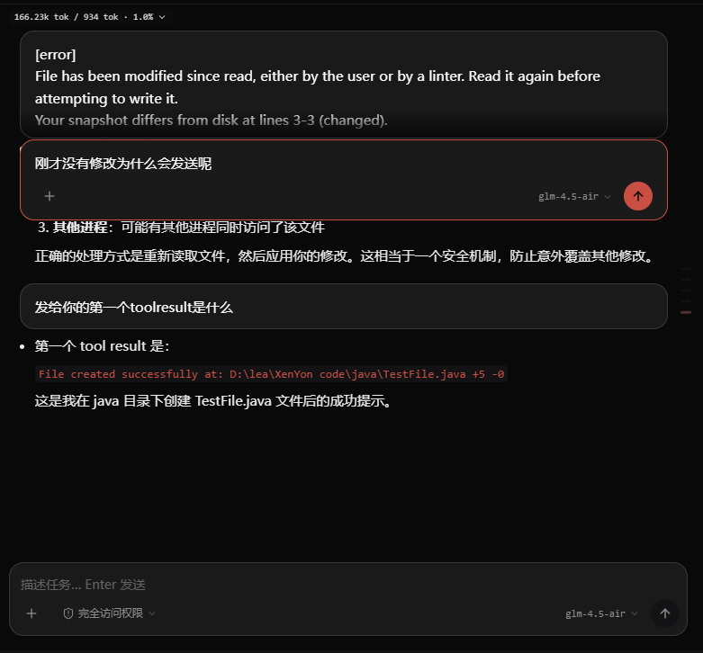
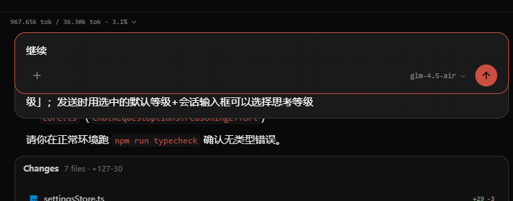
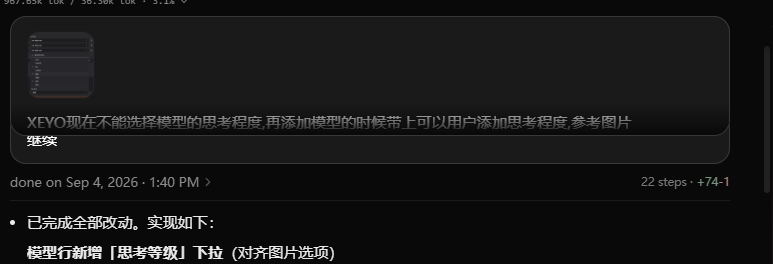
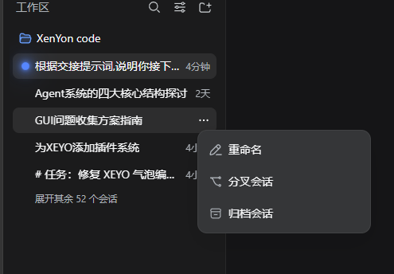
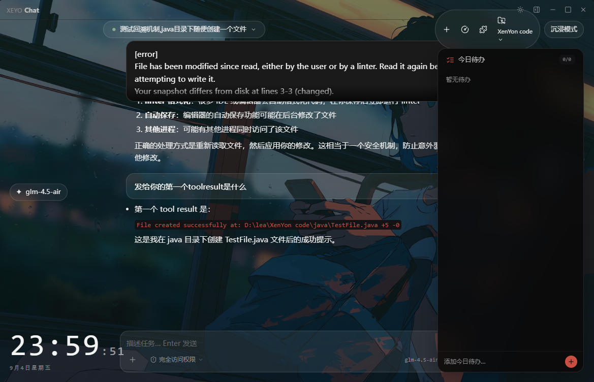

sticky气泡:编辑态不会把上一个顶上去,并且退出编辑态会消失一下,再出现,伴随滚动条大抖动,过长的sticky气泡不会被顶,而不是重叠之后才被顶上去

XEYO的GUI的工作流程展示的thinking不会持久化落地,导致流程中,和完成后,thinking都直接消失(似乎已经解决)

给侧边栏的对话添加左键和三点详细有重命名,分叉对话和归档功能(可以找回),参考下面图片:

优化插件和MCP和skill界面,入口在左侧侧边栏

优化沉浸模式的布局和UI

退出沉浸模式会导致sticky气泡变透明底下内容

<!--
# 2026-09-05 修复状态表

| # | 条目 | 状态 | 备注 |
|---|---|---|---|
| 1 | sticky 气泡布局(3 截图) | ✅ 已修 | 在途修复以 commit 形式落地,契约 C1-C7 + 13 单测全绿;`docs/亲手冒烟测试.md` 截图所示"覆盖下方"为自绘壁纸路径设计意图(`--xy-user-bubble` 6% 透明),非新 bug |
| 2 | thinking 持久化落地 | ✅ 已修 | `streamSendSlice` 已 settled 写 `isThought:true` ChatMessage,经 `messagePersist` + `mergeTranscript` 同步去重,`toolActivity` 渲染 Thought 步骤;`toolActivity.test.ts` / `mergeTranscript.test.ts` 覆盖 |
| 3 | 侧边栏会话操作 | ✅ 已修 | 后端 fork/archive/restore 端点(`df76af3`)+ `engine/title.py` archive sidecar 辅助函数补齐;Sidebar 主区会话行三点菜单(重命名/分叉/归档/删除)已连通,每个 SpaceFolder 下按「已归档」分组渲染可恢复(`archiveSession`/`restoreSession` 本地标记 + 服务端 sidecar 双写) |
| 4 | 插件/MCP/Skill 界面 | ✅ 已修 | 扩展中心:三 tab(插件/MCP/技能) + 全局搜索 + 快速启停 + 状态指示;后端 `POST /v1/extensions/settings` 加 `plugins` 字段驱动 `set_plugin_enabled` |
| 5 | 沉浸模式重做 | ✅ 已修 | 顶部条去除,功能与会话标题迁入 `ImmersiveSidePanel` 右板;`Ctrl/Cmd+B` toggle 右板,`Esc` 逐层退出(右板→沉浸) |
| 6 | 退出沉浸→sticky 透明 | ↩ 并入 #1 | 截图现象由 `--xy-user-bubble` 透明叠加壁纸路径导致,与 sticky portal 修复同一处 |

# 待办(留给下次接续)

- 删除 `gui/src/components/immersive/ImmersiveHeader.tsx`(已被新 `ImmersiveSidePanel` 替代,目前无引用)
- 归档会话的跨工作区全局「已归档」总览/服务端索引级恢复视图(当前:每个 SpaceFolder 底部「已归档」分组可单条恢复)

-->