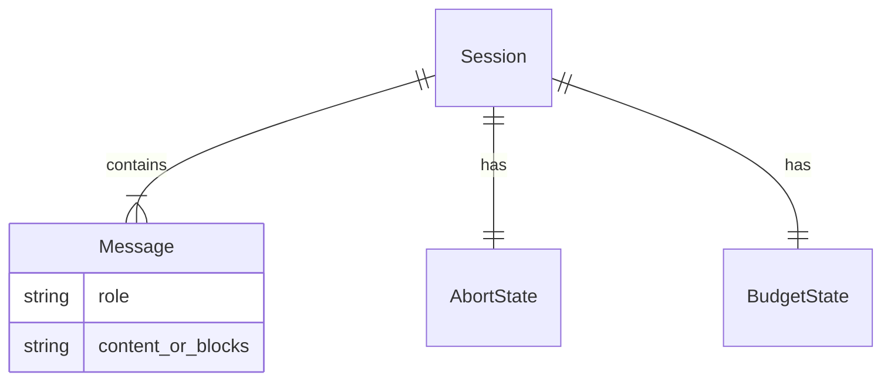
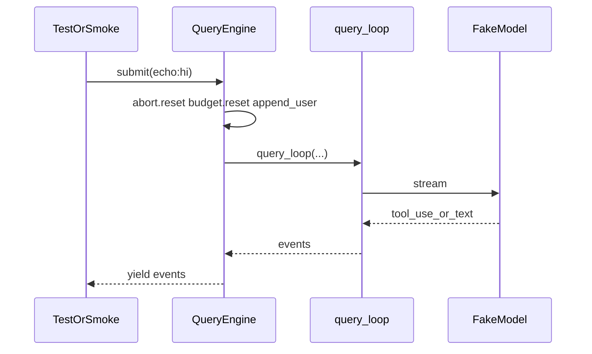

# Task0 — 解阻塞与主循环收口

> 对应总纲：[00-总计划书-可上线路线图.md](../%E6%80%BB%E7%BA%B2%E4%B8%8E%E8%B7%AF%E7%BA%BF/00-%E6%80%BB%E8%AE%A1%E5%88%92%E4%B9%A6-%E5%8F%AF%E4%B8%8A%E7%BA%BF%E8%B7%AF%E7%BA%BF%E5%9B%BE.md)  
> Claude 对照层：能跑通的「会话入口 + queryLoop 接线」，不抄 submitMessage 商业壳  
> 重点等级：**整阶段以 P0 为主**

---

## 1. 本阶段****目标**** / 非目标

### 目标

1. `from tools.catalog import build_default_registry` 与 `from engine.query_engine import QueryEngine` **必定成功**
2. 对外引擎 API 稳定：`submit` / `submit_message` / `interrupt` / `get_messages`（或 `mutable_messages`）/ `build_default_engine`
3. `SessionPool`、tests、smoke **同一套契约**
4. `pytest` 可安装可跑；Fake**** 模型****一轮对话成功

### 非目标

- 不实现完整权限 / Java / 新工具 ENABLED
- 不翻译 Claude `submitMessage` 斜杠命令、transcript 商业细节、system_init SDK 事件全集

---

## 2. 现状与缺口

| 项 | 现状 | 缺口 |
|---|---|---|
| permissions | 有最小类型 | 需保证 `__init__` 导出与 `filesystem` 一致，catalog 可 import |
| QueryEngine | 有 Config + submit | 与 SessionPool、旧测试、`build_default_engine` 对齐；去掉会炸的半成品路径 |
| requirements | 有 fastapi 等 | 补 `pytest` / `pytest-asyncio` |
| 端到端 | UI/Server 面在 | 引擎不稳则整链红 |

---

## 3. 本阶段 ER / 时序





---

## 4. 文件清单（路径 · 做什么 · 等级 · 依赖）

| 路径 | 做什么 | 等级 | 依赖 |
|---|---|---|---|
| `python/permissions/__init__.py` | 只导出真实存在的符号 | P0 | filesystem |
| `python/permissions/filesystem.py` | 保证 `PermissionDecision` 等可被 import；允许暂 stub | P0 | — |
| `python/engine/query_engine.py` | 收口构造与 `submit`/`interrupt`；Config 字段与调用方一致 | P0 | query_loop, SessionState |
| `python/engine/query_loop.py` | **原则上不改逻辑**；仅修明显 bug | P0 | — |
| `python/server/session_pool.py` | 按 QE 真实 API 构造（`model_client` 等） | P0 | query_engine, catalog |
| `python/scripts/smoke_engine.py` | Fake/`echo:hi` smoke | P0 | build_default_engine |
| `python/tests/test_query_engine_submit.py` 等 | 统一 `.submit` / Fake | P0 | QE |
| `python/requirements.txt` | 增加 pytest、pytest-asyncio | P0 | — |
| `python/pyproject.toml` | 确认 asyncio_mode | P1 | — |
| `python/engine/_recovered_qe.py`（若仍在） | 删除或移出路径，避免混淆 | P2 | — |

---

## 5. 实现步骤（勾选）

1. [ ] `py -3.11 -c "from permissions import PermissionDecision"` 成功  
2. [ ] `py -3.11 -c "from tools.catalog import build_default_registry; print(len(build_default_registry().schemas()))"` 成功  
3. [ ] 通读 `QueryEngine` + `SessionPool.get_or_create`，列出参数不一致处并改到一致  
4. [ ] `build_default_engine(model_backend="fake")` 可构造  
5. [ ] smoke：`async for ev in eng.submit("echo:hi")` 见到 tool/final  
6. [ ] `pip install pytest pytest-asyncio` 并写入 requirements  
7. [ ] `pytest -q` 核心用例绿（失败的先修或临时 skip 并记债，P0 不允许「整包无法收集」）  

---

## 6. 接口 / 事件契约（最小）

引擎对外（建议）：

```python
# 构造
QueryEngine(config: QueryEngineConfig)  # 必含 model_client, tools, cwd
# 或
build_default_engine(model_backend="fake"|"deepseek", cwd=..., max_turns=8)

# 回合
async for ev in engine.submit(text): ...
engine.interrupt()
messages = engine.mutable_messages  # 或 get_messages()
```

事件（与 `msgtypes/events.py` 对齐）：`assistant_delta` / `tool_call` / `tool_result` / `final` / `stopped` / `result`（若已有）。

---

## 7. 测试与手测

| 类型 | 内容 |
|---|---|
| 自动化 | test_query_loop_*、test_abort、test_max_turns、test_query_engine_submit |
| 手测 | smoke_engine；可选 `py -m server` + `/health` |

---

## 8. 完成定义 DoD

- [ ] catalog / QueryEngine import 无报错  
- [ ] Fake `echo:hi` 跑通  
- [ ] `pytest -q` 对主循环相关用例绿  
- [ ] SessionPool 能 `get_or_create` 不炸  

---

## 9. 下一 Task 入口条件

DoD 全勾后 → [task1-会话主循环完备.md](./task1-会话主循环完备.md)
