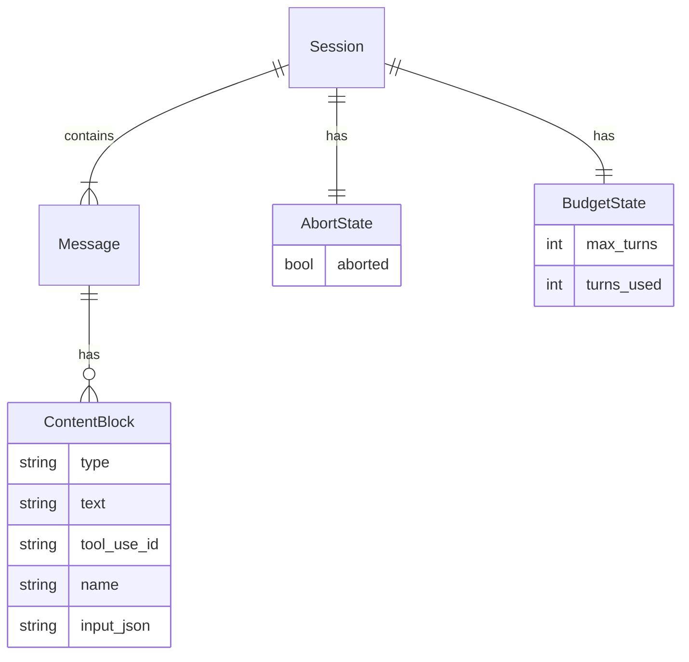
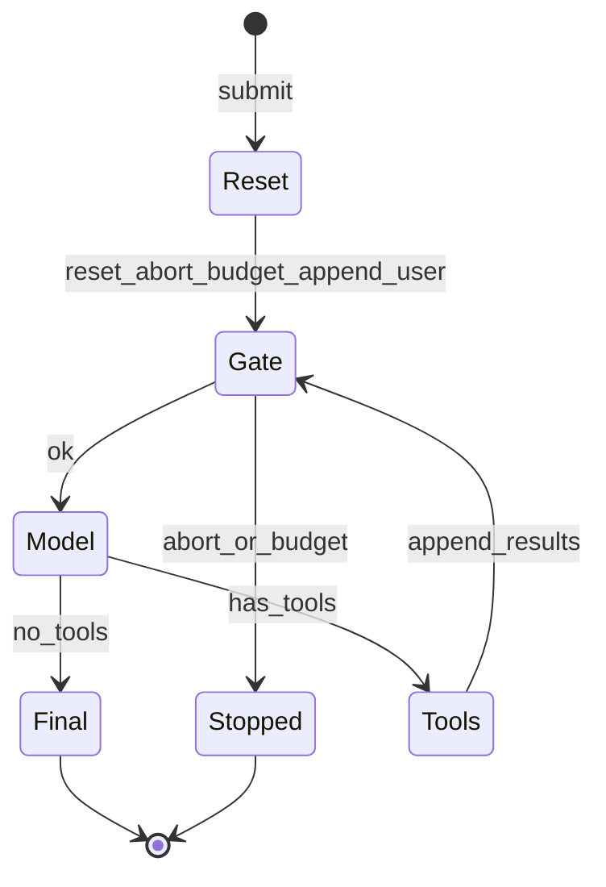

# Task1 — 会话主循环完备

> 总纲：[00-总计划书-可上线路线图.md](../%E6%80%BB%E7%BA%B2%E4%B8%8E%E8%B7%AF%E7%BA%BF/00-%E6%80%BB%E8%AE%A1%E5%88%92%E4%B9%A6-%E5%8F%AF%E4%B8%8A%E7%BA%BF%E8%B7%AF%E7%BA%BF%E5%9B%BE.md)  
> Claude 对照：`query.ts` 的 **queryLoop 状态机** + 消息写入；外壳只保留瘦身 submit  
> 前置：Task0 DoD 完成

---

## 1. 目标 / 非目标

### 目标

1. 一次 `submit` = 一轮用户 turn；多轮 `submit` 共用****历史****  
2. 门禁正确：`abort` → `stopped:aborted`；`max_turns` → `stopped:max_turns`  
3. system prompt 稳定拼装（custom / default / append）  
4. 事件流契约文档化且前后端可依赖  

### 非目标

- 斜杠命令系统、compact、SDK system_init 全家桶  
- 美元预算 / task_budget 商业计量（可留 TODO）

---

## 2. 现状与缺口

| 模块 | 现状 | 缺口 |
|---|---|---|
| query_loop | while + 工具回流 | 事件是否全覆盖、错误路径 |
| MessageStore | as_api_messages | tool_use/tool_result 与模型格式一致 |
| prompt | assembler + system_prompt | submit 路径是否每次调用 build_system |
| abort/budget | 有实现 | 每 submit 重置策略写清并测 |

---

## 3. ER / 时序





---

## 4. 文件清单

| 路径 | 做什么 | 等级 | 依赖 |
|---|---|---|---|
| `python/engine/query_loop.py` | 门禁、流式、工具串行、Stopped/Final | P0 | model, tools, store |
| `python/engine/query_engine.py` | 瘦身 submit 编排；调用 build_system | P0 | query_loop, prompt |
| `python/engine/abort.py` | reset / abort / raise_if_aborted | P0 | — |
| `python/engine/budget.py` | reset_for_submit / allow_next_turn | P0 | — |
| `python/session/message_store.py` | append / as_api_messages | P0 | msgtypes |
| `python/session/state.py` | SessionState 聚合 | P1 | abort, budget, store |
| `python/msgtypes/message.py` | user/assistant/tool_result 工厂 | P0 | — |
| `python/msgtypes/events.py` | EngineEvent 稳定字段 | P0 | — |
| `python/prompt/assembler.py` | build / build_system | P1 | system_prompt |
| `python/prompt/system_prompt.py` | fetch + assemble | P1 | — |
| `python/tests/test_session_continue.py` | 两轮续聊 | P0 | — |
| `python/tests/test_abort.py` | 中断 | P0 | — |
| `python/tests/test_max_turns.py` | 预算 | P0 | — |

---

## 5. 实现步骤

1. [ ] 画清「每 submit 重置什么、跨 submit 保留什么」写入本节 §6  
2. [ ] 保证 `as_api_messages` 对 DeepSeek/OpenAI 工具格式正确（或模型侧 normalize）  
3. [ ] submit 内：`abort.reset()` + `budget.reset_for_submit()` + append user + query_loop  
4. [ ] system：无 custom 用默认段落；有 custom 整段替换；append 追加  
5. [ ] 补测试：续聊历史变长；中断；max_turns  
6. [ ] 用 Fake 手<u>测两轮</u>对话  

### 状态约定（必须遵守）

| 状态 | 每 submit | 跨 submit |
|---|---|---|
| messages | 追加，不清空 | 保留 |
| abort | reset | 同实例可再 reset |
| budget turns | reset 计数 | max_turns 配置保留 |
| cwd / tools / model | 一般不变 | 保留 |

---

## 6. 事件契约（JSON 形态示例）

```json
{"type":"assistant_delta","text":"你好"}
{"type":"tool_call","name":"Glob","input":{"pattern":"**/*.py"}}
{"type":"tool_result","name":"Glob","output":"a.py\nb.py","is_error":false}
{"type":"final","text":"..."}
{"type":"stopped","reason":"aborted"}
```

服务端可再包成 OpenAI SSE；**引擎内部以 EngineEvent 为准**。

---

## 7. 测试与手测

| 剧本 | 期望 |
|---|---|
| 普通问答 | delta* + final |
| 第二轮提到第一轮内容 | 模型能续上（历史未丢） |
| 生成中 interrupt | stopped:aborted |
| max_turns=1 且强制工具环 | stopped:max_turns |

---

## 8. DoD

- [ ] 上述剧本自动化或手测通过  
- [ ] 事件字段与 `events.py` 一致  
- [ ] 文档本节「状态约定」与代码一致  

---

## 9. 下一 Task

→ [task2-工具协议与核心工具.md](./task2-工具协议与核心工具.md)
