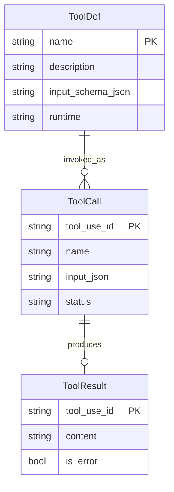
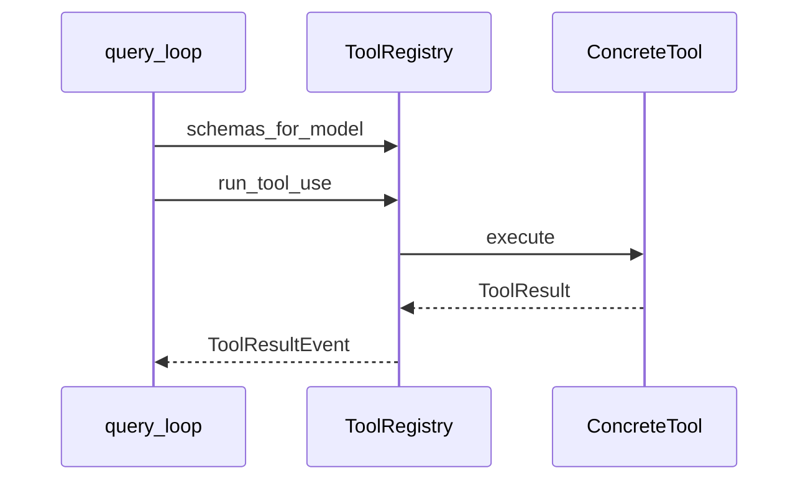

# Task2 — 工具协议与核心工具

> 总纲：[00-总计划书-可上线路线图.md](../%E6%80%BB%E7%BA%B2%E4%B8%8E%E8%B7%AF%E7%BA%BF/00-%E6%80%BB%E8%AE%A1%E5%88%92%E4%B9%A6-%E5%8F%AF%E4%B8%8A%E7%BA%BF%E8%B7%AF%E7%BA%BF%E5%9B%BE.md)  
> Claude 对照：`Tool.ts` 契约 + `runTools`/`runToolUse`（串行即可）+ 具体工具 call  
> 前置：Task1 DoD

---

## 1. 目标 / 非目标

### 目标

1. 统一协议：`name` + `schema()` + `async execute(input, abort) -> ToolResult`  
2. `ENABLED_TOOLS` 仅含**已实现**工具；空壳留在 `SCAFFOLD_TOOLS`  
3. 上线最小集可用：**Glob、Read、Grep、Bash**；**Write、Edit** 为 P1  
4. 剧本「Glob → Read → Grep」可演示  

### 非目标

- 启用全部 scaffold（Agent/MCP/LSP/Plan/Task*…）  
- 权限完整（属 Task3）；本阶段可先 cwd 内默认允许  

---

## 2. 现状与缺口

| 工具 | 现状 | 目标 |
|---|---|---|
| echo / getTime / Glob | 已有实现 | 保持 ENABLED |
| Read / Grep / Bash | 目录或 stub 不一 | 真实现 + ENABLED |
| Write / Edit | stub/半成品 | P1 实现 |
| 其余 | SCAFFOLD | 保持 stub |

---

## 3. ER / 时序





---

## 4. 文件清单

| 路径 | 做什么 | 等级 | 依赖 |
|---|---|---|---|
| `python/tools/base_tool.py` 或 `base.py` | Tool 协议 / ToolResult | P0 | — |
| `python/tools/tool_registry.py` | register / schemas / run | P0 | base |
| `python/tools/catalog.py` | ENABLED vs SCAFFOLD；工厂 | P0 | 各工具 |
| `python/tools/globtool/glob_tool.py` | 保持 rg Glob | P0 | permissions 可后接 |
| `python/tools/filereadtool/` 或 `file_read_tool` | Read 真实现 | P0 | cwd |
| `python/tools/greptool/` | Grep（rg） | P0 | cwd |
| `python/tools/bash_tool.py` | Bash/Shell，限制 cwd | P0 | abort, cwd |
| `python/tools/filewritetool/` | Write | P1 | permissions |
| `python/tools/fileedittool/` | Edit | P1 | permissions |
| `python/tools/echo.py` / `get_time.py` | 回归用 | P1 | — |
| `python/tools/stub.py` | not_implemented | P2 | — |
| 测试 `tests/test_*tool*`（新建） | 各工具单测 | P0 | — |

---

## 5. 实现步骤

1. [ ] 统一协议：所有 ENABLED 工具通过同一 Registry.run  
2. [ ] Read：绝对/相对路径、限行、二进制友好错误  
3. [ ] Grep：pattern + path + glob；结果截断  
4. [ ] Bash：timeout、cwd 限制、捕获 stdout/stderr；禁止明显危险命令可先简单黑名单（P1 细做）  
5. [ ] 移入 ENABLED；更新 `tools_system_hint`  
6. [ ] Write/Edit（P1）  
7. [ ] 剧本手测 + 单测  

---

## 6. Schema 示例（Read）

```json
{
  "name": "Read",
  "description": "读取工作区内文件",
  "input_schema": {
    "type": "object",
    "properties": {
      "file_path": {"type": "string"},
      "offset": {"type": "integer"},
      "limit": {"type": "integer"}
    },
    "required": ["file_path"]
  }
}
```

---

## 7. 测试与手测剧本

**剧本 B（上线必演）：**

1. 「用 Glob 找出 `query_loop.py`」  
2. 「读取该文件前 40 行」  
3. 「Grep `submit` 在 python/engine」  

---

## 8. DoD

- [ ] ENABLED ≥ Glob+Read+Grep+Bash（+ echo/getTime 可保留）  
- [ ] 无「not implemented」出现在 ENABLED  
- [ ] 剧本 B 通过  
- [ ] 相关单测绿  

---

## 9. 下一 Task

→ [task3-权限沙箱.md](./task3-权限沙箱.md)
