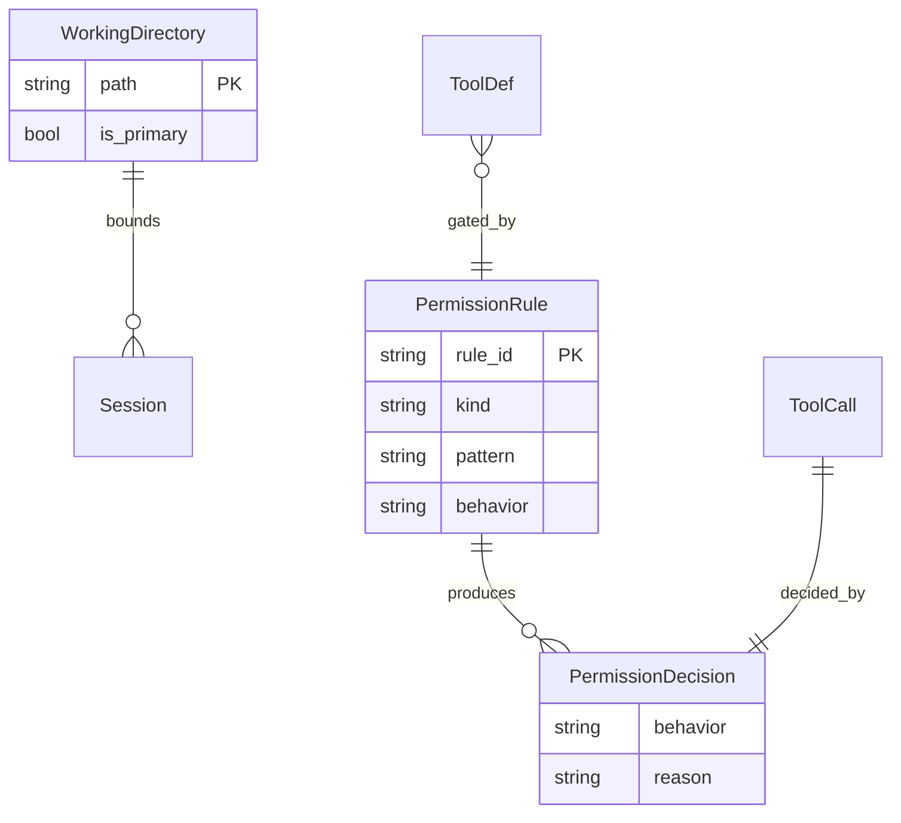
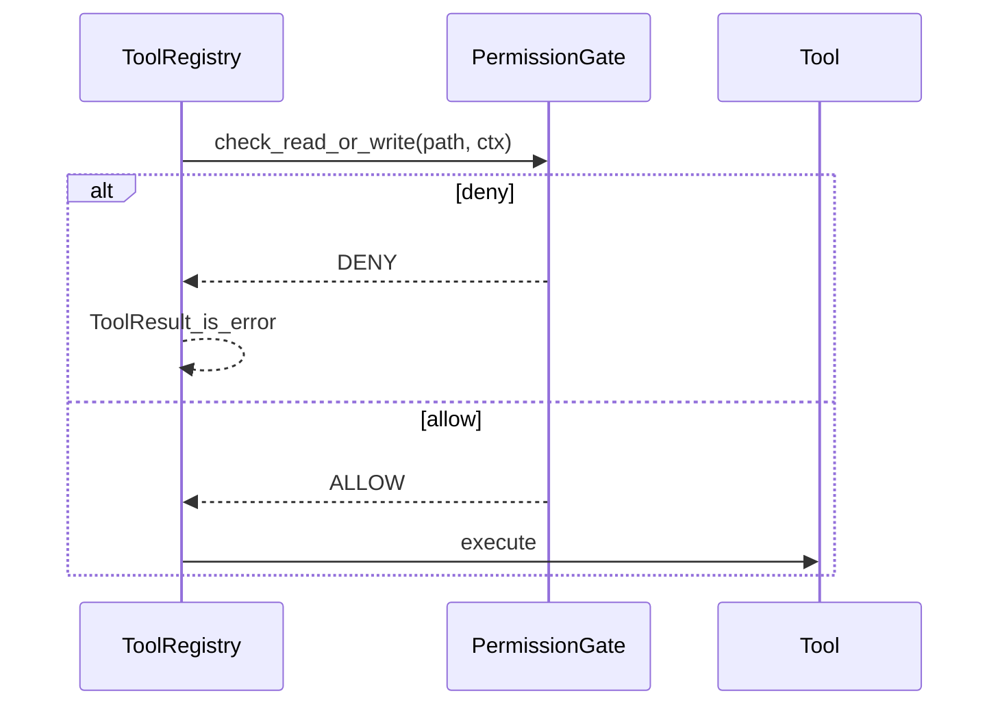

# Task3 — 权限沙箱

> 总纲：[00-总计划书-可上线路线图.md](../%E6%80%BB%E7%BA%B2%E4%B8%8E%E8%B7%AF%E7%BA%BF/00-%E6%80%BB%E8%AE%A1%E5%88%92%E4%B9%A6-%E5%8F%AF%E4%B8%8A%E7%BA%BF%E8%B7%AF%E7%BA%BF%E5%9B%BE.md)  
> Claude 对照：`canUseTool` + `checkReadPermissionForTool` **思想**；不抄跨平台/商业策略全家桶  
> 前置：Task2 核心工具可用  
> **本阶段是产品亮点之一**

---

## 1. 目标 / 非目标

### 目标

1. 裁决三态：**allow / deny / ask**（ask 第一版可先降级为 deny + 明确文案，或 UI 后续接）  
2. **工作区（cwd 及显式附加目录）内**默认可读；**区外**默认 deny  
3. 危险路径：`.git`、密钥类文件名等 → deny 或 ask  
4. 工具 `execute` 前统一走 gate（对齐 Claude「先权限后 call」）  

### 非目标

- 抄 `filesystem.ts` 全部 Windows ADS/UNC 纵深（可留最小 UNC deny）  
- 企业策略中心、组织级规则下发  
- macOS 特例  

---

## 2. 现状与缺口

| 项 | 现状 | 缺口 |
|---|---|---|
| PermissionDecision 枚举 | 可能已有 | 与 Registry 接线 |
| path_in_allowed_working_path | 部分 | 测全 |
| 工具内 check | Glob 等可能恒 True | 统一 gate |

---

## 3. ER / 时序





---

## 4. 文件清单

| 路径 | 做什么 | 等级 | 依赖 |
|---|---|---|---|
| `python/permissions/filesystem.py` | 工作区判断、危险路径、check_read/write | P0 | — |
| `python/permissions/__init__.py` | 导出 gate API | P0 | filesystem |
| `python/permissions/gate.py`（新建建议） | `can_use_tool(name, input, ctx) -> Decision` | P0 | filesystem, rules |
| `python/types/permissions.py` | 类型与枚举对齐 | P1 | — |
| `python/tools/tool_registry.py` | run 前调用 gate | P0 | gate |
| `python/session/cwd.py` | 提供主工作区 | P0 | — |
| Read/Grep/Bash/Glob/Write/Edit | 路径参数交给 gate | P0 | registry |
| `python/tests/test_permissions.py`（新建） | 区内允许、区外拒绝、危险路径 | P0 | — |
| CLI 权限弹窗 | ask UI | P2 | Task5 |

---

## 5. 实现步骤

1. [ ] 定义 `ToolPermissionContext(cwd, allowed_working_paths)`  
2. [ ] `path_in_allowed_working_path`：规范化 + 前缀判断（防 `..`）  
3. [ ] 危险目录/文件名黑名单  
4. [ ] `can_use_tool`：按工具类型选 read/write 检查  
5. [ ] Registry.run 接入；deny → `ToolResult(is_error=True)`  
6. [ ] 测试 + 演示：「读取 C:\Windows\...」被拒  

---

## 6. 裁决示例

```json
{"behavior":"deny","reason":"path_outside_working_directory","path":"D:\\other\\secret.txt"}
{"behavior":"allow","reason":"inside_cwd"}
{"behavior":"deny","reason":"dangerous_path", "path":"...\\.git\\config"}
```

---

## 7. 测试与手测

| 用例 | 期望 |
|---|---|
| 读 `python/engine/query_loop.py` | allow |
| 读工作区外绝对路径 | deny |
| 读 `.git/config`（若在区内） | deny 或 ask |
| Glob 区外 path | deny |

---

## 8. DoD

- [ ] Registry 统一 gate  
- [ ] 自动化测试覆盖区内外  
- [ ] 演示剧本可讲解「为何比裸 ChatAPI 安全」  

---

## 9. 下一 Task

→ [task4-服务端API稳定.md](./task4-服务端API稳定.md)
