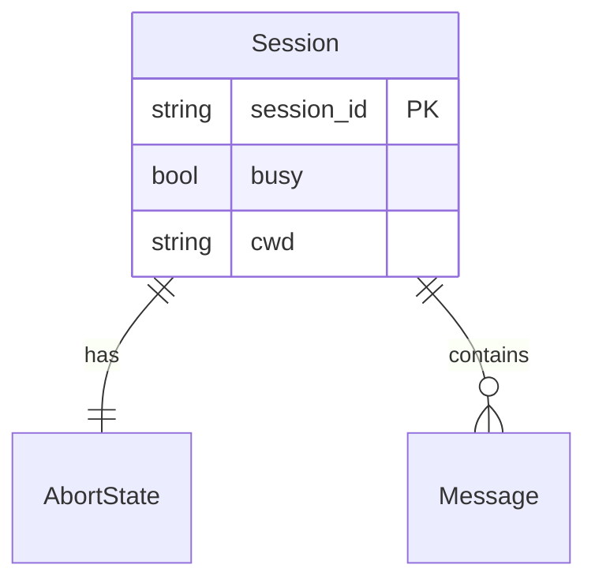
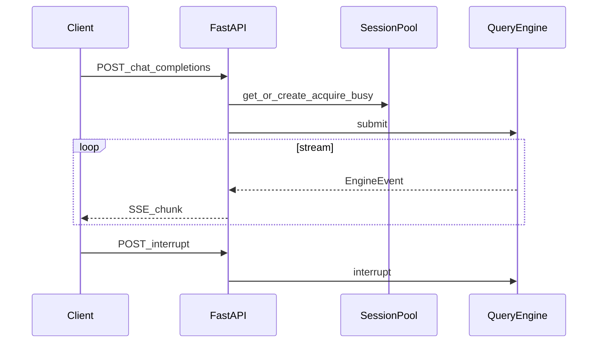

# Task4 — 服务端 API 稳定

> 总纲：[00-总计划书-可上线路线图.md](../%E6%80%BB%E7%BA%B2%E4%B8%8E%E8%B7%AF%E7%BA%BF/00-%E6%80%BB%E8%AE%A1%E5%88%92%E4%B9%A6-%E5%8F%AF%E4%B8%8A%E7%BA%BF%E8%B7%AF%E7%BA%BF%E5%9B%BE.md)  
> Claude 对照：headless/SDK 事件流思想；本项目用 **OpenAI 兼容 + SSE** 而非抄 SDK 售卖协议  
> 前置：Task1 主循环稳；建议 Task2 工具已可用  

---

## 1. 目标 / 非目标

### 目标

1. `POST /v1/chat/completions` 流式稳定（含 tool 轮次映射到 SSE/前端可解析事件）  
2. `interrupt` 接口可停住对应 session  
3. Session 隔离：busy 租约、历史不串号  
4. 错误模型可读：401 无 key、模型错误、工具错误  

### 非目标

- 公网鉴权 OAuth、多租户计费  
- 完整 OpenAI 全部分支兼容  

---

## 2. 现状与缺口

| 路径 | 现状 | 缺口 |
|---|---|---|
| `server/app.py` | FastAPI + SSE + 统一 `{error:{message,type}}` | — |
| `session_pool.py` | 池化 + busy + idle interrupt 幂等 | — |
| health | `/health`、`/api/health` | 启动器依赖 |

---

## 3. ER / 时序





---

## 4. 文件清单

| 路径 | 做什么 | 等级 | 依赖 |
|---|---|---|---|
| `python/server/app.py` | 路由、SSE 编码、校验、上传可选 | P0 | pool, events |
| `python/server/session_pool.py` | get_or_create、busy、interrupt、stash | P0 | QueryEngine |
| `python/server/__main__.py` | uvicorn 入口 | P0 | app |
| `python/bridge/http.py` | 遗留桥：标注废弃或与主路径对齐 | P2 | — |
| `XEYO.bat` | 等 `/health` 再启 UI | P1 | server |
| `python/tests/test_server_api.py` | 401 / busy / interrupt / health | P1 | — |

---

## 5. 实现步骤

1. [x] 文档化请求头：`Authorization: Bearer`、`X-Session-Id`  
2. [x] EngineEvent → SSE 映射表写进本节 §6，代码与之一致  
3. [x] interrupt：busy 中可停；未 busy 幂等（不排队毒下一轮）  
4. [x] 401/502/超时错误体统一 `{error:{message,type}}`  
5. [x] curl / TestClient 剧本（见 §7）  
6. [x] 两 session busy 互不阻塞（池测 + HTTP 测）  

---

## 6. 契约

### 6.1 请求头 / 字段

| 来源 | 字段 | 说明 |
|---|---|---|
| Header | `Authorization: Bearer <key>` | 必填；缺省 → 401 `authentication_error` |
| Header | `X-Session-Id` | 会话 id（也可放 body `session_id`） |
| Header | `X-Provider` | `deepseek` \| `openai` |
| Header | `X-Base-Url` | 可选覆盖 |
| Body | `model`, `messages`, `stream` | OpenAI 兼容 |

### 6.2 路由

| Method | Path | 说明 |
|---|---|---|
| `GET` | `/health` | 启动探针 |
| `POST` | `/v1/chat/completions` | 主对话（SSE 或 JSON） |
| `POST` | `/v1/interrupt` | body `{session_id}` — **真实路径** |
| `POST` | `/api/interrupt` | 同上别名 |
| `DELETE` | `/v1/sessions/{id}` | 丢弃内存引擎 |

### 6.3 EngineEvent → SSE

| EngineEvent | SSE |
|---|---|
| `AssistantDelta` | OpenAI chunk `choices[0].delta.content` |
| `ToolCallEvent` | 同结构 + `xy: {type:"tool_call", name, input}` |
| `ToolResultEvent` | 同结构 + `xy: {type:"tool_result", name, output, is_error, todos?}` |
| `FinalEvent` | 必要时补 content；`finish_reason: stop` |
| `StoppedEvent` | 文本 `[stopped: reason]` + finish stop |
| 流内异常 | `data: {"error":{"message","type":"model_error"}}` 然后 `[DONE]` |
| 结束 | `data: [DONE]` |

`ResultEvent`：当前不映射（前端不依赖）。

### 6.4 错误体

```json
{"error":{"message":"Missing API key...","type":"authentication_error"}}
```

| HTTP | type |
|---|---|
| 401 | `authentication_error` |
| 400 / 413 | `invalid_request` |
| 409 | `session_busy` |
| 502 | `model_error` |
| 500 | `server_error` |

工具失败走 in-band `xy.tool_result.is_error=true`，不是 HTTP 错误。

### 6.5 请求示例

```http
POST /v1/chat/completions
Authorization: Bearer sk-...
Content-Type: application/json
X-Session-Id: sess-1

{"model":"deepseek-chat","stream":true,"messages":[{"role":"user","content":"列出 *.py"}]}
```

### 6.6 Interrupt

```http
POST /v1/interrupt
Content-Type: application/json

{"session_id":"sess-1"}
```

---

## 7. 测试与手测

```powershell
# 单元 / 契约
cd python
py -3.11 tests/test_server_api.py

# 手测
curl http://127.0.0.1:8000/health
# 流式 POST（需真实 key）；另开终端:
curl -X POST http://127.0.0.1:8000/v1/interrupt -H "Content-Type: application/json" -d "{\"session_id\":\"YOUR_ID\"}"
```

---

## 8. DoD

- [x] curl / TestClient：health、401、busy、interrupt  
- [x] interrupt idle 幂等；busy 可停  
- [x] 无 key → 明确 401 + `authentication_error`  
- [x] Session 隔离（busy 互不串）  

---

## 9. 下一 Task

→ [task5-前端产品化.md](./task5-前端产品化.md)
