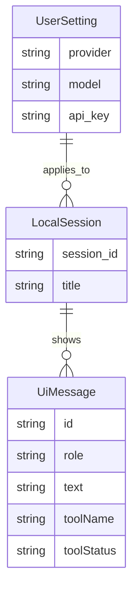
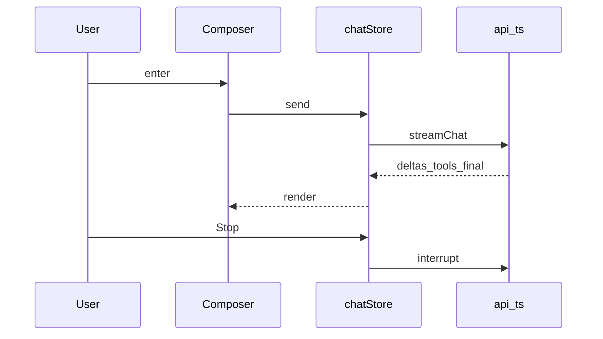

# Task5 — 前端产品化

> 总纲：[00-总计划书-可上线路线图.md](../%E6%80%BB%E7%BA%B2%E4%B8%8E%E8%B7%AF%E7%BA%BF/00-%E6%80%BB%E8%AE%A1%E5%88%92%E4%B9%A6-%E5%8F%AF%E4%B8%8A%E7%BA%BF%E8%B7%AF%E7%BA%BF%E5%9B%BE.md)  
> Claude 对照：交互层（REPL）职责——输入、流式展示、中断；**不**在前端跑主循环  
> 前置：Task4 API 稳定  

---

## 1. 目标 / 非目标

### 目标

1. 流式助手文本丝滑；工具调用/结果可视化  
2. Stop 按钮 → interrupt  
3. Settings：provider / model / api key 持久化  
4. 空态、加载态、错误态（401/网络）可读  
5. Tauri/Vite 启动路径有文档  

### 非目标

- 重做设计系统、大重构路由  
- 实现权限 ask 弹窗全流程（P2，可接 Task3）  

---

## 2. 现状与缺口

| 模块 | 现状 | 缺口 |
|---|---|---|
| ChatPage / Composer / MessageList | 已有 | — |
| api.ts streamChat | 对齐 Task4 `{error:{message,type}}` | — |
| settingsStore | key/model + 共享设置弹窗 | — |
| ErrorBanner | 横幅错误，不污染 transcript | — |
| ActivityLog / AssistantTurn | 工具时间线 | — |
| README | `dev` / `tauri:dev` / bat | — |

---

## 3. ER / 关系（前端视角）



> 前端 LocalSession 可与后端 Session 通过 session_id 对应；允许 IndexedDB 多存一份展示缓存。



---

## 4. 文件清单

| 路径 | 做什么 | 等级 | 依赖 |
|---|---|---|---|
| `gui/src/lib/api.ts` | 流式解析、interrupt 客户端 | P0 | server |
| `gui/src/stores/chatStore.ts` | 会话、流、stop、errorBanner | P0 | api |
| `gui/src/stores/settingsStore.ts` | key/model + settingsModalOpen | P0 | — |
| `gui/src/pages/ChatPage.tsx` | 页组装 + ErrorBanner | P0 | components |
| `gui/src/components/Composer.tsx` | 输入、发送、无 key CTA、Stop | P0 | — |
| `gui/src/components/ErrorBanner.tsx` | 401/网络横幅 | P0 | — |
| `gui/src/components/ChatHeader.tsx` | 共享设置弹窗 | P0 | — |
| `gui/src/components/SettingsModal.tsx` | 设置 + 空 key 高亮 | P0 | settingsStore |
| `gui/src/components/MessageList.tsx` | 列表滚动 | P0 | — |
| `gui/src/components/AssistantTurn.tsx` | 助手轮次+流式 | P0 | — |
| `gui/src/components/ActivityLog.tsx` | 工具活动 | P1 | — |
| `gui/vite.config.ts` | 代理 /v1 → 8000 | P0 | — |
| `gui/src-tauri/**` | 桌面壳 | P1 | — |
| `README.md` | 启动路径 | P0 | — |

---

## 5. 实现步骤

1. [x] 对照 Task4 事件映射，修解析漏洞（含 `error.message`）  
2. [x] 工具 RUNNING/COMPLETED/ERROR 展示（既有 ActivityLog + toolStatus）  
3. [x] Stop → interrupt → UI 恢复可输入  
4. [x] 无 key 打开设置引导（Composer CTA + send 拦截）  
5. [x] 401/网络错误横幅（`ErrorBanner`，不写脏 system 气泡）  
6. [x] README 写清 `npm run dev` vs `tauri:dev`  

---

## 6. UI 状态机（易懂）

```text
idle → sending → streaming → idle
                 ↘ tool_running ↗
streaming → stopping → idle
any → error_banner（不丢历史）
```

---

## 7. 手测剧本

1. 设 key → 普通聊天流式  
2. Glob/Read 可见工具行  
3. 生成中 Stop  
4. 错误 key / 无 key → 可读提示 + 可打开设置  

---

## 8. DoD

- [x] 上述 4 条手测路径已实现（请本地再过一遍）  
- [x] 代理/启动文档正确（根 `README.md`）  
- [x] 无控制台致命报错（以手测为准）  

---

## 9. 下一 Task

→ [task6-Java工具运行时.md](./task6-Java工具运行时.md)
