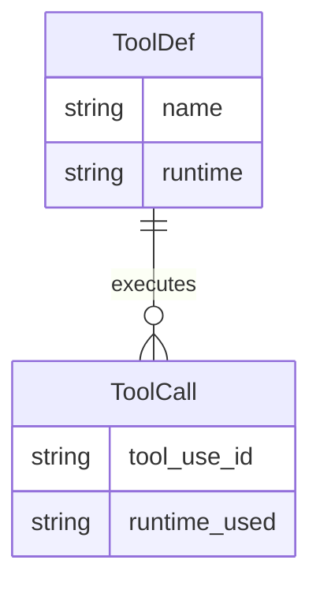
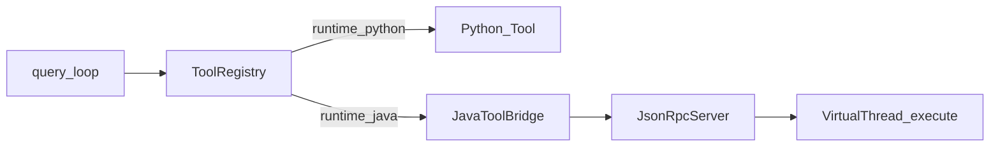

# Task6 — Java 21 虚拟线程工具运行时

> 总纲：[00-总计划书-可上线路线图.md](../%E6%80%BB%E7%BA%B2%E4%B8%8E%E8%B7%AF%E7%BA%BF/00-%E6%80%BB%E8%AE%A1%E5%88%92%E4%B9%A6-%E5%8F%AF%E4%B8%8A%E7%BA%BF%E8%B7%AF%E7%BA%BF%E5%9B%BE.md)  
> Claude 对照：工具副作用与编排分离的思想；Claude 多为同进程 TS，**本项目用 Java VT 做差异亮点**  
> 前置：Task2 工具协议稳定；建议 Task3 gate 已通  
> **秋招核心亮点**

---

## 1. 目标 / 非目标

### 目标

1. Java 进程提供 JSON-RPC（或 newline JSON）工具执行服务  
2. Read、Bash（可再加 Glob）在 **虚拟线程**上执行  
3. Python `ToolRegistry` 对部分工具走 **Java bridge**，编排仍在 Python  
4. 可演示：日志打印 `Thread.currentThread().isVirtual()`  

### 非目标

- 把 query_loop 搬到 Java  
- Spring Boot 全家桶（保持 JDK21 + 轻量依赖，与早期任务书一致）  
- 所有工具一次性迁完  

---

## 2. 现状与缺口

| 路径 | 现状 | 缺口 |
|---|---|---|
| `java/.../Tool.java` | 空/残缺 | 完整接口 + ToolResult |
| JsonRpcServer 等 | 空壳 | 实现 stdio 或 TCP |
| Python 侧 | 无 bridge | `JavaToolBridge` |

---

## 3. ER / 架构



`runtime`: `python` | `java`.



---

## 4. 文件清单

| 路径 | 做什么 | 等级 | 依赖 |
|---|---|---|---|
| `java/pom.xml` | Java 21、Jackson 等 | P0 | — |
| `java/.../tools/Tool.java` | name/schema/execute | P0 | — |
| `java/.../tools/ToolResult.java`（新建） | content/isError | P0 | — |
| `java/.../tools/ToolRegistry.java` | 注册 Read/Bash | P0 | Tool |
| `java/.../tools/FileReadTool.java`（新建） | 读文件 | P0 | — |
| `java/.../tools/BashTool.java`（新建） | 进程执行 | P0 | — |
| `java/.../rpc/JsonRpcServer.java` | 请求循环 | P0 | Registry |
| `java/.../rpc/RpcRequest.java` / `RpcResponse.java` | DTO | P0 | — |
| `java/.../tools/ToolRuntimeServer.java` | main 入口 | P0 | JsonRpcServer |
| `python/tools/java_bridge.py`（新建） | 子进程 RPC 客户端 | P0 | — |
| `python/tools/catalog.py` | Read/Bash 标 runtime=java 或包装 | P1 | bridge |
| `python/permissions` | 调用 Java 前仍做 gate | P0 | Task3 |
| 集成测试 / 手测脚本 | 验证 VT | P1 | — |

---

## 5. 实现步骤

1. [ ] 补齐 Java Tool + ToolResult + Registry  
2. [ ] JsonRpc：`tools/list`、`tools/call`  
3. [ ] FileReadTool / BashTool 用 `Executors.newVirtualThreadPerTaskExecutor()` 或 VT 直接 start  
4. [ ] Python 启动 `java -jar` 或 `mvn exec`，stdio JSONL  
5. [ ] catalog 切换 Read/Bash 到 bridge  
6. [ ] 权限：Python gate 通过后再 RPC  
7. [ ] 演示日志与 README 架构段  

---

## 6. RPC 契约示例

```json
{"id":"1","method":"tools/call","params":{"name":"Read","input":{"file_path":"a.py"}}}
{"id":"1","result":{"content":"...","is_error":false}}
```

---

## 7. 测试与手测

| 项 | 期望 |
|---|---|
| `tools/call` Read | 返回文件内容 |
| 并发两次 Bash | 虚拟线程执行 |
| gate deny | 不发起 RPC |

---

## 8. DoD

- [ ] Java 服务可独立启动  
- [ ] Python 编排下 Read 或 Bash 走 Java  
- [ ] 面试可画「编排/副作用分离」图  

---

## 9. 下一 Task

→ [task7-会话持久化与发布.md](./task7-会话持久化与发布.md)
