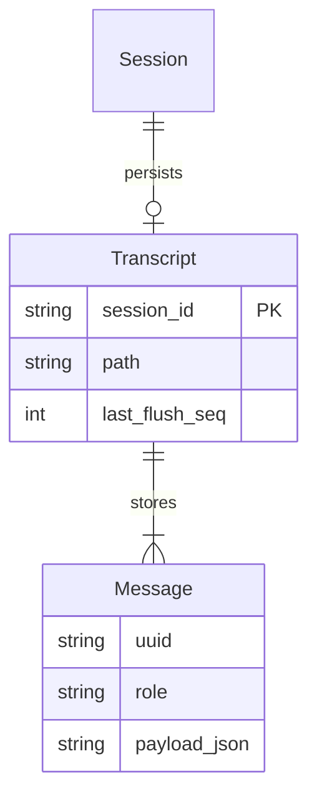
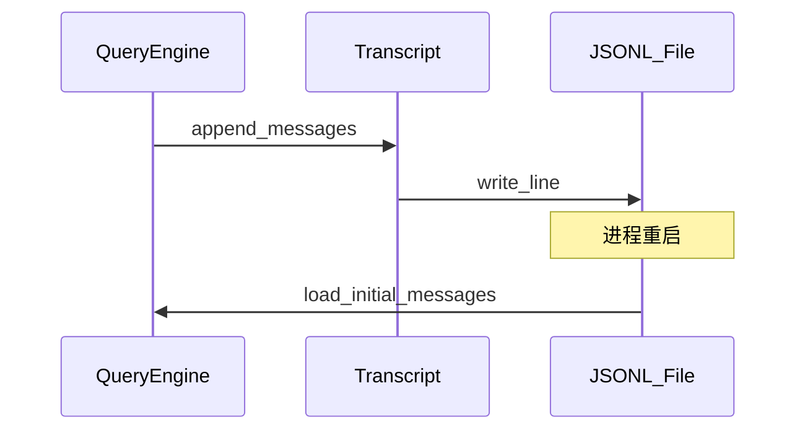

# Task7 — 会话持久化与发布

> 总纲：[00-总计划书-可上线路线图.md](../%E6%80%BB%E7%BA%B2%E4%B8%8E%E8%B7%AF%E7%BA%BF/00-%E6%80%BB%E8%AE%A1%E5%88%92%E4%B9%A6-%E5%8F%AF%E4%B8%8A%E7%BA%BF%E8%B7%AF%E7%BA%BF%E5%9B%BE.md)  
> Claude 对照：transcript / resume 思想；不做商业云同步售卖  
> 前置：Task4–5 可用；Task6 可选完成（未完成也可发布，需在 README 标明）  

---

## 1. 目标 / 非目标

### 目标

1. 会话消息 JSONL transcript；进程重启可 resume  
2. 一键启动稳定（bat + health）  
3. README + 架构图 + 演示剧本 + 上线检查单  
4. 核心 pytest 绿；录屏 1～2 分钟  

### 非目标

- 云端账号体系、协作售卖  
- 完美 UI 动效  

---

## 2. 现状与缺口

| 模块 | 现状 | 缺口 |
|---|---|---|
| `session/record_transcript.py` 等 | 可能部分存在 | 与 QE 接线、resume API |
| 启动器 | 有 bat | 失败提示友好 |
| README | 可能缺失 | 完整写作 |

---

## 3. ER

---

## 4. 文件清单

| 路径 | 做什么 | 等级 | 依赖 |
|---|---|---|---|
| `python/session/record_transcript.py` | 追加写、flush | P0 | — |
| `python/session/persistence.py` | 开关与路径 | P0 | — |
| `python/engine/query_engine.py` | submit 关键节点 record | P0 | transcript |
| `python/server/app.py` 或 pool | resume 加载 initial_messages | P0 | — |
| `python/tests/test_record_transcript.py` | 持久化测 | P0 | — |
| `XEYO.bat` | 一键启动 GUI（后端 + Tauri dev） | P0 | — |
| `.env.example` | 无密钥说明 | P0 | — |
| `README.md`（仓库根） | 动机/架构/运行/演示/局限 | P0 | — |
| `docs/00-总计划书-*.md` | 保持索引正确 | P1 | — |
| 演示录像（外链或 `docs/demo.md` 说明） | 脚本 | P1 | — |

---

## 5. 实现步骤

1. [ ] 确定 transcript 目录（如 `.xeyo/sessions/{id}.jsonl`）  
2. [ ] submit 成功路径追加 user/assistant/tool 消息  
3. [ ] 启动或 API：按 session_id 恢复 `initial_messages`  
4. [ ] 杀进程手测 resume  
5. [ ] README 五段：是什么、怎么跑、架构、演示、与 Claude 关系（参考非抄袭）  
6. [ ] 上线检查单全文勾选  
7. [ ] 冻结功能，只修 P0 bug  

---

## 6. 上线检查单（发布门禁）

- [ ] `XEYO.bat` 冷启动成功  
- [ ] `/health` 200  
- [ ] UI 流式对话（真 key 或 Fake 模式说明）  
- [ ] Glob→Read→Grep 剧本  
- [ ] 权限区外 deny  
- [ ] Stop/interrupt  
- [ ] 两轮续聊  
- [ ] resume（若已启用）  
- [ ] `pytest -q` 绿  
- [ ] Java VT 演示（若 Task6 完成）或 README 写明「规划中」  
- [ ] 无密钥进 git  

---

## 7. 面试三分钟口述提纲

1. 动机与边界  
2. 架构图（UI → Python loop → Tools → Java）  
3. 主循环状态机  
4. 权限沙箱  
5. 差异：VT 运行时  
6. 局限与下一步  

---

## 8. DoD

- [ ] 检查单 P0 项全勾  
- [ ] README 可让陌生人跑起来  
- [ ] 录屏或逐字演示脚本就绪  

---

## 9. 之后

功能冻结。新想法进 backlog，不阻塞「可上线」标签。
