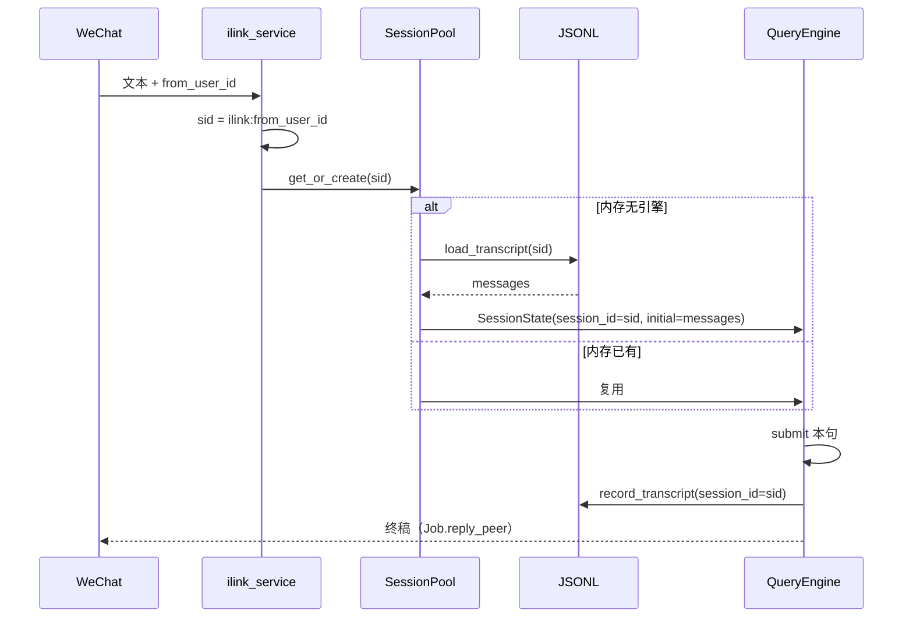
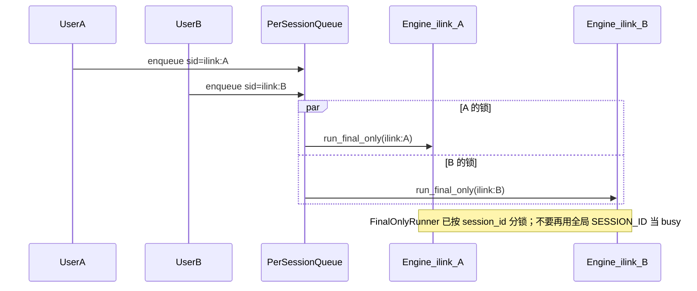

# Task8 — 远程微信：重启可续 + 按人隔离

> 总纲：[08-从Demo到企业级.md](../%E8%AE%BE%E8%AE%A1/08-%E4%BB%8EDemo%E5%88%B0%E4%BC%81%E4%B8%9A%E7%BA%A7.md) §9 缺口 1 / 缺口 3  
> 演示期总纲：[00-总计划书-可上线路线图.md](../%E6%80%BB%E7%BA%B2%E4%B8%8E%E8%B7%AF%E7%BA%BF/00-%E6%80%BB%E8%AE%A1%E5%88%92%E4%B9%A6-%E5%8F%AF%E4%B8%8A%E7%BA%BF%E8%B7%AF%E7%BA%BF%E5%9B%BE.md)  
> 前置：iLink / 文件助手通道已能对话；`record_transcript` 能写 JSONL，但 ID 对不齐  
> **本阶段只做远程微信这两件事，不做 compact / Java / MCP**

---

## 0. 一分钟读懂

微信远程现在能聊，但有两个产品级缺陷：

| # | 用户一句话 | 根因 |
|---|---|---|
| A | 关掉后端再开，微信里 Agent 不记得上一句 | HTTP/微信的 `session_id` 和引擎内部 `uuid4`、磁盘文件名是三套 ID |
| B | 两个微信号共用一个大脑 | iLink 入站写死 `session_id="ilink:default"`，忙闲/排队也按这一个键 |

文件传输助手是「登录这个网页的那一个人」，B 主要打 **iLink Bot**。A 两条通道都要修，否则微信路径杀进程必失忆（桌面还能靠客户端 prior 续上）。

```text
目标：
  同一微信号 → 固定会话 ilink:<from_user_id>
  该会话的 JSONL 文件名与 pool 键一致
  重启后端后，微信再说「上一句说了什么」能答
  两个微信号历史、busy、队列互不串

不要做：
  compact、权限 ask、Java VT、给文件助手做多账号、桌面多会话窗
```

---

## 1. 目标 / 非目标

### 目标

1. **重启可续（A）**：`SessionPool` 的键 = `SessionState.session_id` = transcript 文件名来源。冷启动 `load_transcript` → `Message` 列表 → `get_or_create(..., initial_messages=...)`。  
2. **按人隔离（B）**：iLink 用 `ilink:{from_user_id}`；busy、入站队列、interrupt 都按这个 id。出站用 Job 上的 `reply_peer` / `reply_ctx`，不靠全局 `_bridge.peer_id`。  
3. 前缀仍为 `ilink:` / `filehelper:`，现有 `startswith("ilink:")` 过滤不破。  
4. 自动化测试 + 两条手测剧本（重启续聊、双用户不串）。

### 非目标

| 不做 | 原因 |
|---|---|
| 上下文 compact | 另开任务；本阶段只保证「记得」不是「压历史」 |
| 文件助手按微信号拆会话 | 通道本身是一对一网页 |
| 桌面 Chat 多栏 / 多人 UI | 镜像仍以「最近一条入站 session」为准即可 |
| 云同步、多机共享 transcript | 仍是本机 `~/.xeyo/sessions/` |
| 改工具协议 / 启用 SCAFFOLD | 与本缺口无关 |

---

## 2. 现状与缺口（以仓库为准）

### 2.1 一条微信消息现在怎么走

```text
iLink 推送
  → service._from_user_id(msg)          # 已有 o9cq805…@im.wechat
  → _handle_user_msg
  → busy? 看的是 SESSION_ID="ilink:default"   # 所有人共用一把锁
  → _begin_inbound(..., session_id=SESSION_ID)
  → ILinkChannel.handle_inbound
  → FinalOnlyRunner.enqueue(session_id=sid)
  → SessionPool.get_or_create(sid)      # 内存引擎，不读盘
  → QueryEngine 内 SessionState.session_id = uuid4()  # 与 sid 无关
  → record_transcript → ~/.xeyo/sessions/<uuid>.jsonl
```

桌面：`POST /v1/chat/completions` 带 `X-Session-Id`，同样在 `QueryEngine.__init__` 丢掉，只把 pool 字典的键当了内存索引。

### 2.2 缺口 A — 三套 ID

| 层 | 实际值 | 文件 |
|---|---|---|
| 微信 / HTTP | `ilink:default` 或前端 session | `ilink/service.py` `_begin_inbound`；`server/app.py` |
| `SessionPool._engines` 键 | 同上（仅内存） | `session_pool.py` `get_or_create` |
| 引擎内部 | `uuid4().hex` | `session/state.py` 默认工厂 |
| JSONL 路径 | `~/.xeyo/sessions/<uuid>.jsonl` | `record_transcript` 用引擎内部 id |

`QueryEngine.__init__` 构造 `SessionState` 只传了 `cwd` 和 `budget`，**没有** `session_id`。  
`get_or_create` **从不**调用 `load_transcript()`。写盘函数本身是好的，接线是断的。

`run_final_only` 调用 `get_or_create(session_id, model_cfg)` **不传** `initial_messages`，微信路径比桌面更依赖磁盘（桌面还有 request body prior）。

### 2.3 缺口 B — 写死的一个大脑

| 点 | 代码 | 后果 |
|---|---|---|
| 入站 session | `_begin_inbound` 固定 `SESSION_ID` | 所有人同一 `QueryEngine` |
| `sender_id` | 写死 `"ilink"` | 审计/隔离没有真实 userId |
| busy / 排队 | `runner.session_busy(SESSION_ID)` + 全局 `_inbound_q` | A 在跑，B 的消息排进 A 的队列 |
| interrupt | `interrupt_session(SESSION_ID)` | 停 A 会误伤所有人 |
| 全局 `peer_id` | `_handle_user_msg` 里 `_bridge.peer_id = peer` | 两人同时聊，回信可能打错人 |
| 桌面镜像 | `_stream_text` / `_stream_tools` 单槽 | 两人流式会串到同一 UI |

`JobRecord` 已有 `reply_peer` / `reply_ctx`；`ILinkChannel.handle_inbound` 却从 `_bridge.peer_id` 取，而不是从 `InboundMessage.sender_id`。

`_from_user_id` 已能解析 `from_user_id` / `fromUserId`，只差拿它当 session 键。

---

## 3. 目标架构

### 3.1 会话键

```text
iLink:       ilink:{from_user_id}
             例：ilink:o9cq805KC3TySmv082wL0ROdBeHc@im.wechat
文件助手:     filehelper:default     （本阶段不拆）
桌面:        客户端 X-Session-Id（现状保留）
缺 from_id:  回退 ilink:default，并打 warning 日志
```

UI / SSE 过滤继续用 `session_id.startswith("ilink:")`，**不要**改成精确等于 `ilink:default`。

### 3.2 磁盘文件名

`transcript_path` 现在会丢掉 `:` `@`。本阶段改为可读且稳定：

```text
ilink:o9cq805…@im.wechat
  → ~/.xeyo/sessions/ilink__o9cq805KC3TySmv082wL0ROdBeHc_im_wechat.jsonl
```

规则：`:` → `__`，其余非 `[A-Za-z0-9._-]` → `_`。必须纯函数、双向不要求还原，只要同一 id 永远同一文件。

### 3.3 时序（重启续聊）



### 3.4 时序（两人同时聊）



`FinalOnlyRunner._lock_for(session_id)` **已经按 session 分锁**。修好入站 sid 后，两人可以并行跑（两个 engine）。不要再在 service 层用一把 `SESSION_ID` 把 B 推进 A 的队列，除非 **同一个** sid 正在 busy。

---

## 4. 文件清单

### 工作流 A — 重启可续（P0）

| 路径 | 做什么 | 等级 |
|---|---|---|
| `python/engine/query_engine.py` | `QueryEngineConfig` 增加 `session_id`；`SessionState(session_id=...)` | P0 |
| `python/server/session_pool.py` | `_build` 传入 sid；冷启动 `load_transcript` → hydrate | P0 |
| `python/session/hydrate.py` **新建** | JSONL dict → `Message`（role/content/id/tool_call_id/name） | P0 |
| `python/session/persistence.py` | `transcript_path` 稳定清洗 `:` / `@` | P0 |
| `python/session/__init__.py` | 导出 `messages_from_transcript` | P0 |
| `python/channels/runner.py` | `run_final_only` 走同一套 hydrate（不传 prior 也行） | P0 |
| `python/tests/test_resume_from_disk.py` **新建** | 写盘 → 新 Pool → 消息条数/内容一致 | P0 |
| `python/tests/test_record_transcript.py` | 覆盖 `ilink:user@im.wechat` 文件名稳定 | P0 |

### 工作流 B — 按人隔离（P0）

| 路径 | 做什么 | 等级 |
|---|---|---|
| `python/channels/ilink/__init__.py` | `session_id_for(from_user_id) -> str` | P0 |
| `python/channels/ilink/service.py` | `_begin_inbound` / busy / drain / interrupt 全部用 sid；入站带 peer/ctx | P0 |
| `python/channels/ilink/channel.py` | `enqueue(..., reply_peer=sender_id, reply_ctx=raw.ctx)` | P0 |
| `python/channels/filehelper/inbound_queue.py` | `QueuedInbound` 增加 `session_id`；可按 sid 查 busy（iLink 共用这个队列类） | P0 |
| `python/channels/ilink/broadcast.py` / status payload | 事件带 `session_id`；status 的 `session_id` 改为「最近入站」或列表 | P1 |
| `python/tests/test_ilink_channel.py` | 两 from_user_id → 两 session；busy 不互挡 | P0 |
| `gui/src/stores/remoteStore.ts` | SSE 带 sid 时：只镜像当前/最近 session（不要把两人流拼进同一气泡） | P1 |

文件助手：只吃工作流 A（`filehelper:default` 作为 pool 键写入 SessionState）。不要在 B 里改它的 SESSION_ID。

---

## 5. 实现步骤（按 PR 切，禁止合成一个大改）

### PR-A  引擎 session_id = 磁盘键

入口规则：本 PR 绿灯前不要改 iLink 路由。

1. [x] `QueryEngineConfig` 增加 `session_id: NotRequired[str]`  
2. [x] `QueryEngine.__init__`：`SessionState(cwd=..., budget=..., session_id=config.get("session_id") or uuid)`  
3. [x] `SessionPool._build(cfg, *, session_id, initial_messages)` 把 sid 写入 config  
4. [x] `session/hydrate.py`：`messages_from_rows(rows) -> list[Message]`；非法 role 跳过；content 保持 str 或 list  
5. [x] `get_or_create`：若将新建且 `not preserved`：  
   `rows = load_transcript(transcript_path(session_id))` → hydrate  
   桌面传入的 `initial_messages` **仅当磁盘为空**时作种子（磁盘优先，避免客户端旧缓存盖掉本机权威历史）  
6. [x] 修正 `transcript_path` 清洗规则（见 §3.2）  
7. [x] 测试：`test_resume_from_disk.py`  
   - Fake 模型跑一轮 submit → 新 `SessionPool` 同 sid → `mutable_messages` 含 user+assistant  
   - 不同 sid 互不读取  
   - `XEYO_NO_SESSION_PERSISTENCE=1` 不写盘、不读盘  

**PR-A 演示：** 桌面同一 `X-Session-Id` 重启后端仍续得上。微信此时仍共用 `ilink:default`，但这个键已经能落盘、能读回——单人重启微信不断号即可验。

### PR-B  iLink 按 from_user_id 分会话

前置：PR-A 已合。

1. [x] `session_id_for(uid)`：空 → `ilink:default`；否则 `ilink:{uid.strip()}`  
2. [x] `_handle_user_msg` 算出 `sid = session_id_for(from_id)`，往后禁止再写死 `SESSION_ID`（除回退）  
3. [x] `_begin_inbound(text, channel, *, images, peer, ctx, session_id)`  
   `InboundMessage(session_id=sid, sender_id=peer or "ilink", raw={"ctx": ctx}, ...)`  
4. [x] `ILinkChannel.handle_inbound`：`reply_peer=message.sender_id`，`reply_ctx=(raw or {}).get("ctx")`  
5. [x] busy：`runner.session_busy(sid)`；仅当 **该 sid** busy 时把消息推进队列（队列项必须带 `session_id`）  
6. [x] `_drain_inbound_queue`：弹出一项后用 **该项的 sid** 判断 busy，不要用全局 `SESSION_ID`  
7. [x] interrupt / status 查询：按 sid；status 可返回 `sessions: [{id, busy}]` 或 `last_session_id`  
8. [x] 停止把 `_bridge.peer_id` 当作出站唯一来源（命令短路径若仍 `_silent_send`，必须传 `to_user_id=peer`）  
9. [x] 测试：见 §7  
10. [x] P1：SSE/status 带 `session_id`；`remoteStore` 丢弃非当前镜像目标的 delta  

**PR-B 演示：** 两个微信号（或 mock 两个 from_user_id）各说一句互不相关的话，再各自问「我刚才说了什么」。

---

## 6. 关键函数契约

```python
# channels/ilink/__init__.py
def session_id_for(from_user_id: str | None) -> str:
    """返回 ilink:<id>；空则 ilink:default。"""

# session/hydrate.py
def messages_from_transcript(path: Path) -> list[Message]:
    """load_transcript + 校验字段；坏行跳过。"""

# session_pool.get_or_create
# 新建引擎时：
#   disk = messages_from_transcript(transcript_path(session_id))
#   seed = disk or initial_messages or stash
# QueryEngineConfig["session_id"] = session_id
```

磁盘 vs 客户端 prior（桌面）：

```text
磁盘有内容  → 用磁盘（权威）
磁盘空      → 用客户端 prior（兼容现有 ChatPage）
内存已有引擎 → 不 hydrate、不拿客户端 prior 覆盖（已有 test_empty_engine / #2）
```

---

## 7. 测试与手测

### 自动化（必须绿）

| 用例 | 期望 |
|---|---|
| `test_engine_session_id_matches_pool_key` | `eng._session.session_id == "ilink:u1"` |
| `test_resume_from_disk_roundtrip` | 写 2 条 → 新 Pool 同 sid → 2 条内容一致 |
| `test_resume_ignores_other_session_file` | sid A 读不到 B 的 jsonl |
| `test_transcript_path_ilink_user` | `ilink:x@im.wechat` 两次调用路径相同且无 `:` `@` |
| `test_session_id_for` | `o9cq…@im.wechat` → `ilink:o9cq…@im.wechat`；`""` → `ilink:default` |
| `test_two_users_enqueue_different_sessions` | mock 两 from_id，`enqueue` 的 sid 不同 |
| `test_busy_does_not_block_other_user` | A busy 时 B 仍直接 `_begin_inbound`，不进 A 的队列 |
| `test_handle_inbound_passes_reply_peer` | Job.reply_peer == sender_id |
| `test_accepts_stream_session_filters_other_user` | 桌面镜像只收当前 `_stream_session_id` 的 delta |
| `test_push_event_includes_session_id` | 入站 event 带 `session_id` |
| `cli` `remoteStore` / `remoteSession` | 另一 session 的 delta/tool 不进当前气泡；无 sid 旧载荷放行 |
| 现有 `test_history_continuity.py` / `test_ilink_channel.py` | 改断言：入站 sid 不再永远是 `SESSION_ID` |

### 手测剧本 A（单人重启）

1. iLink 扫码登录  
2. 微信发：「记住口令 banana-42」  
3. 等回复后 **停后端再启动**（桌面可开着）  
4. 微信发：「口令是什么？」  
5. 必须答出 banana-42  

失败形态：答「没有上文」或重新自我介绍 → PR-A 没接上或 sid 仍是随机 uuid。

### 手测剧本 B（双人隔离）

1. 微信号 A：「只改 README，口令 alpha」  
2. 微信号 B：「只改 LICENSE，口令 beta」  
3. A：「我的口令？你在改哪个文件？」→ alpha + README  
4. B：同样问 → beta + LICENSE  

失败形态：B 听到 alpha，或两人排队「上一轮还在跑」互相阻塞。

---

## 8. DoD

**A**

- [x] pool 键、`SessionState.session_id`、transcript 文件三者同一来源  
- [x] 微信路径不传 prior 也能在重启后 hydrate  
- [x] `test_resume_from_disk.py` 绿  
- [ ] 剧本 A 通过（手测）  

**B**

- [x] 生产入站不再写死 `ilink:default`（仅缺 from_id 时回退）  
- [x] 两人 busy / 队列 / 历史隔离  
- [x] 出站 `to_user_id` 来自 Job，不依赖事后覆盖的全局 peer  
- [x] 剧本 B 自动化（mock 两 from_id）；真机手测可选  

**文档**

- [x] README 远程微信补一句：重启可续、按微信用户隔离  
- [x] P1：SSE/status 带 `session_id` / `last_session_id` / `stream_session_id`；桌面只镜像最近入站  
- [x] 本文检查单勾完（手测剧本除外）  

---

## 9. 风险

| 风险 | 处理 |
|---|---|
| 旧 `~/.xeyo/sessions/<uuid>.jsonl` 成孤儿 | 不迁移；本阶段只保证新会话正确。README 注明「升级后旧随机文件不自动接上」 |
| `from_user_id` 偶发为空 | 回退 `ilink:default` + warning；避免静默丢消息 |
| 桌面 UI 两人流式混在一起 | PR-B 的 P1；P0 先保证引擎隔离（微信侧正确比桌面镜像重要） |
| 文件名过长 | userId 通常 < 80 字符；若超 180 则 hash 后缀，计划在 hydrate 测里兜住 |
| 现有测试写死 `SESSION_ID` | 改测试与实现同一 PR，禁止 skip |

---

## 10. 建议工时

| PR | 内容 | 估计 |
|---|---|---|
| A | 引擎 sid + 读盘 hydrate | 0.5～1 天 |
| B | iLink 路由 / 队列 / 出站 peer | 1 天 |
| P1 | SSE 带 sid + remoteStore 过滤 | 0.5 天 |

合计约 **2 个有效编码日**。不要平行开 compact。

---

## 11. 立刻执行

PR-A / PR-B / P1 代码已落地。下一步只做手测剧本 A（重启后续口令），以及可选真机双人隔离。

不要平行开 compact。
