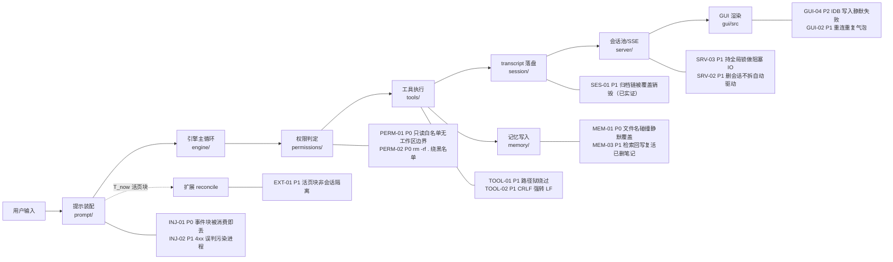

# XEYO 全项目 BUG 排查报告（2026-09-10）

> 口径：**只读静态审计 + 关键项动态实证**，未修改任何源文件。
> 范围：`python/`（引擎 / 服务端 / 权限 / 工具 / 记忆 / 提示注入 / 会话持久化 / 扩展）+ `gui/src`（React/TS/Zustand）。
> 方法：8 路并行子代理分区深读 → 聚合去重 → 对高影响结论逐条复核（读源码 / 实跑复现）。
> 本报告只列**缺陷**，不含修复方案。所有条目均给 `file:line` 与触发路径；置信度 `low` 的条目已注明不确定点，供你二次判定。

---

## 0. 总览

| 模块 | 条目数 | P0 | P1 | P2 |
| --- | --- | --- | --- | --- |
| 权限/安全 `permissions/` | 10 | 2 | 2 | 6 |
| 服务端 `server/` | 10 | 0 | 4 | 6 |
| 工具层 `tools/` | 11 | 0 | 6 | 5 |
| 记忆层 `memory/` | 12 | 1 | 4 | 7 |
| 提示注入 `prompt/` | 9 | 1 | 2 | 6 |
| GUI 前端 `gui/src` | 11 | 0 | 2 | 9 |
| 会话/协调 `session/` `coord/` | 6 | 0 | 3 | 3 |
| 扩展层 `extension/` | 2 | 0 | 1 | 1 |
| **合计** | **71** | **4** | **24** | **43** |

**缺陷类别分布**：并发/竞态 21 · 静默失败或吞错 14 · 路径/权限边界 9 · 状态不一致（索引↔源）9 · 边界/off-by-one 6 · 数据丢失（覆盖/丢行）6 · 缓存陈旧 4 · 预算/口径偏差 2。

### 缺陷在数据主链上的分布



---

## 1. 全局高危 TOP 12（建议优先判定）

| # | ID | 严重度 | 一句话 | 位置 | 置信度 |
| --- | --- | --- | --- | --- | --- |
| 1 | PERM-01 | P0 | Bash 只读白名单不校验工作区边界 → `cat /etc/shadow` 类任意文件读取被 ALLOW | `bash_policy.py:631-648` + `policy.py:940-945` | **已复核** high |
| 2 | PERM-02 | P0 | `rm -rf .` / `rm -rf *` 不命中根删黑名单 → 默认档直接 ALLOW，可删整个工作区（含 .git） | `bash_policy.py:22-36` + `policy.py:969-995` | **已复核+实证推理** high |
| 3 | INJ-01 | P0 | env_channel 4xx 回退时，reconcile/结算/待投 job 事件已被 drain 消费，回退路径提前 return → 事件永久静默丢失 | `pre_llm_inject.py:1182,1243,1280,1340-1344` + `query_loop.py:1211-1233` | high |
| 4 | MEM-01 | P0 | 记忆文件名只由 `type+title` 决定（忽略 scope/applies_to），判 `coexist` 的两条笔记落同一文件被 `os.replace` 静默覆盖 → 永久丢数据 | `memdir.py:248-251,359-379` + `memory_tool.py:462-474` | high |
| 5 | SES-01 | P1 | transcript 轮转归档链搬移方向写反 → 每次轮转**覆盖销毁上一代归档**，实际只保 1 代；与"保留 2 代"承诺相悖 | `record_transcript.py:81-97` | **已实跑实证** high |
| 6 | SRV-03 | P1 | `get_or_create` 持有全局锁期间执行阻塞 I/O（建 registry/attach MCP/读盘）→ 冻结整个事件循环，所有 SSE 秒级卡顿 | `session_pool.py:237-300,426-527` | high |
| 7 | SRV-02 | P1 | 删会话未拆除 goal-driver/inbox/job 的 per-session 状态 → 已删会话被永动生成僵尸合成轮 + 状态堆积 | `routers/sessions.py:191-270` | high |
| 8 | TOOL-01 | P1 | `offload_read` 自身无权限/路径校验，可读工作区外任意文件（含密钥） | `offload_read_tool.py:46-62` | **已复核** high |
| 9 | TOOL-02 | P1 | `Write` 丢弃已检测到的行尾、硬编码 `line_endings="LF"` → CRLF 文件整文件行尾被改，Windows 仓库炸假 diff | `file_write_tool.py:317-319,372` | high |
| 10 | MEM-03 | P1 | 检索命中即 `touch_last_used` 回写整文件（读路径上的写）→ 与 `forget` 竞态可**复活刚被删除的笔记** | `search.py:254-261` + `memdir.py:394-400` | high |
| 11 | EXT-01 | P1 | reconcile 待发布活页块是**进程全局列表**（无会话 key）→ 会话 A 的"你停用了 X"事件可能注入到会话 B 的上下文，陈述失真 | `reconcile.py:20-64` | **已复核** high |
| 12 | SES-02 | P1 | transcript 后台 writer 批次写盘失败仍推进 `_written_seq` → `flush_transcript()` 返回成功，实际行数全丢 | `record_transcript.py:134-140,183-191` | **已复核** high |

---

## 2. 权限 / 安全层（`permissions/`）

| ID | 严重度 | 标题 | file:line | 置信度 |
| --- | --- | --- | --- | --- |
| PERM-01 | P0 | Bash 只读白名单无工作区边界 | `bash_policy.py:631-648`；`policy.py:940-945`；`filesystem.py:68-85` | high（已复核） |
| PERM-02 | P0 | `rm -rf .`/`rm -rf *` 绕过根删黑名单 | `bash_policy.py:22-36`；`policy.py:969-995` | high（已复核） |
| PERM-03 | P1 | 企业拒绝策略加载异常被吞 → fail-open 落到 `mcp_policy_decision`，`always_allow` 工具被放行 | `policy.py:1183-1197,1271-1286`；`mcp_client.py:292-297` | high |
| PERM-04 | P1 | `is_secret_path`/`is_dangerous_path` 不跟 realpath，max 档下工作区内软链逃逸密钥/危险 DENY | `filesystem.py:157-188` vs `127-154` | medium |
| PERM-05 | P2 | 命令替换隐藏 token，密钥读 DENY 降级为 ASK | `bash_policy.py:599-609,542` | medium |
| PERM-06 | P2 | `gate.can_use_tool` 不传 `tool` → mcp「移除→DENY」门被跳过 | `gate.py:55` vs `policy.py:1201-1212` | medium |
| PERM-07 | P2 | grant 按 `matched_rule` 粗粒度放行，覆盖危险路径确认（`write_risk_ask`/`read_ask`） | `store.py:459-497`；`policy.py:1363-1386` | medium |
| PERM-08 | P2 | resolve 用 `command_summary`（已 redact）算指纹、evaluate 用原始 command → grant 静默失效（fail-closed） | `control.py:180-186` vs `policy.py:1363-1368` | medium |
| PERM-09 | P2 | 策略/规则缓存以 mtime 为键，粗 mtime 文件系统上改策略不刷新 | `workspace_policy.py:151-174`；`bash_policy.py:424-504` | low |
| PERM-10 | P2 | `_prune()` 迭代 `dict.items()` 时 `pop`，多线程下 `RuntimeError` 中断权限流程 | `store.py:229-239`；`ask_store.py:120-128` | low |

**PERM-01 证据**（已复核）：
```python
# bash_policy.py:631  —— 只判 composite/重定向/密钥 token/规则，无任何路径边界检查
def bash_readonly_allow(command, *, cwd=None) -> bool:
    text = _normalize_command(command)
    if not text or _COMPOSITE_RX.search(text): return False
    if re.search(r"(?:>>?|2>>?|&>>)", text): return False
    if bash_secret_read_reason(text): return False
    return bash_rule_decision(text, cwd=cwd) == "allow"
# policy.py:940  —— 命中即 ALLOW
if bash_readonly_allow(command, cwd=cwd):
    return PolicyDecision(decision=PermissionDecision.ALLOW, reason="bash_readonly_allow", ...)
```
对照：`Read`/`Grep` 走 `check_read_permission_for_path`（`filesystem.py:261-284`）会拒绝工作区外路径 → Bash 成为绕开 Read 路径狱的通道。

**PERM-02 证据**（已复核）：两条 rm 正则均要求标志之后出现 `/`、`\` 或 `--no-preserve-root`：
```python
r"\brm\s+(-[a-zA-Z]*r[a-zA-Z]*f[a-zA-Z]*|...).*(?:[/\\](?:\s|$)|--no-preserve-root)"
```
`rm -rf .`、`rm -rf *`、`rm -rf subdir` 均不命中 → 进入 `policy.py:969` 写路径 → 目标在工作区内、非密钥/策略/受保护元数据 → `mode != "always"` 且 `is_dangerous_path(cwd)` 为假 → `policy.py:991` **ALLOW**。
放大点：`_bash_write_path_block`（`policy.py:1109-1134`）保护工作区内 `.git/.xeyo/.agents`，但 `rm -rf .` 一次性删除工作区根，使该保护被整体绕过。

---

## 3. 服务端（`server/`）

| ID | 严重度 | 标题 | file:line | 置信度 |
| --- | --- | --- | --- | --- |
| SRV-01 | P1 | Job Registry 终态任务永不驱逐，内存无上限增长（且无 per-session drop） | `job_registry.py:150-160,422-445` | high |
| SRV-02 | P1 | `delete_session` 不拆 goal-driver/inbox/job 状态 → 僵尸合成轮 + 堆积 | `routers/sessions.py:191-270` | high |
| SRV-03 | P1 | `get_or_create` 持全局锁做阻塞 I/O，冻结事件循环 | `session_pool.py:237-300,426-527` | high |
| SRV-04 | P1 | agent retry 持租约不续租，超 stale 窗被回收 → 同会话并发双 turn | `routers/sessions.py:1116,1179-1201` + `session_pool.py:602-611` | medium |
| SRV-05 | P2 | `create_session` 不写会话白名单索引，而 fork/delete 会 → 新建会话可能被 list 过滤掉 | `routers/sessions.py:51-65` vs `533-545` | medium |
| SRV-06 | P2 | settlement 时 inbox 与 goal/job 合成轮抢 busy 租约 → inbox 项被置 stuck，需人工恢复 | `inbox_registry.py:408-479` + `chat.py:793` | medium |
| SRV-07 | P2 | 慢速 SSE 订阅者队列溢出被静默断流（无 `[DONE]`） | `engine/turn_runner.py:430,274-295,456-460` | medium |
| SRV-08 | P2 | 重连 replay 读有界缓冲，长 turn 前缀帧被逐出后**永久无法补回** | `engine/turn_runner.py:21-24,434-438` | high |
| SRV-09 | P2 | 路由层 `except Exception` 把内部错误吞成 200/空响应；`rewind.py` 反向漏栈 | `control.py:54-55,94-95,121,292-294`；`jobs.py:35-36`；`rewind.py:180-189` | medium |
| SRV-10 | P2 | `settle` 与事件循环共用同一把 RLock，监听回调阻塞会拖停事件循环 | `job_registry.py:426-437` | medium |

**SRV-02 要点**：`goal_round_driver.drop_session`、`inbox_registry.drop_session` **已存在**且被 `rewind.py:122,130` 调用，但 `delete_session` 从不调用；job registry 甚至没有 drop。结果：armed goal 的会话被删后，`on_turn_settled → _schedule` 仍持续为已删会话排程合成轮。

---

## 4. 工具层（`tools/`）

| ID | 严重度 | 标题 | file:line | 置信度 |
| --- | --- | --- | --- | --- |
| TOOL-01 | P1 | `offload_read` 无权限/路径校验，可读任意文件 | `offload_read_tool.py:46-62` | high（已复核） |
| TOOL-02 | P1 | `Write` 硬编码 LF，CRLF 文件被整文件改行尾（`Edit` 正确保留，二者不一致） | `file_write_tool.py:317-319,372` | high |
| TOOL-03 | P1 | Bash docker 分支 `is_error` 恒 False 且丢退出码 → 失败报成功 | `bash_tool.py:569-573` | medium |
| TOOL-04 | P1 | Glob 大小写重试仅第 1 页触发 → 分页混用两种匹配模式 | `glob_tool.py:883,656-658` | medium-high |
| TOOL-05 | P1 | Grep count 模式对**分页后切片**求和，再宣称 "Found N total" → 超限少报 | `grep_tool.py:634-644` | high |
| TOOL-06 | P1 | POSIX 超时只 kill shell 不杀子进程树 → 孤儿进程 | `bash_tool/runner.py:81-82` | medium |
| TOOL-07 | P2 | Grep content 排序把 `--` 上下文分隔行甩到结果最顶端 | `grep_tool.py:316-324,608` | high |
| TOOL-08 | P2 | `Read` 按 `\n` 切分，尾随换行产生 phantom 行 → total_lines off-by-one | `file_read_tool.py:474-475` | medium |
| TOOL-09 | P2 | `Read` 无 limit 时静默截断 2000 行且不透传 total_lines → 模型误以为读全 | `file_read_tool.py:508,543-557` | medium |
| TOOL-10 | P2 | `Edit` 的 `old_string` 含 CRLF 时匹配失败（内容一致却报 not found） | `fileio/text.py:103-111` | medium |
| TOOL-11 | P2 | registry 预算 spill 包的是"已截断内容"，却标称 full output | `tool_registry.py:204-234` | medium |

**TOOL-01 备注**：该工具 `exposure=hidden`（不进 schema），故触发需模型"幻觉调用"或被注入内容诱导；但 `execute()` 内确实无 `check_permissions` 与路径狱，与 `Read` 行为不对等。

---

## 5. 记忆层（`memory/`）

| ID | 严重度 | 标题 | file:line | 置信度 |
| --- | --- | --- | --- | --- |
| MEM-01 | P0 | `topic_filename` 忽略 scope/applies_to → `coexist` 判定的两条笔记同文件被 `os.replace` 静默覆盖，旧笔记物理消失且 supersedes 链断裂 | `memdir.py:248-251,359-379`；`memory_tool.py:462-474` | high |
| MEM-02 | P1 | 索引失效签名 `(mtime,size)`，`sha` 列不参与比较 → 同秒同字节数编辑不失效（Windows 秒级 mtime 高危） | `memindex.py:144-193`（158-160） | medium |
| MEM-03 | P1 | 检索命中即回写整文件（读路径上的写）→ 与 `forget` 竞态可复活已删笔记 | `search.py:254-261`；`memdir.py:394-400` | high |
| MEM-04 | P1 | `Memory(write)` 非原子 load-then-write，并发丢 supersede 判定 + 被文件名碰撞吞掉 | `memory_tool.py:451-479` | high |
| MEM-05 | P1 | candidates/tombstone/journal 整文件重写或非原子追加，跨进程并发丢更新 | `nightshift.py:215-303`；`memdir.py:442-451`；`journal.py:64-72` | medium |
| MEM-06 | P2 | `rewrite_index` 只取前 200 条 active → MEMORY.md 导航长期不完整 | `memdir.py:299-318` | high |
| MEM-07 | P2 | `get_value` 完全忽略环境变量，与 `apply_to_environ`/文档"手动 env 仍可用"自相矛盾 | `memory_switches.py:158-176` vs `213-227` | medium |
| MEM-08 | P2 | `load_notes_cached` 静默 `continue` 丢弃坏/演进 schema 笔记，无审计 | `memindex.py:230-238` | medium |
| MEM-09 | P2 | NightShift 晋升一律写 `type="feedback"`，原始类型语义丢失 | `nightshift.py:524-533` | high |
| MEM-10 | P2 | `_expired` 用字符串比较 `expires_at`，格式/时区不一致可能误判过期 | `nightshift.py:416-419` | low |
| MEM-11 | P2 | journal 末行损坏 → `_tail_seq` 回落 1，可能 seq 重复 + freshness 误判（跳过全量回退） | `journal.py:120-134,202-209` | low |
| MEM-12 | P2 | 读路径 `load_notes` 每次都写 sqlite 且无事务包裹，多会话并发可读到半同步状态 | `memindex.py:144-193,214-239` | medium |

---

## 6. 提示注入 / KV 前缀（`prompt/`）

> 好消息：**KV 前缀不变式本身成立** —— env 伪对严格尾插、`tools` 数组会话内冻结、历史字节不变，`tests/test_cache_prefix_invariant.py` 与 `test_t_now_block_registry.py` 覆盖良好。以下缺陷均在该覆盖之外。

| ID | 严重度 | 标题 | file:line | 置信度 |
| --- | --- | --- | --- | --- |
| INJ-01 | P0 | SKIP 回退时 drain 类事件已被消费却未送达，且回退路径不再 drain → 永久静默丢失 | `pre_llm_inject.py:1182,1243,1280,1340-1344` + `query_loop.py:1219-1233` | high（已复核代码路径） |
| INJ-02 | P1 | `ENV_FALLBACK_STATUS` 含 400/413/422 等用户/模型可触发的状态码 → 误归因并写**进程级**备忘，污染同 provider:model 的所有后续会话 | `t_now_strategy.py:87`；`query_loop.py:1211-1219` | high |
| INJ-03 | P1 | `transcript_pointer_shadow` 把库存块 prepend 进伪造 env 对的 user（混 text+tool_result）→ 归一化后挂在 tool_result 之后，投影/持久化语义漂移 | `transcript_pointer_shadow.py:106-118`；`model/_openai_common.py:205-212` | medium |
| INJ-04 | P2 | Anthropic 环境声道必 400（`xeyo_env_notice` 不在 tools 数组），每进程每模型白费一次请求 | `model/anthropic.py:251-300` | medium |
| INJ-05 | P2 | 首轮嗅探 env 伪对使 `ends_with_tool_result` 误判 fresh-user 轮为 after_tools（仅首轮） | `query_loop.py:993-995`；`pre_llm_inject.py:1042-1045` | medium |
| INJ-06 | P2 | 承 INJ-05：首轮 `skill_preinvoke` 被 `not after_tools` 跳过 → 首轮 `/技能名` 直呼失效 | `pre_llm_inject.py:1302` | medium |
| INJ-07 | P2 | T_now 总预算按字符计且不含 header/分隔符/tool 信封开销，上链字节可超 6000 上限 | `pre_llm_inject.py:812,1308-1348` | medium |
| INJ-08 | P2 | `_projected_tokens` 用 4 字符/token 启发式（且含 env 投影），与厂商计费口径系统性偏差 | `query_loop.py:382-402,1280` | low |
| INJ-09 | P2 | 回退语义三处不一致：生产源码 SKIP / 任务背景称 legacy 重建 / release 打包副本仍返回 legacy | `query_loop.py:1206-1233` vs `gui/src-tauri/target/release/python/prompt/t_now_strategy.py:66` | low |

---

## 7. GUI 前端（`gui/src`）

| ID | 严重度 | 标题 | file:line | 置信度 |
| --- | --- | --- | --- | --- |
| GUI-01 | P2 | 流变非活跃时 `flushFrame` 早退，但缓冲已清空 → 已收到的 delta/工具事件静默丢失 | `stores/chat/streamSendSlice.ts:651-691` | medium |
| GUI-02 | P1 | 断流重连后 cursor 重叠 → 追加**重复 assistant 气泡**（末条文本≠整段重放文本，去重失效） | `stores/chat/streamRecoverySlice.ts:474-498` + `chat/streamHelpers.ts:353-378` | medium |
| GUI-03 | P2 | reattach 工具事件无 `toolUseId` 时 id 碰撞（`tool-${Date.now()}`）→ 多条工具互相覆盖 | `stores/chat/streamRecoverySlice.ts:344-373,375-397` | medium |
| GUI-04 | P2 | IndexedDB 写入失败被 `void`/`.catch(()=>{})` 吞掉，配额满丢数据无提示（"换入口丢数据"根因之一） | `streamRecoverySlice.ts:76,168,366,484`；`lib/db.ts` | high |
| GUI-05 | P2 | 切换会话时编辑态被 `activeId` effect 直接归零，绕过 `cancelEdit` 平滑收尾 → **退出编辑态闪一下** | `components/messageList/useMessageListEditing.ts:451-466` vs `705-803` | medium |
| GUI-06 | P2 | reattach `onToolResult` 按 `name+running` 匹配，同名两个 running 工具会改错行 | `streamRecoverySlice.ts:383-397` | medium |
| GUI-07 | P2 | `dbUpgrade` 仅在 store 不存在时建索引，旧库缺索引不补 → 运行期 `getAllFromIndex` 抛错 | `lib/db.ts:50-67` | low |
| GUI-08 | P2 | `onError(connection_lost)` 时 pending tools 未 settle 即清空 → 晚到工具结果丢失 | `streamSendSlice.ts:1291-1386` + `streamRecoverySlice.ts:508-516` | medium |
| GUI-09 | P2 | stopGeneration 时 rAF 缓冲中未并入 `streamingText` 的末段 token 永久丢失 | `streamSendSlice.ts:651-691` | medium |
| GUI-10 | P2 | reattach 未接线 `onUsage`/`onCompression` → 重连回合用量统计缺失（slice 漂移） | `streamRecoverySlice.ts:330,337` | low |
| GUI-11 | P2 | `recoverAfterDisconnect` 因 `recoveryBySession` 命中即返回 true，原 `onError` 直接 return → 半残状态待用户手动操作 | `streamRecoverySlice.ts:110-130` | medium |

**GUI-05 备注**：这正是你此前反馈的"退出历史气泡编辑态闪一下"的一类路径——`cancelEdit`（`705-803`）专门用 `scrollTo({behavior:'smooth'})` + `max-height` 过渡避免跳动，而 `activeId` effect 是零动画硬切。

子代理另外复查并**已排除**的误报：`sendMessage` 双流竞态（await 续延时序不可达）、drain 路径重复 append（`appendAssistantProse` 有去重）、列表 index key（实际用 `round.id`）、`sessionSwitching` 落后一帧（语义正确）、typewriter 缓存陈旧（四分支正确处理）。

---

## 8. 会话持久化 / 协调层（`session/` `coord/`）— 本轮亲自补查

| ID | 严重度 | 标题 | file:line | 置信度 |
| --- | --- | --- | --- | --- |
| SES-01 | P1 | transcript 轮转把归档链搬移方向写反 → 覆盖销毁上一代归档 | `record_transcript.py:81-97` | high（**已实跑复现**） |
| SES-02 | P1 | writer 批次写盘失败仍推进 `_written_seq` → `flush_transcript()` 假成功 | `record_transcript.py:134-140,183-191` | high（已复核） |
| SES-03 | P1 | `record_transcript_sync` 直写与后台队列对同一 path 无全序保证 → 后调用的同步写可能先落盘，transcript 顺序错乱 | `record_transcript.py:259-283` vs `286-323` | medium |
| SES-04 | P2 | `record_ui_thoughts` 调 `should_persist()` 不传 session 级开关，与 `record_transcript` 不一致 | `record_transcript.py:369` vs `306` | low |
| SES-05 | P2 | `ws_index._cache`/`_loaded` 永不失效 → 其它进程写入的归属记录本进程永不可见 | `session/ws_index.py:67-71,41-64` | high |
| SES-06 | P2 | `_read_all` 遇 OSError 返回部分缓存，而 `_ensure_loaded` 仍置 `_loaded=True` → 一次瞬时 I/O 错误永久冻结索引视图 | `session/ws_index.py:62-63,67-71` | medium |
| SES-07 | P2 | `coord.FileGuard` 纯 mtime stale（TTL 10s）无续租 → 临界区超 TTL 时互斥静默失效 | `coord/locking.py:41-48,68-83` | medium |

**SES-01 实证记录**（真实模块、临时目录、真实 `_maybe_rotate`）：
```
构造： s.jsonl=CURRENT(1602B)  s.jsonl.old1=ARCHIVE1  s.jsonl.old2=ARCHIVE2
调用： m._maybe_rotate(p)
结果： s.jsonl     = (不存在)
       s.jsonl.old1 = CURRENT…      ← 覆盖掉了 ARCHIVE1
       s.jsonl.old2 = (不存在)      ← ARCHIVE2 被 unlink 后未发生 .old2→.old1 搬移
```
根因：`rotated_transcript_paths` 返回 `[.old2, .old1]`（最旧→最新），但循环 `for i in range(len(olds)-1): os.replace(olds[i], olds[i+1])` 按"最旧→最新"方向搬移，实际应为 `.old1 → .old2`。且 `olds[0]` 刚被 unlink，搬移条件恒为假，最终 `os.replace(path, olds[-1])` 直接覆盖最新归档。**每次轮转销毁一代**，`_ROTATION_KEEP=2` 名不副实。

**SES-02 证据**：
```python
try:
    _write_batch(batch)
except Exception:                      # 写盘失败仅记 debug
    _logger.debug("transcript writer batch failed", exc_info=True)
with _cv:
    _written_seq = max(_written_seq, max_seq)   # 仍宣告"已写完"
    _cv.notify_all()
```
→ 磁盘满/权限错误的持久故障下，`flush_pending_sync()` 判 `_written_seq >= _submitted_seq` 成立并返回 `True`，`flush_transcript()` 静默"成功"，本回合消息全部不落盘。

---

## 9. 扩展层（`extension/`）— 本轮亲自补查

| ID | 严重度 | 标题 | file:line | 置信度 |
| --- | --- | --- | --- | --- |
| EXT-01 | P1 | reconcile 待发布块为**进程全局** `_PENDING`（无 session id），`consume_reconcile_blocks` 全局取走 → 跨会话事件串台，B 会话收到"A 会话的停用通知"且措辞称"用户停用了 X" | `extension/reconcile.py:20-64` | high（已复核） |
| EXT-02 | P2 | `publish_if_changed` 先写 `_LAST_DIGESTS` 再 `build_block()`；若 `build_block()` 抛错或返回空，digest 已置位 → 该状态值永久不再发布，块从未送达 | `extension/reconcile.py:37-46` | medium（已复核） |

---

## 10. 复核说明与未覆盖项（诚实声明）

**我亲自复核/实证的条目**：PERM-01、PERM-02、TOOL-01、MEM-01（`topic_filename` 定义）、INJ-01/02（`query_loop.py:1205-1233` + `pre_llm_inject.py:1340-1344`）、SES-01（实跑）、SES-02、EXT-01、EXT-02。
其余条目为子代理深读结论，均带 `file:line` 与触发路径；`low` 置信度条目请优先自行判定。

**本次未覆盖/覆盖不足**（建议后续补）：
1. `python/engine/query_loop.py`、`query_engine.py`、`subagent_runner.py` 主循环的**系统性状态机审查**——因触发子代理限额，本报告仅覆盖其与注入回退交互的部分（INJ-01/02/05/06）。
2. `python/rewind/service.py`(1800) / `hotpath.py`(1024) 的 rewind v2/v3 双轨完整性与幂等 —— 同一原因未覆盖（AGENTS/记忆里"三条旁路绕过 rewind"是否成立也待验）。
3. `python/extension/mcp_client.py`(1545) 的连接生命周期与重试幂等。
4. `python/channels/`、`python/bridge/`、`python/sidecar/`、`tui/`（SSE 25+ 事件 vs TUI 17 的具体缺口）。
5. `python/permissions/` 的 `policy.py`(1700) 仅覆盖 bash 与 mcp 分支，Write/Edit/Read 全路径分支未穷尽。
6. `gui/src/components/Composer.tsx`(1778)、`SettingsModal.tsx`(1958) 等巨石组件未逐行审。

**本轮已排除的已知项**（避免与既有台账重复）：`XEYO_BENCH_MINIMAL` 相关、记忆自动召回恒关（`query_loop.py:356`）、三条旁路绕主链的"存在性"本身（本次仅报其与权限/回滚的**交互缺陷**）。

**待确认的疑似项**（置信度不足，未计入 71 条）：
- `ENV_FALLBACK_STATUS` 是否应含 413（"payload too large" 通常由用户上下文触发，而非 env 伪对）。
- `job_registry._settle` 的锁外 `_fire_done/_fire_changed` 中若回调重入 registry 是否构成线程间死锁（取决于实际监听实现）。

---

## 附：工作树状态提示

排查期间 `git status` 显示工作树有大量跨功能在途改动（`python/engine/*`、`python/memory/*`、`python/permissions/*`、`gui/src/components/*` 等）。本报告为**只读**结论，未触碰任何在途改动；后续若要修复，需先按 AGENTS.md 第 2 条确认这些改动的归属，避免把其它会话的在途工作卷入提交。
