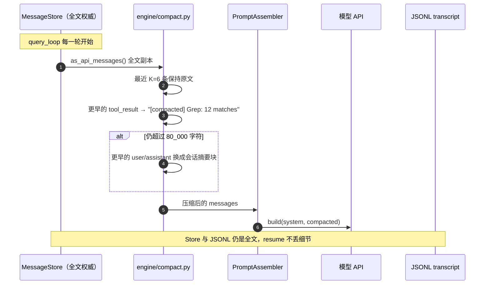
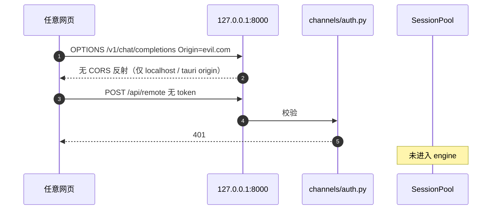
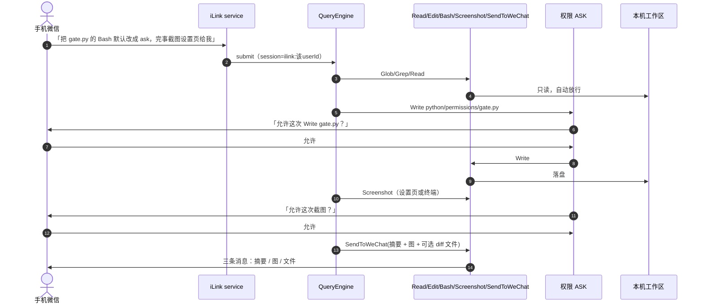

# XEYO 企业级落地计划（时序 + 理由 + 排期）

> 日期：2026-08-14
>
> 对照代码：Task8（重启续聊 + iLink 按人隔离）**已落地**
>
> 产品身份总纲：[08-从Demo到企业级.md](../%E8%AE%BE%E8%AE%A1/08-%E4%BB%8EDemo%E5%88%B0%E4%BC%81%E4%B8%9A%E7%BA%A7.md)
>
> 本文是 **执行版**：每周改哪些文件、为什么、时序怎么走、怎么验收。未完成上一层 DoD 不进入**下一层**。

---

## 0. 一句话

XEYO 已经能在本机**改代**码、从微信遥控。它仍像玩具，是因为 **长对话会炸、危险操作不问人、事后查不出、挂了用户看不懂、没有一条每天必用的完整工作流**。

企业级在这里 **不是** K8s / 多租户 / 计费中台，而是：

```text
别人电脑上连续用一周不丢人
危险操作可拒绝、可确认、可审计
离开工位时，微信能安全地让本机 Agent 干活
```

**唯一亮点（已选定，不再摇摆）：** 微信是第一等公民交互面，不是 IDE 插件的附属通知。Java VT / MCP / 18 个脚手架全部后置。

---

## 1. 今天真实到哪（以仓库为准，不是以旧文档为准）

### 1.1 已经不是 Demo 的部分

| 能力 | 代码事实 | 用户体感 |
| --- | --- | --- |
| Agentic 主循环 | `engine/query_loop.py`：流式、工具回流、abort、max_turns、安全/不安全分区 | 能多轮改文件，能 Stop |
| 真工具 | Glob / Grep / Read / Write / Edit / Bash / TodoWrite / Screenshot / SendToWeChat | 能读改搜跑、截图、把文件打回微信 |
| 路径沙箱 | `permissions/gate.py` + filesystem；Bash 有 `bash_deny_reason` 黑名单 | 工作区外写盘会拒；`rm -rf` 一类会拒 |
| 会话 ID 对齐 | `QueryEngineConfig.session_id` = pool 键 = JSONL 文件名；`hydrate.py` 冷启动读盘 | 杀后端再开，同一 `session_id` 能续 |
| 微信按人隔离 | `session_id_for(uid)` → `ilink:{from_user_id}`；队列按 sid 分片 | 两个微信号不串大脑 |
| 双入口 | 桌面 `POST /v1/chat/completions` SSE；微信 iLink / 文件助手 → `FinalOnlyRunner` | 同一套 engine |

### 1.2 仍然是玩具的证据（按伤害排序）

| # | 缺口 | 代码事实 | 为什么这是企业级阻塞 |
| --- | --- | --- | --- |
| 1 | 长对话必炸 | `query_loop` 每轮把 `store.as_api_messages()` **全文**塞模型；无 compact | 用几天后 400 / 变蠢，自己都不愿意每天开 |
| 2 | 费用预算是空字段 | `max_budget_usd` 注释「暂未使用」；`BudgetTracker` 只计 turn/chars | 工具循环跑飞不知道花了多少钱 |
| 3 | ASK 是假的 | 枚举有 ASK，`enforce_decision` 降成 DENY；无 UI/微信确认环 | 不能给同事用：要么全放行，要么静默拒绝 |
| 4 | 无审计 | Registry.run 前后不落盘 | 出事无法回答「谁、何时、调了什么」 |
| 5 | 策略写死在代码 | `_ALWAYS_ALLOW` 含 Screenshot；无 `.xeyo-policy.json` | 换仓库不能换策略，不是可交付物 |
| 6 | CORS `*` | `server/app.py` `allow_origins=["*"]` | 本机产品被任意网页打 |
| 7 | 错误不可读 | 401/429/rg 缺失/微信掉线常冒栈 | 别人装上第一天就会卸载 |
| 8 | 18 个空壳工具仍在 catalog | `SCAFFOLD_TOOLS` 全 `not_implemented`（默认 registry **未注册**，危险在「一不小心启用」） | 模型一旦看到 schema 会去调，体验更差 |
| 9 | Java VT 空壳 | `JsonRpcServer.java` / `ToolRuntimeServer.java` 空类 | README 再写「核心亮点」就是假宣传 |

**结论：** Task0–5 + Task8 把「能跑的骨架」做完了。从今天起进度不再用「又对齐了 Claude 哪个文件」衡量，只用「用户连续 5 天愿不愿意用」衡量。

---

## 2. 产品身份（写死，否则继续发散）

```text
XEYO = 跑在你电脑上的编码 Agent
         + 微信是第一等公民的交互面
         + 每次副作用可拒绝、可确认、可审计
```

| 是 | 不是 | 理由 |
| --- | --- | --- |
| 单机本地 Agent | 多租户 SaaS | 没有运维团队，SaaS 会把安全模型整个推翻 |
| 微信遥控本机 | 又一个 Cursor 子集 | IDE 赛道已被占满；微信遥控是别人不做的楔子 |
| 策略跟仓库走 | 云端组织策略后台 | 本地产品的企业级 = 可治理，不是控制台 |
| Python 编排 + 本机工具 | 先做 Java VT | 用户无感的「架构亮点」排在可用之后 |
| 9 个真工具打磨透 | 启用 18 个 stub | 空壳 schema 会污染模型选工具 |

---

## 3. 现状主路径（先看懂，再改）

### 3.1 一条微信消息现在怎么走

你现在这条消息的 session 键是 `ilink:o9cq805KC3TySmv082wL0ROdBeHc@im.wechat`（Task8 已按 `from_user_id` 隔离）。

```mermaid
sequenceDiagram
  autonumber
  actor User as 微信用户
  participant ILink as iLink 云
  participant Svc as ilink/service.py
  participant Q as InboundQueue
  participant Ch as ILinkChannel
  participant Runner as FinalOnlyRunner
  participant Pool as SessionPool
  participant Eng as QueryEngine
  participant Loop as query_loop
  participant Model as DeepSeek/OpenAI
  participant Reg as ToolRegistry
  participant Gate as permissions/gate
  participant Disk as ~/.xeyo/sessions

  User->>ILink: 发文本/图
  ILink->>Svc: 长轮询推送
  Svc->>Svc: session_id_for(from_user_id)
  alt 该 session 正在 busy
    Svc->>Q: push(text, session_id, peer, ctx)
    Note over Q: 按 sid 分片，不阻塞其他人
  else idle
    Svc->>Ch: handle_inbound(InboundMessage)
    Ch->>Runner: enqueue(session_id, text, reply_peer)
    Runner->>Pool: try_begin(sid) 拿 lease
    Runner->>Pool: get_or_create(sid, model_cfg)
    alt 内存无 engine
      Pool->>Disk: load_transcript(sid.jsonl)
      Disk-->>Pool: hydrate → Message[]
    end
    Pool-->>Runner: QueryEngine(session_id=sid)
    Runner->>Eng: submit_message(text)
    loop 直到无 tool_use / abort / max_turns / char budget
      Eng->>Loop: query_loop
      Loop->>Loop: prompt.build(全文历史)
      Loop->>Model: stream(api_messages, schemas)
      Model-->>Loop: text_delta / tool_use
      alt 有 tool_use
        Loop->>Reg: run_tools_partitioned
        Reg->>Gate: can_use_tool
        alt ALLOW
          Gate-->>Reg: 放行
          Reg->>Reg: tool.execute
        else DENY（含假 ASK）
          Gate-->>Reg: Permission denied
        end
        Reg-->>Loop: ToolResult
        Loop->>Disk: record_transcript（全文仍写盘）
      else 无 tool
        Loop-->>Eng: FinalEvent
      end
    end
    Eng-->>Runner: 最终文本
    Runner->>Ch: send_final → 微信
    Ch->>User: 只回最终结果
    Runner->>Pool: end(sid, lease)
    Svc->>Q: drain 下一条同人消息
  end
```

**理由：** 微信路径 **不带历史 body**，权威状态在本机 `SessionPool` + JSONL。所以「杀后端丢记忆」曾经比桌面更惨；Task8 把三套 ID 收成一套之后，这条链才算可恢复。剩下炸点在 **送模型的副本没有 compact**，以及 **副作用没有 ask/审计**。

### 3.2 桌面路径（同一 engine，入口不同）

```mermaid
sequenceDiagram
  autonumber
  actor Dev as 桌面/浏览器
  participant UI as ChatPage + chatStore
  participant API as POST /v1/chat/completions
  participant Pool as SessionPool
  participant Eng as QueryEngine
  participant Loop as query_loop

  Dev->>UI: 输入
  UI->>API: SSE + X-Session-Id + 可选 prior
  API->>Pool: try_begin + get_or_create
  Note over Pool: 磁盘 JSONL 优先于客户端 prior
  Pool->>Eng: submit_message
  Eng->>Loop: 与微信同一套循环
  loop SSE 事件
    Loop-->>UI: delta / tool_call / tool_result / final / stopped
  end
  Dev->>API: POST /v1/interrupt（可选）
  API->>Pool: interrupt(sid)
```

**理由：** 双入口必须共享 engine，否则会出现「微信改了文件、桌面会话不知道」。桌面可以流式展示工具过程；微信只回最终文本（带宽与产品选择）。L3 再补「摘要 + 截图 + diff」三件套，而不是把 SSE 原样灌进微信。

---

## 4. 三层升级（顺序强制）

```text
L1 真正可用  ──自己愿意每天用──►  L2 可治理  ──能给别人装──►  L3 唯一亮点
     2～3 周                         3～4 周                      3 周打磨一条工作流
```

未完成 L1 检查单，禁止开 L2 ask/审计。未完成 L2，禁止宣传「企业级」。L3 只做选项 A（微信原生 Agent OS）。

---

## 5. L1 — 真正可用（约 2～3 周）

目标：杀进程、换网络、聊 80 轮、模型 429，都不丢人。

### 5.1 工作包

| ID | 做什么 | 落点 | 完成定义 | 理由 |
| --- | --- | --- | --- | --- |
| L1.1 | 上下文 compact | 新 `engine/compact.py`，钩在 `query_loop` 的 `prompt.build` **之前** | 40 条含 20KB tool_result 的 store，送模型副本 < 80_000 字符；最近 3 轮 Read 原文仍在；JSONL **不删** | 不 compact 就无法每天用；掐死（现有 `max_chars`）比压缩更差 |
| L1.2 | 预算真接上 | `BudgetTracker` 记 input/output tokens 与 USD；`max_budget_usd` 不再丢掉；超限 `StoppedEvent(reason="budget_usd")` | 设置页能看到本轮消耗；故意设 $0.01 可演示停 | 无上限的工具循环是账单事故，不是功能 |
| L1.3 | 错误人话 | 模型 401/429、缺 `rg`、微信掉线、lease busy | UI 与微信同一句中文，不出现 traceback | 别人第一天卸载的原因通常是报错不可读 |
| L1.4 | 远程稳态 | iLink / 文件助手：心跳、断线重连、入站去重、失败重投 | 微信断 1 分钟再发，不丢、不双回 | 远程是第一交互面，抖动是常态 |
| L1.5 | 冻结空壳 | `build_default_registry` 继续只注册 ENABLED；CI 断言 SCAFFOLD 未进默认表 | 模型 schema 里看不到 WebSearch/MCP/LSP | 空壳一旦进 schema，模型会调然后报 not implemented |
| L1.6 | 自用一周门禁 | 无新功能，只修 P0 | 作者连续 5 个工作日用微信或桌面改本仓库 | 自己不用的东西没有资格叫「可用」 |

Bash 黑名单与 resume/隔离 **已在代码里**，L1 不再单列，回归测试即可。

### 5.2 L1.1 compact 时序（只压送模型的副本）



**为什么不删 JSONL：** 磁盘是审计与 resume 的原料；compact 是 **给模型看的投影**。删盘会导致「上周那个 bug 在哪」永远找不回来。

**为什么先压 tool_result：** Grep/Read 动辄数万字符，对下一轮决策几乎无用；用户原话和助手结论更该留。

**验收：**

```powershell
cd python
py -3.11 -m pytest tests/test_compact.py -q
```

构造 40 条消息、其中 10 条 tool_result 各 20KB → compact 后总长 < 80_000，最后 3 轮 Read 原文仍在，`store.messages` 长度不变。

### 5.3 L1.2 预算时序

```mermaid
sequenceDiagram
  autonumber
  participant UI as 设置 / 微信
  participant Eng as QueryEngine.submit_message
  participant Budget as BudgetTracker
  participant Model as 模型
  participant Loop as query_loop

  UI->>Eng: max_budget_usd（设置或 env）
  Eng->>Budget: reset_for_new_submit + usd_limit
  loop 每一轮模型调用
    Loop->>Model: stream
    Model-->>Loop: usage.prompt_tokens / completion_tokens
    Loop->>Budget: add_usage(tokens, usd)
    alt usd >= limit 或 chars 超限
      Budget-->>Loop: over
      Loop-->>UI: StoppedEvent(reason="budget_usd")
    end
  end
  Loop-->>UI: 本轮 tokens / USD（SSE 事件或 /health 扩展）
```

**理由：** 现有 `max_chars` 是「工具输出字符」的急停，和钱无关。企业场景要的是 **美元上限**；没有 usage 事件，设置页永远是假的。

**验收（L1.2 已落地）：**
```powershell
cd python
py -3.11 -m pytest tests/test_budget.py tests/test_max_turns.py tests/test_abort.py tests/test_query_loop_plain.py tests/test_query_loop_echo.py tests/test_query_engine_submit.py -q
```
- `BudgetTracker` 新增 `used_usd` / `usd_limit` / `add_usage(usage)` / `over_budget`；`reset_for_new_submit(max_turns, usd_limit, provider, model)` 每次 submit 重计。
- 单价 = 用户当前选择的连接（provider）与模型（来自厂商 `GET /v1/models`，即前端用量面板 / 对话框模型选择器选中的那套）→ `usage/pricing.get_model_pricing()` 从 aipricing.guru 实时拉取（USD/1M token，缓存 1h）；接口异常回落 `LOCAL_PRICING_DB` → `XEYO_BUDGET_PRICE_*` env → 旧默认。厂商 usage 自带金额时以厂商为准。
- 隐私与依赖控制：未设 `max_budget_usd` 的普通使用**不联网**（只用本地价）；`XEYO_PRICE_FETCH=0` 可整体关闭第三方价格拉取。
- 缓存：价格表默认 TTL 24h（`XEYO_PRICING_TTL_HOURS` 可调，下限 1h），内存 + 磁盘双缓存，重启不重拉；离线时用过期磁盘价目兜底。
- 分时段：DeepSeek 等分时厂商按消费时刻折算——静态基价（实时价 / 本地表）对齐「低峰」档，高峰时段 ×2（`usage/pricing.effective_prices()`，时段与倍率可用 `XEYO_TIME_TIERS_JSON` 整体覆盖；usage 自带金额直接采用、不折算）。
- 上限来源：`QueryEngineConfig.max_budget_usd`（旧名 `max_budget` 兼容）或环境变量 `XEYO_MAX_BUDGET_USD`。
- 演示：`set XEYO_MAX_BUDGET_USD=0.01` 后发一条会循环调工具的指令 → 出现「预算超限，已停止：本轮已用 $…（上限 $0.01）」且会话不崩。

### 5.4 L1 演示剧本（每天用）

1. 微信：「看一下当前屏幕」→ Screenshot → 图回到微信。
2. 「把 `query_loop.py` 里 abort 那段改稳健一点」→ Glob/Read/Edit → 回微信摘要。
3. 关掉 `py -m server` 再开 → 「我上一句说了什么」能答（Task8 回归）。
4. 连续 15 次「读这个文件再总结」→ 不 400（L1.1）。
5. 故意 `rm` 工作区外路径 → 被拒，会话还活着。

---

## 6. L2 — 企业级感（约 3～4 周，L1 之后）

目标：可以装到同事电脑 / 给面试官讲「可治理」，不是「我本地能跑」。

对企业客户的一句话：

> Agent 能动你的文件和终端，但默认最小权限，每次副作用留审计，策略跟仓库走。

### 6.1 工作包

| ID | 做什么 | 落点 | 完成定义 | 理由 |
| --- | --- | --- | --- | --- |
| L2.1 | 权限三态 allow / deny / **ask** | `gate.py` 对 Write / 非黑名单 Bash / Screenshot 返回 ASK；新 `PermissionAskEvent` | 桌面弹一次；微信回「允许/拒绝」后才 execute | 无确认环就不能给别人用 |
| L2.2 | 审计 JSONL | 新 `python/audit/log.py`；Registry.run 前后各一行 | `~/.xeyo/audit/YYYY-MM-DD.jsonl` 可 grep；密钥打码 | 出事时唯一能拿出来的证据 |
| L2.3 | 仓库策略文件 | 根目录 `.xeyo-policy.json` | 换仓库策略跟着走，不改 Python | 企业要的是「这个项目不许 bash」，不是改源码 |
| L2.4 | 密钥与远程鉴权 | API Key 只存本机；远程 token 强制；CORS 收口 localhost | 无 token 的 `/api/remote` 全 401；浏览器任意 origin 打不进 | 演示级 CORS 是真实攻击面 |
| L2.5 | 工具可观测 | 每轮：模型时延、工具时延、token、失败率 | 设置页或 `GET /health` 扩展字段 | 没有数字就无法判断「变慢了还是模型蠢了」 |
| L2.6 | 安装与崩溃 | 一键启动失败原因人话；Tauri 崩溃不丢 transcript | 陌生人按 README 10 分钟能聊上 | 企业级的第一印象是「装得上」 |

### 6.2 L2.1 权限 ASK 时序（桌面 + 微信同一协议）

```mermaid
sequenceDiagram
  autonumber
  participant Loop as query_loop
  participant Reg as ToolRegistry.run
  participant Gate as can_use_tool
  participant Pend as 待确认表 session_id+tool_use_id
  participant UI as 桌面按钮 / 微信文本
  participant Audit as audit/log.py
  participant Tool as Write/Bash/Screenshot

  Loop->>Reg: execute tool_use
  Reg->>Gate: can_use_tool(name, input, cwd)
  alt ALLOW（Read/Glob/Grep/TodoWrite）
    Gate-->>Reg: allow
    Reg->>Tool: execute
    Reg->>Audit: {decision:allow, elapsed_ms}
  else DENY（区外路径 / rm -rf / 策略禁止）
    Gate-->>Reg: deny
    Reg->>Audit: {decision:deny, reason}
    Reg-->>Loop: ToolResult(is_error, "Permission denied: …")
  else ASK（Write、普通 Bash、Screenshot）
    Gate-->>Reg: ask
    Reg->>Pend: 挂起，不 execute
    Reg->>Audit: {decision:ask, pending:true}
    Reg-->>Loop: PermissionAskEvent(tool, path/command, preview)
    Loop-->>UI: 「允许这次 Write src/foo.py？回复 允许 / 拒绝」
    UI->>Pend: resolve(allow|deny, timeout=120s)
    alt 用户允许
      Pend->>Tool: execute
      Reg->>Audit: {decision:allow, by:user}
      Reg-->>Loop: ToolResult(成功)
    else 拒绝或超时
      Reg->>Audit: {decision:deny, by:user|timeout}
      Reg-->>Loop: ToolResult(is_error, "user denied")
    end
  end
```

**为什么 ASK 不能降成 DENY：** 现在读 `.git/config` 用户看到的是 Permission denied，会以为坏了。企业要的是 **停下来问**，不是静默封死所有灰色地带。

**为什么超时默认拒绝：** 人离开手机时，Agent 不得自行写盘。这是远程驾驶的安全底线。

**微信协议（最小）：**

| 用户回复 | 含义 |
| --- | --- |
| `允许` / `允许这次` / `ok` | 放行 **这一次** tool_use_id |
| `拒绝` / `不准` | 本次 DENY，主循环把错误写回模型 |
| 120s 无回复 | DENY + 微信补一句「已超时，未执行」 |
| 本阶段不做 | 「以后都允许这个命令」——那是策略文件的事，避免微信口误永久放权 |

### 6.3 L2.2 审计记录形状

每条一行 JSON（敏感字段打码）：

```json
{
  "ts": "2026-08-14T19:22:00+08:00",
  "session_id": "ilink:o9cq805…@im.wechat",
  "tool": "Write",
  "path": "python/engine/compact.py",
  "decision": "allow",
  "by": "user",
  "elapsed_ms": 42,
  "is_error": false
}
```

`api_key`、cookie、微信 token **永不入审计**。命令行里的密码用正则打码。

### 6.4 L2.3 策略文件（跟仓库走）

仓库根 `.xeyo-policy.json` 示例：

```json
{
  "allowed_roots": ["."],
  "bash": "ask",
  "write": "ask",
  "screenshot": "ask",
  "remote_token_required": true,
  "deny_commands": ["rm -rf", "format", "shutdown"]
}
```

`gate.py` **读这份**，而不是继续堆 `_ALWAYS_ALLOW`。缺省文件 = 当前 L1 行为（路径沙箱 + Bash 黑名单），保证旧仓库不炸。

### 6.5 L2.4 CORS / token 时序



**理由：** 本机 Agent 能写盘、能跑 Bash。CORS `*` 意味着局域网里一个恶意 HTML 就能驱动它。这不是「以后再收」，是 L2 的准入条件。

---

## 7. L3 — 唯一亮点：微信原生 Agent OS（约 3 周，只做这一条）

三个候选里 **只做 A**。B（Java VT）适合秋招口述、排在 L1 稳了之后可选；C（策略即代码）已包含在 L2，不必当独立产品。

### 7.1 要打磨到什么程度

手机上一句话，本机走完，微信收到三件套：

1. **摘要**（做了什么，不超过 8 行）
2. **截图或关键 diff**（看得见）
3. **需要的文件**（SendToWeChat，不是让用户自己 scp）

中间若要写文件 / 跑 Bash，微信里回复「允许」即可继续（复用 L2.1）。

### 7.2 目标工作流时序



**可讲的差异：** 不是又一个 IDE 插件，是 **人在微信、Agent 在你的电脑、每次副作用你点头**。

### 7.3 L3 只打磨、不新开战场

| 做 | 不做 | 理由 |
| --- | --- | --- |
| 入站去重 + 图片进模型可靠 | 群聊 @机器人 | 群聊权限模型完全不同，会拖死排期 |
| 失败重投 SendToWeChat | 微信里完整 SSE 打字机 | 带宽与产品选择；最终三件套更有用 |
| 会话隔离回归（已有） | 云同步多机 transcript | 单机产品，同步 = 新安全面 |
| 一条工作流的集成测试 | MCP / LSP / Plan / 子 Agent | 空壳不能当亮点 |

### 7.4 选项 B / C 何时才碰

| 选项 | 何时 | 最小可讲集 |
| --- | --- | --- |
| B Java 21 VT | L1 绿 **且** 要打 Java 岗 | Python 编排，Read/Bash 走 JSON-RPC；日志打印 `Thread.currentThread().isVirtual()`；权限仍在 Python gate |
| C 策略即代码 | 已含在 L2.1–L2.3 | 不要当第三条产品线再开一个月 |

未做 B 则 README **禁止**再写「核心亮点是 Java 虚拟线程」。

---

## 8. 90 天排期（按周，按 PR）

原则：每个 PR 可独立演示、可回滚；禁止「权限 + compact + 微信 + Java」合成一个大 PR。

```text
W1     PR-C1 compact 送模型副本
W2     PR-C2 预算 USD + 错误人话 + 远程去重/重连
W3     冻结功能，自己连续用 5 个工作日，只修 P0（L1 门禁）
W4–W5  PR-G1 权限 ASK（桌面按钮 + 微信 允许/拒绝）
W6     PR-G2 审计 JSONL + .xeyo-policy.json
W7     PR-G3 CORS localhost + 远程 token 强制 + /health 观测
W8–W10 只打磨选项 A：微信三件套工作流、录屏、README、演示剧本
W11–12 可选：Java VT 最小演示（不阻塞「可用/企业级」对外口径）
```

### 8.1 PR 级拆分

| PR | 标题 | 改哪些文件 | 不要动 | 验收 |
| --- | --- | --- | --- | --- |
| C1 | compact 送模型副本 | 新 `engine/compact.py`；钩 `query_loop.py`；`tests/test_compact.py` | 真删 JSONL、UI、Java | 见 §5.2 |
| C2 | 预算 + 人话错误 | `engine/budget.py` `query_engine.py` `query_loop.py`；模型客户端解析 usage；`cli` 设置页一行消耗；错误映射表 | 新工具 | 超限 StoppedEvent；401 中文 |
| G1 | 权限 ASK | `gate.py` `tool_registry.py` 新事件；桌面 modal；`ilink/service.py` 解析「允许/拒绝」 | compact 行为、Java | Write 会停；超时 DENY |
| G2 | 审计 + policy | 新 `audit/log.py`；根 `.xeyo-policy.json` 示例；gate 读文件 | 启用 SCAFFOLD | 调一次 Write 审计多一行 |
| G3 | 鉴权收口 | `server/app.py` CORS；远程路由 token；`/health` 延时字段 | 主循环语义 | 无 token 401；evil origin 无 CORS |
| A1 | 微信三件套 | `SendToWeChat` 可靠；任务结束强制摘要模板；截图失败可读 | 群聊、MCP | 一条微信走完理解→改文件→图回微信 |
| J1 | （可选）VT | `java/` JsonRpc + 一条 Read | 把 Bash 全部迁走 | 日志能证明虚拟线程 |

### 8.2 本周就可以改的代码（W1，按优先级）

1. 新建 `python/engine/compact.py`，在 `query_loop` 调用 `prompt.build` 之前压副本。
2. `BudgetTracker` 增加 `used_usd` / `add_usage`；`submit_message` 把 `max_budget_usd` 传进去。
3. `server/app.py` CORS 改为 `http://localhost:5173`、`http://127.0.0.1:5173`、Tauri origin（可提前到 G3，但一行改动建议 W1 就做）。
4. README 亮点改成「微信远程 + 沙箱」；Java 标成可选，与现状一致。

未做完 compact 之前，不要启用 WebSearch / MCP / LSP。

---

## 9. 明确不要做（再具体一点）

| 想法 | 为什么现在做是错的 |
| --- | --- |
| 实现 WebSearch / MCP / LSP / Plan / 子 Agent | stub 会进 schema，模型去调然后失败；主路径还不稳 |
| 填 `JsonRpcServer.java` 当第一优先 | 空类；面试能吹，用户无感；排在 C1–C2 与自用一周之后 |
| 把 Bash 做成完整 AST 沙箱 | L1 黑名单够用；AST 是另一个月，且 Windows 命令更脏 |
| 给 18 个脚手架补 schema | 体验比没有更差 |
| 上 Postgres / Redis / K8s | 单机 JSONL 已能 resume；分布式是另一种产品 |
| 多租户、席位、计费中台 | 售卖层，不是本机 Agent 的企业级 |
| 并行开「Java + 权限 + 微信 + 新工具」四条线 | 每条都做 40%，看起来仍是玩具 |
| 以「对齐 Claude 目录结构」当进度 | 宽而浅是今天像玩具的根因 |

---

## 10. 完成时怎么讲（30 秒 / 局限也讲）

> XEYO 是本机编码 Agent：模型在云上，文件和终端在你电脑上。
>
> 主循环是标准的模型↔工具，但交互面是桌面和微信同一套会话。
>
> 工作区外写盘拒绝；危险操作要你在微信里点头；每次工具调用有审计。
>
> 不是要替代 Cursor，而是让你离开工位时还能安全地让 Agent 干活。

局限主动讲：单机、非多租户、Java VT 若未做就说「编排与运行时可拆，下一步才是 JVM」。

---

## 11. 检查单

**L1 可用**

- [ ] 连续 5 天自己用微信或桌面改本仓库代码
- [ ] 重启后端，同一微信号「上一句说了什么」能答（Task8 回归）
- [ ] 两个微信号历史不串
- [ ] 长对话不因为历史爆炸而 400
- [x] 设置里能看到本轮 token/USD；超限会停（L1.2 已落地：UsageEvent + `StoppedEvent(reason="budget_usd")` + `/health` 字段）
- [ ] 越界路径 / 危险 Bash 可演示拒绝
- [x] 401/429/微信掉线是人话（L1.3：`common/errors.py` 统一 `friendly_error`，SSE / bridge / channels 同一句中文，不出 traceback）
- [x] SCAFFOLD 空壳不进默认 schema（L1.5：`tests/test_catalog.py` 断言默认 registry 不含空壳）

**L2 企业级**

- [ ] Write / Bash / Screenshot 能 ask；超时默认拒绝
- [ ] 审计日志可打开给人看，密钥不在里面
- [ ] `.xeyo-policy.json` 换仓库即生效
- [ ] 无远程 token 不能驱动 Agent
- [ ] CORS 不是 `*`
- [ ] 陌生人按 README 10 分钟能聊上

**L3 亮点**

- [ ] 一条微信消息走完：理解 → 改文件（含确认）→ 截图或 diff 回到微信
- [ ] 上述路径有测试，不是「演示时灵」
- [ ] README 只宣传已存在的能力

---

## 12. 文档关系

| 文档 | 角色 |
| --- | --- |
| [08-从Demo到企业级.md](../%E8%AE%BE%E8%AE%A1/08-%E4%BB%8EDemo%E5%88%B0%E4%BC%81%E4%B8%9A%E7%BA%A7.md) | 产品身份与「立刻停止什么」 |
| **本文 09** | **执行总纲：时序、理由、PR 排期** |
| [task8-…](../%E4%BB%BB%E5%8A%A1%E4%B9%A6/task8-%E8%BF%9C%E7%A8%8B%E5%BE%AE%E4%BF%A1-%E9%87%8D%E5%90%AF%E7%BB%AD%E8%81%8A%E4%B8%8E%E6%8C%89%E4%BA%BA%E9%9A%94%E7%A6%BB.md) | 已完成；L1 回归用 |
| `00` / `task0`–`task7` | 演示期历史，不再当下一阶段任务板 |
| `task6` Java | 仅当选 J1 时打开 |

**下一步（本周）：开 PR-C1，写 `engine/compact.py` 并挂进 `query_loop`。不要先开 Java，也不要先实现 MCP。**
