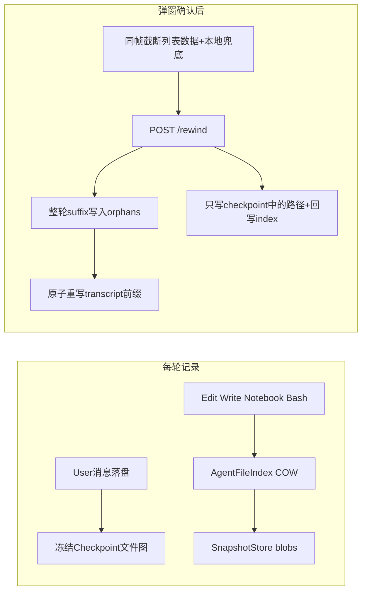

# 回溯 v3：Cursor 级热路径重做

> **v3.1 评审修订**：初版「Restore 截断对话 + Continue 截断重发」的双入口经评审判定不自洽（理由见「双入口为何重构」），已改为正交设计：**Restore 只回文件、不动对话（对齐 Cursor 真实口径）；Continue 回退整轮（含 target 消息本身）后重发**。逐条评审发现集中在「评审发现的不合理机制」一节。

## 现状（为什么难用、为什么慢）

`[docs/设计/30-回溯v2对齐Cursor口径.md](docs/设计/30-回溯v2对齐Cursor口径.md)` 已经写了对齐 Cursor 的产品合同，但**主路径没有落地**：

- UI 仍是「编辑 → **await 完整 preview** → 模态确认 → execute」。`MessageList.tsx:2445` 直接调 `previewRollback`；`restoreCheckpoint` 在 store 里存在（`chatStore.ts:3101`），但内部同样是 preview→execute 的 v2 管道，且无任何 UI 接线。
- Preview（`[python/rewind/service.py](python/rewind/service.py)`）每次重算 shadow diff、整文件哈希、统一 diff，并可空转等待 session idle **最多 5 秒**。Checkpoint cache 只写不读。
- 每轮 turn 仍对整个工作区 `git add -A`（`[ShadowGit.snapshot](python/engine/shadow_git.py)`），这是秒级延迟的根因，也与「只动 agent 文件」矛盾。
- `checkpointId` 有类型，hydrate **从不填充**。

v2 是「把旧 preview/execute 管道贴上 Cursor 文案」。v3 换热路径数据模型。

## 产品合同

主视图线性、不留分支。**回溯单位是「轮」（user 消息 + 其 assistant 回复 + 工具轨迹），不是「user 消息点」。**

### 双入口为何重构（初版设计的不合理处）

初版表格是「Restore = 截断+恢复文件+不 send；Continue = 截断+恢复文件+自动 send」。问题：

1. **两个动作共享全部破坏性操作，唯一差别是是否自动 send** —— 这不是一个功能矩阵，是一个功能加一个复选框；而真正有价值的第三种操作（只回文件、保留对话，即 Cursor 的 Restore Checkpoint）反而缺失。
2. **Restore 留下不自洽的死状态**：截断 target 之后的对话但保留 target 消息本身，工作区却回到该消息发出**之前** —— transcript 里挂着一条从未被回答（且按文件状态从未被处理）的请求。等价于把「无 checkpoint 仅截断」的失配问题复制到了主路径。
3. **「Restore」名不副实**：按钮叫 Restore，实际执行的是删消息 + 回文件两个破坏性动作，确认语义（`confirmed=true`）无法区分用户到底同意了什么。

### 修订后的动作矩阵

| 弹窗内动作 | 对话 | 文件 | 之后 |
| --- | --- | --- | --- |
| **Restore Checkpoint** | **不动**（保留全部消息） | 恢复 agent 触及路径至 checkpoint | 不 send；弹窗提示「文件已回滚、对话保留」；后续 turn 注入回滚标记（复用 `32-LLM调用前注入选型冻结` 的注入机制） |
| **Continue（从此重试）** | **截断整个 target 轮**（target user 消息、其回复、工具轨迹全部进 orphan） | 恢复至 checkpoint（该轮发出前状态） | 等 restore 完成后**自动 send**（编辑后文案；复用输入框发送链路，产生新 checkpoint） |

- 无 checkpoint 的旧消息：**Restore 按钮禁用**并注明原因；Continue 可仅截断对话，弹窗警示「文件无法回滚，将保留当前状态」。
- 脏路径：用户手改路径**跳过**，提示只出现在弹窗内。
- 所有回溯 UX（确认、动作、进度、脏跳过、recovery、Undo）都在弹窗内完成。

### 前端硬约束（本轮迭代）

**回溯相关可见 UI 只能改弹窗，禁止改其它内容/其它 UI。**

- **允许：** `[WorkspaceRevertDialog.tsx](gui/src/components/WorkspaceRevertDialog.tsx)`（及仅被该弹窗引用的子树/样式）。
- **禁止：** MessageList 气泡 chrome、悬停控件、Composer、侧栏、Settings 布局、列表外 toast/横幅。
- **白名单例外（切点 pill）**：允许新增且仅新增一个列表内组件——回溯切点 pill（对齐 Cursor 分支折叠 pill：摘要 + ↩ 入口）。pill 是哑组件，按钮只做一件事：打开锚定该切点的弹窗；「恢复被截断的对话（Undo）」与「Restore Checkpoint（只回文件）」是弹窗内两个独立动作，不得合并进 pill 行为。同一位置只保留最新一个 pill，旧的合并计数。
- Store/API（`chatStore` / `api.ts` / `rollbackMachine`）可改**逻辑接线**，但除切点 pill 外不得为回溯新增任何可见的非弹窗控件。
- 入口矩阵：Continue = 「编辑历史消息并提交 → 弹窗」；Restore Checkpoint 主入口 = 切点 pill → 弹窗；pill 只在回溯发生后存在，任意未被 pill 覆盖的历史消息仍走编辑入口。

## 两个发送按钮：点击后到底发生什么（对齐 Cursor）

### 按钮 A：输入框发送（Composer，正常开新一轮）

Cursor 口径：每次发送都会先为这一拍创建 checkpoint；消息立即出现在聊天里，workspace 后台追平。

**点击后同帧（FE 主线程）：**

1. 校验：非空文本/附件；会话忙 → 走现有排队 / interrupt 语义（不属于本次回溯改动范围）。
2. 乐观追加 user 消息（client id）到 `messagesById` / 列表。
3. 走现有 send 链路提交后端。

**服务端（同一请求内，顺序固定）：**

1. **冻结 checkpoint**：对 AgentFileIndex 作用域文件做 COW 快照 → blobs；`checkpoint_id` 写入该条 user 消息元数据。← 这就是这一轮的还原点。
2. user 消息 append `transcript.jsonl` + fsync。
3. 启动 agent turn：Edit/Write 实时 `record_file_mutation` 入 index；Bash / 未走 file tool 的变更由 **turn 起止双向差量**兜底（见评审发现 #1，禁止 `git add -A`）。

**失败路径：** 发送失败 → 乐观消息进失败态，可重发；checkpoint 冻结失败 → 该消息降级为「无 checkpoint 消息」（Continue 仍可截断，Restore 禁用），**不阻断发送**。

### 按钮 B：历史气泡的发送（编辑历史 user 消息后提交）

Cursor 口径：编辑旧消息并重发 = 从该点 **fork**，之后的消息离开主视图，编辑后文案作为新消息重新发送，并自动获得**新 checkpoint**。

XEYO v3 入口链路（沿用现有「编辑 → 提交」，气泡本身不改 UI）：

1. 气泡编辑器内点击发送 / Enter → **不直接发送、不走 previewRollback**，而是打开 `WorkspaceRevertDialog`，携带 `target_message_id` / `checkpoint_id`（hydrate 缺失则空）/ 编辑后文案。
2. 弹窗内两动作（见动作矩阵）。

**点击 Continue 后的功能链（时序）：**

1. 同帧 FE 截断：`messagesById` slice 到 target 轮**之前**；截断前先把后缀写入本地兜底存储（session 目录或持久化 store）——POST 失败 / 409 / FE 崩溃时据此原样恢复列表（见评审发现 #3）。
2. `POST /rewind`（`mode=continue`）：orphan 落盘 → fsync → 原子重写 transcript 前缀 → 提交后立即返回（目标 <100ms）。
3. 后台：异步 scoped blob restore（持 `WorkspaceLock`），只写 agent 触及路径；脏路径跳过，提示只在弹窗内；restore 完成后回写 AgentFileIndex（见评审发现 #7）。
4. **restore 完成后自动 send 编辑后文案**：完整复用按钮 A 链路，包括为这条新消息**冻结新 checkpoint**。禁止在 restore 完成前放行 send（见评审发现 #2）。
5. Undo（弹窗内、完成态保留）：orphan 追加回 transcript + 按 `pre_rewind_index` 写回文件 + 移除重发的那一轮；仅当 rewind 后无新 turn 落盘且目标路径无新变更时可用（见评审发现 #5）。

**点击 Restore Checkpoint 后：**

1. `POST /rewind`（`mode=restore`）：**不改 transcript、不写 orphan**，仅审计 `rewind_events`。
2. 后台 scoped blob restore（同上，含 index 回写）。
3. 不 send；对话完整保留 —— 与 Cursor 口径一致，不存在截断。
4. Undo = 按 `pre_rewind_index` 把文件恢复到 restore 前状态（对话无需 undo）。

**无 checkpoint 的旧消息：** Restore 禁用；Continue 仅截断对话，弹窗警示文件不回滚。

### 入口 C：切点 pill（回溯发生后的 Restore / Undo 主入口）

Continue 完成后，主视图在该切点渲染一条哑 pill（展示被截断编辑的摘要，对齐 Cursor 分支折叠 pill 的样式）。右侧 ↩ 按钮点击后**只做一件事**：打开锚定该 `rewind_id` / `checkpoint_id` 的弹窗。弹窗内两个独立动作：

- **恢复被截断的对话**：orphan 追加回 transcript（对话级 Undo，不写文件）。
- **Restore Checkpoint**：只回文件（弹窗确认，同动作矩阵）。

注意：Cursor 原装 pill 的 ↩ 是「恢复分支」，语义上对应**对话恢复**而非文件恢复；两者不得合并成一个按钮，否则重回初版的捆绑错误。pill 在回溯发生前不存在，任意历史消息的 Restore 仍走编辑入口。

### 与 Cursor 的对照（含有意偏离）

| Cursor 行为 | XEYO v3.1 | 说明 |
| --- | --- | --- |
| Restore Checkpoint 只回滚文件，从不删消息 | Restore 同：只回文件，对话保留 | **已对齐**（初版的「Restore 截断」判定为设计错误并废除） |
| 编辑旧消息重发 = fork，原分支后台保留 | Continue = 整轮进 orphan | 对齐「主视图线性」；orphan 即分支存档 |
| 每条消息发送前建 checkpoint | 输入框发送时冻结 agent 作用域文件图，`checkpoint_id` 绑定 user 消息 | 对齐 |
| 重发的消息获得新 checkpoint | Continue 自动 send 复用按钮 A 链路（含新建 checkpoint） | 对齐 |
| 编辑重发是否回滚文件无强保证 | Continue **固定**恢复文件后再重发 | XEYO 合同明确口径，弹窗明示 |

## 架构：AgentFileIndex 替代全仓快照



**Checkpoint = 该条 user 消息发出时、agent 作用域文件的 blob 图**（COW），不是整树 git commit。

- Edit/Write/Notebook：继续 `record_file_mutation` → SnapshotStore + upsert `AgentFileIndex`。
- Bash / 未走 file tool：**turn 起止双向 lstat 差量** —— turn 开始记录基线 mtime/size，turn 结束仅对变化路径读盘，**before 与 after 都入 blobs**；turn 开始时不在 index 且 turn 中被改的路径必须补 before-blob（否则该路径不可恢复，见评审发现 #1）。忽略 `node_modules` / `.git` / shadow 等。
- **restore 完成后必须回写 AgentFileIndex**（upsert 为恢复后的 blob），否则下一轮 turn-end 差量会把「回滚」误记为 agent 改动，污染 checkpoint 链（评审发现 #7）。
- **停掉** query_engine Before/After 全仓 snapshot。Shadow-git 不进热路径。

冻结时机：输入框发送（按钮 A 链路第 1 步）、写工具执行前。`checkpoint_id` 写进该条 user 元数据，随 `/messages` hydrate。

## 落盘布局（企业可修复）

`~/.xeyo/sessions/{sid}/`：

- `transcript.jsonl` — 仅当前主链前缀
- `orphans/{rewind_id}.jsonl` — 被删整轮后缀（不可变）
- `checkpoints.jsonl` — checkpoint 文件图（**需 compaction 策略**：每会话保留全部会爆炸，见评审发现 #8）
- `rewind_events.jsonl` — 审计 + Undo（`orphan_id`、`pre_rewind_index`、job_id、**pill 展示摘要**：编辑摘要/截断轮数，供切点 pill hydrate）

Blob：`~/.xeyo/snapshots/{sha256}`（无 GC，长期只增，见评审发现 #8）。

**崩溃顺序：** orphan → fsync → 原子替换 transcript → 再改工作区。Hydrate 只读 transcript。FE 侧：截断前先本地兜底落盘（评审发现 #3）。

Undo：orphan 追加回 transcript + 按 `pre_rewind_index` 写回文件；FE 在**弹窗完成态**内提供「撤销回溯」——弹窗一旦关闭，Undo 不再可用（生命周期在弹窗内闭环，见评审发现 #6）。

## API（跳过 preview）

`POST /v1/sessions/{session_id}/rewind`（旧 preview/execute 仅测试/降级，弹窗不再调用）。

```json
{
  "mode": "restore | continue",
  "target_message_id": "client-id",
  "checkpoint_id": "cp_...",
  "edited_text": "continue 必填",
  "idempotency_key": "...",
  "confirmed": true
}
```

- `mode=restore`：不改 transcript，仅文件恢复 + 审计；`target_message_id` 仅用于定位 checkpoint。
- `mode=continue`：orphan 整轮 → fsync → 原子重写 transcript 前缀 → 返回（目标 <100ms）。
- **忙时不 interrupt**：session 忙直接 409，由弹窗提示「当前有任务运行，等待或停止后再试」（评审发现 #9：初版「interrupt 一次后 409」会白白杀掉正在跑的 turn 又不执行回溯，两头落空）。
- 半失败 `recovery_required`，触发条件：transcript 已提交但 restore 失败/超时。

## 前端（只动弹窗）

1. 现有「编辑历史 → 打开弹窗」入口不变：气泡编辑提交**改为直接打开弹窗**（替换 MessageList.tsx:2445 的 previewRollback 直调）。
2. 主态两动作：**Restore Checkpoint**（无 checkpoint 时禁用）/ **Continue**。
3. Continue 确认后同帧：本地兜底落盘 → `messagesById` slice → `POST /rewind`；进度、脏跳过、recovery 全在弹窗内。
4. Continue 等 restore 完成后自动 `sendMessage(editedText)`（按钮 A 链路，含新 checkpoint）。
5. **完成态生命周期**：操作完成后弹窗进入完成态，保留 Undo 按钮直到用户关闭；关闭后 Undo 不可用。
6. Happy path：**无 preview HTTP**；阶段只驱动弹窗文案与按钮态。
7. 无 checkpoint：Restore 禁用；Continue 仅截断对话并警示。
8. 已知限制：重发仅携带 `edited_text`，原消息的图片/附件不随重发传递（弹窗注明；后续版本再补 mediaRefs 透传）。
9. 切点 pill：按 `rewind_events` 渲染；同一位置只保留最新一个，旧的合并为「+N」；从 pill 再次打开弹窗时复用锚定切点模式。

厚 preview 文件树可删或折叠进弹窗次要区；不得再强制 await 完整 preview 才打开弹窗。

## 性能门槛

- 确认 → 列表数据截断：主线程 **< 100ms**（无 preview）。
- Transcript commit：典型 **< 100ms**；≤20 文件后台 restore **< 500ms**。
- Continue 端到端（确认 → 自动 send 发出）：**< 600ms**（串行 restore 是硬前提，见评审发现 #2）。
- 发送路径新增冻结成本：checkpoint COW 快照典型 **< 50ms**（≤20 文件），禁止整树拷贝；Windows 上 fsync 延迟方差大，门禁需实测标定。
- 热路径零 `git add -A`、零全仓 `ls-tree -r`、零必经 preview。

## 评审发现的不合理机制（v3.1 修订记录）

| # | 发现 | 严重度 | 修订 |
| --- | --- | --- | --- |
| 1 | Bash 变更只有 after 没有 before：turn 结束差量只读当前内容，turn 中首次被 Bash 触及的存量文件无改前状态，回溯恢复不了它 | **高** | 改为 turn **起止双向差量**，before/after 都入 blobs；正文已更新 |
| 2 | Continue 自动 send 与异步 restore 并发：新 turn 可能读到半恢复的工作区 | **高** | Continue 串行化：restore 完成后才放行 send；新增端到端 <600ms 门禁 |
| 3 | 乐观同帧截断无客户端兜底：POST 失败/409/FE 崩溃时被删后缀只存在于内存，刷新即丢 | **高** | 截断前本地兜底落盘；失败原样恢复列表；正文已更新 |
| 4 | 初版双入口不自洽（详见「双入口为何重构」）：两动作共享全部破坏性操作、Restore 留下「挂着的未回答请求」死状态 | **高** | 重构为正交矩阵：Restore 只回文件；Continue 回退整轮 |
| 5 | Undo 写回文件与后续 turn 无冲突保护：Continue 后 agent 又改了文件，Undo 会盖掉新改动 | 中 | Undo 仅当 rewind 后无新 turn 且路径无新变更时可用，否则弹窗禁用并说明 |
| 6 | Undo 入口放在弹窗内，但弹窗何时关闭未定义 —— 关了就没 Undo，约束又禁止列表外 toast | 中 | 定义完成态生命周期：完成后弹窗停留至用户关闭，Undo 随关闭失效 |
| 7 | restore 改了文件但 AgentFileIndex 不同步：下一轮 turn-end 差量把回滚误记为 agent 改动，污染 checkpoint 链 | 中 | restore 事务内 upsert index 为恢复后 blob |
| 8 | `checkpoints.jsonl` 每消息追加、blobs 无 GC：长会话/长期使用无限增长 | 低 | 合同标注需 compaction / GC 策略，本轮实现下限：会话删除时连带清理 |
| 9 | 「忙则 interrupt 一次后 409」：杀掉在途 turn 却不执行回溯，两头落空 | 中 | 忙时直接 409，是否 interrupt 交给用户 |
| 10 | 并发控制未接现有设施：`workspace_lock.py`（lease+heartbeat）与 `WorkspaceRestoreTransaction`（WAL）已存在，plan 未提；interrupt 后在途工具半写文件如何 quiesce 未定义；多 agent 并行 turn 下 checkpoint 归属未定义 | 中 | restore 事务强制持 `WorkspaceLock`；quiesce 依据 `turn_snapshot.is_active`；多 agent checkpoint 归属列为待决（见下） |
| 11 | Restore 只能借道「编辑历史消息」入口，与动作语义不匹配（编辑→不编辑的文件恢复） | 低 | 新增切点 pill 白名单：哑组件 + 打开锚定弹窗；对话恢复与文件恢复在弹窗内分列两个动作（评审定稿 2026-08-30） |

## 待决问题（实现前必须回答）

1. 多 agent 并行 turn（scheduler / AgentTool 已落地）时，checkpoint 归属哪条 user 消息、回溯截断如何处理并行子轮。
2. turn 起止全仓 lstat 在 Windows 大仓的成本上限：建议限定遍历深度 + 复用上次差量缓存，实测后定门禁。
3. 「仅截断对话」（无 checkpoint 的 Continue）之后重发，文件仍是旧状态，agent 会在未回滚的文件上重跑 —— 是否需要额外标注/阻止，待用户反馈。

## 明确不做

- 完整编辑器 VFS；侧聊对等 rewind UI。
- 默认整树 restore；用户 `.git` 写入。
- 主视图聊天 DAG / 分支切换。
- 把 FE 当跨进程事务协调器。
- **气泡悬停 Restore（本轮禁改，下轮评估迁移）、列表外 toast/横幅、改 MessageList/Composer 布局。**

## 文档与实现顺序

新合同：`docs/设计/31-回溯v3对齐Cursor热路径.md`（含「只动弹窗」「两个发送按钮功能矩阵」「v3.1 修订记录」）；30 标为考古。

热路径新建 `python/rewind/index.py`、`python/rewind/hotpath.py`、sessions 新路由；不要在 `preview()` 上继续打补丁。

回归：`test_rewind_hotpath.py` + 弹窗双入口/store 热路径测试。用例必须覆盖：turn 中 Bash 首触文件的 before-blob 补录、restore 后 index 回写、Continue 串行（restore 完成才 send）、POST 失败后本地兜底恢复、Undo 冲突禁用、无 checkpoint 降级、409 忙不打断。
