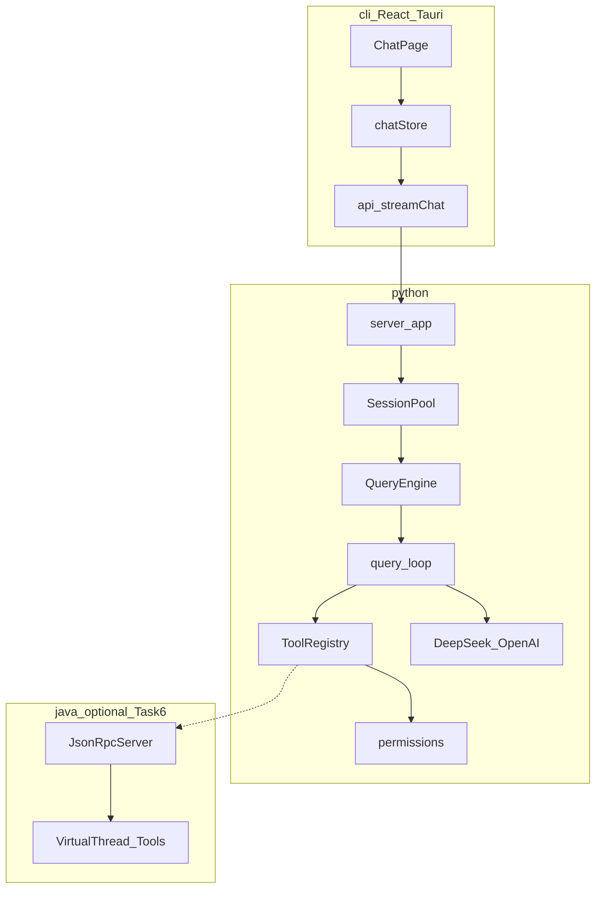
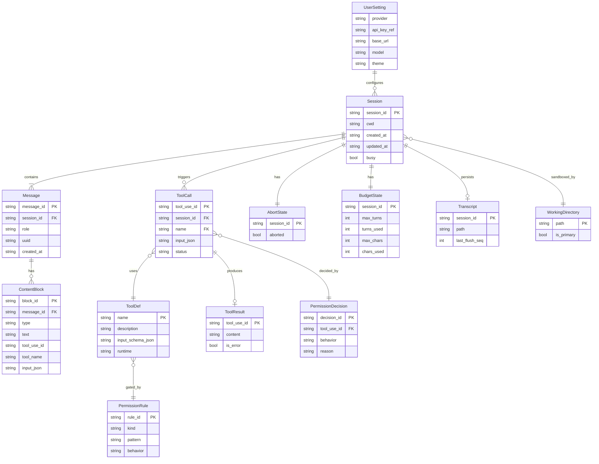
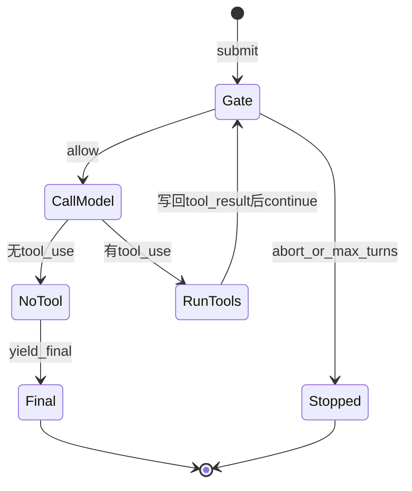

# XEYO 总计划书 — 可上线路线图

> 仓库：`D:\lea\XenYon code`  
> 版本：2026-08-08（Task0–7 演示期）  
> 定位：参考 Claude Code **架构思想**自研的本地编码 Agent；**可本地上线演示 + 秋招讲解**。  
> **2026-08-14 起下一阶段总纲改为** [09-企业级落地计划-时序与排期.md](../%E5%AE%9E%E6%96%BD%E8%AE%A1%E5%88%92/09-%E4%BC%81%E4%B8%9A%E7%BA%A7%E8%90%BD%E5%9C%B0%E8%AE%A1%E5%88%92-%E6%97%B6%E5%BA%8F%E4%B8%8E%E6%8E%92%E6%9C%9F.md)（执行：时序 / 理由 / PR）；产品身份见 [08-从Demo到企业级.md](../%E8%AE%BE%E8%AE%A1/08-%E4%BB%8EDemo%E5%88%B0%E4%BC%81%E4%B8%9A%E7%BA%A7.md)。本文保留为演示期索引。  
> 各阶段细节见 `task0`～`task7`。

---

## 0. 一分钟读懂

```text
你要做的事：
  做出一个「能对话、会调工具、有权限、可中断、可恢复」的 Agent
  前端好看能用，后端主循环正确，后期 Java 虚拟线程跑副作用工具

你不要做的事：
  逐行翻译 Claude 的 TS / 抄商业售卖（计费、Team 席位、商业遥测）
  一次启用 25 个空壳工具
```

**本地可上线 =** 一键启动 → UI 流式对话 → 核心工具可用 → 权限沙箱可演示 → 中断/续聊/恢复 → 测试绿 → 文档与演示齐。  
**不包含**公网多租户、计费、SLA。

---

## 1. 目标与非目标

### 1.1 目标（必须能讲清）

| # | 能力 | 对应 Claude 思想（非抄代码） |
|---|---|---|
| 1 | Agentic 主循环 | `queryLoop`：模型 ↔ 工具 while |
| 2 | 消息历史与续聊 | 会话权威消息列表 |
| 3 | 工具协议 | Tool schema + execute + Registry |
| 4 | 权限沙箱 | `canUseTool` 精简：allow/deny/ask |
| 5 | 流式 UI | REPL/交互层 → 本项目 React/Tauri |
| 6 | 中断与预算 | AbortController + maxTurns |
| 7 | 会话可恢复 | transcript / resume（精简） |
| 8 | 差异亮点 | Python 编排 + **Java 21 VT** 工具运行时 |

### 1.2 非目标（明确不做）

| 不做 | 原因 |
|---|---|
| Claude 计费 / Team / Enterprise / 席位 | 售卖内容 |
| 商业遥测产品化、组织策略后台 | 售卖/运维产品 |
| 逐行移植 `QueryEngine.submitMessage` 全壳 | ROI 低，难维护 |
| MCP / 多 Agent / Skill / Plan / LSP 全家桶 | 非上线最小集 |
| 完整跨平台路径攻击面抄写 | Windows-first 沙箱即可 |

### 1.3 优先级图例

| 等级 | 含义 |
|---|---|
| **P0** | 不上线阻塞，必须先做 |
| **P1** | 上线必有 / 核心亮点 |
| **P2** | 体验增强，可后置 |

---

## 2. 现状盘点（2026-08）

| 切片 | 成熟度 | 说明 |
|---|---|---|
| `query_loop` / abort / budget | 可用 | 主循环骨架在 |
| `QueryEngine` | 部分 | 已有 Config + `submit_message`/`submit`，需与 SessionPool/测试彻底对齐并稳定 |
| permissions | 部分 | 有最小类型与 stub；未形成完整 gate |
| DeepSeek / OpenAI 客户端 | 可用 | UI 设置可配 key |
| FastAPI server + CLI | 半可用 | UI/SSE 面较完整，依赖引擎稳定 |
| 工具 | 部分 | echo / getTime / Glob 等；Read/Grep 等需按 Task 收口 ENABLED |
| Java ToolRuntime | 空壳 | 仅接口/空类 |
| 文档 | 建设中 | 以本文 + task* 为准 |

### 启动链（目标）

```text
start-xeyo.bat（已重命名为 **`XEYO.bat`**）
  → py -3.11 -m server          (:8000 FastAPI)
  → npm run tauri:dev | npm run dev
  → POST /v1/chat/completions (SSE)
  → SessionPool → QueryEngine.submit → query_loop → Tools
```

---

## 3. 全局架构



### Claude → XEYO 对照

| Claude | XEYO |
|---|---|
| `query.ts` / `queryLoop` | `engine/query_loop.py` |
| `QueryEngine.submitMessage`（外壳） | `engine/query_engine.py` 的瘦身 `submit` |
| `Tool` + `runTools` | `tools/tool_registry.py` + catalog |
| `canUseTool` + filesystem 权限 | `permissions/*` 精简 gate |
| REPL / Ink | `gui/` React + Tauri |
| 工具副作用进程 | Task6：`java/` VT Runtime |

---

## 4. 全域 ER 图（字段级）

> 逻辑模型：可用 JSONL / 内存实现，不强制上 SQL。字段名供文档与代码对齐。



### 实体说明（易懂版）

| 实体 | 人话 |
|---|---|
| Session | 一次聊天窗口/会话 |
| Message | 用户或助手的一条消息 |
| ContentBlock | 消息里的一段：纯文本 / tool_use / tool_result |
| ToolDef | 「系统里注册了什么工具」 |
| ToolCall / ToolResult | 某次实际调用与结果 |
| AbortState / BudgetState | 能不能继续跑、跑了几轮 |
| Transcript | 落盘的会话记录，用来恢复 |
| WorkingDirectory | 沙箱根目录（默认 cwd） |
| PermissionRule / Decision | 规则与某次裁决结果 |

---

## 5. Task 总表（约 10 周）

| Task | 文档 | 主题 | 重点等级 | 建议周次 |
|---|---|---|---|---|
| 0 | [task0-解阻塞与主循环收口.md](../%E4%BB%BB%E5%8A%A1%E4%B9%A6/task0-%E8%A7%A3%E9%98%BB%E5%A1%9E%E4%B8%8E%E4%B8%BB%E5%BE%AA%E7%8E%AF%E6%94%B6%E5%8F%A3.md) | import / 引擎契约 / pytest / 假聊 | P0 | W1 |
| 1 | [task1-会话主循环完备.md](../%E4%BB%BB%E5%8A%A1%E4%B9%A6/task1-%E4%BC%9A%E8%AF%9D%E4%B8%BB%E5%BE%AA%E7%8E%AF%E5%AE%8C%E5%A4%87.md) | submit / 历史 / 中断 / 预算 / system | P0/P1 | W1–W2 |
| 2 | [task2-工具协议与核心工具.md](../%E4%BB%BB%E5%8A%A1%E4%B9%A6/task2-%E5%B7%A5%E5%85%B7%E5%8D%8F%E8%AE%AE%E4%B8%8E%E6%A0%B8%E5%BF%83%E5%B7%A5%E5%85%B7.md) | Registry + Read/Grep/Bash/Write/Edit | P0/P1 | W2–W3 |
| 3 | [task3-权限沙箱.md](../%E4%BB%BB%E5%8A%A1%E4%B9%A6/task3-%E6%9D%83%E9%99%90%E6%B2%99%E7%AE%B1.md) | allow/deny/ask + cwd | P1 亮点 | W3–W4 |
| 4 | [task4-服务端API稳定.md](../%E4%BB%BB%E5%8A%A1%E4%B9%A6/task4-%E6%9C%8D%E5%8A%A1%E7%AB%AFAPI%E7%A8%B3%E5%AE%9A.md) | SSE / interrupt / 错误模型 | P1 | W4–W5 |
| 5 | [task5-前端产品化.md](../%E4%BB%BB%E5%8A%A1%E4%B9%A6/task5-%E5%89%8D%E7%AB%AF%E4%BA%A7%E5%93%81%E5%8C%96.md) | 流式 / 工具 UI / Stop / 设置 | P1 | W5–W6 |
| 6 | [task6-Java工具运行时.md](../%E4%BB%BB%E5%8A%A1%E4%B9%A6/task6-Java%E5%B7%A5%E5%85%B7%E8%BF%90%E8%A1%8C%E6%97%B6.md) | VT + JSON-RPC | P1 亮点 | W6–W8 |
| 7 | [task7-会话持久化与发布.md](../%E4%BB%BB%E5%8A%A1%E4%B9%A6/task7-%E4%BC%9A%E8%AF%9D%E6%8C%81%E4%B9%85%E5%8C%96%E4%B8%8E%E5%8F%91%E5%B8%83.md) | resume / README / 上线检查 | P1/P2 | W8–W10 |

**入口规则：** 未完成上一 Task 的 DoD，不进入下一 Task 的新功能。

---

## 6. 主循环语义（全项目共用）

瘦身协议（对齐 Claude **阶段 ⑥ / queryLoop**，不抄 ①～⑦ 全壳）：

```text
submit(text):
  abort.reset()
  budget.reset_for_submit()
  messages.append(user)
  system = build_system(...)
  async for ev in query_loop(...):
    yield ev   # delta | tool_call | tool_result | final | stopped | result
```



---

## 7. 完整亮点清单（上线叙事）

| 亮点 | 落在 Task | 一句话 |
|---|---|---|
| 正确的 agentic loop | 0–1 | 不是单次 Chat Completion |
| 可插拔工具协议 | 2 | schema / execute / ENABLED |
| 工作区权限沙箱 | 3 | 区外 deny，危险路径保护 |
| 流式桌面客户端 | 5 | SSE + 工具可视化 + Stop |
| Java 21 虚拟线程工具运行时 | 6 | 编排与副作用分离 |
| 会话可恢复 | 7 | 杀进程不丢关键 |

---

## 8. 里程碑检查表

| ID | 里程碑 | 状态 |
|---|---|---|
| M0 | 引擎可 import + Fake chat | ☑ 2026-08 |
| M1 | pytest 核心绿 + 续聊/中断 | ☑ 核心测存在 |
| M2 | Glob→Read→Grep 剧本 | ☑ ENABLED 含 Read/Grep/Glob/Bash/Edit/Write |
| M3 | 越界路径 deny 可演示 | ☑ gate.py；Bash 仍过宽 |
| M4 | curl 无 UI 完整工具轮 | ☑ `/v1/chat/completions` SSE |
| M5 | UI 流式+Stop+401 可读 | ☑ Tauri/Web |
| M6 | Java VT 工具可讲解 | ☐ **仍空壳**，见 `08` 选项 B |
| M7 | resume + 一键启动 + 录屏 | △ transcript 有；重启 hydrate 未闭环 |

**Phase 2（2026-08-14）：** 见 [08-从Demo到企业级.md](../%E8%AE%BE%E8%AE%A1/08-%E4%BB%8EDemo%E5%88%B0%E4%BC%81%E4%B8%9A%E7%BA%A7.md)。禁止再扩 SCAFFOLD 工具。

---

## 9. 文档索引

| 文档 | 用途 |
|---|---|
| 本文 `00-总计划书-可上线路线图.md` | 演示期总纲（历史） |
| [09-企业级落地计划-时序与排期.md](../%E5%AE%9E%E6%96%BD%E8%AE%A1%E5%88%92/09-%E4%BC%81%E4%B8%9A%E7%BA%A7%E8%90%BD%E5%9C%B0%E8%AE%A1%E5%88%92-%E6%97%B6%E5%BA%8F%E4%B8%8E%E6%8E%92%E6%9C%9F.md) | **当前执行总纲**：时序 / 理由 / 周排期 |
| [08-从Demo到企业级.md](../%E8%AE%BE%E8%AE%A1/08-%E4%BB%8EDemo%E5%88%B0%E4%BC%81%E4%B8%9A%E7%BA%A7.md) | 产品身份与禁止事项 |
| [task8-远程微信-重启续聊与按人隔离.md](../%E4%BB%BB%E5%8A%A1%E4%B9%A6/task8-%E8%BF%9C%E7%A8%8B%E5%BE%AE%E4%BF%A1-%E9%87%8D%E5%90%AF%E7%BB%AD%E8%81%8A%E4%B8%8E%E6%8C%89%E4%BA%BA%E9%9A%94%E7%A6%BB.md) | 已落地：微信重启可续 + 按人隔离 |
| [10-完整记忆体系.md](../%E8%AE%BE%E8%AE%A1/10-%E5%AE%8C%E6%95%B4%E8%AE%B0%E5%BF%86%E4%BD%93%E7%B3%BB.md) | 六层记忆 + KV/费用 + 多 Agent 隔离 |
| `task0`～`task7` | 演示期阶段说明书 |
| `er/README.md` | ER 图索引 |
| ~~`30天计划书-秋招Agent项目.md`~~ | **已废弃**，仅作历史 |

---

## 10. 常用命令

```powershell
cd "D:\lea\XenYon code\python"
py -3.11 -m pip install -r requirements.txt pytest pytest-asyncio
py -3.11 -m pytest -q
py -3.11 -m server

cd "D:\lea\XenYon code\\gui"
npm run dev
```

---

**下一步：打开 [09-企业级落地计划-时序与排期.md](../%E5%AE%9E%E6%96%BD%E8%AE%A1%E5%88%92/09-%E4%BC%81%E4%B8%9A%E7%BA%A7%E8%90%BD%E5%9C%B0%E8%AE%A1%E5%88%92-%E6%97%B6%E5%BA%8F%E4%B8%8E%E6%8E%92%E6%9C%9F.md)，本周做 PR-C1（compact 送模型副本）。**
