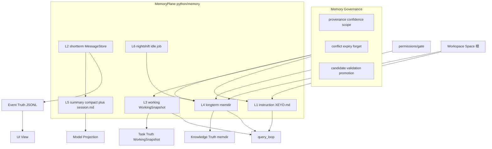
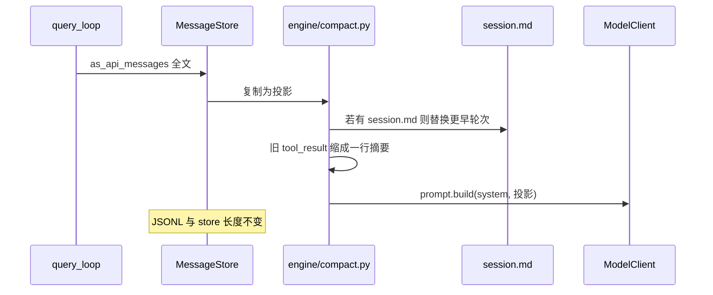
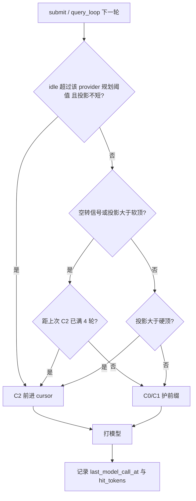
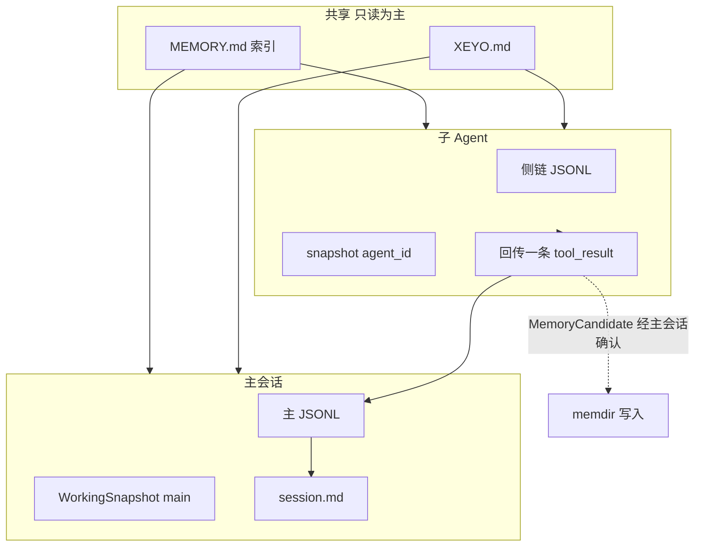
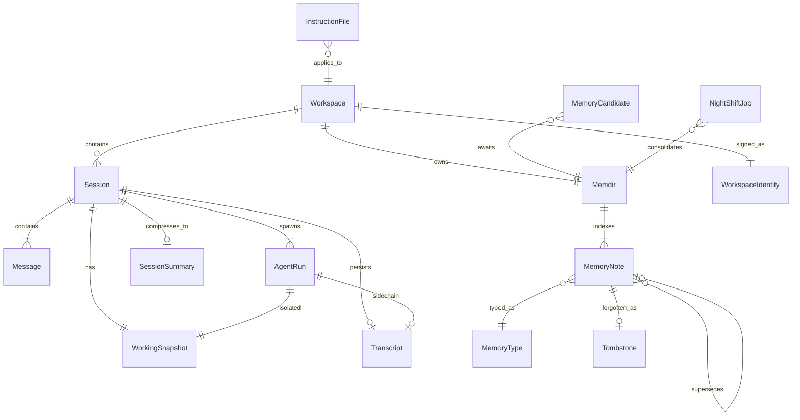

# XEYO 完整记忆体系

> 仓库：`D:\lea\XenYon code`  
> 版本：2026-08-17  
> 定位：对照 Claude Code **记忆架构思想**（源码 `D:\lea\claude`），按 XEYO 现有主循环 / 工作区沙箱落地。  
> **本文是记忆子系统的设计总纲；本轮只写设计，不改代码。**  
> 2026-08-16 增补：§4 ****费用与效果****；§5 多 Agent；§4.7 v5。  
> 2026-08-17 修订：Memory Governance；四种真相。  
> 2026-08-17 修订：§4.7 **v6.1** 实现基线已冻接口。P0：\(G_\beta\)、空 \(M\) 的 \(Q=1\)、\(\hat H\) clip、\(J\) 平局保守序。P1：缓存状态 \(C\) 与上下文 \(S\) 正交；horizon = 立刻动作一次 + 之后正常策略 \(\pi\)。**不再开 v6.2。**

对照来源：

- 用户「完整记忆体系」六层图
- Claude Code：`claudemd.ts`、`memdir/`、`compact/`、`SessionMemory/`、`autoDream/`
- XEYO 现状：`python/prompt/`、`python/session/`、`python/engine/query_loop.py`、JSONL transcript
- 已有 compact 计划：[09-企业级落地计划-时序与排期.md](../%E5%AE%9E%E6%96%BD%E8%AE%A1%E5%88%92/09-%E4%BC%81%E4%B8%9A%E7%BA%A7%E8%90%BD%E5%9C%B0%E8%AE%A1%E5%88%92-%E6%97%B6%E5%BA%8F%E4%B8%8E%E6%8E%92%E6%9C%9F.md) PR-C1

---

## 0. 一分钟读懂

Claude 能「隔天还记得你怎么干活」，不是因为上下文窗口更大，而是有六层记忆：规则文件、本轮对话、任务进度、跨会话知识库、压缩投影、空闲整理。横向还有一层 **Governance**：这条记忆为什么可信、属于谁、何时失效、怎么删、冲突怎么办。

XEYO 今天大约只有 **2.5 层**：硬编码 system + `MessageStore`/JSONL + 碎片化的 Todo/Read 缓存。长对话会炸，换会话会忘，换工作区没有知识域。

目标不是把 `QueryEngine.ts` 搬过来，而是：

```text
做成同级能力：
  指令可版本化 · 会话可恢复 · 任务状态可重建 · 项目有知识库
  送模型有压缩投影 · 空闲时整理长期记忆
  费用尽量低、效果尽量好（护前缀直到变笨或 TTL 作废）

不做：
  把 compact 写回权威历史
  为「选哪几条记忆」再 fork 一轮模型
  用 git-root 当记忆域（XEYO 的域是 Open Folder / Space）
  为续命 KV 发空请求；为命中率把过期 Grep 原文一直留在中间
  子 Agent 把全文历史写进主 JSONL，或并行抢写 memdir
```

面试一句话：**Claude 把记忆长在 QueryEngine 里；XEYO 把记忆做成与主循环正交的平面——事件 / 任务 / 知识 / 投影四种真相分开，UI 只是视图；前缀是资产直到变成负担；长期记忆有溯源、范围和可遗忘。**

---

## 1. 现状 vs 目标

| 层                                    | Claude 落点                                                  | XEYO 现在                                                                                 | 目标                                        |
| ------------------------------------- | ------------------------------------------------------------ | ------------------------------------------------------------------------------------------- | ------------------------------------------- |
| **L1 指令记忆**（规则级）             | `CLAUDE.md` 文件族，`getMemoryFiles()` 注入 userContext      | 无。`SessionPool` 用硬编码 `custom_system_prompt`；`system_prompt.py` 写明「暂不做 memory」 | `XEYO.md` 文件族进 `user_context`         |
| **L2 短期记忆**（会话级）             | `QueryEngine.mutableMessages` + JSONL                        | **已有**：`MessageStore` + `~/.xeyo/sessions/{id}.jsonl`（Task7/8）                       | 保持为权威历史，**永不因 compact 删盘**     |
| **L3 工作记忆**（任务级）             | `readFileState` LRU + attachments；无独立类型名              | 碎片：`TodoStore`、`ReadFileState`、`cwd`；引擎重建即丢；`_loaded_nested_memory_paths` 空壳 | `WorkingSnapshot` sidecar；显式「投机」字段 |
| **L4 长期记忆**（持久级，图中最核心） | `~/.claude/projects/<git-root>/memory/` + `MEMORY.md` + 四类 | 无                                                                                          | Workspace memdir + MemoryNote 治理 |
| **L5 摘要记忆**（压缩级）             | compact 改写消息数组 + 后台 `summary.md`                     | 无 `compact.py`；HTTP 只截 80 条 / 100k 字符                                                | 只压**送模型投影**；可选 `session.md`       |
| **L6 休眠重塑**（离线级）             | AutoDream：24h + ≥5 session + lock，fork `/dream`            | 无                                                                                          | NightShift 后台任务；P2 可迁 Java VT        |

当前数据流（没有记忆平面）：

```text
submit
  → build_system(custom 整段替换 default)
  → query_loop 把 store.as_api_messages() 全文塞模型
  → JSONL append
```

目标数据流：

```text
submit
  → MemoryPlane.slice(session, workspace)
       L1 指令 + L4 行为段 + MEMORY.md **索引** → system
       L3 WorkingSnapshot → 机器状态（todo / cursor / 缓存）
       L2 历史 → L5 compact 投影 → 模型
  → 权威 JSONL 只增不改
  → 空闲或候选超阈值：NightShift 蒸馏进 memdir（过 Governance）
```

---

## 2. 不照抄：架构原则

必须先于六层细节。没有这些原则，做成 Claude 的薄仿制没有意义。费用与智能的取舍见 **§4**，此处只立规矩。



### 2.1 四种真相，UI 只是视图

Claude compact 把 `compact_boundary` 写进 `mutableMessages`：磁盘、模型、UI 共用被改写的数组。

XEYO 在 [09](../%E5%AE%9E%E6%96%BD%E8%AE%A1%E5%88%92/09-%E4%BC%81%E4%B8%9A%E7%BA%A7%E8%90%BD%E5%9C%B0%E8%AE%A1%E5%88%92-%E6%97%B6%E5%BA%8F%E4%B8%8E%E6%8E%92%E6%9C%9F.md) 已定调「审计 / 投影 / UI 三副本」。L4 落地后升为 **四种真相**：

| 真相 | 是什么 | 可变性 |
| --- | --- | --- |
| **Event Truth** | L2 JSONL | **不改、不删**（append-only 审计） |
| **Task Truth** | L3 `WorkingSnapshot` | 机器状态，可重建；不是给人读的叙事 |
| **Knowledge Truth** | L4 memdir 的 MemoryNote | **可更新、可废弃、可删除**（tombstone）；不是审计 |
| **Model Projection** | L5 当前送模型的上下文 | 随时可重新生成；不写回 Event |

**UI transcript 不是第五种真相**，只是 Event 的视图（可折叠）。resume / 微信续聊只 hydrate Event。

删 JSONL 会导致「上周那个 bug 在哪」永远找不回来。掐死 `max_chars` 比压缩更差：模型突然失忆且无摘要。长期记忆 **可以** 忘——用户说「忘掉测试偏好」必须生效，且 NightShift 不得梦回来（§3.4.5）。

### 2.2 独立 MemoryPlane，不进 QueryEngine 上帝对象

Claude 把 `readFileState`、nested memory、skills 堆在 `QueryEngine.ts`。

XEYO 已有瘦 `QueryEngine` + `query_loop`。记忆走 `python/memory/`：

- 主循环只在 `prompt.build` **之前**取「本回合可见切片」
- `QueryEngine` 继续只持会话可变状态（历史、abort、预算、session_id）
- `_loaded_nested_memory_paths` 从引擎空字段迁到 MemoryPlane

### 2.3 绑定 Workspace，不绑 git-root

Claude memdir：`~/.claude/projects/<git-root>/memory/`。

XEYO 已有 Space（Open Folder）。指令文件与 memdir **跟工作区走**：换文件夹即换记忆域。一个 git 仓里开两个无关子树，不应共用「项目记忆」。

微信 / 桌面共用同一 `session_id`（Task8）+ 同一 workspace memdir。人变了（远程按人隔离）则用户级 `~/.xeyo/XEYO.md` 与 `user` 类记忆隔离；工作区 `project` 类记忆仍按 Space。

### 2.4 召回工具化，不加「选记忆」子 Agent；接口预留升级

Claude `findRelevantMemories` 再 fork 一轮 Sonnet，最多挑 5 条附件。

**禁止**为找记忆再调一轮模型。MemoryPlane 对外只暴露：

```text
memory.search(query, scope, top_k) → MemoryNote[]
```

实现可以换，平面不重构：

| 阶段 | `search` 的实现 |
| --- | --- |
| **P0/P1** | `MEMORY.md` 导航索引进 system；主题文件用现有 **Grep / Read** |
| **P2** | 词法 + 元数据（type / scope / confidence / status）过滤 |
| **P3** | embedding / hybrid；仍走同一 `search`，仍不 fork「选记忆」子 Agent |

P0 不要把「Grep/Read = 全部长期记忆召回」写成终局。10 个文件时够用；500～5000 条时主 Agent 会浪费上下文。

这和「工具协议是一等公民」（Task2）一致，也更便宜、更好测。

### 2.5 休眠重塑叫 NightShift，主循环零阻塞

Claude AutoDream 在同进程 fork `/dream` 子 Agent。

XEYO：

- 热路径：`query_loop` 禁止等整理
- P1：`asyncio` 后台任务。第一版门闩对齐 AutoDream（24h + ≥5 session + 文件锁），这是 **调度策略，不是记忆正确性规则**（§3.6）
- P2：整理跑到 **Java 21 虚拟线程**（Task6 叙事）：只允许 memdir 内记忆工具（或白名单 Read/Edit/Write）

### 2.6 前缀稳定，但不把「命中率」当成唯一目标

DeepSeek / OpenAI 的前缀缓存从左边字节对齐。会话内应冻结：

- `tools` schema 的集合、顺序、JSON 键序（新工具只追加在列表尾，或等新会话）
- 历史只在右边长；`tool_result` 顺序 = 当时 `tool_use` 顺序（orchestration 已按原下标回填）

会话内 system **左段顺序锁死**（少变的在上）：

```text
Identity
XEYO.md
Memory behavior instructions（何时记 / 何时不记 / 禁止用普通笔记冒充 MemoryNote）
稳定工具 schema
MEMORY.md 导航索引
history（只在右边长）
```

易变的东西（日期精确到秒、本轮检索、todos、投机、嵌套指令）放 **右段或历史**，不要插进 system 中间。

**硬不变量：** `MEMORY.md` **只在 NightShift 或一次明确的 memory mutation**（MemoryWrite/Update/Forget 成功）时改字节。热路径每轮、每次 submit、每次 C1 stub **禁止**重写索引。否则新记忆会频繁砸掉整段 KV。NightShift 改索引选在空闲（§4.4）。

**禁止：** 为省 token 本轮只暴露 3 个工具（schema 一变，整段 miss，通常更贵）。

**同时禁止：** 为护前缀把 30 轮 Grep 原文留在中间。命中率最大 ≠ 费用最低 ≠ 效果最好。完整策略见 §4。

**锁住：** §4.7 **v6.1** 为实现基线，不要再开公式版本。下一步是离线模拟器 + §4.7(11) 的不变量测试：真实 transcript 上 keep/C1/C2 频率，以及 \(\hat H_t(a)\) vs `prompt_cache_hit_tokens`。

### 2.7 非目标与兼容

**不做：** MCP 记忆、Team 共享 memdir、GrowthBook 开关全家桶、品牌名用 `CLAUDE.md`。

**兼容：** 发现 `CLAUDE.md` / `AGENTS.md` / `.cursor/rules` 时 **只读并入** L1；新写入一律 `XEYO.md` / `.xeyo/`。

### 2.8 Memory Governance（横向，正式实现前必补）

六层回答「记忆放哪、何时压、怎么省 KV」。Governance 回答：

> 为什么这条可信？属于谁？适用范围？何时失效？谁能改？怎么删？冲突怎么办？

它横切 L1 / L3 / L4，**不是第七层磁盘**，而是 MemoryNote / Candidate 的必填语义：

```text
                 ┌─────────────────────┐
                 │ Memory Governance   │
                 │ provenance          │
                 │ confidence          │
                 │ scope / applies_to  │
                 │ conflict            │
                 │ expiry              │
                 │ forget / tombstone  │
                 │ promotion           │
                 └─────────┬───────────┘
      ┌────────────────────┼─────────────────────┐
      ↓                    ↓                     ↓
     L1                   L3                    L4
 Instruction         speculation          memory notes
```

下一版实现优先这五件，再开 NightShift 自动整理：

1. MemoryNote schema  
2. provenance / confidence / scope  
3. 冲突消解（先分范围，再比时间与置信）  
4. MemoryForget + tombstone  
5. MemoryCandidate → 验证闸 → active  

---

## 3. 六层机制

每层写清：职责、磁盘、何时读写、挂进哪段现有代码。

### 3.1 L1 指令记忆 — 规则级

**职责：** 项目宪法。告诉模型「在这个仓库里怎么干活」，不是对话记录。

**文件族（后加载覆盖先加载，对齐** `claudemd.ts` **优先级）：**

| 优先级（后 = 更高） | 路径                                                                                     | 含义                     |
| ------------------- | ---------------------------------------------------------------------------------------- | ------------------------ |
| 1 用户              | `~/.xeyo/XEYO.md`、`~/.xeyo/rules/*.md`                                            | 跨项目的个人习惯         |
| 2 项目              | 从 cwd 向上走到 **workspace 根**：`XEYO.md`、`.xeyo/XEYO.md`、`.xeyo/rules/*.md` | 可进版本库               |
| 3 本地              | `XEYO.local.md`（gitignore）                                                           | 本机覆盖，不提交         |
| 别名只读            | `CLAUDE.md`、`AGENTS.md`、`.cursor/rules/*.md`                                           | 打开别人的仓也能读到规则 |

约束（思想对齐 Claude，实现可更小）：

- 单文件字符上限（建议 40_000）
- `@include` 深度上限 5；环引用丢弃；缺文件静默跳过
- 剥离 HTML 注释；代码块内的 `@` 不展开
- frontmatter `paths:` glob：只在匹配当前打开文件时注入（嵌套指令）

**注入：**

- 填 `SystemPromptParts.user_context["instructions"]`
- `assemble_system_prompt(..., include_context_blocks=True)`
- **停止**用 `custom_system_prompt` 整段替换 default，否则指令层永远进不去

挂钩：

- 发现/读取：新模块 `python/memory/instruction.py`
- 拼装：`[python/prompt/system_prompt.py](../python/prompt/system_prompt.py)`、`[assembler.py](../python/prompt/assembler.py)`
- HTTP：`[python/server/session_pool.py](../python/server/session_pool.py)` 改为 default 身份段 + `append` 工具提示，不再整段 custom
- 嵌套：Read / 打开某文件时，路径上更近的 `XEYO.md` 作为一次性附件；已加载路径记在 MemoryPlane（取代引擎里的空 `_loaded_nested_memory_paths`）

**何时重载：** 每次 `submit_message` 的 `build_system`；L5 compact 之后清指令缓存（对齐 Claude compact 后 `resetGetMemoryFilesCache('compact')`）。

---

### 3.2 L2 短期记忆 — 会话级

**职责：** 本会话完整对话历史。权威在内存 `MessageStore`，落盘 JSONL。

**磁盘：** `~/.xeyo/sessions/{safe_session_id}.jsonl`（已有，`[record_transcript.py](../python/session/record_transcript.py)`）。

**规则：**

- 只增不改；按 message `id` 去重
- compact **不得**改 JSONL、不得改 `MessageStore` 里已提交条目
- `tool` 角色在 `as_api_messages()` 的折叠逻辑保持现状；投影层再处理体积

**与 L5：** L2 是原料；L5 是投影。resume / 微信续聊只 hydrate L2。

挂钩：已有 `[query_engine.py](../python/engine/query_engine.py)` `record_transcript`、`[session_pool.py](../python/server/session_pool.py)` `_load_disk_messages`。记忆平面不重写这条链。

---

### 3.3 L3 工作记忆 — 任务级（进度 / 偏移 / 投机）

Claude 没有名叫 Working Memory 的类型，实际是 `readFileState` + attachments。图中的「进度 / 偏移 / 投机」在 XEYO **显式建模**，避免未验证猜测写进 L4。

`WorkingSnapshot` sidecar：`~/.xeyo/sessions/{id}.working.json`

| 字段                              | 现有碎片         | 含义                                         | 会话结束                                    |
| --------------------------------- | ---------------- | -------------------------------------------- | ------------------------------------------- |
| `todos`                           | `TodoStore`      | 进度清单                                     | 保留到全部完成或用户清空                    |
| `read_file_state`                 | `ReadFileState`  | 已读文件内容哈希 / mtime / offset            | 保留；Edit/Write 校验用                     |
| `cwd`                             | `session/cwd.py` | 沙箱根                                       | 随 Space                                    |
| `speculation`                     | **新**           | 本回合假说、待验证结论、未确认的「可能是 X」 | **默认丢弃**；不得直接写 L4；见下方晋升闸 |
| `compact_cursor`                  | 新               | 投影已压到哪条 message id；**只前进不回头**  | 随 L5 / §4                                  |
| `turns_since_l2`                  | 新               | 上次前进 cursor 后的模型轮数（滞后）         | 随 L5                                       |
| `last_model_call_at`              | 新               | 上次真正打模型 API 的时间                    | 判 TTL / 空闲                               |
| `last_cache_hit_tokens`           | 新               | 上次响应的 `prompt_cache_hit_tokens`         | 确认缓存是否已冷                            |
| `agent_id`                        | 新               | `main` 或子 Agent id；TodoStore 的 key       | 子 Agent 结束可丢                           |
| `loaded_nested_instruction_paths` | 引擎空壳         | 已注入的嵌套 XEYO.md                       | compact 后清空                              |

引擎因 cwd / 模型配置重建时，从 sidecar hydrate，修复「TodoWrite 丢清单」。

挂钩：

- 写：`submit_message` 结束、每次 TodoWrite / Read 成功
- 读：`QueryEngine.__init__` / `SessionPool.get_or_create` 在 hydrate JSONL 之后
- 新模块：`python/memory/working.py`；`[SessionState](../python/session/state.py)` 只持引用，不膨胀成上帝对象

**与 `session.md` 不重叠：** `WorkingSnapshot` 是机器状态（todo / cwd / offset / cursor / agent_id / 缓存）。`session.md` 是给模型看的任务语义（Goal / Current / Completed / discoveries / next）。Todo 以 Snapshot 为准；`session.md` 不得另造一份进度清单当权威。

**投机禁止直接晋升（硬闸）：**

```text
speculation → 重复出现 → MemoryCandidate → 验证 → active MemoryNote
```

禁止 `speculation → NightShift → 直接 active`。重复出现 ≠ 正确；模型可以连续 20 次重复同一个错推断。

验证至少满足 **其一**：

- 用户确认（「对、记住」）
- 代码 / 测试 / 配置等可核对事实支持
- 多个独立 session 出现且 **无冲突**（同 scope）
- 人工在 Memory 控制面确认

通过后写入的 Note 必须带 `source.kind: inference`（或 `user`），`confidence ≤ 0.6`（推断）或 `1.0`（用户确认）。未过闸的 Candidate 可留待整理，不得进 `MEMORY.md` 索引。

---

### 3.4 L4 长期记忆 — 持久级（最核心）

**职责：** 跨会话、且 **不能从当前代码/git 推出来** 的知识。这是图中标「最核心」的一层。正式实现前必须有 **MemoryNote 元数据 + 冲突 + 遗忘**（§2.8），不能只靠「四个 type 文件夹」。

**磁盘（按 Workspace，不按 git-root）：**

```text
~/.xeyo/memory/{workspace_id}/
  workspace.json     # 身份：防复制目录后记忆漂移
  MEMORY.md          # 仅导航索引，≤200 行 且 ≤25KB
  topics/
    user-*.md
    feedback-*.md
    project-*.md
    reference-*.md
  tombstones.jsonl   # 已删除 id；NightShift 禁止复活
```

#### 3.4.1 workspace 身份（防漂移）

`workspace_id` 仍用 Space 稳定 id 或规范化根路径哈希（Windows 大小写归一）。另外落盘：

```json
{
  "workspace_id": "ws_…",
  "canonical_path": "D:\\lea\\XenYon code",
  "display_path": "D:\\lea\\XenYon code",
  "volume_id": "…",
  "created_at": "2026-08-17"
}
```

文件夹复制（`D:\lea\XenYon code` → `D:\backup\XenYon code`）**默认新记忆域**。要共享须用户显式「链接到已有 workspace」。不要静默按文件夹名撞车。

#### 3.4.2 MemoryNote schema（生命周期元数据）

每条长期记忆一篇 topic，frontmatter **必填**（P0 用 Write 也必须带；缺字段则拒绝或降为 Candidate，不得当 active）：

```yaml
id: mem_01J...
type: feedback          # user | feedback | project | reference
content: 测试这个项目时不要 mock DB
source:
  kind: user            # user | agent | inference | nightshift
  session_id: xxx
  message_id: xxx
confidence: 1.0         # 1.0 用户确认 / 0.8 多次重复 / 0.6 事实推断 / 0.3 弱推断
status: active          # active | superseded | deleted
scope: workspace        # user | workspace | project | task
applies_to:
  - workspace: xeyo
  - path: tests/**
created_at: 2026-08-17
updated_at: 2026-08-17
last_confirmed_at: 2026-08-17
last_used_at: null
expires_at: null
supersedes: null        # 被本条替换的旧 id
```

`source` 必须写在 Note 上，不能只存在「晋升规则」散文里——半年后要能回答「Agent 为什么相信这件事」。

`created_at` / `updated_at` / `last_confirmed_at` **分开**：去年「回答用中文」和今年「技术问题用英文」靠确认时间与 scope 消解，而不是谁先写入谁赢。

#### 3.4.3 四类（存什么）

| type        | 存什么                                                           | 不存什么                         |
| ----------- | ---------------------------------------------------------------- | -------------------------------- |
| `user`      | 角色、目标、知识背景、沟通偏好                                   | 对用户的负面评价                 |
| `feedback`  | 「别再 mock DB」「回复不要总结」——失败 **和** 成功都记，并写 Why | 一次性的「这次用 A 方案」        |
| `project`   | 谁在做什么、截止日期、事故；相对日期改成绝对日期                 | 目录结构、从 README 能读到的架构 |
| `reference` | 外部系统口诀、私有约定指针                                       | 大段可 Grep 的源码               |

#### 3.4.4 冲突：先分范围，再合并

「合并矛盾」不能只是 NightShift 的一句话。先看 **scope / applies_to**，再看置信与 `last_confirmed_at`。

| 例子 | 处理 |
| --- | --- |
| 「喜欢简洁」vs「代码问题必须详细」 | **不冲突**（不同 applies_to） |
| 「用户使用 Python」vs「本仓已迁 Rust」 | 可能只是 **不同 project/workspace** |
| 「这个项目不能 mock DB」vs「测试环境可以用 mock」 | **path/scope 不同**，共存 |

同 scope 且语义互斥：新条 `supersedes` 旧条；旧条 `status: superseded`。不得 silently 删用户确认过的 Note。置信低的推断不得覆盖 `confidence=1.0` 的用户确认。

#### 3.4.5 遗忘 / tombstone（正式版必有）

Event Truth（JSONL）永不删。Knowledge Truth **必须能忘**。

用户说「忘记之前的测试偏好」→ `MemoryForget`（P2；P0 可用带 schema 的 Edit 把 `status: deleted`）。写 tombstone：

```yaml
id: mem_123
status: deleted
deleted_at: 2026-08-17
reason: user_request
```

NightShift **禁止**根据旧 JSONL / 旧 session.md 把 tombstone 复活。`MEMORY.md` 不得再列出该条。

#### 3.4.6 写入工具分期

不要让普通 Write/Edit 当长期记忆的终局接口：它们保不住 type/source/confidence/status/scope/supersedes，半年后 `MEMORY.md` 会变成杂乱笔记。

| 阶段 | 写入 |
| --- | --- |
| **P0** | 现有 Write/Edit + **硬约束**：路径在 memdir、frontmatter 齐全、过 gate；不合 schema 拒写 |
| **P1** | `MemoryWrite` / `MemoryUpdate`（强制 schema；更新索引仅在 mutation 成功时） |
| **P2** | `MemorySearch` / `MemoryForget` + 自动冲突（supersede）；NightShift 只走这些工具 |

P0 仍走 `[permissions/gate.py](../python/permissions/gate.py)`（memdir 沙箱子树 allow）。

#### 3.4.7 `MEMORY.md` 只做导航索引

```text
MEMORY.md  = navigation index
topics/*.md = actual facts
```

索引只允许这种行（截断后进 system）：

```text
[feedback] 测试必须用真实 DB → topics/feedback-testing.md
[project] 部署使用 Java 21 → topics/project-runtime.md
```

禁止在索引里写「用户喜欢……」「上次发生……」——否则它同时当索引 + 摘要 + 事实库，且每次润色都会砸 KV 左段。

**读出：** 行为段（何时记 / 不记 / 如何更新）进 default system；主题正文靠 `memory.search`（P0=Grep/Read）。

挂钩：`python/memory/memdir.py` + `python/memory/governance.py`；`build_system` 附加行为段 + **索引**；gate 增加 memdir allow。

---

### 3.5 L5 摘要记忆 — 压缩级

对应 Claude 的 **传统 compact** + **Session Memory**，但投影不写回 store。



**L5a 确定性 compact（P0，承接 PR-C1）**

- 新文件：`python/engine/compact.py`（策略状态机见 **§4**，不要写成「每轮从头摘要」）
- 钩子：`query_loop` 在 `prompt.build` **之前**
- 默认（护前缀）：对 **cursor 以右、尾部以左** 的旧 `tool_result` 做稳定占位 `[compacted] Grep: 12 matches`（每个 id 只一次后冻结）；近 $K=3$ 条原文留在 $T_k$；**已压过的左边字节下一轮必须相同**
- 前进 cursor（故意 miss）：仅当 §4 软顶 / 硬顶 / TTL 过期 / 空转信号成立，且滞后冷却已过
- 验收（沿用 09，并加 §4）：40 条含 20KB tool_result → 送模型 < 80_000 字符；最后 3 轮 Read 原文仍在；`store` 长度不变；连续两轮在未前进 cursor 时投影前缀字节一致
- compact 后（仅 L2 前进时）：重载 L1 缓存；清空 nested instruction 已加载集

**L5b Session Memory（P1）**

- 路径：`~/.xeyo/sessions/{id}/session.md`
- **只写任务语义**（给模型看）：Goal、Current state、Completed、Important discoveries、Open questions、Next action
- **不写** todo 清单、cwd、cursor、hit_tokens——那些是 `WorkingSnapshot`
- 触发：本会话 token 估计超阈值 **且** 距上次更新 ≥ K 次工具调用；只在主会话，不在 NightShift 子任务
- 有 `session.md` 后，L5a 可用它代替「更早轮次的 LLM 摘要」，避免再 fork 压缩模型（P1 仍可先确定性；P2 再可选 LLM 摘要）

HTTP 层现有 `_MAX_PRIOR_MESSAGES = 80` 是 **客户端先验截断**，不是 compact。L5 落地后，服务端应以投影为准，先验截断只作硬顶。

---

### 3.6 L6 休眠重塑 — 离线级（NightShift）

**职责：** 会话不在跑时，把近期 Event + `session.md` + 过闸的 Candidate 蒸馏进 memdir：按 §3.4.4 消解冲突、尊重 tombstone、丢掉过期、**只重写导航索引**。对标 Claude AutoDream，名称与调度按 XEYO。

**24h + ≥5 session + 文件锁 是第一版调度策略，不是 Memory correctness。**

- 一天 1 个 session 但产生 100 条高价值 Candidate → **仍应整理**
- 5 个 session 每条只说「你好」→ **不必整理**

完整触发（P2 起）：

```text
距上次整理 ≥ 24h
OR Candidate 条数超阈值
OR memdir 体积超阈值
OR 高价值待整理事件（用户 Forget / 明确冲突）
```

且必须拿到文件锁。第一版（P1）仍可用 24h + ≥5 session 作为 **其中一组** 条件，文档不要写成「少于 5 个 session 就永远不整理」。

**调度：** `StoppedEvent` 之后或进程空闲投递；**禁止**插入 `query_loop` 的 while。用户离开超过 provider TTL 时 **不要发空请求续命 KV**；这时 KV 反正要死，正是 NightShift 的窗口（§4.4）。

**子任务工具白名单：** P1 可用 Read / Grep / Edit / Write（cwd = memdir）；P2 改为 MemoryWrite/Update/Forget/Search。禁止 Bash、禁止改用户工程文件、禁止复活 tombstone、禁止把未过验证闸的 speculation 写成 active。

**P2：** 同一白名单放到 Java VT 工具运行时（Task6），Python 只发 JSON-RPC 作业。

状态文件：`~/.xeyo/memory/{workspace_id}/.nightshift.json`（`lastConsolidatedAt`、锁）。

---

## 4.** 费用与效果**：KV 命中 vs Agent 变笨

目标不是「KV 命中率最大」，而是：**使用者账单尽量低，同时模型尽量不笨。**  
护前缀只优化单价；上下文变长后，中间过期 tool_result 会让模型空转——多命中的是垃圾，比 miss 一次短前缀更贵。

### 4.1 两种「贵」

|          | 护前缀、越积越长                       | 前进 cursor / 压投影                    |
| -------- | -------------------------------------- | --------------------------------------- |
| 钱       | 旧前缀按缓存价（DeepSeek 命中约 0.1×） | 这一轮前缀 miss，全价重算**较短**上下文 |
| 智能     | 过阈值后重复 Read、丢掉 XEYO.md      | 近期目标、最近文件、指令更清楚          |
| 何时划算 | 会话还短、最近几轮仍是主战场、TTL 未过 | 旧检索占满注意力，或 TTL 已过反正要全价 |

粗算见 §4.7：必须计入 **缓存读/写/未缓存输入、输出、压缩动作、质量损失**，以及期望剩余轮数 $\mathbb{E}[R]$。只比「再护一轮 $0.1\times 80\mathrm{k}$」会低估真实账单。收尾只再问一句则倾向 keep。

**原则：前缀是资产，直到它变成负担。短会话当缓存用；一出现空转、过软顶或 TTL 作废，就前进 cursor，付一轮全价，换一段接下来又可以护很久的新前缀。**

`compact_cursor` **只前进、不回头重写已压前缀**（与四种真相一致：投影可变，Event 不变）。回头重算会让每轮前缀字节都变，命中率为零。

### 4.2 分层动手（便宜的先做）

| 级            | 动作                                                                                           | 前缀                              | 何时                                   |
| ------------- | ---------------------------------------------------------------------------------------------- | --------------------------------- | -------------------------------------- | ----------------------------------------------- |
| **C0**        | 单条 tool_result 截断（8–16KB）                                                                | 完全不动                          | 写入 $T_{\mathrm{now}}$ 时默认         |
| **C1-freeze** | 缩 **cursor 以右、尾部以左** 的旧 Grep/Read/Bash 为稳定占位；每个 tool_use_id **只一次后冻结** | 已压左边字节不变；本轮从改点起 $M | T$ miss                                | 有未 stub 块，且 §4.7 的 $J_{\mathrm{C1}}$ 划算 |
| **C2**        | 前进 `compact_cursor`，压更早 user/assistant；可用 `session.md` 代替                           | **故意 miss 一次**                | 质量闸 / 硬顶 / TTL / 空转，且冷却已过 |
| **C3**        | 用户新开会话或显式清空                                                                         | 全新前缀                          | 用户意图                               |

实现顺序：先 C0/C1（P0），再 C2 状态机（P0 后半），C3 已有。不要一上来每轮 LLM 摘要。

### 4.3 何时砸前缀（三闸 + 滞后）

不要只看「窗口还剩多少」。

**体积硬顶（防 400）**  
投影 ≳ 80_000 字符，或接近模型窗口 − buffer（对标 Claude `AUTOCOMPACT_BUFFER` ≈ 13k token）。必须 C2。

**质量软顶（防变笨，优先于硬顶）**  
编码 Agent 在窗口 50–70% 就容易丢指令。字符近似：投影 ≳ **50–60k**。或出现任一空转信号（不另调模型）：

- 同一文件 Read ≥ 3 次且中间无 Edit
- 连续两轮工具集几乎相同（Glob→Grep→Read 空转）
- 用户纠正「你已经做过 / 不是这个文件」
- 距上次有效 Edit/Write 超过 N 轮仍在堆检索

软顶 → C2，不要再护旧检索。

**TTL 闸（缓存已死，别浪费全价）**  
见 §4.4。空闲超过规划阈值且投影不短 → 先 C1/C2 再请求，让 miss 花在短前缀上。

**滞后：** C2 之后至少再跑 **4** 轮，或体积回到软顶的 70% 以下，才允许下一次 C2。避免每轮 compact、每轮 miss。



### 4.4 KV 有 TTL：过期后做什么

TTL 一过，字节相同也按 miss 计费。这不是「丢掉记忆」，是「这一枪反正全价」。

| 提供方             | 官方寿命（约）                                | XEYO「按 miss 规划」                                                    |
| ------------------ | --------------------------------------------- | ------------------------------------------------------------------------- |
| DeepSeek（主路径） | 不用后数小时到数天；64 token 一块；不保证命中 | **不必为 TTL 慌**；用软顶，或空闲 **≥ 1–2 小时** 且投影已长再按 miss 规划 |
| OpenAI 自动缓存    | 空闲约 5–10 分钟                              | 空闲 **4–8 分钟**                                                         |
| OpenAI 新模型      | 约 30 分钟，命中刷新                          | 空闲 **20–25 分钟**                                                       |

**禁止：** 发空请求续命 KV（用户不在，等于自己买 miss）。

**应做：**

| 时机                             | 动作                                                       |
| -------------------------------- | ---------------------------------------------------------- |
| TTL 内连续聊                     | C0/C1，护前缀                                              |
| 空闲超过规划阈值，用户又开口     | 先 C1/C2，再请求                                           |
| 空闲很久、没有下一句             | 不续命；投递 NightShift                                    |
| 响应 `hit_tokens ≈ 0` 且前缀很长 | 记「缓存已冷」；**下一轮**用新短前缀，不要同一长串再赌一次 |
| 会话里**第一轮** miss            | 正常（DeepSeek 建缓存要几秒）；不要因此立刻再 C2           |

以 `usage.prompt_cache_hit_tokens` / `prompt_cache_miss_tokens` 为准，本地时钟只是先验。写入 `WorkingSnapshot.last_cache_hit_tokens`。

子 Agent **不与主会话共用一条 KV 前缀**，除非显式走「继承前缀」模式（§5.3）。并行子 Agent 各算各的 hit_tokens。

### 4.5 记忆往哪插（少动左边）

| 放哪                                | 内容一变                        | 放什么                                                                                  |
| ----------------------------------- | ------------------------------- | --------------------------------------------------------------------------------------- |
| $P_{\mathrm{sink}}$（最左数 token） | 整段 KV 全废                    | BOS / 身份首句；真 sink，尽量短                                                         |
| $P_{\mathrm{cache}}$                | 从改点起全废                    | XEYO.md 其余、tools schema、已冻结骨架、`MEMORY.md` **导航索引**（**仅** NightShift 或 memory mutation 时改字节） |
| $T_{\mathrm{now}}$                  | 只废本轮后缀                    | **当前** user、本轮 tool_result、本轮附件                                               |
| $T_k$（近 $K$ 条，原地）            | 随历史自然在末尾                | 近几轮原文；**禁止把旧 $M$ 搬到末尾**                                                   |
| 改写中间 $M$                        | 从改点起到 $T$ 全废（位置偏移） | 仅 C1-freeze **一次**，或 C2 前进游标                                                   |

`Date` 只用 `date.today()`，禁止 `datetime.now()`。Todos 不进 system，只走历史里的 tool_result。

NightShift 改 `MEMORY.md` 选在空闲，不在热路径每轮重写。这是 **硬不变量**（§2.6），不是建议。

### 4.6 对使用者：费用最低且效果最好

产品层可以不讲「C2」，但引擎必须按上表自动做。设置里最多一项「省费用（更早压缩）」/「多记一点（更晚压缩）」：只调 $\alpha_{\mathrm{win}},\theta$，不允许改序或设 TTL。无画像时用 §4.3 默认数字。

落地检查：

1. 连续对话：schema 与 $P$ 字节/role/模板不变（无时间戳），`cached_tokens` 接近块对齐后的上轮 $L$（再乘存活率 $s_t$）。
2. 变笨信号或过软顶：自动 C2，用户感到「又听人话了」，而不是自己点压缩。
3. 离开再回来：不续命；第一句先压再问。
4. 账单：少空转工具轮，比抠几百 token 的 system 更省。
5. 不另开「选记忆」子模型（§2.4）。
6. 换厂商后用该厂商画像重算，不要沿用上一模型的 80k。

### 4.7 计算公式 v6.1（实现基线）

> **看排版：** [`24-公式预览.html`](./24-公式预览.html)。

**相对 v6 只补语义，核心式不动：** \(v_i\) 是信息单元自身长度；\(W_{\mathrm{phys}}\) 与「写入免费」分开；\(R=1\) 只做收尾保护；\(\mathrm{Margin}_J\) 不进账单。**最终动作由 Horizon 投票选出，禁止再用一个全局 \(\arg\min J\) 去抢选择权。**
**接口锁死：** \(X^a=\Pi_a(S_0)\)；\(S_a=\mathrm{Apply}(a,S_0)\)；缓存状态 \(C\) 与 \(S\) 正交；\(L(S_a)=\lvert X^a\rvert\)；\(\mathcal I=\mathcal I_M\)；空 \(M\) 则 \(Q=1\) 且禁止 C1/C2；\(\hat H\) clip 到 \([0,\lvert X^a\rvert]\)；\(G_\beta\) 只做健康信号、不进 \(\mathcal F_R\)；\(J_a=\) 立刻动作一次 + 之后正常策略成本；HardTop \(\arg\min D\)；票数不进 \(J\)。
**相对 v5 已修的分界仍有效：** 预测 \(\hat H\) ≠ 账单 \(H^{\mathrm{obs}}\)；质量 = 保真 × 可见；C2 的「当轮 0」是实现不变量；迟滞 \(\tau_{\mathrm{switch}}\) 进可行集。
**锁住不改：** keep/C1/C2、C0-δ、cursor 只前进、\(T_k=3\)、\(\beta\)、\(\alpha_{\mathrm{win}}=0.55\)、\(R\le 24\)、\(\lambda(x)=1+\kappa\cdot 4x(1-x)\)、\(A\) 不进账单、\(Q=\sum_{i\in\mathcal I_M}v_i q_i/\sum_{i\in\mathcal I_M}v_i\)、\(\{4,8,16\}\) 投票、\(\tau_{\mathrm{switch}}=0.85\)、票数不进 \(J\)。
不变量：前缀从位置 0 起字节 / role / 模板锁死；禁止重排；禁止把旧检索搬进本轮尾部；C1 是原地冻结中间段，不是并进前缀。

四组必须分清：

```text
预测 Ĥ(a,C)     →  观测 H^obs
上下文 S        →  缓存状态 C（ρ 只看 C）
质量闸 θ        →  切换迟滞 τ_switch（HardTop 绕过迟滞）
G_β 健康信号    →  不进 F_R / 不进 J
```

#### (0) 状态与动作

上下文五段：`P_s` 真 sink · `P_c` 稳定前缀 · `M` 中间旧块 · `T_k` 近 3 条原地尾 · `T_now` 仅本轮 · `δ` 投机（默认空）。

$$
S=(P_s,\,P_c,\,M,\,T_k,\,T_{\mathrm{now}},\,\delta)
$$

$$
T = T_k \Vert T_{\mathrm{now}},\quad P = P_s \Vert P_c
$$

$$
S_0=C0_{\delta}(S),\qquad
S_a=\mathrm{Apply}(a,S_0),\qquad
X^a=\Pi_a(S_0)=\Pi(S_a)
$$

\(\mathrm{Apply}\) **不得改写** \(S_0\)：keep / C1 / C2 是三条独立分支。\(\Pi_a\) 是动作相关投影，禁止三动作共用一个 \(\Pi\)。

长度 = **该动作真正发给模型的 token 数**（含 system、tool schema、供应商特殊 token，与 API `prompt_tokens` 对齐）：

$$
L(S_a)=\lvert X^a\rvert=\lvert\Pi_a(S_0)\rvert
$$

当前 XEYO 会话体（keep 布局、投机已清）下，会话段满足：

$$
L_{\mathrm{body}}(S)=\lvert P_s\rvert+\lvert P_c\rvert+\lvert M\rvert+\lvert T\rvert+\lvert\delta\rvert
$$

\(L_{\mathrm{body}}\) 只解释结构；闸门和账单一律用 \(L(S_a)\)。

缓存与上下文正交，**不要**把 provider / TTL / 命中史塞进 \(S\)：

$$
C_t=(\mathrm{provider},\,\mathrm{age},\,\mathrm{cache\_history},\,\mathrm{cache\_mode})
$$

$$
\rho_t=\hat\rho(C_t)
$$

P0：\(\rho_t=s_t\alpha_{\mathrm{hit}}\)。P1：用 \(H^{\mathrm{obs}}\) 拟合。

中间相对尾部过长是**健康信号**，不是闸：

$$
G_\beta(S_0)=\mathbf{1}\bigl[\lvert M\rvert>\beta\lvert T\rvert\bigr],\qquad \beta=8
$$

\(G_\beta=1\)：记「上下文已不健康」，**仍走**正常 \(Q,J,\tau_{\mathrm{switch}}\)。**禁止**把 \(M>\beta T\) 写进 \(\mathcal F_R\) 的 \(\mathrm{legal}\)（否则会变成「不到 8 倍绝对不能压」）。\(G_\beta\) 不进 \(J\)、不进投票。

| 动作 | 做什么 | 何时 |
| --- | --- | --- |
| **C0-δ** | 清掉投机 `δ` | 有投机就先做 |
| **keep** | 只在末尾追加本轮 | 从位置 0 起与上轮相同 |
| **C1-freeze** | `M` 压成 `M'` 后冻结，左边 `P` 不动 | `P` 没改过；每个 tool 只 stub 一次 |
| **C2** | 前进 cursor，中间熔进更短前缀，留尾部 | 质量/硬顶/TTL，且迟滞允许 |

序列永远是 `[P_s][P_c][M'][T]`，不要把 `M'` 改名叫前缀。

#### (1) 符号

| 记号 | 人话 | 默认 |
| --- | --- | --- |
| \(H,U,W_{\mathrm{phys}}\) | 命中 / 未命中且非 write 档 / **物理写入类**；互斥 \(H+U+W_{\mathrm{phys}}=\lvert X\rvert\) | \(p_w=0\) **不**表示 \(W_{\mathrm{phys}}=0\)，只表示写入免费。DeepSeek 无独立 write 档时，新 token 进 \(U\)（付 \(p_u\)），\(W_{\mathrm{phys}}\) 对账为 0，模拟器另记 cache fill |
| \(p_r,p_u,p_w,p_o\) | 读缓存 / 未命中 / 写缓存 / 输出 | 无写费 \(p_w=0\) |
| \(X^a=\Pi_a(S_0)\) | 动作 \(a\) 真正发给模型的序列 | \(\Pi_{\mathrm{keep}},\Pi_{\mathrm{C1}},\Pi_{\mathrm{C2}}\) 各自独立。\(X^a=\Pi(S_a)\) |
| \(S_a=\mathrm{Apply}(a,S_0)\) | 在冻结点上应用动作 | **不改** \(S_0\)；三条分支互不污染 |
| \(L(S_a)\) | 该动作送模型的 token 数 | \(\lvert X^a\rvert\)，与 API prompt 对齐 |
| \(\mathcal I=\mathcal I_M\) | 可被 compact 改写的历史单元 | **只含 \(M\)**。不含 \(P_s,P_c,T,\delta\)。\(S_0\) 上固定 |
| \(v_i\) | 单元 **自身** token 价值 | 在 \(\mathcal I_M\) 上固定。P0：一段一个 \(i\)，segments **不重叠** 且 \(\sum_i v_i=\lvert M\rvert\) |
| \(r_i^a\) | 动作 \(a\) 下该单元的内容保真 | P0 先验表（不是超参）：\(r_{\mathrm{orig}}=1\)，\(r_{\mathrm{stub}}=0.25\)，\(r_{\mathrm{summary}}=0.6\)，删除 \(0\)。P1：\(\hat r(\text{方法},\text{内容})\) |
| \(q_i\) | 单元可见质量 | \(r_i>0\) 时 \(r_i/\lambda(z_i)\)；\(r_i=0\) 时为 0，无需定义 \(z_i\) |
| \(\hat H_t(a)\) | **该候选动作**的预测命中 | 用 \(X_t^a\) 与 \(C_t\)。clip 到 \([0,\lvert X_t^a\rvert]\)。禁止三动作共用 |
| \(C_t\) | 缓存状态（与 \(S\) 正交） | \((\mathrm{provider},\mathrm{age},\mathrm{cache\_history},\mathrm{cache\_mode})\) |
| \(H^{\mathrm{obs}}\) | **请求后**账单命中 | `prompt_cache_hit_tokens` |
| \(C_{\mathrm{biz}}(X;S,C)\) | 一次请求的钱 | \(X\) 管长度分解；\(S\) 管 \(\mathbb{E}[O\mid S]\)；\(C\) 只通过 \(\hat H\) 进 \(H\) |
| \(g\) | 缓存块 | DeepSeek 64 |
| \(\rho_t=\hat\rho(C_t)\) | **预测**命中存活 | P0：\(s_t\alpha_{\mathrm{hit}}\)，\(\alpha_{\mathrm{hit}}=0.95\)。P1：用 \(H^{\mathrm{obs}}\) 拟合 |
| \(\kappa\) | U 形强度 | 检索 0.8，推理 0.4 |
| \(\theta\) | **质量**下限 | 0.35 |
| \(\tau_{\mathrm{switch}}\) | **离开 keep 的迟滞** | 0.85；按层：\(J_a(R)\le 0.85\,J_{\mathrm{keep}}(R)\)。**HardTop 绕过** |
| \(\beta\) | 中间相对尾部的健康阈值 | 默认 8。只定义 \(G_\beta\)；**不进** \(\mathcal F_R\)、不进 \(J\) |
| \(G_\beta\) | compact 评估提示 | \(\mathbf{1}[\lvert M\rvert>\beta\lvert T\rvert]\)。最终仍由 \(Q,J,\tau\) 决定 |
| \(\alpha_{\mathrm{win}}\) | 软顶占窗口 | 0.55 |
| \(C_{\mathrm{action}}(a)\) | 一次性动作成本 | 只在 \(h=0\) 付一次；keep 为 0 |
| \(\pi\) | 正常 compact 策略 | 即 (7) 整条决策链。horizon 里 \(h\ge 1\) 用 \(\pi\)，不是锁死在 \(a\) |
| \(T,\xi\) | 状态转移 | \((S_{t+1},C_{t+1})\sim T(S_t,C_t,\mathrm{action}_t,\xi_t)\) |
| \(C_{\mathrm{qual}}(S_0\to S_a)\) | 本次转换的质量代价 | \(\lambda_q D\)；keep 为 0 |
| \(\lambda_q\) | 丢信息换成钱 | 约两轮补救；不是产品旋钮 |
| \(J_a(R)\) | 立刻做 \(a\) 一次，再按正常策略跑 \(R\) 轮 | 不是「未来 \(R\) 轮都锁在 \(a\)」；\(R=16\) 轨迹切片给 4/8 |
| \(\mathcal{F}_R\) | horizon \(R\) 的可行集 | keep 始终在内（还要过 legal）；\(\mathcal I_M=\varnothing\) 时 C1/C2 不进集 |
| \(a_R\) | 该 horizon 内部选出的动作 | \(\arg\min J\)；\(J\) 相等则 \(\mathrm{keep}\succ\mathrm{C1}\succ\mathrm{C2}\) |
| \(S_0\) | 决策冻结点 | \(S_0=C0_{\delta}(S)\)；所有 \(a,R\) 从这里独立投影，禁止串改 |
| \(a_{\mathrm{hard}}\) | HardTop 选出的 compact | \(\arg\min_{a\in\mathcal F_{\mathrm{hard}}} D(S_0\to S_a)\)；平则 C1 |
| \(a_{\mathrm{vote}}\) | \(\{4,8,16\}\) 多数票 | 只定动作稳定性，**票数不进 \(J\)**。无多数 → keep |
| \(a^{*}\) | 安全闸之后的动作 | 不是第二个全局 \(\arg\min J\) |
| \(\mathrm{Margin}_J(R)\) | 该 horizon 上 \(J_{\mathrm{2nd}}-J_{\mathrm{best}}\) | **只记日志，不投票、不进账单**；暂不定阈值 |
| \(R\) | 还预计打几轮 | 见 (2)，封顶 24。投票只用 \(\{4,8,16\}\) |
| \(\Delta\) | 每轮新增 | 读大文件时可很大 |

产品设置只调 \(\alpha_{\mathrm{win}},\theta\)。\(\tau_{\mathrm{switch}}\) 用数据微调（0.80～0.90），不要和 \(\theta\) 混成一个闸。\(r_{\mathrm{stub}}/r_{\mathrm{summary}}\) 是先验表，不要当成第三个旋钮。

#### (2) 还要打几轮

取最大值（至少 1）：未完成 todo 数、近 10 轮平均模型调用、非收尾则 4、窗口余量/平均增量（封顶 24）。用户说「就这样」则估计 \(R=1\)。

\(R\) 是杠杆，不是最终选择器。投票固定用 \(\{4,8,16\}\) 三个点，**不要**用估计出的单个 \(R\) 去算一个全局 \(J\) 再 \(\arg\min\)。

**\(R=1\) 只回答「还剩一轮短收尾，值不值得为未来收益去 compact」。** 它不进 \(\{4,8,16\}\) 投票，**不算** \(J_{\mathrm{C1}}(1)/J_{\mathrm{C2}}(1)\)，也不参与 \(\mathrm{legal}\) 判断。正常情况直接 keep。它**不覆盖硬顶**：\(L>L_{\max}\) 或 keep 无法合法送出时走 (7) HardTop，与 \(R=1\) 完全独立。

禁止「因为估计 \(R=1\) 而否决 4/8/16 的多数」——三票都是 C1 时应 C1。

#### (3) 命中：预测 ≠ 观测；\(\hat H\) 必须跟候选动作走

keep / C1 / C2 的 \(X^a=\Pi_a(S_0)\) 不同，**禁止**算一个公共 \(\hat H_t\) 套到三个 \(J\) 上。

$$
\tilde L_t(a)=\mathrm{LCP}(X_t^a,X_{t-1})
$$

$$
\hat H_t(a)=\operatorname{clip}\!\left(
\rho_t\,g\left\lfloor\frac{\tilde L_t(a)}{g}\right\rfloor,\;
0,\;\lvert X_t^a\rvert
\right)
,\qquad
\rho_t=\hat\rho(C_t)
$$

P0：\(\rho_t=s_t\alpha_{\mathrm{hit}}\)。P1：用 \(H^{\mathrm{obs}}\) 拟合。不变量：\(0\le\hat H_t(a)\le\lvert X_t^a\rvert\)，从而 \(U=\lvert X\rvert-H-W_{\mathrm{phys}}\) 不会为负。

第一枪与后续枪的 \(\hat H\) **本来就不同**：\(h=0\) 用 \(\mathrm{LCP}(X^a,X_{t-1})\)；\(h\ge 1\) 用相邻两枪的 LCP 以及更新后的 \(C_{t+h}\)（C1 当轮可能 miss，之后逐步恢复 hit）。禁止把第一枪的 \(\hat H\) 复制到整个 horizon。

$$
H_t^{\mathrm{obs}}=\texttt{prompt\_cache\_hit\_tokens}
$$

硬规则：所有候选动作的成本预测均使用该动作产生的 \(X_t^a\) 计算 LCP 和 \(\hat H_t(a)\)。决策用 \(\hat H_t(a)\)；对账、校准用 \(H^{\mathrm{obs}}\)。不要把 \(\rho L_{\mathrm{blk}}\) 叫成账单命中。

**数学层：** 上式 clip 之后的 \(\hat H_t(a)\)。C2 **不**恒等于 0（从头重建则 clip 前为 0）。

**实现不变量（当前 XEYO 投影）：**

- keep：\(\mathrm{LCP}(X_t^{\mathrm{keep}},X_{t-1})\approx\lvert X_{t-1}\rvert\)（仅右端追加）
- C1：只改 \(M\) 且 \(P\) 字节不动 \(\Rightarrow\mathrm{LCP}=\lvert P\rvert\)
- C2 **若从头重建投影** \(\Rightarrow\mathrm{LCP}=0\)；若将来 C2 保留左段，则用上面的 LCP 公式，禁止再写「C2 命中恒 0」

写入先验：第一枪/前缀改过 → 物理 fill 为对齐后的新块；keep 追加 → 比上轮多出来的对齐块。不要用 \(\hat H_t-\hat H_{t-1}\) 当 fill。**禁止**从 \(p_w=0\) 推出「没有写入」。对账分区随供应商：有 write 档则 \(W_{\mathrm{phys}}\) 进第三项；DeepSeek 无该档，**发票**令 \(W_{\mathrm{phys}}=0\)、未命中进 \(U\)（付 \(p_u\)），物理 fill 只进模拟器。

#### (4) 质量：保真 × 可见

\(\lambda\) **锁形式**（两端 1，正中 \(1+\kappa\)）。用行为拟合 \(\kappa\)，不要换成高斯/指数。

$$
\lambda(x)=1+\kappa\cdot 4x(1-x)
$$

\(z_i\in[0,1]\) 是单元 \(i\) 在 **该动作投影 \(X^a\)** 里的相对位置（段中点 / \(L(S_a)\)）。**删除时不需要 \(z_i\)。**

P0：\(\mathcal I=\mathcal I_M\)，只评价可被 compact 改写的 \(M\)。\(P_s\)（真 sink）、\(P_c\)（稳定前缀）、\(T\)（保留区）**不进** \(\mathcal I\)，因此也不进 \(Q\) 的分母——\(Q\) 回答的是「压 \(M\) 会丢多少重要历史」，不是「整段上下文看起来有多完整」。

\(S_0\) 上固定 \(\mathcal I_M\)。P0 每个可压缩 segment 一个 \(i\)，\(v_i=\lvert\mathrm{segment}_i\rvert\)，且

$$
\{\mathrm{segment}_i\}_{i\in\mathcal I_M}\text{ 互不重叠},\qquad
\sum_{i\in\mathcal I_M} v_i=\lvert M\rvert
$$

C1/C2 **不增删 \(i\)**，只改 \(r_i^a,z_i^a\)。禁止把父段长度再赋给拆开的事实（那会 \(\sum v_i>\lvert M\rvert\)）。P1 把 segment 拆成 atomic facts 时仍须构成 \(M\) 的划分。

**基础质量函数：**

$$
q_i(S)=\begin{cases}
r_i(S)/\lambda(z_i), & r_i(S)>0\\
0, & r_i(S)=0
\end{cases}
$$

$$
Q(S_a)=\begin{cases}
1, & \mathcal I_M=\varnothing\\
\dfrac{\sum_{i\in\mathcal I_M} v_i\,q_i(S_a)}{\sum_{i\in\mathcal I_M} v_i}, & \text{otherwise}
\end{cases}
$$

\(\mathcal I_M=\varnothing\)（\(|M|=0\)）：没有可压缩历史，故 \(Q=1\)、\(D=0\)，且 **C1/C2 不进** \(\mathcal F_R\) 与 \(\mathcal F_{\mathrm{hard}}\)（没有工作可做 → keep）。空集上 \(\sum v_i=0\) **禁止**直接相除。

> **读法：** 价值 × 还剩多少原文 × 所在位置好不好看见。分母永远是 \(\lvert M\rvert\)。\(r_i\) 管「删没删干净」，\(\lambda\) 管「在不在视野中间」。

\(r_i=\hat r(\text{压缩方法},\text{内容})\)。P0 用先验表 \(r_{\mathrm{stub}}=0.25\)、\(r_{\mathrm{summary}}=0.6\)；P1 可按事实是否还在摘要里动态估（可到 0.95）。它们不是产品旋钮。

v5 的 \(Q=I/A\) **不再使用**。\(A,I\) 若还要打印「负担/信息」，只做诊断，**不进 \(Q\)、不进账单**。

压缩损失只在 C1/C2 **各算一次**（一次性状态转换，不是每轮）：

$$
D(S_0\to S_a)=\sum_{i\in\mathcal I_M} v_i\bigl[q_i(S_0)-q_i(S_a)\bigr]_+
$$

**不变量：** \(D\ge 0\)。位置变好使 \(q\) 上升时该项为 0，**不拿来抵消**其他事实的损失。若实现里未加 \([\,\cdot\,]_+\) 的原始差分为负，那是单元映射/位置 bug，**应报警**，不要靠 \([\,\cdot\,]_+\) 把错误吞掉。\(r_i(S_a)=0\Rightarrow q_i(S_a)=0\)。\(C_{\mathrm{qual}}(S_0\to S_a)=\lambda_q D\)。keep 的 \(D=0\)。空 \(\mathcal I_M\) 时 \(D=0\)。

硬约束：\(Q(S_a)\ge\theta\)，以及 \(L(S_a)\le L_{\max}=\min(\text{窗口}-\text{预留},\,\alpha_{\mathrm{win}}\times\text{窗口})\)。不要加 \(A\le A_{\max}\)。

#### (5) 一枪业务多少钱

\(S\) 决定上下文，\(C\) 决定缓存预测，\(X^a=\Pi_a(S_0)\) 才是送模型的序列。三类输入互斥：\(H+U+W_{\mathrm{phys}}=\lvert X\rvert\)。预测时 \(H=\hat H_t(a)\)（已 clip）。

$$
C_{\mathrm{biz}}(X;S,C)=p_r H + p_u U + p_w W_{\mathrm{phys}} + p_o\,\mathbb{E}[O\mid S]
= p_r H + p_u\bigl(\lvert X\rvert-H-W_{\mathrm{phys}}\bigr) + p_w W_{\mathrm{phys}} + p_o\,\mathbb{E}[O\mid S]
$$

事后对账把 \(H\) 换成 \(H^{\mathrm{obs}}\)。\(D\) 不塞进每一枪。\(p_w=0\) 只让第三项为 0，**不**清空 \(W_{\mathrm{phys}}\) 的物理计数。DeepSeek 无 write 档：对账 \(W_{\mathrm{phys}}=0\)、\(U=\lvert X\rvert-H\)。

质量差时输出按 \(\theta/Q\) 最多胀到 2 倍平均输出（这项走 \(S\)，不走 \(X\)）。

另开压缩枪：\(X_{\mathrm{src}}\) 是实际压缩请求（常是 \(M\) 切片），不是整段 \(L\)。

$$
C_{\mathrm{src}}=p_r H_{\mathrm{src}}+p_u\bigl(\lvert X_{\mathrm{src}}\rvert-H_{\mathrm{src}}-W_{\mathrm{phys,src}}\bigr)+p_w W_{\mathrm{phys,src}}
$$

$$
C_{\mathrm{cmp}}=C_{\mathrm{src}}+p_o O_{\mathrm{cmp}}
$$

P0 stub：\(C_{\mathrm{cmp}}=0\)。不要把压缩输出再加进第一枪业务。

#### (6) 未来 \(R\) 轮总账

\(J_a(R)\) 是：**立刻付出动作 \(a\) 一次**，然后按正常策略 \(\pi\)（即 (7) 整条链）继续跑 \(R\) 轮的钱。**不是**「未来 \(R\) 轮都锁在 C1/C2 模式」。

$$
\mathrm{action}_t=a,\qquad
\mathrm{action}_{t+h}=\pi(S_{t+h},C_{t+h})\quad(h\ge 1)
$$

$$
(S_{t+1},C_{t+1})\sim T(S_t,C_t,\mathrm{action}_t,\xi_t)
$$

P0：不必嵌套完整 \(\pi\)，对 Apply(\(a\)) 之后的状态用确定性 \(\Delta,O,\hat\rho(C)\) 预报即可。P1 模拟器每一未来轮重跑 \(\pi\)。

**轨迹共享：** 每个候选从同一 \(S_0,C_t\) 独立 Apply 一次，生成最长 16 步；\(J_a(4)/J_a(8)\) 取前缀。禁止 4/8/16 各滚一套互不一致的未来。

一次性动作成本（**只在 \(h=0\) 支付**；`C_biz` 才是每枪）：

$$
C_{\mathrm{action}}(a)=C_{\mathrm{cmp}}(a)+C_{\mathrm{qual}}(S_0\to S_a)
$$

keep：\(C_{\mathrm{action}}=0\)。然后：

$$
J_a(R)=C_{\mathrm{action}}(a)+\mathbb{E}\left[\sum_{h=0}^{R-1} C_{\mathrm{biz}}\bigl(X_{t+h}^{(a)};\,S_{t+h}^{(a)},\,C_{t+h}^{(a)}\bigr)\right]
$$

上标 \((a)\) 表示「现在选了 \(a\) 之后的轨迹」，不是「每一步仍执行 \(a\)」。

展开：

$$
J_{\mathrm{keep}}(R)=\mathbb{E}\sum_{h=0}^{R-1} C_{\mathrm{biz}}\bigl(X_{t+h}^{(K)};\,S_{t+h}^{(K)},\,C_{t+h}^{(K)}\bigr)
$$

$$
J_{\mathrm{C1}}(R)=C_{\mathrm{action}}(\mathrm{C1})+\mathbb{E}\sum_{h=0}^{R-1} C_{\mathrm{biz}}\bigl(X_{t+h}^{(C1)};\,S_{t+h}^{(C1)},\,C_{t+h}^{(C1)}\bigr)
$$

$$
J_{\mathrm{C2}}(R)=C_{\mathrm{action}}(\mathrm{C2})+\mathbb{E}\sum_{h=0}^{R-1} C_{\mathrm{biz}}\bigl(X_{t+h}^{(C2)};\,S_{t+h}^{(C2)},\,C_{t+h}^{(C2)}\bigr)
$$

第一枪 keep / C1 / C2 各用自己的 \(\hat H_t(a)\)（C2 从头重建则当轮 clip 后可为 0）；后续枪用更新后的 \(C\) 再算 LCP。

要求 \(J_{\mathrm{keep}}(R)>0\)。迟滞按**同一个** \(R\) 比：

$$
J_a(R)\le \tau_{\mathrm{switch}} J_{\mathrm{keep}}(R)
$$

例如 \(R=4\) 时 \(90>0.85\times 100\) → 该层 keep；\(R=16\) 时 \(200<0.85\times 300\) → 该层允许 C1。诊断量：

$$
M_J(R)=1-\frac{\min(J_{\mathrm{C1}}(R),J_{\mathrm{C2}}(R))}{J_{\mathrm{keep}}(R)}\in(-\infty,1]
$$

读法：\(M_J<0\) compact 更贵；\([0,0.15)\) 相对该 horizon 不值得离开 keep；\(\ge 0.15\) 才过 \(\tau_{\mathrm{switch}}\)。这是 \(\mathcal{F}_R\) 的门槛，不是最终 \(\arg\min\)。

\(\mathrm{Margin}_J(R)\) **不进账单、不进投票、不加 \(\mathrm{Margin}>\eta\) 闸**。日志记该层 `keep/C1/C2` 的 \(J\)、best、margin、是否过 \(\tau_{\mathrm{switch}}\)，用真实数据再决定有没有预测价值：

$$
\mathrm{Margin}_J(R) = J_{\mathrm{2nd}}(R)-J_{\mathrm{best}}(R)
$$

#### (7) 怎么选（决策链）

两个选择器分工，禁止并存争夺 \(a^{*}\)：

```text
argmin J(R)     → 每个 Horizon 内部选 a_R
Horizon Vote    → 最终候选 a_vote（无多数则 keep）
Safety Gate     → 落地 a*
HardTop         → 旁路：必要性约束，绕过 τ_switch 与投票
```

$$
S_0=C0_{\delta}(S)
$$

所有 keep / C1 / C2 与所有 \(R\) 都从 **同一个** \(S_0\) 独立 \(\mathrm{Apply}\)。禁止试完 C1 改掉 \(S_0\) 再试 C2。票数 \(n(a)\) **只用于最终动作稳定性，不进入 \(J\)**；不要按票加权 \(J\)。

$$
S_a=\mathrm{Apply}(a,S_0),\qquad X^a=\Pi_a(S_0)
$$

$$
S \xrightarrow{\mathrm{C0}\text{-}\delta} S_0
\xrightarrow{\text{HardTop?}}
\begin{cases}
\text{HardTop}\\
\{4,8,16\}\xrightarrow{J}\{a_4,a_8,a_{16}\}\xrightarrow{\text{majority}} a_{\mathrm{vote}}\xrightarrow{\text{safety}} a^{*}
\end{cases}
$$

**Step 0 — 冻结。** \(S_0=C0_{\delta}(S)\)，\(C_t\) 只读不改。\(\mathcal I_M\) 在 \(S_0\) 上固定。独立算出 \(S_{\mathrm{keep}},S_{\mathrm{C1}},S_{\mathrm{C2}}\) 与对应 \(X^a\)。记下 \(G_\beta\)（仅日志/是否值得评估 compact，不改可行集）。\(\mathcal I_M=\varnothing\) 则跳过 C1/C2 投影。

**Step 1 — HardTop（旁路，绕过投票与 \(\tau_{\mathrm{switch}}\)）。** 若 \(L(S_0)>L_{\max}\)（即 \(\lvert\Pi_{\mathrm{keep}}(S_0)\rvert>L_{\max}\)）或 keep 无法合法送出：这是必要性，不是经济性。

$$
\mathcal{F}_{\mathrm{hard}}=\{a\in\{\mathrm{C1},\mathrm{C2}\}:
\mathcal I_M\neq\varnothing,\;
Q(S_a)\ge\theta,\;
L(S_a)\le L_{\max},\;
\mathrm{legal}(a)\}
$$

$$
a_{\mathrm{hard}}=\arg\min_{a\in\mathcal{F}_{\mathrm{hard}}} D(S_0\to S_a)
$$

\(D\) 相等或 \(|D_{\mathrm{C1}}-D_{\mathrm{C2}}|\le\varepsilon_D\)（数值 epsilon，不是业务阈值）时 \(\mathrm{C1}\succ\mathrm{C2}\)。\(\mathcal{F}_{\mathrm{hard}}=\emptyset\)（含 \(\mathcal I_M=\varnothing\)）则写 L4 / 新会话 / 用户介入。禁止假装还记得。不要求过 \(\tau_{\mathrm{switch}}\)。\(R=1\) **不**把这里改回 keep。

**Step 2 — 各 Horizon 独立决策**（仅 \(L\le L_{\max}\) 且 keep 可送时）。对 \(R\in\{4,8,16\}\)，\(J\) 来自同一条 \(R=16\) 轨迹的前缀：

$$
\mathcal{F}_R=\{\mathrm{keep}\}\cup
\bigl\{a\in\{\mathrm{C1},\mathrm{C2}\}:
\mathcal I_M\neq\varnothing,\;
Q(S_a)\ge\theta,\;
L(S_a)\le L_{\max},\;
\mathrm{legal}(a),\;
J_a(R)\le \tau_{\mathrm{switch}} J_{\mathrm{keep}}(R)
\bigr\}
$$

$$
a_R=\arg\min_{a\in\mathcal{F}_R} J_a(R)
\quad\text{（}J\text{ 相等则 }\mathrm{keep}\succ\mathrm{C1}\succ\mathrm{C2}\text{）}
$$

\(Q,L,\mathrm{legal}\) 与 \(R\) 无关；只有迟滞项随 \(R\) 变。\(\tau_{\mathrm{switch}}=0.85\)。\(G_\beta\) **不**出现在 \(\mathcal{F}_R\)。

**Step 3 — Horizon 投票（最终选择器）。**

$$
n(a)=\#\{R\in\{4,8,16\}:a_R=a\}
$$

三个点时：3:0 或 2:1 为有多数；1:1:1 为无多数。

$$
a_{\mathrm{vote}}=\begin{cases}
\arg\max_a n(a), & \max_a n(a)\ge 2\\
\mathrm{keep}, & \text{otherwise（无多数）}
\end{cases}
$$

三个点都是 C1 则为 C1（不要因为估计 \(R=1\) 而否决）。\(n(a)\) 不进 \(J\)。以后若增加 horizon 数，再恢复平票优先序。

**Step 4 — 安全闸。** 若 \(a_{\mathrm{vote}}\) 不满足 \(Q\ge\theta\)、\(L\le L_{\max}\)、\(\mathrm{legal}\)，按 \(\mathrm{keep}\to\mathrm{C1}\to\mathrm{C2}\) 取第一个合法者（HardTop 时跳过 keep）。仍没有则同 Step 1 的 L4 出口。闸的真实用途主要是「投了 keep 但 keep 已不合法」。

**\(R=1\)：** 只做短收尾保护，不投票、不算 C1/C2 的 \(J\)、不参与 legal。刚改过中间或刚 C2 未满 4 轮 → \(\mathrm{legal}\) 禁止再改中间。禁止空请求续命。

> **读法：** 先冻 \(S_0\)，三条分支独立 Apply。能送则三层各自 \(\arg\min J_a(R)\)（\(J\) 相同选更保守的），有多数跟多数，没多数 keep。塞不下则 HardTop：在可行 compact 里 \(\arg\min D\)。\(G_\beta\) 只提示不健康，不改选择器。

#### (8) 数字例子

相对价：\(p_u=1,p_r=0.1,p_w=0,p_o=2\)，\(g=64\)，\(\rho=0.95\)。当前 80k，每轮 +2k，输出 800，P0 无压缩枪（DeepSeek 对账 \(W_{\mathrm{phys}}=0\)）。下面是**单层** \(J_a(R)\) 的示意，最终动作仍走 (7) 投票，不是拿某一个 \(R\) 的 \(\arg\min\) 当全局答案：

- \(R=8\)：keep 总账约 **93400**；C2 压到 12032 约 **49000**（\(M_J(8)\approx 0.48>0.15\) → 该层允许离开 keep）
- \(R=1\)：**不算** C1/C2 的 \(J\)，直接 keep（除非已经走 HardTop）
- C1：左边 15008，当轮 \(\hat H_t(\mathrm{C1})\approx\rho g\lfloor 15008/g\rfloor\)，不得拿 keep 的 \(\hat H\) 来算 C1

#### (9) 校准

用 \(H^{\mathrm{obs}}\) / 账单拟合 \(C_t\) 上的 \(\hat\rho\)（P0 的 \(s,\alpha_{\mathrm{hit}}\)）以及 \(\kappa,\theta,\tau_{\mathrm{switch}}\)。不要用 induction head 或「RoPE 近距」当改前缀或把旧检索塞进尾部的理由。**v6.1 之后不要再加函数形式、新阈值、新 Horizon、新选择器。**

#### (10) 投影怎么切

`compact_cursor` 只前进。左边到 cursor 是 \(P\)；cursor 到倒数第 3 条是 \(M\)；最后 3 条是 \(T_k\)。C1 把旧 tool_result 写成 `[compacted] {name}: {stat}`，同一 id 只写一次。C2 目标长度按块大小向下取整；**当前实现从头重建则当轮 LCP=0**（再 clip）。

#### (11) 实现不变量（simulator / 单测，不再加公式）

**A 数学：** \(H+U+W_{\mathrm{phys}}=\lvert X\rvert\)；\(0\le Q\le 1\)；\(D\ge 0\)；\(0\le\hat H\le\lvert X\rvert\)；空 \(M\) 时 \(Q=1\) 且 C1/C2 不进可行集。原始 \(q_i(S_0)-q_i(S_a)<0\) 且不是「位置改善」时应报警，不要静默吃进 \([\,\cdot\,]_+\)。

**B 决策确定性：** 同一 \((S_0,C_t)\) 重复跑，\(a_4,a_8,a_{16},a_{\mathrm{vote}}\) 必须相同；禁止因 map/set 顺序在 C1/C2 间抖动。\(J\) 平局必须 keep≻C1≻C2。

**C 单调：** 若 \(r_i^{C2}\le r_i^{C1}\le r_i^{\mathrm{keep}}\) 且位置未改善，则 \(Q(C2)\le Q(C1)\le Q(\mathrm{keep})\)，且 \(D(C1)\le D(C2)\)。没有压掉任何信息时 \(D=0\)。

---

## 5. 多 Agent 记忆

`AgentTool` 仍是脚手架。记忆平面必须**先于**多 Agent 落地定规矩，否则一开并行就会：抢写 memdir、主 JSONL 被侧链撑爆、主会话 KV 每轮被改写、子任务的猜测写进长期记忆。

XEYO 的多 Agent 不是「每人一份 Claude」。主会话仍是用户看见的那一条；子 Agent 是短命工人。

### 5.1 三种工人

| 角色             | 例子                                 | 寿命                             |
| ---------------- | ------------------------------------ | -------------------------------- |
| **主会话**       | 用户桌面 / 微信同一 `session_id`     | 长；L2/L5/L6 的权威              |
| **任务子 Agent** | 将来的 `AgentTool`：调研、并行搜文件 | 一次 tool 调用；可并行           |
| **系统 fork**    | NightShift、将来的 LLM 摘要          | 后台；工具白名单；**无用户对话** |

系统 fork 不是「第二个用户」，禁止写主 `session.md`、禁止覆盖主 `WorkingSnapshot`。

### 5.2 六层：谁共享、谁隔离

| 层          | 主会话                      | 任务子 Agent                                                                     | 系统 fork                      |
| ----------- | --------------------------- | -------------------------------------------------------------------------------- | ------------------------------ |
| **L1 指令** | 读 XEYO.md                | **只读同一份**                                                                   | 只读；可用更短行为段           |
| **L2 短期** | 主 JSONL 权威               | **侧链** `{session}/agents/{agent_id}.jsonl`，禁止 append 进主历史               | 独立临时 store，可丢           |
| **L3 工作** | `agent_id=main` 的 snapshot | **克隆** ReadFileState；todos 用已有 `TodoStore` 的 **key=agent_id**；投机默认丢 | 不碰主 todos                   |
| **L4 长期** | 读 + 可写 memdir（过 gate） | **默认只读**；要记的东西以 `MemoryCandidate` 回传主会话                          | 只写 memdir（NightShift 本职） |
| **L5 摘要** | 主 `session.md` + 主 cursor | 自己的短投影 / 短 cursor；**不写主 session.md**                                  | 不维护 session.md              |
| **L6 休眠** | 可投递 NightShift           | **禁止**投递                                                                     | 自己就是 NightShift            |

微信与桌面仍是**同一主会话**（Task8），不是两个 Agent。按人隔离的是用户级 L1 / `user` 类记忆，不是 workspace `project` 记忆。



### 5.3 KV：默认隔离，少数继承

Claude 的 `CacheSafeParams` 让 fork 与父请求 **system / tools / 消息前缀完全一致** 才能蹭父缓存。XEYO 不默认这么做：把 80k 主上下文塞给每个子 Agent，既贵又笨。

| 模式             | 前缀                                                                       | 用于                                       |
| ---------------- | -------------------------------------------------------------------------- | ------------------------------------------ |
| **隔离（默认）** | L1 + MEMORY.md 索引 + **裁剪后的 tools** + 任务 prompt；**不要**主会话全文 | 调研、搜文件、并行工人                     |
| **继承（少用）** | 与主会话 C0/C1 投影字节一致，右边只加一条任务消息                          | 「接着刚才的上下文问一句」类 fork；P2 再说 |
| **系统短前缀**   | 白名单工具 + 整理说明，无用户史                                            | NightShift / 摘要                          |

并行子 Agent 各有各的 schema 列表（可更短），**不得改主会话的 tools 顺序**（§2.6）。子 Agent 内部仍走 §4 的 C0/C1；寿命短，一般碰不到 C2。

### 5.4 回传：主历史只加一条

子 Agent 跑完，主会话只 append **一条** `tool_result`，例如：结论、改过的文件、关键路径、可选 `MemoryCandidate[]`。  
禁止把子 Agent 全文 transcript 打进主 store——那会立刻撑爆主投影并砸主 KV。

侧链 JSONL 留给调试 / NightShift，用户默认看不见。

### 5.5 写入冲突

- **memdir：** 同一时刻只允许一个写者（文件锁）。子 Agent 默认只读；候选记忆由主会话走 MemoryWrite（或 P0 合 schema 的 Write），或交给 NightShift（须过验证闸）。
- **XEYO.md：** 任何 Agent 不得自动改；那是人的宪法。
- **主 JSONL / session.md / compact_cursor：** 仅主 `query_loop`。
- **cwd / 工程文件：** 并行子 Agent 禁止同时 Write/Edit 同一路径（沿用 `is_concurrency_safe`）；跨 Agent 由编排层串行化危险工具。
- **投机：** 子 Agent 的 speculation 结束即丢，除非主会话验证闸通过后晋升 L4。
- **tombstone：** 任何 fork 不得把已 Forget 的 id 写回 active。

### 5.6 启用顺序

未做到「侧链 JSONL + agent_id snapshot + 回传单条 + memdir 只读」之前，**不要**把 `AgentTool` 移出 `SCAFFOLD_TOOLS`。多 Agent 是 P2，排在 L5a/L1/L4 之后。

---

## 6. 数据模型（ER 增量）

接到总纲第 4 节，不另起一套库。逻辑模型可用 JSON/Markdown，不强制 SQL。



| 实体            | 人话                                          | 落盘                                             |
| --------------- | --------------------------------------------- | ------------------------------------------------ |
| Workspace       | Open Folder 的一个 Space                      | 已有 spaces                                      |
| WorkspaceIdentity | canonical_path / volume_id / created_at     | `{ws}/workspace.json`                            |
| InstructionFile | XEYO.md 文件族一条                          | 工作区 / 用户目录                                |
| WorkingSnapshot | 进度、偏移、投机、compact 游标、上次 API/命中 | `{id}.working.json`                              |
| Memdir          | 该工作区知识库根                              | `~/.xeyo/memory/{ws}/`                         |
| MemoryNote      | 一篇带治理元数据的 topic                      | `topics/*.md`                                    |
| MemoryType      | user/feedback/project/reference               | frontmatter                                      |
| MemoryCandidate | 未过验证闸的待晋升条目                        | 待整理队列（勿进索引）                           |
| Tombstone       | 用户遗忘，禁止复活                            | `tombstones.jsonl`                               |
| SessionSummary  | 本会话任务语义笔记                            | `{id}/session.md`                                |
| Transcript      | Event Truth JSONL                             | 已有                                             |
| NightShiftJob   | 一次离线整理                                  | `.nightshift.json`                               |
| AgentRun        | 一次子 Agent 调用                             | `{session}/agents/{id}.jsonl` + 回传 tool_result |

---

## 7. 主循环挂钩（只点名，实现按分期）

现有 submit（`00` [§6](../%E6%80%BB%E7%BA%B2%E4%B8%8E%E8%B7%AF%E7%BA%BF/00-%E6%80%BB%E8%AE%A1%E5%88%92%E4%B9%A6-%E5%8F%AF%E4%B8%8A%E7%BA%BF%E8%B7%AF%E7%BA%BF%E5%9B%BE.md)）：

```text
submit(text):
  abort.reset()
  budget.reset_for_submit()
  messages.append(user)
  system = build_system(...)
  async for ev in query_loop(...):
    yield ev
```

目标（加粗为记忆平面）：

```text
submit(text):
  abort.reset()
  budget.reset_for_submit()
  messages.append(user)
  plane.hydrate_working(session_id)
  system = build_system(...)          # L1 + L4 行为段 + MEMORY.md 索引
  async for ev in query_loop(...):
      api = compact.project(store)    # §4：C0/C1 或条件 C2，不改 store
      ...
  plane.flush_working()               # L3 sidecar + last_model_call_at / hit_tokens
  maybe_schedule_nightshift()         # L6；TTL 过期不续命
```

| 挂钩点                                                                                                    | 改什么                                                               |
| --------------------------------------------------------------------------------------------------------- | -------------------------------------------------------------------- |
| `[query_loop.py](../python/engine/query_loop.py)`                                                         | `prompt.build` 前按 §4 取投影（C0/C1/C2）                            |
| `[query_engine.py](../python/engine/query_engine.py)`                                                     | `build_system` 注入 L1/L4；submit 结束写 WorkingSnapshot；空字段迁走 |
| `[assembler.py](../python/prompt/assembler.py)` / `[system_prompt.py](../python/prompt/system_prompt.py)` | `include_context_blocks` 默认开；删除「暂不做 memory」               |
| `[session_pool.py](../python/server/session_pool.py)`                                                     | 去掉整段 custom 替换                                                 |
| `[gate.py](../python/permissions/gate.py)`                                                                | memdir 为允许写的沙箱子树                                            |
| 新包                                                                                                      | `python/memory/`（instruction / working / memdir / governance / nightshift） |
| 新模块                                                                                                    | `python/engine/compact.py`                                           |

前端：L1 不必新页面。L3 的 Todo dock 已有。L5 对用户不可见（或设置里「本会话已压缩投影」）。L6 最多状态栏「已整理工作区记忆」。

**L4 要有很小的 Memory 控制面**（不是 JSON 浏览器）：按 You / 本工作区 / Feedback 列出 active 条目，可 Edit / Forget，并可展开「为什么会记住」——来源、session、`last_confirmed_at`。这是信任面，P1 可做只读列表，P2 接 Forget。

---

## 8. 分期

原则：每个阶段可独立演示、可回滚；禁止「指令文件 + compact + memdir + NightShift + Java」合成一个大 PR。未做完 compact 之前，不要启用 WebSearch / MCP / LSP（与 09 一致）。

| 优先级 | 内容 | 演示 | 明确不做 |
| --- | --- | --- | --- |
| **P0** | L1；L5a + **§4.7 v6.1**；WorkingSnapshot；MemoryNote **schema 约束**（若尚未开 memdir 写入则只定 schema，不落盘） | `XEYO.md` 立刻改变行为；40 条大 tool_result 仍能续聊；未 C2 时两轮投影前缀字节相同 | 不删 JSONL；不每轮 LLM 摘要；不空请求续命 KV；不把 MEMORY.md 当事实库 |
| **P1** | L4 memdir + 行为段 + `memory.search`=Grep；Write/Edit **必须**带齐 frontmatter；`MemoryWrite`/`MemoryUpdate`；L5b `session.md`（与 Snapshot 分家）；Memory 控制面只读 | 「记住：测试必须打真库」→ 新会话仍遵守；索引只有导航行；Note 上能读到 source | 不选记忆子 Agent；不 Team memdir；不自动把 speculation 写成 active |
| **P2** | `MemorySearch`/`MemoryForget` + tombstone + 冲突；NightShift（调度 ≠ 正确性）；Java VT；§5 后再启用 AgentTool | Forget 后整理不能梦回来；复制文件夹不串记忆；子 Agent 只回传一条 | 不在 query_loop 里 await 整理；子 Agent 不写主 session.md / 不抢写 memdir |
| **P3** | `search` 换 lexical/metadata 或 hybrid embedding | 条目上千时主会话不靠通读 topics | 不为召回再 fork 一轮模型 |

建议顺序：先 **PR-C1 compact（L5a + §4 C0/C1/C2）**，再 L1，再 L3 sidecar，再 L4 schema+memdir，再 Governance 工具与 Forget，再 L6，**最后** `AgentTool`。**不要**在补 Governance 之前继续加 §4.7 参数。

---

## 9. 与现有文档的关系

| 文档                                             | 关系                                                         |
| ------------------------------------------------ | ------------------------------------------------------------ |
| [00-总计划书](../%E6%80%BB%E7%BA%B2%E4%B8%8E%E8%B7%AF%E7%BA%BF/00-%E6%80%BB%E8%AE%A1%E5%88%92%E4%B9%A6-%E5%8F%AF%E4%B8%8A%E7%BA%BF%E8%B7%AF%E7%BA%BF%E5%9B%BE.md)     | 总纲；记忆是演示期之后的能力面                               |
| [09 企业落地](../%E5%AE%9E%E6%96%BD%E8%AE%A1%E5%88%92/09-%E4%BC%81%E4%B8%9A%E7%BA%A7%E8%90%BD%E5%9C%B0%E8%AE%A1%E5%88%92-%E6%97%B6%E5%BA%8F%E4%B8%8E%E6%8E%92%E6%9C%9F.md) | L5a = 其中的 PR-C1；本文把 C1 放进六层而不是孤立补丁         |
| [task1](../%E4%BB%BB%E5%8A%A1%E4%B9%A6/task1-%E4%BC%9A%E8%AF%9D%E4%B8%BB%E5%BE%AA%E7%8E%AF%E5%AE%8C%E5%A4%87.md)               | 当时非目标含 compact；本文解禁并规定投影语义                 |
| [task7](../%E4%BB%BB%E5%8A%A1%E4%B9%A6/task7-%E4%BC%9A%E8%AF%9D%E6%8C%81%E4%B9%85%E5%8C%96%E4%B8%8E%E5%8F%91%E5%B8%83.md)             | L2 JSONL 已落地；本文禁止 compact 破坏它                     |
| [task8](../%E4%BB%BB%E5%8A%A1%E4%B9%A6/task8-%E8%BF%9C%E7%A8%8B%E5%BE%AE%E4%BF%A1-%E9%87%8D%E5%90%AF%E7%BB%AD%E8%81%8A%E4%B8%8E%E6%8C%89%E4%BA%BA%E9%9A%94%E7%A6%BB.md)  | 同一 session_id 读同一 L2；L4 跟 workspace，用户级 L1 跟人走 |
| [task3](../%E4%BB%BB%E5%8A%A1%E4%B9%A6/task3-%E6%9D%83%E9%99%90%E6%B2%99%E7%AE%B1.md)                     | L4 写入必须过 gate                                           |
| [task6](../%E4%BB%BB%E5%8A%A1%E4%B9%A6/task6-Java%E5%B7%A5%E5%85%B7%E8%BF%90%E8%A1%8C%E6%97%B6.md)               | L6 P2 的副作用运行时                                         |

---

## 10. 验收口径（设计级，供以后写测试）

| ID    | 断言                                                                                                                                                                         |
| ----- | ---------------------------------------------------------------------------------------------------------------------------------------------------------------------------- |
| M-L1  | workspace 根有 `XEYO.md` 含「永远用中文回复」→ 新会话 system 含该句；仅 `custom_system_prompt` 时不得吞掉该句（custom 只允许 append，不允许整段替换 default+instructions） |
| M-L2  | compact 前后 JSONL 行数与 message id 集合不变                                                                                                                                |
| M-L3  | TodoWrite 后杀进程 hydrate，sidecar 清单与最后一次 tool_result 一致                                                                                                          |
| M-L3s | speculation 默认不出现在下一会话的 system / memdir；NightShift 不得把未过验证闸的 Candidate 写成 active |
| M-L4  | 模型 Write `../` 逃出 memdir → deny；合 schema 的 topic → allow；缺 source/confidence/status 的写入拒绝 |
| M-L4t | 四类之外的 frontmatter 降级为无类型，**不得**进 MEMORY.md 索引 |
| M-L4i | MEMORY.md 仅含 type + 一行标题 + 路径；不含叙事事实 |
| M-L4m | MEMORY.md 字节在两次非 mutation 的 submit 之间不变 |
| M-L4c | 不同 applies_to 的「冲突」条目共存；同 scope 互斥则 supersedes，不静默删除用户确认 |
| M-L4f | Forget 后 status=deleted 且 tombstone 存在；随后 NightShift 不得复活 |
| M-L4w | 复制工作区目录 → 新 workspace_id；不经用户链接不共用 memdir |
| M-L5  | 见 09：40×20KB tool_result → 投影 < 80_000；近 3 次 Read 原文仍在 |
| M-L5s | session.md 不含 todos/cursor/hit_tokens；与 WorkingSnapshot 权威不打架 |
| M-KV1 | 未触发 C2 的连续两轮：投影从 system 到 compact_cursor 的字节相同 |
| M-KV2 | 仅空转信号或过软顶且冷却满 4 轮才前进 cursor；C2 后 3 轮内不再前进 |
| M-KV3 | 禁止为续命发出无用户消息的模型请求 |
| M-KV4 | 记录 hit_tokens；长前缀且 hit≈0 后，下一轮不得原样重送同一长投影 |
| M-KV5 | $P$ 不含时间戳/计数器；keep 两轮的命中长度按 $g\lfloor L_{\mathrm{prev}}/g\rfloor$ 对齐，不得假设 token 级 100% 命中 |
| M-L6  | 无锁则跳过；tombstone 存在时零复活；少于 5 session 但 Candidate 超阈值仍允许整理 |
| M-A1  | 子 Agent 全文不出现在主 JSONL；主 store 只多一条 tool_result |
| M-A2  | 子 Agent Write memdir 默认 deny；MemoryCandidate 经主会话验证闸才落盘 |
| M-A3  | 并行子 Agent 不改变主会话 tools schema 顺序 |
| M-A4  | 未具备侧链 + 单条回传前，AgentTool 不得进入 ENABLED_TOOLS |

---

## 11. 目录（骨架已建，无实现）

```text
python/memory/
  __init__.py          # MemoryPlane.slice / hydrate / flush
  instruction.py       # XEYO.md 文件族
  working.py           # WorkingSnapshot
  memdir.py            # MEMORY.md 导航索引 + topics
  governance.py        # schema / conflict / tombstone / promotion 闸
  nightshift.py        # 调度（不是正确性）+ 投递
python/engine/compact.py
python/memory/agent_scope.py   # §5 多 Agent 共享/隔离（P2，现仅占位）
```

---

**下一步（实现时，不在本文范围）：** 按 §8 开 PR-C1 compact。并行把 MemoryNote schema 定死。§4.7 **v6.1 已锁，不要再开 v6.2**——离线模拟器 + §4.7(11) 不变量测试；对齐真实 `prompt_cache_hit_tokens` 与 \(\hat H_t(a)\)。不要先开 NightShift 自动晋升，不要先启用 AgentTool，也不要先实现 MCP。
