# XEYO 记忆体系落地步骤书

> 日期：2026-08-17
>
> 设计总纲：[10-完整记忆体系.md](./10-%E5%AE%8C%E6%95%B4%E8%AE%B0%E5%BF%86%E4%BD%93%E7%B3%BB.md)（公式 v6.1 已冻，本文不改式）
>
> 本文是 **写文件顺序 + 每文件写什么**。先**把 **C2 接到热路径（只打长会话)，再补「记住什么 / 下次**怎**么找回来」。
>
> 伪代码约定：每个 **函数** 必须有一行 docstring；每个 **对象属性** 必须有行尾用途注释（见 Wave 1.1）。

---

## 0. 锁死（全文有效）

| 锁 | 含义 |
| --- | --- |
| 不改 `query_loop` 的循环结构 | 只换「送模型前的投影」那一行，以及多传一个 `working` |
| 不改 JSONL / `MessageStore` 已提交条目 | C2 只改投影和 sidecar |
| 不把 v6.1 公式抄进 `compact.py` | 决策调用 `memory.simulator.decision.decide`；热路径只做 Apply |
| 日常 keep ≈ 无感 | `a* ≠ C2` 时 **原样**走现有 `engine.compact.project`（C0+C1） |
| `MEMORY.md` 热路径不改字节 | 只在 NightShift 或 MemoryWrite/Update/Forget 成功后改索引 |
| 不为召回再 fork 一轮模型 | `memory.search` 始终是函数，不是子 Agent |
| 不在 `query_loop` 的 `while` 里 await NightShift | 循环结束后投递 |

现状锚点（改之前必须认）：

```text
query_loop 现在：
  api_messages = prompt.build(system_prompt, project(store.as_api_messages()))

线上 L5：engine.compact.project = 每轮 C0 截断 + 启发式 C1 占位
模拟器：python/memory/simulator/* 已能 decide keep/C1/C2
L1/L3落盘/L4/L6：占位文件，无实现
```

---

## 1. 总流程图（先看懂再写）

### 1.1 目标热路径（Wave 1 完成时）

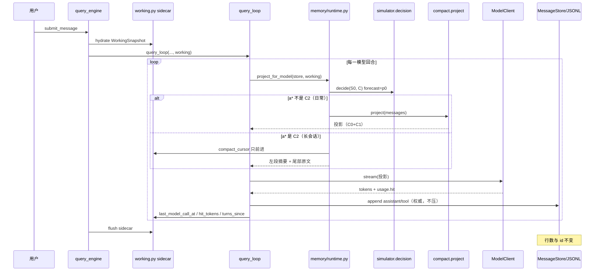

### 1.2 C2 只服务长会话

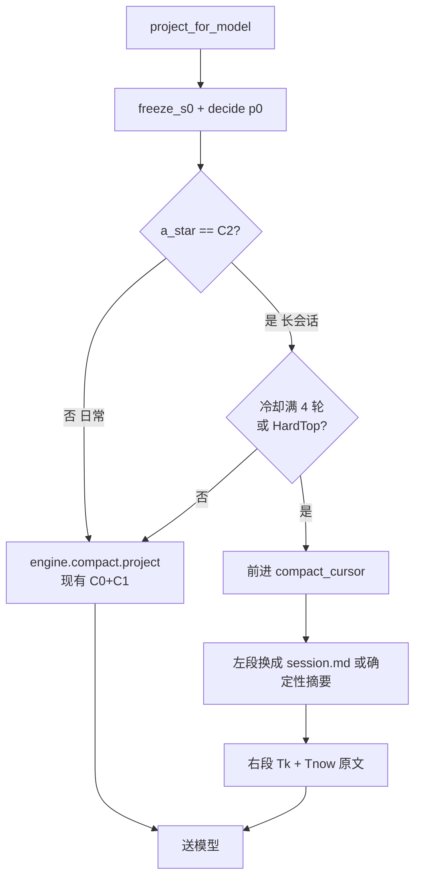

日常 266/276 轮会走左边：多一次 `decide` 的 CPU，**投影字节与今天相同**。

### 1.3 六层全部落地后的切片

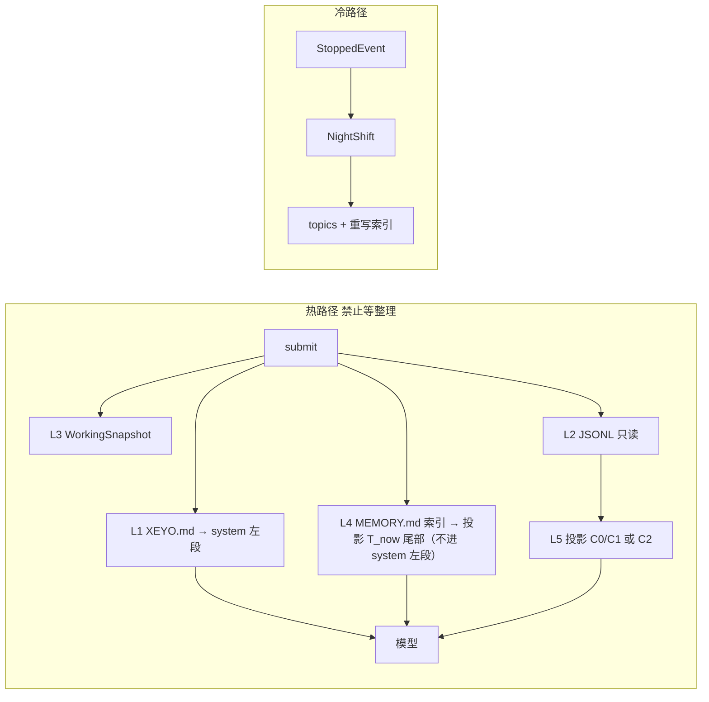

---

## 2. 写文件总顺序（按依赖，禁止跳号）

先完成一列的 DoD，再开下一列。同一 Wave 内按编号。

```text
Wave 1  C2 热路径（日常无感）
  1.1  python/memory/working.py
  1.2  python/session/state.py          （只加引用）
  1.3  python/memory/runtime.py         ★新建，热路径唯一入口
  1.4  python/engine/compact.py         （加 C2 切片，不改 C0/C1 语义）
  1.5  python/engine/query_loop.py      （换投影那一行）
  1.6  python/engine/query_engine.py    （hydrate/flush/传入 working）
  1.7  python/tests/test_runtime_c2.py  ★新建
  1.8  python/tests/test_compact.py     （回归：JSONL 不变、短会话投影不变）

Wave 2  让 C2 摘要可读（仍不写 L4）
  2.1  python/memory/session_md.py      ★新建
  2.2  改 runtime.py：C2 左段优先用 session.md
  2.3  python/tests/test_session_md.py

Wave 3  L1 指令（换会话也记得「怎么干活」）
  3.1  python/memory/instruction.py
  3.2  python/prompt/system_prompt.py
  3.3  python/prompt/assembler.py
  3.4  python/server/session_pool.py    （custom 改为 append）
  3.5  python/tests/test_instruction.py

Wave 4  记住什么 / 下次怎么找回来（L4）
  4.1  python/memory/governance.py      ★新建 schema/冲突/遗忘/晋升闸
  4.2  python/memory/memdir.py
  4.3  python/permissions/gate.py       （memdir 子树 allow）
  4.4  python/memory/search.py          ★新建；P0=索引+Grep
  4.5  python/memory/__init__.py        （slice / search 门面）
  4.6  python/tools/memory_write.py     ★新建 MemoryWrite/Update
  4.7  python/tools/memory_forget.py    ★新建（可与 Write 同 PR 的后半）
  4.8  python/tools/tool_registry.py    （注册，schema 只追加在列表尾）
  4.9  python/prompt/system_prompt.py   （行为段；MEMORY.md 索引进投影 T_now 尾部）
  4.10 python/tests/test_memdir.py / test_governance.py / test_memory_search.py

Wave 5  空闲整理
  5.1  python/memory/nightshift.py
  5.2  query_engine.submit 结束后投递（不进 while）
  5.3  python/tests/test_nightshift.py

Wave 6  多 Agent（最后，未做侧链前回传禁止启用 AgentTool）
  6.1  python/memory/agent_scope.py
```

不要写的文件：

- 不要新开 `v6.2` / 不要改 `simulator` 公式模块
- 不要改 `cache_profile.py` 里再抄一份价目（用 `simulator.cache_model` + `usage.pricing`）
- 不要把 compact 写回 JSONL

---

## Wave 1 — 把 C2 接到热路径

**开关（上线默认关闭公式；测试 / 灰度才开 v61）：**

| 环境变量 | 值 | 行为 |
| --- | --- | --- |
| `XEYO_L5` | 未设置（**默认 `project`**） | 不跑公式，只走现有 C0+C1，字节级等于 `compact.project` |
| `XEYO_L5` | `v61` | 每轮 `decide`；非 C2 仍走 `compact.project`。仅供本人测试 / 灰度 |
| `XEYO_C2_GATE` | 未设置（**默认关**） | project 模式下 C2 触发 = 0 |
| `XEYO_C2_GATE` | `1` / `on` / `hard` | project 模式下单开 C2：仅超长会话（公式 HardTop/软顶 且 `Q≥θ*`）允许 |

实现：`python/memory/l5_flag.py` 的 `DEFAULT_MODE = "project"`，`c2_gate()` 读 `XEYO_C2_GATE`。

`query_loop` 只调 `project_for_model`，自己不判断开关。

---

### 1.1 `python/memory/working.py`

**现在：** 只有 dataclass 占位。

**本文件功能：** L3 机器状态的权威 sidecar。C2 的游标、冷却、TTL 先验全靠它。没有它，C2 无法「只前进不回头」，重启会话会失忆游标、每轮都想再压一次。

**磁盘：** `~/.xeyo/sessions/{session_id}.working.json`

**主体伪代码（写入本文件）：**

```python
# working.py — 本文件只做机器状态，不写给模型看的叙事

@dataclass
class WorkingSnapshot:
    """会话的工作状态（压缩游标、调用统计、辅助数据）"""
    agent_id: str = "main"                          # 当前智能体标识
    compact_cursor: int = 0                         # 已压实的历史消息索引（只增不减）
    turns_since_c2: int = 0                         # 自上次 C2 压缩后的对话轮次
    last_model_call_at: datetime | None = None      # 最近一次模型调用时间
    last_cache_hit_tokens: int = 0                  # 最近请求的缓存命中 token 数
    last_prompt_tokens: int = 0                     # 最近请求的 prompt token 总数
    speculation: list[str] = field(default_factory=list)  # 本回合假说，默认不晋升 L4
    loaded_nested_instruction_paths: list[str] = field(default_factory=list)  # 已加载的嵌套指令路径


def path_for(session_id: str) -> Path:
    """返回会话快照的文件路径（~/.xeyo/sessions/{id}.working.json）"""
    return Path.home() / ".xeyo" / "sessions" / f"{session_id}.working.json"


def hydrate(session_id: str) -> WorkingSnapshot:
    """从 sidecar 读回 WorkingSnapshot；缺文件或坏 JSON 时返回默认空快照"""
    ...


def flush(session_id: str, snap: WorkingSnapshot) -> None:
    """把 WorkingSnapshot 原子写回 sidecar，供重启后续聊"""
    ...


def note_c2(snap: WorkingSnapshot, new_cursor: int) -> None:
    """记录一次 C2：游标只前进，并把 turns_since_c2 清零"""
    assert new_cursor >= snap.compact_cursor
    snap.compact_cursor = new_cursor
    snap.turns_since_c2 = 0


def note_shot(snap: WorkingSnapshot, *, hit: int, prompt: int, at: datetime) -> None:
    """记录本轮模型请求的命中/长度/时间，并把 turns_since_c2 加一"""
    snap.last_cache_hit_tokens = hit
    snap.last_prompt_tokens = prompt
    snap.last_model_call_at = at
    snap.turns_since_c2 += 1
```

**本文件流程图（模块文档字符串用 ASCII 即可）：**

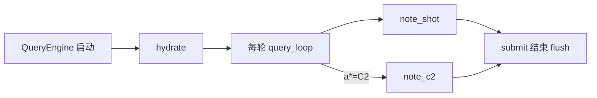

**DoD：** 杀进程后 `compact_cursor` 仍在；缺文件 → 默认全 0；坏 JSON → 当空 sidecar，不崩会话。

---

### 1.2 `python/session/state.py`

**本文件功能：** `SessionState` 加一个字段 `working: WorkingSnapshot`，**不**把 todo/cursor 逻辑写进本文件。

```python
@dataclass
class SessionState:
    """单个 Agent 会话的可变状态容器（本 Wave 只加 working 引用）"""
    cwd: str                                        # 会话工作目录
    messages: MessageStore = field(default_factory=MessageStore)  # L2 权威历史
    budget: BudgetTracker = field(default_factory=BudgetTracker)  # 轮次/字符预算
    abort: AbortController = field(default_factory=AbortController)  # 本回合中止
    session_id: str = ""                            # 与 JSONL / sidecar 文件名一致
    session_persistence_disabled: bool = False      # 是否禁止落盘
    transcript_known_ids: set[str] = field(default_factory=set)  # 已写入 JSONL 的消息 id
    working: WorkingSnapshot = field(default_factory=WorkingSnapshot)  # L3 机器状态引用，不含 memdir I/O
```

`QueryEngine.__init__` / `SessionPool.get_or_create` 在 hydrate JSONL **之后**调用 `working.hydrate(session_id)`。

**DoD：** SessionState 不出现 memdir / XEYO.md 读取。

---

### 1.3 `python/memory/runtime.py` ★新建（Wave 1 主体）+ `l5_flag.py`

**本文件功能：** 热路径唯一入口。先看 `XEYO_L5`：关则直接 `compact.project`；开则把模拟器 `decide` 接到现有 C0+C1。日常非 C2 返回值必须等于今天的 `compact.project`。

**禁止：** 在本文件重写 λ、Q、J、投票。

**主体伪代码：**

```python
"""runtime.py — 送模型投影。公式在 simulator，本文件只 Apply。

flowchart TD
  In[messages + working] --> Sw{XEYO_L5}
  Sw -->|project / 关| P[engine.compact.project]
  Sw -->|v61 / 开 当前默认| S0[state_from_messages]
  S0 --> D[decide forecast=p0]
  D --> K{a_star}
  K -->|keep / C1 / L4| P
  K -->|C2| A[apply_c2]
"""

from engine.compact import project as project_c0c1
from memory.l5_flag import use_v61
from memory.simulator.decision import decide
from memory.simulator.scenarios import state_from_messages
from memory.simulator.cache_model import CacheState
from memory.simulator.params import load_params


def idle_seconds(working: WorkingSnapshot) -> float:
    """根据 last_model_call_at 估算空闲秒数，供 ρ̂ / TTL 先验；无记录则 0"""
    ...


def c2_cut_index(messages: list[dict], s0) -> int:
    """计算 C2 应前进到的消息下标（不含尾部 Tk/Tnow），且不得小于当前 cursor"""
    ...


def deterministic_c2_summary(left: list[dict]) -> str:
    """无 session.md 时用确定性摘要代替左段（id/kind/tokens，不 fork 模型）"""
    ...


def load_session_md(working: WorkingSnapshot) -> str | None:
    """读取本会话 session.md；不存在或 Wave 2 未落地时返回 None"""
    ...


def project_for_model(
    messages: list[dict],
    working: WorkingSnapshot,
    *,
    remaining_turns: int = 8,
) -> list[dict]:
    """按开关生成送模型投影；关闭 v61 或非 C2 时字节级等于 compact.project"""
    if not use_v61():
        return project_c0c1(messages)
    p = load_params()
    s0 = state_from_messages(messages, cursor=working.compact_cursor)
    age = idle_seconds(working)
    cache = CacheState(
        age_seconds=age,            # 距上次打模型的空闲秒数
        x_prev=working.last_x_sim,   # 上一轮真实发送的投影 X → keep 的 Ĥ 不再恒 0
        provider=p.provider,        # 计价/TTL 画像所用厂商
        model=p.model,              # 计价所用模型名
    )
    d = decide(s0, cache, remaining_turns=remaining_turns, params=p, forecast="p0")

    # 日常无感：不 C2 就完全走线上已有路径
    if d.a_star != "C2":
        return project_c0c1(messages)

    # 滞后：未满 4 轮且非 HardTop → 仍当 keep
    if (not d.hardtop) and working.turns_since_c2 < p.min_middle_edit_gap:
        return project_c0c1(messages)

    new_cursor = max(working.compact_cursor, c2_cut_index(messages, s0))
    note_c2(working, new_cursor)
    return apply_c2_messages(messages, working)


def apply_c2_messages(messages: list[dict], working: WorkingSnapshot) -> list[dict]:
    """左段替换为一条 system/summary，右段从 cursor 起再跑 C0+C1"""
    left, right = messages[: working.compact_cursor], messages[working.compact_cursor :]
    summary = load_session_md(working) or deterministic_c2_summary(left)
    head = [{"role": "system", "content": summary, "name": "session_summary"}]
    return head + project_c0c1(right)
```

`l5_flag.py`：

```python
ENV_KEY = "XEYO_L5"
DEFAULT_MODE = "v61"  # 当前默认开。以后必须改为 "project"


def l5_mode() -> str:
    """返回当前 L5 模式：v61 或 project。"""
    ...


def use_v61() -> bool:
    """是否在热路径每轮调用 v6.1 decide。"""
    ...
```

**时序（本文件负责的那一段）：**

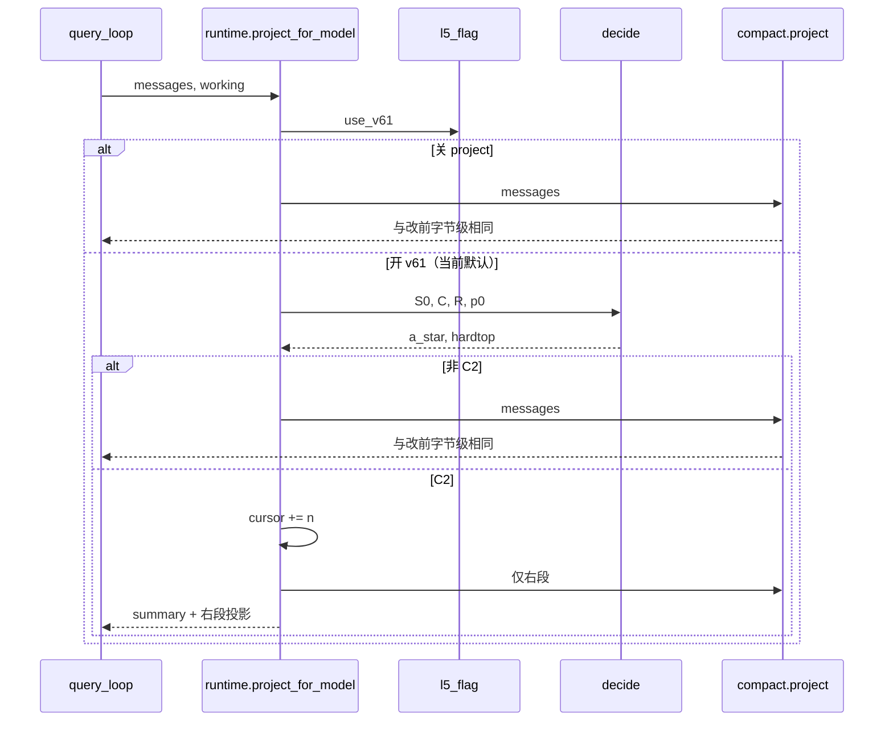

**DoD：**

- `XEYO_L5=project` 时投影 `== compact.project(messages)`（含短会话）
- 默认 `v61` 且短会话 fixture 非 C2 时投影 `== compact.project(messages)`
- 合成 huge 多 tool 且 `decide==C2` 时 `working.compact_cursor` 严格增大
- `store.items` 长度不变
- **以后：** `DEFAULT_MODE` 改为 `"project"`，CI 默认不再每轮 `decide`

---

### 1.4 `python/engine/compact.py`

**本文件功能：** 继续只做 **确定性 C0+C1**（已有）。新增一个纯函数给 C2 用：按 cursor 切开，**不要**在这里调用 `decide`。

```python
def split_at_cursor(history: list[dict], cursor: int) -> tuple[list[dict], list[dict]]:
    """按 compact_cursor 把历史切成左段/右段；不在本函数里调用 decide"""
    c = max(0, min(cursor, len(history)))
    return history[:c], history[c:]
```

现有 `project()` 行为锁死：单测 `test_compact.py` 必须继续绿。

---

### 1.5 `python/engine/query_loop.py`

**本文件功能：** 主循环。记忆平面只出现 **一处**。

把：

```python
api_messages = prompt.build(system_prompt, project(store.as_api_messages()))
```

换成：

```python
async def query_loop(
    *,
    store: MessageStore,                 # L2 权威历史，本函数只 append
    model: ModelClient,                  # 流式模型客户端
    tools: ToolRegistry,                 # 本会话工具表
    prompt: PromptAssembler,             # system + 投影拼 API messages
    system_prompt: str,                  # 本回合已拼好的 system 左段
    abort: AbortController,              # 用户中止
    budget: BudgetTracker,               # max_turns / 字符预算
    working: WorkingSnapshot,            # L3 游标与命中统计；决策不写 JSONL
) -> AsyncIterator[EngineEvent]:
    """智能体主循环：每轮用 project_for_model 取投影，再 stream / 跑工具"""
    ...
    projected = project_for_model(store.as_api_messages(), working)
    api_messages = prompt.build(system_prompt, projected)
    ...
```

`working` 可省略，循环内自建空 `WorkingSnapshot`。开关在 `project_for_model` 内读取，本文件不写 `if use_v61`。循环末（每次模型返回后）若拿得到 usage，调用 `note_shot`。拿不到 usage 就只加 `turns_since_c2` 和 `last_model_call_at`。

**本文件时序（整环，改完应与此一致）：**

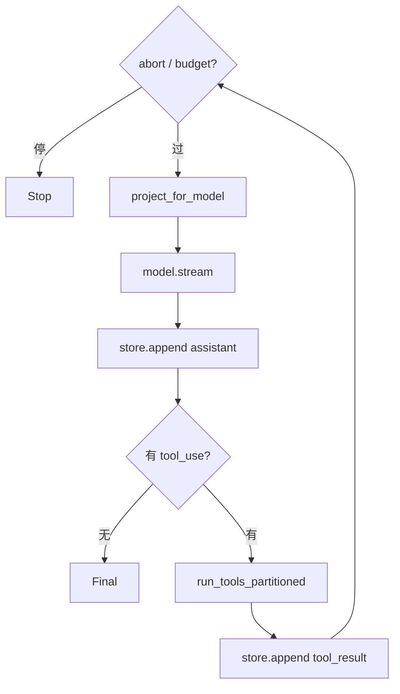

**禁止：** 在 while 里读 XEYO.md、写 MEMORY.md、await NightShift。

**DoD：** `tests/test_query_loop_echo.py`、`test_query_loop_plain.py`、`test_compact.py::test_query_loop_echo_still_works` 全绿。

---

### 1.6 `python/engine/query_engine.py`

**本文件功能：**

1. `__init__` / 恢复会话：`hydrate` working
2. `submit_message`：把 `working` 传进 `query_loop`
3. 循环结束后：`flush` working
4. **不要**在这里做 compact 决策

```python
def __init__(self, config: QueryEngineConfig) -> None:
    """构造引擎并 hydrate WorkingSnapshot（在 JSONL 恢复之后）"""
    ...
    self._session.working = hydrate(self._session.session_id)


async def submit_message(self, prompt, options=None) -> AsyncIterator[EngineEvent]:
    """提交用户输入：把 working 传入 query_loop，结束时 flush sidecar"""
    ...
    async for event in query_loop(..., working=self._session.working):
        ...
    flush(self._session.session_id, self._session.working)
```

`_loaded_nested_memory_paths` 本 Wave 仍可留空；Wave 3 再迁到 working。

---

### 1.7 `python/tests/test_runtime_c2.py` ★新建

必须覆盖：

| 用例 | 断言 |
| --- | --- |
| 短对话 1～5 轮 | 投影 == `compact.project`，cursor 仍为 0 |
| 空 M | `a*` 路径为 keep，投影 == `compact.project` |
| 强制 HardTop（小 window 夹具） | cursor 前进；store 长度不变 |
| 冷却不足 | `turns_since_c2 < 4` 且非 HardTop → 仍 `compact.project` |
| 连续两轮非 C2 | 投影从 system 到 cursor 的字节相同（M-KV1） |

---

### 1.8 回归 `python/tests/test_compact.py`

不改语义。若 `query_loop` 签名变了，测试里补一个空 `WorkingSnapshot()`。

---

**Wave 1 完成定义（可演示）：**

长会话（多轮大 Grep/Read 进 M）自动 C2，模型仍能续聊；日常 echo/短问与改前字节级一致；JSONL 一行不少。**此时还没有「跨会话记住约定」。**

---

## Wave 2 — C2 左段用 `session.md`

C2 第一刀可以用确定性摘要（simulator 的 `[C2] id:kind:tokens`）。可读性差。本 Wave 只补「给模型看的任务语义」，仍不写 L4。

### 2.1 `python/memory/session_md.py` ★新建

**磁盘：** `~/.xeyo/sessions/{id}/session.md`

**权威边界：** 只写 Goal / Current / Completed / discoveries / Open questions / Next。

**禁止写入：** todos、cwd、cursor、hit_tokens（那些是 WorkingSnapshot）。

```python
TEMPLATE = """# Session
## Goal
## Current state
## Completed
## Important discoveries
## Open questions
## Next action
"""


def path_for(session_id: str) -> Path:
    """返回本会话任务语义笔记路径（~/.xeyo/sessions/{id}/session.md）"""
    return Path.home() / ".xeyo" / "sessions" / session_id / "session.md"


def load(session_id: str) -> str | None:
    """读取 session.md 正文；不存在则返回 None，供 C2 左段使用"""
    ...


def maybe_update(session_id: str, messages: list[dict], *, min_tool_calls: int = 8) -> None:
    """超阈值且距上次写 ≥ K 次工具调用才重写；确定性抽取，P0 不 fork 摘要模型"""
    ...
```

触发：C2 即将发生时，或本会话投影超软顶。只在主会话写。

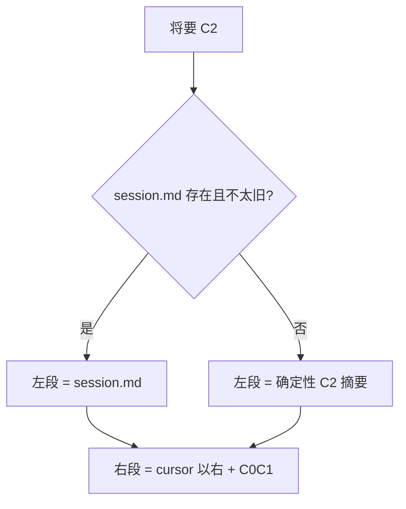

**DoD：** 文件里 grep 不到 `compact_cursor` / `prompt_cache` / `- [ ]` todo 语法（M-L5s）。

---

## Wave 3 — L1 指令记忆（怎么干活）

「记住什么」的第一层是 **规则**，不是笔记。没有 L1，L4 写了模型也经常不听项目宪法。

### 3.1 `python/memory/instruction.py`

**功能：** 发现并拼接 XEYO.md 文件族。后加载覆盖先加载。

```python
def load_instruction_text(cwd: str, workspace_root: str) -> str:
    """按优先级拼接 XEYO.md 文件族（后加载覆盖先加载），供 system 左段注入"""
    chunks = []
    chunks += read_optional(Path.home() / ".xeyo" / "XEYO.md")
    chunks += read_glob(Path.home() / ".xeyo" / "rules" / "*.md")
    chunks += walk_up_to_root(cwd, workspace_root)
    chunks += read_optional(workspace_root / "XEYO.local.md")
    chunks += read_aliases()  # CLAUDE.md / AGENTS.md / .cursor/rules，只读
    return join_with_caps(chunks, max_chars=40_000)


def read_optional(path: Path) -> list[str]:
    """读单个指令文件；缺文件静默返回空列表"""
    ...


def read_glob(pattern: Path) -> list[str]:
    """按 glob 读取 rules 目录下的 md，缺目录则空"""
    ...


def walk_up_to_root(cwd: str, workspace_root: str) -> list[str]:
    """从 cwd 向上走到 workspace 根，收集 XEYO.md / .xeyo/XEYO.md / rules"""
    ...


def read_aliases() -> list[str]:
    """只读并入 CLAUDE.md / AGENTS.md / .cursor/rules，新写入仍用 XEYO.md"""
    ...


def join_with_caps(chunks: list[str], *, max_chars: int) -> str:
    """拼接指令文本并截断到字符上限；@include 深度 ≤ 5，环引用丢弃"""
    ...
```

`@include` 深度 ≤ 5；环引用丢弃；缺文件静默。

### 3.2–3.3 `prompt/system_prompt.py` + `assembler.py`

- 删「暂不做 memory」
- `include_context_blocks=True` 作为 submit 默认
- `user_context["instructions"] = load_instruction_text(...)`
- **左段顺序锁死：** Identity → XEYO.md → 记忆行为段（Wave 4 再加）→ tools schema。
**MEMORY.md 索引不再进左段**（mutation 会弄废整段 KV 前缀），改由 `runtime.project_for_model` 追加到投影 T_now（本轮 user 尾部）。
- Date 只用 `date.today()`，**且由 `QueryEngine` 在会话启动时固化**（`date_iso` 贯通 `PromptAssembler.build_system` → `fetch_system_prompt_parts`），避免跨天首请求改左段字节整段 KV miss

```python
@dataclass
class SystemPromptParts:
    """build_system 的中间结果：默认段 + 用户/系统上下文"""
    default_system_prompt: list[str] = field(default_factory=list)  # 身份与工具说明段落
    user_context: dict[str, str] = field(default_factory=dict)      # 含 instructions（XEYO.md）
    system_context: dict[str, str] = field(default_factory=dict)    # OS 等稳定系统信息


async def fetch_system_prompt_parts(*, cwd: str, model: str, tool_names: Sequence[str], custom_system_prompt: str | None = None) -> SystemPromptParts:
    """拉取 default / user_context / system_context；custom 只允许后续 append，不得整段替换 default+instructions"""
    ...


def assemble_system_prompt(parts: SystemPromptParts, *, append_system_prompt: str | None = None, include_context_blocks: bool = True) -> str:
    """按锁死顺序拼 system 左段：Identity → XEYO.md → 行为段 → tools schema。MEMORY.md 索引不在左段，由 runtime 追加到投影 T_now 尾部"""
    ...
```

### 3.4 `python/server/session_pool.py`

`custom_system_prompt` **禁止整段替换** default+instructions；只允许 `append_system_prompt`。否则 L1 永远进不去（M-L1）。

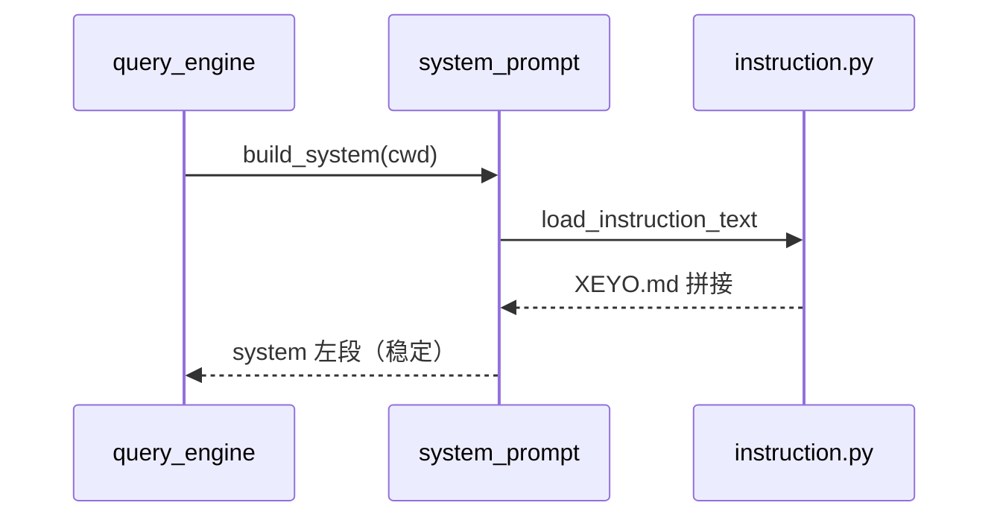

**DoD：** 工作区根放一句「永远用中文回复」→ 新会话 system 含该句。

---

## Wave 4 — 记住什么，下次怎么找回来

这是用户说的「每一层都要」里 **跨会话知识** 的核心。必须先有 Governance，再落盘。不要先堆四个空文件夹。

### 4.1 `python/memory/governance.py` ★新建（先于 memdir 写入）

**功能：** MemoryNote schema、冲突、tombstone、晋升闸。无 I/O 或只有纯函数。

```python
ALLOWED_TYPES = {"user", "feedback", "project", "reference"}   # 允许的 Note 类型
ALLOWED_STATUS = {"active", "superseded", "deleted"}           # 生命周期状态
ALLOWED_SCOPE = {"user", "workspace", "project", "task"}       # 生效范围


@dataclass(frozen=True)
class MemoryNote:
    """一条长期记忆（Knowledge Truth）；缺必填字段不得当 active"""
    id: str                                     # 稳定 id（如 mem_01J…）
    type: str                                   # user | feedback | project | reference
    content: str                                # 事实正文（不含索引叙事）
    source: dict                                # 溯源：kind / session_id / message_id
    confidence: float                           # 1.0 用户确认 / ≤0.6 推断
    status: str                                 # active | superseded | deleted
    scope: str                                  # user | workspace | project | task
    applies_to: list                            # 路径/工作区等适用范围，用于冲突分流
    created_at: str                             # 首次写入日
    updated_at: str                             # 最近改字节日
    last_confirmed_at: str                      # 最近一次被确认日（消解冲突用）
    last_used_at: str | None                    # 最近一次被检索/引用；可空
    expires_at: str | None                      # 过期日；空表示不过期
    supersedes: str | None                      # 本条替换的旧 Note id；无则空


@dataclass(frozen=True)
class Tombstone:
    """已遗忘条目的墓碑；NightShift 禁止按旧 JSONL 复活"""
    id: str                                     # 被删 Note 的 id
    deleted_at: str                             # 删除日
    reason: str                                 # 如 user_request


@dataclass
class MemoryCandidate:
    """待验证候选；未过闸不得写入 topics / 不得进 MEMORY.md"""
    content: str                                # 候选陈述
    source: dict                                # 来自哪次会话/消息
    evidence: list[str] = field(default_factory=list)  # 用户确认/事实/多会话证据


def parse_and_validate(frontmatter: dict, body: str) -> MemoryNote:
    """把 frontmatter+正文校验成 MemoryNote；缺 source/confidence/status 则拒绝"""
    ...


def can_promote(candidate: MemoryCandidate) -> bool:
    """是否允许晋升为 active：须用户确认 / 可核对事实 / 多 session 无冲突 / 控制面确认之一；禁止仅因重复出现"""
    ...


def resolve_conflict(old: MemoryNote, new: MemoryNote) -> str:
    """先比 scope/applies_to；不冲突返回 coexist；同 scope 互斥则 supersede（推断不得覆盖用户确认）"""
    ...


def forget(note_id: str) -> Tombstone:
    """将 Note 标 deleted 并生成 tombstone，供索引删除与 NightShift 遵守"""
    ...


def may_resurrect(note_id: str, tombstones: list[Tombstone]) -> bool:
    """是否允许把已遗忘 id 写回 active；永远 False（NightShift 硬禁止）"""
    return False
```

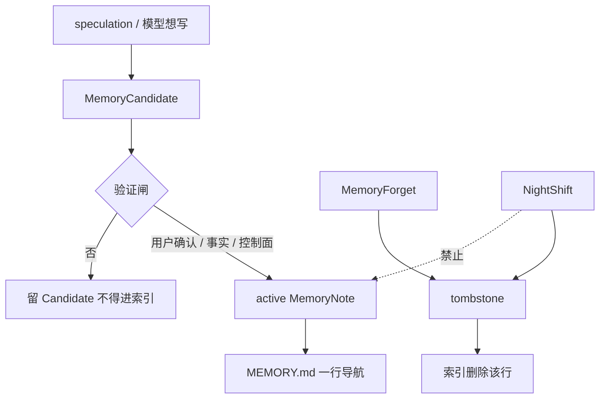

**DoD：** 单测即可，不碰磁盘。缺字段拒；不同 `applies_to` 共存；Forget 后 `may_resurrect=False`。

---

### 4.2 `python/memory/memdir.py`

**功能：** 工作区记忆域的磁盘布局与索引维护。

```text
~/.xeyo/memory/{workspace_id}/
  workspace.json
  MEMORY.md          # 仅导航，≤200 行 且 ≤25KB
  topics/*.md
  tombstones.jsonl
```

```python
def workspace_id(canonical_path: str) -> str:
    """由规范化工作区路径生成稳定 workspace_id；复制目录必须得到新 id"""
    ...


def memdir_root(wsid: str) -> Path:
    """返回该工作区记忆根目录（~/.xeyo/memory/{workspace_id}/）"""
    ...


def rewrite_index(notes: list[MemoryNote]) -> None:
    """只写导航行 [type] 标题 → topics/xxx.md；禁止叙事；仅 mutation 成功或 NightShift 时调用"""
    ...


def load_index_text(wsid: str) -> str:
    """热路径只读 MEMORY.md；两次非 mutation 的 submit 之间字节必须不变"""
    ...
```

索引行格式锁死：

```text
[feedback] 测试必须用真实 DB → topics/feedback-testing.md
```

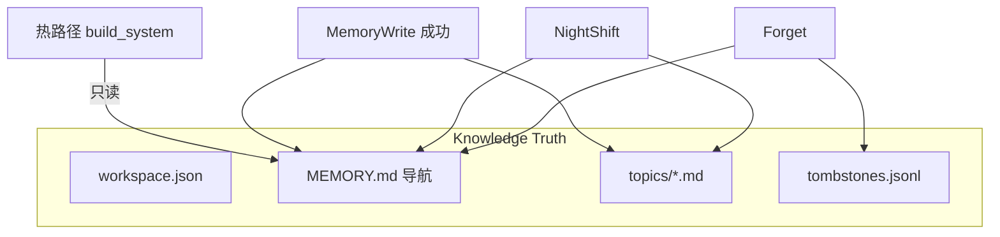

---

### 4.3 `python/permissions/gate.py`

`_WRITE_PATH_TOOLS` 增加 MemoryWrite/Update/Forget。

写入路径必须在 `memdir_root` 内；`../` 逃逸 deny（M-L4）。

普通 `Write` 写到 memdir：P0 可允许但 **必须** 过 `parse_and_validate`；缺 schema 拒绝。

P1 起普通 Write 写 memdir 改为 deny，只走 Memory* 工具。

---

### 4.4 `python/memory/search.py` ★新建

**功能：** 「下次怎么找回来」。同一函数，实现可换。

```python
def search(query: str, *, scope: str, top_k: int = 5) -> list[MemoryNote]:
    """按查询和范围返回 Note；P0 用索引过滤 + Grep(cwd=memdir)，禁止在本函数里调模型"""
    ...
```

热路径 **不**自动把 search 结果塞进 system（那会每轮打散 KV）。

模型通过工具调用 `MemorySearch` 或直接 Grep/Read topics。

system 里只有 **索引**，让模型知道该搜什么。

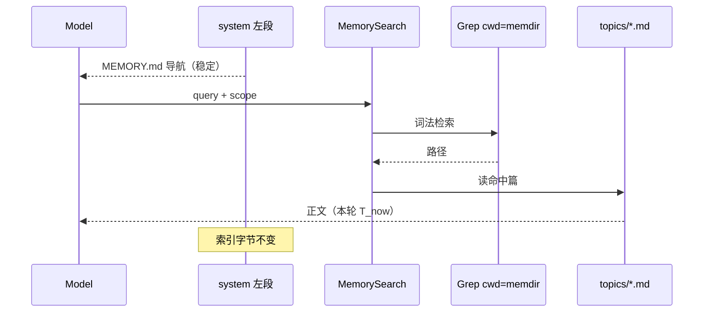

---

### 4.5 `python/memory/__init__.py`

门面，主循环只依赖这里：

```python
def search(query: str, *, scope: str, top_k: int = 5) -> list[MemoryNote]:
    """门面：转交 memory.search.search，主循环不直接依赖 search.py"""
    ...
```

> 说明：早期设计的 `MemorySlice` / `slice_for_turn` 已删除（死代码）。L1 指令由 `fetch_system_prompt_parts` 进 system 左段；L4 索引由 `runtime.project_for_model` 追加到投影 T_now 尾部，不经过本门面。

---

### 4.6–4.8 工具：`MemoryWrite` / `MemoryUpdate` / `MemoryForget`

| 文件 | 功能 |
| --- | --- |
| `python/tools/memory_write.py` | 强制 frontmatter；写 `topics/`；成功才 `rewrite_index` |
| `python/tools/memory_forget.py` | `status=deleted` + tombstone 行；索引删行 |
| `tool_registry.py` | **只追加在 schemas() 列表尾**，禁止重排（否则整段 KV miss） |

```python
async def memory_write(input: dict, *, workspace_id: str) -> str:
    """写入一条 MemoryNote 到 topics/；frontmatter 必须过 parse_and_validate，成功后才 rewrite_index"""
    ...


async def memory_update(input: dict, *, workspace_id: str) -> str:
    """更新已有 Note（含 supersedes）；校验 schema 后写回，成功才改索引"""
    ...


async def memory_forget(note_id: str, *, workspace_id: str, reason: str) -> str:
    """将 Note 标 deleted、追加 tombstone，并从 MEMORY.md 去掉该导航行"""
    ...


def register_memory_tools(registry: ToolRegistry) -> None:
    """把 Memory* 追加到 schemas() 列表尾部，禁止插入或重排已有工具"""
    ...
```

工具 prompt 必须写清：不要把能 Grep 到的目录结构写成 project；不要把一次性方案写成 feedback。

**「记住」的产品路径：**

```text
用户：「记住，测试必须打真库」
  → 模型调 MemoryWrite
      type=feedback, source.kind=user, confidence=1.0
  → topics/feedback-testing.md
  → MEMORY.md 多一行
下一会话：
  本轮投影 T_now 尾部看到索引行（索引不进 system 左段，避免 mutation 弄废整段 KV 前缀）
  需要细节时 MemorySearch / Read 该篇
```

---

### 4.9 再改 `system_prompt.py`

插入 **记忆行为段**（稳定，几乎不改字节）：何时该 MemoryWrite、何时不该、禁止用普通笔记冒充 Note、Forget 的说法。

`MEMORY.md` 索引**不进左段**（仅 NightShift/mutation 后变，若在 system 里会让后续整个请求从改点起 miss），改由 `runtime.project_for_model` 追加到投影 T_now（本轮 user 尾部）。

左段最终顺序：

```text
Identity
XEYO.md
Memory behavior instructions
tools schema（只追加）
```

**DoD（Wave 4）：** 「记住：测试必须打真库」→ 新会话仍能从索引看到并遵守；Forget 后索引消失且 NightShift 测里不得复活。

---

## Wave 5 — NightShift（空闲整理）

### 5.1 `python/memory/nightshift.py`

**功能：** 调度 + 投递。**正确性在 governance**，本文件不发明晋升规则。

```python
@dataclass
class NightShiftState:
    """空闲整理的调度状态（不是记忆正确性规则）"""
    last_consolidated_at: datetime | None = None  # 上次成功整理时间
    candidate_count: int = 0                      # 待过闸 Candidate 条数
    memdir_bytes: int = 0                         # memdir 体积
    pending_forget_or_conflict: bool = False      # 有 Forget 或未消解冲突时必须跑


def has_lock(workspace_id: str) -> bool:
    """尝试取得该工作区 NightShift 文件锁；未拿到则本轮跳过"""
    ...


def should_run(state: NightShiftState, workspace_id: str) -> bool:
    """是否该整理：24h / Candidate 超阈 / 体积超阈 / 有 Forget 或冲突；禁止写成「少于 5 session 就永不跑」"""
    return has_lock(workspace_id) and (
        hours_since_last >= 24
        or state.candidate_count > N
        or state.memdir_bytes > M
        or state.pending_forget_or_conflict
    )


def run(workspace_id: str) -> None:
    """在 memdir 内蒸馏 Candidate、消解冲突、丢掉过期、遵守 tombstone，最后只 rewrite_index 一次"""
    ...


def maybe_schedule(*, after_stop: bool) -> None:
    """submit 结束后 create_task 投递整理；禁止在 query_loop 的 while 里 await"""
    ...
```

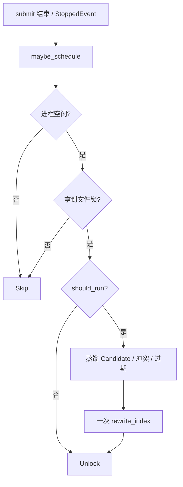

挂钩：`query_engine.submit_message` 的 **循环结束之后**一行 `maybe_schedule_nightshift()`。TTL 过期 **不**发空请求续命。

**DoD：** 无锁跳过；tombstone 零复活；query_loop 测试里 mock 掉 schedule，主循环不变慢。

---

## Wave 6 — `python/memory/agent_scope.py`（最后）

未做「子 Agent 侧链 + 只回传一条 tool_result」之前，**不要**启用 AgentTool。

```python
@dataclass(frozen=True)
class AgentScope:
    """子 Agent 与主会话的记忆边界（未做侧链前不要启用 AgentTool）"""
    agent_id: str = "main"              # main 或子 Agent id
    can_write_memdir: bool = True       # 主会话可写；子 Agent 默认 False
    can_write_session_md: bool = True   # 仅主会话可写 session.md / cursor
    share_kv_prefix: bool = False       # 禁止与主会话共用一条 KV 前缀


def scope_for(agent_id: str) -> AgentScope:
    """按 agent_id 返回隔离规则：子 Agent 只读 memdir、不写主 JSONL / session.md"""
    ...


def attach_subagent_result(main_store, summary: str) -> None:
    """子 Agent 结束时只向主历史追加一条 tool_result，禁止把子全文写入主 JSONL"""
    ...
```

| 对象 | 主会话 | 子 Agent |
| --- | --- | --- |
| JSONL | 主文件 | 禁止写主文件 |
| session.md / cursor | 仅主 | 自己的短投影 |
| memdir | 可 Write（过闸） | 默认只读 |
| KV 前缀 | 自己的 | 不共用 |

---

## 3. 每层对应「谁在干活」（写完后对照）

| 层 | 主要文件 | 热路径做什么 | 日常短会话 |
| --- | --- | --- | --- |
| L1 | `instruction.py` + `system_prompt.py` | 读 XEYO.md 进 system | 有感（规则生效） |
| L2 | `message_store.py` JSONL | 只增 | 不变 |
| L3 | `working.py` | cursor / 冷却 / hit | 无感（全 0） |
| L4 | `governance.py` + `memdir.py` + `search.py` + Memory* 工具 | system 只带索引；正文靠搜 | 无笔记则无感 |
| L5 | `runtime.py` + `compact.py` + `session_md.py` | keep→C0C1；长会话 C2 | 无感 |
| L6 | `nightshift.py` | 不在 while 里 | 无感 |
| Gov | `governance.py` | 横切 L1/L3/L4 | 写记忆时才碰到 |

---

## 4. 建议的 PR 切片（可回滚）

| PR | 含 Wave | 演示 | 回滚 |
| --- | --- | --- | --- |
| PR-C2 | 1.1–1.8 | 长会话不 400；短 echo 与今天一致 | 还原 `query_loop` 那一行 |
| PR-SessMD | Wave 2 | C2 左段可读 | runtime 回退确定性摘要 |
| PR-L1 | Wave 3 | XEYO.md 改回复语言 | 关 include_context_blocks |
| PR-L4 | Wave 4 | 「记住真库」跨会话仍在 | 不注册 Memory* 工具 |
| PR-L6 | Wave 5 | 空闲后索引更新、Forget 不复活 | `maybe_schedule` 变空函数 |

禁止把 PR-C2 和 PR-L4 合成一个大 PR。C2 接上之前不要开 NightShift 自动晋升。

---

## 5. 验收速查（实现时对着勾）

来自 [10](./10-%E5%AE%8C%E6%95%B4%E8%AE%B0%E5%BF%86%E4%BD%93%E7%B3%BB.md) §10，与本步骤书绑定：

- **M-L2 / M-KV1：** 非 C2 两轮，前缀字节相同；JSONL id 集合不变
- **M-KV2：** 非 HardTop 时 C2 后 3 轮内不再前进 cursor
- **M-KV3：** 无空请求续命
- **M-L1：** XEYO.md 进 system；custom 不得吞掉
- **M-L4 / M-L4i / M-L4m：** schema、索引只导航、热路径不改索引字节
- **M-L4f / M-L6：** Forget + 零复活
- **M-L5s：** session.md 与 Snapshot 分家

公式与模拟器回归：`pytest tests/simulator tests/test_compact.py` 默认不含 live。
