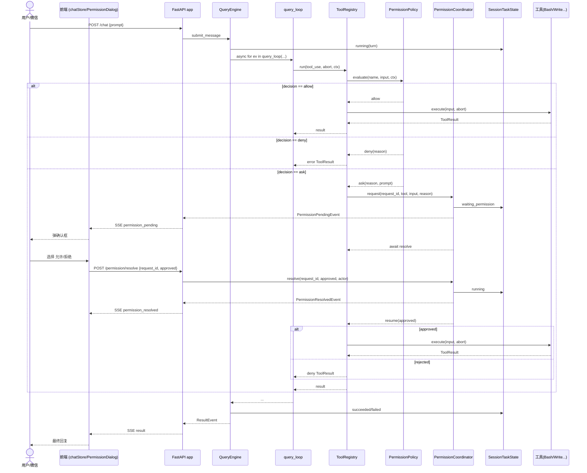

# XEYO 权限与状态基础设施实施计划书

> 版本：v1  更新时间：2026-08-23
> 依据：`docs/14-参考Claude设计后的项目进度与下一步建议.md`、`docs/18-参考piagent的工具能力设计建议.md`、当前生产源码（`python/`、`gui/`）与权限/状态相关测试。
> 目标：把"当前设计"与"目标计划"之间的差异，收敛为可执行的里程碑；先做基础设施（事件身份、会话任务状态、统一权限 policy、权限挂起—恢复、工作区作用域），再谈工具扩展。

---

## 0. 结论：当前设计与目标计划的差异

现状（已核对源码）：

| 领域 | 现状事实 | 目标计划 |
|---|---|---|
| 权限三态 | `PermissionDecision` 已有 `ALLOW/DENY/ASK`，但 `enforce_decision()` 把 `ASK` 降级为 `DENY`；`GateResult` 只有 `allowed: bool`，无法表达"需要审批" | `ASK` 可冒泡为"挂起等待确认"，可确认、可拒绝、可超时 |
| 事件身份 | `EngineEvent` 8 类事件，每条无 `session_id/turn_id/event_id`，无 envelope | 统一 envelope + `permission_pending/resolved` + `task_state_changed` |
| 会话任务状态 | 靠 `TodoWrite`（进程内 `DEFAULT_TODO_KEY`）+ 前端 `chatStore` + `JobStore` 拼凑 | 权威 `SessionTaskState`（queued/running/waiting_permission/stopping/stopped/succeeded/failed） |
| 工具执行上下文 | `ToolRegistry.run` 只接收 `(tool_use, abort)`，无 request_id、无运行时上下文、无权限回调 | 显式 `ToolUseContext`，含 session/turn/工作区/权限协调器 |
| 工作区作用域 | `session/cwd.py` 用模块级 `_cwd` 全局变量，`set_cwd` 不改 `os.chdir`；多 session 并发可能串目录 | 每个 session 持有可验证的 `WorkspaceContext`，显式传递 |
| 未知工具策略 | `can_use_tool` 对未知工具 `unknown_tool_passthrough` → allow（宽松） | 未知工具默认 `ask`/`deny`，放行必须显式规则命中 |
| 能力矩阵 | `ENABLED_TOOLS`/`SCAFFOLD_TOOLS` 已分离，默认 registry 排除 scaffold | 冻结边界 + 契约测试，防止模型调用空壳/宽松透传 |
| 多通道接入 | FastAPI、HTTP bridge、JSONL bridge、remote、iLink 各自持有入口/状态 | 统一到同一 engine 事实源，通道只做传输适配 |

一句话：**当前不是缺工具，而是缺支撑工具运行的"一根线"——身份、状态、权限、工作区。** 计划书只聚焦这根线。

---

## 1. 总体设计

### 1.1 分层架构

```
用户/前端 ──POST /chat──> FastAPI app ──> QueryEngine.submit_message
                                              │  权威：SessionTaskState + session/turn/event 身份
                                              ▼
                                        query_loop（事件流）
                                              │  每个工具调用：
                                              ▼
                                    ToolRegistry.run(tool_use, abort, ctx)
                                              │
                                              ▼
                                    PermissionPolicy.evaluate() ──> allow | ask | deny
                                              │              │
                                      allow ──执行工具──┘      │ ask
                                                               ▼
                                                 PermissionCoordinator
                                                  │  ① 状态 → waiting_permission
                                                  │  ② 发出 permission_pending 事件
                                                  ▼
                                            await resolve（超时默认 deny）
                                                  │
                       ┌──────────────────────────┘
        ┌──────────────▼────────────┐         ┌──────────────┐
        │ 桌面 PermissionDialog    │         │ iLink / 远程 │
        └──────────┬───────────────┘         └──────┬───────┘
                  └──────────POST /permission/resolve──┘
```

### 1.2 职责边界

| 层 | 职责 | 归属 |
|---|---|---|
| 入口 | 接收输入、渲染事件、回传控制命令（含 resolve） | `server/app.py`、`bridge/http.py`、`bridge/__main__.py`、`channels/*` |
| 引擎 | 持有 `SessionTaskState`、`WorkspaceContext`、`PermissionCoordinator`，发布事件 | `engine/query_engine.py`、`engine/query_loop.py` |
| 工具运行时 | 统一 gate → 执行/挂起/拒绝；透传 request id、cancel、超时、权限上下文 | `tools/tool_registry.py`、`tools/orchestration.py` |
| 权限 | 确定性规则评估，返回 `allow/ask/deny`，含 profile 与受保护路径 | `permissions/policy.py`、`permissions/filesystem.py` |
| 状态 | 会话生命周期状态机；`TodoWrite` 仅作为兼容写入器 | `engine/task_state.py` |
| 通道 | 消费统一事件，推送审批/任务/停止命令；不做各自状态推导 | `channels/*` |
| 前端 | 事件 reducer 化，消费 `task_state`/`permission` 投影，弹确认框 | `gui/` |

### 1.3 设计原则

1. **单点权威**：只有 engine 层能改任务状态和发布统一事件；入口与通道不做状态推导。
2. **挂起可恢复**：`ask` 不是错误，而是"暂停 turn 等确认"；同一 `request_id` 只能处理一次。
3. **确定性优先**：放行由显式规则命中；未知/危险默认拒绝或询问，不宽松透传。
4. **最小化侵入**：不重写主循环、不推倒 `SessionPool`/`iLink`/已有前端测试；在其上补统一状态与事件。
5. **向后兼容**：新 envelope 与旧事件并存；旧客户端不破坏，未知事件跳过并记录可诊断信息。

---

## 2. 模块设计

### 2.1 事件 Envelope（`msgtypes`）

每条出站事件包一层外壳，包含身份与顺序：

```
schema_version, session_id, turn_id, event_id, created_at, type, payload
```

- `event_id`：同 turn 内单调递增，供前端去重、排序、断线 reset/replay。
- 保留现有事件的 `type` 字段，旧客户端兼容。
- 新增事件：
  - `PermissionPendingEvent{request_id, tool_name, tool_input, reason, prompt, expires_at}`
  - `PermissionResolvedEvent{request_id, approved, actor, resolved_at, reason}`
  - `TaskStateEvent{session_id, turn_id, task_status, current_tool, interruptible, error}`

### 2.2 `SessionTaskState`（新 `engine/task_state.py`）

状态机：

```
queued → running → waiting_permission → running → succeeded
                            │                    └──> failed
                            └──> stopping → stopped
```

字段：`session_id`、`turn_id`、`job_id?`、`revision`、`updated_at`、`current_tool`、`interruptible`、`error`。

约定：
- 权威 = QueryEngine/Session；`SessionPool` 只负责 lease/interrupt 资源协调。
- `TodoWrite` 继续支持；它只写兼容 snapshot，不再作为任务状态的唯一事实源。
- 每次状态变化产生可去重的 `TaskStateEvent`。

### 2.3 统一权限 Policy（新 `permissions/policy.py`）

把 `can_use_tool` 的硬编码判断收敛为规则评估：

```python
@dataclass(frozen=True)
class PolicyDecision:
    decision: PermissionDecision   # allow | ask | deny
    reason: str
    # ask/deny 时附带可读信息，供弹窗展示
    prompt: str | None = None
    matched_rule: str | None = None
    path: str | None = None
```

规则组成：
- **工具级**：`write/edit/bash` 为"确认门"工具（除非命中允许规则）；`read` 只读放行；`echo/getTime/TodoWrite` 放行。
- **路径级**：工作区内放行；cwd 外 → `ask`；受保护路径（`.git/.ssh/密钥/凭据`）→ 执行前 `deny`。
- **profile**：`read_only` / `workspace_write` / `full`；映射为 `allowed_working_paths` 与工具放行集。
- **确定性兜底**：未知工具 → `ask`；无匹配规则 → `deny`；放行必须显式命中（不再 `passthrough allow`）。

### 2.4 权限挂起—恢复（新 `permissions/store.py`、`engine/permission_coordinator.py`）

`PendingPermissionStore`（内存、进程内）：
- key = `request_id`，value = 请求模型 + `asyncio.Event`；记录 `expires_at`。
- `create(...)`、`wait(request_id, timeout)`、`resolve(request_id, approved, actor)`（幂等：已处理返回 False）。

`PermissionCoordinator`（由 QueryEngine 持有）：
- `request(tool_name, input, reason)` → 创建 request_id、状态转 `waiting_permission`、发布 `PermissionPendingEvent`、返回 request_id。
- `resolve(request_id, approved, actor)` → 状态回 `running`、发布 `PermissionResolvedEvent`、唤醒等待者。
- 超时（未在 `expires_at` 内确认）→ 按 `deny` 处理并发布 resolved(reason=timeout)。

### 2.5 工具执行上下文（`tools/tool_registry.py` 改造）

`registry.run(tool_use, abort, ctx: ToolUseContext)`：
- `ToolUseContext{session_id, turn_id, cwd, allowed_paths, permission_profile, coordinator}`
- gate 命中 `ask` → 不执行，改走 `coordinator.request(...)` 并 `await` 恢复；恢复后再执行或记录拒绝 `ToolResult`。
- 支持 request id、cancel、timeout 透传。

### 2.6 工作区作用域（新 `engine/workspace_context.py`）

- `WorkspaceContext{session_id, cwd, allowed_paths, permission_profile}`，由 QueryEngine 创建并显式传入 `query_loop → registry.run → tool.execute → policy`。
- `session/cwd.py` 保留为兼容 shim，但不再作为并发会话的权威来源；由 `WorkspaceContext` 提供权威 `cwd`。
- 工具工厂已按 `cwd` 绑定实例，配合显式 `WorkspaceContext`，杜绝多会话串目录。
- 排查并修复 Tauri `lib.rs` 固定注入 `XEYO_CWD=<Python 根>`，改为映射用户 `activeSpace.rootPath` 到 session/workspace。

### 2.7 前端

- `types.ts`：扩展 `BridgeEvent`，新增 `permission_pending/resolved`、`task_state_changed` 与 envelope 字段。
- `api.ts`：解析新 envelope，兼容旧的 `assistant_delta/tool_call/tool_result/final/stopped/error`；未知事件跳过并记录。
- `permissionStore.ts`（新）：持有待审批列表；`resolve(request_id, approved)` 调用 `POST /permission/resolve`。
- `PermissionDialog.tsx`（新）：展示工具名、路径/命令、原因；允许 / 允许本次 / 拒绝 / 超时。
- `chatStore.ts`：reducer 化，消费 `task_state`/`permission` 事件；断线后按 `event_id` 去重/恢复。
- `remoteStore.ts`：消费统一事件，做远程投影；不再各自猜测状态。

### 2.8 通道（iLink / remote / File Helper）

- `channels/runner.py`：映射 `FinalOnlyRunner` 到 `SessionTaskState`；支持 `waiting_permission`、`stopping`、turn 绑定。
- `channels/jobs.py`：`JobStore` 只存远程投递与结果；对齐 turn/job。
- `channels/ilink/service.py`：消费统一事件，增加审批确认/拒绝、任务状态、停止命令；保持按 peer/session 隔离。
- `channels/filehelper/service.py`：保持 `intentionally thin final-only`，不镜像工具调用与审批过程。

### 2.9 能力矩阵冻结

- `catalog.py`：实测能力区分"真实可用"、"显式禁用"、"未实现"三类；`SCAFFOLD_TOOLS` 永不进默认 registry。
- `stub.py`：`not_implemented` 保留，但 scaffold 工具对模型不可见。
- `test_catalog.py`：回归确保 scaffold 不注册；新增"未知工具默认 ask/deny 而非透传"的契约测试。

---

## 3. 实施步骤（里程碑 + 验收）

> 每个 PR 先写契约测试，再改实现，避免把既有稳定能力与新协议一起推倒。

### 里程碑 M1：事件身份与统一事件（PR-1）
- 改 `msgtypes/events.py`（新增三类事件 + envelope 字段）
- 改 `engine/query_loop.py`、`engine/query_engine.py`（穿 `session_id/turn_id/event_id`，发布任务/权限事件）
- 改 `server/app.py`、`bridge/http.py`、`bridge/__main__.py`（统一事件发布/传输适配）
- 改前端 `types.ts`、`api.ts`（兼容解析）
- 验收：本地、remote、HTTP bridge、JSONL bridge、iLink 观察到同一 `session_id+turn_id+event_id`；乱序/重复不产生第二条工具行或第二次 final。

### 里程碑 M2：SessionTaskState + 工作区作用域（PR-2）
- 新增 `engine/task_state.py`、`engine/workspace_context.py`
- 改 `engine/query_engine.py`、`engine/query_loop.py`、`server/session_pool.py`、`permissions/filesystem.py`
- 改 `session/cwd.py`（变为兼容 shim）；排查 `gui/src-tauri/src/lib.rs`
- 验收：两个并行 session 各自使用自己的 cwd；Tauri dev/release 都把用户 workspace 绑定到正确 session；`queued/running/stopping/stopped/failed/succeeded` 可查询、可恢复，Todo 不再是唯一事实源。

### 里程碑 M3：统一权限 policy + ASK 挂起—恢复（PR-3）
- 新增 `permissions/policy.py`、`permissions/store.py`、`engine/permission_coordinator.py`
- 改 `types/permissions.py`（完整请求模型）、`permissions/gate.py`（收敛为 policy 调用）、`tools/tool_registry.py`、`tools/orchestration.py`、`engine/query_loop.py`
- 改 `server/app.py`（`POST /permission/resolve`）
- 验收：Bash/Write 等确认门工具能弹窗→确认→继续；拒绝/超时默认 deny；同一 request 只处理一次；拒绝后 session 不死，可继续下一轮。

### 里程碑 M4：前端 + 通道接入（PR-4）
- 新增 `gui/src/components/PermissionDialog.tsx`、`gui/src/stores/permissionStore.ts`
- 改 `gui/src/stores/chatStore.ts`、`remoteStore.ts`、`AppShell.tsx`
- 改 `channels/runner.py`、`channels/jobs.py`、`channels/ilink/service.py`、`channels/filehelper/service.py`
- 验收：桌面弹确认框；iLink 可确认/拒绝/超时；File Helper 仍 final-only；现有主链路/投影/profile 测试继续通过。

### 里程碑 M5：能力矩阵冻结 + 契约测试（PR-5）
- 改 `tools/catalog.py`、`tools/stub.py`、`tools/tool_registry.py`、前端 capability 类型
- 新增/改 `python/tests/test_catalog.py`、`test_permissions.py`、`test_permission_policy.py`、`test_permission_ask_resume.py`
- 验收：默认 registry 永不暴露 scaffold；真实工具 execute/错误/取消/权限边界可回归；未知工具默认为 ask/deny；模型不会把 schema 误当可执行能力。

---

## 4. 时序图（权限 ASK 挂起—恢复）



> 超时：`CO.wait(request_id, timeout)` 在 `expires_at` 到期时按拒绝处理并发布 `PermissionResolvedEvent(reason=timeout)`。

---

## 5. 涉及文件

### 5.1 新建文件

后端：
| 文件 | 作用 |
|---|---|
| `python/engine/task_state.py` | `SessionTaskState` 状态机 + 状态事件 |
| `python/engine/workspace_context.py` | 每会话 `WorkspaceContext`（session/cwd/授权路径/profile） |
| `python/engine/permission_coordinator.py` | 发起/恢复/超时权限请求，衔接 task state 与事件 |
| `python/permissions/policy.py` | 统一规则评估；返回 `allow/ask/deny` + 可读 prompt |
| `python/permissions/store.py` | `PendingPermissionStore`（request_id → waiter/Event，TTL） |
| `python/msgtypes/envelope.py` | `Envelope` 模型 + `wrap()` + event_id 生成器 |

前端：
| 文件 | 作用 |
|---|---|
| `gui/src/components/PermissionDialog.tsx` | 审批确认弹窗 |
| `gui/src/stores/permissionStore.ts` | 待审批列表 + `resolve()` |
| `gui/src/lib/permissionEvents.ts` | 新 `BridgeEvent` 变体类型守卫（可并入 types.ts） |

测试：
| 文件 | 作用 |
|---|---|
| `python/tests/test_event_envelope.py` | envelope 身份/排序/去重 + 旧事件兼容 |
| `python/tests/test_task_state.py` | 状态机流转 + 事件发布 + TaskStateEvent |
| `python/tests/test_permission_policy.py` | allow/ask/deny 三态 + profile + 未知工具兜底 |
| `python/tests/test_permission_ask_resume.py` | 挂起→确认→恢复；拒绝/超时；request 幂等 |
| `python/tests/test_workspace_scope.py` | 两 session 并发不串 cwd + workspace 绑定 |

### 5.2 修改文件

后端：
| 文件 | 改动 |
|---|---|
| `python/msgtypes/events.py` | 新增三类事件；加 envelope 字段；更新 `EngineEvent` |
| `python/engine/query_loop.py` | 穿 `session_id/turn_id`；处理 ask 挂起；发布审批/任务事件 |
| `python/engine/query_engine.py` | 持有 `SessionTaskState`/`WorkspaceContext`/`PermissionCoordinator`；透传到 loop |
| `python/server/session_pool.py` | 映射 busy/lease → task state |
| `python/server/app.py` | 新增 `POST /permission/resolve`、`GET /task`；事件统一发布 |
| `python/permissions/gate.py` | 收敛为调用 `permissions/policy.py`；返回三态 |
| `python/permissions/filesystem.py` | 保留路径/危险路径检查；与 policy 对接 |
| `python/types/permissions.py` | 完整审批请求模型（request_id/session/turn/tool/expires_at） |
| `python/tools/tool_registry.py` | `run()` 接收 `ctx`；命中 ask 走协调器 |
| `python/tools/orchestration.py` | 处理挂起信号；保持并发/顺序语义 |
| `python/tools/catalog.py` | 冻结能力矩阵；明确三类 |
| `python/tools/stub.py` | 保留 not_implemented；异常仍不暴露给模型 |
| `python/session/cwd.py` | 改为兼容 shim；权威由 `WorkspaceContext` 提供 |
| `python/channels/runner.py` | 映射 `FinalOnlyRunner` → task state |
| `python/channels/jobs.py` | 对齐 turn/job |
| `python/channels/ilink/service.py` | 消费统一事件；加确认/拒绝/停止 |
| `python/channels/filehelper/service.py` | 保持 final-only；只用最终结果/错误 |

前端：
| 文件 | 改动 |
|---|---|
| `gui/src/lib/types.ts` | 扩展 `BridgeEvent`；加 envelope/权限/任务字段 |
| `gui/src/lib/api.ts` | 解析新 envelope；兼容旧事件 |
| `gui/src/stores/chatStore.ts` | reducer 化；消费 task/permission 事件；按 event_id 去重 |
| `gui/src/stores/remoteStore.ts` | 消费统一事件；远程投影 |
| `gui/src/components/AppShell.tsx` | 挂载 `PermissionDialog` |
| `gui/src-tauri/src/lib.rs` | 修正 `XEYO_CWD` 注入；映射用户 workspace |

测试：
| 文件 | 改动 |
|---|---|
| `python/tests/test_permissions.py` | 适配三态；`.git/config` 等危险路径断言 `ask` |
| `python/tests/test_catalog.py` | 新增 scaffold 不注册、未知工具兜底断言 |

---

## 6. 风险与边界

1. **挂起恢复的跨度**：`await resolve` 期间 turn 被挂起，需考虑超时、进程重启、断线重连后的恢复（`request_id` 持久化在 pending store；进程重启后 pending 失效 → 按拒绝处理并记录）。
2. **并发工具与 `ask`**：安全工具并发批内若有一个 `ask`，会阻塞整批；建议 `ask` 工具默认视为"不安全"（单批、按序），避免并发混淆。
3. **前端断线重放**：需按 `event_id` 去重，避免重复弹窗/重复工具行；刷新后从 `SessionTaskState` 快照恢复 pending。
4. **不要做的事**：不实现 WebFetch/WebSearch/AgentTool/SendMessage/Task*/MCP/LSP/multi-agent；不做 Java RPC；不把 File Helper 改成完整镜像。
5. **不推倒既有能力**：不重写主循环、`SessionPool` busy/lease、`chatStore` 主链路、IndexedDB、settings/profile、Sidebar、RemoteQrPanel、usage 双源策略、rewind 后端骨架。

---

## 7. 完成标准（总）

当一个危险工具（Bash/Write）能：发送带身份的事件 → 前端/微信出现可读确认 → 确认后恢复执行 / 拒绝或超时则按拒绝处理 → 状态在 `running/waiting_permission/running/failed/succeeded` 间正确流转 → 会话不死，且两并行 session 不串 cwd、默认 registry 不暴露空壳、未知工具不再宽松透传时，本计划书视为完成。

