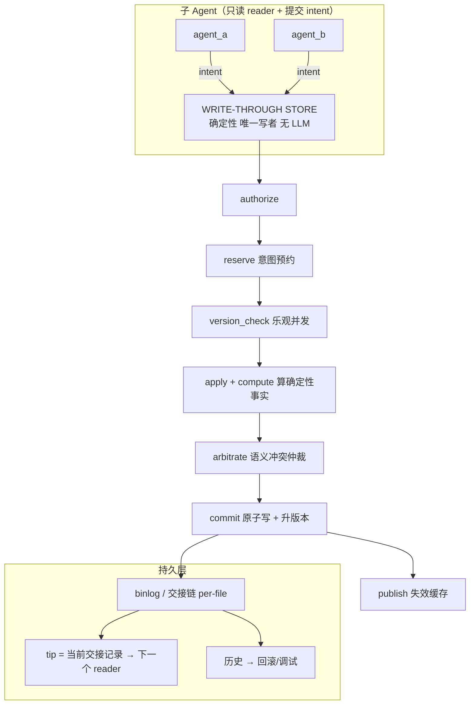

# XEYO 多 Agent 协同设计

> 仓库：`D:\lea\XenYon code`
> 版本：2026-08-18
> 定位：把「多 Agent 协同」从 §5.5 的「禁止并发 + 串行化」升级为**三种方式**——**普通多 Agent 协同（基座）** + **控制流(主从)** + **数据流(同文件注释交接)**；含 **write-through store + binlog**、**主 Agent 路由**、**确定性调度器** 三套设计。
> 对照：[10-完整记忆体系.md](./10-完整记忆体系.md) §5 多 Agent 记忆、§2.6 前缀稳定、§4 KV/费用。
> 本文是设计，不改代码；`python/memory/agent_scope.py` 仍占位。

---

## 0. 一分钟读懂

§5.5 现有写冲突处理只有一句：**并行子 Agent 禁止同时 Write/Edit 同一路径，跨 Agent 由编排层串行化危险工具。** 这有效，但有两个硬伤：

1. **治标不治本**：它只是「别撞」，没解决「先后改同一个文件的 agent 之间怎么传上下文」。B 接手 A 改过的文件时，只能**重新读全文 / 翻 git log / 重新推导为什么**，白白烧 token、还可能推导错。
2. **丢了"为什么"**：A 为什么这么改、踩过什么坑、哪些不能动——这些知识随 A 结束就丢了。

本设计补上这块：引入**三种 Agent 方式**，其中**普通多 Agent 协同是基座、也是最重要的一种**，另外两种是建立在它之上的**精化**；同时不推翻现有六层记忆与四种真相。

1. **普通多 Agent 协同（基座·最重要）**：N 个独立决策 agent 共享同一 workspace，**无 LLM 协调者**，靠**确定性共享原语**（调度器 + 写锁 + 版本校验 + journal + 短上下文隔离）保住不踩脚、不瞎、不烧钱。落地见 [29-普通多Agent协同落地实施计划书](../实施计划/29-普通多Agent协同落地实施计划书.md)。
2. **主从 Agent（控制流精化）**：在基座上加一个 Router，主 Agent 决定派谁干、怎么干；解决"谁来、听谁的、什么顺序"。
3. **同文件注释交接（数据流精化）**：先后碰同一个文件的平级 Agent，通过**该文件的交接记录**传上下文；解决"接手的怎么不懵、不重复推导、不踩前人的坑"。

一句话：**普通多 Agent 管"多个独立任务怎么并行且不打架"，主从管"谁来干"，文件交接管"接手的怎么接着干"。普通多 Agent 是地基，另两个是在它上面叠的精化。**

---

## 1. 三种 Agent 方式（普通是基座）

|                | **普通多 Agent 协同（基座·最重要）**                                   | 主从 Agent               | 同文件注释交接                       |
| -------------- | ----------------------------------------------------------------------------- | ------------------------ | ------------------------------------ |
| **本质** | N 个独立决策 agent 共享 workspace，无 LLM 协调者                              | + 一个 Router 决定派谁干 | + 按文件传交接上下文                 |
| **方向** | 平级、并行                                                                    | 纵向（上下级）           | 横向（按时间、跟文件走）             |
| **回答** | 多个独立任务怎么并行、不踩脚/不瞎/不烧钱                                      | 谁来干活、什么顺序       | 接手的怎么接着干、为啥、坑           |
| **协调** | **确定性共享原语**（调度器 + 写锁 + 版本校验 + journal + 短上下文隔离） | Router（LLM）            | 交接记录（侧车 journal）             |
| **难点** | 无协调者 → 踩脚 / 瞎 / 成本爆炸                                              | Router 单点、可能盲      | 交接漂移 / 链式漂移                  |
| **落点** | [29](../实施计划/29-普通多Agent协同落地实施计划书.md)                          | 设计 B（§3）            | 设计 A（§4，store + binlog 交接链） |

**关系：普通多 Agent 是地基，另两个是在它之上叠的精化。**

- 没普通多 Agent 基座 → 主从的 Router 没地盘指挥、文件交接也没处落。
- 主从 / 文件交接 都依赖基座提供的确定性共享原语（写锁 / 版本校验 / journal / 短上下文隔离）。
- **三者不互斥，分层复用**：普通多 Agent 是 P0；主从 / 文件交接在其上按数据门控（§7.4）再叠。

---

## 2. 设计 A：Write-Through Store + Binlog（交接链）

### 2.1 定义

> **Store 是 binlog 的唯一写入者；binlog 是 store 生产出来的串行"交接流"。** 二者不是两个系统，是同一系统的"强制执行层(store)"和"持久记录层(log)"。存储层可直接复用 Git，但 store 站在它前面，负责 Git 不管的**语义重叠检测、事务化应用、版本校验、冲突仲裁**。

### 2.2 记录与投影：一条结构化注解 → 两个消费方

过去的弯路：把"注解"当成审计 / 质量评分。**最终定案：agent 写一条结构化注解，store/展示层按消费方投影成两个视图，且明确"持久 ≠ agent 长期记忆"。**

| 记录 / 视图                                                                | 消费方                                                 | 寿命           | 给 agent？ | 校验                            |
| -------------------------------------------------------------------------- | ------------------------------------------------------ | -------------- | ---------- | ------------------------------- |
| **临时切片**（objective / done / not_done，交接用）                  | 下一个改该文件的 agent                                 | 任务结束即丢   | ✅         | **drift_check**（确定性） |
| **持久切片**（decisions / invariants / gotchas / 理由）              | **用户**（Event Truth 派生的**可见视图**） | 持久           | ❌         | 不喂 agent；展示层渲染          |
| **Outcome Record**（intent_achieved / quality / context_sufficient） | 主 Agent 路由学习                                      | 随任务结束可丢 | ——       | 独立 review 子 Agent 异步填     |

> 两条铁律：
>
> 1. **持久切片不是 L4 长期记忆**（那是给 agent 的知识），而是 **Event Truth 派生的用户可见视图**；不新增第五种真相，不喂 agent，不写 L4。
> 2. **质量评判不进 store 写路径**（§2.6）。store 只做机械 + 一致性；"好不好"由独立 review 子 Agent 异步评，喂给路由学习。

### 2.3 组件与数据流



**写路径：** `authorize → reserve → version_check → apply+compute → arbitrate → commit → publish`，全确定性、可单测。

### 2.4 关键数据结构

**① Intent（子 Agent 提交，只读决策产出）**

```jsonc
{
  "id": "intent_f3a9...",
  "agent": "agent_b",
  "base_version": "snapshot_v42",          // 它基于哪个版本
  "scope": {                                // 语义粒度, 不是文件粒度
    "files": ["src/foo.ts"],
    "symbols": ["Foo.render", "Foo.onClick"]  // 符号级, 供语义重叠检测
  },
  "patch": "<structured edit ops 或 unified diff>",
  "annotation": {                           // 只写"为什么/意图", 不承重
    "goal": "...", "approach": "...",
    "invariants": ["不要动 render 的 memo 逻辑"],
    "gotchas": ["mock.ts 的类型是 copy 的, 改动要同步"]
  }
}
```

**② Store 确定性计算的事实（facts，非模型写）**

```jsonc
{
  "files_changed": ["src/foo.ts"],
  "changed_symbols": ["Foo.onClick"],       // AST/parse 算出, 非模型
  "diffstat": {"additions":12, "deletions":3},
  "checks": {"lint": true, "typecheck": true},
  "result_snapshot_hash": "sha256:..."
}
```

**③ Binlog 条目（store 每次 commit 追加一条，单写者）**

```jsonc
{
  "seq": 1234,
  "intent_id": "intent_f3a9...",
  "agent": "agent_b",
  "base_version": "snapshot_v42",
  "result_version": "snapshot_v43",
  "computations": { /* ② */ },
  "handoff": { /* §4.2 */ },
  "outcome": { /* 独立, 为路由学习; 异步填 */ },
  "conflict": null | {
    "type": "semantic_overlap",
    "with_intent": "intent_b7c2...",
    "resolved_by": "judge|execution|rebase|priority",
    "visible": true
  },
  "drift_check": { "claimed_symbols": ["Foo.onClick"], "actual_changed_symbols": ["Foo.render"], "drift": ["Foo.onClick"] }
}
```

### 2.5 冲突仲裁（分层、显式、不静默）

| 情况                                   | 判定   | 动作                                                                                                                         |
| -------------------------------------- | ------ | ---------------------------------------------------------------------------------------------------------------------------- |
| **无重叠**（不同文件/不同符号）  | 独立   | 都应用（文件级 LWW 无妨）                                                                                                    |
| **有依赖**（B 改在 A 之上）      | 顺延   | rebase 取后 —— 这是"取最后"唯一正确的出现场景                                                                              |
| **语义冲突**（同函数逻辑都被改） | 真冲突 | **绝不自动解决**。升级：执行（测试/typecheck）→ 评审 Agent → 显式优先级。日志写 `conflict.visible=true` 上报编排层 |

> "取最后一条"是**状态规则**（后继者以最新快照为基底，对）；但**"最后一条的内容正确"不能假设**（最后那个 Agent 可能改错/写错），所以交接记录要过 **drift_check**（§4.3）。取最后是状态，drift_check 是信任，两者都做。

#### 2.5.1 并发写一问一答（版本号是 store 分配的）

**问：A 把 1.11 改成 1.12；B 并行也基于 1.11 改，A 落地后 B 才提交——B 应该写入 1.12 吗？**

**答：不。B 不会写入 1.12。** 版本号是 **store 在提交时分配的、全序线性**的，agent 从不能"挑一个目标版本"去写；agent 只提交"基于某 `base_version` 的 patch"。

| agent | base | 提交时 HEAD | store 判定 | 结果 |
|---|---|---|---|---|
| A | 1.11 | 1.11（先落） | base=HEAD，无冲突 | **1.12** |
| B | 1.11 | **1.12**（A 已落） | base≠HEAD → **stale** | **1.13** 或 冲突 |

store 对 B 走 **rebase-or-conflict**（§2.5）：
- **无重叠**（B 改了 A 没碰的符号/区域）→ **rebase** 到 1.12 之上 → **1.13**，A/B 都保留；日志 `A@1.12`、`B@1.13(rebase on 1.12)`。
- **重叠**（B 改了 A 刚改的那段）→ **冲突**，不自动解决 → 升级裁判，`conflict.visible=true`；**绝不静默写成 1.12**。
- **patch 应用不上**（A 改了 B 依赖的上下文，3-way merge 失败）→ **硬冲突**，绝不强 apply → 让 B 重读 HEAD 再改。

**不变量：** 单写者 → 版本只有一条链 `1.11→1.12→1.13`，不存在"两条都叫 1.12"；**无 lost update**（A/B 要么都保留、要么显式冲突，绝无"后提交覆盖先提交"）；agent 永远不能写到"自己没看过、别人刚提交"的版本上。

**更早的防线（避免 B 白干）：** store 写路径第 2 步 **reserve/意图预约** 在 B 开工前登记写范围；若与 A 重叠 → 提前让 B 排队/拆分/强制先读最新，而不是等 B 做完才撞车。

**风险（rebase 可靠性）：** rebase 靠 3-way merge 重放 B 的 diff；**LLM 生成的 diff 常顺带改写周边行 → 3-way merge 易失败或静默合并错**（§7.2 风险 #5）。铁律：**能干净 apply 才 rebase；apply 不上就判硬冲突，绝不猜。** 这也正是"写穿透 store 相对 Git 唯一增值点（语义重叠检测）"所在，因此[29 计划](../实施计划/29-普通多Agent协同落地实施计划书.md) P0 只做"单写者序列化通道 + content-hash 版本校验"（不引入分布式锁，见 §2.5.2），语义重叠留 P2。

#### 2.5.2 统一方案：每文件单写者事务 store（不引入分布式锁）

> 之前把"并发安全"往"加锁"方向想，逐个修补出 13 个问题 + 13 个方案，太重。**换方向：干脆不加锁，用一个"每文件单写者事务 store"统一解决**——它把"锁"这个概念整个消掉，**每文件原子串行**应用变更；**不同文件并行**，只有同文件才串行（沿数据分片思路）。

**模型：** agent 不持任何锁，只提交一个"变更事务"给 store：

```jsonc
{ "agent":"agent_b", "base_version":"snapshot_v42",
  "base_hashes":{"src/foo.ts":"sha256:..."},
  "target_files":["src/foo.ts","src/bar.ts"],      // 一次事务可多文件（全有或全无）
  "ops":[{"path":"src/foo.ts","kind":"edit","edit":"..."}],
  "annotation":{...} }
```

store **按文件串行地**应用事务（`path→queue` 路由，每文件单消费者）：校验 base 一致 → 原子写入 → 追加 journal → 升版本。**每文件同一时刻只有一个写者，不同文件并行，没有共享锁可坏。** P0 事务限定单文件；多文件强一致 → 拆串行子任务，或预检后整体拒绝（B2）。

**为什么这一下解决"锁"带来的一整批问题：**

| 原问题 | 单写者 store 如何覆盖 |
| --- | --- |
| B4 锁 TTL 中途过期 | 无锁 → 无过期 |
| B5 僵死锁文件 | 无锁文件 |
| B6 自我死锁 | 无锁 |
| B7 多锁死锁 | 无锁 |
| B8 mtime 误判版本 | store 用 **content hash** 判 base 一致 |
| C9 撕裂读 | **原子写**（temp + rename） |
| C10 多文件非原子 | 一个事务**全有或全无** |
| C11 journal 不一致 | journal + 写入**同事务** |
| 写-写冲突 | 下一事务 base 已 stale → 拒绝 / rebase（§2.5.1） |

**所以"锁"整类（B4–B8）+ 原子性整类（C9–C11）+ 写-写冲突，由一个"单写者事务 store"覆盖，不需要分布式锁。** 这比"手写悲观锁"和"LLM 调 Lock/Unlock"都简单——**因为没有锁要拿、要保护、要排序、要清理。**

**剩下两条，不是任何并发原语能解的（是"语义/顺序"题，锁也解不了）：**

| 约束 | 问题 | 解法 |
| --- | --- | --- |
| **A1 语义耦合** | A 改 API 签名，B 改调用方（跨文件） | P2 语义重叠检测；或**从源头避免**：任务声明 `touches_public_api` → 调度器对其串行化 |
| **D12 读-写依赖** | B 读 A 还没写的输出 | P1 调度器把 `depends_on` 落成**写-读依赖图**，B 等 A 写完再读 |

**为什么串行"写"不构成瓶颈（与"普通多 Agent"一致）：**
- store 是**确定性"每文件单写者"（管 mutation 安全）**，**不是 LLM 协调者（管决策）**。agent 仍**独立决策**，只是"改文件"走**每文件串行通道（不同文件并行）**。
- agent 的慢端是 **LLM 推理（仍并行）**；写操作**少**且 store apply 是**确定性文件操作（快）**。**串行的只是"写"这一下，且只串行同文件，不是"想"。**

**分期：**
- **P0**：写工具走"每文件独立序列化队列（`path→queue` + content-hash 版本校验）"（不引入分布式 lock 文件）。
- **P1**：调度器把 `depends_on` 落成依赖图（D12）+ 粗粒度 scope 兜底 + "任务声明 `touches_public_api` → 串行化"规避 A1。
- **P2**：A1 语义重叠检测 + C10 多文件事务完备。

### 2.6 写路径只做"机械 + 一致性"，质量评判摘出去（异步）

执行（测试/lint/type）**不是总在场，也常"聋"**：改公开 API 没测到、安全风险无测试、测试本身错了、或根本不是代码（设计/prose/架构取舍）。

**定案：质量评判不进 store 写路径。** store 只做**机械 + 一致性**：

- drift_check（记录 vs 实际情况）
- 语义冲突检测
- 版本校验（乐观并发）
- 执行能否通过（**仅当执行在场**，作为一致性的一部分，不是"好坏"）

"这个改动好不好 / 是否符合意图"由**独立 review 子 Agent** 异步评（执行在场时它可作输入；执行失聪或非代码时靠 intent + reviewer），把 verdict（intent_achieved / quality / context_sufficient）喂给**路由学习（设计 B）**。**写路径不阻塞、不等待 reviewer**。

### 2.7 存储：git 复用 + **侧车日志（定案）**

- **存储层直接复用 Git**：一个 intent = store 的一个 commit（作者标 agent 用于审计，**提交者是 store**，保持仓库单写者）；HEAD = 当前版本号；回放/回滚靠 Git 历史 + journal。
- **注解/事实不进 commit message**（会脏）；放**侧车日志** `.xeyo/journal/{ws}/handoff/<path>.jsonl`（per-file 追加链）。commit message 只留短行 `(agent: agent_b) goal: <短目标>`。
- **侧车（不定案改成内联）**：不脏源码、可回放、自描述；内联注释仅当用户显式要求某文件类型时给。
- **接口抽象**：`Journal` 抽成接口，先落地侧车文件（简单、自描述、可回放），需要快速查询时再换 SQLite / 数据库。**A→B 只换实现，不动上层。**

---

## 3. 设计 B：主 Agent 路由（智能缓存复用）

### 3.1 角色

| 角色                                 | 工具 | 职责                                          | 上下文策略                    |
| ------------------------------------ | ---- | --------------------------------------------- | ----------------------------- |
| **Router（主 Agent）**         | 无   | 只决定路由（domain → specialist）→ 任务规格 | 稳定 + 极小，勿越加越长       |
| **Specialist（子 Agent ×N）** | 有   | 执行该领域/scope 任务（读/改文件）            | 稳定前缀 + 钉住的领域上下文块 |
| **Store（设计 A）**            | —   | 落地写入/改文件；交接触发                     | —                            |

### 3.2 缓存省钱的真实机制（工程可控，而非"谁有货"）

你原来"路由给已有缓存的 Agent"方向对，但机制要改成**前缀对齐**：

1. **共享基础前缀**（所有调用一致、字节稳定）：`[SystemPrompt(工具策略) | ToolSchemas | ...公共...]`。这部分每次命中供应商缓存（`cache_control` / prompt caching）。
2. **每个 specialist 钉住领域上下文块**：一份**物化、有版本**的 `.xeyo/context/<specialist>.md`，放在 specialist 的稳定前缀 + `cache_control` 断点。**只有它领域文件真正变了才重建、版本 +1，只失效它自己那条缓存。**
3. **Routing 便宜**：首选确定性匹配（消息里有文件路径/领域关键字 → 直接路由，**0 次 LLM**）；确定不了才用小模型分类。
4. **批量感知**：同一 specialist 的任务在缓存 TTL 内分组，让同领域读发生在上下文块还热时。

### 3.3 路由对象与注册表

```jsonc
// 路由产出
{ "specialist_id": "memory_indexer", "task_spec": "...", "context_hint": {"domain":"memory"},
  "expected_tools": ["glob","read"], "max_budget_tokens": 20000 }

// Specialist 注册表
{ "memory_indexer": { "domain": "memory", "stable_prefix_hash": "...",
  "context_block_path": ".xeyo/context/memory_indexer.md", "context_block_version": 7,
  "tools": ["glob","read"], "routing_heuristics": ["file","keyword","actor"] } }
```

### 3.4 决策与"瞎 router"缓解

- **先确定性后 LLM**；路由时校验目标 specialist 的 `context_block_version` 有效，过期则先重建或改派通用 specialist。
- Router 不碰工具 → **不可当盲眼武断的唯一决策者**。缓解：Specialist 回传结构化 `routing_feedback`（上下文够不够？被迫多读哪些？），作为 Router 下次路由的学习信号；报"缺上下文"时可请求重路由或广播缺失块。

### 3.5 成本预期

共享前缀被复用 → 反复出现的部分基本被缓存（大头）；领域块仅变更时重建；Router 极小（常 0 调）；剩余不可缓存 = 真正需一次性读的切片 + 输出 token（回避不了）。**别一上来钉"全领域所有文件"**——首次物化 + 钉住会付一次缓存写（比读贵），只钉"可预测反复用"的那部分。

### 3.6 模式触发：用户直选（不做自动探测）

**定案：不建"何时 spawn"的启发式，把选择权给用户。** 多 Agent 的成本代价因此成为**用户知情后的显式选择**。

- 与现有 `agent_mode`（`agent / plan / ask`，`permissions/policy.py` 的 `_AGENT_MODES`）**正交**，做成独立字段 `orchestration`，不断言进 `agent/plan/ask` 枚举：

```jsonc
"orchestration": "single"   // single | fanout_explore | collaborate_edit
```

| 档位                       | 走哪套                                    | 适用                                 | 成本                               |
| -------------------------- | ----------------------------------------- | ------------------------------------ | ---------------------------------- |
| **single（默认）**   | 单强 Agent + 执行反馈；不走主从/交接/新闻 | 一般小任务                           | 1×，最快出结果                    |
| **fanout_explore**   | 主从 + 新闻感知（§4.7）                  | 大、可并行、语义独立（如并行搜文件） | 约 N×（N 个子 Agent），墙钟时间短 |
| **collaborate_edit** | 主从 + 同文件交接（§4）                  | 同一批文件被反复改、需接力           | 略增（交接读写），但防撞车、可回溯 |

- **UI 侧给成本/延迟轻提示**（让选择知情）：单 Agent 1× 成本最快；并行探索成本≈N× 但墙钟短；协作改文件略增成本但防冲突。**多 Agent 的费用是用户显式选出来的，系统不替用户决定。**
- **防"两头踩"**：默认 single；系统可对"较大/可并行任务"给一句**建议**（"可考虑多 Agent"），但**绝不自动切换**。

---

## 4. 多 Agent 同文件注释交接（本设计核心）

### 4.1 定义

> 一个**按文件组织的交接链**。改过文件 F 的 Agent，改完写一份交接记录；下一个被派来改 F 的 Agent，开工前先读这份（紧凑、专为它准备），**不重读全文 / 不翻 git log / 不重推导**。

链上的 **tip = 当前交接记录**（后继者读这个）；**历史 = 链接之前的全部版本**（回滚/调试用）。

### 4.2 Handoff Record（往前看 + 按符号切片）

面向后继者，写成"**你要继续干活得知道什么**"；**一条结构化注解，store/展示层投影成两个视图**（agent 拿切片，用户拿决策/理由）：

```jsonc
{
  "handoff_version": 3,
  "author": "agent_a",
  // —— 临时切片：给下一个 agent（任务结束即丢）——
  "objective": "迁移到强类型 API",
  "done":       ["render 已 hook 化", "补了 3 个类型"],
  "not_done":   ["onClick 未迁移"],
  // —— 持久切片：给用户（Event Truth 派生视图，不喂 agent）——
  "key_decisions": ["Foo 现在接收强类型参数", "legacy 路径保留但已弃用"],
  "invariants":    ["不要动 render 的 memo 逻辑"],
  "gotchas":       ["mock.ts 的类型是 copy 的，改要同步"],
  // —— 索引：symbol → {行区间, 注解指针}（per-file 容器 + per-symbol 切片）——
  "slice_index": {
    "Foo.render": { "lines": [100, 140], "note": "#r" },
    "login":      { "lines": [200, 230], "note": "#l" }
  }
}
```

**为什么"往前看"**：价值是让后继者**不重推导**，结构围绕"后继者需要什么"而非"我做了什么"。

**检索（per-file 容器 + per-symbol 切片）**：per-file 存"全局 invariant"（任何后继者都要看），后面挂 `slice_index`（symbol → 行区间 + 注解指针）。**后继者按"它要改的符号"一跳就到对应注解**，跳过无关 slice；**不需要先数行数**。`slice_index` 实现**渐近披露**——记录里只有索引/摘要，需要更多才展开。

### 4.3 drift_check + 可验证性分层（防"交接信息骗人"）

两个概念分开：

**① drift_check（只对可验证声明）** —— 确定性、廉价（AST + diffstat），不依赖测试在不在场：

- `claimed_symbols: ["Foo.render","Foo.onClick"]` vs store 用 AST 算出 `actual_changed_symbols: ["Foo.render"]`
- 不一致 → `drift: ["Foo.onClick"]`，标出来让后继者知道该处不可全信，去复核。

**② 可验证性分层（两种声明、两种信任模型）**：

| 声明               | 例子                                               | 校验        | 后继者信任                                                              |
| ------------------ | -------------------------------------------------- | ----------- | ----------------------------------------------------------------------- |
| **可验证**   | done / not_done / key_decisions 里的具体符号、文件 | drift_check | 直接用（图快）                                                          |
| **不可验证** | invariants / gotchas / 设计理由                    | 无法机验    | 标`unverified`，**check-first**：先读指针指向的那一行再决定动它 |

**系统提示词提醒（只瞄准，不扫射）**：后继者提示词里加一句——

> "对标记 `unverified` 的声明（invariants/gotchas），先读它指向的那一行再决定动它；对 drift_check 已通过的符号级事实，可直接用。"

这样**可验证的图快（信）、不可验证的用 pointer 花几百 token 快速复核**；提醒放稳定前缀（静态，符合 §2.6），且**不影响任何 agent 的内部前缀稳定**。

### 4.4 与 §5.5 的关系（升级而非推翻）

| §5.5 现状                                | 本设计替换为                                                                                                                   |
| ----------------------------------------- | ------------------------------------------------------------------------------------------------------------------------------ |
| 并行子 Agent 禁止同时 Write/Edit 同一路径 | store 的**reserve（意图预约）+ version_check（乐观并发）** 取代"一刀切禁止"：不同文件/不同符号可并存，同一符号才算真冲突 |
| 跨 Agent 由编排层串行化危险工具           | 串行化移进 store（单写者）；并行的 agent 只**提交 intent**，由 store 仲裁                                                |
| **没有机制传上下文**                | **同文件注释交接**：后继者读 tip 交接记录，不重推导                                                                      |

### 4.5 与 10-完整记忆体系 的六层对齐

- **不写主 JSONL**：交接记录在侧车 `.xeyo/journal/`，遵循 §5.2「子 Agent 全文不进主历史，只回传一条 tool_result」。
- **临时切片 = 工作记忆性质**（像 `WorkingSnapshot`，机器状态、任务结束即丢），不是长期知识。
- **持久切片 = Event Truth 派生的用户可见视图**：**不是第五种真相，不喂 agent，不写 L4**；长期知识仍走 MemoryCandidate → 主会话验证闸 → memdir。
- **KV 前缀**：交接记录不进主/子会话的 system 前缀（易变），只在后继者读文件那一刻**按需注入**，符合 §2.6「易变的东西放右段/历史」。

### 4.6 一条完整链路（把主从 + 文件交接串起来）

1. 用户来任务 → **Router（主 Agent，无工具）** 选 specialist（设计 B）。
2. Router 把派活连同一个东西一起传下去：**目标文件的当前交接记录**（设计 A）。
3. Specialist 读到交接记录 → 知道"onClick 未迁移、别动 memo、mock.ts 类型要同步"→ 直接接着干。
4. Specialist 改完 → store 写**新的交接记录**为 tip，`drift_check` 标出漂移 → 主 Agent 用它的 Outcome Record 学下次怎么派。

### 4.7 跨 Agent 新闻 / 事件感知（§4 补充）

**定位：** 第三根轴——**横向、跨文件/跨任务的事件流知情**。回答"**谁干了啥、这块最近被碰过没**"，而不回答"怎么接着干"（那是 §4.2 交接记录）。新闻只有 `what + where + source`，**故意无 why/how**，所以顶替不了交接记录，只补上"跨文件/跨任务知情"这一块。

**核心原则（避免第二个真相源）：** 新闻 = **store 提交时背书的、对 binlog 的"显著 + 去重"投影**。store 已做过 drift_check / 冲突 / 执行-if-在场（§2.6），所以新闻的**真实性与准确性是结构保证，不是发布者自报**。**禁止 agent 自报"我完成了 X"。**

**新闻 schema（瘦：只有 what + where + source；禁思考/尝试/推理/工具）：**

```jsonc
{
  "news_id": "n_01J...",
  "task_id": "task_batch_07",          // 归属任务批
  "agent": "agent_b",
  "type": "completion | fix | redesign | api_change | ...",
  "what": "Foo.render 已 hook 化",
  "where": ["src/foo.ts"],              // 位置（文件/目录）
  "tags": ["foo", "memory", "api"],     // domain / 文件级标签（比交接记录粗一点）
  "source": {
    "kind": "store_verified",            // 只发 store 背书的
    "base_version": "snapshot_v42",
    "result_version": "snapshot_v43",
    "applied_at": "..."
  },
  "significance": 0.7,                   // 确定性算出，非 agent 自报
  "supersedes": null | "n_01K...",       // 同功能修改 → 旧新闻被淘汰（复用 supersedes 语义）
  "status": "active"                     // active | superseded | deleted（任务批结束清空）
}
```

**特性 → 决策：**

| 新闻特性         | 落地                                                                                                               |
| ---------------- | ------------------------------------------------------------------------------------------------------------------ |
| 真实性 / 准确性  | store 背书；**只有 store 验证通过的才发布为新闻**                                                            |
| 客观性           | 瘦 schema；**禁**思考/尝试/推理/工具                                                                         |
| 时效 / 新鲜      | 时间戳 + 排序；最新优先                                                                                            |
| 显著性           | **确定性过滤**（diff 净变化规模、新增公开 symbol、破坏性/签名变更、触及高频文件），**不靠 agent 自报** |
| 公开性           | 索引所有 agent 可见；**按需 pull**（不是 push 广播）                                                         |
| 来源             | `store_verified` + base/result_version + applied_at                                                              |
| 淘汰 / supersede | 同功能修改 →`supersedes` 旧新闻（复用 MemoryNote `supersedes`/`status` 语义）                               |
| 销毁             | **任务批结束清空新闻索引**（binlog 仍在）                                                                    |

**怎么找（两级 + Router 钩子，复用 `memory.search` 模式）：**

1. **扫紧凑索引**（headline：`what + where + source + tags + time`），按 **domain/文件/标签**、actor、时间、显著性过滤。
2. 展开命中的那一条（展开后仍瘦）。

- **标签粒度比交接记录粗**：交接记录 `slice_index` 精确到 symbol；新闻标签到**文件/目录/领域**，让"这块有没有人动过"的发现范围更宽。一套标签，两个入口（找新闻 = 找相关切片）。
- **Router 钩子（最高价值）**：Router 派活前先查该 domain 的新闻索引 → 知道"这块最近被谁干过、干到哪"，从而**避免重复劳动、顺着最新新闻往下接力**。这比"凭领域猜"更可靠。
- 为什么"找"容易：新闻**瘦、可超、有限**（任务批内几十条），所以索引小、可扫；P0 用索引 + 标签过滤即可，P2 真正需要再上语义/embedding。

**边界：** 新闻（知情，跨任务）↔ 交接记录（继续，同文件）↔ L4（持久知识）。新闻里"值得留"的仍走 MemoryCandidate → 主会话验证闸 → memdir，不被新闻吞掉。

---

## 5. 落地分期

| 阶段         | 做                                                                                                     | 验收                                                                       |
| ------------ | ------------------------------------------------------------------------------------------------------ | -------------------------------------------------------------------------- |
| **P0** | 侧车`.xeyo/journal/`（每文件一条追加链）+ store 单写者 + `reserve/version_check` + `drift_check` | 后继者能读到 tip 交接记录而不重读全文；冲突不再静默覆盖                    |
| **P1** | 语义重叠检测（symbol 级）+ 冲突仲裁升级（执行 → reviewer）                                            | 同一函数被两 Agent 改时被显式抛出，不 LWW 硬吞                             |
| **P2** | Outcome Record 接路由学习（设计 B feedback 循环）；store 换 DB                                         | 路由能按 "intent_achieved / quality / context_sufficient" 学               |
| **P1** | 新闻索引（store 背书 + 确定性显著性过滤 + supersede）                                                  | agent 能按领域/标签发现"这块最近被谁动过"；Router 派活前能读到最新相关新闻 |
| **P2** | 新闻标签语义化检索（embedding/hybrid，找到范围更准）                                                   | 跨 domain 模糊发现不再靠高成本全量检索                                     |

前置：多 Agent 记忆（§5 的侧链 + agent_id snapshot + 回传单条 + memdir 只读）先到位。

---

## 6. 关键取舍 / 已定 vs 待定

**已定：**

1. **粒度**：per-file 容器 + per-symbol 切片索引（symbol → {行区间, 注解指针}），后继者按符号直跳，不必先数行数。
2. **持久切片**：Event Truth 派生的**用户可见视图**，不喂 agent、不写 L4、不新增第五种真相；一条结构化注解 → 两个视图。
3. **质量评判**：不进 store 写路径；独立 review 子 Agent 异步评（intent_achieved / quality / context_sufficient），喂路由学习。
4. **drift_check**：只对可验证声明；不可验证声明标 `unverified` + check-first，并只在系统提示词里给"瞄准不扫射"的提醒。
5. **新闻（§4.7）**：store 背书、禁 agent 自报；显著性用确定性过滤（非自报）；同功能 supersede；任务批结束清空；标签粒度比交接记录粗（文件/目录/领域）；发现走"紧凑索引 + 标签"两级 + Router 派活前查询钩子。
6. **落盘**：交接记录走**侧车 `.xeyo/journal/{ws}/handoff/<path>.jsonl`**（定案）；内联注释仅在用户显式要求某文件类型时给。
7. **模式触发（§3.6）**：**用户直选**（`orchestration: single | fanout_explore | collaborate_edit`），与现有 `agent_mode` 正交；不做自动探测；默认 single；UI 给成本/延迟提示，多 Agent 的成本是用户知情后显式选择。

**待定：**

- 无（全部定案；如有后续分歧，随时回填）。

---

## 7. 风险与收益评估 / 落地门控

### 7.1 一句话总判断

> **多 Agent 的收益是"墙钟时间（并行）+ 处理超大任务 + 审计/协调安全"，不是省钱。它几乎总是付更多 token 换更少等待。** 协调管道（store / binlog / journal / 冲突仲裁）是**真、且确定**的收益；"**省 token / 提完成度**"是**最弱甚至可能为负**的 claim。

### 7.2 风险清单（诚实版）

| #  | 风险                                                               | 影响                               | 缓解                                                |
| -- | ------------------------------------------------------------------ | ---------------------------------- | --------------------------------------------------- |
| 1  | 设计重"确定性协调管道"，轻"LLM 智能"                               | 收益有界，**不提升输出质量** | 认清定位：协调/审计，不是质量                       |
| 2  | **token 净收益可能为负**（handoff 读写成本、漂移导致返工）   | 可能白花钱                         | 只对"非显而易见 + 递归文件"省；其余删 claim         |
| 3  | 协调成本 > 并行收益                                                | **通常更贵**                 | 小任务单 Agent；大/独立才 fan_out                   |
| 4  | **与 §5.1 短命并行工人矛盾**                                | handoff/news 收益落空              | 先确认 XEYO 是否"长命串行同文件"                    |
| 5  | 语义重叠 + drift_check 要**跨语言 AST**（Python/Java/TS）    | 工程量大、可能不准                 | 三语言；若退化成文本 hunk 则失去相对 Git 的增值     |
| 6  | KV：多 Agent**独特前缀多**、每前缀付 cache-write             | **命中率不保证提升**         | 靠共享前缀；别为并行付独特前缀的 cache-write        |
| 7  | 完成度：**async review 削弱 in-loop 反馈**，错误沿交接链放大 | 可能降低完成度                     | 保留 in-loop 执行反馈；async review 只做补充        |
| 8  | Router 单点 + 瓶颈 + 可能"盲"                                      | 路由错全错                         | 确定性优先 + feedback；子 Agent 越多越别依赖 Router |
| 9  | 冷启动：机制早期纯开销                                             | 小任务/任务批早段无收益            | 只在任务批大且文件递归时才启用                      |
| 10 | **过度工程**：为可选收益背确定性成本                         | 白建重 store                       | 门控：数据不支持就不建重 store                      |

### 7.3 核心指标（必须实测，别拍脑袋）

在现有 agent 跑真实任务统计：

| 指标                 | 说明                                             | 决定什么                                       |
| -------------------- | ------------------------------------------------ | ---------------------------------------------- |
| **碰撞频率**   | 多少次任务里 ≥2 Agent 打到同一文件 / 同一符号   | 是否要 store 的`reserve` / `version_check` |
| **token 模式** | 每任务输入/输出 token；单 Agent vs 多 Agent 对比 | handoff/news 是否省 token                      |
| **KV 命中率**  | `prompt_cache_hit_tokens` / miss 占比          | 共享前缀 / 钉上下文块是否值得                  |
| **单任务成本** | 完成每任务的费用                                 | 总体性价比                                     |
| **完成率**     | 成功/失败；含"错误返工次数"                      | async review 是否损害完成度                    |
| **递归文件率** | 同一文件是否被跨任务反复改                       | handoff 链是否有货                             |

### 7.4 分期门槛（数据到才建）

| 阶段                         | 内容                                                                               | 门控                                                                       |
| ---------------------------- | ---------------------------------------------------------------------------------- | -------------------------------------------------------------------------- |
| **P0（零风险，先做）** | 共享稳定前缀（帮 KV）+`journal` + Git（审计/回滚）+ 夯实 `is_concurrency_safe` | **无条件**：便宜、高确定                                             |
| **P1**                 | store 的`reserve` + `version_check` + 显式冲突                                 | 统计到**同文件并发写冲突**明显（≥ 阈值次任务）                      |
| **P2**                 | handoff 链 + 新闻索引 + 语义重叠 AST + 钉住上下文块                                | P1 后实测**handoff 净省 token 为正** 且 **递归文件率 ≥ 阈值** |

**参考诊断门槛（A7/#6 + B5/#5，建议性、按环比恶化率触发，非硬熔断）：**
- 碰撞率 > **15%**（或**本周较上周环比飙升 50%**）→ 建议上 write-through store（否则浪费太严重）。
- 同文件串行等待平均耗时 > 单任务推理耗时 × **1.5**（或环比恶化）→ 建议上 handoff 交接（否则并发收益为负）。
- 缓存命中率 < **30%** → 查前缀稳定性，否则禁止宣称"共享前缀省钱"。
- 语法错误率 > **20%** → 不扩大并发，反而要增加子 Agent 上下文长度（见 29 §6 A5）。
> **口径（C5/#6 + C6/#7）：** 碰撞率 = 发生 `StaleConflict` 的**任务数 / 总写提交数**，同任务多次 Patch 重试**只算一个冲突任务**；缓存命中率**只算 input**（`input_cache_hit/(input+miss)`），output token 单独统计、不入命中率（不可缓存）。
> **门控 = 建议性诊断报告，不是自动熔断**：阈值易"过拟合"（重构期碰撞率天然高但业务价值大，强上 store 拖慢迭代）。改由开发者结合业务上下文决策，数据只给信号、不做教条。

**原则：数据不支持的重 store，不建。** P0 几乎是确定的收益；P1/P2 看数据。

### 7.5 反向判断：何时**不要**多 Agent

- 小任务 / 单文件 / 上下文可装下 / 无并行需求 → **单 Agent + 执行反馈**更便宜、更准（无协调开销、in-loop 反馈闭环）。
- 门控原则：**任务大到装不下、真正可并行、语义独立 → 才 fan_out**；否则别为"听起来牛"乱开多 Agent。

### 7.6 测量挂哪（复用既有设施）

- 复用 `usage`（`ledger.py` / `pricing.py`）已有 token/费用；`memory/observe.py` 已采 `prompt_cache_hit_tokens`（对齐 §4.4）。
- 在此基础上加打点：`task_batch_id`（区分任务批）、`agent_id`、`文件/符号碰撞计数`、`完成率`、`错误返工次数`。
- 分析层：离线统计任务批的碰撞 / token / 命中 / 成本分布，产出"**是否值得建 store**"的门控结论。
