# XEYO 面试知识书 · 第一阶段：代码地图 + 覆盖矩阵

> 本阶段只交付 **代码地图 + 系统清单 + 功能清单 + 覆盖矩阵 + JD 关键词映射 + 缺失清单 + 下一阶段计划**。
> 不展开系统分册 / 功能分册 / 面试题库 / 项目讲解稿正文。
>
> 取证规则：只读源码、配置、测试、脚本、依赖声明、提交信息。**全程未参考 `docs/` 目录内容**（按硬性规则 0，docs 设计可能过期）。
> 所有结论标注 `文件路径:行号` + 类/函数/配置项。

---

## 0. 阅读范围与源码证据索引

### 0.1 输入信息回填状态（重要）

| 输入项 | 请求中的占位符 | 本轮实际取值 | 说明 |
| --- | --- | --- | --- |
| 源码路径 | `{{源码路径}}` | `D:\lea\XenYon code` | 占位符未填充，按会话工作区推定 |
| 目标岗位 JD | `{{岗位JD}}` | **空占位符，未提供** | 本轮以任务书「必须覆盖的 Agent 岗位能力」12 项作为 JD 基线，见 §5 表头说明 |
| 项目说明 | `{{项目说明}}` | **空占位符，未提供** | 本轮以 `README.md` / `AGENTS.md` / `package.json` / `pyproject.toml` 为事实源 |
| 输出语言 | 中文 | 中文 | — |
| 期望篇幅 | `{{不限/尽量完整}}` | 尽量完整 | — |

### 0.2 技术栈（证据）

| 层 | 技术 | 证据 |
| --- | --- | --- |
| 引擎 | Python ≥3.11，asyncio/ASGI | `python/pyproject.toml:9` `requires-python = ">=3.11"`；`python/pyproject.toml:59` `asyncio_mode = "auto"` |
| 服务端 | FastAPI + uvicorn + httpx + Typer + Rich | `python/pyproject.toml:10-17`（`dependencies` 块，共 6 项）、`python/requirements.txt` |
| 桌面壳 | Tauri 2.x (Rust) | `gui/src-tauri/src/lib.rs:852` `run()`；`gui/package.json` `@tauri-apps/api ^2.11` |
| 前端 | React 19 + TypeScript 5.8 + Zustand 5 + Vite 6 + Tailwind 4 | `gui/package.json`（依赖块） |
| 终端 UI | Ink 5.2 + React 18.3，tsx 运行 | `tui/package.json:21-31`，`XEYO-TUI.bat` |
| Markdown/图表 | streamdown 2.6 + mermaid 11 + katex | `gui/package.json` |
| 本地存储（前端） | IndexedDB via `idb ^8`，库名 `xeyo-web` v4 | `gui/src/lib/db.ts:17`、`:151` |
| 本地存储（引擎） | JSONL（sessions / ws_index / revisions / journals） | `python/session/persistence.py:39/60`、`python/session/ws_index.py:36` |
| 模型供应商 | DeepSeek（默认 / `deepseek-v4-flash`）、Anthropic 原生 Messages API、OpenAI 兼容、local(llama.cpp)、fake | `python/model/openai_compat.py:357` `PROVIDER_PRESETS`；`python/model/anthropic.py:470` |
| 测试 | pytest（asyncio auto, timeout 60s）+ vitest 106 个单测 + Playwright 8 个 e2e spec | `python/pyproject.toml:58-68`（`[tool.pytest.ini_options]` 整块，含 `markers` `:64-68`）；`gui/e2e/*.spec.ts`（8 个） |

### 0.3 运行入口与启动方式（证据）

| 入口 | 触发 | 链路 |
| --- | --- | --- |
| 桌面 GUI（开发态） | 双击 `XEYO.bat` | 加载 `.env` → 校验 `py -3.11` + 依赖 → `py -3.11 -m server` 后台起后端 → `scripts/wait_health.py` 轮询 `/health` → 写 `.xeyo/backend_port` → `npm run tauri:dev` |
| 终端 TUI | 双击 `XEYO-TUI.bat` | 先探活引擎（`wait_health.py`），未起则 `py -3.11 -m cli serve` → `npx tsx tui/src/index.tsx --cwd <root>`；无 Node 时回落 `py -3.11 -m cli` |
| 脚本 / 管道 | `py -3.11 -m cli chat` | `python/cli/main.py:136` → `chat_cmd.run_chat`（进程内 `QueryEngine` REPL，`python/cli/chat_cmd.py:290`） |
| 纯服务 | `py -3.11 -m cli serve` | `python/cli/serve_cmd.py:15` → `python/server/__main__.py:31` → `uvicorn.run("server.app:app", workers=1)`（`__main__.py:78`，单 worker 硬约束） |
| 远程 attach | `py -3.11 -m cli attach` | `python/cli/attach_cmd.py:93` → SSE `POST /v1/chat/completions`（`:166`） |

端口：后端 `XEYO_HTTP_PORT` 默认 `8000`（`XEYO.bat`、`python/server/__main__.py:49-50`），被占用时 `_pick_free_port` 自动顺延（`__main__.py:17`）并写 `.xeyo/backend_port`（`python/server/portfile.py:77`）；前端 `5173`。

### 0.4 规模统计（实测）

| 范围 | 文件数 | 行数 / 说明 |
| --- | --- | --- |
| `python/` 正式源码（含 tests） | **755** `.py` | **163,489** 行 |
| `python/` 隐藏临时目录残留（`.pytest_tmp_*` / `.tmp-*` 等） | **399** `.py` | 仓库卫生问题，非产品代码 |
| `python/` 顶层模块分组 | 25 个包 | tests 317 / tools 110 / memory 48 / engine 41 / server 34 / channels 33 / evals 22 / cli 18 / extension 16 / scripts 14 / permissions 13 / coord 13 / rewind 12 / session 11 / model 10 / prompt 8 / usage 7 / codeindex 6 / slash 4 / msgtypes 4 / common 3 / bridge 3 / audit 3 / sidecar 2 |
| `gui/src` | 398 个 `.ts/.tsx` | lib 170 / components 131 / stores 41 / pet 15 / pasture 12 / hooks 12 / bench 8 / theme 2 |
| `tui/src` | 29 个 `.ts/.tsx` | — |
| 测试设施 | pytest 317 文件（275 顶层 + 42 分子包）；vitest 106 个 `*.test.ts(x)`；Playwright 8 spec | — |
| 基准语料 | `BFCL/`（~17k 文件）、`TerminalBench/`（~20k 文件） | 外部基准 harness + 结果归档 |
| **未纳入分析** | `docs/`（59 文件）、`[过程]/`（336 文件）、`_design_drafts/`、`screenshots/`、`stream-previews/`、`usage-previews/`、`logs/`、`artifacts/` | 按硬性规则 0 与「只基于源码」原则排除 |

### 0.5 已读 / 未读 / 缺失

**已读（深读，带行号取证）**：`engine/`（41）、`prompt/`（8）、`model/`（10）、`tools/`（顶层 14 + 22 个工具子目录）、`permissions/`（13）、`session/`（11）、`memory/`（48 含 simulator 19）、`codeindex/`（6）、`evals/`（22）、`usage/`（7）、`audit/`（3）、`coord/`（13）、`extension/`（16）、`rewind/`（12）、`server/`（34 含 routers 18）、`cli/`（18）、`channels/`（顶层 9）、`bridge/`（3）、`slash/`（4）、`msgtypes/`（3）、`common/`（3）、`gui/src`（结构 + 关键文件）、`tui/src`（结构 + 入口）、测试与构建脚本。

**未深读（范围内但只到签名/职责级）**：
- `python/channels/filehelper/`、`python/channels/ilink/`（微信协议实现子目录）
- `python/sidecar/`（`policy.py`/`upgrade.py`）
- `python/media_store.py`、`python/dbg_verify_fix.py`
- `gui/src/components/` 131 个组件的逐个内部实现（只核了 20+ 关键组件）
- `gui/src/lib/` 170 个工具模块（只核了 api/stream/db/dispatch 等关键项）
- `python/slash/dispatch.py` 每条 server 命令的处理体
- `gui/src-tauri/src/` 除 `lib.rs` 外的模块（`pet.rs` 等）
- `python/tests/` 275 个顶层测试文件的逐个断言（核了 6 个代表性契约测试）

**源码缺失 / 不可核实**：
- **JD 与项目说明两个占位符为空** → 影响 §5 的映射精度（详见 §6）
- 前端 IndexedDB 的 schema 与写入点在 `gui/src/lib/db.ts` 可核实，但**python 层无「第一层存储」的对应常量**，三层数据模型的第一层只能在 TS 侧取证
- `gui/src-tauri/resources/python/` 与 `gui/src-tauri/target/{debug,release}/python/` 是 `python/` 的**发布副本**（同名文件并存），副本与主源是否逐字节一致未校验

**不确定点（需二次确认，见 §6）**：`T_NOW_BLOCK_HARD_CAP` 与 AGENTS.md 叙述差异、`engine/scheduler.py` 是否接线（**已核实为未接线，与既往认知相反**）、rewind v2/v3/v4 三轨边界。

> **已结案（第四轮亲验，2026-09-11）**：`permissions` 预设命名与前端别名差异 **不成立** —— 前端 `readonly / workspace-write / full`（`gui/src/components/RuntimePresetSetting.tsx:11/16/21/26`）与后端 `{"readonly","workspace-write","full"}`（`python/permissions/presets.py:11`）**逐字一致**；`always/risk/never` 亦一致。原「待确认」改为**已定论：一致**。

### 0.6 可读提交信息（`git log --oneline`，最近 20 条）

`096e989d fix(security): P0-4 预览面板去 allow-same-origin + P0-1 直写默认拒绝` · `d3e5668 fix(server): P0-2 补齐 base_url SSRF 闸门` · `d834aa8 fix(server): P0-5 后台 job 补墙钟上限` · `9288cec harden(tauri): P0-3 Tauri per-window ACL` · `e94834f refactor(gui): P0-6 apiKey 单一真值存储` · `47cb951 feat(model): Anthropic Messages API 原生适配器` · `6187883 fix(gui): 思考等级与 thinking 开关成对` · `a785cf5 refactor(reasoning): 删「上一轮思考回顾」全链路` · `e754d4b refactor(tnow): 注入面只承载信息（去导演文案）` · `a7eb7ba fix(memory): 开关「显示 == 生效」` · `b31cbef feat(gui): 用量面板 v4 三分类口径` · `d2d68fb feat(evals): 变更收益侦测器 changedetect（L0/L1/L2）` · `e9d32e8 fix(tools): TodoWrite 工厂透传 cwd + Diagnostics 回落本地 tsc + Bash job 内存上限 2048MB` · `9caeaa4 fix(gui): 动效时长单一真值` · `05c95d6 fix(gui): 浮层可达性基座` · `e170e76 fix(gui): 删除会话前二次确认` · `df0f8c5 fix(gui): 思考前瞻卡改过渡显隐` · `0f45a92 refactor(gui): CSS 注释乱码修复` · `7b59fb7 chore(gui): 移除未使用 @tanstack/react-virtual` · `093d478 chore(gitignore): 屏蔽含真实 key 的一次性探针脚本`

> 仓库有 `origin`（GitHub `GiseFt/XEYO`）与本地 `mirror` 两个 remote，分支 `main`。

---

## 1. 代码地图

### 1.1 顶层目录树（只列产品/工程相关）

```
D:\lea\XenYon code\
├─ XEYO.bat                     # 桌面 GUI 入口（dev/hot-reload）
├─ XEYO-TUI.bat                 # 终端 TUI 入口
├─ AGENTS.md                    # 项目级工程硬规矩（理念铁律 / 扩展层契约 / T_now 准入）
├─ XEYO.md  README.md  CHANGELOG.md  SECURITY.md  LICENSE
├─ package.json                 # 根 typecheck / test 编排
├─ .xeyo-policy.json            # 工作区 Bash 策略（bash=default, bash_routing=auto）
│
├─ python/                      # 引擎 + FastAPI server + Typer CLI（755 py / 163k 行）
│  ├─ engine/                   # 运行时内核（41）
│  │   ├─ query_engine.py       #   QueryEngine：会话级引擎门面
│  │   ├─ query_loop.py         #   模型↔工具迭代主体（主循环）
│  │   ├─ turn_runner.py        #   单 turn 生产者-订阅者扇出
│  │   ├─ scheduler.py          #   任务 DAG 调度器（⚠ 未接线，见 §6）
│  │   ├─ subagent_runner.py    #   子代理运行时（含任务分解）
│  │   ├─ goal_state.py / plan.py / task_state.py      # 目标 FSM / 计划审批 / 轮次状态
│  │   ├─ compact.py / aging.py / repeat_guard.py / repeat_fold.py   # 压缩与重复抑制
│  │   ├─ budget.py / abort.py  # 预算与取消
│  │   ├─ write_store.py / shadow_git.py / workspace_restore.py / workspace_revision.py / workspace_lock.py
│  │   ├─ session_presence.py   #   跨会话文件/git 占有
│  │   ├─ live_agents.py / agent_settlement.py / agent_roles.py
│  │   ├─ turn_snapshot.py / loop_ledger.py / process_ledger.py / stage_clock.py
│  │   └─ resume_directive.py / wrap_gap.py / wrap_window.py / permission_coordinator.py / ...
│  ├─ prompt/                   # 上下文工程（8）
│  │   ├─ system_prompt.py      #   system 三段装配（Identity → env → fence）
│  │   ├─ pre_llm_inject.py     #   T_now 注入管线 + T_NOW_BLOCK_REGISTRY（20 块）
│  │   ├─ t_now_strategy.py     #   声道策略 env_channel / legacy / skip / prefill
│  │   ├─ turn_context.py / assembler.py / fence.py / transcript_pointer_shadow.py
│  ├─ model/                    # 模型接入层（10）
│  │   ├─ client.py             #   ModelClient Protocol
│  │   ├─ deepseek.py / anthropic.py / openai_compat.py / fake.py
│  │   ├─ chunks.py             #   ModelChunk 增量类型
│  │   ├─ vendor_models.py      #   /models 拉取与能力归一
│  │   ├─ vision_capability.py  #   多模态判定
│  │   └─ _openai_common.py     #   SSE 解析 + 共享 httpx client
│  ├─ tools/                    # 工具系统（110）
│  │   ├─ base_tool.py / tool_registry.py / catalog.py / meta.py
│  │   ├─ exec_channel.py       #   ⚠ 实为「容器感知观测原语」，非执行通道
│  │   ├─ orchestration.py      #   并发分区执行
│  │   ├─ spill.py / spill_shadow.py / progress_sink.py / stub.py / container_routing.py
│  │   ├─ job_tools.py / offload_read_tool.py / web_common.py
│  │   ├─ bash_tool/ (12)       #   runner / destructive_guard / precheck / win_job / background / ...
│  │   ├─ fileio/ (9)           #   paths / conflict / read_state / diff_preview / syntax_check / rg_subprocess / ...
│  │   └─ <22 个工具子目录>      #   各含 XxxTool 实现 + prompt.py（DESCRIPTION 常量）
│  ├─ permissions/ (13)         # 权限裁决 / 授权存储 / Bash 策略 / 路径边界 / 指纹
│  ├─ session/ (11)             # MessageStore / record_transcript / hydrate / surface / ws_index / blobs
│  ├─ memory/ (48)              # 长期记忆 + 上下文压缩（C1/C2/L5）+ simulator（19 离线仿真）
│  ├─ codeindex/ (6)            # 符号大纲 / 调用图 / workspace 依赖图（无向量）
│  ├─ rewind/ (12)              # 回溯 v2/v3/v4 三轨：checkpoint / index / hotpath / service / blob_gc
│  ├─ extension/ (16)           # MCP 客户端+网关 / Skill / 插件 / 钩子 / reconcile
│  ├─ coord/ (13)               # 跨进程多 Agent 协调（planner/reviewer/worker_pool/worktree/reconciler）
│  ├─ server/                   # FastAPI（34）：app / session_pool / routers(18) / job_registry / inbox_registry / ...
│  ├─ cli/ (18)                 # Typer：chat / attach / serve / sessions / config / coord
│  ├─ channels/ (33)            # 远程通道：filehelper / ilink（微信）+ runner / mirror / jobs / auth
│  ├─ slash/ (4)                # Slash 命令单一事实源 + TS manifest 导出
│  ├─ msgtypes/ (4)             # Message / events(20+) / Envelope
│  ├─ usage/ (7)                # 定价 / 台账 / 归因 / 多代理指标
│  ├─ audit/ (3)                # append-only 审计日志 + 脱敏
│  ├─ evals/ (22)               # BFCL-lite / HumanEval-lite / MBPP-lite / drift_judge / block_ablation / changedetect
│  ├─ codeindex/  scripts/ (14) # 基准与探针脚本
│  └─ tests/ (317)              # pytest
│
├─ gui/                         # React 19 + TS（398 ts/tsx）+ Tauri 壳
│  ├─ src/main.tsx  App.tsx
│  ├─ src/components/ (131)     # ChatPage / AssistantTurn / Composer / AgentMapPanel / GrantsPanel / ...
│  ├─ src/stores/ (41)          # chatStore / settingsStore / workspaceStore / rewindV3Store / ...
│  ├─ src/lib/ (170)            # api/（SSE 流）/ db.ts（IndexedDB）/ chatScroll / frameScheduler / ...
│  ├─ src/pet/ src/pasture/ src/bench/ src/theme/ src/hooks/
│  ├─ src/generated/slashManifest.ts   # 由 python/slash/registry.py 导出
│  ├─ e2e/ (8 spec)  playwright.*.config.ts (6 份)
│  └─ src-tauri/                # Rust 壳 + resources/python（发布副本）
│
├─ tui/                         # Ink 终端 UI（29 ts/tsx）
├─ BFCL/  TerminalBench/        # 外部基准语料与结果
├─ scripts/                     # check.ps1 / check.sh（提交门）build_slim_venv.py / build_installer.ps1
├─ docs/  [过程]/  _design_drafts/  artifacts/  screenshots/  logs/  stream-previews/  usage-previews/
```

### 1.2 架构分层图

```mermaid
flowchart TB
    subgraph L0["L0 · 外壳与界面层"]
        BAT["XEYO.bat / XEYO-TUI.bat"]
        TAURI["Tauri 壳<br/>gui/src-tauri/src/lib.rs"]
        GUI["GUI · React19+Zustand<br/>gui/src (398 ts/tsx)"]
        TUI["TUI · Ink<br/>tui/src (29 ts/tsx)"]
        CLI["CLI · Typer<br/>python/cli"]
    end

    subgraph L1["L1 · 接入层"]
        APP["FastAPI app<br/>server/app.py:214"]
        POOL["SessionPool<br/>server/session_pool.py:85"]
        ROUTERS["routers/ (18)<br/>chat/control/sessions/rewind/workspace/..."]
        CH["channels/ 远程通道<br/>filehelper · ilink"]
        SLASH["slash/ 命令<br/>registry.py:60"]
    end

    subgraph L2["L2 · 运行时内核"]
        ENGINE["QueryEngine<br/>engine/query_engine.py:145"]
        LOOP["query_loop<br/>engine/query_loop.py:726"]
        TURN["TurnRunner<br/>engine/turn_runner.py:87"]
        GOAL["Goal FSM<br/>goal_state.py:70"]
        TASK["TaskState<br/>task_state.py:26"]
        SCHED["Scheduler (DAG)<br/>scheduler.py:249 ⚠未接线"]
    end

    subgraph L3["L3 · 认知层"]
        SP["system_prompt.py:23"]
        TNOW["pre_llm_inject.py:828<br/>T_now 20 块 / cap 21"]
        CMP["compact.py / aging.py<br/>+ memory/runtime C2"]
        MEMSIM["memory/simulator (19)<br/>离线压缩决策仿真"]
        MEM["memory/ 长期记忆<br/>memdir · memindex · search"]
        CIDX["codeindex/<br/>符号 · 调用图 · 依赖图"]
    end

    subgraph L4["L4 · 模型层"]
        MC["ModelClient Protocol<br/>model/client.py:9"]
        DS["DeepSeek<br/>deepseek.py:54"]
        AN["Anthropic<br/>anthropic.py:470"]
        OA["OpenAI 兼容<br/>openai_compat.py:125"]
        FAKE["Fake<br/>fake.py:14"]
    end

    subgraph L5["L5 · 能力层"]
        REG["ToolRegistry<br/>tool_registry.py:80"]
        ORCH["orchestration.py:247<br/>并发分区"]
        T25["25 个内置工具"]
        GWC["Mcp 网关<br/>mcp_gateway.py:30"]
        SKILL["Skill<br/>skill_loader.py:254"]
        AGENTTOOL["Agent 工具<br/>agent_tool.py"]
    end

    subgraph L6["L6 · 控制与安全层"]
        POL["evaluate_policy<br/>policy.py:1319"]
        BSTORE["PendingPermissionStore<br/>store.py:71"]
        FP["grant_fingerprint v2<br/>store.py:444"]
        WP["write_scope / workspace_policy"]
        AUD["audit/log.py:21"]
    end

    subgraph L7["L7 · 一致性与容错层"]
        WS["WriteStore<br/>write_store.py:167"]
        SG["ShadowGit<br/>shadow_git.py:54"]
        RW["rewind/ v2·v3·v4<br/>service.py:266"]
        PRES["session_presence.py:549"]
        LOCK["workspace_lock.py:30"]
        ABORT["abort.py:9 / budget.py:101"]
    end

    subgraph L8["L8 · 持久化与观测层"]
        TRANS["record_transcript<br/>session/record_transcript.py:286"]
        JSONL["~/.xeyo/sessions/*.jsonl"]
        WSIDX["_workspace_index.jsonl<br/>ws_index.py:36"]
        IDB["IndexedDB xeyo-web v4<br/>gui/src/lib/db.ts:151"]
        USAGE["usage/ 定价台账"]
        EVAL["evals/ + BFCL + TerminalBench"]
    end

    BAT --> TAURI --> GUI
    BAT --> APP
    GUI -->|HTTP+SSE| ROUTERS
    TUI -->|HTTP+SSE| ROUTERS
    CLI --> ENGINE
    CLI -->|serve| APP
    CH --> POOL
    ROUTERS --> POOL --> ENGINE
    ROUTERS --> SLASH
    ENGINE --> LOOP --> TURN
    ENGINE --> GOAL
    ENGINE --> TASK
    ENGINE -.-> SCHED
    LOOP --> SP
    LOOP --> TNOW
    LOOP --> CMP
    CMP --> MEMSIM
    LOOP --> MEM
    LOOP --> CIDX
    LOOP --> MC
    MC --> DS & AN & OA & FAKE
    LOOP --> REG --> ORCH --> T25
    REG --> GWC
    REG --> SKILL
    T25 --> AGENTTOOL
    ORCH --> POL
    POL --> BSTORE
    POL --> FP
    ORCH --> WP
    POL --> AUD
    T25 --> WS --> SG
    WS --> RW
    RW --> TRANS
    PRES --> LOCK
    T25 --> ABORT
    TRANS --> JSONL
    TRANS --> WSIDX
    ROUTERS --> IDB
    LOOP --> USAGE
    EVAL --> LOOP
```



### 1.3 核心数据流 / 控制流 / 调用链

**（A）一轮 turn 的主链路（已核实行号）**

```
外部请求（GUI fetch /v1/chat/completions / TUI / CLI / 远程通道）
  └─ server/routers/chat.py  → SessionPool.get_or_create  (session_pool.py:212)
       └─ SessionPool._build → 按 backend 选模型客户端  (session_pool.py:418-454)
       └─ TurnRunner.start(producer=engine.submit_message)  (turn_runner.py:143)
            └─ _run_producer  (turn_runner.py:200)  → 扇出给 SSE 订阅者
                 └─ QueryEngine.submit_message  (query_engine.py:489)
                      └─ _submit_message_inner  (query_engine.py:516)
                           ├─ 置 task_state=running、复位 budget/abort
                           ├─ MessageStore.append(user 消息)
                           ├─ PromptAssembler 组装 system（memo 复用左段）
                           └─ query_loop(...)  (query_engine.py:790 → query_loop.py:726)
                                ├─ run_pre_llm_inject → model.stream()  (pre_llm_inject.py:1030)
                                ├─ ModelChunk 流（text_delta / reasoning_delta / tool_use）
                                ├─ ToolRegistry.run(...)  (tool_registry.py:296)
                                │    └─ evaluate_policy → ALLOW/ASK/DENY  (policy.py:1319)
                                │         ├─ ALLOW → orchestration.run_tools_partitioned  (orchestration.py:247)
                                │         └─ ASK  → PermissionCoordinator.request  (permission_coordinator.py:56)
                                └─ 迭代直到无工具调用
                      └─ 最终持久化 + _maybe_advance_goal_round  (query_engine.py:436)
       └─ turn_settlement_hub.on_turn_settled  (turn_settlement_hub.py:22)
            └─ 三租户分发：inbox（FIFO 批投）→ goal（预约下一轮）→ jobs（后台任务完成通知）
```

**（B）工具调用控制流（含安全闸）** — `tool_registry.py:run` (`:296`)

```
取工具(:304) → readonly_gate(:310) → AskUserQuestion 挂起分支(:363)
  → PreToolUse 钩子(:413, _hook_blocker) → abort 短路(:416)
  → evaluate_policy(:419) 三态
       ├─ ALLOW → Bash 先做 _bash_routing(:422) → _execute_audited(:435)
       │     └─ 审计 tool.started(:139) → execute(:149) → _apply_output_budget(:163, spill)
       │        → PostToolUse 钩子(:166) → 审计 tool.finished(:168)
       ├─ DENY  → 中性结果型错误(:456)（不写成警告/说教）
       └─ ASK   → PermissionRequest 钩子(:490) → coordinator.request(:495) → permission_pending
```

**（C）并发编排** — `orchestration.py`
`partition_tool_calls`(`:85`) 按 `is_concurrency_safe()` 分区 → 安全批 `asyncio.gather(return_exceptions=True)`(`:304`)，上限 `_max_concurrency` 默认 10(`:31`)；不安全工具按序执行 + 读写锁(`_run_one_tool :191`)。

**（D）上下文工程流** — system 三段（`system_prompt.py:23/67/68`，装配顺序锁死在 `assemble_system_prompt_parts :132`，`:157-187`）＋ T_now 20 块尾插（`pre_llm_inject.py:828`，`T_NOW_TOTAL_BUDGET=6000 :812`，`INVENTORY_MAX=2500 :813`，`_trim_tagged_blocks :990`）。默认声道 `env_channel`：伪造 `assistant(xeyo_env_notice) → tool_result` 对尾插（`turn_context.py:115` `append_env_notice_pair`，`t_now_strategy.py:110` `ENV_TOOL_NAME`），**不进 MessageStore/JSONL、不进 tools 数组**，尾部 KV 前缀逐字节不动。

**（E）模型层流式增量** — `_openai_common.py:81 consume_sse_line_with_usage` → tool arguments 增量拼接 `:127` → `try_finalize_tool_buf :57`（json 合法即 emit，`_emitted` 去重）→ 流尾 `finish_tool_bufs :137`。Anthropic 走 `anthropic.py:329 _consume_sse_event` → `partial_json` 累积 `:404` → `_finalize_tool_block :433`。

### 1.4 系统分层与模块边界（设计意图层，含硬红线）

| 边界 | 规则 | 证据 |
| --- | --- | --- |
| **注意力纪律** | 模型可见文本只承载状态/结果/事实；禁建议、劝导、评价、编排文本 | `AGENTS.md`「设计理念」；`prompt/system_prompt.py:9-11/51-53`；提交 `e754d4b` |
| **T_now 准入** | 易变内容默认走 T_now 管线；登记表硬顶、加一删一，机器执法 | `prompt/pre_llm_inject.py:826`（cap 21）、`:828`（20 块）；`tests/test_t_now_block_registry.py` |
| **KV 前缀冻结** | 会话内 tools 数组零变化；T_now 尾插不动前缀字节 | `tools/tool_registry.py:92/119`（`_schemas_cache`）；`prompt/t_now_strategy.py:5-8` |
| **扩展面冻结** | 原生工具面 = 会话起点快照；会话内新增工具只能走 `Mcp` 网关 | `extension/mcp_gateway.py:30`；`tests/extension/test_freeze_invariants.py:132-156` |
| **停用即 DENY** | MCP/Skill 停用先于 grant 判定，grant 不可穿越 | `permissions/policy.py:1413` `_evaluate_mcp` |
| **信息与导演分离** | 注入围栏：harvest 脱敏、tool output 围栏、远端用户文本围栏 | `prompt/fence.py:25/59/88/119/148/180` |
| **旁路不绕主链** | 三条 HTTP 侧旁路（`workspace_fs` / `workspace_git` / `workspace_terminal`）与工具链并存 | `server/workspace_fs.py:86/161/207/253`、`workspace_git.py:105-300`、`workspace_terminal.py:42` |

---

## 2. 系统清单

覆盖状态口径：**已定位** = 入口与关键实现均已取证；**待确认** = 已定位但存在命名/接线/语义分歧；**源码缺失** = 无法在源码内核实。

| 序号 | 系统名称 | 系统定位 | 源码入口 / 关键文件 | 核心职责 | 依赖关系 | 覆盖状态 | 备注 |
| --- | --- | --- | --- | --- | --- | --- | --- |
| S01 | 引擎运行时主循环 | 会话级 Agent 内核 | `engine/query_engine.py:145` `QueryEngine`；`engine/query_loop.py:726` `query_loop`；`engine/turn_runner.py:87` `TurnRunner` | 驱动模型↔工具迭代、装配上下文、落消息、结算 turn | 依赖 S03/S04/S05/S06/S12/S13 | 已定位 | 主链唯一收口 |
| S02 | 消息与事件类型体系 | 全链路数据契约 | `msgtypes/message.py:13/20/33/55/97`；`msgtypes/events.py:27-304`；`msgtypes/envelope.py:13/35/63` | 定义 Message/ToolUse/20+ 事件/Envelope 包装 | 被全仓依赖 | 已定位 | 事件面即 SSE 契约 |
| S03 | 模型接入层与厂商适配 | LLM 调用抽象 | `model/client.py:9` `ModelClient` Protocol；`deepseek.py:54`；`anthropic.py:470`；`openai_compat.py:125`；`fake.py:14` | 统一 `stream()`、SSE 增量解析、usage 归一 | 被 S01 调用 | 已定位 | 无独立别名表，能力来自厂商 `/models` |
| S04 | System Prompt 装配 | 静态身份/环境注入 | `prompt/system_prompt.py:23/67/68/94/132`；`prompt/assembler.py:21/41/100` | 三段装配 + 会话级 memo 复用 | 依赖 `XEYO.md` | 已定位 | 顺序锁死不可乱 |
| S05 | T_now 易变上下文注入管线 | 每轮可变内容注入 | `prompt/pre_llm_inject.py:828/1030`；`t_now_strategy.py:29-33/54/65/110`；`turn_context.py:51/82/115` | 20 块登记 + 预算裁剪 + 声道选择 | 依赖 S16 扩展 reconcile | 待确认 | 登记表 20 / 代码 cap 21 / AGENTS.md 写 20 |
| S06 | 工具抽象与注册表 | 工具面单一事实源 | `tools/base_tool.py:24/29/31/36/41`；`tools/tool_registry.py:80/103/110/119`；`tools/catalog.py:261/308/355`；`tools/meta.py:48/319/341` | Tool 协议、注册、schema 惰性构建与冻结、hidden 暴露控制 | 被 S01/S07 依赖 | 已定位 | 25 项已注册（非 22） |
| S07 | 工具执行通道与并发编排 | 安全执行 + 并发 | `tools/tool_registry.py:296/435/127`；`tools/orchestration.py:85/247/304/31` | 权限三态 → 钩子 → 审计 → 执行 → 预算 | 依赖 S12/S20 | 已定位 | 命名陷阱：`exec_channel.py` 不是它 |
| S08 | 工具结果治理 | 大结果/进度/打桩 | `tools/spill.py:86/98/111`；`progress_sink.py:15/28`；`stub.py:8`；`tool_registry._apply_output_budget:163` | 阈值落盘、路径回引用、进度事件、占位 | 被 S07 调用 | 已定位 | spill 阈值 16000 字符，Bash/Read 豁免 |
| S09 | 内置工具族（25 项） | Agent 能力面 | `tools/<子目录>/*Tool` + `prompt.py` | 文件/搜索/执行/网络/记忆/协作/UI 八大类能力 | 依赖 S07/S12 | 已定位 | 见 §3 F020–F044 |
| S10 | Bash 工具与命令策略执行 | Shell 能力 + 安全静态分析 | `tools/bash_tool/bash_tool.py`；`runner/precheck/destructive_guard/dup_redirect/win_job/background/timeout_map/truncate/cmd_compact/semantics/pwsh7/jobs_bridge` | 命令预检、危险拦截、Windows Job Object 进程树、后台转接 | 依赖 S12 | 已定位 | 12 个子模块 |
| S11 | 文件 IO 与读写一致性 | 文件读写基座 | `tools/fileio/`（`paths/conflict/read_state/diff_preview/syntax_check/rg_subprocess/text/excludes/content_index`）；`file_read_tool/vision_media.py` | 路径规范化、读状态追踪、写冲突、diff 预览、语法检查 | 依赖 S07/S24 | 已定位 | 与 `engine/write_store` 联动 |
| S12 | 权限裁决与授权存储 | 安全决策层 | `permissions/policy.py:1319/1391`；`store.py:71/136/274/441/444/459`；`bash_policy.py:20-106/512/631`；`filesystem.py:32-35/127/157/178/323`；`write_scope.py:20/106/148`；`pending_ttl.py:20/21/41` | 8 支裁决、ASK 挂起与放行、授权指纹、路径边界、TTL | 依赖 S36 | 已定位 | 预设命名**前后端逐字一致**（C-02 已定论） |
| S13 | 会话状态与转录持久化 | 权威 transcript | `session/message_store.py:6/11/32`；`record_transcript.py:81/286/326`；`hydrate.py:73/119`；`persistence.py:39/60`；`surface.py:68`；`ws_index.py:36/81`；`transcript_blobs.py:26/79` | 内存消息、异步落盘、归档轮转、崩溃修复、surface 折叠 | 被 S01/S24 依赖 | 待确认 | `_maybe_rotate` 方向反（仅保 1 代） |
| S14 | 上下文压缩与 token 治理 | 长会话保活 | `engine/compact.py:69/95/125/286`；`engine/aging.py:64/80/93`；`engine/repeat_guard.py:165/189/220/291`；`engine/repeat_fold.py:81/97`；`memory/runtime.py:1020/1072/1344` | C1 打桩 / C2 冻结摘要 / 老化 / 重复折叠 | 依赖 S15/S16 | 已定位 | 压缩决策由 v61 `decide` 主导 |
| S15 | 记忆系统（长期记忆） | 跨会话知识 | `memory/memdir.py:112/332/359`；`memindex.py`；`search.py:68/135/212`；`journal.py:140/276`；`session_md.py:19/270`；`governance.py:10/146/236`；`write_policy.py:32`；`instruction.py:323` | 目录/索引/词法检索/治理/来源引用 | 依赖 S17（无） | 已定位 | **无向量检索/embedding** |
| S16 | 记忆压缩离线仿真台 | 决策-成本-质量仿真 | `memory/simulator/`（19）：`decision.py:209`；`state_model.py:151`；`cost_model.py:30/95`；`quality_model.py:124`；`cache_model.py:72`；`replay.py:252`；`__main__.py:14` | 压缩策略 A/B 与参数标定（不改线上公式） | 依赖 S14 | 已定位 | `py -m memory.simulator` |
| S17 | 代码索引 | 符号与依赖图 | `codeindex/graph.py:74`；`cgraph.py:98`；`symbols.py:76`；`pack.py:25`；`changes.py:32` | AST 符号大纲、调用边图、workspace 依赖图、按 diff 定位符号 | 被 S09/S11 使用 | 已定位 | AST/正则，无语义向量 |
| S18 | 扩展层：MCP 客户端与网关 | 外部工具接入 | `extension/mcp_client.py:547/804/835/375`；`mcp_manager.py:89/178/355/586`；`mcp_gateway.py:30/47/100/276`；`mcp_scopes.py:181/226/352` | 仅 stdio 传输、重连退避、三源合并、企业 deny、会话内网关 | 依赖 S12 | 已定位 | HTTP/SSE 仅预留 |
| S19 | 扩展层：Skill 与插件 | 技能/插件加载 | `extension/skill_loader.py:225/254/373`；`skill_store.py:25/119`；`loader.py:55/102`；`manifest.py:103/127/191`；`plugin_store.py:85/115/201`；`plugin_fetcher.py:65/109/225/355` | SKILL.md 扫描、锁文件漂移、插件安装来源（local/github/npm） | 依赖 S12/S20 | 已定位 | npm 默认禁用 |
| S20 | 扩展层：钩子 | 生命周期扩展点 | `extension/hooks.py:38/119/147`；`manifest.py:103` | 5 事件点子进程执行，PermissionRequest fail-closed | 依赖 S19 | 已定位 | PreToolUse/PostToolUse/PermissionRequest/SessionStart/SessionEnd |
| S21 | 多智能体：子代理运行时 | Agent 派生 | `engine/subagent_runner.py:137/234/410`；`tools/agent_tool/agent_tool.py:316/454/473/480`；`engine/live_agents.py:32/68/93`；`subagent_context.py:27/35`；`agent_settlement.py:20/32/57` | 子代理独立 query_loop、消息总线、交付结算、侧链持久化 | 依赖 S01/S12 | 已定位 | 产线路径 = 每子代理一条 query_loop |
| S22 | 多代理 DAG 调度器 | 任务图调度 | `engine/scheduler.py:37/109/191/249/347/357/628/656/759/849/1054` | 任务 DAG 拓扑、白名单、超时清扫、断点续跑 | 依赖 S21/S24 | **待确认（实为未接线）** | `run_task_batch` 仅测试调用；`SessionPool.scheduler_for:887` 无调用方 |
| S23 | 跨进程多 Agent 协调 | 多 worker 协作 | `coord/planner.py:49`；`worker_pool.py:53`；`worker_session.py:37`；`reconciler.py:40`；`reviewer.py:40`；`ask_gate.py:54`；`worktree.py`；`store.py:26/38/63`；`file_store.py:29`；`locking.py:24`；`config.py:23` | DAG 入表 → CAS 认领 + scope 租约 → worktree 隔离 → 三路合并 → findings 打回 | 依赖 git | 已定位 | `coord.backend` 默认 `memory`（零行为） |
| S24 | 回溯 / 检查点 / 工作区还原 | 时间旅行 | `rewind/checkpoint.py:20`；`snapshot.py:15/39`；`index.py:128/220/223`；`hotpath.py:379`；`service.py:266/768/1363`；`journal.py:145`；`blob_gc.py:305/410`；`locks.py`；`revision.py:74`；`engine/write_store.py:167/182/234`；`shadow_git.py:54/94/166`；`workspace_restore.py:39/369/389/615` | 内容寻址快照、操作日志、预览+确认执行、WAL 还原、shadow-git 双路径 | 依赖 S13 | 待确认 | v2(`cp_`)/v3(`cp3_`)/v4 三轨并存 |
| S25 | 工作区一致性（presence/锁/修订） | 跨会话防写冲突 | `engine/session_presence.py:140/549/561/572/636/644`；`workspace_lock.py:23/30/217/320`；`workspace_revision.py:11/76`；`workspace_restore.py` | busy 标记、文件占有者、心跳租约、无 git 修订哈希 | 依赖 S24 | 已定位 | 跨会话协同的核心 |
| S26 | 后台任务与回合结算 | 异步长任务 | `server/job_registry.py:146/224/246/294/581`；`turn_settlement_hub.py:22/68`；`inbox_registry.py:95/139/332`；`goal_round_driver.py:71/130/137/204/386`；`synthetic_round.py:41/142`；`tools/job_tools.py:29/33/100/174/262` | 进程内 job 注册、turn 结束三租户分发、mid-turn inbox、目标轮驱动 | 依赖 S01/S27 | 已定位 | 墙钟上限 6h 可配 |
| S27 | 目标 / 计划 / 任务状态 | 显式状态机 | `engine/goal_state.py:70/133/216/268/524`；`plan.py:30/38/64/90`；`task_state.py:26/39/73`；`tools/todo_write_tool/` | Goal FSM、计划审批面板、轮次状态、Todo 列表 | 依赖 S26/S28 | 已定位 | Goal 块仅 blocked/pending_complete 注入 |
| S28 | HTTP / SSE 服务端 | 唯一后端收口 | `server/app.py:68/214/217/242/251/261/287-364/410`；`__main__.py:17/31/49/72/78`；`session_pool.py:85/175/212/418/613`；`local_gate.py:20/37`；`deps.py:29/44/53/73/202`；`routers/`(18) | FastAPI 装配、会话池 LRU、loopback 门禁、18 组端点 | 依赖 S01/S12 | 已定位 | 单 worker |
| S29 | CLI（Python） | 脚本/管道入口 | `cli/main.py:11/87/136/170/199`；`chat_cmd.py:38/77/159/290`；`attach_cmd.py:93/166`；`serve_cmd.py:15/48`；`http_api.py:10-81`；`interact.py:75/116/138`；`render.py:39`；`config_store.py:23/96/180`；`setup_wizard.py:68/139`；`feature_registry.py:44/89` | REPL、attach、serve、配置、首跑向导、特性开关表 | 依赖 S01/S28 | 已定位 | |
| S30 | TUI（Ink） | 终端界面 | `tui/src/index.tsx:61/126/262`；`tui/src/api/sse.ts:65/72/91/341`；`tui/src/lib/slash.ts:21`；`tui/src/App.tsx:303/377/565/633` | SSE 时间线渲染、斜杠命令、权限/计划/ask 模态 | 依赖 S28/S34 | 已定位 | 复用同一 server |
| S31 | GUI 前端 | 桌面交互面 | `gui/src/main.tsx:26/36/43/49/55`；`App.tsx:40/50-56/59-66`；`components/AppShell.tsx:55/223/229`；`stores/chatStore.ts:18/49-54`；`lib/api/chatStream.ts:41/105/214/434`；`lib/db.ts:17/149/151` | 布局、状态、SSE 分发、IndexedDB 缓存、20+ 面板 | 依赖 S28/S32 | 已定位 | 4 种 paneLayout |
| S32 | Tauri 桌面壳与 Python 打包 | 分发与进程守护 | `gui/src-tauri/src/lib.rs:23/153/266/285/358/371/383/852/863/930`；`scripts/build_slim_venv.py`；`gui/src-tauri/resources/python/` | 单实例、后端进程拉起与健康守护、薄壳 venv 自包含断言、per-window ACL | 依赖 S28 | 已定位 | 薄壳 venv 事故后的结构性修复 |
| S33 | 远程通道（微信/文件助手） | 外部接入 | `channels/api.py:20/26/74/114`；`auth.py:35`；`base.py:10/21`；`jobs.py:43`；`runner.py:96/192/275/287`；`mirror.py:17`；`remote_deliver.py:37/56`；`channels/filehelper/`；`channels/ilink/` | token 鉴权、终稿投递、任务表、镜像广播、文件投递 | 依赖 S28/S05(fence) | 待确认 | 子目录未深读 |
| S34 | Slash 命令系统 | 命令单一事实源 | `slash/registry.py:41/44/60/384/407/416/437/465`；`dispatch.py:27/35`；`export_manifest.py:25/95`；`gui/src/generated/slashManifest.ts`；`tui/src/generated/slashManifest.ts` | 命令注册/别名唯一性校验/分发/TS manifest 导出与漂移检查 | 被 S28/S29/S30/S31 依赖 | 已定位 | 改后必须重导出 |
| S35 | 用量与成本治理 | 计费与归因 | `usage/pricing.py:40`；`ledger.py:45`；`attribution.py:8`；`combine.py:45`；`multi_agent_metrics.py:43`；`vendor.py:25` | 峰谷定价、事件台账、真实厂商归因、厂商权威用量 | 依赖 S03 | 已定位 | 三分类口径（GUI v4） |
| S36 | 审计与脱敏 | 留痕与合规 | `audit/log.py:21`；`audit/redact.py:39/46` | append-only JSONL、Bearer/key/JWT/PEM 遮罩、命令摘要 | 被 S12/S07 调用 | 已定位 | 最小事件集 |
| S37 | 评测与基准 | 质量度量 | `evals/bfcl_lite.py`、`humaneval_lite.py`、`mbpp_lite.py`、`mmau_local.py:24`、`retrieval_bench.py`、`drift_judge.py:71`、`block_ablation.py`、`client.py:84`、`changedetect/`；`BFCL/`；`TerminalBench/`；4 个 `*_shadow` 守卫 | 函数调用/代码/多任务/检索/漂移/块消融/变更收益侦测 | 依赖 S01/S03 | 已定位 | 4 个 shadow 守卫默认关 |
| S38 | 测试与提交门 | 工程质量闸门 | `python/tests/`(317)；`tests/conftest.py:5/28/42/78/99/129`；`tests/extension/test_freeze_invariants.py:132-156`；`tests/test_file_tools_contract.py:37-53`；`tests/test_evidence_integrity.py:46-48`；`gui/e2e/`(8 spec)；`scripts/check.ps1` | pytest 隔离、契约冻结测试、e2e、四段提交门 | 覆盖全仓 | 已定位 | 无 pre-commit，靠手动跑 |
| S39 | 隔离与容器路由 | 沙箱 | `tools/container_routing.py:19/24/29`；`tools/exec_channel.py:47-253`；`tools/bash_tool/` docker 路径 | ContextVar 覆盖容器身份、容器感知观测原语 | 依赖 S10 | 待确认 | 判定条件在 `bash_tool` 内，未逐行取证 |
| S40 | 容错：中止/预算/重试/重复抑制 | 稳定性 | `engine/abort.py:5/9/33`；`budget.py:101/168/251/285/302/349/423`；`query_loop.py:263/273/292`（LLM 重试）；`repeat_guard.py`；`repeat_fold.py`；`resume_directive.py:19/25/30` | 取消传播、墙钟/轮次预算、重试退避、重复调用抑制 | 依赖 S01 | 已定位 | `LlmRetryEvent` 透出 |
| S41 | 可观测性 | 追踪与统计 | `engine/prof_stats.py:25/87`；`loop_ledger.py:106/157/193`；`process_ledger.py:134/148/200/237`；`stage_clock.py:14/41/51/65`；`server/routers/audit.py:14`；`usage/`；`msgtypes/events.py` | 分位汇总、循环记账、进程记账、分段计时、审计查询 | 依赖 S01/S36 | 已定位 | |
| S42 | 多模态能力 | 视觉输入/截屏 | `tools/file_read_tool/vision_media.py`；`model/vision_capability.py:15/21/27/40`；`tools/screenshot_tool/`；`media_store.py`；`server/routers/media.py` | 图片/PDF 读入、vision 判定、截屏、媒体上传 | 依赖 S03 | 已定位 | 环境变量可强制 |
| S43 | 侧挂模块体系 | 灰度/证据收集 | `extension/mcp_name_manifest_shadow.py:37/45`；`tools/spill_shadow.py:63/73`；`prompt/transcript_pointer_shadow.py:43/90/133`；`memory/*_shadow.py`；`evals/*_shadow.py`；`scripts/bench_sidemod_benefit.py` | 旁路验证机制收益，fail-open，不触碰冻结面 | 依赖各宿主模块 | 已定位 | 与 AGENTS「新功能准入」一致 |
| S44 | 桌面宠物与语境岛 | 桌面体验 | `gui/src/pet/PetApp.tsx:4`、`PetScene.tsx`、`usePetRuntime.ts`；`gui/src-tauri/src/pet.rs`；`gui/src/pasture/ContextIsland.tsx:7` | 桌宠窗口与语境岛渲染（当前关闭） | 依赖 S32 | 已定位 | `CONTEXT_ISLAND_RENDER_ENABLED=false` |

---

## 3. 功能清单

分组：A 运行时（F001–F014）· B 模型与上下文（F015–F019）· C 工具能力（F020–F052）· D 安全一致性（F053–F064）· E 记忆知识（F065–F074）· F 扩展与多智能体（F075–F090）· G 服务与界面（F091–F106）· H 评测工程（F107–F116）。

| 序号 | 功能名称 | 所属系统 | 功能目标 | 源码入口 / 关键文件 | 使用场景 | 覆盖状态 | 备注 |
| --- | --- | --- | --- | --- | --- | --- | --- |
| F001 | 会话引擎创建与复用 | S01/S28 | 同配置复用 engine，换配置重建 | `session_pool.py:212` `get_or_create` | 连续对话 | 已定位 | LRU 上限 64 |
| F002 | Turn 生产者-订阅者扇出 | S01 | 单 turn 事件多订阅者 | `turn_runner.py:87/143/200/413/462` | SSE 多端 | 已定位 | |
| F003 | 提交互斥闸 | S01 | 同会话串行提交 | `query_engine.py:489` `submit_message` | 防并发写 | 已定位 | |
| F004 | 模型↔工具迭代主循环 | S01 | 主循环 | `query_loop.py:726` | 每轮 | 已定位 | |
| F005 | 工具调用配对修复 | S01 | 补齐缺失 tool_result | `query_loop.py:218/244/707` | 中断恢复 | 已定位 | |
| F006 | LLM 重试与退避 | S40 | provider 失败重试 | `query_loop.py:263/273/292` | 网络抖动 | 已定位 | `LlmRetryEvent` |
| F007 | 取消/中止传播 | S40 | abort 级联 | `abort.py:5/9/33` | 用户打断 | 已定位 | |
| F008 | 预算与硬停 | S40 | 墙钟/轮次/token 预算 | `budget.py:101/168/251/285/302/349/423` | 成本控制 | 已定位 | |
| F009 | 历史压缩（C1/C2） | S14 | 长会话 token 压缩 | `compact.py:69/95/125/286`；`memory/runtime.py:1020/1072` | 长会话 | 已定位 | |
| F010 | 工具结果老化与打桩 | S14 | 冻结区继续推进 | `aging.py:64/80/93` | 长会话 | 已定位 | |
| F011 | 重复调用抑制 | S14/S40 | 防止循环 | `repeat_guard.py:165/189/220/291`；`repeat_fold.py:81/97` | 死循环 | 已定位 | |
| F012 | 轮次崩溃恢复快照 | S01 | 崩溃后可恢复 | `turn_snapshot.py:32/78/122/167` | 异常退出 | 已定位 | |
| F013 | 续跑指令注入 | S40 | 投影-only 续跑 | `resume_directive.py:19/25/30` | 「继续」 | 已定位 | |
| F014 | 首轮代码库嗅探 | S01 | 首次进入注入工作面 | `first_sniff.py:41/49/100` | 新会话 | 已定位 | |
| F015 | 厂商模型列表与能力归一 | S03 | 拉 `/models` 得窗口/定价/modes | `vendor_models.py:20/63/71/102/144/162` | 选模型 | 已定位 | |
| F016 | SSE 流式增量与工具参数拼接 | S03 | delta 累积成完整调用 | `_openai_common.py:57/81/127/137`；`anthropic.py:329/404/433/452` | 流式 | 已定位 | |
| F017 | 多模态能力判定 | S03/S42 | 决定可否传图 | `vision_capability.py:15/21/27/40` | 读图 | 已定位 | |
| F018 | system prompt 三段装配 + memo | S04 | 稳定前缀 | `system_prompt.py:94/132/157-187`；`assembler.py:41/100` | 每轮 | 已定位 | |
| F019 | T_now 注入（20 块/预算/声道） | S05 | 易变内容尾插 | `pre_llm_inject.py:812/813/828/922/990/1030`；`t_now_strategy.py:54/65/110`；`turn_context.py:51/82/115` | 每轮 | 待确认 | cap 数值分歧 |
| F020 | 文件读取（文本/图/PDF） | S09 | 读文件 | `tools/file_read_tool/file_read_tool.py`；`vision_media.py` | 读码 | 已定位 | |
| F021 | 文件写入 | S09 | 创建/覆盖 | `tools/file_write_tool/file_write_tool.py` | 写码 | 已定位 | |
| F022 | 精确字符串编辑 | S09 | Edit | `tools/file_edit_tool/file_edit_tool.py` | 改码 | 已定位 | |
| F023 | 文件名 Glob 搜索 | S09 | 找路径 | `tools/glob_tool/glob_tool.py:37` | 定位 | 已定位 | 宽匹配回目录摘要 |
| F024 | 内容 Grep 搜索 | S09 | rg 检索 | `tools/grep_tool/grep_tool.py` | 定位 | 已定位 | |
| F025 | Shell 执行（含后台转接） | S10 | Bash | `tools/bash_tool/bash_tool.py`；`background.py`；`jobs_bridge.py` | 执行 | 已定位 | |
| F026 | Bash 危险命令静态拦截 | S10 | destructive_guard | `tools/bash_tool/destructive_guard.py`；`precheck.py` | 安全 | 待确认 | 已知 `rm -rf .` 类覆盖不足（见 §6） |
| F027 | Bash 透明路由到专用工具 | S10/S07 | 只读命令改走 Read/Grep | `tool_registry.py:422` `_bash_routing`；`.xeyo-policy.json` | 省调用 | 已定位 | 结果头带 `[routed: …]` |
| F028 | Windows Job Object 进程树 | S10 | 杀整棵进程树 | `tools/bash_tool/win_job.py` | Windows | 已定位 | |
| F029 | Todo 列表管理 | S27 | TodoWrite | `tools/todo_write_tool/todo_write_tool.py`；`store.py`；`restore.py` | 计划 | 已定位 | |
| F030 | 结构化提问挂起 | S09/S12 | AskUserQuestion | `tools/ask_user_question_tool/`；`permissions/ask_store.py:35` | 澄清 | 已定位 | |
| F031 | 子代理派生 | S21 | Agent 工具 | `tools/agent_tool/agent_tool.py:316/454/480` | 并行 | 已定位 | |
| F032 | 持久记忆读写 | S15 | Memory 工具 | `tools/memory_tool/memory_tool.py` | 跨会话 | 已定位 | 仅主 agent |
| F033 | 技能按需加载 | S19/S09 | Skill 工具 | `tools/skill_tool/skill_tool.py`；`skill_loader.py:225` | 复用流程 | 已定位 | |
| F034 | 后台任务查询/取消 | S26 | job_output/list/kill | `tools/job_tools.py:100/174/262` | 长任务 | 已定位 | owner 即安全边界 |
| F035 | 大结果外置与回读 | S08/S09 | spill + offload_read | `tools/spill.py:86/98/111`；`offload_read_tool.py:16/46` | 大输出 | 待确认 | offload_read 无独立权限校验 |
| F036 | 联网抓取（SSRF 防护） | S09 | WebFetch | `tools/web_fetch_tool/web_fetch_tool.py`；`web_common.py:19/95/117` | 取资料 | 已定位 | 拦截私有/元数据 IP |
| F037 | 联网搜索 | S09 | WebSearch | `tools/web_search_tool/web_search_tool.py`；`config.py` | 取资料 | 已定位 | |
| F038 | 只读 Git 操作 | S09 | Git 工具 | `tools/git_tool/git_tool.py` | 查状态 | 已定位 | |
| F039 | Notebook 单元编辑 | S09 | NotebookEdit | `tools/notebook_edit_tool/notebook_edit_tool.py` | .ipynb | 已定位 | |
| F040 | 截屏 | S42/S09 | Screenshot | `tools/screenshot_tool/screenshot_tool.py` | 视觉 | 已定位 | |
| F041 | 发送文件到微信 | S33/S09 | SendToWeChat | `tools/send_to_wechat_tool/`；`remote_deliver.py:37/56` | 交付 | 已定位 | |
| F042 | 桌面 UI 操作 | S09 | XeyoUI | `tools/xeyo_ui_tool/xeyo_ui_tool.py`；`gui/src/lib/dispatchXeyoUi.ts:35` | 面板控制 | 已定位 | toolUseId 去重 |
| F043 | 路径诊断 | S09 | Diagnostics | `tools/diagnostics_tool/diagnostics_tool.py` | 排错 | 已定位 | 非 LSP；回落本地 tsc |
| F044 | 时间获取 | S09 | getTime | `tools/get_time/get_time_tool.py` | 时效 | 已定位 | |
| F045 | 读状态追踪（modified-since-read） | S11 | 防盲改 | `tools/fileio/read_state.py`；`catalog.shared_read_state` | Edit 前 | 已定位 | |
| F046 | 写冲突检测 | S11/S25 | 并发写保护 | `tools/fileio/conflict.py`；`session_presence.py:549` | 多会话 | 已定位 | |
| F047 | diff 预览与统一 diff 解析 | S11/S31 | 变更可视化 | `tools/fileio/diff_preview.py`；`gui/src/components/DiffPreview.tsx:17` | 审阅 | 已定位 | |
| F048 | 写前语法检查 | S11 | syntax_check | `tools/fileio/syntax_check.py` | 质量 | 已定位 | |
| F049 | 符号大纲与调用图索引 | S17 | 导航 | `codeindex/symbols.py:76`；`cgraph.py:98`；`graph.py:74`；`pack.py:25`；`changes.py:32` | 大仓导航 | 已定位 | |
| F050 | 并发工具分区执行 | S07 | 安全并发 | `orchestration.py:85/247/304/31` | 提效 | 已定位 | 上限 10 |
| F051 | 工具进度事件推送 | S08 | Agent 进度可见 | `progress_sink.py:15/28`；`agent_tool.py:287/331/383` | UI | 已定位 | `xy` 旁路帧 |
| F052 | 工具面变更 reconcile | S05/S18 | 会话内启停同步 | `extension/reconcile.py:21/23/59`；`mcp_manager.py:355` | 扩展 | 待确认 | 全局 digest 无 session key |
| F053 | 权限三态裁决（8 支） | S12 | ALLOW/ASK/DENY | `policy.py:1319/1391/1404-1695` | 每次调用 | 已定论 | 预设命名**前后端一致**（第 9 章） |
| F054 | ASK 挂起与放行 | S12 | 用户确认 | `permissions/store.py:71/136/208`；`permission_coordinator.py:56/137/206`；`routers/control.py:164` | 危险操作 | 已定位 | 普通 180s / 危险 60s |
| F055 | 授权指纹与凭据复用 | S12 | always-allow | `store.py:274/295/441/444/459` | 减少打扰 | 已定位 | MCP 指纹 v2 |
| F056 | 路径边界与密钥保护 | S12 | 逃逸防护 | `filesystem.py:127/157/178/323` | 安全 | 已定位 | realpath + 硬 DENY |
| F057 | 写作用域（子代理） | S12/S21 | scope 门禁 | `write_scope.py:20/106/148` | 多代理 | 已定位 | |
| F058 | 工作区策略文件保护 | S12 | 禁写 `.xeyo-policy.json` | `workspace_policy.py:22/222/250` | 安全 | 已定位 | |
| F059 | 权限预设与审批模式 | S12 | 档位切换 | `presets.py:11-12`；`runtime_mode.py:26/50/99`；`runtime_preset.py:22`；`policy.py:75/76` | 用户偏好 | 待确认 | `readonly/workspace-write/full` + `always/risk/never/allow` |
| F060 | 事务化写入 | S24/S11 | 原子写 | `engine/write_store.py:31/47/167/182/218/234` | 一致性 | 已定位 | |
| F061 | Shadow Git 快照 | S24 | 无 git 也能 diff | `engine/shadow_git.py:54/94/143/166` | 回溯 | 已定位 | |
| F062 | 回溯预览与执行 | S24 | rewind | `rewind/service.py:266/768/1363/1695`；`hotpath.py:379`；`index.py:223`；`checkpoint.py:20` | 撤销 | 待确认 | v2/v3/v4 三轨 |
| F063 | Blob GC | S24 | 快照垃圾回收 | `rewind/blob_gc.py:305/410` | 空间 | 已定位 | 默认关 + dry_run |
| F064 | 跨会话文件占有与租约 | S25 | 防冲突 | `session_presence.py:140/561/572/636/644`；`workspace_lock.py:23/30/217/320` | 多会话 | 已定位 | |
| F065 | 记忆目录与笔记 CRUD | S15 | 长期记忆文件 | `memdir.py:112/122/332/359/480` | 记忆 | 已定位 | |
| F066 | 记忆索引（sqlite 派生缓存） | S15 | 加速检索 | `memindex.py`；`memindex_sig_shadow.py` | 检索 | 已定位 | 非向量 |
| F067 | 词法检索与重排 | S15 | 召回 | `search.py:68/97/135/212`；`rerank_preference_shadow.py:47` | 召回 | 已定位 | 明令禁止调模型 |
| F068 | 记忆治理（准入/遗忘） | S15 | 保护记忆质量 | `governance.py:10/146/236/241`；`write_policy.py:32` | 治理 | 已定位 | `may_resurrect` 恒 False |
| F069 | 指令文件加载（@include） | S15/S04 | XEYO.md 链 | `instruction.py:323`；`instruction_maintain.py` | 项目约定 | 已定位 | 深度 ≤5，预算 8000 |
| F070 | 会话侧车与增量 | S15 | session_md | `session_md.py:19/96/225/270` | 会话记忆 | 已定位 | |
| F071 | 变更日志与因果边 | S15 | journal | `journal.py:140/276`；`memindex` edges | 追溯 | 已定位 | |
| F072 | 记忆压缩决策仿真 | S16 | 离线选策略 | `simulator/decision.py:209`；`state_model.py:151`；`cost_model.py:30/95`；`quality_model.py:124`；`cache_model.py:72` | 调参 | 已定位 | |
| F073 | 真录回放与合成矩阵 | S16 | 复现/扫描 | `simulator/replay.py:252`；`scenarios.py:286`；`calibration.py`；`__main__.py:14` | 验证 | 已定位 | |
| F074 | 记忆开关面（显示==生效） | S15 | 开关一致性 | `memory_switches.py:41`；`query_loop.py:355/929` | 配置 | 已定位 | Memory 索引恒关 |
| F075 | MCP stdio 客户端与重连 | S18 | 外部工具进程 | `mcp_client.py:375/547/804/828/835` | 扩展 | 已定位 | 指数退避 0.5→30s，10 次 |
| F076 | MCP 作用域与企业 deny | S18 | 权限与信任 | `mcp_scopes.py:181/226/271/352` | 企业 | 已定位 | 三源 project>user>plugin |
| F077 | Mcp 网关工具 | S18/S06 | 会话内动态调用 | `mcp_gateway.py:30/47/100/276` | 动态 | 已定位 | 身份只在已知工具集内解析 |
| F078 | Skill 发现与漂移检测 | S19 | 技能加载 | `skill_loader.py:225/254/373`；`skill_store.py:25/119` | 技能 | 已定位 | SKILL.md frontmatter |
| F079 | 插件安装与来源白名单 | S19 | 扩展安装 | `loader.py:55/102`；`manifest.py:103/127/191`；`plugin_store.py:85/115/201`；`plugin_fetcher.py:65/109/225/355`；`server/plugin_market.py:34` | 扩展 | 已定位 | npm 默认禁用 |
| F080 | 生命周期钩子 | S20 | 5 事件点 | `hooks.py:38/119/147` | 定制 | 已定位 | PermissionRequest fail-closed |
| F081 | 子代理上下文与预算 | S21 | 上下文隔离 | `subagent_context.py:27/35`；`subagent_runner.py:39/107/124` | 子代理 | 已定位 | |
| F082 | 子代理消息总线 | S21 | 主↔子通信 | `live_agents.py:32/50/68/93` | 协作 | 已定位 | |
| F083 | 子代理交付结算 | S21 | 结果汇总 | `agent_settlement.py:20/32/57`；`turn_settlement_hub.py:22` | 结算 | 已定位 | |
| F084 | 侧链持久化与 GC | S21 | 子代理 transcript | `subagent_runner.py:629/635/656/661/674/766/785/794/826` | 恢复 | 已定位 | |
| F085 | 任务分解（模型+启发式） | S21 | 拆分多任务 | `subagent_runner.py:1062/1100/1145/1207/1270/1272/1318/1372` | 复杂任务 | 待确认 | 分解器无外部调用方 |
| F086 | 任务 DAG 拓扑与白名单 | S22 | 依赖排序 | `scheduler.py:37/109/191/319/347` | 并行 | 待确认 | **调度执行未接线** |
| F087 | 任务 DAG 断点续跑 | S22 | checkpoint | `scheduler.py:759/849/1054`；`routers/chat.py:961` | 大任务 | 待确认 | `run_task_batch` 仅测试调用 |
| F088 | 跨进程任务表与 CAS 认领 | S23 | 多 worker | `coord/planner.py:49`；`store.py:26/38/63`；`file_store.py:29`；`locking.py:24` | 分布式 | 已定位 | 默认 backend=memory |
| F089 | worktree 隔离与三路合并 | S23 | 并行改动 | `coord/worktree.py`；`worker_pool.py:53`；`reconciler.py:40` | 多代理 | 已定位 | 串行锁 |
| F090 | findings 打回与熔断 | S23 | 质量门 | `coord/reviewer.py:40`；`store.py:38` `REOPEN_LIMIT=3`；`ask_gate.py:54` | 评审 | 已定位 | |
| F091 | FastAPI 装配与 loopback 门禁 | S28 | 服务安全 | `app.py:68/214/217/242/251/261/287-364/410`；`local_gate.py:20/37` | 启动 | 已定位 | 远程 token 可选 |
| F092 | 端口选择与端口文件 | S28/S32 | 端口冲突自愈 | `__main__.py:17/49/53/72`；`portfile.py:31/39/77`；`scripts/read_port.py` | 启动 | 已定位 | |
| F093 | SSE 聊天端点 | S28 | 主数据通道 | `routers/chat.py:580/1552` | 全部 | 已定位 | 含 `?cursor=` 重连重放 |
| F094 | 会话 CRUD 与消息读取 | S28 | 会话管理 | `routers/sessions.py:51/191/327/587/1269/1437` | 会话 | 已定位 | DELETE 需先归档（409） |
| F095 | 中断 | S28 | 打断生成 | `routers/control.py:140`；`session_pool.py:613/648/678` | 打断 | 已定位 | |
| F096 | 计划审批 | S27/S28 | plan 模式 | `routers/control.py:297`；`engine/plan.py:38/64/90` | 规划 | 已定位 | |
| F097 | 目标查询与轮驱动 | S27/S26 | goal | `routers/goals.py:41/81/183`；`goal_round_driver.py:71/130/137/204/386` | 自主推进 | 已定位 | |
| F098 | 工作区文件/搜索/终端 | S28 | 3 条旁路 | `routers/workspace.py:106/120/153/384/444`；`workspace_fs.py:86/161/207/253`；`workspace_git.py:105-300`；`workspace_terminal.py:42` | GUI 浏览 | 已定位 | 直写默认拒绝 |
| F099 | 媒体上传与引用 | S42/S28 | 图片/附件 | `routers/media.py:18/31/63`；`media_store.py`；`deps.py:202` | 多模态 | 已定位 | |
| F100 | 扩展设置与端点 | S18/S19 | MCP/Skill 面板 | `routers/extensions.py:61/79`；`routers/mcp.py:65/132`；`routers/plugins.py:79/97/199`；`routers/skills.py:23` | 扩展管理 | 已定位 | loopback 门禁 |
| F101 | 用量与余额端点 | S35 | 成本可见 | `routers/usage.py:15/30/67`；`vendor.py:25`；`combine.py:45` | 成本 | 已定位 | |
| F102 | 审计事件查询 | S36 | 留痕检索 | `routers/audit.py:14`；`audit/log.py:21` | 合规 | 已定位 | |
| F103 | 远程通道投递 | S33 | 微信/文件助手 | `channels/api.py:74/114`；`runner.py:96/192/275`；`auth.py:35` | 移动端 | 待确认 | 子目录未深读 |
| F104 | GUI 布局与面板 | S31 | 4 种 paneLayout | `settingsStore.ts:28/417`；`AppShell.tsx:55`；`ChatPage.tsx` | 交互 | 已定位 | classic/wireless/islands/dotted |
| F105 | GUI 事件流与断线重连 | S31 | SSE 消费 | `lib/api/chatStream.ts:41/105/214/434`；`lib/api/core.ts:25/55/921`；`ChatPage.tsx:112` | 稳定性 | 已定位 | 60s idle watchdog |
| F106 | IndexedDB 本地缓存与墓碑 | S31 | 前端离线数据 | `lib/db.ts:17/149/151/284-310/586-588` | 数据 | 已定位 | `xeyo-web` v4 |
| F107 | 基准评测套件 | S37 | 质量度量 | `evals/bfcl_lite.py`；`humaneval_lite.py`；`mbpp_lite.py`；`mmau_local.py:24`；`retrieval_bench.py`；`client.py:84` | 评测 | 已定位 | |
| F108 | 注意力漂移判定 | S37 | 3 类漂移 | `evals/drift_judge.py:71` | 质量 | 已定位 | L404/L475/L543 |
| F109 | T_now 块消融 | S37/S05 | 块收益归因 | `evals/block_ablation.py` | 优化 | 已定位 | |
| F110 | 变更收益侦测（changedetect L0/L1/L2） | S37/S38 | 提交门收益核验 | `evals/changedetect/`；提交 `d2d68fb` | 工程 | 已定位 | |
| F111 | 评测诚实度守卫（4 shadow） | S37/S43 | 防污染/防自欺 | `evals/reporting_shadow.py`；`strict_env_shadow.py`；`pollution_gate_shadow.py`；`blind_audit_shadow.py` | 评测 | 已定位 | 默认关 |
| F112 | 提交门四段校验 | S38 | 全绿才提交 | `scripts/check.ps1` | 工程 | 已定位 | pytest+tsc+vitest+manifest 漂移 |
| F113 | 契约冻结测试 | S38 | 防回退 | `tests/extension/test_freeze_invariants.py:132-156`；`tests/test_file_tools_contract.py:37-53`；`tests/test_evidence_integrity.py:46-48` | 工程 | 已定位 | |
| F114 | 测试隔离设施 | S38 | 环境净空 | `tests/conftest.py:5/28/42/78/99/129` | 工程 | 待确认 | 无 fake 模型 fixture |
| F115 | Playwright e2e 多配置 | S38/S31 | 端到端 | `gui/e2e/*.spec.ts`(8)；`playwright*.config.ts`(6) | 回归 | 已定位 | fake provider |
| F116 | 性能探针脚本集 | S41/S43 | 收益量化 | `python/scripts/bench_*.py`；`kv_cache_probe.py`；`import_waterfall.py`；`memory_stack_eval.py`；`multi_agent_gate_report.py` | 优化 | 已定位 | |

---

## 4. 覆盖矩阵

> 「对应 Agent 岗位能力」采用 `AG-01…AG-12` 编码（与 §5 一致）：
> AG-01 总体架构与运行时 · AG-02 LLM 调用与模型适配 · AG-03 Prompt/上下文工程 · AG-04 工具调用/FC/插件 · AG-05 规划·任务分解·工作流·状态机 · AG-06 记忆/RAG/知识库/向量检索 · AG-07 多智能体协作与通信 · AG-08 调度·并发·异步·重试·容错 · AG-09 评测·可观测性·日志·追踪·指标 · AG-10 安全·权限·隔离·限流·成本 · AG-11 配置·部署·扩展性·性能优化 · AG-12 测试策略·工程质量·代码组织
>
> 覆盖状态仅取：**已定位 / 待确认 / 源码缺失**。

### 4.1 系统级矩阵

| 序号 | 系统/功能 | 类型 | 源码证据 | 对应 Agent 岗位能力 | 面试可讲点 | 后续知识书章节 | 覆盖状态 | 备注 |
| --- | --- | --- | --- | --- | --- | --- | --- | --- |
| S01 | 引擎运行时主循环 | 系统 | `query_engine.py:145/489/516/790`；`query_loop.py:726`；`turn_runner.py:87/143/200` | AG-01, AG-08 | 「单 worker 进程内引擎门面 + 生产者订阅者扇出」的取舍；提交互斥闸如何避免同会话并发写 | 第 1 章 | 已定位 | |
| S02 | 消息与事件契约 | 系统 | `msgtypes/message.py:13/20/33/55/97`；`events.py:27-304`；`envelope.py:13/35/63` | AG-01, AG-09 | 20+ 事件如何同时服务 SSE/GUI/TUI/远程；Envelope 与 event id 生成 | 第 2 章 | 已定位 | |
| S03 | 模型接入层 | 系统 | `client.py:9`；`deepseek.py:54`；`anthropic.py:470`；`openai_compat.py:125/357`；`fake.py:14`；`chunks.py:10` | AG-02 | Protocol 化抽象 vs 厂商差异（Anthropic 原生 Messages API 单独适配）；`fake` 客户端支撑可测性 | 第 3 章 | 已定位 | |
| S04 | System Prompt 装配 | 系统 | `system_prompt.py:23/67/68/94/132/157-187`；`assembler.py:21/41/100` | AG-03 | 三段顺序锁死 + memo 复用左段 = KV 前缀稳定的工程实现 | 第 4 章 | 已定位 | |
| S05 | T_now 注入管线 | 系统 | `pre_llm_inject.py:812/813/826/828/922/990/1030`；`t_now_strategy.py:29-33/54/65/110`；`turn_context.py:115` | AG-03, AG-11 | 「易变内容不进 system/历史，改用伪造 tool 对尾插」——保 KV 前缀逐字节不动；20 块硬顶 + 机器执法防上下文膨胀 | 第 5 章 | 待确认 | cap 21 vs AGENTS 20 |
| S06 | 工具抽象与注册表 | 系统 | `base_tool.py:24/29/31/36/41/47-68/74`；`tool_registry.py:80/103/110/119/123`；`catalog.py:261/308/355`；`meta.py:48/319/341` | AG-04 | 手写 JSON Schema 而不用自动生成（可控描述文本）；`is_read_only/is_concurrency_safe` 静态标记驱动并发与权限 | 第 6 章 | 已定位 | 25 项 |
| S07 | 工具执行通道与并发 | 系统 | `tool_registry.py:296/304-322/363/413-416/419-495/127-168`；`orchestration.py:31/85/191/247/304` | AG-04, AG-08, AG-10 | 一次调用的完整安全链：权限→钩子→审计→执行→预算；并发分区 + 上限 10 + 不安全工具串行加锁 | 第 6 章 | 已定位 | |
| S08 | 工具结果治理 | 系统 | `spill.py:26/86/98/111`；`spill_shadow.py:63/73`；`progress_sink.py:15/28`；`stub.py:8`；`tool_registry.py:163/210-234` | AG-04, AG-11 | 结果超阈值落盘 + 路径回引用（16000 字符，Bash/Read 豁免）；进度事件走 ContextVar sink，并发安全 | 第 7 章 | 已定位 | |
| S09 | 内置工具族 | 系统 | `tools/<22 子目录>` + `prompt.py`（DESCRIPTION 常量） | AG-04 | 25 个工具的能力面设计；描述文本「首句功能→参数→禁止项」的统一写法 | 第 7 章 | 已定位 | |
| S10 | Bash 工具与策略 | 系统 | `bash_tool/`(12 文件)；`win_job.py`；`destructive_guard.py`；`timeout_map.py` | AG-04, AG-10 | Shell 是唯一不能完全结构化建模的工具：静态预检 + Windows Job Object 双保险 | 第 8 章 | 待确认 | 黑名单覆盖不足（§6） |
| S11 | 文件 IO 与一致性 | 系统 | `fileio/`(9)；`file_read_tool/vision_media.py`；`session_presence.py` | AG-04, AG-10 | 「读状态」追踪让 Edit 具备 modified-since-read 语义 | 第 8 章 | 已定位 | |
| S12 | 权限裁决与授权存储 | 系统 | `policy.py:75/76/1319/1391/1404-1695`；`store.py:71/136/208/274/295/441/444/459`；`bash_policy.py:20-106/109/155/495/512/537/568/599/631`；`filesystem.py:32-35/127/157/178/323`；`pending_ttl.py:20/21/41` | AG-10 | 8 支裁决 + 三态；指纹按「命令前缀/matched_rule」而非参数 → 注入免疫；TTL 分级（180s/60s） | 第 9 章 | 已定论 | 预设命名**前后端一致**（第 9 章） |
| S13 | 会话状态与转录持久化 | 系统 | `message_store.py:6/11/32`；`record_transcript.py:45/81/122/139/183/286/326`；`hydrate.py:73/119`；`persistence.py:30/39/60`；`surface.py:68`；`ws_index.py:36/81`；`transcript_blobs.py:26/79` | AG-01, AG-09 | 异步写线程 + seq 记账；surface fold 让回溯/撤销不改历史文件（append-only）；崩溃修复补未闭合 tool_use | 第 10 章 | 待确认 | 轮转方向反（§6） |
| S14 | 上下文压缩与 token 治理 | 系统 | `compact.py:69/95/125/286`；`aging.py:64/80/93`；`repeat_guard.py:165/189/220/291`；`repeat_fold.py:81/97`；`memory/runtime.py:1020/1072/1344` | AG-03, AG-11 | C1 打桩 vs C2 冻结摘要的取舍；压缩不是纯技术题而是「保真 vs 成本 vs 缓存命中」三角 | 第 11 章 | 已定位 | |
| S15 | 记忆系统 | 系统 | `memdir.py:28/112/122/332/359/480`；`memindex.py:1-19`；`search.py:1/68/97/135/212`；`journal.py:140/276`；`governance.py:10/146/236/241`；`write_policy.py:32`；`instruction.py:323`；`session_md.py:19/96/225/270` | AG-06 | **明确不上向量**：词法检索 + 重排偏好 + sqlite 派生缓存；「什么时候不该上 embedding」的工程判断 | 第 12 章 | 已定位 | |
| S16 | 记忆压缩离线仿真台 | 系统 | `simulator/decision.py:209`；`state_model.py:151`；`cost_model.py:30/95`；`quality_model.py:124`；`cache_model.py:72`；`replay.py:252`；`report.py:111`；`__main__.py:14` | AG-06, AG-09 | 把「压缩策略」变成可离线 A/B 的决策问题：成本模型 + 质量模型 + 缓存存活模型 | 第 12 章 | 已定位 | |
| S17 | 代码索引 | 系统 | `graph.py:74`；`cgraph.py:98`；`symbols.py:76`；`pack.py:25`；`changes.py:32` | AG-06, AG-04 | 大仓导航用 AST + 调用图，不用向量；增量按内容哈希 | 第 13 章 | 已定位 | |
| S18 | MCP 客户端与网关 | 系统 | `mcp_client.py:375/547/804/828/835`；`mcp_manager.py:89/178/355/586`；`mcp_gateway.py:30/47/100/276`；`mcp_scopes.py:181/226/352` | AG-04, AG-10 | MCP 只做 stdio 的取舍；会话内动态工具的唯一通道 = 网关工具（保 schemas 冻结）；企业 deny 一票否决 | 第 14 章 | 已定位 | |
| S19 | Skill 与插件 | 系统 | `skill_loader.py:225/254/373`；`skill_store.py:25/119`；`loader.py:55/102`；`manifest.py:103/127/191`；`plugin_store.py:85/115/201`；`plugin_fetcher.py:65/109/225/355` | AG-04, AG-11 | 三源优先级（workspace>home>plugin）；lock 文件 + 漂移检测；安装来源白名单 | 第 14 章 | 已定位 | |
| S20 | 生命周期钩子 | 系统 | `hooks.py:38/109-116/119/147` | AG-04, AG-10 | 5 事件点 + 子进程执行；PermissionRequest 非 success 即 fail-closed DENY | 第 14 章 | 已定位 | |
| S21 | 子代理运行时 | 系统 | `subagent_runner.py:39/107/124/137/201/234/410/567/610/629-826/868/1062-1372`；`agent_tool.py:272/316/454/473/480`；`live_agents.py:32/50/68/93`；`agent_settlement.py:20/32/57`；`subagent_context.py:27/35` | AG-07 | 子代理 = 完整独立 query_loop + 侧链持久化 + 消息总线 + 结算；与「共享上下文」方案的取舍 | 第 15 章 | 已定位 | |
| S22 | 多代理 DAG 调度器 | 系统 | `scheduler.py:37/109/191/249/319/347/357/628/656/759/849/1054`；`session_pool.py:887`；`routers/chat.py:961` | AG-05, AG-08 | **诚实叙事样本**：能力已实现且有测试，但产线路径未接线 —— 讲「如何发现并披露未接线能力」比讲它更能体现工程判断 | 第 15 章 | 待确认 | 未接线（§6） |
| S23 | 跨进程多 Agent 协调 | 系统 | `planner.py:49`；`worker_pool.py:53`；`worker_session.py:37`；`reconciler.py:40`；`reviewer.py:40`；`ask_gate.py:54`；`store.py:26/38/63`；`file_store.py:29`；`locking.py:24`；`config.py:23` | AG-07, AG-08 | CAS 认领 + scope 路径租约 + worktree 隔离 + 唯一可写主分支的 reconciler（串行收敛） | 第 15 章 | 已定位 | 默认 backend=memory |
| S24 | 回溯 / 检查点 / 还原 | 系统 | `checkpoint.py:20`；`snapshot.py:15/39`；`index.py:128/220/223/573-661`；`hotpath.py:379`；`service.py:266/768/1363/1695`；`journal.py:145`；`blob_gc.py:305/410`；`revision.py:74`；`write_store.py:167/182/234`；`shadow_git.py:54/94/166`；`workspace_restore.py:39/369/389/615` | AG-01, AG-10 | 无 git 依赖的 shadow-git 快照 + 内容寻址 blob + plan_hash 二次确认 + 幂等键；v2/v3/v4 三轨并存的演进代价 | 第 16 章 | 待确认 | 三轨并存 |
| S25 | 工作区一致性 | 系统 | `session_presence.py:140/549/561/572/636/644`；`workspace_lock.py:23/30/217/320`；`workspace_revision.py:11/76` | AG-08, AG-10 | 跨会话「谁在写哪个文件」的显式建模；心跳租约 vs 文件锁 | 第 16 章 | 已定位 | |
| S26 | 后台任务与回合结算 | 系统 | `job_registry.py:146/224/246/294/581`；`turn_settlement_hub.py:22/68`；`inbox_registry.py:95/139/332`；`goal_round_driver.py:71/130/137/204/386`；`synthetic_round.py:41/142` | AG-08, AG-05 | turn 结束这一事件被三家共享（inbox/goal/jobs）——统一结算枢纽避免回调地狱；异常隔离 | 第 17 章 | 已定位 | |
| S27 | 目标/计划/任务状态 | 系统 | `goal_state.py:70/133/216/268/524`；`plan.py:30/38/64/90`；`task_state.py:26/39/73`；`todo_write_tool/` | AG-05 | Goal FSM + 合法迁移表；「注入只在 blocked/pending_complete」体现注意力纪律 | 第 17 章 | 已定位 | |
| S28 | HTTP/SSE 服务端 | 系统 | `app.py:68/214/217/242/251/261/287-364/410`；`__main__.py:17/31/49/53/72/78`；`session_pool.py:34/85/175/212/418/613`；`local_gate.py:20/37`；`deps.py:29/44/53/73/202`；`routers/`(18) | AG-01, AG-11, AG-10 | 单进程单 worker 的取舍（内存态可控 vs 水平扩展受限）；loopback 门禁 + SSRF 校验在 `deps._resolve_base_url:73` | 第 18 章 | 已定位 | |
| S29 | CLI（Python） | 系统 | `main.py:11/23-25/87/136/170/199`；`chat_cmd.py:38/77/159/290`；`attach_cmd.py:93/166`；`serve_cmd.py:15/48`；`config_store.py:23/96/180`；`feature_registry.py:44/89` | AG-11 | 一个引擎三种入口（进程内 / serve / attach）的复用方式；密钥只落 env 引用 | 第 18 章 | 已定位 | |
| S30 | TUI（Ink） | 系统 | `tui/src/index.tsx:61/126/262`；`api/sse.ts:65/72/91/341`；`App.tsx:303/377/565/633`；`lib/slash.ts:21` | AG-01, AG-11 | 复用同一 SSE 契约与同一 slash manifest（单一事实源）的价值 | 第 19 章 | 已定位 | |
| S31 | GUI 前端 | 系统 | `main.tsx:26/36/43/49/55`；`App.tsx:40/50-56/59-66`；`AppShell.tsx:55/223/229`；`chatStore.ts:18/49-54`；`lib/api/chatStream.ts:41/105/214/434`；`lib/db.ts:17/149/151` | AG-11, AG-01 | Zustand 切片化 + SSE 分发 + IndexedDB 缓存三层数据模型；60s idle watchdog | 第 19 章 | 已定位 | |
| S32 | Tauri 壳与 Python 打包 | 系统 | `gui/src-tauri/src/lib.rs:23/153/266/285/358/371/383/852/863/930`；`scripts/build_slim_venv.py` | AG-11, AG-10 | **高价值事故复盘**：薄壳 venv（launcher 指向构建机）→ 目标机启动即死；正解 = python-build-standalone + 自包含性断言 | 第 20 章 | 已定位 | |
| S33 | 远程通道 | 系统 | `channels/api.py:20/26/74/114`；`auth.py:35`；`runner.py:96/192/275/287`；`mirror.py:17`；`jobs.py:43`；`remote_deliver.py:37/56`；`channels/filehelper/`；`channels/ilink/` | AG-07, AG-10 | 远程入站文本经 `fence_remote_user_text` 标为不可信（prompt 注入防护）；token 三态（缺失 503/空 401/错 401） | 第 21 章 | 待确认 | 子目录未深读 |
| S34 | Slash 命令系统 | 系统 | `registry.py:41/44/60/384/407/416/437/465`；`dispatch.py:27/35`；`export_manifest.py:25/95` | AG-11, AG-04 | 单一事实源 + 导出到两端的 manifest + `--check` 漂移检测进提交门 | 第 19 章 | 已定位 | |
| S35 | 用量与成本治理 | 系统 | `pricing.py:40`；`ledger.py:45`；`attribution.py:8`；`combine.py:45`；`multi_agent_metrics.py:43`；`vendor.py:25` | AG-10, AG-09 | 厂商真实归因（按 base_url/模型名前缀）修 provider 错套价；峰谷 2× 定价；厂商权威 + 本地补 | 第 22 章 | 已定位 | |
| S36 | 审计与脱敏 | 系统 | `audit/log.py:21`；`audit/redact.py:39/46` | AG-09, AG-10 | append-only + 坏行容忍 + 线程安全；脱敏覆盖 Bearer/API key/JWT/PEM | 第 22 章 | 已定位 | |
| S37 | 评测与基准 | 系统 | `evals/bfcl_lite.py`、`humaneval_lite.py`、`mbpp_lite.py`、`mmau_local.py:24`、`retrieval_bench.py:1`、`drift_judge.py:71`、`block_ablation.py`、`client.py:84`、`changedetect/`；`BFCL/`；`TerminalBench/` | AG-09 | `retrieval_bench.py` 显式回答「值不值得上向量」；4 个 shadow 守卫落实评测诚实度（隔离/污染/盲审） | 第 23 章 | 已定位 | |
| S38 | 测试与提交门 | 系统 | `tests/`(317)；`conftest.py:5/28/42/78/99/129`；`test_freeze_invariants.py:132-156`；`test_file_tools_contract.py:37-53`；`test_evidence_integrity.py:46-48`；`scripts/check.ps1`；`gui/e2e/`(8) | AG-12 | 冻结面契约测试（`assert _schemas_bytes(reg) == before`）是「防止重构回退」的硬手段；无 pre-commit 的现实风险 | 第 24 章 | 已定位 | |
| S39 | 隔离与容器路由 | 系统 | `container_routing.py:19/24/29`；`exec_channel.py:47-253`；`bash_tool/` docker 路径 | AG-10 | 用 ContextVar 而非环境变量承载容器身份（解决并发 trial 串容器） | 第 9 章 | 待确认 | 判定条件未逐行取证 |
| S40 | 容错：中止/预算/重试/重复抑制 | 系统 | `abort.py:5/9/33`；`budget.py:101/168/251/285/302/349/423`；`query_loop.py:263/273/292`；`repeat_guard.py`；`repeat_fold.py`；`resume_directive.py:19/25/30` | AG-08 | 预算不是单一 token 数而是墙钟+轮次+用量三轴；重复抑制用语义 key 而非字面 | 第 25 章 | 已定位 | |
| S41 | 可观测性 | 系统 | `prof_stats.py:25/87`；`loop_ledger.py:106/157/193`；`process_ledger.py:134/148/200/237`；`stage_clock.py:14/41/51/65`；`routers/audit.py:14` | AG-09 | 分位统计而非均值；循环记账定位「模型卡在哪个工具」；进程台账回收泄漏子进程 | 第 22 章 | 已定位 | |
| S42 | 多模态能力 | 系统 | `vision_capability.py:15/21/27/40`；`file_read_tool/vision_media.py`；`screenshot_tool/`；`media_store.py`；`routers/media.py:18/31/63` | AG-02, AG-04 | 能力判定三级回落（env 强制 → modes → id 启发式） | 第 3 章 | 已定位 | |
| S43 | 侧挂模块体系 | 系统 | `mcp_name_manifest_shadow.py:37/45`；`spill_shadow.py:63/73`；`transcript_pointer_shadow.py:43/90/133`；`scripts/bench_sidemod_benefit.py` | AG-11, AG-12 | 「新功能先旁路验证收益再并主链」的落地形态：fail-open + 不触碰冻结面 + 有对比脚本 | 第 24 章 | 已定位 | |
| S44 | 桌面宠物与语境岛 | 系统 | `gui/src/pet/PetApp.tsx:4`；`gui/src-tauri/src/pet.rs`；`gui/src/pasture/ContextIsland.tsx:7` | AG-11 | 非核心但体现桌面端形态；当前关闭态可作「已下线功能的开关纪律」例证 | 第 19 章 | 已定位 | 渲染开关 false |

### 4.2 功能级矩阵（高影响 / 高可讲性功能，逐项覆盖 F001–F116 中抽选 34 项展开）

> 未被抽选的 82 项功能已在上表对应系统行中一并取证；若需功能级逐条展开，在第二阶段「功能分册」中逐条落章（见 §7）。

| 序号 | 系统/功能 | 类型 | 源码证据 | 对应 Agent 岗位能力 | 面试可讲点 | 后续知识书章节 | 覆盖状态 | 备注 |
| --- | --- | --- | --- | --- | --- | --- | --- | --- |
| F002 | Turn 生产者-订阅者扇出 | 功能 | `turn_runner.py:87/143/200/413/462` | AG-01, AG-08 | 把 turn 抽象成 producer，多订阅者（GUI/TUI/远程/结算hub）互不阻塞 | 第 1 章 | 已定位 | |
| F004 | 主循环 | 功能 | `query_loop.py:726`；`query_engine.py:790` | AG-01 | 主循环保持薄：状态维护下沉到独立模块 | 第 1 章 | 已定位 | |
| F005 | 工具调用配对修复 | 功能 | `query_loop.py:218/244/707`；`hydrate.py:73` | AG-08 | 中断后「未闭合 tool_use」是 LLM API 的硬约束，必须补齐 | 第 25 章 | 已定位 | |
| F008 | 预算与硬停 | 功能 | `budget.py:101/168/251/285/302/349/423` | AG-08, AG-10 | 三轴预算 + `hard_stop_reason` 单点出口 | 第 25 章 | 已定位 | |
| F009 | 历史压缩 C1/C2 | 功能 | `compact.py:69/95/125/286`；`memory/runtime.py:1020/1072/1344` | AG-03 | tool_pair_ranges 保证压缩不切断 tool 配对 | 第 11 章 | 已定位 | |
| F019 | T_now 注入 | 功能 | `pre_llm_inject.py:812/813/828/922/990/1030`；`turn_context.py:115`；`t_now_strategy.py:65/110` | AG-03 | 最值得讲的上下文工程点：伪造 tool 对 + 前缀冻结 + 被拒回退链 | 第 5 章 | 待确认 | |
| F026 | Bash 危险命令拦截 | 功能 | `bash_tool/destructive_guard.py`；`precheck.py`；`bash_policy.py:20-106/568` | AG-10 | 静态黑名单的边界：为何 `rm -rf .` 会漏（§6） | 第 8 章 | 待确认 | |
| F027 | Bash 透明路由 | 功能 | `tool_registry.py:422` `_bash_routing`；`.xeyo-policy.json` | AG-04, AG-11 | 「模型看到 Bash，引擎实际走 Grep」的语义等价替换；模型可见信号只提示不指令 | 第 8 章 | 已定位 | |
| F034 | 后台任务工具 | 功能 | `job_tools.py:29/30/33/51/100/110/174/262` | AG-08 | owner 即安全边界；docker 路由下禁用阻塞 wait | 第 17 章 | 已定位 | |
| F035 | 大结果外置 | 功能 | `spill.py:26/86/98/111`；`offload_read_tool.py:16/27/46` | AG-04, AG-11 | 外置 + 路径回引用 + 保留期；offload_read 无独立权限校验（§6 风险项） | 第 7 章 | 待确认 | |
| F047 | diff 预览 | 功能 | `fileio/diff_preview.py`；`gui/src/components/DiffPreview.tsx:17` | AG-04, AG-11 | 前后端各有一份 diff 解析，契约需一致 | 第 7 章 | 已定位 | |
| F050 | 并发分区执行 | 功能 | `orchestration.py:31/85/191/247/304` | AG-08 | 只读工具并发、写工具串行 + 读写锁 —— Agent 并发安全的最小模型 | 第 6 章 | 已定位 | |
| F052 | 工具面 reconcile | 功能 | `reconcile.py:21/23/59`；`mcp_manager.py:141-176/355`；`config.py:252-319` | AG-04, AG-11 | push 为主 + pull 兜底；全局 digest 无 session key（§6 缺陷项） | 第 14 章 | 待确认 | |
| F053 | 权限三态裁决 | 功能 | `policy.py:1319/1391/1404-1695` | AG-10 | 先于 grant 的「停用即 DENY」门；未知工具默认 ASK（fail-safe） | 第 9 章 | 待确认 | |
| F055 | 授权指纹 | 功能 | `store.py:274/295/441/444/459` | AG-10 | 指纹不含参数 = 对参数注入免疫；v1→v2 是过放漏洞修复 | 第 9 章 | 已定位 | |
| F056 | 路径边界 | 功能 | `filesystem.py:127/157/178/323` | AG-10 | realpath 防 symlink 逃逸；密钥路径硬 DENY | 第 9 章 | 已定位 | |
| F060 | 事务化写入 | 功能 | `write_store.py:31/47/167/182/218/234` | AG-08, AG-10 | `ChangeIntent`/`EditOp` 分离意图与操作，是回溯可用的前提 | 第 16 章 | 已定位 | |
| F062 | 回溯预览与执行 | 功能 | `service.py:266/768/1363/1695`；`hotpath.py:379`；`index.py:223` | AG-01, AG-10 | plan_hash + 幂等键 + 租约 = 把「破坏性操作」做成可审计事务 | 第 16 章 | 待确认 | |
| F067 | 词法检索与重排 | 功能 | `search.py:1/68/97/135/212`；`rerank_preference_shadow.py:47` | AG-06 | 「检索层禁止调模型」是硬约束 —— 反直觉但可解释的设计 | 第 12 章 | 已定位 | |
| F072 | 压缩决策仿真 | 功能 | `simulator/decision.py:209`；`cost_model.py:30/95`；`quality_model.py:124`；`cache_model.py:72` | AG-06, AG-09 | 把 prompt 策略变成有损失函数的工程问题 | 第 12 章 | 已定位 | |
| F077 | Mcp 网关工具 | 功能 | `mcp_gateway.py:30/47/100/164/276` | AG-04 | 「会话内新增工具的唯一通道」；身份只在已知工具集内解析 → 防伪造 | 第 14 章 | 已定位 | |
| F080 | 生命周期钩子 | 功能 | `hooks.py:38/109-116/119/147` | AG-04, AG-10 | PermissionRequest 的 fail-closed 语义 | 第 14 章 | 已定位 | |
| F085 | 任务分解 | 功能 | `subagent_runner.py:1062/1100/1145/1207/1270/1318/1372` | AG-05 | 模型分解 + 启发式兜底 + `repair_task_graph` 修图；⚠ 无外部调用方 | 第 15 章 | 待确认 | |
| F086 | 任务 DAG 拓扑 | 功能 | `scheduler.py:37/109/191/319/347` | AG-05, AG-08 | toposort + 白名单 + `_can_start` 前置门 | 第 15 章 | 待确认 | |
| F088 | CAS 认领与任务表 | 功能 | `coord/planner.py:49`；`store.py:26/38/63`；`file_store.py:29`；`locking.py:24` | AG-07, AG-08 | scope 前缀包含亦判冲突；reopen 熔断 3 次转 blocked | 第 15 章 | 已定位 | |
| F089 | worktree 隔离与合并 | 功能 | `coord/worktree.py`；`worker_pool.py:53`；`reconciler.py:40` | AG-07 | 每 worker 独立 worktree + 唯一可写主分支的 reconciler | 第 15 章 | 已定位 | |
| F092 | 端口自愈 | 功能 | `__main__.py:17/49/53/72`；`portfile.py:31/39/77` | AG-11 | 端口被占自动顺延 + 僵尸 pid 清理 + 端口文件 | 第 20 章 | 已定位 | |
| F093 | SSE 主通道 | 功能 | `routers/chat.py:580/1552`；`gui/src/lib/api/core.ts:921`；`tui/src/api/sse.ts:91` | AG-01, AG-11 | 自研 SSE 解析（不依赖 EventSource）+ `?cursor=` 断线重放 | 第 18/19 章 | 已定位 | |
| F098 | 三条工作区旁路 | 功能 | `workspace_fs.py:86/161/207/253`；`workspace_git.py:105-300`；`workspace_terminal.py:42` | AG-10 | GUI 直写默认拒绝（`XEYO_WORKSPACE_FS_WRITABLE`） | 第 18 章 | 已定位 | |
| F103 | 远程通道投递 | 功能 | `channels/api.py:74/114`；`runner.py:96/275/287`；`auth.py:35` | AG-07, AG-10 | 远程用户文本围栏 + 终稿投递模型 | 第 21 章 | 待确认 | |
| F107 | 基准套件 | 功能 | `evals/bfcl_lite.py`；`mmau_local.py:24`；`client.py:84` | AG-09 | 自建 lite 版基准的成本与可复现性取舍 | 第 23 章 | 已定位 | |
| F110 | 变更收益侦测 | 功能 | `evals/changedetect/`；提交 `d2d68fb` | AG-09, AG-12 | 把「这次改动真的有用吗」变成提交门的一环 | 第 23/24 章 | 已定位 | |
| F112 | 提交门四段 | 功能 | `scripts/check.ps1`；根 `package.json` `scripts` | AG-12 | `$ErrorActionPreference="Stop"` + 四段串行；无 pre-commit 的现实风险 | 第 24 章 | 已定位 | |
| F113 | 契约冻结测试 | 功能 | `test_freeze_invariants.py:132-156`；`test_file_tools_contract.py:37-53`；`test_evidence_integrity.py:46-48` | AG-12 | 用逐字节 schema 比较锁住「会话内工具面不变」这条红线 | 第 24 章 | 已定位 | |
| F115 | Playwright e2e 多配置 | 功能 | `gui/e2e/*.spec.ts`(8)；`playwright*.config.ts`(6) | AG-12 | 用 fake provider + 离线合成 transcript 做确定性 UI 审计 | 第 24 章 | 已定位 | |

---

### 4.3 收益证据总表（全书统一登记 · 2026-09-11 现场跑）

> **为什么单独登记**：面试里最容易被追问「有数据吗」。这张表把全书所有**可量化收益**集中到一处，每行都带「来源脚本 / 产物 + 复现命令 + 时效性」。**没有量化脚本的功能不列入本表**（它们在各自册里标 `定性`）。

| # | 相关系统/功能 | 指标 | 基线 | 实测 | 来源 | 复现命令 |
|---|---|---|---|---|---|---|
| B-01 | S06–S11 工具 / Bash 输出压缩 | `pytest` 输出 token | 1126 | **78**（−93.1%） | `scripts/bench_phase1_benefit.py` | `cd python && ./.venv/Scripts/python.exe scripts/bench_phase1_benefit.py` |
| B-02 | 同上 | `git log` 输出 token | 1772 | **356**（−79.9%） | 同上 | 同上 |
| B-03 | 同上 | `tsc` 输出 token | 1126 | **111**（−90.1%） | 同上 | 同上 |
| B-04 | F023 Read 多文件打包 | 轮次 / token | 3 / 468 | **1 / 330**（−29.5%） | 同上 | 同上 |
| B-05 | F025 Git 工具 | 轮次 / token | 3 / 106 | **1 / 32**（−69.8%） | 同上 | 同上 |
| B-06 | F019 code_compact 注入开销 | 注入 token | off = 0 | lite 75 / full 86 / ultra 86 | 同上 | 同上 |
| B-07 | S17 符号读 | 读 Python 小函数 | 2 轮 / 20,523 tk | **1 轮 / 206 tk**（−99%） | `scripts/bench_codeindex_benefit.py` | 见下「时效性」 |
| B-08 | S17 符号读 | 读 TS 小方法 | 2 轮 / 830 tk | **1 轮 / 51 tk**（−94%） | 同上 | 同上 |
| B-09 | S17 符号浏览 | 符号召回率 | 正则 51%（244/480） | **100%**（480/480） | 同上 | 同上 |
| B-10 | S17 折叠视图 | 返回 token | 全量 9,728 | 折叠 **6,992** | 同上 | 同上 |
| B-11 | S17 内容哈希缓存 | 二读耗时 | cold 14.60 ms | warm **0.39 ms**（−97.3%） | 同上 | 同上 |
| B-12 | S15 记忆索引签名（⑧.5 侧挂） | 同秒编辑漏检 | **漏检 = True** | 检测 = **True** | `scripts/bench_sidemod_benefit.py` | `./.venv/Scripts/python.exe scripts/bench_sidemod_benefit.py` |
| B-13 | S17 content_index trigram 缓存（⑧ 侧挂） | 二建重算 / 耗时 | 300 次 / 686.6 ms | **0 次 / 134.3 ms**（耗时 −80.4%） | 同上 | 同上 |
| B-14 | S15 检索重排偏好（⑮ 侧挂） | 采用者排序 | 词法分主导 | 采用者优先（**召回集不变**） | 同上 | 同上 |
| B-15 | S37 环境污染门（④ 侧挂） | 污染拦截 | 不拦 | **拦污染 / 放干净** | 同上 | 同上 |
| B-16 | S37 报告口径（⑤ 侧挂） | 报告字段 | 仅 `accuracy` | **4 字段** | 同上 | 同上 |
| B-17 | S15 冷记忆（① 侧挂） | 冷忆召回面 | 常忆有召回 | **`[]`（隔离）** | 同上 | 同上 |
| B-18 | S15 记忆检索质量 | hit@k（code） | — | **1.0**（5/5） | `artifacts/benchmarks/retrieval/hitk.json` | `./.venv/Scripts/python.exe evals/retrieval_bench.py` |
| B-19 | S15 记忆检索质量 | hit@k（notes，中文 NL） | — | **0.4**（2/5） | 同上 | 同上 |
| B-20 | S03 缓存命中（BFCL） | 输入缓存命中率 | — | **96.9%**（64000/66021） | `artifacts/benchmarks/startup/bfcl_results.json` | 见 `evals/bfcl_lite.py` |
| B-21 | S03 缓存命中（MBPP） | 同上 | — | **69.2%**（16512/23860） | `mbpp_results.json` | `evals/mbpp_lite.py` |
| B-22 | S03 缓存命中（HumanEval） | 同上 | — | **4.5%**（1920/42467） | `humaneval_results.json` | `evals/humaneval_lite.py` |
| B-23 | S03 缓存 → 输入成本节省 | 输入成本 | 全未命中 | BFCL −95.0% / MBPP −67.8% / HEval −4.4% | 按 `changedetect/budget.py` 新价（hit 0.02 / miss 1.0）推算 | 见第二册收益表算式 |
| B-24 | S37 评测分数（BFCL lite） | accuracy | — | **100/100 = 1.0**（100 例，¥0.0433） | `bfcl_results.json` | `evals/bfcl_lite.py` |
| B-25 | S37 评测分数（HumanEval） | pass@1 | — | **156/164 = 95.12%** | `humaneval_results.json` | `evals/humaneval_lite.py` |
| B-26 | S37 评测分数（MBPP） | pass@1 | — | **97/100 = 97%** | `mbpp_results.json` | `evals/mbpp_lite.py` |
| B-27 | S37 离线多任务门（MMAU） | 总通过率 | — | **112/112 = 100%**（¥0） | `mmau_results.json` | `evals/mmau_local.py` |
| B-28 | S12 权限策略门 | 通过率 | — | **28/28** | `mmau_results.json` 第 2 组 | 同上 |
| B-29 | S23 多代理（coord）门 | 通过率 | — | 见 `tests/coord/` 9 文件 | `tests/coord/` | `pytest tests/coord -m "not live"` |
| B-30 | S38 提交门 | 门禁结构 | — | **3 段 / 10 条命令**（Python 段 5 条含 `pip→pip→pytest→manifest→changedetect`；GUI 3 条；tui 2 条）。⚠ 原写「6 步」为段/命令混算的近似值，**以脚本为准**（第九册 §24.1 N9-7）；且 CI 的 python job **不跑** `changedetect` | `scripts/check.ps1:1-39` | `pwsh -File scripts/check.ps1` |
| B-31 | S35 成本不变式（权威常量） | 单题单次 token 形态 | — | 命中 **757,000** / 未命中 **34,400** / 输出 **62,000** | `changedetect/budget.py` `REFERENCE_TOKENS_PER_TASK_RUN` | — |
| B-32 | S35 成本标定 | 单题单次成本 | — | **¥0.2975**（P2 全量 89 题 **¥26.48**） | `changedetect/budget.py` `DEFAULT_COST_PER_TASK_RUN_CNY` | — |

> **本表编号 = B-01…B-32**（B-31/B-32 是第二轮补登的 S35 成本行，已按编号升序排在末尾）。第三轮新增的 9 条**定性**收益不列入本表（本表只收「有脚本或产物佐证」的量化行），它们在各册册末收益表内：**P1-9/P1-10（S01·S02）、P2-8/P2-9（S42·S04）、P3-12/P3-13（S39·S08）、P4-7/P4-8/P4-9（S25·S13·S12）、P5-13/P5-14（S14）、P7-13/P7-14（S27）、P8-15/P8-16（S44）、P9-17/P9-18（S35）**。

**⚠ 收益数字的时效性声明（必读，别在面试里踩坑）**：

1. **B-07…B-11 即今天已失效一次**：`bench_codeindex_benefit.py` 硬编码 `gui/src/stores/chat/rollbackSlice.ts`，该文件已重构为 `gui/src/lib/rollbackMachine.ts`，原脚本**直接崩（`StopIteration`）**。表中数字是用**临时副本**改正目标后测得，**原脚本未改**。脚本自带边界清单里也留了一条 `[FAIL] _eligible_for_early 起点行号应为 :72（实际已移到 :155）`。
2. **B-23 是推算不是实测**：由定价表 + 实测 token 数反推，口径写在第二册收益表。
3. **B-20…B-22 与「生产 93.9%」不是同一批数据**：前者是公开基准，后者来自 `scripts/kv_cache_probe.py` 的生产样本，**不可混算**。
4. **所有数字的测得时间 = 2026-09-11**。跨版本复述必须重跑。

**复现全部离线收益（无 API、¥0）**：

```bash
cd python
./.venv/Scripts/python.exe scripts/bench_phase1_benefit.py
./.venv/Scripts/python.exe scripts/bench_sidemod_benefit.py
./.venv/Scripts/python.exe evals/mmau_local.py
```

## 5. JD 关键词映射初版

> **表头说明**：请求中 `{{岗位JD}}` 为**空占位符**，未提供真实 JD 文本。本表以任务书「必须覆盖的 Agent 岗位能力」12 项作为 JD 基线（记为 AG-01…AG-12），并在「JD 关键词」列补充常见 Agent 岗位高频书面关键词。若你提供真实 JD，第二阶段将按真实关键词逐条重做本表。

| JD 关键词 | xeyo 对应系统/功能 | 源码证据 | 面试表达方向 | 覆盖状态 | 备注 |
| --- | --- | --- | --- | --- | --- |
| **AG-01** LLM Agent / Agent 运行时 / 总体架构 | S01 主循环 / S02 事件契约 / S24 回溯 / S28 服务端 / S30 TUI / S31 GUI | `query_engine.py:145/489/516/790`；`query_loop.py:726`；`turn_runner.py:87/143`；`msgtypes/events.py:27-304` | 讲「一个引擎三种入口 + 一条 SSE 契约贯穿三端」；用 8 层架构图说明模块边界 | 已定位 | |
| **AG-02** 大模型接入 / 模型适配 / 多厂商 / 多模态 | S03 模型层 / S42 多模态 | `client.py:9`（Protocol）；`deepseek.py:54`；`anthropic.py:470`；`openai_compat.py:125/357`；`vision_capability.py:15-55` | 讲「Protocol 抽象 + 厂商特例单独适配」：Anthropic 走原生 Messages API 而非兼容层；能力表来自厂商 `/models` 而非硬编码 | 已定位 | |
| **AG-03** Prompt 工程 / 上下文工程 / 上下文窗口管理 | S04 system 装配 / S05 T_now / S14 压缩 | `system_prompt.py:23/67/68/132`；`pre_llm_inject.py:812/813/828/990/1030`；`t_now_strategy.py:29-33/65/110`；`compact.py:69/125` | 核心可讲点：**三段静态 + T_now 动态尾插 + 伪造 tool 声道**，保证 KV 前缀不动；20 块登记硬顶防膨胀 | 待确认 | cap 21 vs AGENTS 20 |
| **AG-04** 工具调用 / Function Calling / 插件系统 / MCP | S06 注册表 / S07 执行通道 / S09 工具族 / S18 MCP / S19 Skill·插件 / S20 钩子 | `base_tool.py:24-41`；`tool_registry.py:80/103/119/296`；`catalog.py:261/355`；`mcp_gateway.py:30/47/100`；`hooks.py:38` | 讲「工具面会话内冻结」这条红线及其代价（不能热加载，必须走网关）；25 个工具的能力分层 | 已定位 | |
| **AG-05** 规划 / 任务分解 / 工作流 / 状态机 | S22 DAG 调度 / S21 分解 / S27 Goal·Plan·TaskState / S23 coord planner | `scheduler.py:37/109/249`；`subagent_runner.py:1207/1318`；`goal_state.py:70/133/216`；`plan.py:38/64`；`coord/planner.py:49` | 讲三套规划机制的分工与现状：Goal FSM（产线）> Agent 工具动态派生（产线）> DAG Scheduler（已实现未接线） | 待确认 | 分解器与 DAG 执行器未接线 |
| **AG-06** 记忆系统 / RAG / 知识库 / 向量检索 | S15 记忆 / S16 仿真 / S17 代码索引 | `memdir.py:112/332/359`；`search.py:1/68/135/212`；`memindex.py:1-19`；`graph.py:74`；`cgraph.py:98`；`symbols.py:76` | **诚实且高分的回答**：XEYO 明确不上向量检索 —— `retrieval_bench.py:1` 是「值不值得上向量」的对照实验；讲清中文 ngram + 重排偏好的替代路径与其边界 | 已定位 | 无 embedding/cosine/np.dot |
| **AG-07** 多智能体协作与通信 / Multi-Agent | S21 子代理 / S23 coord / S33 远程通道 / S26 结算 | `subagent_runner.py:137/410`；`live_agents.py:32/68/93`；`agent_settlement.py:20/32/57`；`coord/reconciler.py:40`；`worker_pool.py:53` | 讲两种多代理范式：进程内子代理（共享引擎、独立 query_loop）vs 跨进程 worker（worktree + CAS + 唯一 reconciler） | 已定位 | |
| **AG-08** 任务调度 / 并发 / 异步 / 重试 / 容错 | S07 并发编排 / S22 调度 / S26 job·结算 / S40 容错 / S25 一致性 | `orchestration.py:31/85/247/304`；`budget.py:101/168/349`；`abort.py:9/33`；`query_loop.py:263/273`；`job_registry.py:146/581`；`workspace_lock.py:217/320` | 讲「只读并发 / 写串行 + 读写锁 + 上限 10」；讲三轴预算与 abort 级联；讲跨进程心跳租约 | 已定位 | |
| **AG-09** 评测 / 可观测性 / 日志 / 追踪 / 指标 | S37 评测 / S41 可观测 / S36 审计 / S35 用量 | `evals/bfcl_lite.py`；`mmau_local.py:24`；`drift_judge.py:71`；`block_ablation.py`；`prof_stats.py:25/87`；`loop_ledger.py:106/157`；`audit/log.py:21`；`usage/ledger.py:45` | 讲四层观测：事件流（SSE）→ 审计 JSONL → 用量台账 → 评测基准；讲 4 个 shadow 守卫的评测诚实度设计 | 已定位 | |
| **AG-10** 安全 / 权限 / 隔离 / 限流 / 成本控制 | S12 权限 / S39 容器 / S36 审计 / S35 成本 / S33 fence / S05 fence | `policy.py:1319/1391/1404-1695`；`store.py:441/444`；`filesystem.py:127/157/323`；`container_routing.py:19-29`；`web_common.py:19`；`prompt/fence.py:88/119`；`pricing.py:40` | 讲「权限先于授权、停用不可穿越、指纹不含参数」；讲 SSRF 防护与远端文本围栏 | 已定位 | Bash 黑名单不足（C-07） |
| **AG-11** 配置 / 部署 / 扩展性 / 性能优化 | S28 服务端 / S29 CLI / S30 TUI / S31 GUI / S32 Tauri / S34 slash / S43 侧挂 | `server/__main__.py:17/78`；`cli/serve_cmd.py:15/48`；`slash/export_manifest.py:25/95`；`gui/src-tauri/src/lib.rs:266/285/383/930`；`scripts/build_slim_venv.py` | **高价值事故复盘**：薄壳 venv 导致「安装包在目标机连不上后端」；正解 = 自包含运行时 + 构建期断言；讲 pyvenv.cfg `home=.` 的坑 | 已定位 | |
| **AG-12** 测试策略 / 工程质量 / 代码组织 | S38 测试与提交门 / S43 侧挂 | `conftest.py:5/28/42/78/99/129`；`test_freeze_invariants.py:132-156`；`scripts/check.ps1`；`gui/e2e/`(8)；根 `package.json` `scripts` | 讲「冻结面契约测试 + 四段提交门 + e2e 多配置」；坦诚讲「无 pre-commit，全绿靠人跑」的治理缺口 | 已定位 | |

### 5.1 补充关键词（常见 Agent JD 书面语 → 映射）

| JD 关键词 | xeyo 对应 | 源码证据 | 面试表达方向 | 覆盖状态 |
| --- | --- | --- | --- | --- |
| ReAct / 思考-行动循环 | 主循环模型↔工具迭代 | `query_loop.py:726` | 讲循环里没有「思考」字段的强耦合，reasoning 走独立 delta 通道 | 已定位 |
| Function Calling schema 设计 | 手写 JSON Schema + DESCRIPTION 常量 | `base_tool.py:29`；`tools/*/prompt.py` | 讲「为何不用自动生成 schema」：描述文本是模型可见产物，需人工控词 | 已定位 |
| Streaming / SSE / 增量解析 | 自研 SSE 解析 + 增量工具参数拼接 | `_openai_common.py:57/81/127/137`；`lib/api/core.ts:921` | 讲增量拼接与「json 合法即 emit + 去重」的鲁棒性 | 已定位 |
| Context cache / KV cache 命中优化 | 前缀冻结 + cache 命中统计 + 探针 | `t_now_strategy.py:5-8`；`anthropic.py:739-760`；`scripts/kv_cache_probe.py` | 讲「稳定前缀 + 尾插」而不是「缓存 API 调用」；讲命中统计字段来源 | 已定位 |
| 沙箱 / 容器隔离 | 容器路由 + Job Object | `container_routing.py:19-29`；`bash_tool/win_job.py` | 讲 ContextVar 承载容器身份（解决并发串容器） | 待确认 |
| 人在环（HITL） | 权限 ASK / AskUserQuestion / Plan 审批 | `permissions/store.py:71/208`；`ask_store.py:35`；`plan.py:38/64/90` | 讲三类挂起共用的「挂起→等待→resolve」范式与 TTL 分级 | 已定位 |
| 断点续跑 / checkpoint | scheduler checkpoint + turn_snapshot + resume_directive | `scheduler.py:849`；`turn_snapshot.py:32/78/122`；`resume_directive.py:19-30`；`routers/chat.py:961` | 讲「续跑口令不误伤」的清理条件 | 待确认 |
| 可观测性三件套（log/metric/trace） | audit / usage / loop_ledger+stage_clock | `audit/log.py:21`；`usage/ledger.py:45`；`loop_ledger.py:106`；`stage_clock.py:14` | 讲分位统计与分段计时而非全长耗时 | 已定位 |
| 成本控制 / 限流 | 预算 + 定价台账 + 输出预算 | `budget.py:101-423`；`pricing.py:40`；`tool_registry.py:163` | 讲「输出 token 最贵」的优化取向（输出侧压缩、`bench_output_compact.py`） | 已定位 |
| Tauri / 桌面端 Agent 分发 | Tauri 壳 + 进程守护 + 自包含 Python | `lib.rs:266/285/358/371/383/930`；`build_slim_venv.py` | 讲桌面端 Agent 最难的不是 UI 而是「运行时自包含 + 后端健康守护」 | 已定位 |
| FastAPI / ASGI 服务 | 18 组 router + loopback 门禁 | `app.py:214/287-364`；`local_gate.py:20/37` | 讲单 worker 取舍与内存态会话池 | 已定位 |
| 代码组织 / 反巨石 | 模块边界禁令 | `AGENTS.md`「反巨石」；`engine/` 41 个单职文件；`tools/fileio/` 拆分 | 讲「新逻辑进新模块，巨石只留接线点」的实际效果 | 已定位 |
| 中文/多语言检索 | CJK ngram 查询分词 | `search.py:135` `_query_terms` | 讲中文检索不用分词器而用 ngram 的取舍 | 已定位 |

---

## 6. 缺失、不确定、待确认清单

### 6.1 缺失 / 不可核实

| 编号 | 类别 | 内容 | 对覆盖完整性的影响 | 补充方式 |
| --- | --- | --- | --- | --- |
| M-01 | 输入缺失 | **`{{岗位JD}}` 为空占位符** | §5 的映射以任务书 12 项能力为基线，可能与你目标岗位的真实关键词不完全对齐 | 提供真实 JD 文本，第二阶段重做 §5 |
| M-02 | 输入缺失 | **`{{项目说明}}` 为空占位符** | 「项目定位/规模/亮点」的表述以 `README.md`/`AGENTS.md`/`package.json` 为事实源，可能与你对外口径不同 | 提供你的项目说明 |
| M-03 | 源码不可核实 | 三层数据模型的第一层（前端 IndexedDB）在 Python 侧无对应常量 | 数据模型讲解需同时引 TS 与 Python 两侧 | 已用 `gui/src/lib/db.ts:17/149/151` 覆盖 |
| M-04 | 副本一致性未校验 | `gui/src-tauri/resources/python/` 与 `target/{debug,release}/python/` 是 `python/` 的发布副本 | 若副本陈旧，发布物行为可能与源码不一致 | **已实证并收口**（第三轮）：`python_root()`（`gui/src-tauri/src/lib.rs:64-85`）**dev 走源码 / release 走副本**；三份副本的 `engine/query_loop.py` 均为 **1973 行 / 09-07**，源码为 **2000 行 / 09-10** ⇒ 副本一致落后 **27 行 / 3 天**。见 `10` §24.8 **N9-11**（与 `09` §21.4 薄壳 venv 事故同根因：**构建产物缺自检**） |
| M-05 | 未深读 | `channels/filehelper/`、`channels/ilink/`（微信协议实现） | S33/F103 只能到职责级 | **已收口**（第四轮）：补到内部实现级——`InboundQueue` 忙时排队（`filehelper/inbound_queue.py:24/61`）、`SeenIndex` 回声抑制（`seen.py:56/69/139/150`）、`broadcast`、iLink **纯 Python AES-128-ECB**（`ilink/crypto.py:14/145/179/203/228`）；并披露「**通道包无独立审计层、不自带审批 UI**」。见 `09` §22.7 / **N8-7** |
| M-06 | 未深读 | `python/sidecar/`（`policy.py`/`upgrade.py`）、`python/media_store.py` | 未纳入系统清单 | **已收口**（二~四轮）：`sidecar/policy.py` 的 `sidemod_promote`（见 `10` §23.8 四种默认值组合）、`media_store.py` 的上传落点与 `XEYO_UPLOAD_DIR`（见 `09` **P8-13**） |
| M-07 | 未深读 | `gui/src/components/` 131 个组件中的 ~110 个、`gui/src/lib/` 170 个模块中的多数 | S31 的面板级能力清单可能不全 | **已收口**（第五轮）：`gui/src` **292/292 文件全部落点**——三块机制讲透（`09` §23.1–23.3），其余 **200 个文件**按目录分组清单收录（`09` §23.4）。**注意口径**：清单级全收 = 「不漏」，≠「讲清」 |
| M-08 | 未深读 | `python/tests/` 275 个顶层测试的逐条断言 | S38/F113 的契约测试样本只核了 6 个 | 需要时按主题抽取 |

### 6.2 待确认（源码已定位但存在分歧或隐性风险）

| 编号 | 事项 | 分歧/风险 | 证据 | 影响 | 确认方式 |
| --- | --- | --- | --- | --- | --- |
| C-01 | T_now 块上限 | 代码 `T_NOW_BLOCK_HARD_CAP = 21`，实际登记 20 块；`AGENTS.md` 写「登记数硬顶 20」 | `pre_llm_inject.py:826`（21）、`:828`（20 块）；`AGENTS.md` T_now 章节 | 面试若被追问数字，需口径一致 | 询问或改注释 |
| C-02 | 权限预设命名 | 代码只有 `readonly/workspace-write/full`（preset）与 `always/risk/never`（mode）；`default/acceptEdits/plan/bypass` **在 python 权限层不存在** | `presets.py:11-12`；`policy.py:75/76`；`runtime_mode.py:26`；`gui/src/stores/settingsStore.ts:18`；`gui/src/components/RuntimePresetSetting.tsx:11-30` | 「权限档位」讲述需以代码为准；`acceptEdits/bypass` 源自 Claude Code 术语，本项目两层均无 | **已定论（第四轮亲验）**：前端 preset 字面量 `'readonly' \| 'workspace-write' \| 'full'` 与后端 `PERMISSION_PRESETS` **逐字相同**；前端 `PermissionMode = 'always' \| 'risk' \| 'never'`（`settingsStore.ts:18`）与后端 `_STRICTNESS = {"always":3,"risk":2,"never":1}`（`runtime_mode.py:26`）**键集相同**；全仓无别名映射表（`grep PRESET_ALIAS` 零命中）⇒ **原「命名不一致」结论作废** |
| C-03 | Rewind v2/v3/v4 三轨并存 | `cp_` 前缀 + `checkpoint_cache.jsonl`（v2）与 `cp3_` 前缀 + `agent_file_index.jsonl`/`checkpoints.jsonl`（v3），以及 v4 `sync_index_from_ledger` 对账 | `checkpoint.py:20`；`index.py:128/220/223/573-661`；`hotpath.py:379`；`service.py:341` | 「回溯」讲述需明确讲的是哪一轨；三轨共享 fold 视图 | **已定论**（第七册 §16.2）：**同一批文件内的版本标记 + 不同入口**，非三套并行目录。v2=`service.py:266` **保留作降级路径**；v3=`hotpath.py:328` **当前主路径**（GUI `rewindV3Store.ts` 对接）；v4=`index.py:573` **索引与 journal 的对账层** |
| C-04 | **DAG 调度器未接线**（与既往认知相反） | `run_task_batch`（`scheduler.py:1054`）全仓仅被 `tests/` 调用；`SessionPool.scheduler_for`（`session_pool.py:887`）**无任何调用方**；`subagent_runner` 的分解器（`decompose_tasks*`）也无外部调用方 | 全仓 grep：`run_task_batch` 命中 1 处定义 + 全部在 tests；`scheduler_for` 仅 1 处定义 | 多智能体讲述必须区分「已实现（含测试）」与「产线接线」；否则是夸大 | 二次确认后修正项目对外表述 |
| C-05 | `record_transcript._maybe_rotate` 归档方向反 | `olds` 顺序为最旧→最新，代码先 `unlink(olds[0])` 再 `os.replace(olds[0], olds[1])`，导致 `.old2` 从不产生、仅保 1 代 | `session/record_transcript.py:81-97`（`_ROTATION_KEEP=2` 名不副实） | 「transcript 保留 N 代」不可作为事实讲 | 需修复 + 回归测试 |
| C-06 | `extension/reconcile` 全局 digest 无 session key | `_PENDING: list`（`:21`）、`_LAST_DIGESTS: dict`（`:23`）均为模块级全局，键仅 `kind` 字符串 | `extension/reconcile.py:21/23/59` | 多会话并行时「工具面变更」块可能串台 | 需按 session 隔离 |
| C-07 | Bash 危险命令黑名单覆盖不足 | 已知形态：`rm -rf .` / `rm -rf *` 在默认档可能放行，且绕过元数据守卫 | `permissions/bash_policy.py:20-106`（`_DENY_RULES`）、`:568`（`bash_deny_reason`） | 安全讲述时不能声称「Bash 全量静态拦截」 | 需补充用例与回归测试 |
| C-08 | `offload_read_tool` 无独立权限/路径校验 | 文件为 hidden 工具，execute 仅做 abort + `is_file` 检查，权限只走 `run()` 全局三态 | `tools/offload_read_tool.py:16/27/46` | 依赖「模型不会幻觉调用 hidden 工具」的假设 | 需评估是否补路径校验 |
| C-09 | 三条旁路不经过主链（权限/rewind/审计） | workspace 直写、后台 bash job、WriteStore 写路径 | `server/workspace_fs.py:207`；`server/workspace_terminal.py:42`；`server/job_registry.py`；`engine/write_store.py:234` | 「所有写操作都在审计与回溯覆盖下」不成立 | **已定论 + 一处子项更正**（第十册 §25.8、第七册 §18.8）：三条旁路的「绕权限/rewind/审计」**仍成立**；但「**后台 bash job 无事实超时**」这一子项**已过时**——现默认 **6h 上限**（`JOB_NO_TIMEOUT_MS = 6*3600_000`，`job_registry.py:43`，正常路径 `:275` 与 adopt 路径 `:335-352` 均执法，代码注释 `:40-42` 自述改动原因）。见第十册 **N10-1** |
| C-10 | 双轨并行实现 | rewind v2/v3/v4；MCP 直挂 vs 网关；GUI/TUI 两套 SSE 消费 | `rewind/`；`extension/mcp_client.py` vs `mcp_gateway.py`；`gui/src/lib/api/` vs `tui/src/api/sse.ts` | 「一套实现」表述需谨慎 | 逐项确认合并计划 |
| C-11 | 记忆自动召回恒关 | `_memory_index_live_enabled()` 硬编码 `return False`（2026-09-09 用户裁决） | `engine/query_loop.py:355-365`；`memory/memory_switches.py:63-69` | 「记忆会自动注入上下文」不成立；记忆靠 Memory 工具显式读写 | 已确认（源码含裁决注释） |
| C-12 | 测试解释器约束 | 必须 `py -3.11`；managed py3.13 缺 fastapi 会导致 collection error | `python/pyproject.toml:9`（`requires-python = ">=3.11"`）；`XEYO.bat`（断言 `sys.version_info[:2]==(3,11)`） | 复现评测结论必须用 3.11 | 已确认 |
| C-13 | 仓库卫生 | `python/` 下有 **399 个 `.py`** 落在隐藏临时目录（`.pytest_tmp_*` / `.tmp-*` / `_p4_verify` 等），另有大量 `.log`/`.txt` 调试残留 | `ls -1a python/` 实测 | 影响「代码体量」口径与开源整洁度 | 建议纳入开源前清理 |
| C-14 | 无 pre-commit | 「全绿才 commit」依赖人工跑 `scripts/check.ps1`；CI 仅 push 后生效 | `scripts/check.ps1`；根 `package.json` `scripts` | 工程质量讲述需诚实说明治理缺口 | 建议补 pre-commit |
| C-15 | 语境岛渲染关闭 | `CONTEXT_ISLAND_RENDER_ENABLED = false` | `gui/src/pasture/ContextIsland.tsx:7` | 不可作为「已上线功能」讲 | 已确认（关闭态） |
| C-16 | TUI/GUI 事件覆盖度差异 | 既往认知：服务端事件面 20+，TUI 只处理其中一部分 | `msgtypes/events.py:27-304`（20+ 类）；`tui/src/api/sse.ts:341` `applyXy` | 影响「三端一致性」表述 | **已定论**（第八册 §21.6）：服务端 **20 个 `@dataclass`**（带 `Event` 后缀 18 个）；TUI 传输帧仅 **6 类**（`session/assistant_delta/xy/permission_denied/done/error`），显式处理的引擎事件**只有 `permission_pending`**，其余靠 `xy` 透传 ⇒ **新增事件 TUI 静默不跟进** |
| C-17 | 容器路由判定条件未取证 | `container_routing.py` 只是 ContextVar 覆盖层；真正的「哪些工具进容器」在 `bash_tool` 内 | `container_routing.py:19-29`；`exec_channel.py:47-253` | 沙箱隔离讲述目前只有一半证据 | 需专项深读 `bash_tool` docker 路径 |
| C-18 | `bridge/http.py` 已废弃 | 文件头标注 DEPRECATED，是新 `server/` 的前身 | `bridge/http.py:1-14/45/182` | 讲架构时应说明这是历史遗留而非双实现 | **已定论**（第八册 §18.8）：全仓 `grep -rn "import bridge" python/` → **0 外部引用**；docstring 自称「不推荐」 |

### 6.3 需要你补充的信息（用于第二阶段精度）

1. **真实 JD 文本**（或目标公司 + 岗位名）：当前 §5 用的是任务书能力清单，非真实 JD。
2. **项目说明定稿**：你对外讲的 XEYO 定位、规模、亮点（用于统一口径，避免我按源码推的叙述与你简历不一致）。
3. **本阶段可讲边界**：哪些能力你**愿意在面试中承认未接线/已下线**（C-04 / C-11 / C-15 涉及）。这直接决定第二阶段的讲述策略：是「讲实现」还是「讲演进与判断」。
4. **是否允许引用 `docs/` 与 `[过程]/`**：你说 docs 设计可能过期，我全程未读；但 `[过程]/docs/事故` 一类目录可能含有你的一手事故复盘（如薄壳 venv 事故），对「项目讲解稿」价值极高。是否授权第二阶段有限引用？
5. **评测口径确认**：`BFCL/`、`TerminalBench/` 下已有结果目录，是否要把具体分数纳入知识书（涉及口径声明，需你确认可否公开）。

---

## 7. 下一阶段生成计划

### 7.1 输出顺序（按系统/功能逐章展开）

计划输出 **8 个分册 + 2 个附录**，共 26 章。总览：

| 分册 | 章节 | 覆盖系统 | 覆盖功能 | 优先确认项 |
| --- | --- | --- | --- | --- |
| **第一册 · 运行时内核** | 第 1–2 章 | S01, S02 | F001–F006, F012, F014 | — |
| **第二册 · 模型与上下文工程** | 第 3–5 章 | S03, S04, S05, S42 | F015–F019, F042 | C-01（T_now cap 数值） |
| **第三册 · 工具系统** | 第 6–8 章 | S06, S07, S08, S09, S10, S11, S39 | F020–F051 | C-07（Bash 黑名单）、C-17（容器判定）、C-08（offload_read） |
| **第四册 · 安全与一致性** | 第 9–10 章 | S12, S39, S13, S25 | F053–F059, F064 | C-02（预设命名）、C-05（轮转） |
| **第五册 · 记忆与知识** | 第 11–13 章 | S14, S15, S16, S17 | F009–F011, F065–F074 | C-11（记忆恒关） |
| **第六册 · 扩展与多智能体** | 第 14–15 章 | S18, S19, S20, S21, S22, S23 | F052, F075–F090 | C-04（DAG 未接线）、C-06（reconcile 串台）、C-10（双轨） |
| **第七册 · 一致性与服务** | 第 16–18 章 | S24, S25, S26, S27, S28, S29 | F060–F063, F091–F098 | C-03（rewind 三轨）、C-09（旁路） |
| **第八册 · 界面与分发** | 第 19–21 章 | S30, S31, S32, S33, S34, S44 | F099–F105 | C-15（语境岛）、C-18（bridge 废弃） |
| **第九册 · 评测与工程** | 第 22–24 章 | S35, S36, S37, S38, S41, S43 | F106–F116 | C-12/C-13/C-14、M-04（副本一致性） |
| **第十册 · 容错与稳定性** | 第 25 章 | S40, S26 | F007, F008, F013 | — |
| **附录 A · 面试题库与答案** | 基础题 / 项目题 / 系统设计题 / 场景题 / 编码题 / 排错题 | 全仓 | 全仓 | — |
| **附录 B · 项目讲解稿 + 覆盖自检** | 1/3/5 分钟 STAR 三版 + 全量覆盖自检表 | 全仓 | 全仓 | — |

### 7.2 每章固定结构（后续阶段的写作模板）

**系统分册章**：定位 → 源码入口 → 核心类/函数（带行号）→ 流程时序 → 异常与边界 → 设计取舍（含被否决的方案）→ Agent 岗位关联 → 面试题 + 回答模板 + 追问 → 源码证据清单。

**功能分册章**：目标 → 调用链 → 输入/输出契约 → 配置项 → 异常路径 → 性能特征 → 测试覆盖 → 项目亮点 → 面试问法 + 回答模板 + 坑点 → 源码证据清单。

### 7.3 需要优先确认的 6 项（会显著改变讲述策略）

| 优先级 | 项 | 为什么必须先确认 |
| --- | --- | --- |
| P0 | **C-04 DAG 调度器未接线** | 直接决定「多智能体」这一章的基调。若你要把它作为核心亮点讲，现在存在夸大风险；若按「已实现未接线」讲，反而是加分项（能讲清识别与披露过程）。 |
| P0 | **M-01 真实 JD** | §5 的映射方向与面试题库的出题分布完全依赖它。 |
| P0 | **6.3 第 3 项（可讲边界）** | 决定 C-11 / C-15 / C-04 是「讲功能」还是「讲演进」。 |
| P1 | **C-01 T_now cap 数值口径** | 上下文工程是最高价值的可讲点，数字必须自洽。 |
| ~~P1~~ | ~~**C-02 权限预设命名**~~ | **已结案（第四轮亲验）**：前后端 preset 与 mode 字符串**逐字一致**，无别名映射层 ⇒ 原「不一致」结论作废，无需再确认。 |
| P1 | **6.3 第 4 项（是否授权引用 `[过程]/docs/事故`）** | 事故复盘是「项目讲解稿」中最有说服力的素材来源。 |

### 7.4 本阶段自检清单

- [x] 代码地图已建立（目录树 + Mermaid 架构图 + 数据流/控制流/调用链 + 分层边界）
- [x] 系统清单 44 项，全部标注源码入口与覆盖状态
- [x] 功能清单 116 项，全部标注所属系统与覆盖状态
- [x] 覆盖矩阵：系统级 44 行全量 + 功能级 34 行展开，含「Agent 岗位能力 / 面试可讲点 / 后续章节」
- [x] JD 关键词映射：12 项能力 + 13 项补充书面关键词
- [x] 缺失清单（M-01…M-08）、待确认清单（C-01…C-18）、需用户补充信息（5 项）
- [x] 全程未参考 `docs/` 目录内容
- [x] 所有关键结论均带 `文件路径:行号` + 符号名
- [x] **未展开**系统分册、功能分册、面试题库、项目讲解稿正文（—— **已于后续阶段补齐**，见下）

---

## 8. 第二阶段完成记录（2026-09-11）

本文件列出的是**第一阶段**（地图 + 矩阵）。第二阶段已全部产出：

| 阶段产物 | 文件 | 状态 |
| --- | --- | --- |
| 第一~六册 | `02`–`07` | ✅ 完成 |
| 第七~十册 | `08`–`11` | ✅ 完成 |
| 附录 A（题库 65 题）+ 附录 B（讲解稿 + 覆盖自检） | `12`/`13` | ✅ 完成 |

**覆盖自检结论（详见 `13` §B.6/§B.7）**：

- **系统覆盖 S01–S44 = 44/44（100%）**，其中 1 项并入覆盖（S20）、3 项含未接线/关闭态披露（S22 / S41 / S44）。
- **功能覆盖 F001–F116 = 116/116（100%）**，其中 **14 项必须带限定讲**（未接线 3 / 已知缺口 4 / 默认关 3 / 口径需修正 2 / 只在特定通路成立 2）。

**本阶段新增/修正的既有结论**（回改已同步到本文件 §6.2）：

| 编号 | 内容 | 同步位置 |
| --- | --- | --- |
| **C-09 子项更正** | 后台 bash job「事实无超时」**已修复** → 现默认 6h 上限 | 本文件 §6.2 C-09；`11` §25.8（N10-1） |
| **B-30 口径修正** | 提交门「6 步」→ 实测 **3 段 / 10 条命令**，且 CI 少 `changedetect` 一步 | 本文件 §4.3 B-30；`10` §24.1（N9-7） |
| **C-03 / C-16 / C-18** | 三项由「待确认」转为**已定论** | 本文件 §6.2；`08` §16.2、`09` §21.6/§18.8 |
| **新增 N9-5** | 成本口径双轨（评测新价 vs 账本旧价） | `10` §22.1/§23.7 |
| **新增 N9-6** | 诚实度守卫「文档说关、实际开」 | `10` §23.8 |
| **新增 N9-4** | S41 可观测大半未接线 | `10` §22.4 |

### 8.1 第三轮查漏记录（2026-09-11，未新增文件）

| 动作 | 内容 | 落点 |
| --- | --- | --- |
| **B 表编号修正** | B-31/B-32 原物理插在 B-23/B-24 之间 → 移回末尾，**B-01…B-32 严格升序**；并注明本轮新增的 **17 行**收益（15 行 `定性` + 2 行归口复述）不并入本表（本表只收「有脚本或产物佐证」的量化行） | 本文件 §4.3 |
| **M-04 收口** | 发布副本一致性从「需校验」升级为**已实证陈旧**：`python_root()`（`lib.rs:64-85`）dev 走源码 / release 走副本；副本 `query_loop.py` **1973 行 / 09-07** vs 源码 **2000 行 / 09-10**，三份副本一致落后 **27 行 / 3 天** ⇒ **N9-11**，与 `09` §21.4 薄壳 venv 事故**同根因（构建产物缺自检）** | `10` §24.8 / §收益表 N9-11 |
| **C-13 收口** | 仓库卫生给出双口径：**765（源码 `.py`）vs 399（临时副本 `.py`）**，72 个 `.pytest_tmp*` 目录 | `10` §24.8 |
| **C-17 保持「部分」** | 容器路由判定条件仍在 `bash_tool` docker 路径内，本轮未逐行取证（不硬凑结论） | 本文件 §6.2 C-17 |

### 8.2 第四 / 五轮记录（2026-09-11，未新增文件）

| 轮次 | 动作 | 落点 |
| --- | --- | --- |
| 四 | **C-02 结案**：`permissions` 预设命名差异为**伪结论**——前端 `readonly / workspace-write / full`（`gui/src/components/RuntimePresetSetting.tsx:11/16/21/26`）与后端 `PERMISSION_PRESETS`（`python/permissions/presets.py:11`）**逐字一致**；本文件 §6.2 / §3 / §4.2 / §4.3 的「待确认·预设命名分歧」全部改为**已定论·一致** | 本文件 §6.2；`09` §22.3 |
| 四 | **M-05 收口**：`channels/filehelper` 与 `channels/ilink` 补到内部实现级（入站队列 / 回声抑制 / 广播 / 纯 Python AES），并从「无审计层 + 不自带审批 UI」的**诚实边界**角度披露 | `09` §22.7 / N8-7 |
| 四 | **C-13 收口**（见 §8.1）、**M-04 收口**（见 §8.1） | `10` §24.8 |
| 五 | **M-07 收口**：GUI 覆盖面从「面板级」下沉到**文件级全量落点**（`gui/src` 292/292）+ 三块机制展开（store 切片化 / 流式渲染四级管线 / 按轮虚拟滚动） | `09` 第 23 章 |
| 五 | 纠正流行误述「**13 个切片**」→ 实为 **6 顶层切片 + 1 子切片 + 3 每轮新建控制器 + 3 helper**（划分标准 = 生命周期） | `09` §23.1 / N8-10 |

> **仍开放的口径（只有一项）**：**C-17 容器路由判定条件**——仍在 `bash_tool` docker 路径内，未逐行取证。**不硬凑结论**：这一项只能标注为边界。

> 第一阶段的「下一阶段生成计划」至此全部执行完毕。若需继续，建议方向：① 把 N9-5 / N9-6 作为**待修项**派给工程；② 按附录 A 的 65 题做一次**模拟面试**并记录卡壳点；③ 把 `_audit_citations.py` 挂进 `scripts/check.ps1`，让行号漂移自动报警。