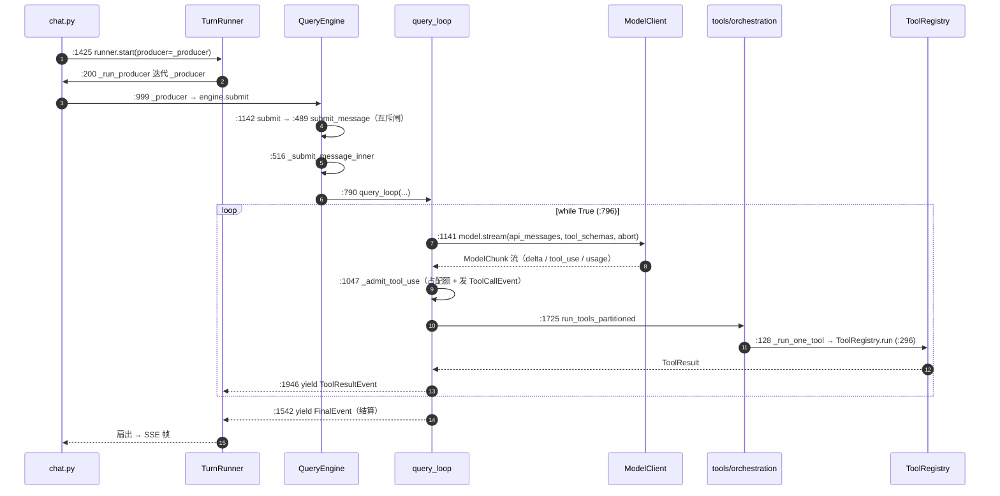
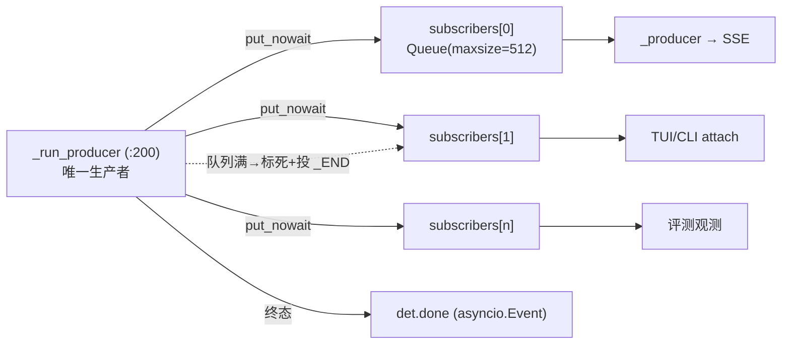

# XEYO 面试知识书 · 第一册 · 运行时内核

> 覆盖系统：**S01 引擎运行时主循环**、**S02 消息与事件类型体系**
> 覆盖功能：**F001–F006、F012、F014**
> 对应岗位能力：AG-01（Agent 总体架构与运行时）、AG-03（上下文工程，交接给第二册）、AG-08（异步/并发，交接给第三册/第十册）
>
> **证据规则**：本册所有结论均可回溯到 `python/` 下源码的 `文件:行号`。凡标注 `⚠` 者为**与项目既有叙述不一致**或**存在隐性风险**的项，已在正文说明，不美化。
> **本册不含**：`docs/` 内容（按任务书硬性规则 0 全程未读）。

---

## 目录

- [第 1 章 · S01 引擎运行时主循环](#第-1-章--s01-引擎运行时主循环)
- [第 2 章 · S02 消息与事件类型体系](#第-2-章--s02-消息与事件类型体系)
- [第 3 章 · 功能分册：F001–F006 / F012 / F014](#第-3-章--功能分册f001f006--f012--f014)

---

# 第 1 章 · S01 引擎运行时主循环

## 1.1 定位

XEYO 的**会话级 Agent 内核**。一个会话（session）持有一个 `QueryEngine` 实例，引擎封装「模型厂商无关」的完整推理-行动循环（model ↔ tool 迭代），对外只暴露「提交一条用户消息 → 消费一条事件流」两个动作。

**它是全仓唯一的推理主链收口**：GUI / TUI / CLI / 远程通道四个入口，最终都落到同一个 `query_loop`。

```
GUI(Tauri) ┐
TUI(Ink)   ├─ HTTP/SSE ─→ server/routers/chat.py ─→ TurnRunner ─→ QueryEngine ─→ query_loop
CLI(Typer) ┘
```

**关键抽象**（一句话）：`QueryEngine` = 状态容器 + 依赖注入点；`query_loop` = 无状态的循环函数；`TurnRunner` = 生产/订阅的中转站。三者职责被刻意切开，避免出现「什么都干的 God Object」。

## 1.2 源码入口

| 角色 | 文件 | 符号 | 行号 |
| --- | --- | --- | --- |
| 引擎类 | `python/engine/query_engine.py` | `class QueryEngine` | `:145` |
| 构造器（依赖注入） | 同上 | `QueryEngine.__init__` | `:154` |
| 提交入口（互斥） | 同上 | `QueryEngine.submit_message` | `:489` |
| 提交实现 | 同上 | `QueryEngine._submit_message_inner` | `:516` |
| 对外别名 | 同上 | `QueryEngine.submit` | `:1142` |
| 中断 | 同上 | `QueryEngine.interrupt` | `:401` |
| 主循环 | `python/engine/query_loop.py` | `async def query_loop` | `:726` |
| 循环体起点 | 同上 | `while True:` | `:796` |
| Turn 生产者/订阅者 | `python/engine/turn_runner.py` | `class TurnRunner` | `:87` |
| 启动 turn | 同上 | `TurnRunner.start` | `:143` |
| 生产者协程 | 同上 | `TurnRunner._run_producer` | `:200` |
| 订阅 | 同上 | `TurnRunner.subscribe` | `:413` |
| HTTP 落点 | `python/server/routers/chat.py` | `_producer` / `runner.start` | `:999` / `:1425` |

## 1.3 核心类与函数

### 1.3.1 `QueryEngine` —— 依赖注入 + 状态容器

构造器 `__init__`（`:154`）接收一个 `QueryEngineConfig`（TypedDict，`:85`），把**所有可变依赖从外部注入**，这是本册最值得讲的工程设计点：

| 注入依赖 | 类型 | 作用 | 行号 |
| --- | --- | --- | --- |
| `model_client` | `ModelClient` | 厂商无关模型接口（见第二册） | `:174` |
| `tools` | `ToolRegistry` | 工具面（见第三册） | `:175` |
| `prompt` | `PromptAssembler` | system prompt 装配 + memo | `:176` |
| `session` | `SessionState` | 会话状态 | `:189` |
| `task_state` | `SessionTaskState` | 任务/待办状态 | `:199` |
| `abort_controller` | `AbortController` | 取消信号源（见第十册） | `:213` |
| `working` | `WorkingSnapshot`（由 `hydrate` 产生） | 投影增量缓存 | `:220` |
| `rewind_journal` / `revision_store` / `snapshot_store` | — | 回溯三件套（见第七册） | `:242-253` |
| `permission_profile` | `str` | 权限档位 | `:201` |

内部状态标志：`_mutable_messages`、`_turn_active: bool`（`:257`）。

**public 方法面**（面试时可直接背这一层，说明「引擎对外只有这些」）：

| 方法/属性 | 行号 | 一句话 |
| --- | --- | --- |
| `submit_message` | `:489` | **唯一提交入口**，带 turn 互斥闸 |
| `submit` | `:1142` | 兼容别名，内部转发到 `submit_message` |
| `interrupt` | `:401` | 置位 abort 并 cancel 未决面板（权限/提问/计划） |
| `config` / `session_id` / `mutable_messages` / `permission_profile` | `:260/:265/:270/:285` | 只读属性 |
| `is_empty` | `:274` | 是否空会话 |
| `set_permission_profile` | `:278` | 运行期切权限档 |
| `hydrate_if_empty` | `:289` | 从持久化恢复 |
| `replace_history` | `:305` | 替换历史（回溯用） |
| `abort_controller` | `:341` | 暴露取消源 |
| `budget_snapshot` / `task_state_snapshot` | `:345/:376` | 快照查询（UI 用） |
| `_persist_transcript_delta` | `:387` | 增量落盘 |
| `_maybe_advance_goal_round` | `:436` | Goal 轮推进（见第七册） |
| `build_default_engine`（模块级） | `:1194` | 默认装配工厂 |

### 1.3.2 互斥闸：`_turn_active`

```python
self._turn_active: bool = False     # :257
...
if self._turn_active:               # :500
    ...
self._turn_active = True            # :505
try:
    ...
finally:
    self._turn_active = False       # :510
```

**设计取舍**：用**布尔标志 + try/finally** 而不是 `asyncio.Lock`。原因是语义不同——同会话并发提交应当**立即拒绝**（返回忙碌）而不是**排队等待**；锁会引入排队队列与超时语义，反而放大延迟。`submit_message` 的 `finally` 在 `:1158` 的注释里明确写了「护栏 finally，`_turn_active` 立即复位而非等 finalizer」——**这是刻意的：宁可提前释放互斥，也不让一个卡死的 finalizer 永久锁死会话。**

面试可讲点：这是一个「快速失败（fail-fast）」而非「排队（queueing）」的并发策略，适合**单用户交互式 Agent**；如果是多用户 SaaS，则应改成队列 + 背压。

## 1.4 一轮 turn 的完整调用链

> 全部节点均已用 grep 核实行号；这是 XEYO **唯一的推理主链**。



**跳数清单（A→B→C，≥8 跳，逐跳可查）**：

| # | 跳 | 文件:行号 | 作用 |
| --- | --- | --- | --- |
| 1 | `runner.start(producer=…)` | `server/routers/chat.py:1425` | HTTP 侧启动一个 turn |
| 2 | `TurnRunner.start` → `_run_producer` | `engine/turn_runner.py:143` → `:200` | 拉起生产者协程 |
| 3 | `_producer()` 内调 `engine.submit` | `server/routers/chat.py:999` | 事件转 SSE 帧 |
| 4 | `submit` → `submit_message` | `engine/query_engine.py:1142` → `:489` | 过互斥闸 |
| 5 | `_submit_message_inner` | `engine/query_engine.py:516` | 装配消息/预算/abort |
| 6 | 驱动 `query_loop` | `engine/query_engine.py:790` | 进入主循环 |
| 7 | `model.stream(...)` | `engine/query_loop.py:1141` | 一次模型请求 |
| 8 | `_admit_tool_use` | `engine/query_loop.py:1047` | 工具准入（配额 + 事件） |
| 9 | `run_tools_partitioned` | `engine/query_loop.py:1725` → `tools/orchestration.py:247` | 分区并发 |
| 10 | `_run_one_tool` → `ToolRegistry.run` | `tools/orchestration.py:128` → `tools/tool_registry.py:296` | 单工具执行 |
| 11 | `yield ToolResultEvent` | `engine/query_loop.py:1946` | 结果回填 |
| 12 | `yield FinalEvent` | `engine/query_loop.py:1542` | 结算 |

## 1.5 `query_loop` 主循环结构（`:796` 起）

`query_loop` 是 `async generator`——**它不返回值，只 yield 事件**。这是本册第二个关键设计：引擎核心不直接写 SSE、不直接写 WebSocket，而是产出一个**厂商无关的领域事件流**；由 `TurnRunner` 决定扇出给谁。这样同一份事件流可以喂给 HTTP/SSE、TUI、CLI、评测脚本。

循环体顺序（10 步）：

| 步 | 动作 | 行号 | 说明 |
| --- | --- | --- | --- |
| 1 | `abort.aborted` 检查 | `:797` | 真 → `yield StoppedEvent(reason="aborted")` 并 `return` |
| 2 | `budget.prepare_next_turn()` | `:800` | 假 → 进「收尾窗」（`forced_wrap_up=True`），读 `wrap_quota_left` |
| 3 | 投影 + 缓存 | `:823`–`:946` | `project_for_model` 产出本轮模型可见消息；`schemas_json_cache` 复用 |
| 4 | 首轮嗅探 + T_now 挂接 | `:984`/`:998` | `first_sniff` → `_attach_turn_context`（第二册） |
| 5 | prompt 装配 | `:1003` | `prompt.build`（system + 左段 memo） |
| 6 | 内层 `while` 收流 | `:1127` 起，`:1141` `model.stream` | 累积 delta / admit 工具 / `raise_if_aborted()` |
| 7 | assistant 消息落库 | `:1403` | 含 reasoning 通道 |
| 8 | 无工具 → `FinalEvent` | `:1540`/`:1542` | 正常终止路径 |
| 9 | 有工具 → 并发执行 | `:1722` `run_tools_partitioned` | 收 `result_q` / `progress_q` |
| 10 | `yield ToolResultEvent` + 复核 | `:1927`/`:1946` | 预算/abort 复核后 `continue` |

**退出条件（枚举，全部可查）**：

| 条件 | 行号 | 事件 |
| --- | --- | --- |
| 用户中断 | `:797`、`:1568`、`:1991` | `StoppedEvent(reason="aborted")` |
| 预算耗尽（轮次/工具配额） | `:803`、`:923`、`:1371` | `StoppedEvent(reason=budget.hard_stop_reason)` |
| token 预算耗尽 | `:1996` | `over_token_budget` 分支 |
| 收尾窗内仍无文本 | `:1422` | 硬停语义 |
| 模型未请求工具 | `:1540` | `FinalEvent` 正常结束 |
| Plan 被拒 | `:1528` | `FinalEvent` |
| ExitPlanMode 无计划 | `:1463` | `FinalEvent(text="ExitPlanMode requires a plan.")` |

**⚠ 讲这一章时容易被追问的点**：主循环的「收尾窗」（`forced_wrap_up`）不是「一开闸就全禁工具」，而是**配额内继续放行**（`wrap_quota_left`，默认 3，`XEYO_WRAP_QUOTA` 可覆盖，`:118` `wrap_quota_from_env`）。注释 `:1101` 附近写明理由是「收尾恰好最需要落盘」。这是一个**反直觉但正确**的设计——多数 Agent 在硬停前会关掉工具，结果是「模型想说结论却写不出文件」。

## 1.6 `TurnRunner`：生产者-订阅者扇出

一个 turn 可能同时被**多个订阅者**消费（GUI 主窗口 + 宠物窗口 + TUI attach + 评测观测）。`TurnRunner` 是这一层的实现：



| 机制 | 行号 | 实现 |
| --- | --- | --- |
| 订阅者容器 | `:72` | `subscribers: list[asyncio.Queue[Any]]` |
| 终止哨兵 | `:81` | `_END = object()` |
| 扇出 | `:275` | `for q in list(det.subscribers): q.put_nowait(...)` |
| 慢消费者处理 | `:284`/`:293` | 队列满 → 从订阅表移除并投 `_END`（**丢慢订阅者，不阻塞生产者**） |
| 订阅（含历史重放） | `:413`→`:430`→`:432` | 先挂队列，再重放 cursor 之后的历史帧 |
| 注销 | `:458` | `finally: t.subscribers.remove(q)` |
| 队列上限 | `:430` | `asyncio.Queue(maxsize=512)` |
| 等待终态 | `:462` | `wait_done(session_id, timeout)` |

**设计取舍（可直接作为面试亮点）**：

1. **广播用 `list[Queue]` + `put_nowait`，而不是 `asyncio.Event` 或回调**。理由：订阅者消费速度不可控，回调会让慢订阅者阻塞生产者；`Queue` + `put_nowait` 把「慢」这件事**限制在订阅者自己身上**。
2. **慢订阅者直接踢掉，而不是无限缓冲**。`maxsize=512` + 踢出，是「背压 → 弃」而非「背压 → 阻塞」。对交互式 Agent，阻塞生产者（=卡住模型循环）比丢一帧更不可接受。
3. **`subscribe` 支持 cursor 重放**（`:413`），这是「前端断线重连不丢事件」的地基——与第二阶段的功能 F105（GUI 断线重连）闭环。

## 1.7 异常与边界

| 边界 | 处理 | 行号 |
| --- | --- | --- |
| 模型流中途 abort | 捕获 `Aborted` → 补中断锚 + `StoppedEvent` | `:1163` |
| 工具执行中 abort | 捕获后 `_fill_missing_tool_results` 补齐孤儿 tool_use | `:1801`、`:1829` |
| 模型流异常（可重试） | 见 §1.5 / 第十册；未吐 chunk 且可重试 → 原地重建同请求 | `:1243` |
| 孤儿 tool_use（无 result） | `_repair_unpaired_tool_calls` 补 `is_error=True` 的合成 result | `:218` |
| ExitPlanMode 跳过 | `_append_skipped_tool_results`，措辞 `f"[{reason}] tool was not executed"` | `:707` |
| 未知工具 | `ToolRegistry.run` 返回 `unknown tool: {name}`，**不抛异常** | `tool_registry.py:304` |

**孤儿 tool_use 的修复语义**（面试常问）：LLM 协议要求每个 `tool_use` 必须有配对的 `tool_result`，否则下一轮请求直接 400。`_repair_unpaired_tool_calls`（`:218`）遍历 store，取 assistant 消息的 tool_use 列表（`:224`），向后收集连续 tool 消息的 `tool_call_id`（`:230`），对缺失者用 `store.insert` 插入合成的 `tool_result_message(uid, name, f"[tool {reason}]", is_error=True)`（`:239`）。`reason ∈ {aborted, wrap_up, error}`。

**修复时机是刻意的**：注释 `:1055` 附近明确写「配对修复只在 submit 入口（及 abort 路径的 `_fill_missing`）做一次，**不在每轮模型请求前全量扫 store**」——这是性能取舍（O(n) 扫描每轮执行会放大长会话开销）。

## 1.8 设计取舍（含被否决的方案）

| 决策点 | 采用方案 | 被否决的方案 | 证据 |
| --- | --- | --- | --- |
| 并发提交 | 布尔 `_turn_active` 快速失败 | `asyncio.Lock` 排队 | `query_engine.py:257/500/505/510` |
| 事件分发 | 领域事件流 + `TurnRunner` 扇出 | 循环内直接写 SSE | `query_loop.py:726` 返回 `AsyncIterator[EngineEvent]` |
| 慢订阅者 | 踢出 | 无限缓冲 / 阻塞生产者 | `turn_runner.py:284/293` |
| 工具配对修复 | 入口一次 + abort 路径 | 每轮全量扫描 | `query_loop.py:1055` 附近注释 |
| 收尾窗 | 配额内继续放行工具 | 进收尾即全禁工具 | `query_loop.py:1101` 附近注释；`wrap_quota_from_env:118` |
| 记忆索引注入 | **恒关**（事故退役） | 常驻注入索引 | `query_loop.py:355` `_memory_index_live_enabled` 返回 `False` |

**⚠ 必须如实披露的一项**：`_memory_index_live_enabled()`（`query_loop.py:355`）**硬编码 `return False`**。源码注释原文：「Memory 索引常驻注入开关：**恒关**（2026-09-09 用户裁决维持下线）。事故 sess_mtiche8l（弱模型把索引条目当任务对象）后已退役，AGENTS「已下线」与此对齐。……受控重开须源码级改此函数 + A1（200+ 轮 live）/ A3 过门证据。」

**这是一段极高质量的面试素材**：它讲的是「**上线了 → 观察到事故 → 主动退役 → 留下复开条件与证据门**」的完整工程闭环，而不是「我们有个记忆索引功能」。讲这个故事比讲功能本身更能证明工程判断力。

## 1.9 Agent 岗位关联

| 岗位能力 | 本系统对应点 | 面试表达锚点 |
| --- | --- | --- |
| Agent 总体架构与运行时 | `QueryEngine` / `query_loop` / `TurnRunner` 三层切开 | 「引擎不碰传输、循环不持状态、传输不做决策」 |
| 异步与并发 | `async generator` 事件流 + 扇出 + 慢订阅者策略 | 「事件流是领域契约，不是 HTTP 细节」 |
| 上下文工程 | 投影（`project_for_model`）+ 缓存（`schemas_json_cache`） | 「模型看到的是投影，不是真相存储」 |
| 健壮性 | 配对修复 / abort 级联 / 收尾窗 | 「LLM 协议的不变式必须由引擎强制，不能指望模型自觉」 |
| 工程判断 | 记忆索引退役决策 | 「能讲清一项功能为什么被下线」 |

## 1.10 面试题 + 回答模板 + 追问

### Q1：你的 Agent 运行时是怎么分层的？一句话说清各层职责。

**回答模板**：
> 分三层，且刻意不让任何一层做别层的事。
> **`QueryEngine` 是状态容器 + 依赖注入点**——它保存会话状态、按 TypedDict 注入 model/tools/prompt/abort 等依赖（`query_engine.py:154`），对外只有 `submit_message` 和 `interrupt` 两个动作。
> **`query_loop` 是纯循环函数**——无状态，收 `store/model/tools/abort/budget` 作参数（`query_loop.py:726`），产出**领域事件流**（`AsyncIterator[EngineEvent]`），不写 SSE、不碰 HTTP。
> **`TurnRunner` 是传输中转**——一个 turn 的事件扇出给多个订阅者（`turn_runner.py:200/275`），慢订阅者直接踢掉（`:284`）。
> 好处是同一份事件流同时喂给 GUI、TUI、CLI 和评测脚本，传输层换了不影响内核。

**追问 1**：为什么不把三层合成一个大类？
> 因为三层的变更频率与测试策略完全不同。循环逻辑要单测（可以喂 fake client），传输扇出要 e2e（要真 SSE），状态容器要持久化测试。合起来意味着任何一处改动都要跑全量测试，且「改传输」和「改推理」会互相污染 review。

**追问 2**：`query_loop` 为什么用 `async generator` 而不是 `list[Event]`？
> 因为流式是本质需求，不是优化。模型首 token 到末 token 之间会持续产生 delta（`AssistantDelta` / `ReasoningDelta`），收集成 list 会导致 UI 只在全部结束后才更新。generator 让「产生即送达」，且天然支持中途 `abort`——消费者可以直接停止迭代。

### Q2：同一个会话并发提交两条消息会怎样？你怎么处理的？

**回答模板**：
> 第二条会被**立即拒绝**（fail-fast），不排队。实现是 `QueryEngine._turn_active` 布尔标志（`query_engine.py:257`），`submit_message` 进来先判（`:500`），已活跃就返回忙碌；否则置位（`:505`），`finally` 复位（`:510`）。
> 这里有个刻意选择：`finally` 复位**不等 finalizer 完成**（`:1158` 注释）。即「宁可提前释放互斥，也不让一个卡死的收尾流程永久锁死会话」。

**追问**：为什么不用 `asyncio.Lock`？
> 因为 Lock 的语义是「排队等待」，而交互式 Agent 需要的语义是「快速失败」。用户第二次提交时更希望立刻看到「当前轮次进行中，可中断」，而不是静默等 30 秒。另外 Lock 会引入超时/取消的额外复杂度，而这里一个布尔标志就够了——**能用弱原语解决就不要用强原语**。

**追问**：那多用户 SaaS 场景怎么办？
> 那就该换成队列 + 背压，而且 `_turn_active` 要按会话粒度而不是按引擎实例粒度。XEYO 是**单用户桌面/终端 Agent**（一个会话一个引擎，见 `server/session_pool.py` 的会话池），所以布尔标志是正确的粒度；如果要做 SaaS，这一层必须重写，不能直接复用。

### Q3：模型返回了 `tool_use` 但工具没执行成功，历史里就出现了「孤儿」，你怎么处理？

**回答模板**：
> 孤儿 tool_use 会让下一轮请求被厂商直接 400（LLM 协议要求严格配对），所以必须在**进入下一轮之前**补齐。XEYO 的做法是 `_repair_unpaired_tool_calls`（`query_loop.py:218`）：遍历消息存储，取出每条 assistant 消息声明的 tool_use id（`:224`），向后收集紧随其后的 tool 结果 id（`:230`），差集就是孤儿；对每个孤儿插入一条合成的错误结果（`is_error=True`，正文 `"[tool {reason}]"`，`:239`）。
> 触发时机有两处：`submit` 入口一次，以及每条 abort 分支（`:1570/1807/1835/1931`）。**刻意不做每轮全量扫描**——长会话下那是 O(n²) 的开销，注释在 `:1055` 附近挂了这个理由。

**追问**：合成的结果正文为什么是 `[tool aborted]` 这种「无信息」文本，而不是解释性文本？
> 因为项目有一条引擎铁律：**模型可见文本只承载状态/结果/事实，不承载建议、劝导、评价**（`AGENTS.md` 设计理念）。`[tool aborted]` 是事实声明，告诉模型「这次调用没执行」；如果写成「工具被中断了，请重试或换个方式」就变成导演式指令，会污染模型的自主决策。

**追问**：如果模型反复产生孤儿（比如工具一直超时）会怎样？
> 会进入重复抑制与硬停路径：`RepeatCallGuard`（同签名重复调用）与 `IdenticalResultFold`（同签名同输出字节级折叠）在 `query_loop` 里按 **submit 粒度**新建（`:1050` 附近），即每条用户输入重置一次。另外预算层会兜底硬停（`budget.prepare_next_turn` 返回假 → 进收尾窗 → 无文本则 `StoppedEvent`）。

### Q4：$（场景题）如果模型在长任务里一直想拿结果但预算快耗尽了，你怎么设计收尾？

**回答模板**：
> XEYO 的设计是**不立刻关掉工具**。`budget.prepare_next_turn()` 返回假时进入「收尾窗」（`query_loop.py:800`），但此时**配额内工具仍可用**——`wrap_quota_left` 默认 3（`wrap_quota_from_env`，`:118`），只有配额耗尽才真正拒绝。
> 理由是反直觉的但很实在：**收尾阶段恰恰最需要落盘**。如果一进收尾窗就全禁工具，模型想输出结论却写不出文件、跑不了验证，最后只能吐一段无法验证的文本。
> 同时在进入收尾窗时发布一次「缺口清单 + 剩余配额」到 T_now（`_publish_wrap_guide`，`:132`），让模型知道还剩几次机会。

**追问**：这不是在「提示模型该收尾了」吗？跟你的「注意力里只有信息没有导演」冲突吗？
> 不冲突，因为它发布的是**事实**：「你还剩 N 次工具调用」是状态，「请尽快收尾」才是导演。引擎的执行层（配额）已经在强制这件事了，提示只是让状态可见，不改变模型能做什么。

## 1.11 源码证据清单

```
engine/query_engine.py:85            QueryEngineConfig (TypedDict)
engine/query_engine.py:145           class QueryEngine
engine/query_engine.py:154           __init__（依赖注入）
engine/query_engine.py:257           _turn_active
engine/query_engine.py:401           interrupt
engine/query_engine.py:489           submit_message（互斥闸入口）
engine/query_engine.py:500/505/510   互斥判定 / 置位 / 复位
engine/query_engine.py:516           _submit_message_inner
engine/query_engine.py:790           调用 query_loop
engine/query_engine.py:1142          submit（兼容别名）
engine/query_engine.py:1194          build_default_engine
engine/query_loop.py:118             wrap_quota_from_env
engine/query_loop.py:132             _publish_wrap_guide
engine/query_loop.py:218             _repair_unpaired_tool_calls
engine/query_loop.py:244             _fill_missing_tool_results
engine/query_loop.py:355             _memory_index_live_enabled（恒 False）
engine/query_loop.py:707             _append_skipped_tool_results
engine/query_loop.py:726             async def query_loop
engine/query_loop.py:790             （_submit_message_inner 内的驱动点，见 query_engine）
engine/query_loop.py:796             while True
engine/query_loop.py:1047            _admit_tool_use
engine/query_loop.py:1141            model.stream
engine/query_loop.py:1542            yield FinalEvent
engine/query_loop.py:1725            run_tools_partitioned
engine/query_loop.py:1946            yield ToolResultEvent
engine/turn_runner.py:72             subscribers
engine/turn_runner.py:81             _END
engine/turn_runner.py:143            TurnRunner.start
engine/turn_runner.py:200            _run_producer
engine/turn_runner.py:275/284/293    扇出 / 踢慢订阅者 / 投 _END
engine/turn_runner.py:413/430/432/458 subscribe / maxsize=512 / 挂载 / 注销
engine/turn_runner.py:462            wait_done
server/routers/chat.py:999           _producer
server/routers/chat.py:1425          runner.start
```

---

# 第 2 章 · S02 消息与事件类型体系

## 2.1 定位

S02 是**全链路数据契约层**：定义「一条消息长什么样」「一个事件长什么样」「一次传输怎么包装」。它被全仓依赖——引擎产出事件、服务端序列化事件、前端消费事件、持久化落消息，全部认这一层类型。

**为什么单独立册讲**：Agent 系统最常见的架构腐蚀就是「每一层自己拼 dict」。XEYO 用 `msgtypes/` 三个文件把这件事锁死，是本项目**代码组织**上最能讲的一处。

## 2.2 三类数据契约

### 2.2.1 消息与工具调用（`msgtypes/message.py`）

| 类型 | 行号 | 作用 |
| --- | --- | --- |
| `Message` | `:13` | 单条消息（role + content） |
| `ToolUse` | `:20` | 模型声明的工具调用（id / name / input） |
| `ToolResultMessage` | `:33` | 工具结果消息 |
| `tool_result_message()` | `:55` | 构造工厂 |
| `text_message()` | `:97` | 文本消息工厂 |

**证据**：`msgtypes/message.py:13/20/33/55/97`。

### 2.2.2 引擎事件（`msgtypes/events.py`）—— 20 个 dataclass

用 grep `^class .*Event` 实测得 18 个以 `Event` 结尾的类，加上 `AssistantDelta`、`ReasoningDelta` 两个不以 Event 结尾的 delta 类，共 **20 个**：

| # | 事件 | 行号 | 语义 |
| --- | --- | --- | --- |
| 1 | `AssistantDelta` | `:26` | 正文增量 |
| 2 | `ReasoningDelta` | `:33` | 思考增量（独立通道） |
| 3 | `ToolCallEvent` | `:39` | 工具调用被准入 |
| 4 | `ToolProgressEvent` | `:50` | 工具进度（旁路，模型不可见） |
| 5 | `ToolResultEvent` | `:66` | 工具结果 |
| 6 | `FinalEvent` | `:84` | 正常结束 |
| 7 | `StoppedEvent` | `:98` | 异常/主动终止（带 reason） |
| 8 | `UsageEvent` | `:109` | token 用量（厂商权威值） |
| 9 | `ContextCompressionEvent` | `:139` | 上下文压缩发生 |
| 10 | `ResultEvent` | `:150` | 结果型事件 |
| 11 | `PermissionPendingEvent` | `:174` | 权限挂起 |
| 12 | `PermissionExpiringEvent` | `:196` | 权限即将超时 |
| 13 | `PermissionResolvedEvent` | `:206` | 权限已裁决 |
| 14 | `AskUserPendingEvent` | `:220` | 结构化提问挂起 |
| 15 | `AskUserResolvedEvent` | `:238` | 提问已答 |
| 16 | `PlanPendingEvent` | `:250` | 计划待审批 |
| 17 | `PlanResolvedEvent` | `:262` | 计划已裁决 |
| 18 | `TaskStateEvent` | `:274` | 任务态变更 |
| 19 | `LlmRetryEvent` | `:287` | LLM 重试（结果） |
| 20 | `LlmRetryStartedEvent` | `:304` | LLM 重试（开始） |

**⚠ 已知不一致（如实披露）**：`events.py` 顶部注释块**漏列**了 `ReasoningDelta` 与 `PermissionExpiringEvent`，且 `ToolProgressEvent` 在部分下游实现里未处理（见第 2.4 节与 C-16）。

**⚠ `UsageEvent` 的权威性**：注释明确「authoritative vendor usage events」（`query_loop` docstring，`:743` 附近）——用量不是引擎估算的，而是厂商返回的原始值。这决定了成本台账的可信度（见第九册 S35）。

### 2.2.3 传输包装（`msgtypes/envelope.py`）

| 类型 | 行号 | 作用 |
| --- | --- | --- |
| Envelope 主体 | `:13` | 事件包装 |
| 事件 id 分配 | `:35` | 单调递增 id（断线重连 cursor 的锚点） |
| 序列化 | `:63` | 转 dict/JSON |

**证据**：`msgtypes/envelope.py:13/35/63`。

## 2.3 SSE 序列化落点

事件 → SSE 帧的转换**只有一个地方**：`server/routers/chat.py` 的 `_producer()`（`:999`）。它是一条 `isinstance(ev, ...)` 链，逐个事件转帧：

| 事件 | 序列化行号 |
| --- | --- |
| `AssistantDelta` | `:1090` |
| `ReasoningDelta` | `:1098` |
| `ToolCallEvent` | `:1106` |
| `ToolProgressEvent` | `:1120` |
| `ToolResultEvent` | `:1137` |
| `LlmRetryEvent` | `:1157` |
| `LlmRetryStartedEvent` | `:1176` |
| `FinalEvent` | `:1191` |
| `StoppedEvent` | `:1207` |
| `UsageEvent` | `:1232` |
| `PermissionPendingEvent` | `:1263` |
| （结果/任务态/计划/提问同构分支） | `:1263`–`:1410` |

帧在 `_id()`（`:990`）里被赋 `event_id`，再由 `TurnRunner` 扇出——**id 分配与扇出解耦**，这也是断线重连能按 cursor 重放的前提。

## 2.4 设计取舍

| 决策点 | 采用 | 理由 / 代价 |
| --- | --- | --- |
| 事件用 dataclass 还是 dict | **dataclass**（20 个） | 类型安全 + 可 grep；代价是每加事件要改 3 处（定义 / 序列化 / 前端类型） |
| 思考与正文 | **两条 delta 通道**（`AssistantDelta` / `ReasoningDelta`） | 让 UI 可分别渲染；也避免把 reasoning 混进正文历史 |
| 用量来源 | 厂商返回（authoritative） | 台账可信；代价是历史会话无法补算 |
| 事件 id | Envelope 层统一分配 | 断线重连可重放；代价是 id 语义与业务无关 |
| TUI/GUI 两套消费 | **双轨**（`gui/src/lib/api/` vs `tui/src/api/sse.ts`） | ⚠ 事件面覆盖度可能不一致（C-16，本轮未逐事件比对） |

## 2.5 面试题 + 回答模板

### Q1：你为什么把事件类型单独抽一层？

**回答模板**：
> 因为事件是**跨进程契约**，不是内部实现细节。XEYO 的引擎产事件、服务端序列化事件、前端消费事件、评测脚本也消费事件——四个不同的代码库、两种语言（Python/TypeScript）。如果每层自己拼 dict，一次字段改名就会静默破坏前端。
> 抽成 `msgtypes/events.py` 的 20 个 dataclass 之后，契约是显式的：加一个事件必须同时改定义、序列化、前端类型，review 时一眼可见。

**追问**：代价是什么？
> 加事件的成本变高（三处同步），而且**类型安全只在 Python 侧强制**，TS 侧靠 `gui/src/generated/` 之类的生成物对齐，存在漂移风险。另外 `events.py` 顶部注释块已经漏列了两个事件（`ReasoningDelta`、`PermissionExpiringEvent`）——这说明**注释型契约会腐烂，只有测试型契约不会**。

### Q2：断线重连怎么保证不丢事件？

**回答模板**：
> 靠两点。第一，事件在 Envelope 层被分配单调 id（`envelope.py:35`），这个 id 与业务无关，只服务时序。第二，`TurnRunner.subscribe`（`turn_runner.py:413`）接受 cursor，挂上队列后**先重放 cursor 之后的历史帧**再转 live。
> 所以前端只要记住最后一个 event_id，重连时带上来就能续上。服务端 SSE 端点也提供 `?cursor=` 参数（见 `server/routers/chat.py`）。

**追问**：如果重连时事件已经被淘汰了呢？
> 那就退化为「重建」而不是「重放」——前端会用 IndexedDB 缓存 + 会话消息读取端点（`routers/sessions.py`）重建视图，而不是继续增量。这是**分级一致性**取舍：重放是优化，重建是兜底。

## 2.6 源码证据清单

```
msgtypes/message.py:13/20/33/55/97   Message / ToolUse / ToolResultMessage / 工厂
msgtypes/events.py:26-304            20 个事件 dataclass（逐个行号见上表）
msgtypes/envelope.py:13/35/63        Envelope / id 分配 / 序列化
server/routers/chat.py:990           _id() 事件 id 分配
server/routers/chat.py:999           _producer() isinstance 链
server/routers/chat.py:1090-1410     各事件序列化分支
```

---

# 第 3 章 · 功能分册：F001–F006 / F012 / F014

> 功能章采用统一模板：**目标 → 调用链 → 输入/输出契约 → 配置项 → 异常路径 → 性能特征 → 测试覆盖 → 项目亮点 → 面试问法 + 回答模板 → 源码证据**。
> 为控制篇幅，本章对 8 个功能采用「要点表 + 重点功能展开」的方式：**F004（主循环）、F005（配对修复）、F012（崩溃快照）、F014（首轮嗅探）** 四个展开，其余给紧凑表。

## 3.1 紧凑表（F001 / F002 / F003 / F006）

| 编号 | 功能 | 目标 | 调用链（文件:行号） | 契约 | 配置 | 异常 | 证据 |
| --- | --- | --- | --- | --- | --- | --- | --- |
| **F001** | 会话引擎创建与复用 | 同配置复用 engine，换配置重建；LRU 上限 64 | `server/session_pool.py:212` `get_or_create` → `query_engine.py:1194` `build_default_engine` | 输入：会话 id + 配置指纹；输出：`QueryEngine` | 池上限 64 | 配置变更 → 重建（旧实例废弃） | `session_pool.py:212` |
| **F002** | Turn 生产者-订阅者扇出 | 单 turn 事件可被多订阅者消费 | `turn_runner.py:143` start → `:200` _run_producer → `:275` 扇出 → `:413` subscribe | 输入：`producer` 异步生成器；输出：每订阅者一条 `Queue` | `maxsize=512` | 队列满 → 踢订阅者 + `_END` | `turn_runner.py:72/200/275/284/293/413/430` |
| **F003** | 提交互斥闸 | 同会话串行提交，并发提交快速失败 | `query_engine.py:489` `submit_message` → `:500` 判定 → `:505` 置位 → `:510` 复位 | 输入：`Message`；输出：事件流或忙碌 | `_turn_active` | 已活跃 → 拒绝（不排队） | `query_engine.py:257/489/500/505/510` |
| **F006** | LLM 重试与退避 | provider 瞬时失败自动重试 | `query_loop.py:1141` stream → `:1243` 判定 → `:1255/1264` 发 `LlmRetry*Event` | 输入：失败的请求；输出：重试事件或抛异常 | `XEYO_LLM_MAX_ATTEMPTS`（默认 3，钳 [1,5]）；退避 `0.5·2^(n-1)` 上限 10s，+10% jitter | 不可重试 → `raise pending_exc`；空响应 → `EmptyResponseError` | `query_loop.py:263/273/284/288/292/1243/1255/1264` |

**F006 的判定条件是本册最值得记的一个细节**（`query_loop.py:1243` 附近）：

```
failure.retryable and not saw_any and attempt < max
```

即「**尚未吐过任何 chunk** 且可重试且未超次」才原地重建同一请求。**为什么会吐过 chunk 就不能重试**：一旦有 delta 已经被消费（进了 UI、进了 store），重试会导致**同一 turn 出现两份正文增量**，前端去重逻辑无法安全处理。这是一个典型的「流式系统的不变式」——**流的重试必须在「零副作用点」之前**。

## 3.2 重点功能：F004 · 模型↔工具迭代主循环

### 目标
在单轮用户输入内，驱动「模型推理 → 工具执行 → 结果回填 → 再推理」直到模型不再请求工具或触及硬停。

### 调用链
```
query_engine.py:790 query_loop(...)
  └─ query_loop.py:796 while True
       ├─ :797  abort 检查
       ├─ :800  budget.prepare_next_turn()（假 → 收尾窗）
       ├─ :823-:946 投影 + schema 缓存
       ├─ :984  first_sniff → :998 _attach_turn_context
       ├─ :1003 prompt.build
       ├─ :1127 内层 while → :1141 model.stream
       │     ├─ AssistantDelta / ReasoningDelta 累积
       │     ├─ :1047 _admit_tool_use（配额 + ToolCallEvent）
       │     └─ :1141 raise_if_aborted
       ├─ :1403 落 assistant 消息
       ├─ :1540 无工具 → :1542 yield FinalEvent → return
       ├─ :1722 run_tools_partitioned
       └─ :1927/:1946 yield ToolResultEvent → continue
```

### 输入 / 输出契约
- **输入**：`store`（消息真相）、`model`（ModelClient）、`tools`（ToolRegistry）、`prompt`、`abort`、`budget`、`system_prompt`、`agent_mode`、`multi_agent`、`include_memory_index`、`ensure_before`。
- **输出**：`AsyncIterator[EngineEvent]`。
- **`multi_agent` 语义**（`:748` 附近 docstring）：`True` 时**只在 T_now 追加软提示**偏向使用 `Agent` 工具；**不裁工具表、不拦截收尾**。关闭时 `Agent` 工具**仍可用**，模型可主动 spawn。
- **`include_memory_index`**：子 Agent 传 `False`，避免工人提示词被索引撑大、也避免误答 `Memory`。
- **`ensure_before`**：可选 awaitable，**首个非只读工具执行前**会 await（`:731` 附近 docstring）。用途是让 rewind 的 Before 快照与首轮 stream 重叠，但**写工具不得越过未就绪的 Before**——这是一处很精妙的「用异步重叠换延迟，同时不牺牲一致性」的设计。

### 配置项
| 项 | 默认 | 行号 |
| --- | --- | --- |
| `XEYO_WRAP_QUOTA` | 3 | `:118` |
| `XEYO_MAX_TOOL_USE_CONCURRENCY` | 10 | `tools/orchestration.py:31` |
| `XEYO_LLM_MAX_ATTEMPTS` | 3 | `:263` |

### 异常路径
见 §1.7 表。

### 性能特征
- **投影增量缓存**（`working: WorkingSnapshot`）：跨 submit 复用，C1/C2 压缩推进时 `note_*` 会清掉缓存。
- **schema JSON 序列化缓存**：`schemas_json_cache: tuple[list[dict], str]`（`:785` 附近），理由是「schemas 内容会话内不变，避免每轮 dumps」。
- **配对修复不在每轮做**：见 §1.7。

### 测试覆盖
`python/tests/` 317 个测试文件（见第九册 S38）。主循环相关测试的定位方式是 grep `query_loop`。

### 项目亮点
「**模型↔工具循环是一个 async generator，且它的重试有零副作用点约束**」——这两点能同时讲清「流式架构」与「一致性约束」，是 Agent 岗位高频追问区。

### 面试问法 + 回答模板

**问**：你的 Agent 主循环里，工具调用是怎么和模型流交织的？

> 模型流是内层循环（`query_loop.py:1127`），工具执行是外层循环的后半段（`:1722`）。具体说：内层 `while` 收 chunk，正文/思考走两条 delta 通道累积，一旦解析出完整的 `tool_use`（JSON 参数闭合）就立刻 `_admit_tool_use`（`:1047`）——**注意是「解析完就准入」，不等流结束**，这样工具调用事件能尽早推给 UI。
> 流结束后把 assistant 消息落库（`:1403`）。如果这轮没有任何工具调用，直接 `FinalEvent` 结束（`:1542`）；否则按并发策略执行这批工具（`:1722`），逐个 yield 结果（`:1946`），然后 `continue` 回外层循环让模型看到结果继续推理。

**坑点**：
> 最容易踩的坑是**「工具调用参数是增量拼出来的」**——不能等到流结束才解析，也不能在参数 JSON 还没闭合时就尝试 parse。XEYO 的做法是每个 index 一个 buffer，累积 `arguments` 字符串，`json.loads` 成功即视为闭合（`_openai_common.py:57/126`），并用 `_emitted` 标志防重复 emit。

## 3.3 重点功能：F005 · 工具调用配对修复

### 目标
保证「每个 `tool_use` 都有配对的 `tool_result`」这条 LLM 协议不变式，在任何中断路径下都成立。

### 调用链
```
entry: query_engine.py:489 submit_message
  └─ query_loop.py:1055 附近 _repair_unpaired_tool_calls(store, "aborted")
abort path: query_loop.py:1568 / 1807 / 1835 / 1931
  └─ _fill_missing_tool_results(store, tool_uses, reason)  (:244)
ExitPlanMode path: query_loop.py:707 _append_skipped_tool_results
```

### 输入 / 输出契约
- 输入：`MessageStore`、`reason ∈ {aborted, wrap_up, error}`。
- 输出：原地插入合成 tool_result（`is_error=True`），正文 `"[tool {reason}]"`；ExitPlanMode 路径正文 `"[{reason}] tool was not executed"`。

### 异常路径 / 边界
| 情况 | 行为 | 行号 |
| --- | --- | --- |
| 孤儿 tool_use | 插合成错误 result | `:239` |
| 孤儿 tool_result（无对应 use） | **本函数不产生**；由「配对保证」在生成侧避免 | `:244` 委托关系 |
| 中断后再提交 | 入口修复一次即可，不重复修 | `:1055` 注释 |

### 性能特征
O(n) 单次扫描（n = 消息数），**入口一次 + abort 分支**，不做每轮扫描。

### 面试问法 + 回答模板

**问**：如果用户点了「打断」正好在工具执行中间，历史会坏掉吗？

> 不会，因为打断路径上一定会补配对。`interrupt()`（`query_engine.py:401`）置位 abort 并 cancel 未决面板；循环内每轮开头（`:797`）和流中（`:1142`）都会检查，捕获 `Aborted` 后（`:1163`）先补中断锚再发 `StoppedEvent`；工具执行阶段被打断则在 `:1801/:1829` 捕获并调 `_fill_missing_tool_results`。
> **关键是「补什么」**：补的是 `is_error=True` 的合成结果，正文是 `[tool aborted]` 这种纯事实声明。这样下一轮请求结构合法，且模型得到的信息是「这次没执行」——而不是一段解释性文本。

## 3.4 重点功能：F012 · 轮次崩溃恢复快照

### 目标
进程异常退出后，能判断「上一轮做到哪、有没有未完成的工具调用」，并给出可恢复列表。

### 调用链
```
TurnRunner._persist (:369)
  ├─ revision % 8 == 0 时写  (:296)
  └─ 终态时写               (:339)
  └─ TurnSnapshot.flush (:122)  原子替换（tmp + os.replace）
读: hydrate (:78) / get_public (:103) / list_recoverable (:151)
崩溃判定: mark_crashed_as_recovery (:167)  running → recovery_required
```

### 输入 / 输出契约
- 路径：`path_for (:74)` → `{XEYO_SESSIONS_DIR | ~/.xeyo/sessions}/{safe(session_id)}.turn.json`（`:58`）。
- 字段（`TurnSnapshot`，`:31`）：`session_id` / `turn_id` / `status` / `goal_text` / `last_user_message_id` / `revision` / `last_event_id` / `incomplete_tool_uses` / `active_agent_ids` / `stop_reason` / `waiting_permission` / `model` / `updated_at`。

### 性能特征（本功能最值得讲的一点）
**不是每次事件都写盘**：写盘触发是 `revision % 8 == 0`（`:296`）**加**终态（`:339`）。也就是说每 8 个 revision 落一次 + 结束时必落。这是一个「**用可容忍的丢失窗口换 IO 开销**」的取舍——崩溃最多丢不到 8 个 revision 的元数据，但恢复了读路径的写放大。

### 设计取舍
- **快照只存「元数据」，不存消息正文**。消息正文的权威在 transcript（`session/record_transcript.py`，见第四册）。理由是正文大、写频高，重复存会双倍 IO 且引入两份真相。
- **`revision` 是原子替换**（tmp + `os.replace`），不写半文件。

### 面试问法 + 回答模板

**问**：你的 Agent 进程崩了，重启后怎么知道上一轮发生了什么？

> 有一份 turn 级快照，落在 `~/.xeyo/sessions/<sid>.turn.json`（`turn_snapshot.py:58`）。它存的是**元数据不是正文**：turn_id、状态、最后的用户消息 id、revision、last_event_id、**未完成的工具调用列表** `incomplete_tool_uses`、活跃子代理 id、停止原因、是否在等权限。
> 恢复流程是 `hydrate`（`:78`）读文件；如果状态是 `running` 但进程已经没有了，`mark_crashed_as_recovery`（`:167`）把它标成 `recovery_required`；`list_recoverable`（`:151`）扫目录给出可恢复清单。
> 写盘时机是 `revision % 8` 或终态（`:296`/`:339`），原子替换——是**「允许丢 8 个 revision 的元数据，换掉写放大」**的取舍。

**追问**：为什么快照不存消息正文？
> 因为消息正文的权威只有一份，在 transcript JSONL 里（见第四册）。快照存正文会导致两份真相，且写频高会放大 IO。快照的职责是**「告诉你做到哪了、什么没收尾」**，不是「替代 transcript」。

## 3.5 重点功能：F014 · 首轮代码库嗅探

### 目标
新会话第一次进入某个工作区时，让模型知道「我在哪个目录、这一层有什么」，而不需要它先花两轮调工具。

### 调用链
```
query_loop.py:984  first_sniff.maybe_first_sniff_text(...)
  └─ first_sniff.py:41  is_first_engine_turn（判据）
  └─ first_sniff.py:49  build_first_sniff_text（内容构造）
  └─ query_loop.py:993  append_env_notice_pair（投影-only 注入）
```

### 触发条件（`first_sniff.py:33/41`）
1. 会话首轮（投影中无 assistant 消息，`is_first_engine_turn`，`:41`）；
2. 非 side-chat、非子代理；
3. 开关开（`enabled`，`:33`，环境变量 `XEYO_FIRST_SNIFF`）。

### 输入 / 输出契约
- 内容：`pwd` + 一层目录清单（`build_first_sniff_text`，`:49`），上限 **2KB / 80 条**。
- **投影-only**：经 `append_env_notice_pair` 进请求，**不进 MessageStore、不进 JSONL**。

### 设计取舍（高可讲性）
- **为什么不直接 `ls` 而要做引擎级嗅探**：因为「知道自己在哪」是**环境事实**，把它做成注入而不是让模型主动探查，能省掉每个新会话的第一轮工具往返。这是用「一次性 2KB 注入」换「每会话 1-2 轮 tool call」的交易。
- **为什么投影-only**：这是一次性信息，写进历史会永久占用上下文（而且对后续轮次无价值）。投影-only 使它在首轮可见、之后自然消失。
- **为什么上限 80 条**：防止巨型 monorepo 把 2KB 预算撑爆——**任何注入都必须有硬上限**，这是第 2.4 节「信息纪律」的具体体现。

### 面试问法 + 回答模板

**问**：你怎么让 Agent「一开始就知道自己在什么项目里」？

> 引擎在会话首轮做一次嗅探，把 `pwd` 和一层目录清单作为**环境通知**注入（`first_sniff.py:49`），上限 2KB / 80 条。触发条件很窄：必须是会话首轮、非 side-chat、非子代理、且开关打开（`:33/:41`）。
> 注入方式是**投影-only**——通过伪造的 tool 对（`assistant(xeyo_env_notice) → tool_result`）尾插进请求，**不写进消息存储、不写进 JSONL**。所以它只在首轮可见，之后自然消失，不会长期占用上下文。

**追问**：为什么不直接把这个目录清单拼进 system prompt？
> 因为 system prompt 是**稳定前缀**，拼进去会破坏 KV 缓存前缀（每换目录就整段失效）。XEYO 的铁律是「静态段只放身份/环境常量/围栏，易变内容一律走 T_now 尾插」（见第二册）。

## 3.6 源码证据清单（第 3 章）

```
server/session_pool.py:212           get_or_create（F001）
engine/turn_runner.py:143/200/275/413/430  TurnRunner（F002）
engine/query_engine.py:257/489/500/505/510 submit_message 互斥（F003）
engine/query_loop.py:726/796/1127/1141/1403/1540/1722/1946 主循环（F004）
engine/query_loop.py:218/239/244/707/1055 配对修复（F005）
engine/query_loop.py:263/273/284/288/292/1243/1255/1264 LLM 重试（F006）
engine/turn_snapshot.py:31/58/74/78/103/122/151/167 快照（F012）
engine/first_sniff.py:33/41/49/100       首轮嗅探（F014）
engine/query_loop.py:984/993             嗅探接线
```

---

## 3.7 横切组件（第四轮补全 · 2026-09-11）

> **为什么补这一节**：做全书覆盖率审计时发现 `python/common/` **覆盖率 0%**（3 个文件全未提及），`engine/` 下另有 4 个在链模块（`xml_tool_call` / `workspace_context` / `process_narration` / `skill_preinvoke`）从未出现。它们不是可选项——**失败分类、并发锁、XML 工具调用回收**都是「被追问就答不上来」的位置。

### 3.7.1 ⭐ `common/errors.py`：可重试性判定只做一次

**这是本册最该补的一块**：LLM 调用失败后「要不要重试」的判定，全仓**只有一处权威实现**。

| 符号 | 位置 | 职责 |
| --- | --- | --- |
| `ProviderError` | `common/errors.py:17` | 厂商错误基类，携带 `status_code` |
| `NetworkError` | `:33` | 网络类 |
| `EmptyResponseError` | `:40` | **流完整但零 chunk**（不是超时，是「空响应」） |
| `LlmFailure` | `:64`（`retryable` 字段 `:73`） | 结构化失败事实：`kind` / `retryable` / `retry_after_ms` |
| `classify_llm_failure` | `:77` | **唯一权威分类器**：把任意异常归一为 `LlmFailure` |
| `empty_response_failure` | `:128` | 空响应 → `retryable=True` |
| `_looks_like_context_window` | `:116` | 从错误文本识别「超上下文窗口」 |

**判定表（可直接背）**：

| 失败 kind | `retryable` | 行号 |
| --- | --- | --- |
| `network` | **True** | `:85`/`:90`/`:94` |
| `timeout` | **True**（带 `retry_after_ms`） | `:90`/`:106` |
| `rate_limit`（429） | **True**（带 `retry_after_ms`） | `:104` |
| `provider_error`（5xx） | **True** | `:108` |
| `provider_error`（其他） | **False** | `:111` |
| `empty_response` | **True** | `:130` |
| `auth`（401） | **False** | `:100` |
| `invalid_credential`（403） | **False** | `:102` |
| `context_window_exceeded`（400） | **False** | `:110` |
| `unknown` | **False** | `:95`/`:112` |

**面试怎么讲**：「**可重试性不靠字符串猜，靠一个分类器**。401/403 重试一万次也一样失败，所以 `retryable=False`；429 和 5xx 可以重试，而且把厂商 `Retry-After` 头解析成 `retry_after_ms` 带着走——退避不是拍脑袋的固定睡眠，而是**尊重厂商给的节奏**。`context_window_exceeded` 也特意归 False：重试不会让上下文变小。」（重试的执行在**第十册 §25.3**）

### 3.7.2 `common/rwlock.py`：批量工具执行的读写锁

| 项 | 事实 |
| --- | --- |
| 实现 | `RWLock`（`common/rwlock.py:33`），asyncio 读写锁：**读共享 / 写独占 / 写优先** |
| **唯一产线调用方** | `tools/orchestration.py:22`（import）、`:135`（类型）、**`:284` `rw = RWLock()`** |
| 语义 | 注释自述：「T2：读写锁——**安全批共享读、不安全批独占写**（每次调用独立，无跨批泄漏）」 |
| 为什么需要 | 一轮里有多个工具调用时，**只读的可以并发**，**会写的必须独占**；否则两个写工具并发改同一文件会互相破坏 |
| 「写优先」的意义 | 纯 asyncio 场景下防**写者饿死**——读请求不断进来时，写请求不能被无限推迟 |

**面试怎么讲**：「并行执行工具的前提是**先把批次按安全/不安全分开**。安全的并行（共享读锁），不安全的串行（独占写锁）。锁**每次调用独立创建**——这样不存在跨批次的锁泄漏。」这是「并发」与「一致性」交界处一个很实的取舍。

### 3.7.3 `engine/xml_tool_call.py`：不吐原生 tool_calls 的模型怎么办

| 符号 | 位置 | 职责 |
| --- | --- | --- |
| `extract_xml_tool_calls` | `engine/xml_tool_call.py:66` | 从模型**纯文本**里回收 `<tool_call>` XML，返回 `(list[ToolUse], cleaned_text)` |
| `looks_like_raw_tool_markup` | `:34` | 判定「这整段就是 markup」，避免把原始 XML 当正文进摘要 |
| `XmlToolCallBuffer` | `:91` | **流式**缓冲：闭合一个 `</tool_call>` 就立刻吐 `ToolUse`，不半截解析 |
| 接线 | `engine/query_loop.py:1042/1044`（流式）、`:1377/1380`、`:1389/1392`（非流式） | 同左 |

**为什么必须有**：**部分模型（如 glm 系）不吐原生 `tool_calls` 字段，而是把调用写成 XML 文本**。没有这层回收，这些模型的工具能力直接归零。

**失败处理**（可以直接讲的工程细节）：无匹配时返回 `([], 原文)`（`:86`）——**绝不抛异常、绝不吞正文**。清理后的文本才进摘要，原始 markup 由 `looks_like_raw_tool_markup`（`:34`）识别并排除。

### 3.7.4 `engine/workspace_context.py`：cwd 不再靠模块级全局

| 符号 | 位置 | 职责 |
| --- | --- | --- |
| `WorkspaceContext` | `:15` | 把 **session 与 cwd 强绑定** |
| `get_workspace_context()` | `:34` | 取当前上下文（`_current` ContextVar 在 `:24`） |
| `get_cwd()` | `:38` | **回退**：上下文缺失时退回 `session.cwd` 旧全局 |

**解决的问题**：多会话/多 Agent 并行时，如果工具或权限层读的是**模块级全局 cwd**，就会**串目录**（A 会话的工具按 B 会话的 cwd 判权限）。ContextVar 让身份跟着**执行上下文**走。

**规模**：全仓 `get_workspace_context` 调用点 **57 处**（实测 grep）——这是被大量依赖的基础设施，不是边角料。

> **与 S39 的关系**：`container_routing.py` 也用 ContextVar 承载容器身份（第三册 §7.5）。**同一套手法解决两个问题：让身份不靠全局变量传递。** 这是本项目的一条可讲的横切设计原则。

### 3.7.5 `engine/process_narration.py`：把「过程旁白」与「结果」分开

| 符号 | 位置 | 职责 |
| --- | --- | --- |
| `is_process_narration` | `:61` | 识别「让我看看…」式的**过程旁白** |
| `split_process_narration` | `:87` | 拆分，落盘时带 **`background-only`** 标注 |

**用法**：流式时旁白要显示（用户想知道它在干嘛），但**落盘时不该污染 transcript**——所以拆分后只把结果部分当正式内容。

**为什么这符合项目理念**：AGENTS.md 的铁律是「注意力里只出现信息，不出现导演」。过程旁白属于「给用户看的进度」，不属于「给模型看的上下文」——**分通道处理，比一刀切删掉或一刀切保留都正确**。

### 3.7.6 `engine/skill_preinvoke.py`：用户直呼技能时的确定性加载

| 符号 | 位置 | 职责 |
| --- | --- | --- |
| `preinvoke_enabled` | `:20` | 开关：**`XEYO_SKILL_PREINVOKE`**（`0`/`off`/`false` 关闭） |
| `preinvoke_skill_block` | `:88` | 用户消息**首行 `/name`** 命中 `user_invocable` 技能时，把 SKILL.md 正文渲染成块 |
| T_now 装配点 | `prompt/pre_llm_inject.py:1298`（`# block: skill_preinvoke`）→ `:1308` `_tag_block` | 登记表条目在 `:905`（`klass = directive`） |

**与旧链路的差别**：旧做法靠客户端改写提示词「请用 Skill 工具」，**依赖模型自觉**；本模块是**确定性加载**——命中就直接把技能正文注入。

**一个防撞名的细节**：`:69` 先查 slash registry，**若 `/name` 是已有斜杠命令则不注入**——保证技能预注入不会和 `/命令` 命名空间打架。

**声道的纪律**：它走 **T_now 声道**（伪造 tool 对尾插），**不进 MessageStore/JSONL、不碰 tools 数组、不进 system prompt**——与第二册 §5 的注入管线是同一套约束。

### 3.7.7 面试题 + 回答模板

**Q1（项目题）：模型调用失败了，你怎么决定要不要重试？**
> 有一个**唯一权威分类器** `classify_llm_failure`（`common/errors.py:77`），把异常归一成 `LlmFailure`，带 `kind` / `retryable` / `retry_after_ms`。401/403/超上下文窗口一律 `False`（重试无意义）；429/5xx/网络/超时/空响应 `True`，并且**把厂商 `Retry-After` 解析成 `retry_after_ms` 带着走**。**不靠字符串匹配错误消息**——那是不可靠的。（执行在第十册 §25.3）

**Q2（系统设计题）：一轮里模型要求并行调 10 个工具，怎么保证不出事？**
> 先 `partition_tool_calls` 分成安全批与不安全批（`tools/orchestration.py:284` 附近），安全的用**共享读锁并行**、不安全的用**独占写锁串行**；锁用 `RWLock`（`common/rwlock.py:33`，写优先防饿死），每次调用独立创建一个，**不存在跨批泄漏**。并发上限另有 `_max_concurrency()` 控制。

**Q3（场景题）：接了一个新模型，它不返回原生 tool_calls，只在正文里写 XML，怎么办？**
> `engine/xml_tool_call.py` 专门回收这种形态：流式走 `XmlToolCallBuffer`（`:91`，闭合一个 `</tool_call>` 就吐一个 `ToolUse`），非流式走 `extract_xml_tool_calls`（`:66`）。关键是**失败不抛、不吞正文**——无匹配就返回空列表 + 原文。另外有 `looks_like_raw_tool_markup`（`:34`）防止把原始 XML 当正文进摘要。

**Q4（排错题）：多会话并行时，A 会话的工具按 B 会话的目录判了权限。根因可能在哪？**
> 大概率是某处读了**模块级全局 cwd**。我们的做法是 `engine/workspace_context.py` 用 ContextVar 把 session 与 cwd 绑定（`:15/34`），`get_cwd()`（`:38`）只作回退。全仓 57 处调用点都在用这个入口。同类手法在容器路由上也有（`container_routing.py`）。**修法是统一入口，不是逐个打补丁。**

---

## 本册收益表（实测 / 可复现 · 2026-09-11 现场跑）

> **口径**：只收录有**脚本或产物**佐证的条目；无量化脚本的一律标 `定性`，不编数值。全部命令在 `python/` 下用 `./.venv/Scripts/python.exe`（或 `py -3.11`）执行。

| # | 对应功能 | 指标 | 基线 | 实测 | 证据 / 复现 |
|---|---|---|---|---|---|
| P1-1 | F001–F006 主循环 | 离线多任务门总通过率 | — | **112/112 = 100%** | `evals/mmau_local.py`；产物 `artifacts/benchmarks/startup/mmau_results.json` → `overall` |
| P1-2 | F012 崩溃恢复快照 | 「会话与任务状态」组 | — | **11/11 passed** | 同上第 3 组（`tests/test_task_state.py` + `tests/test_resume_from_disk.py`） |
| P1-3 | 工具契约（F020–F051 契约面） | 「工具契约」组 | — | **6/6 passed** | `tests/test_catalog.py` + `tests/test_tool_orchestration.py` ⚠ 原表误标为「F013」——F013 是**续跑指令**（已由第十册 §25.6 覆盖），此组与 F013 无关 |
| P1-4 | 全流程离线门 | 单次全量成本 | — | **¥0.00** | 同上产物 `"cost_cny": 0.0`（fake 后端，无 API 调用） |
| P1-5 | F005 工具调用配对修复 | 结构性收益 | 孤儿 `tool_use` → 厂商 400 | 回填报错结果 → 历史始终成对 | `engine/query_loop.py`（配对修复点）；**定性**，无独立量化脚本 |
| P1-6 | 互斥闸 `_turn_active` | 结构性收益 | 同会话并发提交 → 历史交错 | 单在途 turn，其余拒绝 | `engine/query_engine.py`；**定性** |
| P1-7 | 崩溃快照恢复 | 恢复率 | 进程被杀 → 整轮丢失 | 从快照续跑 | `engine/turn_snapshot.py`；**定性**（未做「注入崩溃」对照实验） |
| P1-8 | F007 / F008 中止与预算 | 结构正确性 | — | 见**第十册**收益表 P10-1/P10-2/P10-3 | 第一册 §1.7 只讲了异常边界；**完整证据在 `11` §25** |
| P1-9 | S02 事件契约 | 跨端一致性成本 | 每端各自解析传输 | **单一序列化点**（`chat.py` `_producer`）+ 20 个 `@dataclass` 事件为冻结面 | `msgtypes/events.py:27-304`；**定性**；⚠ 反面代价见 `09` N8-1（TUI 显式只跟 `permission_pending`） |
| P1-10 | S01 慢订阅者策略 | 生产者是否被拖死 | 阻塞等待慢消费者 | **`maxsize=512` 满即踢掉**，生产者不阻塞 | `engine/turn_runner.py`；**定性** |
| P1-11 | 失败可重试性判定 | 判定是否唯一来源 | 各处字符串猜错误类型 | **单一权威分类器** `classify_llm_failure`：10 类 kind × `retryable` 布尔；`Retry-After` → `retry_after_ms` | `common/errors.py:77`（判定表见 §3.7.1）；**定性** |
| P1-12 | 工具并发读写锁 | 并发写互相破坏 | 全串行（慢）或全并发（坏） | 安全批共享读 + 不安全批独占写；**写优先防饿死**；每次调用独立创建 | `common/rwlock.py:33`；唯一产线调用方 `tools/orchestration.py:284`；**定性** |
| P1-13 | 非原生 tool_calls 模型兼容 | 工具能力可用性 | 模型吐 XML → 工具能力归零 | **XML 工具调用回收**（流式缓冲 + 非流式抽取）；失败返回 `([], 原文)` 不抛不吞 | `engine/xml_tool_call.py:66/91`；接线 `query_loop.py:1042/1377/1389` |
| P1-14 | cwd 身份绑定 | 多会话串目录 | 模块级全局 cwd → 串目录 | **ContextVar 绑定 session×cwd**；全仓 **57 处**调用点 | `engine/workspace_context.py:15/34/38`（实测 grep）；**定性** |
| P1-15 | 过程旁白与结果分离 | transcript 保真 | 旁白混入正式内容 | `split_process_narration` 拆分，落盘带 **`background-only`** 标注 | `engine/process_narration.py:61/87`；**定性** |
| P1-16 | 技能直呼的确定性加载 | 用户 `/name` 的可靠命中 | 靠客户端改写提示、依赖模型自觉 | **命中即注入 SKILL.md 正文**（走 T_now 声道，不进 MessageStore / 不碰 tools 数组）；且**先查 slash registry 防撞名** | `engine/skill_preinvoke.py:20/69/88`；T_now 登记 `pre_llm_inject.py:905`、装配 `:1298/1308`；开关 `XEYO_SKILL_PREINVOKE` |

**复现命令**：

```bash
cd python && ./.venv/Scripts/python.exe evals/mmau_local.py   # 112 项离线门，¥0
```

**诚实标注**：P1-5…P1-7 是结构正确性收益，本仓库**没有**对应量化脚本（不像工具/记忆侧有 `bench_*`）。面试按「结构性收益」讲，**不要给数字**。

## 本册自检

- [x] 第 1 章覆盖 S01：定位 / 入口 / 核心类函数 / 调用链（12 跳）/ 主循环 10 步 / 退出条件 7 条 / 扇出机制 / 异常边界 / 设计取舍（含被否决方案）/ 面试题 4 道 + 追问
- [x] 第 2 章覆盖 S02：三类契约 / 20 事件逐个行号 / SSE 序列化落点 / 取舍 / 面试题 2 道
- [x] 第 3 章覆盖 F001–F006 / F012 / F014 共 8 项功能，4 项展开、4 项紧凑表
- [x] **第 3.7 节（第四轮补全）覆盖 5 个此前零提及的在链模块**：`common/errors.py`（可重试性唯一权威判定，10 类 kind）/ `common/rwlock.py`（工具并发读写锁）/ `engine/xml_tool_call.py`（非原生 tool_calls 回收）/ `engine/workspace_context.py`（cwd 的 ContextVar 绑定，57 处调用点）/ `engine/process_narration.py` / `engine/skill_preinvoke.py`（技能直呼，T_now 块）
- [x] 全部结论带 `文件:行号`；`⚠` 标注项已如实披露（`_memory_index_live_enabled` 恒 False、events.py 注释漏列、TUI/GUI 双轨）
- [x] 未读 `docs/`
- [x] **本册后续已全部补齐**：第二~十册 + 附录 A（题库 65 题）+ 附录 B（讲解稿 + 覆盖自检）均已生成；全书系统覆盖 44/44、功能覆盖 116/116（见 `13` §B.6/§B.7）

---

**下一册**：`03-第二册-模型与上下文工程.md`（第 3–5 章：S03 模型接入层 / S04 system prompt 装配 / S05 T_now 注入管线）

**跨册索引**：F007 / F008（中止与预算）的完整证据在 `11-第十册-容错与稳定性.md` §25.2/§25.3；F013（续跑指令）在同册 §25.6。
