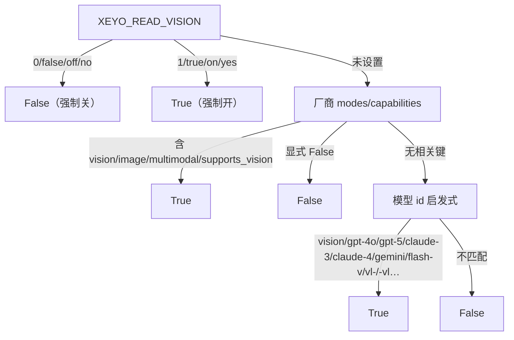
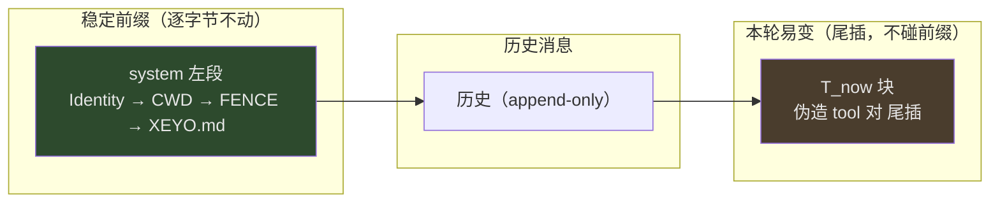
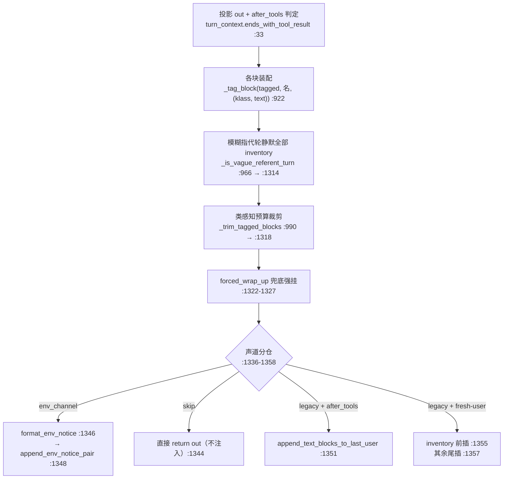
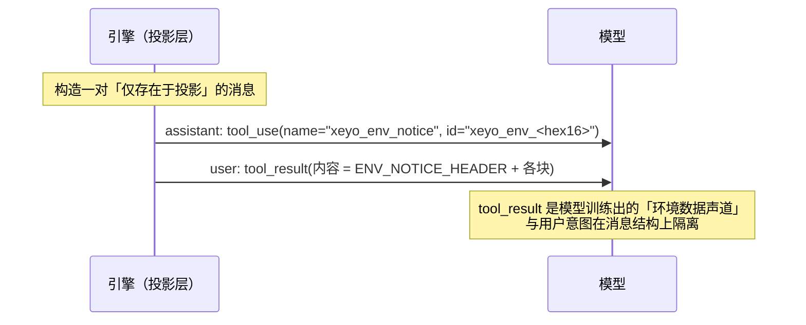

# XEYO 面试知识书 · 第二册 · 模型与上下文工程

> 覆盖系统：**S03 模型接入层与厂商适配**、**S04 System Prompt 装配**、**S05 T_now 易变上下文注入管线**
> 覆盖功能：**F015–F019、F042**
> 对应岗位能力：AG-02（LLM 调用与模型适配）、AG-03（Prompt 工程与上下文工程）
>
> **本册是全书最高价值的一册**——上下文工程是 Agent 岗位的核心区分点，而 XEYO 在这一层有非共识设计（伪造 tool 声道、块登记硬准入、零显式缓存标记）。所有数字均已用源码自验，**与项目既有叙述不一致处已标注 `⚠` 并给出纠正**。
> 全程未读 `docs/`。

---

## 目录

- [第 3 章 · S03 模型接入层与厂商适配](#第-3-章--s03-模型接入层与厂商适配)
- [第 4 章 · S04 System Prompt 装配](#第-4-章--s04-system-prompt-装配)
- [第 5 章 · S05 T_now 易变上下文注入管线](#第-5-章--s05-t_now-易变上下文注入管线)
- [章节末 · 功能分册（F015–F019 / F042）](#功能分册f015f019--f042)

---

# 第 3 章 · S03 模型接入层与厂商适配

## 3.1 定位

**厂商无关的 LLM 接入层**。目标：让 `query_loop` 完全不感知「用的是哪家模型、报文长什么样、流怎么切、思考态怎么回传」。所有厂商差异被收敛到一个抽象接口的内部实现里。

**为什么它是本册第一个讲**：上下文工程的上游是「报文契约」。不理解这一层，就无法解释后面 T_now 为什么执着于「前缀逐字节不动」。

## 3.2 抽象：一个方法，不是一套框架

```python
# python/model/client.py:9
class ModelClient(Protocol):
    def stream(
        self,
        messages: list[dict],
        tools: list[dict],
        abort: AbortController,
    ) -> AsyncIterator[ModelChunk]: ...
```

**抽象面就这一个方法**（`model/client.py:9-15`）。没有 `models()`、没有 `count_tokens()`、没有 `health()`。统一增量类型是 `ModelChunk`（`model/chunks.py:11`）。

**设计取舍（面试可直接讲）**：

| 决策 | 采用 | 理由 | 代价 |
| --- | --- | --- | --- |
| 接口宽度 | **单方法 `stream`** | 最小接口 = 最少的厂商分歧泄漏点 | 能力查询（模型列表/窗口/定价）无法放在接口里，只能另开模块 |
| 输入形态 | `list[dict]`（OpenAI 形） | 让「中立形」就是最普及的形 | Anthropic 侧必须做形变（见 §3.4），形变成本落在适配器 |
| 输出形态 | `AsyncIterator[ModelChunk]` | 流式是一等公民 | 非流式调用要自己收敛 |
| abort | **显式传入 `AbortController`** | 取消必须能穿透到 HTTP 层 | 每个实现都要自己检查 abort |

**为什么能力查询不在接口里**：因为能力（context window / 是否支持 vision / 定价）是**厂商元数据**，不是推理契约。XEYO 把它放在 `model/vendor_models.py`（从厂商 `/models` 拉取）与 `model/vision_capability.py`（判定），而不是塞进 `ModelClient`。这样换一家厂商不需要实现一堆「可选能力方法」。

## 3.3 四个 provider 与选择机制

| 实现 | 类 | 行号 | 说明 |
| --- | --- | --- | --- |
| DeepSeek | `DeepSeekModelClient` | `model/deepseek.py:54` | 原生 DeepSeek（含 `thinking` 字段） |
| Anthropic | `AnthropicModelClient` | `model/anthropic.py:470` | **原生 Messages API**（非兼容层） |
| OpenAI 兼容 | `OpenAICompatClient` | `model/openai_compat.py:125` | 覆盖 OpenAI / DeepSeek / 本地 llama.cpp 等 |
| Fake | `FakeModelClient` | `model/fake.py:14` | 测试与 e2e 用（含 echo 工具回环） |

**选择机制：`if/elif` 分支，不是注册表**（这一点容易被面试官追问）：

```python
# python/server/session_pool.py:431-463（实测）
if cfg.provider == "fake":
    model = FakeModelClient(); reg.register(EchoTool())
elif cfg.provider == "anthropic":
    model = AnthropicModelClient(api_key=..., base_url=..., model=..., thinking=..., ...)
else:
    model = OpenAICompatClient(api_key=..., provider=cfg.provider, ...)
```

同类分支在 `engine/query_engine.py` 的 `build_default_engine` 内（`FakeModelClient` 在 `:1256`、`AnthropicModelClient` 在 `:1264/:1280`、`OpenAICompatClient` 在 `:1290/:1319`）。

**那么 `PROVIDER_PRESETS` 是什么**（`model/openai_compat.py:357`）：

```python
PROVIDER_PRESETS: dict[str, dict[str, str]] = {
    "deepseek": {"base_url": "https://api.deepseek.com/v1", "label": "DeepSeek"},
    "openai":   {"base_url": "https://api.openai.com/v1",      "label": "OpenAI"},
    "anthropic":{"base_url": "https://api.anthropic.com",      "label": "Anthropic"},   # 只作名单登记
    "local":    { ... },   # 需 XEYO_ALLOW_LOCAL_MODEL=1 才放行
}
```

它**不是类注册表**，而是「base_url 解析表 + 支持的 provider 名单」。源码注释明确写了：「Claude：**不走本兼容客户端**，由 `model/anthropic.py` 讲 Messages API。此条目只作『支持的 provider 名单』与 base_url 解析的登记处。」

**⚠ 面试风险提示**：如果你在简历/面试里说「XEYO 有模型适配注册表，可插拔扩展」，那是**不准确的**——真实机制是硬编码 `if/elif` + base_url 预设表。正确的讲法是：「**新增厂商 = 加一个 elif 分支或复用 OpenAI 兼容客户端**；只有协议真正不兼容（如 Anthropic）才写原生适配器。这是有意的取舍：不为『可插拔』付出抽象成本，因为厂商数量是个位数。」

**安全细节（可讲）**：本地推理 provider（`local`）需要环境变量 `XEYO_ALLOW_LOCAL_MODEL=1` 才放行——防止「把请求发到本地地址」成为绕过厂商侧审计/计费的旁路。

## 3.4 为什么 Anthropic 必须写原生适配器

这是本册**最能体现工程深度**的一段。源码 docstring（`model/anthropic.py:1-22`）给了完整论证：

> Claude 的思考态（thinking）以 **content block + signature** 形式存在，签名是厂商不透明字节，回传时须逐块原样带回；OpenAI 报文没有承载签名的字段，兼容层必然把签名丢弃，下一轮即被厂商拒收。四家做 Claude 的实现（Roo/Cline/gptme/Helix）**无一走兼容层**，全部落原生消息格式。

**六条协议差异（`anthropic.py:10-18`，逐条可查）**：

| # | 差异 | 实现点 |
| --- | --- | --- |
| 1 | `system` 不在 messages 里，提到顶层 `system` 字段 | `_split_system` `:83`；`_build_body` `:572` |
| 2 | assistant 的工具调用是 content block `tool_use`，不是 `tool_calls` | `_blocks_to_anthropic` `:162` |
| 3 | `tool_result` 是 **user 消息里的 block**，且必须与它响应的 `tool_use` **在同一条消息序列内紧接着出现** | `_tool_result_content` `:118`；`normalize_messages_for_anthropic` `:251` |
| 4 | messages 必须严格 user/assistant 交替，相邻同角色消息须合并 | `_coalesce` `:231` |
| 5 | thinking block 带 `signature`，须逐块原样回传 | `_finalize_tool_block` `:433`；`_finish_pending_tool_bufs` `:452` |
| 6 | `thinking:{type:"enabled"}` 在 Claude 4.7+ 返回 400，须用 `adaptive`（配合 `output_config.effort`） | 见 docstring `:18`；body 构造 `_build_body` `:572` |

**第 3 条是最容易踩的坑**：OpenAI 协议里工具结果是独立的 `role=tool` 消息行；Anthropic 要求它必须是 **user 消息内的 block**，且**紧跟在对应的 tool_use 之后**。如果引擎把工具结果攒一批再发，Anthropic 侧会直接报结构错误。所以适配器必须做「重排 + 合并」（`normalize_messages_for_anthropic` `:251`）。

第 6 条是一条**厂商漂移**的证据：Claude 4.7+ 拒收 `thinking:{"type":"enabled"}`。这正好用来回答「你怎么应对厂商 API 变更」。

## 3.5 流式增量与工具参数拼接

统一逻辑在 `model/_openai_common.py`（Anthropic 侧是 `anthropic.py` 的对应实现）：

| 环节 | 符号 | 行号 | 说明 |
| --- | --- | --- | --- |
| HTTP 客户端复用 | `get_shared_httpx_client(timeout)` | `:39` | 按事件循环用 `WeakKeyDictionary` 共享；`limits(max_connections=50, max_keepalive=20)` |
| SSE 行解析 | `consume_sse_line_with_usage` | `:81` | 解析 `data:` 行并抽取 usage |
| 工具参数缓冲 | `tool_bufs: dict[int, dict]` | `:126-127` | key = tool_call **index**（不是 id！流式下 id 可能分片到达） |
| 闭合判定 | `try_finalize_tool_buf` | `:57` | `json.loads(buf["arguments"])` 成功即闭合，yield 完整 `ToolUse` |
| 防重复 emit | `_emitted` 标志 | `:63`、`:72` | 已闭合的 buffer 忽略后续增量 |
| 收尾兜底 | `finish_tool_bufs` | `:137` | 流结束时把未闭合的 buffer 尽力收敛 |
| 消息形变 | `normalize_messages_for_openai` | `:162` | 中立形 → OpenAI 形 |
| 工具 schema 形变 | `to_openai_tool` | `:309` | 内部 schema → OpenAI tools |

**为什么用 `index` 而不是 `id` 做 key**：流式协议里 `id` 字段可能只在第一个 delta 出现，后续参数 delta 只带 `index`。用 `id` 做 key 会在「参数分片」场景下丢数据。这是一个**必须读协议细节才能发现的坑**。

**「解析完就准入」**：`query_loop` 在流进行中一旦拿到完整 `ToolUse` 就立即 `_admit_tool_use`（`query_loop.py:1047`），并把 `ToolCallEvent` 推给 UI——**不等流结束**。这样 GUI 能在模型还在说话时就显示「正在调用工具」。

## 3.6 能力表与 vision 判定

### 3.6.1 厂商模型元数据（`model/vendor_models.py`）

**不是硬编码表，而是从厂商 `/models` 拉取后归一化**：源码注释明确「厂商为权威」（`vendor_models.py:1` 附近）。

| 步骤 | 符号 | 行号 |
| --- | --- | --- |
| HTTP 取回 | `_http_json(url, headers, timeout=12.0)` | `:144` |
| 拉取入口 | `fetch_vendor_models(...)` | `:162` |
| 载荷解析 | `parse_vendor_models_payload(payload, *, provider)` | `:124` |
| 归一化 | `normalize_vendor_model(row, *, provider, index)` | `:102` |
| 抽 context window | `_pick_context` | `:20` |
| 抽 max output | `_pick_max_output` | `:42` |
| 抽定价 | `_pick_pricing` | `:63` |
| 抽能力 modes | `_pick_modes(row, *, provider)` | `:71` |

归一化后的字段：`id / object / owned_by / created / label / context_length / max_output_tokens / pricing / modes / …`。

**设计取舍**：为什么不硬编码一张模型表？
> 因为模型版本更新速度快于发版周期。硬编码表意味着「厂商发了新模型，用户必须升级客户端才能用」。拉 `/models` 让能力自动跟进。代价是**依赖网络**——所以 `_http_json` 有 12 秒超时，且失败必须优雅降级（否则离线场景不可用）。

**运行期自愈**：`openai_compat.py` 里有 `context_limit_from_usage`（`:74`）与 `context_tokens_from_usage`（`:53`）。即使 `/models` 没给出窗口，也能**从真实 usage 里反推**（`:276`、`:290`、`:348` 三处赋值 `self.context_limit`）。这是一个「**元数据缺失时用实测兜底**」的设计。

### 3.6.2 vision 判定（`model/vision_capability.py`）

整个文件只有一个公开函数 `supports_vision_input`（`:15`），**三级判定**：



**证据**：`model/vision_capability.py:15-55`（全文件共 55 行）；三级判定各自区间 = env 强制 `:21-25`、厂商 modes `:27-35`、id 启发式 `:37-55`，其中 **markers 元组在 `:40-54`**、`return any(...)` 在 `:55`。

**为什么用「id 启发式」兜底**：因为 `/models` 不是所有厂商都返回能力位。启发式是**最后一层保险**，且顺序刻意放在最后——厂商权威优先，启发式只兜底。环境变量放在最前，用于「厂商说支持但实测失败」的现场排障。

## 3.7 超时、重试、HTTP 客户端

| 项 | 实现 | 行号 |
| --- | --- | --- |
| 客户端复用 | `get_shared_httpx_client(timeout)` | `_openai_common.py:39` |
| 连接池 | `limits(max_connections=50, max_keepalive=20)` | `:46` 附近 |
| DeepSeek 超时 | `120.0` | `deepseek.py:182`、`:184` |
| Anthropic 超时 | `120.0` | `anthropic.py:614`、`:616` |
| OpenAI 兼容超时 | `180.0` | `openai_compat.py:253`、`:255` |
| stdlib 回退 | `urlopen(req, timeout=120/180)` | `deepseek.py:236/297` |

**⚠ 明确结论：模型层本身没有自动重试循环，也没有 `max_retries`。** 全仓 grep 无 `max_retries`；模型层只做 `parse_retry_after` 读 `Retry-After` 头（供上层判断）。

**重试在哪里**：在**引擎层的 `query_loop`**（`query_loop.py:263/273/292/1243`，见第一册 §1.5）。这是一条清晰的**分层**：模型层负责「一次请求的正确性」，引擎层负责「失败后的策略」。

**⚠ 超时值不统一**（120 / 180）：三处硬编码，没有集中常量。这是一处**可提的改进点**（面试时可以主动说「我知道这里不统一，正确做法是收敛到配置」）——**主动披露小瑕疵比被追问出来强得多**。

## 3.8 ⚠ 缓存：全仓无显式 prompt/KV cache 标记

这是本册**必须纠正的一处认知**。实测两项：

```bash
$ grep -rn "cache_control" --include=*.py python/
./model/anthropic.py:308:	``cache_control`` 之类的厂商标注需透传。
```

**只有一个注释提到 `cache_control`，请求体构造里没有任何写入。** DeepSeek / OpenAI 兼容路径的 body 构造同样没有 cache 标记。

**唯一与缓存有关的是「回读统计」**：`anthropic.py:739` `_usage_to_openai_shape`：

```python
# Anthropic: input_tokens / output_tokens / cache_read_input_tokens / cache_creation_input_tokens
# OpenAI:    prompt_tokens / completion_tokens / prompt_tokens_details.cached_tokens
inp = _positive_int(usage.get("input_tokens")) or 0
read = _positive_int(usage.get("cache_read_input_tokens")) or 0
write = _positive_int(usage.get("cache_creation_input_tokens")) or 0
converted = {
    "prompt_tokens": inp + read + write,      # 注意：Anthropic 的 input_tokens 不含缓存部分
    "completion_tokens": out,
}
if read:
    converted["prompt_tokens_details"] = {"cached_tokens": read}
```

源码注释特别强调：「Anthropic 的 `input_tokens` **不含**缓存命中与缓存写入部分，故 `prompt_tokens` 应是三者之和，**否则面板输入会显著偏低**。」——**这是一个真实的计费口径陷阱**，直接决定成本面板是否可信。

**那么 XEYO 的缓存策略是什么**？答案是**「不靠标记，靠结构」**：



**核心论点**：KV 缓存命中靠的是「**前缀逐字节稳定**」，不是「显式打 cache 标记」。所以 XEYO 的全部上下文工程都在服务一件事——**任何易变内容都不得进入前缀**。这就是为什么：
- `system_prompt` 不注入 Date / Model / tool_names（见第 4 章）；
- 易变块一律走 T_now 尾插（见第 5 章）；
- `MEMORY.md` 索引**不在左段**（`system_prompt.py:6` 注释：「mutation 会弄废整段 KV 前缀，由 runtime 追加到投影 T_now 尾部」）。

**面试讲法与注意**：

> ✅ 正确讲法：「我们用**结构保证缓存命中**——system 前缀只放不变内容，所有易变内容尾插。厂商侧我们只**读** usage 里的缓存命中字段做成本归因，不显式打 cache 标记。」
> ❌ 错误讲法：「我们做了 prompt caching 优化，会主动打 cache_control 标记。」——**源码里没有**。

**追问预案**：那命中率多少？
> 项目内的探针脚本是 `python/scripts/kv_cache_probe.py`（见第九册 S43/F116）。具体数字需以该脚本产出的报告为准，**不要在面试里凭记忆报数**——口径（是否含 cache_creation、是否剔除首轮）会显著改变结论。

## 3.9 设计取舍汇总（含被否决方案）

| 决策点 | 采用 | 被否决 | 证据 |
| --- | --- | --- | --- |
| 抽象宽度 | 单方法 `stream` Protocol | 多方法能力接口 | `client.py:9-15` |
| provider 选择 | `if/elif` + base_url 预设表 | 类注册表 / entry point | `session_pool.py:431`；`openai_compat.py:357` |
| Anthropic | 原生 Messages API | 走 OpenAI 兼容层 | `anthropic.py:1-22`（含四家同行做法佐证） |
| 模型能力 | 拉厂商 `/models` | 硬编码模型表 | `vendor_models.py:1/162` |
| 能力缺失兜底 | usage 反推 + id 启发式 | 直接失败 | `openai_compat.py:74`；`vision_capability.py:50` |
| 缓存 | 结构保前缀 | 显式 cache 标记 | 全仓 grep `cache_control` 仅 1 条注释 |
| 重试 | 引擎层统一 | 模型层各自重试 | `query_loop.py:1243` |
| 本地模型 | 需 `XEYO_ALLOW_LOCAL_MODEL=1` | 默认放行 | `openai_compat.py` 预设注释 |

## 3.10 面试题 + 回答模板 + 追问

### Q1：多厂商模型适配你怎么设计的？

**回答模板**：
> 极简：一个 Protocol，一个方法。
> ```python
> class ModelClient(Protocol):
>     def stream(self, messages, tools, abort) -> AsyncIterator[ModelChunk]: ...
> ```
> 输入输出都用最普及的形态（OpenAI 的消息/工具形），**所有厂商差异压在实现内部**。四个实现：DeepSeek、Anthropic、OpenAI 兼容（一个客户端覆盖 OpenAI/DeepSeek/本地 llama.cpp）、Fake（测试）。
> provider 选择是 `if/elif` 分支（`session_pool.py:431`），不是注册表。这是刻意的——**厂商数量是个位数，为「可插拔」付抽象成本不划算**。新增一家通常只要复用 OpenAI 兼容客户端 + 加一条 base_url 预设。

**追问 1**：那 Anthropic 为什么不复用兼容客户端？
> 因为它有六条协议差异，其中一条是致命的：Claude 的思考态是 content block + **不透明签名**，回传必须逐块原样带回。OpenAI 报文**没有承载签名的字段**，兼容层必然丢签名，下一轮直接被厂商拒收。源码 docstring 里还写了一条同行证据：Roo/Cline/gptme/Helix 四家实现**无一走兼容层**。所以这不是「我们偏好原生」，而是「兼容层在协议上做不到」。

**追问 2**：那你怎么应对 Anthropic 后续的 API 变更？
> 举个真实例子：docstring 里记了「`thinking:{"type":"enabled"}` 在 Claude 4.7+ 返回 400，须用 `adaptive` 配合 `output_config.effort`」。也就是说厂商已经在漂移，我们的应对是把这类**版本相关差异集中在一个适配器文件里**，改一处就够；而不是散落在引擎各处。

### Q2：流式工具调用参数怎么拼？有什么坑？

**回答模板**：
> 按 **tool_call index** 分 buffer，每个 buffer 累积 `arguments` 字符串（`_openai_common.py:126`）。当 `json.loads(arguments)` 成功就认为参数闭合，yield 一个完整 `ToolUse`（`try_finalize_tool_buf` `:57`），并用 `_emitted` 标志防重复（`:63/:72`）。
> **坑在于 key 的选择**：必须用 `index` 不能用 `id`。因为流式协议里 `id` 可能只在第一个 delta 出现，后续只带 `index`；用 `id` 做 key 会在参数分片场景下丢数据。
> 另外我们**解析完就准入**——流还在进行时就 `_admit_tool_use` 并发 `ToolCallEvent`（`query_loop.py:1047`），这样 GUI 能在模型还在说话时就显示「正在调用工具」。

**追问**：如果模型输出的参数永远不是合法 JSON 呢？
> 有兜底 `finish_tool_bufs`（`:137`），流结束时把未闭合的 buffer 尽力收敛。但更本质的是：这属于「模型产出不符合协议」，最终会表现为工具执行失败（参数缺失 → 工具侧报错），错误以中性结果型措辞回灌给模型。**引擎不替模型修参数**——这是项目的注意力纪律。

### Q3：你们有做 prompt cache 优化吗？

**回答模板**（注意这是「否认式」回答，反而是加分项）：
> 我们不显式打缓存标记。源码里 `cache_control` 只出现在一条注释里，请求体构造中没有写入。
> 我们的做法是**用消息结构保证前缀稳定**：system 左段只放身份/环境常量/安全围栏，`Date`、`Model`、工具名清单**都不进左段**（`system_prompt.py:37` 的 docstring 明确写了「Date / Model 都不进左段：避免换日/换模型打爆 KV」）；所有易变内容全部走 T_now 尾插；连 `MEMORY.md` 索引都被专门移出左段，因为「mutation 会弄废整段 KV 前缀」。
> 厂商侧我们只**读** usage 里的缓存命中字段做成本归因（`anthropic.py:739`）。这里有个计费口径陷阱：Anthropic 的 `input_tokens` **不含**缓存命中与写入部分，必须三者相加才是真实输入，否则面板输入会显著偏低。

**追问**：不显式打标记，缓存真的会命中吗？
> 会，因为大多数厂商的自动前缀缓存（automatic prefix caching）是默认开启的，按 token 前缀匹配。我们要做的是「不破坏前缀」，而不是「请求厂商缓存」。**显式标记的收益在大多数场景下小于「保证前缀稳定」的收益**——因为一旦前缀被破坏，全量重算是 100% 的损失，而显式标记最多是策略微调。

## 3.11 源码证据清单

```
model/client.py:9-15                 ModelClient Protocol（唯一方法 stream）
model/chunks.py:11                   ModelChunk
model/deepseek.py:54                 DeepSeekModelClient
model/deepseek.py:144-145            thinking 字段构造
model/deepseek.py:182/184/236/297    超时 120
model/anthropic.py:1-22              原生适配论证（六条协议差异）
model/anthropic.py:83/162/231/251    形变（_split_system/_blocks_to_anthropic/_coalesce/normalize）
model/anthropic.py:433/452           thinking block 收敛
model/anthropic.py:470               AnthropicModelClient
model/anthropic.py:739               _usage_to_openai_shape（缓存命中回读）
model/openai_compat.py:53/74/276/290/348  窗口自愈
model/openai_compat.py:125           OpenAICompatClient
model/openai_compat.py:357           PROVIDER_PRESETS（非类注册表）
model/_openai_common.py:39           get_shared_httpx_client
model/_openai_common.py:57           try_finalize_tool_buf
model/_openai_common.py:81           consume_sse_line_with_usage
model/_openai_common.py:126-127      tool_bufs（按 index 分桶）
model/_openai_common.py:137          finish_tool_bufs
model/vendor_models.py:20/42/63/71/102/124/144/162 能力归一化与拉取
model/vision_capability.py:15-55     supports_vision_input 三级判定
model/fake.py:14                     FakeModelClient
server/session_pool.py:431-463       provider 选择分支
engine/query_engine.py:1256/1264/1290/1319  provider 选择分支（build_default_engine）
```

---

# 第 4 章 · S04 System Prompt 装配

## 4.1 定位

装配**稳定前缀**（左段）。它是「注意力纪律」最直接的落地点：左段只保留**身份、环境事实、安全围栏声明**，不写任何行为纪律。

模块 docstring（`prompt/system_prompt.py:1-11`）原文关键句：

> 左段顺序：Identity → env → FENCE → XEYO.md → append。
> 项目结构/依赖不自动注入：人写进 XEYO.md，需要时用工具现查。
> 记忆行为规则已下沉到各记忆工具的 description。
> MEMORY.md 索引**不在左段**（mutation 会弄废整段 KV 前缀），由 runtime 追加到投影 T_now 尾部。
> custom_system_prompt / append_system_prompt **只允许 append**，不得整段替换 default+instructions。
> **理念红线（2026-09-08 用户裁决）**：引擎不向模型注意力注入任何纪律/建议/劝导文本——行为约束一律由执行层（权限/路由/工具门）静默强制。

**这几句话本身就是面试答案**——它解释了「为什么这个 system prompt 这么短」。

## 4.2 左段结构（实测）

| 顺序 | 段 | 来源 | 行号 |
| --- | --- | --- | --- |
| 1 | `IDENTITY` | 常量 | `system_prompt.py:23` |
| 2 | `CWD: {cwd}` | 运行期 cwd（**侧聊跳过**） | `:37`（`get_default_system_prompt_parts`） |
| 3 | `FENCE_POLICY` | `prompt/fence.py:25` | 拼入点 `:37` |
| 4 | `# Instructions (XEYO.md)` | `memory/instruction.py::load_instruction_text` | `assemble_system_prompt_parts` `:132` |
| 5 | append 段 | `custom_system_prompt` / `append_system_prompt` | `:94`（`fetch_system_prompt_parts`） |

**`IDENTITY` 的实际内容**（`system_prompt.py:23-25`）：

```python
# 单一身份入口（中文主场景；GUI / CLI / side-chat / 子 agent 前缀共用）。
# 裁决 2：身份句不含行为要求（"回答简洁/需要时用工具"已删）。
IDENTITY = (
	"你是 XEYO，桌面与微信场景下的编程助手。"
)
```

**一句话，没有行为要求。** 注释还专门标注了「裁决 2：身份句不含行为要求」。

```python
def get_default_system_prompt_parts(*, cwd, model, tool_names, date_iso=None) -> list[str]:
    ...
    if side_mode():
        return [IDENTITY, FENCE_POLICY]          # 侧聊不注入 CWD
    return [IDENTITY, f"CWD: {cwd}", FENCE_POLICY]
```

**三个「不注入」的明确理由**（`:44-52` docstring）：

| 不注入 | 理由（源码原文） |
| --- | --- |
| `Date` | 「避免换日打爆 KV；需要时刻时用 `getTime`」 |
| `Model` | 「避免换模型打爆 KV」（但保留在签名与 memo 键中做兼容） |
| 工具名清单 | 「以 API `tools` schemas 为准」 |
| `OS` 等系统字段 | `get_system_context()` `:79`：「保留 API；组装时不再注入 OS 等字段（避免无用字节）」 |
| 侧聊的 `CWD` | 「侧聊不绑定工作区叙事，路径由工具按需现查」 |

**已删除的段落**（`:44` docstring 明确记载）：

> `TOOL_POLICY` / `SUBAGENT_APPEND` 已删（2026-09-08 理念裁决 A1/A2）：行为约束由执行层（权限/路由/工具门）静默强制，不再写进注意力。

**这是一条极强的面试素材**：讲「我删掉了什么、为什么删」比讲「我加了什么」更能证明判断力。

## 4.3 会话级 memo

`PromptAssembler`（`prompt/assembler.py:21`）缓存整段 system 的产物：

| 机制 | 符号 | 行号 |
| --- | --- | --- |
| 缓存容器 | `self._system_memo: dict[tuple, tuple[str, list[dict]]]` | `:34` |
| 缓存键构造 | `_memo_key(...)` | `:41` |
| 命中复用 | `hit = self._system_memo.get(key)` | `:160` |
| 写入 | `self._system_memo[key] = result` | `:191` |
| 装配入口 | `build_system_parts` | `:100` |
| 对外 | `build_system` | `:195` |
| 消息拼接 | `build(system, history)` | `:36` |

**memo 键的组成**（`:41` `_memo_key` 签名附近）：`cwd` / `model` / 工具名集合 / `custom` / `append` / `side` / `date` / `instr_sig`（指令文件签名）。

**⚠ 这里有一个精确的取舍值得讲**：`model` 和 `date` **不写进正文**（避免打爆 KV），但**仍然进 memo 键**。理由是：不写进正文是为了前缀稳定；进 memo 键是为了兼容调用方语义（如果模型变了，理论上 system 可能不同）。**结果是一个「保守的键」**——它比实际内容更敏感，命中的条件更严。选择「键更敏感」而不是「键更宽松」，是**正确性优先于命中率**的取向。

## 4.4 设计取舍

| 决策点 | 采用 | 被否决 | 证据 / 理由 |
| --- | --- | --- | --- |
| 左段内容 | 身份 + 环境 + 围栏 | 行为纪律（工具策略/子代理附录） | 2026-09-08 裁决 A1/A2，`:44` docstring |
| 易变字段 | 全部不进左段 | 注入 Date/Model/工具名 | `:44-52` |
| 项目结构 | 人不写就不注入，模型现查 | 自动扫描注入 | 模块 docstring `:4` |
| 记忆规则 | 下沉到工具 description | 写进 system | 模块 docstring `:5` |
| 用户自定义 | **只能 append** | 允许整段替换 | 模块 docstring `:7`；`fetch_system_prompt_parts` `:94` |
| 索引位置 | T_now 尾部 | 左段 | 模块 docstring `:6` |

**「只能 append」这条最值得讲**：它防止用户用一行自定义 prompt 把默认安全围栏（`FENCE_POLICY`）整个顶掉。**默认安全配置不可被配置覆盖**——这是一个安全设计原则，不是产品限制。

## 4.5 面试题 + 回答模板 + 追问

### Q1：你的 system prompt 里写了什么？

**回答模板**（用「极短」做反差）：
> 很短，只有一句身份 + 一行环境 + 一段安全围栏声明。
> 身份是「你是 XEYO，桌面与微信场景下的编程助手」——**就这一句，没有任何行为要求**。我们在 2026-09-08 做过一次理念裁决，把 `TOOL_POLICY`（工具使用策略）和 `SUBAGENT_APPEND`（子代理附录）**整段删掉了**，理由是：行为约束应该由执行层（权限三态、工具路由、写作用域）静默强制，而不是写进模型的注意力。
> 另外 `Date`、`Model`、OS 字段、工具名清单**都不进左段**。理由有三层：① 避免换日/换模型打爆 KV 前缀；② 工具名清单以 API 的 `tools` schemas 为准，重复一遍是冗余；③ 要时间就调 `getTime` 工具，不需要「缓存」一个会过期的值。

**追问 1**：不写工具策略，模型怎么知道该用哪个工具？
> 靠两点：① **工具的 `description`**——这是最接近使用场景的地方，而不是「在 system 里概括一遍」；② **T_now 尾插**——如果本轮有特定模式（Ask/Plan、收尾窗、多代理），会以「本轮合同」的形式尾插（见第 5 章）。
> 核心理由是**注意力分区**：system 是「我永远是谁」，T_now 是「我这一轮处于什么状态」。把会变的东西写进不会变的地方，等于每轮都在污染前缀。

**追问 2**：那你怎么防止用户在自定义 prompt 里把安全围栏顶掉？
> 自定义**只允许 append，不允许替换**（模块 docstring 明确写了，实现上 `custom_system_prompt` / `append_system_prompt` 拼在默认段之后）。所以默认段永远在。这是「默认安全不可被配置覆盖」的原则落地。

### Q2：为什么 memory 的索引不放进 system prompt？

**回答模板**：
> 因为它会 mutation。`MEMORY.md` 索引随记忆增删变化，如果放进左段，每次变化都会**整段 KV 前缀失效**——不是「这一行变了」，而是「从这一行往后全部重算」。所以它被专门挪到投影的 T_now 尾部（`system_prompt.py:6` 注释）。
> 而且更根本的是：**记忆索引现在在生产环境是恒关的**（`query_loop.py:355` `_memory_index_live_enabled` 硬编码返回 `False`）。这里有过一次事故 `sess_mtiche8l`——弱模型把索引条目当成了任务对象，于是我们把常驻注入退役了，只保留 `project_for_model` 里的路径供脚本和评测用。

**追问**：那记忆系统现在怎么工作？
> 靠模型**显式调 `Memory` 工具**读写，而不是自动注入（`engine/query_loop.py:355`；`memory/memory_switches.py:63`）。这是一个「**从隐式注入退回到显式工具**」的决策——代价是模型需要主动查，收益是消除了弱模型误读索引这类系统性风险。

---

# 第 5 章 · S05 T_now 易变上下文注入管线

> **本册核心章。** 这一章讲的是 XEYO 最有辨识度的设计：**把所有「每轮可能变化」的模型可见内容，收进一个受硬预算与硬准入约束的注入管线，并用伪造 tool 对承载它。**

## 5.1 定位

`prompt/pre_llm_inject.py`。职责：在**每次 LLM 请求前**，把当轮需要模型知道的易变信息（续写指令、模式合同、预算状态、事件通知、库存指针…）装配成块，按类别做预算裁剪，再按选定**声道**放进请求——而**绝不触碰稳定前缀**。

**为什么需要它**：Agent 的上下文有两类内容——不变的和变的。如果都塞进 system prompt，每轮都全量重算；如果都塞进历史消息，会永久污染记录。T_now 是第三条路：**投影-only**。

## 5.2 块登记表（硬准入）

`T_NOW_BLOCK_REGISTRY`（`pre_llm_inject.py:828-909`）——**实测 20 块**，每块一条 `{klass, why}`：

| # | 块名 | 类别 | 为什么必须在上下文（`why` 原文摘录） |
| --- | --- | --- | --- |
| 1 | `continue` | directive | 工具续写轮无此块模型把 tool_result 当终点，不回用户问题 |
| 2 | `mode_instructions` | directive | Ask/Plan/批准计划是本轮行为模式合同，决定能否写盘 |
| 3 | `wrap_up` | directive | 收尾窗引导：配额内可落盘/验证但不得开新探索；缺口清单来自引擎 stat |
| 4 | `runtime_budget` | directive | 预算透明：模型需知剩余额度以决定收敛节奏 |
| 5 | `budget_mirror` | directive | 死线会话每轮稳态预算/时间镜像；正常会话零注入 |
| 6 | `multi_agent_hint` | directive | 多代理分解/汇总的协作合同，缺了会单干或重复汇总 |
| 7 | `repeat_guard` | directive | 轮内防复读提醒（引擎 `clear_advice` 逐轮重置） |
| 8 | `nested_instructions` | inventory | 子目录规则按需加载；限窗注入，滚出尾窗静默 |
| 9 | `compact` | directive | 输出/写码压缩开关生效的统一行为规则 |
| 10 | `mcp_required_warn` | event | required MCP server 启动失败的可见警告（fail-visible） |
| 11 | `reconcile_events` | event | 工具面/技能目录变更，**consume 语义——静默即永久丢失** |
| 12 | `peer_presence` | event | 多会话交叉活动提醒，冲突预防（drain 队列） |
| 13 | `file_conflict` | event | 触碰文件被其他会话写入——静默即丢，覆盖风险 |
| 14 | `browser_preview` | inventory | 用户预览页 URL：读页面正文的必要指针 |
| 15 | `runtime_mode_snapshot` | directive | 审批模式活状态（supersedes）；**真门禁在 permissions 层** |
| 16 | `agent_settlement` | event | 子代理结算通知，drain 语义——静默即永久丢失 |
| 17 | `goal` | directive | 仅 blocked/pending_complete 注入：恢复执行/完成确认的锚 |
| 18 | `resume_directive` | event | 续跑富化指令投影-only 送达：落库只存用户真实文本 |
| 19 | `pending_jobs` | directive | job 完成补投：一次性待领信息，模型不读则任务结果不可见 |
| 20 | `skill_preinvoke` | directive | 用户 `/name` 直呼技能的宿主确定性加载 |

**类别分布**：directive 12 · inventory 2 · event 6。

**三类语义（这是本册最关键的抽象）**：

| 类别 | 语义 | 静默代价 | 预算待遇 |
| --- | --- | --- | --- |
| `directive` | 本轮的**行为合同**（模式/预算/收尾） | 高（模型不知道合同） | 构造处各自有界（plan ≤4k、reasoning ≤600）→ **全保** |
| `event` | **一次性事件**（结算、变更、冲突） | **致命：静默即永久丢失**（consume 已清空） | **全保** |
| `inventory` | **参考数据**（目录、索引、URL） | 低（可重查/可重推） | 受双闸：自身配额 ∩ (总预算 − 指令已用) |

**这张表本身就是面试答案**：它回答「你怎么决定什么该进上下文」——**先按「静默的代价」分级，再按级别决定预算待遇**。事件类因为「丢了就没了」所以永不裁剪；库存类因为「可以重查」所以最先被裁。

## 5.3 装配管线（6 步）

主函数 `run_pre_llm_inject`（`:1030`）。实测流程：



| 步 | 动作 | 符号 | 行号 |
| --- | --- | --- | --- |
| 1 | 投影 + `after_tools` 判定 | `ends_with_tool_result` | `turn_context.py:33` |
| 2 | 块装配（**唯一入口**） | `_tag_block(tagged, 名, block)` | `:922` |
| 3 | 模糊指代轮静默 inventory | `_is_vague_referent_turn` | `:966` → 应用 `:1314` |
| 4 | 类感知预算裁剪 | `_trim_tagged_blocks(tagged, total=6000, inventory_max=2500)` | `:990` → `:1318` |
| 5 | wrap_up 兜底强挂（去重） | — | `:1322-1327` |
| 6 | 声道分仓 | `resolve_t_now_strategy` / `format_env_notice` / `append_env_notice_pair` | `:1336`/`:1346`/`:1348` |

**第 2 步的工程价值**：所有块**必须**经 `_tag_block` 装配（裸 `tagged.append(` 在本文件被禁止，由测试断言）。`_tag_block` 做两件事：① 把**登记名写进代码**（成为真实函数参数，改名即测试红）；② 应用块级旁路（`XEYO_T_NOW_SKIP`）。

**第 3 步的语义**（`:1312-1315` 注释）：模糊指代轮（用户说「那个呢」「继续」这类无实体指代）**静默全部 inventory**。理由：指代轮没有新实体，库存数据只会稀释注意力。**但 directive 与 event 绝不静默**——注释写得很硬：「notices / settlements / reconcile 有 drain 语义，静默即永久丢失」。

## 5.4 三档声道策略

策略常量（`t_now_strategy.py:29-33`）：`env_channel`（默认）/ `legacy` / `skip`（内部档）/ `prefill`（预留）。

**优先级**（`t_now_strategy.py:54-62`）：会话/请求显式设置（`set_t_now_strategy`）> 环境变量 `XEYO_T_NOW_STRATEGY` > 默认 `env_channel`。

### 5.4.1 `env_channel`（默认）——伪造 tool 对



| 环节 | 符号 | 行号 |
| --- | --- | --- |
| 伪对工具名 | `ENV_TOOL_NAME = "xeyo_env_notice"` | `t_now_strategy.py:110` |
| call_id 生成 | `new_env_tool_call_id()` → `f"xeyo_env_{uuid4().hex[:16]}"` | `:114-115` |
| 环境头 | `ENV_NOTICE_HEADER` | `:122-125` |
| 正文组装 | `format_env_notice(blocks)` | `:128-133` |
| 伪对插入 | `append_env_notice_pair(out, env_text)` | `turn_context.py:115`；调用点 `pre_llm_inject.py:1348` |

**环境头原文**（`:122-125`）：

```
[system-environment]（XEYO 运行环境注入 — background only，非用户消息）
以下是引擎注入的状态通知与背景信息。
```

**注意它「不写什么」**：注释 `:118-121` 明确记载：「只做定义式来源声明——声明『这是什么、从哪来』（信息），**不写『按其中约束处理』类抬格指令**（那会把状态通报抬成必须服从的约束）。契约测试断言：不含『继续/按其中约束』等行为引导词。」

**这是「信息 vs 导演」这条铁律最锋利的一次落地**：连「请按以下内容处理」这种看似无害的话都被明确禁止，因为它会把「状态通知」偷换成「必须服从的指令」。**契约测试直接断言不存在这些词**——把理念变成可执行的门禁。

**为什么用 tool_result 声道**（`t_now_strategy.py:6-8` docstring）：

> tool_result 是模型训练出来的「环境数据声道」——注入内容不再与用户意图同层（**根治说话人混淆**），也不再有"挂在用户话里"的可被误读面。

**同时它还有一个性质**：伪对**不注册进 `tools` 数组**（`:108-109` 注释：「**不注册进 tools 数组**（schemas 会话内冻结红线不受影响）；OpenAI 兼容厂商不校验历史 tool 名归属」）。也就是说——**它不破坏工具面冻结**。

### 5.4.2 ⚠ `skip` 而非 `legacy`：一次必须纠正的认知

**这一条与你项目里既有叙述（以及 AGENTS.md）不一致，务必按源码纠正。**

源码（`t_now_strategy.py:9-15` docstring）原文：

> - `legacy`：原行为——块以文本追加进末条 user（bg_wrap 身份标记 + 分隔符）。**仅作审计对照/显式评测档**（`XEYO_T_NOW_STRATEGY=legacy` 或 `set_t_now_strategy`），**不再充当任何自动回退档**——引擎文本进用户角色正是 L2（2026-09-09）要消灭的说话人混淆源。
> - `skip`：内部档——本轮不注入任何 T_now 块。**env_channel 被厂商以结构类 4xx 拒绝（未吐任何 chunk）时回落到这里**：宁缺毋滥，不把引擎文本伪装成用户消息。执行层硬约束（预算/回合/wrap 门）不依赖提示文本。

实现（`:65-79`）：

```python
def resolve_t_now_strategy(provider: str = "", model: str = "") -> str:
    s = t_now_strategy()
    if s == STRATEGY_PREFILL:
        s = STRATEGY_ENV_CHANNEL
    if s == STRATEGY_ENV_CHANNEL and env_channel_unsupported(env_unsupported_key(provider, model)):
        return STRATEGY_SKIP          # ← 注意：是 skip，不是 legacy
    return s
```

而 `skip` 在装配尾部的行为是**直接返回不注入**（`pre_llm_inject.py:1340-1344`）：

```python
if strategy == STRATEGY_SKIP:
    # L2（2026-09-09）：厂商拒绝伪造 tool 对时本轮不注入，绝不落回
    # legacy 用户尾插（引擎文本进用户角色=说话人混淆源）。执行层
    # 硬约束（预算/回合/wrap 门）不依赖提示文本。
    return out
```

**同时要注意状态码集合的差异**：`ENV_FALLBACK_STATUS = frozenset({400, 404, 405, 413, 415, 422})`（`:87`）——**含 405**（Method Not Allowed），而 AGENTS.md 记载的是 `{400, 404, 413, 415, 422}`。源码注释解释了为什么排除 402/429/5xx：「这些与消息结构无关，回退只会掩盖真实原因」。

| 项 | 既有叙述/AGENTS.md | 源码实测 | 结论 |
| --- | --- | --- | --- |
| 4xx 后回退到 | `legacy`（重建重试） | **`skip`（本轮不注入）** | ⚠ **叙述已过期**，按源码为准 |
| 回退状态码集合 | 400/404/413/415/422 | **400/404/405/413/415/422（多 405）** | ⚠ 补 405 |
| `legacy` 的角色 | 「回退档」 | **仅显式评测/审计对照档** | ⚠ 不再是回退档 |
| 备忘持久性 | 「进程级备忘」 | 进程级 `set`，**重启即重新尝试**（`:82` 注释） | 一致 |

**面试讲法（这段讲好了是加分项）**：

> 我们最初设计的是「env_channel 被拒 → 自动回退 legacy」。后来放弃了自动回退，改成 **skip**。
> 理由很直接：legacy 的本质是「把引擎文本伪装成用户消息尾插」——而这正是我们整个上下文工程要消灭的东西（说话人混淆）。**如果厂商拒绝我们的结构，正确的反应是「这轮不注入」，而不是「退回一个我们已知有缺陷的形态」。** 我们的执行层硬约束（预算、回合上限、收尾门）本来就不依赖提示文本，所以 skip 是安全的。
> legacy 还留着，但只作为**显式评测/审计对照档**——用来做 A/B 证明 env_channel 更好。

**这段回答的杀伤力在于**：它展示了「**不为兼容性牺牲设计原则**」的判断，而且给出了「为什么 skip 是安全的」的论证（执行层不依赖提示）。多数候选人会答「我们会做优雅降级」——而这里答的是「**降级到哪一层要想清楚**」。

### 5.4.3 备忘机制（进程级）

| 符号 | 行号 | 说明 |
| --- | --- | --- |
| `_env_unsupported: set[str]` | `:83` | 模块级集合 |
| `ENV_FALLBACK_STATUS` | `:87` | 结构类 4xx 集合 |
| `env_unsupported_key(provider, model)` | `:90` | 键 = `"provider:model"`（小写） |
| `mark_env_channel_unsupported(key)` | `:94` | 标记 |
| `env_channel_unsupported(key)` | `:99` | 查询 |
| `reset_env_unsupported_for_test()` | `:103` | 测试复位 |

**⚠ 这是一个「进程级、非持久化」的备忘**（`:82` 注释：「非持久化——重启即重新尝试」）。**这个取舍是对的**：厂商可能修了这个限制，重启重试是自我修复；代价是每次重启都要多付一次失败请求。**键是 `provider:model`**——比「全局一个开关」精确得多。

## 5.5 硬准入执法与 ⚠ 数值分歧（C-01 已定论）

### 5.5.1 执法机制

契约测试：`python/tests/test_t_now_block_registry.py`。四个断言：

| 测试 | 断言 |
| --- | --- |
| `test_hard_cap_not_exceeded` | `len(T_NOW_BLOCK_REGISTRY) <= T_NOW_BLOCK_HARD_CAP` |
| `test_every_append_site_is_marked_and_registered` | 每个 `_tag_block(tagged, "名", …)` 的「名」必须在登记表；且无重复标记 |
| `test_registry_has_no_dead_entries` | 登记表里**不得有**无装配点的死条目 |
| `test_registry_entries_are_complete` | `klass ∈ {directive, event, inventory}`；`why` 长度 ≥ 8；且**不得以「待定/TODO/应该/可能」开头** |

另外测试还用正则断言源码里**不存在裸** `tagged.append(`（除 `_tag_block` 助手本体）——把「唯一入口」变成机器执法。

**这一整套是「双向核对」**：既防「加了块没登记」，也防「登记了块但代码删了」（腐烂检测）。**同时用「禁用空话句式」防止 `why` 变成形式主义**。这套机制本身就是一个很好的面试话题。

### 5.5.2 ⚠ C-01 定论：cap 21 / 存量 20 / AGENTS 写 20

| 来源 | 数值 |
| --- | --- |
| `T_NOW_BLOCK_HARD_CAP`（`pre_llm_inject.py:826`） | **21** |
| `T_NOW_BLOCK_REGISTRY` 实际条目（`:828-909`） | **20** |
| 同处注释声明（`:820`） | 「登记数硬顶 = **当前存量**（加一必须删一…）」 |
| 执法测试（`test_t_now_block_registry.py`） | `len(registry) <= HARD_CAP`（即 **≤**，不是 ==） |
| `AGENTS.md` T_now 章节 | 「登记数**硬顶 20**」 |
| 常量行内注释 | 「23→21：裁决 5 删除 `stale_xeyo_md` / `nested_change` 两块」 |

**定论**：
1. **执法是 `≤`**，所以「硬顶 = 存量」的自述**不成立**——当前有 **1 个空位**（21 − 20）。
2. `AGENTS.md` 写的「硬顶 20」对应的是**存量**而非常量。
3. **对外表述建议**：「**当前登记 20 块，硬顶常量 21，执法为 ≤**；按设计意图应当加一删一」。**不要只说「硬顶 20」**——如果面试官看不到源码，这是准确的；但如果被追问细节，「常量 21」与「20」不一致会被抓。

## 5.6 预算与裁剪

| 常量 | 值 | 行号 | 说明 |
| --- | --- | --- | --- |
| `T_NOW_TOTAL_BUDGET` | 6_000 | `:812` | 总预算 |
| `T_NOW_INVENTORY_MAX` | 2_500 | `:813` | inventory 类自身配额 |
| `NESTED_MAX_CHARS` | — | `:667`（`_format_nested_block` 参数） | 嵌套指令限窗 |

**裁剪规则**（`:809-811` 注释原文）：

> F1 真硬顶：覆盖**全部**块（原 bypass 组取消）。
> directive/event 由构造处各自有界（plan ≤4k、reasoning ≤600 等），**全保**；
> inventory 受双闸：自身配额 与 (总预算 − 指令已用) **取小**。

**⚠ 注意历史遗留**：`_trim_blocks_to_budget`（`:725`）是**旧实现**，已被 `_trim_tagged_blocks`（`:990`）取代。如果面试时被问「裁剪函数叫什么」，答 `_trim_tagged_blocks`。

## 5.7 消融开关（可讲性高）

`XEYO_T_NOW_SKIP="a,b"`（`_SKIP_ENV`，`:914`；`_skipped_blocks()`，`:917`）——名单内的块本轮不注入，用于 **A/B 消融**。

**⚠ 源码给出了明确警告**（`:911-913` 注释）：

> 消融用途见 `evals/block_ablation.py`；注意 **event 类（drain 语义）被跳过即永久丢失**（consume 已清空），消融跑分可接受，生产应急慎用。

**这条注释极有价值**：它说明团队**知道**自己的消融工具有破坏性，并**把它写进了代码**而不是留在某人的脑子里。这是「实验工具的边界要被显式声明」的工程习惯。

例：`wrap_up` 块的兜底强挂也遵守 skip 名单（`:1324`），注释解释「否则消融测不到该块缺席」——**消融必须能真正消掉**，否则实验无效。

## 5.8 面试题 + 回答模板 + 追问

### Q1：你的上下文工程核心是什么？

**回答模板**（这是本册的"主答案"，建议背下结构）：
> 三句话：**静态的前缀只放不变的，易变的全部尾插，注入内容有硬预算和硬准入。**
>
> **第一，「前缀逐字节不动」。** system 左段只放身份、cwd、安全围栏和 XEYO.md 指令——连 `Date`、`Model`、工具名清单都不放，就是为了不破坏 KV 前缀。
>
> **第二，易变内容走一条专门的注入管线（T_now）。** 它有 20 个登记块，按三类语义分级：`directive` 是本轮行为合同、`event` 是一次性事件、`inventory` 是参考数据。分级决定了预算待遇——**事件类永不裁剪**，因为静默即永久丢失；**库存类最先被裁**，因为可以重查。
>
> **第三，注入的承载形态是「伪造的 tool 对」。** 引擎在投影里插一对 `assistant(tool_use: xeyo_env_notice) → user(tool_result)`，把注入内容放进 tool_result。**tool_result 是模型训练出的「环境数据声道」**，这样注入内容与用户意图在**消息结构**上隔离，根治说话人混淆。而且这对消息**不进 tools 数组**，所以不破坏工具面冻结。

**追问 1**：为什么要「伪造」消息？直接拼进用户消息不行吗？
> 直接拼进用户消息就是 `legacy` 档——引擎文本进入 user 角色，模型会把「引擎在通报状态」误读成「用户在要求什么」。我们把它列为 L2 级要消灭的问题（说话人混淆）。
> 更关键的一点：**提示写在哪一层，决定模型把它当什么**。tool_result 在训练分布里就是「环境返回的数据」，不是「要走的人说的话」。所以这不是 trick，是**语义对齐**。

**追问 2**：那如果厂商不接受这种消息结构呢？
> 厂商以结构类 4xx 拒绝（未吐任何 chunk）时，我们标记这个 `provider:model` 不支持，**本轮直接不注入**（`skip`），而不是退回 legacy。因为 legacy 恰恰是我们已知有缺陷的形态——**为了兼容性去退回一个有设计缺陷的路径，是错的**。
> 之所以 `skip` 是安全的，是因为我们的**执行层硬约束（预算、回合上限、收尾门）不依赖提示文本**——门禁是代码强制的，不是"告诉模型别这么做"。
> 备忘是进程级的，不持久化，重启会重新尝试——因为厂商可能修了这个限制。

**追问 3**：加一个新的 T_now 块需要做什么？
> 四步，而且有机器执法：① 在 `run_pre_llm_inject` 里加装配点，**必须**走 `_tag_block(tagged, "名", …)`（裸 append 被测试禁止）；② 在 `T_NOW_BLOCK_REGISTRY` 加一行，写 `klass` 和 `why`；③ 如果超硬顶，**先删一个旧块**或显式调高上限并在 commit message 里给预算不破的理由；④ **必须答出 `why`**——「为什么必须在上下文」，答不出就先问「能不能不进上下文」。
> 契约测试会双向核对：既查「有装配点没登记」，也查「登记了但装配点没了」（腐烂检测）。而且测试**禁止 `why` 以「待定/TODO/应该/可能」开头**——防止登记表变成形式主义。

**追问 4**：你怎么验证这些块真的有用？
> 有块级消融开关 `XEYO_T_NOW_SKIP`，配合 `evals/block_ablation.py` 做 A/B。源码里也明确标注了风险：**event 类被跳过就是永久丢失**（consume 语义），所以消融跑分可以接受，生产应急要慎用。另外消融要真的能消掉——连 `wrap_up` 的兜底强挂都遵守 skip 名单，否则实验测不到「该块缺席」的效果。

### Q2：T_now 和 ReAct 的「思考」是什么关系？

**回答模板**：
> 它们是两层，不冲突。ReAct 的思考是**模型自己产生的内容**（我们的 `ReasoningDelta` / `AssistantDelta` 两条 delta 通道承载）；T_now 是**引擎注入给模型的环境状态**。
> 分野很清楚：**模型产出的走 assistant 角色，引擎注入的走 tool_result 声道**。所以模型永远不会把自己的思考误当成引擎的状态通报，也不会把引擎的状态当成自己的推理结果。

## 5.9 源码证据清单

```
prompt/pre_llm_inject.py:812          T_NOW_TOTAL_BUDGET = 6000
prompt/pre_llm_inject.py:813          T_NOW_INVENTORY_MAX = 2500
prompt/pre_llm_inject.py:826          T_NOW_BLOCK_HARD_CAP = 21
prompt/pre_llm_inject.py:828-909      T_NOW_BLOCK_REGISTRY（20 块）
prompt/pre_llm_inject.py:914/917       XEYO_T_NOW_SKIP / _skipped_blocks
prompt/pre_llm_inject.py:922          _tag_block（唯一装配入口）
prompt/pre_llm_inject.py:966          _is_vague_referent_turn
prompt/pre_llm_inject.py:990          _trim_tagged_blocks
prompt/pre_llm_inject.py:1030         run_pre_llm_inject
prompt/pre_llm_inject.py:1314         模糊指代轮静默 inventory
prompt/pre_llm_inject.py:1318         类感知裁剪
prompt/pre_llm_inject.py:1322-1327    wrap_up 兜底强挂
prompt/pre_llm_inject.py:1336-1358    声道分仓（含 skip 短路 :1344）
prompt/t_now_strategy.py:29-33        四档策略常量
prompt/t_now_strategy.py:54-62        策略优先级
prompt/t_now_strategy.py:65-79        resolve_t_now_strategy（4xx → skip）
prompt/t_now_strategy.py:83/87/90/94/99/103  备忘集合 / 状态码 / 键 / 标记 / 查询 / 复位
prompt/t_now_strategy.py:110/114/115/122/128  ENV_TOOL_NAME / call_id / 环境头 / format
prompt/turn_context.py:33             ends_with_tool_result
prompt/turn_context.py:51/82/115/163  append/prepend/伪对/model_blocks
tests/test_t_now_block_registry.py:51/61/72/78  四条执法断言
```

---

# 功能分册（F015–F019 / F042）

> 按功能模板（目标 → 调用链 → 契约 → 配置 → 异常 → 性能 → 测试 → 亮点 → 面试问法 → 证据）精简成表 + 重点展开。

| 编号 | 功能 | 所属 | 目标 | 调用链（行号） | 配置 | 异常路径 | 测试 | 证据 |
| --- | --- | --- | --- | --- | --- | --- | --- | --- |
| **F015** | 厂商模型列表与能力归一 | S03 | 拉 `/models` 得窗口/定价/modes | `vendor_models.py:162` `fetch_vendor_models` → `:144` `_http_json` → `:124` `parse_vendor_models_payload` → `:102` `normalize_vendor_model`（`:20/42/63/71` 各 `_pick_*`） | `_http_json` timeout 12s | 网络失败 → 降级（不阻塞会话）；窗口缺失 → usage 反推（`openai_compat.py:74/276/290/348`） | — | `vendor_models.py:20-162` |
| **F016** | SSE 流式增量与工具参数拼接 | S03 | delta 累积成完整调用 | `_openai_common.py:81` `consume_sse_line_with_usage` → `:126` `tool_bufs` 累积 → `:57` `try_finalize_tool_buf` → `:137` `finish_tool_bufs` | — | 参数非合法 JSON → `finish_tool_bufs` 兜底；重复 emit → `_emitted` 标志 | — | `_openai_common.py:57/81/126/137`；`anthropic.py:329/433/452` |
| **F017** | 多模态能力判定 | S03/S42 | 决定是否可传图 | `vision_capability.py:15` `supports_vision_input` 三级判定 | `XEYO_READ_VISION=0/1` 强制 | 全不命中 → False（保守） | — | `vision_capability.py:15-55`（env `:21-25` / modes `:27-35` / id 启发式 `:37-55`） |
| **F018** | system prompt 三段装配 + memo | S04 | 稳定前缀 | `system_prompt.py:37` `get_default_system_prompt_parts` → `:94` `fetch_system_prompt_parts` → `:192` `assemble_system_prompt`；`assembler.py:100` `build_system_parts` → `:41` `_memo_key` → `:160` 命中 / `:191` 写入 | `custom_system_prompt` / `append_system_prompt`（只允许 append） | 指令文件读失败 → 空串（`system_prompt.py:84` `_load_instructions` try/except） | — | `system_prompt.py:23/29/37/94/132/192`；`assembler.py:21/34/41/100/160/191/195` |
| **F019** | T_now 注入（20 块/预算/声道） | S05 | 易变内容尾插 | 见第 5 章 §5.3 | `XEYO_T_NOW_STRATEGY`；`XEYO_T_NOW_SKIP`；`T_NOW_TOTAL_BUDGET=6000`；`T_NOW_INVENTORY_MAX=2500` | 厂商 4xx → skip；模糊指代轮 → 静默 inventory；超预算 → 裁 inventory | `tests/test_t_now_block_registry.py`（4 断言） | 见 §5.9 |
| **F042** | 桌面 UI 操作（XeyoUI） | S09/S31 | 模型驱动 GUI 面板 | `tools/xeyo_ui_tool/xeyo_ui_tool.py` `XeyoUITool:44` → `ToolResult.ui`（`base_tool.py:20`）→ SSE `xy.ui` → `gui/src/lib/dispatchXeyoUi.ts:35` | — | `toolUseId` 去重 | — | `tools/xeyo_ui_tool/xeyo_ui_tool.py:44`；`tools/base_tool.py:20`；`gui/src/lib/dispatchXeyoUi.ts:35` |

## 重点展开：F042 · 桌面 UI 操作（一个被低估的设计）

**目标**：让模型能操作 GUI 面板（打开文件、切视图、聚焦元素），而不是只能输出文本让用户自己点。

**机制（三段旁路，全部不污染模型上下文）**：


**为什么这个设计值得讲**：

1. **UI 指令走「工具结果的旁路字段」，不走模型可见文本**。`ToolResult`（`base_tool.py:9`）有 `content`（给模型看）和 `ui`（给前端看）两个字段（`:11` 与 `:20`）。模型**看不到** `ui` 字段的内容——它只知道「我调用了 XeyoUI」。
2. 这与 F051「工具进度事件」是同一族设计：**UI 需要的信息与模型需要的信息被物理分离**。这直接对应项目的注意力铁律——UI 状态不是「信息」，不该占上下文。
3. `toolUseId` 去重：防止重放/重连时同一 UI 指令被执行两次。

**面试问法**：「Agent 怎么操作前端？」

> 分两个通道。模型看到的是工具调用的**文本结果**（比如「已打开文件 X」）；前端看到的是同一次调用携带的**结构化 UI 载荷**（`ToolResult.ui`，`base_tool.py:20`），经 SSE 的 `xy.ui` 字段送到前端 `dispatchXeyoUi`（`gui/src/lib/dispatchXeyoUi.ts:35`）。
> **关键设计是「模型看不见 UI 载荷」。** 模型不需要知道「我让面板切到了第 3 个标签」——那是 UI 的实现细节。把它塞进模型上下文只会浪费 token 并引入噪声。这也是我们「注意力里只有信息没有导演」原则的具体应用：**同一个动作，对不同消费者呈现不同的信息面**。

## 本册收益表（实测 / 可复现 · 2026-09-11 现场跑）

| # | 对应功能 | 指标 | 基线 | 实测 | 证据 |
|---|---|---|---|---|---|
| P2-1 | F019 输出精简（code_compact 注入） | 注入块自身开销 | off = **0 tk** | lite **75** / full **86** / ultra **86** tk（预算 6000） | `scripts/bench_phase1_benefit.py` 第 4 段 |
| P2-2 | 输出精简三挡位节省率 | 输出 token | off | lite / full / ultra 三挡对照 | `scripts/bench_output_compact.py`（需 API，脚本就绪，**本次未跑**） |
| P2-3 | S03 缓存（前缀稳定策略） | 输入缓存命中率 | — | BFCL **96.9%**（64000/66021） | `artifacts/benchmarks/startup/bfcl_results.json` → `usage.cached_tokens / prompt_tokens` |
| P2-4 | 同上 | 同上 | — | MBPP **69.2%**（16512/23860） | `mbpp_results.json` |
| P2-5 | 同上 | 同上 | — | HumanEval **4.5%**（1920/42467） | `humaneval_results.json` |
| P2-6 | 缓存命中带来的输入成本节省 | 输入成本 | 全未命中 | BFCL **−95.0%** / MBPP **−67.8%** / HumanEval **−4.4%** | 按 `evals/changedetect/budget.py` 的 `official-new` 价表（hit 0.02 / miss 1.0）**推算** |
| P2-7 | 全仓无显式 `cache_control` | — | — | 缓存收益**完全依赖前缀稳定**，不依赖厂商标记 | `grep -rn cache_control python/` → 0 命中 |
| P2-8 | S42 多模态视觉判定 | 能力判定依据 | 硬编码支持列表 | 能力表来自厂商 `/models` + **`XEYO_READ_VISION=0/1` 可强制关/开**（环境覆盖是逃生门，不是默认路径） | `model/vision_capability.py:4/15-55`；**定性** |
| P2-9 | S04 静态前缀稳定性 | 前缀缓存的前提 | 每轮重建 system prompt | **会话级 memo 复用**（键保守）→ 前缀逐字节不动 | `prompt/assembler.py:21/41/100`；**定性**（与 P2-3…P2-6 的命中率互为因果） |

**P2-6 推算过程（可复核）**：

```
输入成本 = 命中 tok × 0.02 + 未命中 tok × 1.0   （元 / 百万；2026-09-10 官方新价）
全未命中成本 = prompt_tok × 1.0
节省率 = 1 − 实际 / 全未命中
BFCL:  1 − (64000×0.02 +  2021×1.0) / (66021×1.0) = 95.0%
MBPP:  1 − (16512×0.02 +  7348×1.0) / (23860×1.0) = 67.8%
HEval: 1 − ( 1920×0.02 + 40547×1.0) / (42467×1.0) =  4.4%
```

> ⚠ **价表要用哪一份（本章必读的一条）**：仓库里**同时存在两份价表**——
> - `evals/changedetect/budget.py:18` `PRESET_OFFICIAL_NEW = {hit: 0.02, miss: 1.0, out: 4.0}` = **2026-09-10 官方新价**；
> - `usage/pricing.py` `_DEEPSEEK["flash"] = ((0.05, 1.5, 4.5), (0.10, 3.0, 9.0))` = 本地表，其 docstring `/ changedetect 侧注释` **自己写着「已知未更新新价且仍带 peak×2，仅用于对比与回归，不应当作真实账单」**。
>
> 上表用**新价**推算。如果你用 `usage/pricing.py` 会得到 93.7% / 66.9% / 4.4%——**两个数字都不算错，但口径必须说清**。面试里被追问「你的成本数字基于哪份价表」，答不上来是最掉分的。

**为什么三个基准命中率差这么多（96.9% / 69.2% / 4.5%）——这是本表最值得讲的一点**：命中率由「system prompt + 工具面前缀在多次请求间是否逐字节稳定」决定。BFCL 是 100 次**极短且同前缀**的请求 → 几乎全命中；HumanEval 每题自带独立长题面 → 前缀各不相同 → 几乎不命中。**这恰好反证了「前缀稳定 = 缓存命中」这条因果链**，比单说一个「命中率 93.9%」有力得多。

**对照口径提醒**：项目里另有一条生产观测口径「KV cache 命中率中位数 93.9%、累计 1.02 亿 token」——那来自 `scripts/kv_cache_probe.py` 的生产样本，与上表这三个**公开基准**不是同一批数据，**不可混算**。讲的时候要说清来源。

## 本册自检

- [x] 第 3 章覆盖 S03：单方法抽象 / 4 provider / if-elif 选择机制（**纠正「注册表」误述**）/ 6 条 Anthropic 协议差异 / 增量拼接（index 分桶）/ 能力表与三级 vision / 超时与重试分层 / **⚠ 无显式 cache_control** / 6 道追问
- [x] 第 4 章覆盖 S04：左段 5 段顺序 / IDENTITY 原文 / 5 项「不注入」理由 / 「只能 append」的安全含义 / memo 键的保守性 / 记忆索引位置
- [x] 第 5 章覆盖 S05：20 块登记表全列（含 why）/ 三类语义分级 / 装配 6 步 / env_channel 伪对机制与环境头原文 / **⚠ 回退语义纠正（skip 而非 legacy）+ 状态码补 405** / **C-01 定论（cap 21 vs 存量 20 vs AGENTS 20，执法为 ≤）** / 预算裁剪 / 消融开关与风险声明 / 4 道追问
- [x] 功能分册覆盖 F015–F019 / F042（含 F042 重点展开）
- [x] 全部结论带 `文件:行号`；3 处 `⚠` 认知纠正已明确标注并给出源码原文
- [x] 未读 `docs/`
- [x] **后续册已全部补齐**：第三~十册 + 附录 A（题库 65 题）+ 附录 B（讲解稿 + 覆盖自检）均已生成；全书系统覆盖 44/44、功能覆盖 116/116（见 `13` §B.6/§B.7）

---

**下一册**：`04-第三册-工具系统.md`（第 6–8 章：S06 工具抽象与注册表 / S07 执行通道与并发编排 / S08 结果治理 / S09 二十五项内置工具 / S10 Bash / S11 文件 IO / S39 容器路由）
