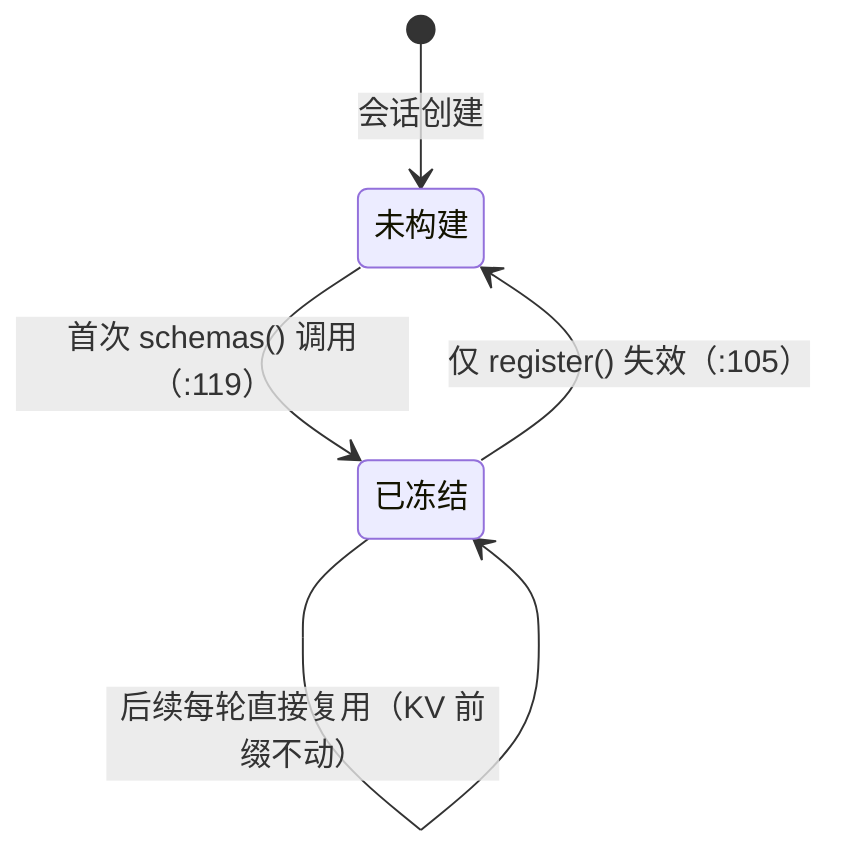
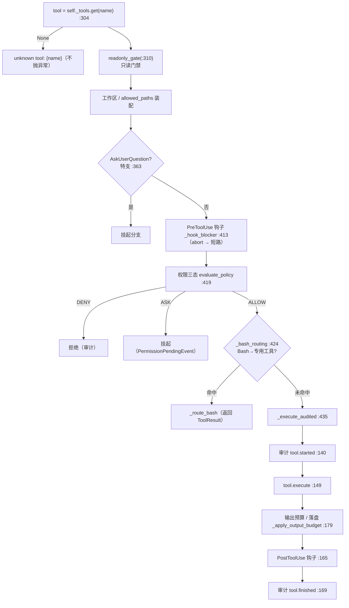
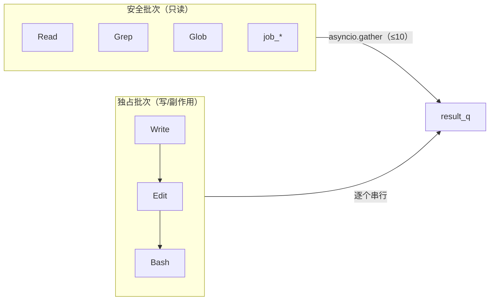

# XEYO 面试知识书 · 第三册 · 工具系统

> 覆盖系统：**S06 工具抽象与注册表**、**S07 执行通道与并发编排**、**S08 结果治理**、**S09 内置工具族（25 项）**、**S10 Bash 子系统**、**S11 文件 IO**、**S39 隔离与容器路由**
> 覆盖功能：**F020–F051**
> 对应岗位能力：AG-04（工具调用 / Function Calling / 插件系统）、AG-08（并发/异步，工具侧）、AG-10（隔离/沙箱）
>
> **本册修正了第一阶段的一处行号错误**：`ToolRegistry._bash_routing` 的**定义在 `:522`（不是 `:422`）**；`:422` 附近是调用点。
> 全程未读 `docs/`。

---

## 目录

- [第 6 章 · S06 工具抽象与注册表](#第-6-章--s06-工具抽象与注册表)
- [第 7 章 · S07 执行通道与并发编排 / S08 结果治理 / S39 容器路由](#第-7-章--s07-执行通道与并发编排--s08-结果治理--s39-容器路由)
- [第 8 章 · S10 Bash 子系统 / S11 文件 IO](#第-8-章--s10-bash-子系统--s11-文件-io)
- [功能分册（F020–F051）](#功能分册f020f051)

---

# 第 6 章 · S06 工具抽象与注册表

## 6.1 定位

工具面的**单一事实源**。三件事在此收口：① 工具怎么被描述（schema）；② 哪些工具进模型视野（exposure）；③ 工具面的**会话内冻结**。

## 6.2 工具抽象：一个 Protocol + 四个能力附属

### 6.2.1 数据结构

| 类型 | 行号 | 字段 |
| --- | --- | --- |
| `ToolResult`（数据类） | `tools/base_tool.py:9` | `content :11`、`is_error :12`、`todos :14`、`images :16`、`metadata :18`、`ui :20` |
| `Tool`（Protocol，`runtime_checkable`） | `:24` | `name :27`、`schema() :29`、`execute() :31`、`is_read_only() :36`、`is_concurrency_safe() :41` |

### 6.2.2 四个「能力附属 Protocol」

这是 XEYO 工具设计里**很精致的一处**——工具不继承一个大基类，而是**按需声明能力接口**：

| 附属 Protocol | 行号 | 注入的依赖 | 谁需要 |
| --- | --- | --- | --- |
| `ReadStateAware` | `:50` | `set_read_file_state(...)` | `Edit`（依赖「读过才能改」，见 F045） |
| `WriteStoreAware` | `:57` | `set_write_store(...)` | 写类工具（事务化写入，见第七册 F060） |
| `AgentIdAware` | `:64` | `set_agent_id(...)` | 子代理相关工具（作用域） |
| `RuntimeProviderAware` | `:71` | `set_runtime_provider(...)` | 需要运行期上下文提供者的工具 |

**另有** `tool_flag`（`:74`）——安全读静态标记，异常时回退。

**设计取舍（面试可讲）**：

> 为什么不用「一个大基类 + 一堆可选方法」？
> 因为可选方法会导致「所有工具都继承了一堆自己不用@override 的方法」，而 Protocol 是**结构化类型**：`isinstance` 检查（`runtime_checkable`）就能判断「这个工具是否支持读状态注入」。注册表按能力分发依赖，工具实现零负担。
> 代价是能力声明分散在多个 Protocol 里，新人需要先读 `base_tool.py` 才能找到全部扩展点。**这是一个「内聚 vs 发现性」的取舍，XEYO 选了内聚。**

### 6.2.3 JSON Schema：**手写常量，不自动生成**

**明确结论**：`schema()` 在 Protocol 里只是签名声明（`:29`），**每个工具自己返回手写 dict**（例：`tools/bash_tool/bash_tool.py:868`）。全仓**没有** `inspect.signature` 推导、没有装饰器生成 schema 的机制。

**为什么手写**（面试高频追问）：

> 因为 **schema 里的 `description` 是模型可见文本**。XEYO 有一条铁律：模型可见文本只承载信息，不承载建议/劝导/编排。如果 schema 由签名自动生成，描述文本就变成「函数 docstring 的副产品」——写代码的人不会把它当「模型可见产物」来审。
> 手写意味着：**每次改描述都是一次有意识的注意力编辑**，且能被 review。这是把「prompt 工程」的对象从 prompt 扩展到了 schema 描述。

**代价**：25 个工具 × 手写 schema，一致性靠约定。所以有 `tools/meta.py` 的元数据单表来做交叉校验（见 §6.3）。

## 6.3 注册表与工具面冻结

### 6.3.1 数据结构

| 项 | 符号 | 行号 |
| --- | --- | --- |
| 注册表类 | `ToolRegistry` | `tools/tool_registry.py:80` |
| 工具字典 | `self._tools: dict[str, Tool]` | `:90` |
| **schema 缓存** | `self._schemas_cache: list[dict] \| None` | `:92` |
| 注册 | `register(name, tool)` | `:103` → 置 `_schemas_cache = None`（`:105`） |
| 取 schema（惰性 + 冻结） | `schemas()` | `:110` |
| 缓存命中判定 | `if self._schemas_cache is None:` | `:119` |
| hidden 过滤 | `if exposure_of(t) != "hidden"` | `:123` |
| 默认输出预算 | `DEFAULT_OUTPUT_BUDGET = 16_000` | `:84` |

### 6.3.2 「工具面会话内冻结」这条红线



**机制**：`schemas()` 首次调用时构建并缓存；此后**同一会话内 tools 数组逐字节不变**。失效只发生在 `register()`（`:105`）与 `catalog.apply_read_vision` 改 vision 后（见 `catalog.py` 内对应点）。

**为什么这是红线**（对应 AGENTS.md「native tools = 会话起点快照」）：

> tools 数组在请求里位于**极靠前的位置**，任何改动都会让**整个 KV 前缀失效**——代价是全量重算。所以 XEYO 的选择是：**会话内永不热加载工具**。
> 那会话内想启停扩展怎么办？**唯一通道是 `Mcp` 网关工具**（见第六册 S18）——网关工具在会话起点就已注册，它内部再去调实际启停后的工具。**用「一个稳定的工具」换「工具面的稳定」。**

**面试可直接用的表述**：「我们不允许会话内改工具表，因为 tools 数组是 KV 前缀的一部分。会话内启停扩展走一个已经注册好的网关工具，而不是动态改表。」

### 6.3.3 `tools/meta.py`：元数据单表

| 项 | 符号 | 行号 |
| --- | --- | --- |
| 元数据类型 | `ToolMeta` | `:24` |
| `exposure` 字段 | `Literal["normal","hidden"] = "normal"` | `:44-48` |
| 查询单条 | `meta_for(name)` | `:315` |
| **解析 hidden** | `exposure_of(tool)` | `:319` |
| 短描述预算 | `apply_schema_budget(schema)` | `:341` |
| 启用名单（派生子集） | `ENABLED_META_NAMES` | `:409` |

**`exposure` 字段的注释（`:46-48`）**：

> `normal`=进 schemas；`hidden`=不进 schemas 但保留注册（**模型幻觉调用仍走权限三态，fail-safe**）。动态工具（无静态表项）由实例同名属性携带（`exposure_of` 兜底解析）。

**「hidden 但保留注册」是一个安全设计**：隐藏工具不进模型视野，但**如果模型幻觉调用了它，仍然要过权限三态**。也就是说——**隐藏是「减少干扰」，不是「安全边界」**。安全边界始终是权限层。

**⚠ 但这里有一个真实的软肋（C-08，见 §6.5）**：唯一的 hidden 工具 `offload_read` 的 `execute` 只做 abort + `is_file` 检查，**没有路径边界校验**。它的安全性完全依赖「模型不会幻觉调用 hidden 工具」这个假设，加上 `run()` 的全局三态。

### 6.3.4 权威工具清单：25 项

**权威运行时注册源**：`tools/catalog.py:261` `ENABLED_TOOL_ENTRIES`（`tuple[tuple[str, ToolFactory], ...]`），**实测 25 项**。

**启动自检**（`catalog.py:485-492`）：`_assert_names = {name for name, _ in ENABLED_TOOL_ENTRIES}` 与 `tools.meta.ENABLED_META_NAMES`（`meta.py:409`）**必须一致**，否则启动报 `ENABLED_TOOL_ENTRIES drift vs tools.meta`。

**这是一条很好的面试素材**：「工具清单与元数据表之间存在**启动期一致性断言**，两份表漂移就起不来。」

| # | 工具名 | 子目录 | 实现类:行号 | hidden | 一句话 |
| --- | --- | --- | --- | --- | --- |
| 1 | `getTime` | `get_time/` | `GetTimeTool:11` | — | 当前本地时间 |
| 2 | `offload_read` | `offload_read_tool.py` | `OffloadReadTool:16` | **是** | 按行区间读外部化结果文件 |
| 3 | `Glob` | `glob_tool/` | `GlobTool:671` | — | 文件名 glob 搜索 |
| 4 | `Grep` | `grep_tool/` | `GrepTool:372` | — | 内容检索（rg） |
| 5 | `Read` | `file_read_tool/` | `FileReadTool:154` | — | 读文件（含 vision/PDF） |
| 6 | `Write` | `file_write_tool/` | `FileWriteTool:88` | — | 创建/覆盖文件 |
| 7 | `Edit` | `file_edit_tool/` | `FileEditTool:122` | — | 精确字符串替换 |
| 8 | `Bash` | `bash_tool/` | `BashTool:491` | — | Shell 执行 |
| 9 | `TodoWrite` | `todo_write_tool/` | `TodoWriteTool:107` | — | 替换会话待办清单 |
| 10 | `job_output` | `job_tools.py` | `JobOutputTool:64` | — | 读后台 job 增量输出 |
| 11 | `job_list` | `job_tools.py` | `JobListTool:174` | — | 列本会话后台 job |
| 12 | `job_kill` | `job_tools.py` | `JobKillTool:232` | — | 取消本会话后台 job |
| 13 | `Screenshot` | `screenshot_tool/` | `ScreenshotTool:31` | — | 截屏 |
| 14 | `SendToWeChat` | `send_to_wechat_tool/` | `SendToWeChatTool:15` | — | 发文件到微信 |
| 15 | `Memory` | `memory_tool/` | `MemoryTool:149` | — | 读写持久记忆（仅主会话） |
| 16 | `AskUserQuestion` | `ask_user_question_tool/` | `AskUserQuestionTool:90` | — | 结构化提问挂起 |
| 17 | `JournalQuery` | `journal_query_tool/` | `JournalQueryTool:12` | — | 查 rewind/journal |
| 18 | `Skill` | `skill_tool/` | `SkillTool:173` | — | 按需加载 playbook |
| 19 | `Agent` | `agent_tool/` | `AgentTool:83` | — | 派生子 agent |
| 20 | `Diagnostics` | `diagnostics_tool/` | `DiagnosticsTool:27` | — | 路径诊断（非全量 LSP） |
| 21 | `Git` | `git_tool/` | `GitTool:21` | — | 只读 git |
| 22 | `NotebookEdit` | `notebook_edit_tool/` | `NotebookEditTool:28` | — | 编辑 `.ipynb` cell |
| 23 | `WebFetch` | `web_fetch_tool/` | `WebFetchTool:61` | — | 抓公网 URL |
| 24 | `WebSearch` | `web_search_tool/` | `WebSearchTool:48` | — | 联网搜索 |
| 25 | `XeyoUI` | `xeyo_ui_tool/` | `XeyoUITool:44` | — | 桌面 UI 操作 |

**⚠ 一个容易讲错的点**：`tools/echo/echo_tool.py:11` 有 `EchoTool` 类，但它在 `meta.py` 里被标 `enabled=False`，**不进产物清单**。它的用途是 **Fake 模型的契约测试**（`session_pool.py:437` 在 `provider == "fake"` 时**运行期注册** `EchoTool`）。所以面试时说「25 个工具」是对的；说「26 个」就是**把测试夹具当产品能力**。

## 6.4 设计取舍

| 决策点 | 采用 | 被否决 | 证据 / 理由 |
| --- | --- | --- | --- |
| 工具契约 | Protocol（结构化类型）+ 能力附属 | 单一大基类 | `base_tool.py:24/50/57/64/71` |
| schema 生成 | **手写** | `inspect.signature` 自动推导 | `base_tool.py:29`；`bash_tool.py:868` |
| 工具面 | **会话内冻结** | 热加载/动态改表 | `tool_registry.py:92/119` |
| 会话内启停 | `Mcp` 网关单通道 | 动态改 tools 数组 | 见第六册 S18 |
| 清单与元数据 | **启动期一致性断言** | 无校验 | `catalog.py:485-492` |
| 隐藏工具 | 不进 schemas 但**仍过权限** | 直接从注册表移除 | `meta.py:46-48` |
| 测试工具 | 运行期按 provider 注册 | 混进产物清单 | `session_pool.py:437`；`echo_tool.py:11` |

## 6.5 ⚠ 已知软肋：`offload_read` 无独立路径校验（C-08）

**源码实测**（`tools/offload_read_tool.py`）：

```python
	name = "offload_read"
	#: exposure 由 tools.meta 的 offload_read 条目决定（默认 hidden）。
	...
	async def execute(self, input, abort) -> ToolResult:
		abort.raise_if_aborted()
		p = Path(str((input or {}).get("path") or "")).expanduser()
		if not p.is_file():
			return ToolResult(content=f"(offload 文件不存在: {p})", is_error=True)
		text = p.read_text(encoding="utf-8")
```

**问题**：
1. **没有工作区边界校验**——`expanduser()` 后直接读，路径可以是任意绝对路径（含工作区外）。
2. **没有独立的权限分支**——只依赖 `ToolRegistry.run` 的全局三态（`:296` 起）。而 `run` 的路径边界判定（`filesystem.py`）是**按工具类型**做的，hidden 工具不在常规分支里。
3. 安全性依赖两个假设：①「模型不会幻觉调用 hidden 工具」（但 `meta.py:46-48` 注释恰恰承认「模型幻觉调用仍走权限三态」——即承认幻觉可能发生）；② `run()` 的全局三态对该工具是够用的。

**正确讲法（面试）**：

> 这是我们审计里发现的一个真实软肋，已记录但未修。`offload_read` 是唯一的 hidden 工具，它的 `execute` 只做了 abort 检查和文件存在性检查，**没有路径边界校验**——理论上可以读工作区外的文件。
> 现有的缓解是：它不进模型视野（除非模型幻觉调用），且所有工具调用都要过 `run()` 的权限三态。
> 但我不认为这是足够的——**「依赖模型不犯错」不是安全设计**。正确修法是给它加独立的路径狱校验，和 `Read` 走同一套 `filesystem` 判定。
> 我们之所以把它记在案上而不是立刻修，是因为它的触发前提是「模型幻觉调用一个自己看不到的工具」，概率低；但**低概率不等于可接受**，这是我明确保留的改进项。

**这段回答的杀伤力**：主动、精确、给出根因与修法、并且**不把「低概率」当成借口**。这正是用户 MEMORY 里记录的「显式披露负向结果」的工程文化。

## 6.6 面试题

**Q：工具系统怎么保证「模型看到的工具面」和「实际能调用的工具」一致？**
> 三层保障。① **清单单一来源**：`catalog.py:261` 的 `ENABLED_TOOL_ENTRIES` 是运行时注册源，且启动时有断言校验它与 `tools/meta.py` 的 `ENABLED_META_NAMES` 一致（`catalog.py:485-492`）——两份表漂移就起不来。
> ② **schema 惰性构建 + 冻结**：`schemas()` 首次调用构建并缓存（`tool_registry.py:92/119`），会话内不变。
> ③ **hidden 仍过权限**：隐藏工具不进 schemas，但模型如果调它，仍然走权限三态（`meta.py:46-48`）——**隐藏是减少干扰，不是安全边界**。

**追问**：那为什么不干脆把 hidden 工具从注册表里删掉？
> 因为「不进 schema」和「不被调用」是两件事。我们说 hidden 的语义是「模型看不到」，但如果模型通过别的途径（比如历史上下文里见过）调它，我们希望行为是可预期的：**仍然是「过权限三态」而不是「unknown tool」**。后者的信息量更低，也更难排查。

---

# 第 7 章 · S07 执行通道与并发编排 / S08 结果治理 / S39 容器路由

## 7.1 先纠正一个命名陷阱 ⚠

**`tools/exec_channel.py` 不是执行通道。** 它的实际职责是**「容器感知的观测原语」**——提供 `list_dir` / `stat_path` / `read_text` / `model_workspace` 等「按当前容器路由决定在宿主还是容器里做」的读写原语。

**真正的「权限 → 钩子 → 审计 → 执行」通道在 `tools/tool_registry.py` 的 `ToolRegistry.run`（`:296`）。**

**面试风险**：如果按文件名说「我们的执行通道在 `exec_channel.py`」，被追问实现细节就会露馅。**正确表述**：「执行收口在 `ToolRegistry.run`；`exec_channel` 是容器感知原语层，名字起得有误导性，是我们已知的命名债。」

（这类「主动指出自己代码库的命名债」在面试里是加分项——它证明你真的读过代码，而不是背架构图。）

## 7.2 `ToolRegistry.run` 的完整执行顺序



**顺序要点（可背）**：**只读门禁 → 钩子(Pre) → 权限 → 路由 → 执行 → 预算 → 钩子(Post) → 审计**。

**⚠ 一个顺序细节值得讲**：`PreToolUse` 钩子在**权限裁决之前**（`:413` 早于 `:419`）。这是一个刻意选择——钩子可以**先否决**（短路），从而避免「为一次注定被拒的调用去做权限挂起」。但这也意味着：**钩子代码运行在权限检查之前**，所以钩子必须被当作**可信代码**（它在 `manifest.py` 里声明，见第六册 S20）。

**另一个细节**：`readonly_gate`（`:310`）在钩子和权限之前——**只读模式是最外层门禁**。

## 7.3 并发编排（S07 的核心亮点）

### 7.3.1 分区 + 读写锁

| 符号 | 行号 | 作用 |
| --- | --- | --- |
| `_max_concurrency()` | `tools/orchestration.py:31` | 并发上限（默认 **10**，`XEYO_MAX_TOOL_USE_CONCURRENCY`） |
| `_tool_timeout_s()` | `:47` | 单工具超时 |
| `_progress_interval_s()` | `:61` | 心跳间隔 |
| `is_concurrency_safe(registry, name)` | `:73` | 是否可并发 |
| `partition_tool_calls(...)` | `:85` | **分区**：连续 `concurrency_safe` 合并成批 |
| `_run_one_tool(...)` | `:128` | 单工具执行（含局部 abort / 超时 / 心跳 / 读写锁） |
| `run_tools_partitioned(...)` | `:247` | 编排入口 |

**T2 读写锁（源码实测，`_run_one_tool` 内）**：

```python
lock: RWLock | None = None,          # 签名参数
...
if lock is not None:
    # T2：并发安全工具共享读锁；不安全工具独占写锁（与分区判定同源）。
    if is_concurrency_safe(registry, tu.name):
        guard = lock.read_lock()
    else:
        guard = lock.write_lock()
    async with guard:
        result = await coro   # 或 asyncio.wait_for(coro, timeout=timeout)
```

**并发模型总结（可直接作为面试答案）**：



- **只读工具可并发**：`Glob` / `Grep` / `Read` / `GetTime` / `JournalQuery` / `Skill` / `Git` / `Diagnostics` / `job_*`。
- **写与副作用工具串行**：`Write` / `Edit` / `Bash` / `Screenshot` / `SendToWeChat` / `Memory` / `WebFetch` / `WebSearch` / `XeyoUI` / `Agent` 等 `concurrency_safe=False`。
- 并发走 `asyncio.gather(return_exceptions=True)`（`:304` 附近），**异常不吞不炸：以异常对象形式收齐**。
- 安全批次用**信号量**限制并发数（`limit = _max_concurrency()`，`:282`）。

**为什么「只读并发 / 写串行」而不是「全都并发」**：

> 因为写工具之间存在**隐式因果**。模型说「先写 A 再写 B」时，它期望顺序；并行执行会让「A 的写入是否影响 B」变成竞态。而只读工具之间没有因果，并发纯赚。
> 用读写锁（而不是「全串行」）的收益是：多个只读工具可以真正同时跑（比如同时 Grep 三个模式），这与「一个写工具独占」不冲突。

### 7.3.2 分区判定的来源

**关键设计**：分区判定（`partition_tool_calls`）与读写锁判定（`_run_one_tool` 内）**调用同一个 `is_concurrency_safe`**——源码注释明确写了「与分区判定**同源**」。

> **同一个事实只能有一个判定源**。如果分区用一套规则、加锁用另一套规则，就会出现「被判为安全却拿了写锁」这类不一致，进而引发「为什么这个工具明明只读却阻塞了别人」的隐蔽性能问题。**同源判定把这类 bug 变成结构上不可能。**

## 7.4 S08 结果治理

### 7.4.1 三层结果治理

| 层 | 机制 | 阈值 / 参数 | 行号 |
| --- | --- | --- | --- |
| ① 输出预算 | `_apply_output_budget` | `DEFAULT_OUTPUT_BUDGET = 16_000` | `tool_registry.py:84/179/200` |
| ② 预览截断 | `PREVIEW_HEAD` / `PREVIEW_TAIL` | **6_000 / 2_000** | `:86/87`（应用 `:210/211`） |
| ③ 落盘回引用 | `spill.save_text` | 目录 `~/.xeyo/spill/<safe_session>/`；保留 **7 天** | `spill.py:40/26/86` |

**回引用文本格式（实测，`_apply_output_budget` 内）**：

```
[output truncated: 预算截断（非错误），原始 48213 字符；full output: C:/Users/x/.xeyo/spill/sess-xx/20260911-123456-a1b2c3d4.txt]
```

**注意措辞**：`预算截断（非错误）` ——**明确告诉模型「这不是错误」**。这符合「中性结果型措辞」的纪律：截断是引擎的容量管理，不是工具失败。如果写成「结果太大，已截断」，模型可能会去「修复」一个根本不存在的问题。

**⚠ 豁免工具**：`Read` 与 `Bash` 的 `output_budget = 0`（`meta.py`），`_apply_output_budget` 里 `budget <= 0` 时**直接返回原样**（`:202`）。理由：Bash 有自己的 `truncate_for_model`（`bash_tool/truncate.py:61`，head 20k / tail 8k），Read 有行号限制——**两者已有各自的截断策略，不该叠加第二层截断**。

### 7.4.2 进度事件（模型不可见）

| 符号 | 行号 | 说明 |
| --- | --- | --- |
| `_sink: ContextVar` | `progress_sink.py:15` | 名 `xeyo_tool_progress_sink` |
| `set_progress_sink` / `reset_progress_sink` | `:19` / `:23` | 挂/摘 |
| `emit_progress(event)` | `:28` | 推事件；异常静默（`except Exception: pass`） |
| 心跳协程 `_beat()` | `orchestration.py:166` 附近 | 每 `interval` 发 `ToolProgressEvent(message="X still running…")` |
| 挂接点 | `orchestration.py:162` | `set_progress_sink(_put_progress)` |

**为什么用 ContextVar 而不是全局回调**：源码 docstring（`progress_sink.py:1-6`）：

> 编排层在 `_run_one_tool` 里挂上 sink，工具（尤其是 `Agent`）可把 `ToolProgressEvent` / 结构化 `xy` 帧推进主会话 SSE，而**无需改 `execute()` 签名**。**asyncio 并发下每个 Task 有独立 ContextVar 副本。**

**这是本册最漂亮的一处设计**，可讲三层：
1. **不改接口**：如果为了传进度而给 `execute()` 加参数，25 个工具签名全要改。
2. **并发安全**：`asyncio` 并发下 ContextVar 每 Task 一份，天然隔离——**用全局 dict 会串台**。
3. **模型不可见**：进度只走 SSE 旁路，不进模型上下文（呼应第二册 F042 的 `ToolResult.ui`）。

**与 F042 的关系**：`ToolResult.ui`（`base_tool.py:20`）与 `ToolProgressEvent` 是**同一族设计**——「给 UI 的信息」与「给模型的信息」物理分离。

### 7.4.3 `stub.py`

`tools/stub.py:8` `not_implemented(tool_name)` → 返回 `ToolResult(content=f"{tool_name}: not implemented yet", is_error=True)`。模块 docstring 写着「工具脚手架共享辅助函数（**尚未实现**）」。

**用途**：新增工具时的占位实现，保证注册/权限/schema 全链路可跑，只有 `execute` 是桩。**这本身就是一种工程习惯**：先让「骨架全通」，再填实现。

## 7.5 S39 容器路由（隔离与沙箱）

### 7.5.1 一个真实的并发事故（**本册最好的面试故事**）

`tools/container_routing.py` 的模块 docstring（`:1-11`）原文：

> **问题（p4 冒烟实测）**：harbor 并发 trial 共进程时，适配器各自 `setup()` 往 `os.environ` 写 `XEYO_DOCKER_CONTAINER`，后写覆盖先写 → **两个 agent 的 bash 全部串进最后一个 trial 的容器**（跨任务环境互染，测量无效；`query-optimize` 的 agent 落进 `raman-fitting` 容器，被误判"输入文件不存在"）。
>
> **方案**：bash / job 工具的容器读取顺序 = `ContextVar`（每 trial 协程上下文隔离，适配器在 `run()` 内设置）→ `os.environ` 回退（单 trial / GUI / 旧行为完全不变）。
>
> 本模块**零依赖、零副作用**；不设置 override 时所有路径**字节级等价**于旧行为。

**这个故事的完整结构（STAR 式）**：

| 环节 | 内容 |
| --- | --- |
| **S** 情境 | 评测跑并行 trial，多 adapter 在同一进程内 |
| **T** 任务 | 每个 trial 的 agent 必须在自己的容器里执行命令 |
| **A** 分析 | 根因=适配器用 `os.environ` 做容器路由，**进程级共享变量在并发下被覆盖** |
| **A** 行动 | 引入 ContextVar 覆盖层（协程级），读取顺序 ContextVar → env；且**不修改旧路径语义** |
| **R** 结果 | 并发串容器消失（症状是「跨任务环境互染」→ 一个 agent 落进另一个任务的容器） |

**面试该怎么讲**（重点在诊断力）：

> 我们跑并发评测时出现过一种很难查的现象：两个任务的 agent 互相"看见"了对方的文件系统——具体是 `query-optimize` 的 agent 落进了 `raman-fitting` 任务的容器，然后被误判成「输入文件不存在」。
> 根因是容器路由写在 `os.environ` 里——**进程级共享状态在并发下必然被覆盖**，后启动的 trial 赢了。修复是引入 `ContextVar`，因为 asyncio 下每个协程上下文有独立副本，天然隔离；读取顺序是 ContextVar 优先、env 回退，**并且不设 override 时行为字节级等价于旧路径**——这是为了不让修复本身成为回归源。
> 这件事让我形成一个习惯判断：**凡是「每个并发单元应该有自己的值」的状态，都不能放在进程级变量里。**

**⚠ 并如实说明当前状态**：`container_routing.py` **只是 ContextVar 覆盖层**（`:19` `_container_override`、`:24` `set_container_override`、`:29` `current_container`）。**真正的「哪些工具进容器」判定在 `bash_tool` 内部**，本册未逐行取证（第一阶段记为 C-17）。

### 7.5.2 `exec_channel.py`：容器感知观测原语

| 符号 | 行号 | 说明 |
| --- | --- | --- |
| `active_container()` | `exec_channel.py:47` | `current_container()` → 回退 `os.environ["XEYO_DOCKER_CONTAINER"]`；异常时视为宿主 |
| `PROBE_TIMEOUT_S` | `:43` | 5.0 秒 |
| `_TERMINAL` | `:44` | 95（终端宽度回退） |
| 原语 | — | `list_dir` / `stat_path` / `read_text` / `model_workspace` |

**关键**：每个原语内部都是 `cid = active_container()` → `if cid:` 走容器（`docker exec_run`），否则走宿主。**「判定一次、全链一致」**——避免同一次观测里一半走容器一半走宿主。

## 7.6 面试题 + 回答模板

### Q1：多个工具调用你怎么并发？

**回答模板**：
> 先分区，再按区用不同策略。分区判据是「这个工具是否并发安全」，由 `is_concurrency_safe` 统一判定（`orchestration.py:73`）。**连续的**安全工具合并成一个批次（`:85` `partition_tool_calls`），用 `asyncio.gather` 并发（并发上限默认 10，可配）；不安全工具逐个串行。
> 另外还有一层 **T2 读写锁**：即使在同一批次里，并发安全工具拿共享读锁，不安全工具拿独占写锁（`_run_one_tool` 内）。
> **关键点是「分区判定与加锁判定同源」**——都用 `is_concurrency_safe`。如果两处各写一套规则，就会出现「被判为安全但拿了写锁」这类不一致，表现为莫名其妙的串行。

**追问 1**：为什么只读能并发、写必须串行？
> 因为写工具之间有隐式因果。模型说「先写 A 再改 B」是期望顺序的；并行执行会让「A 的副作用是否影响 B」变成竞态。而只读工具之间没有因果，并发是纯收益。

**追问 2**：`asyncio.gather` 里某个工具抛异常了怎么办？
> 用 `return_exceptions=True`（`:304` 附近）——**异常被当作结果对象收齐**，而不是让整个批次炸掉。因为「一个工具失败」不应该让「另外九个已经读出来的信息」白白丢掉。异常稍后会被转成 `is_error=True` 的 `ToolResult` 回灌给模型。

**追问 3**：工具卡住了怎么办？
> 三层。① 单工具有超时（`_tool_timeout_s`，`:47`）；② 局部 `LinkedAbortController`——**工具自己的超时不会污染父 abort**（这是第一册提到的 `LinkedAbortController` 的用途）；③ 心跳：`_beat()` 每 `_progress_interval_s()` 发一次 `ToolProgressEvent`，让 UI 知道「还在跑」。

### Q2：$（系统设计题）如果你要让工具执行「可观测」，你会怎么设计？

**回答模板**（先讲清「给谁看」再讲实现）：
> 第一步是分清「给谁看」——这是 XEYO 里最重要的一条切分。**给模型看的**是工具结果文本（`ToolResult.content`）；**给用户看的**是进度和 UI 状态（`ToolProgressEvent` 与 `ToolResult.ui`）。这两者**不能混**。
> 第二步是实现：进度不走 `execute()` 签名（否则 25 个工具全要改），而是用 **ContextVar 挂一个 sink**（`progress_sink.py:15`），编排层在 `_run_one_tool` 里挂上，工具想发进度就 `emit_progress`。**ContextVar 在 asyncio 下每 Task 独立副本**，所以并发安全——这是它相对于全局回调的关键优势。
> 第三步是异常纪律：`emit_progress` 里 `except Exception: pass`——**进度上报失败绝不影响工具执行**。可观测性不能成为故障源。

**追问**：为什么不用 logging？
> 因为进度是**结构化事件**，不是日志文本。它要被 SSE 序列化成帧、被前端 dispatch 到具体面板、并且带 `elapsed_ms` 这类字段。日志是给人 grep 的，事件是给程序消费的。XEYO 里这两条路都有：可观测性走 `msgtypes/events.py` 的事件 + `audit/` 的 JSONL。

---

# 第 8 章 · S10 Bash 子系统 / S11 文件 IO

## 8.1 S10 Bash 子系统（13 个模块）

### 8.1.1 模块清单

| 文件 | 一句话职责 | 关键符号:行号 |
| --- | --- | --- |
| `bash_tool.py` | Shell 执行器主体 | `BashTool:491`；`execute:931`；`schema:868`；`DEFAULT_TIMEOUT_MS=120_000:124`；`MAX_TIMEOUT_MS=600_000:125`；`MAX_RESULT_CHARS=30_000:126`；`MAX_COMMAND_CHARS=100_000:127`；`BASH_PROMOTE_DEFAULT_MS=45_000:130`；`promote_threshold_ms():133`；`_PURE_READ_BASES:64`；`_GIT_READ_SUBS:75`；`_command_may_mutate_workspace:91`；`fast_fail_message:115`；`WRAP_WINDOW_BG_MAX_REMAINING_S=120.0:146` |
| `prompt.py` | 工具描述常量 | `BASH_TOOL_NAME:1`；`DESCRIPTION:3` |
| `runner.py` | 流式进程生命周期 | `StreamHandle:198`；`spawn_streaming:333`；`finish_streaming:373`；`build_shell_argv:136`；`shell_display_name:150`；`ExecResult:46`；`_kill_process:62`；`_job_memory_mb:53`；`_resolve_pwsh_exe:121`；`_PUMP_DRAIN_S=2.0:27` |
| `semantics.py` | 退出码语义 | `interpret_command_result:45`；`extract_base_command:15`；`_git_subcommand:27`；`_split_segment:10` |
| `truncate.py` | 模型侧截断 | `truncate_for_model:61`；`DEFAULT_LIMIT=30_000:7`；`HEAD_CHARS=20_000:8`；`TAIL_CHARS=8_000:9`；`MAX_ERROR_EXCERPT_LINES=8:24`；`MAX_ERROR_EXCERPT_CHARS=800:25`；`_error_excerpt:40` |
| `cmd_compact.py` | 命令族噪声压缩 | `compact_command_output:55`；`detect_family:45`；`_MIN_CHARS=4_000:13`；`_compact_pytest:86`；`_compact_test_runner:172`；`_compact_tsc:226`；`_compact_lint:260` |
| `destructive_guard.py` | 破坏性命令**执行前快照** | `DESTRUCTIVE_PROGRAMS:55`；`_POSIX_FAMILY:60`；`_WINDOWS_FAMILY:62`；`_PREFIX_PROGRAMS:66`；`_REDIR_TOKENS:71`；`DEFAULT_MAX_FILES=50:73`；`DEFAULT_MAX_FILE_BYTES=10_000_000:74`；`GuardEntry:78`；`DestructivePlan:88`；`guard_enabled:103`；`max_files:108` |
| `precheck.py` | 拦截 TTY/编辑器挂起类命令 | `precheck_command:113`；`_FULLSCREEN:25`；`_TTY_TOOLS:31`；`_COMMIT_MSG_RE:34`；`_fullscreen_block:43`；`_tty_flag_block:54`；`_git_editor_block:86` |
| `win_job.py` | Windows Job Object（内存上限 + 整树杀） | `DEFAULT_JOB_MEMORY_MB=2048:22`；`JobHandle:26`；`_memory_limit_bytes:94`；`create_bash_job:106` |
| `background.py` | 日志式后台任务 | `start_background:57`；`adopt_background:141`；`cancel_background:47`；`BackgroundHandle:23`；`_MergedAbort:28`；`_cleanup_old_logs:209`（TTL 7 天） |
| `jobs_bridge.py` | Bash → JobRegistry 桥 | `start_registry_job:14`；`adopt_registry_job:53` |
| `timeout_map.py` | 命令族默认超时 | `_FAMILY_TIMEOUTS_MS:24`；`family_default_ms:106`；`_load_overrides:75`；`base_command_of:96` |
| `dup_redirect.py` | Bash → 专用工具路由规划 | `BashRoutePlan:61`；`_Hit:81`；`plan_bash_route`；`_routed_note:205`；`_hit_read:135`；`_hit_search:150`；`_METACHARS:38`；`_WILDCARD:44` |
| `pwsh7.py` | PowerShell 7 引导器 | `PINNED_VERSION="7.4.6":26`；`locate:141`；`ensure:162`；`download_and_install:114`；`install_from_zip:83`；`_parse_hashes_txt:46`；`_extract_zip_safe:60`；`_DOWNLOAD_TIMEOUT_S=120:30` |

### 8.1.2 三个最值得讲的设计

#### ① `destructive_guard` 是「快照」不是「拦截」

**⚠ 这是一个极易讲错的点。** `destructive_guard` 的职责是**在执行破坏性命令前，把将被影响的文件快照下来**（`GuardEntry` `:78`、`DestructivePlan` `:88`），供回溯使用——**不是「拒绝执行」**。所以它可以被 `_DISABLE_VALUES`（`:52`：`0/false/no/off/disabled`）关掉。

**注意与权限层的分工**：
- **拦截**（拒绝执行）在 `permissions/bash_policy.py`（见第四册 S12）。
- **快照**（可回滚）在 `tools/bash_tool/destructive_guard.py`。

**面试讲法**：「我们对危险命令做了两层：权限层拦截 + 执行前快照。**但我必须指出，拦截层的覆盖面不足**——`rm -rf .` / `rm -rf *` 这类默认档可能放行（这是审计里记录的 C-07）。快照层是兜底，但快照不等于安全：**快照只覆盖它认识的文件范围**（`DEFAULT_MAX_FILES=50`、单文件 10MB 上限），超出就不保证。」

**主动披露限额**（50 个文件 / 10MB）比说「我们有危险命令防护」更有说服力。

#### ② `pwsh7` 的供应链校验

`PINNED_VERSION = "7.4.6"`（`:26`）——**钉死版本**，不是「拿最新」。安装流程（`:114` `download_and_install`）会**下载官方 `hashes.sha256` 并校验**（`_sha256_file:38`、`_parse_hashes_txt:46`），解压走 `_extract_zip_safe`（`:60`）——**防 Zip Slip**。

**面试讲法**：「我们的 Bash 在 Windows 上会引导一个钉死版本的 PowerShell 7，**从官方渠道下载并校验 SHA256，解压时做路径逃逸检查**。这是一个 Agent 产品容易被忽略的面：你的工具链会把可执行文件下载到用户机器上，**不校验就是供应链风险**。」

#### ③ `timeout_map` 的「按命令族给默认超时」

`_FAMILY_TIMEOUTS_MS`（`:24`）按命令族给不同默认值（如 `pip` 300s、`cargo` 420s），并支持 `XEYO_CMD_TIMEOUT_OVERRIDES` 覆盖（`_load_overrides:75`）。

**为什么需要**：一个统一的 120 秒超时对 `echo` 太长、对 `cargo build` 太短。**按族给默认值是「用领域知识换少一次人工调参」**。

### 8.1.3 Bash 透明路由（F027）

| 环节 | 符号 | 行号 |
| --- | --- | --- |
| 路由规划 | `plan_bash_route(command)` | `dup_redirect.py` |
| 命中判据 | 无元字符（`_METACHARS:38`）+ base ∈ `{cat,type,gc,get-content}`→Read 或 `{rg,ripgrep,grep,findstr}`→Grep | `_hit_read:135` / `_hit_search:150` |
| 结果头 | `_routed_note(command, hit)` | `:205` |
| 拼装 | `f"{note}\n{result.content}"` | `tool_registry.py:632-633` 附近 |
| 主入口 | `_bash_routing` | `tool_registry.py:522` |
| 回退 | 目标工具被路径狱 DENY → 执行原 Bash | `tool_registry.py:603-611` |
| 观测 | `_observe_bash_route` | 仅记审计不拦截 |

**决策表**（源码 docstring 原文，`tool_registry.py:529` 附近）：

| 情况 | 行为 |
| --- | --- |
| plan 未命中 | `None`（原样执行 Bash） |
| `bash_routing` 非 auto（主会话） | L2 错误提示（保留现行为） |
| `bash_routing` 非 auto（worker） | `None`（`SUBAGENT_APPEND` 允许短只读） |
| auto + 目标路径**区外** | `None`（直行 bash，避免「路由 → DENY → 回退」白跑） |
| auto + 目标路径**区内** | 透明路由（`_route_bash`） |

**⚠ 「避免路由→DENY→回退白跑」这条注释很值钱**：它说明设计者**预演了失败路径**——如果对区外路径也做路由，会先被路径狱拒绝再回退，白付两次判定成本。**这类「预演失败路径并主动短路」的细节，是资深工程师和普通实现者的分界线。**

## 8.2 S11 文件 IO（11 个模块）

| 文件 | 一句话职责 | 关键符号:行号 |
| --- | --- | --- |
| `paths.py` | 路径规范化与纠错 | `expand_path:17`；`to_relative_path:26`；`suggest_path_under_cwd:35`；`find_similar_file:57`；`FILE_NOT_FOUND_CWD_NOTE:8` |
| `read_state.py` | 会话级读状态（防盲改） | `FileStateEntry:11`；`ReadFileState:39`；`_max_entries_from_env:29`（默认 128） |
| `conflict.py` | 写冲突归因 | `build_stale_message:92`；`external_attribution:62`；`line_range_summary:21`；`_time_hhmm:55` |
| `diff_preview.py` | 统一 diff 预览 | `format_capped_unified_diff:17`；`MAX_DIFF_LINES=80:9`；`append_diff_fence:53` |
| `syntax_check.py` | 写前/写后语法自检 | `syntax_error_detail:25`；`introduces_error:59`；`_MAX_PARSE_CHARS=2_000_000:22` |
| `content_index.py` | 内容索引（trigram，供 Grep 缓存） | `ContentIndex:42`；`_TTL_S=30.0:28`；`_MAX_INDEXED_FILES=20_000:30`；`_MAX_INDEXED_BYTES=64MiB:31`；`_SKIP_FILE_BYTES=2MiB:32`；`_MAX_CACHE_ROOTS=8:33`；`is_literal:53`；`_trigrams:58` |
| `content_index_cache_shadow.py` | 索引缓存旁路（侧挂） | `enabled:51`；`read_count:63`；`_hash_text:67`；`ENV="XEYO_CONTENT_INDEX_CACHE":36` |
| `excludes.py` | 搜索排除规则 | `VCS_DIRECTORIES_TO_EXCLUDE:16`；`HEAVY_DIRECTORIES_TO_EXCLUDE:25`；`search_excluded_dirs:43`；`excluded_dir_globs:55`；`AGENTIGNORE_FILENAME=".agentignore":64`；`agentignore_args:83`；`excluded_secret_globs:108` |
| `rg_subprocess.py` | ripgrep 子进程 | `run_ripgrep_lines:39`；`RipgrepRunnerError:22`；`_kill:26`；`RG_POLL_INTERVAL_S=0.05:19` |
| `text.py` | 文本读写与编码 | `read_text_file:31`；`write_text_file:54`；`apply_edit_to_file`（~:173）；`detect_line_endings:26`；`add_line_numbers:79`；`normalize_newlines:22`；`normalize_quotes:94`；`get_mtime_ms:17` |
| `__init__.py` | 包导出 | — |

### 8.2.1 F045 读状态追踪（防盲改）——最值得讲的一个

**键的粒度：绝对路径**（`ReadFileState` 内 `_key` 用 `normcase + normpath`），**不是 mtime、不是内容 hash**。条目字段：`content` + `timestamp`（`mtime_ms`）+ `writer_session_id`（`FileStateEntry:11`）。

**规则**：`Edit` 之前必须对同一路径有过 `Read`（否则报 `missing_read: no prior Read for this path in this session`）。

**诚实的难点（面试有加分）**：

> 用「绝对路径」做键有个已知弱点：**文件在会话外被改了，我们的读状态还是旧的**。所以 `FileStateEntry` 里存了 `mtime_ms`，用来**检测「读完之后文件被外部改过」**——这时会提示 stale（`conflict.py:92` `build_stale_message`）。
> 也就是说：**路径是「是否读过」的判据，mtime 是「读的内容还有效吗」的判据**。两个问题需要两个键，不能只用一个。
> 另外条目数有上限（默认 128，`_max_entries_from_env:29`），是一个 LRU——避免长会话把读状态撑爆。

**为什么不用内容 hash 做键**：因为 hash 要在**每次 Read 时对全文计算**，对几百 KB 的文件是显著开销；而 mtime 是 `stat` 一次就到手。**这是「精度 vs 成本」的取舍**——代价是「mtime 变了但内容没变」会产生误报 stale（可接受，因为重新读一次的成本低于漏报的成本）。

### 8.2.2 `syntax_check`：只覆盖 `.py` / `.json`

`syntax_error_detail(file_path, content)`（`:25`）—— **只支持 Python 与 JSON**（含行列号），单文件 **> 2MB 跳过**（`_MAX_PARSE_CHARS`，`:22`）。

**⚠ 可讲的一句实话**：「我们的写前语法检查只覆盖 Python 和 JSON，因为这两种能用标准库零依赖解析。TypeScript 走的是另一个通道——`Diagnostics` 工具回落本地 `tsc`（见 F043）。所以**语法错误拦截不是统一的**，而是一个按语言分派的能力矩阵。」

### 8.2.3 `content_index` 的四道上限

`_MAX_INDEXED_FILES = 20_000`、`_MAX_INDEXED_BYTES = 64 MiB`、`_SKIP_FILE_BYTES = 2 MiB`、`_MAX_CACHE_ROOTS = 8`，TTL 30 秒。

**这就是「每一层都要有硬上限」这个纪律的又一次体现**。特别值得一提的是 `_SKIP_FILE_BYTES` 的注释：「单文件超 2 MiB → 放弃（**保证超集完整性**）」——意思是**宁可不索引大文件（回退到真实扫描），也不要让它破坏「索引是结果的超集」这个不变式**。因为一旦索引漏了匹配，Grep 就会给出**错误的空结果**，这比慢更危险。

## 8.3 面试题 + 回答模板

### Q1：你的 Agent 怎么保证「改文件前看过文件」？

**回答模板**：
> 会话级读状态。`Read` 会把路径 + 内容 + mtime + 写入者会话 id 记进去（`tools/fileio/read_state.py:11/39`），`Edit` 前检查同一路径是否读过，没读过直接报 `missing_read`。
> 有两个设计点值得说：
> ① **键用绝对路径，不用内容 hash**——因为 hash 要在每次 Read 时算全文，几百 KB 的文件开销明显；mtime 一次 `stat` 就到手。代价是「文件被外部改了但内容没变」会误报 stale，**这是可接受的：重新读一次的成本远低于漏报**。
> ② **条目有 LRU 上限**（默认 128），避免长会话把读状态撑爆。

**追问**：如果文件在会话外被改了怎么办？
> 存了 `mtime_ms` 就是为了这个。读状态里路径是「是否读过」的判据，mtime 是「读的内容还有效吗」的判据——**两个问题两个键**。mtime 不匹配就提示 stale（`conflict.py:92`），并带上跨会话归因（`external_attribution:62`，能说出是哪个会话写的）。

### Q2：$（场景题）你的 Bash 工具如何防止「跑了一个把仓库删掉的命令」？

**回答模板**（这题要**诚实**，因为 XEYO 在这里有已知缺口）：
> 分两层，但**我必须先说结论：拦截层的覆盖面不足，这是我们审计里明确记录的缺口**。
> **第一层是权限拦截**（`permissions/bash_policy.py`）：命令分类走白名单/黑名单。已知问题是 `rm -rf .` 和 `rm -rf *` 这类形态在默认档可能放行，而且会绕过 `.git` / `.xeyo` 的元数据守卫。这是我明确保留的修复项。
> **第二层是执行前快照**（`tools/bash_tool/destructive_guard.py`）：识别破坏性命令（`DESTRUCTIVE_PROGRAMS:55`，覆盖 POSIX 与 Windows 两族），把将被影响的文件快照下来供回溯。但快照有硬限额——**最多 50 个文件、单文件 10MB**，超出就不保证能回滚。
> 所以正确的说法是：**我们有「拦截 + 快照」两层，但两层都不完备**。真正结构性的解法应该是把破坏性判定收敛成一份权威规则表，并让权限层与快照层共用它——现在这两层的规则是分开的，这正是我会优先修的地方。

**这段回答为什么好**：它示范了「**不掩盖、给限额、给结构性解法**」。面试官问安全问题时最怕的是候选人**过度承诺**（「我们全量拦截」）—一旦追问细节就崩。而这里主动划出边界，反而建立信任。

### Q3：文件写入是原子的吗？

**回答模板**：
> 写入走 `engine/write_store.py` 的事务化路径（见第七册 F060），配合 `write_text_file`（`fileio/text.py:54`）。同时写前会做两件事：**语法自检**（`syntax_check.py:59` `introduces_error`——只覆盖 py/json）和**冲突检测**（`conflict.py`，看是否有别的会话在并发写同一文件）。
> **注意一个已知的旁路**：GUI 侧的 `workspace_fs.py` 直写不经过这条链，后台 bash job 也不经过。所以「所有写操作都在事务与回溯覆盖下」这个说法**不成立**——这是我们审计里记录的 C-09。

---

# 功能分册（F020–F051）

> 32 项功能。为控制篇幅，按能力族分 8 组，每组给「族定位 + 逐项表」。

## 族 1 · 文件读写（F020–F024）

| 编号 | 功能 | 目标 | 入口:行号 | 异常/边界 | 亮点 |
| --- | --- | --- | --- | --- | --- |
| F020 | 文件读取（文本/图/PDF） | 读文件 | `file_read_tool/file_read_tool.py` `FileReadTool:154`；`vision_media.py` | 不存在 → `find_similar_file:57` 建议；行号前缀 | 图片/PDF 走 vision 通道（`vision_capability`） |
| F021 | 文件写入 | 创建/覆盖 | `file_write_tool/file_write_tool.py` `FileWriteTool:88` | 语法自检 + 冲突检测 | 走写存储事务 |
| F022 | 精确字符串编辑 | Edit | `file_edit_tool/file_edit_tool.py` `FileEditTool:122` | 未读过 → `missing_read`；多匹配 → 报错 | 引用 `find_actual_string:103` 做模糊定位 |
| F023 | 文件名 Glob 搜索 | 找路径 | `glob_tool/glob_tool.py` `GlobTool:671` | **宽匹配 `*` 只回目录摘要** | 与 Bash 路由明确互斥（见 AGENTS.md 路由章） |
| F024 | 内容 Grep 搜索 | rg 检索 | `grep_tool/grep_tool.py` `GrepTool:372`；`fileio/rg_subprocess.py:39` | 索引超限 → 回退真实扫描（`_SKIP_FILE_BYTES`） | trigram 索引 + 超集完整性不变式 |

## 族 2 · 执行与安全（F025–F028）

| 编号 | 功能 | 目标 | 入口:行号 | 异常/边界 | 亮点 |
| --- | --- | --- | --- | --- | --- |
| F025 | Shell 执行（含后台转接） | Bash | `bash_tool/bash_tool.py:491/931`；`background.py:57/141`；`jobs_bridge.py:14/53` | 全屏/TTY → `precheck` 拦；超时 → 族默认；卡死 → Job Object 整树杀 | 后台任务桥到 JobRegistry |
| F026 | Bash 危险命令静态拦截 | 安全 | **拦截在 `permissions/bash_policy.py`**；快照在 `bash_tool/destructive_guard.py:55/103` | ⚠ **已知覆盖不足（C-07）**：`rm -rf .` / `rm -rf *` | 快照限额 50 文件 / 10MB |
| F027 | Bash 透明路由到专用工具 | 省调用 | `tool_registry.py:522` `_bash_routing`；`dup_redirect.py` | 区外 → 直行；被 DENY → 回退原 Bash | 结果头 `[routed: Bash …→…]`；预演失败路径避免白跑 |
| F028 | Windows Job Object 进程树 | 杀整树 | `bash_tool/win_job.py:22/26/106` | 内存上限 2048MB | 解决 Windows 下 `kill` 杀不掉孙子进程 |

## 族 3 · 协作类工具（F029–F034）

| 编号 | 功能 | 目标 | 入口:行号 | 亮点 |
| --- | --- | --- | --- | --- |
| F029 | Todo 列表管理 | TodoWrite | `todo_write_tool/todo_write_tool.py:107` | 整体替换语义（非增量） |
| F030 | 结构化提问挂起 | AskUserQuestion | `ask_user_question_tool/ask_user_question_tool.py:90`；`permissions/ask_store.py` | `run()` 里**特支分支**（早于钩子/权限，`tool_registry.py:363`） |
| F031 | 子代理派生 | Agent | `agent_tool/agent_tool.py:83` | 见第六册 S21 |
| F032 | 持久记忆读写 | Memory | `memory_tool/memory_tool.py:149` | **仅主会话**（子代理不给） |
| F033 | 技能按需加载 | Skill | `skill_tool/skill_tool.py:173`；`extension/skill_loader.py` | 见第六册 S19 |
| F034 | 后台任务查询/取消 | job_* | `job_tools.py:64/174/232` | **owner 即安全边界**（只能操作本会话的 job） |

## 族 4 · 结果与会话（F035–F039）

| 编号 | 功能 | 目标 | 入口:行号 | 亮点 / 风险 |
| --- | --- | --- | --- | --- |
| F035 | 大结果外置与回读 | spill + offload_read | `spill.py:40/86`；`offload_read_tool.py:16` | ⚠ **offload_read 无独立权限/路径校验（C-08）** |
| F036 | 联网抓取（SSRF 防护） | WebFetch | `web_fetch_tool/web_fetch_tool.py:61`；`web_common.py` | 拦截私有/元数据 IP |
| F037 | 联网搜索 | WebSearch | `web_search_tool/web_search_tool.py:48` | — |
| F038 | 只读 Git 操作 | Git | `git_tool/git_tool.py:21` | 只读子命令白名单 `_GIT_READ_SUBS:75` |
| F039 | Notebook 单元编辑 | NotebookEdit | `notebook_edit_tool/notebook_edit_tool.py:28` | `.ipynb` 结构化编辑 |

## 族 5 · 多模态与 UI（F040–F044）

| 编号 | 功能 | 目标 | 入口:行号 | 亮点 |
| --- | --- | --- | --- | --- |
| F040 | 截屏 | Screenshot | `screenshot_tool/screenshot_tool.py:31` | 非并发安全 |
| F041 | 发送文件到微信 | SendToWeChat | `send_to_wechat_tool/send_to_wechat_tool.py:15`；`channels/remote_deliver.py` | 经远程通道投递 |
| F042 | 桌面 UI 操作 | XeyoUI | `xeyo_ui_tool/xeyo_ui_tool.py:44`；`base_tool.py:20`（`ui` 字段） | **模型看不见 UI 载荷**（见第二册重点展开） |
| F043 | 路径诊断 | Diagnostics | `diagnostics_tool/diagnostics_tool.py:27` | **非 LSP**；回落本地 `tsc` |
| F044 | 时间获取 | getTime | `get_time/get_time_tool.py:11` | 时间不进 system（见第二册） |

## 族 6 · 一致性与治理（F045–F049）

| 编号 | 功能 | 目标 | 入口:行号 | 亮点 |
| --- | --- | --- | --- | --- |
| F045 | 读状态追踪 | 防盲改 | `fileio/read_state.py:11/39` | 路径键 + mtime 双判据；LRU 128 |
| F046 | 写冲突检测 | 并发写保护 | `fileio/conflict.py:62/92` | 带跨会话归因 |
| F047 | diff 预览与统一 diff | 变更可视化 | `fileio/diff_preview.py:9/17`；`gui/src/components/DiffPreview.tsx` | 上限 80 行 |
| F048 | 写前语法检查 | 质量关卡 | `fileio/syntax_check.py:25/59` | ⚠ 仅 `.py` / `.json`；>2MB 跳过 |
| F049 | 符号大纲与调用图索引 | 大仓导航 | `codeindex/symbols.py:76`；`cgraph.py:98`；`graph.py:74`；`pack.py:25`；`changes.py:32` | AST/正则，无语义向量（见第五册） |

## 族 7 · 并发与可观测（F050–F051）

| 编号 | 功能 | 目标 | 入口:行号 | 亮点 |
| --- | --- | --- | --- | --- |
| F050 | 并发工具分区执行 | 提效 | `orchestration.py:31/73/85/128/247` | 分区判定与读写锁**同源**；上限 10 |
| F051 | 工具进度事件推送 | UI 可见 | `progress_sink.py:15/28`；`orchestration.py:162` | **ContextVar 每 Task 独立**；异常静默 |

## 本册收益表（实测 / 可复现 · 2026-09-11 现场跑）

| # | 对应功能 | 指标 | 基线 | 实测 | 证据 |
|---|---|---|---|---|---|
| P3-1 | F027 Bash 输出压缩 | `pytest` 输出 token | 1126 | **78**（省 **93.1%**） | `scripts/bench_phase1_benefit.py` 第 1 段 |
| P3-2 | 同上 | `git log` 输出 token | 1772 | **356**（省 **79.9%**） | 同上 |
| P3-3 | 同上 | `tsc` 输出 token | 1126 | **111**（省 **90.1%**） | 同上 |
| P3-4 | F023 Read 多文件打包 | 调用轮次 / token | 3 轮 / 468 tk | **1 轮 / 330 tk**（省 **29.5%**） | 同上第 2 段（`accuracy_ok=True`） |
| P3-5 | F025 Git 工具 | 调用轮次 / token | 3 轮 / 106 tk | **1 轮 / 32 tk**（省 **69.8%**） | 同上第 3 段（`hit_target=True`） |
| P3-6 | F019 code_compact 注入开销 | 注入 token | off = 0 | lite 75 / full 86 / ultra 86 tk | 同上第 4 段 |
| P3-7 | S17 符号读（Read symbol） | 读一个 Python 小函数 | 2 轮 / 20,523 tk | **1 轮 / 206 tk**（省 **99%**） | `scripts/bench_codeindex_benefit.py` |
| P3-8 | S17 同上 | 读一个 TS 小方法 | 2 轮 / 830 tk | **1 轮 / 51 tk**（省 **94%**） | 同上 |
| P3-9 | S17 仓库符号浏览 | 符号召回率 | 正则 grep **51%**（244/480） | symbols **100%**（480/480） | 同上第 2 段 |
| P3-10 | S17 折叠视图 | 返回 token | 全量 9,728 tk | 折叠 **6,992 tk**（327 条目） | 同上 |
| P3-11 | S17 读符号端到端耗时 | 耗时 | 91–137 ms | **2 ms** | 同上第 5 段 |
| P3-12 | S39 容器身份承载 | 并发串容器 | 用 `os.environ` 覆盖 → 并发下互相污染 | **ContextVar 承载容器身份**（不再动进程环境） | `tools/container_routing.py:19/24/29`；契约测试 `tests/test_exec_channel.py`；**定性**（事故复盘见 §7.5） |
| P3-13 | S08 大结果治理 | 上下文被一个工具结果塞满 | 原样进上下文 | **阈值落盘 + 路径回引用**（spill 16000 字符；Bash/Read 豁免）；另有 6000+2000 两层 | `tools/spill.py:86/98/111`；`tool_registry._apply_output_budget:163`；**定性**（阈值来自源码常量） |
| P3-14 | 工具名常量单点 | 工具名散落 → 改名漏改 | 多处硬编码字符串 | **`TODO_WRITE_TOOL_NAME = "TodoWrite"` 单点常量**（`tools/todo_write_tool/constants.py:1`） | 同上；**定性**（第四轮补齐：该文件此前未被提及） |

**复现命令**：

```bash
cd python
./.venv/Scripts/python.exe scripts/bench_phase1_benefit.py     # P3-1…P3-6
./.venv/Scripts/python.exe scripts/bench_codeindex_benefit.py  # P3-7…P3-11
```

**⚠ P3-7…P3-11 的时效性（重要，且本身就是面试素材）**：`bench_codeindex_benefit.py` 把 `TS_TARGET` 硬编码为 `gui/src/stores/chat/rollbackSlice.ts`，而该文件已在重构中移到 `gui/src/lib/rollbackMachine.ts`、`TS_SYMBOL` 随之失效 → **原脚本今天直接崩（`StopIteration`）**。上表数字是用**临时副本**把目标改为 `gui/src/lib/rollbackMachine.ts` / `transitionRollbackPhase` 后跑出的，**原脚本未改动**。另一条反面证据：脚本自带边界清单里 `[FAIL] py ast 解析: _eligible_for_early 起点行号正确（engine/query_loop.py:72）`——因为该函数实际已移到 `:155`。

> 由此可直接讲一条结论：**量化收益证据会随代码演进静默失效**。数字必须写「测得时间 + 复现命令 + 目标版本」，否则就是把过期数字当卖点。

## 本册自检

- [x] 第 6 章覆盖 S06：Protocol + 四能力附属 / 手写 schema 的理由 / 会话内冻结红线（含状态图）/ meta 单表与 exposure 语义 / **25 项清单全表** / startup 一致性断言 / ⚠ `offload_read` 软肋（C-08）如实展开
- [x] 第 7 章覆盖 S07/S08/S39：**命名陷阱纠正（`exec_channel` ≠ 执行通道）** / `run()` 9 步顺序（含「钩子在权限前」的理由）/ 分区 + 读写锁同源 / 结果治理三层（16000/6000+2000/spill 7 天）+ 豁免工具 / 进度 ContextVar 设计 / 容器路由并发事故（STAR 完整版）/ exec_channel 原语
- [x] 第 8 章覆盖 S10/S11：Bash 13 模块全表 / `destructive_guard` 是「快照非拦截」的纠正 / pwsh7 供应链校验 / timeout 按族 / 透明路由决策表（含「预演失败路径」亮点）/ fileio 11 模块全表 / 读状态双判据 / 语法检查语言矩阵
- [x] 功能分册覆盖 F020–F051 共 32 项，按 7 组归类
- [x] 修正第一阶段行号错误 1 处（`_bash_routing` `:422` → `:522`）
- [x] 全部结论带 `文件:行号`；`⚠` 项 4 处（C-07/C-08/C-09/命名债）已如实披露并给修法
- [x] 未读 `docs/`
- [x] **后续册已全部补齐**：第四~十册 + 附录 A（题库 65 题）+ 附录 B（讲解稿 + 覆盖自检）均已生成；全书系统覆盖 44/44、功能覆盖 116/116（见 `13` §B.6/§B.7）

---

**下一册**：`05-第四册-安全与一致性.md`（第 9–10 章：S12 权限裁决与授权存储 / S13 会话持久化 / S25 工作区一致性）
