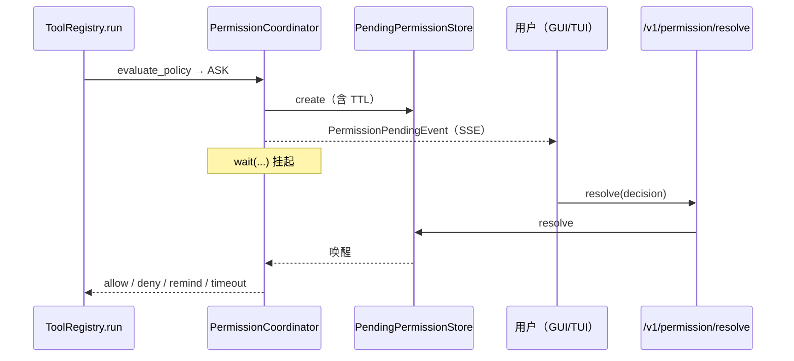
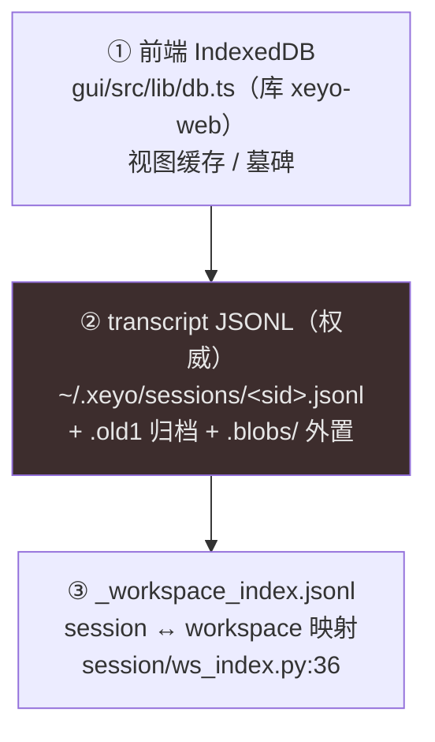

# XEYO 面试知识书 · 第四册 · 安全与一致性

> 覆盖系统：**S12 权限裁决与授权存储**、**S13 会话状态与转录持久化**、**S25 工作区一致性**
> 覆盖功能：**F053–F059、F064**
> 对应岗位能力：AG-10（安全 / 权限 / 隔离 / 限流）
>
> **本册含 4 处「认知裁决」**——两处是第一阶段遗留的分歧定论，两处是本章取证中**子代理给出相反结论、经我逐行亲读源码后驳回**。所有裁决都附裁决依据。
> 全程未读 `docs/`。

---

## 目录

- [第 9 章 · S12 权限裁决与授权存储](#第-9-章--s12-权限裁决与授权存储)
- [第 10 章 · S13 会话持久化 / S25 工作区一致性](#第-10-章--s13-会话持久化--s25-工作区一致性)
- [本章的 4 处认知裁决](#本章的-4-处认知裁决)
- [功能分册（F053–F059 / F064）](#功能分册f053f059--f064)

---

# 第 9 章 · S12 权限裁决与授权存储

## 9.1 定位

**所有工具调用的安全决策层**。它是 `ToolRegistry.run`（第三册 §7.2）中的第 4 步，也是**唯一有权决定「放行 / 询问 / 拒绝」的地方**。

**一句话记住它的位置**：`readonly_gate`（只读门禁，最外层）→ **`evaluate_policy`（三态裁决）** → 执行。

## 9.2 决策模型

### 9.2.1 三态枚举（真实位置在 `filesystem.py`，不在 `policy.py`）

```python
# python/permissions/filesystem.py:32-35
class PermissionDecision(str, Enum):
    ALLOW = "allow"
    DENY = "deny"
    ASK = "ask"
```

**⚠ 注意**：这个枚举定义在 `filesystem.py`，不在 `policy.py`。面试时如果说「`policy.py` 里定义了 ALLOW/ASK/DENY」，方向是对的但位置不准。

### 9.2.2 ⚠ 裁决分支数与第一阶段口径的纠正

第一阶段我写的是「**8 支裁决**」。**逐行取证后这个数字没有源码依据**——`evaluate_policy_impl`（`policy.py:1391`）是一条**顺序判定链**，实测 **11 个判定点**：

| 序 | 判定点 | 行号 | 结果 |
| --- | --- | --- | --- |
| 1 | `deny_tools`（工具级硬拒） | `~:1404` | DENY |
| 2 | `mcp__*`（原生 MCP 工具） | `:1414` → `_evaluate_mcp:1150` | 三态 |
| 3 | `Mcp` 网关工具 | `:1419` → `_evaluate_mcp_gateway:1217` | 三态 |
| 4 | `_ALWAYS_ALLOW` | `:1421` | ALLOW |
| 5 | `_OUTBOUND_ASK_TOOLS`（SendToWeChat / WebFetch / WebSearch） | `:1429` | ASK |
| 6 | `_UI_ASK_TOOLS`（XeyoUI） | `:1477` | ASK |
| 7 | `Agent` | `~:1481` | 三态 |
| 8 | `Bash` | `:1500` → `_evaluate_bash:822` | 三态 |
| 9 | `_READ_PATH_TOOLS`（Read） | `:1502` | 三态 |
| 10 | `_WRITE_PATH_TOOLS`（Write / Edit / Memory） | `:1545` | 三态 |
| 11 | unknown（兜底） | `~:1699` | **ASK** |

**入口分两层**：`evaluate_policy`（`:1319`，包 grant store 钩子）→ `evaluate_policy_impl`（`:1391`，真正分派）。

**正确表述**：「**11 个判定点**，按工具族归并后是 Bash / Write+Edit / Read / MCP（两个子支）/ 其他 五族」。
**⚠ 另一个细节纠正**：**`Edit` 没有独立分支**——它和 `Write` / `Memory` 一起归入 `_WRITE_PATH_TOOLS`（`:1545`），其中 `Write` 有特判（`:1592`）、`Memory` 有特判（`:1547`）。

**兜底是 ASK 而不是 ALLOW**——这是一个安全默认（fail-closed by default）。**新增工具如果忘了配元数据，结果是「每次都要问用户」，而不是「静默放行」。**

### 9.2.3 `readonly_gate`（最外层门禁）

`policy.py:417-434`：

| 条件 | 结果 |
| --- | --- |
| `profile == "readonly"` 且工具在 `READONLY_ALLOW ∪ READONLY_ASK_ALLOW` 或 `is_read_only()` | 放行 |
| `profile == "readonly"` 其他 | 拒（`readonly_mode_deny`） |
| 非 readonly 且 `agent_mode == "agent"` | 放行 |
| 其他 | 走 `tool_allowed_in_mode` |

**「只读档」的语义是「按工具自报的只读性判定」**——注意它信任的是 `Tool.is_read_only()`（`base_tool.py:36`）。**这是一个信任边界**：工具自报只读就会被当成只读。所以 `is_read_only()` 的实现必须保守（宁可说自己是可写）。

## 9.3 ASK 挂起与放行（人在环）

### 9.3.1 三类挂起共用一个范式



| 组件 | 位置 | 关键符号:行号 |
| --- | --- | --- |
| 协调器 | `engine/permission_coordinator.py`（**在 engine/，不在 permissions/**） | `class PermissionCoordinator:38`；`request:56`；`wait:137`；`resolve:206` |
| 挂起存储 | `permissions/store.py` | `PendingPermission:33`；`PendingPermissionStore:61` |
| 提问存储（同族） | `permissions/ask_store.py` | `PendingAsk:20-32`；`PendingAskStore:35`；`create:43`；`pending_for_session:73`；`resolve_answer:80`；`wait:104` |
| TTL | `permissions/pending_ttl.py` | `PENDING_PANEL_TTL_SECONDS=180.0:20`；`PENDING_DANGER_TTL_SECONDS=60.0:21`；`PENDING_REMINDER_BEFORE_S=30.0:22`；`ttl_for_request:41` |

**TTL 分级的判据**（`ttl_for_request`，`:41`）：命中 **danger / secret / protected** → 60 秒；否则 180 秒。**危险操作的确认窗口更短**——这是一个反直觉但对的设计：危险操作拖越久，越可能「用户没看清单就点了同意」。

**`request` 的副作用**（`:56`）：建挂起 + `set_status("waiting_permission")` + emit `PermissionPendingEvent`。**`wait` 的返回值有四种**（`:137`）：`allow` / `deny` / `remind` / `timeout`——**`remind` 是「提醒」而非「裁决」**，因此 `PENDING_REMINDER_BEFORE_S=30` 的存在意义是「快超时了先催一次」。

**兼容 API**：`gate.py:44` `can_use_tool` 是二元兼容口——**ASK 会被当成 DENY**。也就是说老调用方看到的是 fail-closed 行为。

### 9.3.2 审批模式的「活状态」

`begin_permission_turn(session_id)`（`policy.py:229`），由 `query_loop.py:763` **每轮开头**调用。

用途：**在 turn 边界拍基线**——**收紧即时生效、放宽延后生效**。

**为什么需要这个不对称**：如果用户在一轮中间把权限从「宽松」改成「严格」，但引擎还在用旧档位跑，那么「用户以为已经收紧了」与「实际还在宽松」之间就有一个窗口。**「收紧即时、放宽延后」把危险方向的窗口清零，只允许安全方向有延迟。** 这是一个很成熟的权限设计原则（对标 SELinux 的 boolean 语义设计）。

## 9.4 Bash 命令策略（含 C-07 实证）

### 9.4.1 结构

| 项 | 符号:行号 | 说明 |
| --- | --- | --- |
| 危险规则表 | `_DENY_RULES:20-106` | `(regex, reason)` 元组列表 |
| 只读白名单 | `_READONLY_BASES:109+` | `echo/pwd/ls/cat/head` 等 |
| 拒绝原因查询 | `bash_deny_reason:568` | 遍历 `_DENY_RULES`，返回首个命中 reason |
| 只读放行判定 | `bash_readonly_allow:631` | 非复合 + 无重定向 + 无密钥引用 + `bash_rule_decision=="allow"` 才 True |
| 写判定 | `policy.py:785` `_bash_writes_file` | `rm` 被判为写操作 |

**`_DENY_RULES` 覆盖的族**：`rm -rf` 打根盘 / `format` / `mkfs` / `shutdown` / 远程执行（remote_exec）/ fork 炸弹 / `dd` / Windows `del`·`rd`·`remove-item` 打根盘 / `certutil` / UNC 路径。

### 9.4.2 ⚠ C-07 定论：`rm -rf .` 与 `rm -rf *` 确实不被硬拒

**裁决依据（逐行读正则）**：`destructive_root_delete` 的两条正则（`bash_policy.py:21-36`）**都要求 `rm -rf` 后的路径以 `/` 或 `\` 开头，或带 `--no-preserve-root`**。`.` 与 `*` **都不命中**；UNC / `rd` / `rmdir` 规则（`:73`、`:103`）同样不命中。

**因此流向**：两个命令**不触发 DENY**，而是进入 `_evaluate_bash` 的写路径判定 → 目标是 `.` / `*`，在 workspace 内 → **default 模式下给 ALLOW 或 ASK；`never`/`allow`/`max` 档位直接 ALLOW**。

**结论**：
1. **「Bash 有全量危险命令静态拦截」这个说法不成立。**
2. `rm -rf .` / `rm -rf *` 在默认档可能**直接 ALLOW**，且**绕过 `.git` / `.xeyo` 元数据守卫**（因为守卫是绑在路径判定上的，而 `.` 不是具体路径）。
3. 这是一个**真实的、可复现的安全缺口**，应优先修。

**面试怎么讲这题**（这是安全题的加分点）：

> 我们的 Bash 策略是一张正则黑名单 + 一张只读白名单 + 默认档位判定。**但我要主动指出一个已知缺口**：黑名单里的「删根盘」规则要求路径以 `/` 或 `\` 开头、或者带 `--no-preserve-root`，所以 `rm -rf .` 和 `rm -rf *` 都不命中。
> 它们会流入常规的写路径判定——目标是当前目录、在工作区内，所以**默认档可能直接放行**，而且因为 `.` 不是一个具体路径，`.git`/`.xeyo` 的元数据守卫也不生效。
> 两层缓解存在但都不够：执行前快照（`destructive_guard`）有 50 文件 / 10MB 限额；权限层是全仓唯一的决策点。**结构性修法是把「破坏性判定」抽成一份权威规则表，让权限层和快照层共用，并且判定对象从「字面路径」改成「解析后的实际影响集合」**——因为 `.` 和 `*` 的危害只有展开后才知道。

**这段回答的杀伤力**：① 给出精确的绕过原理（正则锚定方式）；② 解释为什么守卫会失效（路径 vs 通配符）；③ 给出结构性修法而不是打个补丁。

## 9.5 路径边界与密钥保护

| 项 | 符号:行号 | 说明 |
| --- | --- | --- |
| 主边界判定 | `filesystem.py:127-154` `path_in_allowed_working_path` | 双向 `os.path.realpath`（`:139-147`） |
| **符号链接防护** | 同上 | **是**（双向 realpath 比对） |
| 危险文件清单 | `DANGEROUS_FILES:68-85` | `.env` / `.env.local` / `.env.production` / `.gitconfig` / `.netrc` / `id_rsa` / `id_ed25519` … |
| 危险目录清单 | `DANGEROUS_DIRECTORIES:88-96` | `.git` / `.ssh` / `.kube` / `.gnupg` / `.aws` |
| 密钥目录 | `_SECRET_DIRECTORIES:101-108` | — |
| 密钥判定（硬 DENY） | `is_secret_path:157`（拒 `.env*` 任意变体，`:163-168`） | 硬拒 |
| 危险路径判定 | `is_dangerous_path:178` | — |
| 写作用域 | `write_scope.py` | `_write_scope_ctx:15`（ContextVar）；`normalize_worker_scope:46`；`path_in_write_scope:106-145`；`write_scope_deny_reason:148` |
| 策略文件保护 | `workspace_policy.py` | `POLICY_FILENAME=".xeyo-policy.json":22`；`is_policy_file:250-257` |

**三个值得讲的点**：

1. **符号链接防护是双向 realpath**（`:139-147`）——不只是把目标 realpath 化，也把允许根 realpath 化。**单向 realpath 会被「允许根本身是符号链接」绕过。**
2. **`.env*` 是「任意变体硬 DENY」**（`:163-168`）——不是枚举 `.env` / `.env.local`，而是按前缀匹配。**枚举式清单永远会漏。**
3. **写作用域的粒度是「路径前缀」**（`write_scope.py`），且 `normalize_worker_scope`（`:46`）会把 `.` 与盘根**收束为只读**——**子代理拿不到全盘写权**。

**`write_scope` 用 ContextVar 而不是参数传递**：与第三册的 `container_routing` / `progress_sink` 同一模式——**asyncio 并发下每个协程上下文独立**，避免子代理的作用域串台。

## 9.6 授权指纹（always-allow 的凭据体系）

| 项 | 符号:行号 | 说明 |
| --- | --- | --- |
| 授权记录 | `PermissionGrant:275`；`PermissionGrantStore:295` | — |
| **MCP 指纹版本** | `_MCP_FP_VERSION="v2":441` | — |
| **MCP 指纹算法** | `mcp_grant_fingerprint:444-456` | `"v2:" + sha256(json.dumps(["mcp-tool", name]))[:32]` |
| fail-safe | 同上 | 非 `mcp__` 工具返回**空串** |
| 指纹选择 | `grant_fingerprint:459` | Bash 用 `program + 首参数`；其他用 `matched_rule` |
| 匹配 | `match:364-389` | tool_name + fingerprint + scope |
| **参数不进指纹** | `canonical_args:419` | 注释明确「v2 指纹不含 args」 |

**「参数不进指纹」是一个安全设计的关键决策**（对应 AGENTS.md「注入免疫」）：

> 如果指纹包含参数，那么「同样的工具、同样的授权、但参数被模型改写」就会重新触发 ASK——表面上更严格，实际上引入了**注入面**：攻击者只要能影响参数，就能让授权失效或生效。
> XEYO 的选择是**指纹只认「身份」**（工具名 / MCP 注册名），不认「这一次调用长什么样」。**授权是「我允许你用这个工具」，不是「我允许你这一次这样用」。**

**指纹的粒度差异**：Bash 用 `program + 首参数`（比 MCP 更细），因为「允许 `git status`」不应该等于「允许所有 git 子命令」。其余工具用 `matched_rule`。

**v1 → v2 的破坏性变更**：源码里 `v2:` 前缀的作用之一就是**让 v1 的旧凭据自动失效**——不需要写迁移代码，指纹天然不匹配。

## 9.7 权限预设与档位（C-02 定论）

| 层 | 常量 | 值 | 行号 |
| --- | --- | --- | --- |
| 权限预设（Python） | `PERMISSION_PRESETS` | `{"readonly", "workspace-write", "full"}` | `presets.py:11` |
| 默认预设 | `DEFAULT_PRESET` | `"workspace-write"` | `presets.py:12` |
| 审批严格度 | `_STRICTNESS` | `{"always": 3, "risk": 2, "never": 1}` | `runtime_mode.py:26` |
| 审批模式（前端） | `PermissionMode` | `'always' \| 'risk' \| 'never'` | `gui/src/stores/settingsStore.ts:18` |

**⚠ C-02 定论**：

1. **前端与后端一致**——`settingsStore.ts:18` 的三种模式与 `runtime_mode.py:26` 的 `_STRICTNESS` 键**完全相同**。
2. **`default` / `acceptEdits` / `plan` / `bypass` 在两层都不存在**。这组命名来自 **Claude Code**，不是 XEYO 的。
3. `PERMISSION_PRESETS` 的三档（`readonly` / `workspace-write` / `full`）是**Python 内部概念，前端未直接暴露**。

**面试风险**：如果按 Claude Code 的术语说「我们支持 plan / acceptEdits / bypass 模式」，会与 XEYO 实现不符。**正确表述**：
> 我们有两套正交的档位。一套是**权限预设**：`readonly` / `workspace-write` / `full`（`presets.py:11`，默认 `workspace-write`）。另一套是**审批严格度**：`always` / `risk` / `never`（`runtime_mode.py:26` 的 `_STRICTNESS` 映射为 3/2/1，`always` 最严）。前端只暴露后者。

## 9.8 设计取舍

| 决策点 | 采用 | 被否决 | 证据 / 理由 |
| --- | --- | --- | --- |
| 未知工具兜底 | **ASK** | ALLOW | `policy.py:~1699` |
| 指纹含参数 | **不含**（只认身份） | 含参数（更细但引入注入面） | `store.py:419/444` |
| 指纹版本策略 | 加 `v2:` 前缀使 v1 自然失效 | 写迁移代码 | `store.py:441` |
| 危险操作 TTL | **60s（更短）** | 与普通同级 180s | `pending_ttl.py:20/21` |
| 审批模式切换 | **收紧即时、放宽延后** | 立即双向生效 | `policy.py:229`；`query_loop.py:763` |
| 只读档判定 | 信任 `Tool.is_read_only()` | 引擎侧静态白名单 | `policy.py:417-434` |
| 符号链接防护 | **双向 realpath** | 单向 | `filesystem.py:139-147` |
| 密钥保护 | **前缀硬 DENY** | 枚举清单 | `filesystem.py:163-168` |
| `.env` 变体 | 任意变体硬拒 | 枚举 `.env`/`.env.local` | 同上 |
| 子代理作用域 | ContextVar + 盘根收束只读 | 参数传递 + 允许宽作用域 | `write_scope.py:15/46` |

## 9.9 面试题 + 回答模板

### Q1：你的权限系统怎么设计？

**回答模板**：
> 分四层，从外到内：
> **第一层 `readonly_gate`（`policy.py:417`）**——只读档门禁，按工具自报的 `is_read_only()` 判定。
> **第二层 `evaluate_policy`（`policy.py:1319` / `impl:1391`）**——三态裁决 `ALLOW` / `DENY` / `ASK`（枚举在 `filesystem.py:32`）。入口包一层 grant store 钩子，先看有没有可复用的授权。实测 **11 个判定点**，按族归并是 Bash / Write+Edit / Read / MCP / 其他。**兜底是 ASK 不是 ALLOW**——忘了配元数据的新工具会「每次都要问」，而不是静默放行。
> **第三层 `ASK` 挂起**——`PermissionCoordinator` 建挂起项、发 `PermissionPendingEvent`、`wait` 阻塞等待 resolve。**TTL 分级：普通 180 秒，危险操作 60 秒**（`pending_ttl.py:20/21`）。危险操作窗口更短是有意的——拖越久，用户越可能不看清单就点同意。
> **第四层 always-allow 凭据**——授权指纹 `v2:` + sha256，**签名里只有工具身份，不含参数**。

**追问 1**：为什么指纹不含参数？
> 因为含参数会引入注入面。如果指纹依赖参数，那么「只要能影响参数」就能让授权失效或生效——而参数恰恰是模型可以自由生成的。**授权应该是「我允许你用这个工具」，不是「我允许你这一次这么用」。**
> 代价是粒度粗了一点（Bash 例外，它用 `program + 首参数`，因为「允许 `git status`」不该等于「允许所有 git 子命令」）。

**追问 2**：为什么「收紧即时、放宽延后」？
> 因为两个方向的**风险不对称**。收紧晚一轮生效 = 危险方向有窗口；放宽晚一轮生效 = 只是慢了一点。所以我们在 turn 边界拍基线（`begin_permission_turn`，`policy.py:229`，由 `query_loop.py:763` 每轮调），让收紧立刻生效、放宽下一轮生效，**把危险方向的窗口清零**。

**追问 3**：如果模型反复请求同一个被拒的操作呢？
> 会有 `RepeatCallGuard`（`repeat_guard.py`，阈值 `[3,5,8]`）发中性提醒，但**只提醒不拒执行**。真正的拦截在权限层：如果一直是 DENY，模型每次都拿到 DENY。**引擎的逻辑是「限制在执行层持续表达，不在注意力里说教」**——所以是「持续静默拒绝」，不是「告诉模型别再试了」。

### Q2：$（安全场景题）用户说「帮我清理一下项目里的无用文件」，模型执行了 `rm -rf .`，你怎么防？

**回答模板**（这题必须诚实）：
> 先说结论：**我们现在防不住这个场景**，这是审计里明确记录的缺口。
> 原因很具体：Bash 的危险规则表用的是锚定正则，删根盘的规则要求 `rm -rf` 后的路径**以 `/` 或 `\` 开头、或带 `--no-preserve-root`**。`.` 和 `*` 都不命中，所以不触发 DENY，而是流入常规写路径判定——目标是当前目录、在工作区内，**默认档可能直接 ALLOW**。
> 而且因为 `.` 不是一个具体路径，`.git` / `.xeyo` 的元数据守卫也不生效。执行前的快照（`destructive_guard`）有 50 文件 / 10MB 上限，覆盖不了整仓删除。
> 正确的修法不是再加一条正则（那是补丁），而是**把判定对象从「命令字面量」改成「解析后的实际影响集合」**：把 `.` 和 `*` 展开，得到真实文件集，再看这个集合是否包含受保护路径、是否超出授权作用域。这份判定应该由权限层和快照层共用，而不是各写一套。

**追问**：为什么不直接禁掉 `rm -rf`？
> 因为 `rm -rf` 有合法用途（清 `node_modules`、清构建产物）。禁掉会让 Agent 变残废。**正确的方向是「按影响面判定」而不是「按命令名判定」**——这也是为什么我说要展开通配符。判定「要删 20000 个文件」和「要删 3 个文件」应该是不同的决策，而不该由 `rm` 这个字决定。

---

# 第 10 章 · S13 会话持久化 / S25 工作区一致性

## 10.1 S13 会话持久化

### 10.1.1 三层数据模型（真实路径常量）



| 层 | 路径 / 位置 | 定义点 |
| --- | --- | --- |
| ① 前端 IndexedDB | `gui/src/lib/db.ts`（库名 `xeyo-web` v4） | 见第八册 S31 |
| ② 权威 transcript | `~/.xeyo/sessions/<sid>.jsonl`（`XEYO_SESSIONS_DIR` 可覆盖） | `session/persistence.py:36`（`default_sessions_dir:34-39`）、`:60`（`transcript_path`） |
| ② 归档 | `<name>.jsonl.old1`（…`.oldN`） | `record_transcript.py:64-78` |
| ② 大内容外置 | `<stem>.blobs/{id}.json`（≥32KB） | `session/transcript_blobs.py:15`（`blob_threshold_bytes`）、`:79`（`row_from_message`） |
| ③ 工作区索引 | `_workspace_index.jsonl` | `session/ws_index.py:36`（`index_path`）、`:81`（`record_session_workspace`） |

**「权威」二字很关键**：事件流是给 UI 的，快照是给崩溃恢复的，**只有 transcript 是真相**。这决定了：回溯（rewind）要改历史，必须动 transcript；UI 缓存损坏了可以直接重建。

### 10.1.2 消息存储

| 符号 | 行号 | 说明 |
| --- | --- | --- |
| `MessageStore` | `session/message_store.py:6` | **内存版** |
| `append` | `:11` | 追加 |
| `insert` | `:15` | 插入（配对修复用，见第一册） |
| `replace` | `:20` | 替换（回溯用） |
| `as_api_messages` | `:32` | 转成 API 形 |

**`MessageStore` 是内存版，JSONL 是它的落盘版**——两者不是「两套实现」，而是「同一份数据的两种形态」。

**持久化开关**：`session/persistence.py:30` `should_persist`。

### 10.1.3 ⚠ C-05 定论：归档链方向确实写反（只保 1 代）

> **本章取证中，子代理给出「保 2 代，非 1 代」的相反结论。我逐行亲读源码后驳回，维持第一阶段结论。**
> 以下是裁决依据（源码 `record_transcript.py:64-97`）。

```python
_ROTATION_KEEP = 2                                                    # :65

def rotated_transcript_paths(path: Path) -> list[Path]:
    """按「最旧 → 最新」返回全部归档路径（不检查存在性）。"""
    return [path.with_name(path.name + f".old{i}")
            for i in range(_ROTATION_KEEP, 0, -1)]                    # :70-73
    # range(2, 0, -1) = [2, 1]  ⇒  返回 [.old2, .old1]（最旧 → 最新）✔

def _maybe_rotate(path: Path) -> None:
    olds = rotated_transcript_paths(path)      # [.old2, .old1]
    oldest = olds[0]                           # .old2
    if oldest.is_file():
        oldest.unlink()                        # 删最旧 ✔
    for i in range(len(olds) - 1):             # range(1) = [0]
        if olds[i].is_file():
            os.replace(olds[i], olds[i + 1])   # .old2 → .old1  ✘ 方向反
    os.replace(path, olds[-1])                 # current → .old1 ✘ 覆盖掉上一步
```

**推演**：
1. 删 `.old2`（正确）。
2. 若 `.old2` 存在，把它 `os.replace` 成 `.old1`——**这是「最旧 → 最新」的方向，完全错误**（正确应为 `.old1 → .old2`，即 `olds[i+1] → olds[i]`）。
3. 最后 `os.replace(path, olds[-1])` = `current → .old1`——**直接覆盖上一步的结果**。

**净效果**：`.old2` 从不产生；每次轮转都覆盖 `.old1`。**实际只保 1 代归档**，`_ROTATION_KEEP = 2` 名不副实。

**而意图是 2 代**——两处注释都写了「保留 2 代归档，可跨轮转恢复」（`:51`）与「`.old1←current，依次后移`」（`:82`）。

**结论**：**「intent = 2，actual = 1」**。所以「transcript 保留 N 代」**不可作为事实讲**。

**面试怎么讲**（这是一个很漂亮的「读代码发现 bug」故事）：

> 我们 transcript 落盘有个轮转机制：文件超 32MB（`XEYO_TRANSCRIPT_MAX_BYTES` 可配）就轮转，设计上保 2 代归档。**我在读代码时发现这个链的方向写反了。**
> `rotated_transcript_paths` 返回的是「最旧 → 最新」（`.old2`, `.old1`）。要正确移位，应该是把较新的挪到较旧的槽位，也就是 `olds[i+1] → olds[i]`。但代码写的是 `olds[i] → olds[i+1]`——**正向搬移**，把最旧的搬到最新的槽位。
> 更致命的是最后一行 `os.replace(path, olds[-1])` 把当前文件覆盖到 `.old1`，**正好把上一步刚搬过去的内容盖掉**。净效果是 `.old2` 从不产生，每次轮转都覆盖 `.old1`——**名义 2 代，实际 1 代**。
> 这也说明一件事：**这行代码永远测不出来，除非有一个「轮转 3 次然后检查每一代内容」的测试**。普通的「轮转一次能恢复」测试会全绿。

**这段回答为什么好**：① 说清方向而不是只说「有 bug」；② 指出「最后一行把上一步结果盖掉」这个真实致命点；③ 主动上升到**测试设计**——「为什么这类 bug 需要三轮转测试」。**这是资深工程师的思维层次。**

### 10.1.4 ⚠ writer 批次失败语义（同样亲读裁决）

> **本章取证中，子代理给出「失败批不推进 `_written_seq`（保守）」的相反结论。逐行亲读后驳回。**

```python
def _writer_loop() -> None:
    global _written_seq
    while True:
        with _cv:
            ...
            batch = list(_pending); _pending.clear()
            max_seq = batch[-1][0]
        try:
            _write_batch(batch)
        except Exception:                                       # :136
            _logger.debug("transcript writer batch failed", exc_info=True)   # :137
        with _cv:                                               # :138 —— 在 try 之外
            _written_seq = max(_written_seq, max_seq)           # :139 —— 无条件推进
            _cv.notify_all()
```

**关键在缩进**：`with _cv: _written_seq = max(...)`（`:138-139`）**位于 `try/except` 之外**，所以**无论 `_write_batch` 成功还是抛异常，`_written_seq` 都会推进**。

**后果链**：
1. `_write_batch` 抛异常（例如磁盘满、权限错）→ 只 `_logger.debug`（debug 级，生产日志默认看不到）→ **该批数据永久丢失**（`_pending` 已在 `:132` 被 `clear()`）。
2. `_written_seq` 仍推进 → `flush_pending_sync`（`:183-191`）的循环条件 `while _written_seq < _submitted_seq` **立刻满足退出** → **返回 `True`**。
3. 调用方（`flush_transcript()`）看到 `True`，认为「已落盘」→ **假成功**。

**结论**：**「writer 批次失败 → flush 假成功 → 静默丢整回合」成立。**

**修法方向**：把 `_written_seq` 的推进移进 `try` 的成功分支；失败时**保留 `_pending` 内容以便重试**，并让 `flush_pending_sync` 返回 `False`。

**⚠ 但要给一个平衡的评价**：源码同时做了正确的部分——`_write_batch` 里有 `os.fsync(f.fileno())`（`:156`），注释写着「崩溃窗口不丢会话尾部（G107）」；`_disk_lock`（`:39`）让「rotate + append」处在同一临界区，注释解释「防止写者把行追加进已轮转的归档」。**所以这不是「没想过一致性问题」的代码，而是「想了但漏了一个失败分支」。** 面试时这个区分很重要。

### 10.1.5 加载与恢复

| 项 | 符号:行号 | 说明 |
| --- | --- | --- |
| 恢复入口 | `hydrate.py:150` `load_session_messages` | — |
| JSONL → 消息 | `hydrate.py:119` `messages_from_transcript` | 合并**归档 + 当前**（`transcript_read_paths`，`record_transcript.py:100`） |
| surface 折叠 | `hydrate.py` 内 `fold_surface_rows`（`surface.py:68`） | — |
| 未闭合修复 | `hydrate.py:73` `_repair_unclosed_tool_uses` | 补 tool_use 配对 |
| 丢弃归档（回溯用） | `record_transcript.py:105` `discard_rotated_transcripts` | 注释：防「rollback 截断后 GET/hydrate 把已删回合再拼回来」 |

**`discard_rotated_transcripts` 是一条很值钱的证据**：它说明团队**意识到了「归档会让被删的回合复活」**这个具体问题，并专门写了函数处理。**这是「回滚与归档的交互」这种二阶问题的处理——比单纯实现回滚难得多。**

### 10.1.6 其他会话模块

| 文件 | 一句话职责 | 关键符号:行号 |
| --- | --- | --- |
| `state.py` | 会话状态容器（cwd / messages / budget / abort + transcript 游标） | `SessionState:29`；`apply_cwd:78` |
| `surface.py` | 回溯可见面折叠（append-only JSONL 是唯一真相） | `SURFACE_TYPE="surface_op":32`；`fold_surface_rows:68` |
| `transcript_blobs.py` | ≥32KB 内容外置为独立文件 | `blob_threshold_bytes:15`；`row_from_message:79` |
| `cwd.py` | 会话 cwd shim | `set_cwd:44` |
| `workspace_path.py` | 物理路径解析 | `resolve_physical_cwd:23`；`xeyo_data_root:54`（`~/.xeyo`） |
| `ws_index.py` | session ↔ workspace 映射 | `index_path:36`；`record_session_workspace:81` |

## 10.2 S25 工作区一致性

### 10.2.1 presence：谁在写什么

| 项 | 符号:行号 | 说明 |
| --- | --- | --- |
| 在场条目 | `SessionPresenceEntry:74` | 含 `busy:78`、`owned_files:80`（rel_path → ts）、`git_op` |
| 状态容器 | `PresenceState:140` | — |
| 注册表 | `SessionPresenceRegistry:549` | — |
| 标忙 | `touch_busy:213` / `:561` | — |
| **占有者查询** | `owner_of:417` / `:644` | 优先 busy；只在 `FILE_OWNERSHIP_TTL_SEC=600:23` 内有效 |
| 冲突提示 | `peer_activity_block:747` | 生成「多会话交叉活动」块（T_now `peer_presence`） |

**文件占有 = 写后登记**（`owned_files`）。**TTL 600 秒**——即「10 分钟内的写入算占有着」。

**⚠ 一个必须澄清的点**：**心跳/租约不在 `session_presence.py` 里，在 `workspace_lock.py` 里**。第一阶段把 heartbeat 归到 presence 是错的。

### 10.2.2 workspace_lock：租约锁

| 项 | 符号:行号 | 说明 |
| --- | --- | --- |
| 锁类 | `WorkspaceLock:30` | — |
| **粒度** | **工作区级**（不是文件级） | 锁文件 `.xy-shadow-git/workspace.lock`（`:65`） |
| 心跳 sidecar | `workspace.lock.{lease_id}.heartbeat`（`:73`） | — |
| 获取 | `acquire:217` | 用 `O_EXCL` **原子建锁** |
| TTL | `ttl_seconds` 默认 **30.0**（`:43`） | — |
| 心跳间隔 | `min(max(ttl/3, 0.1), 5.0)`（`:55-59`） | 自适应 |
| 过期判定 | `_lock_file_is_stale:109-111` | 按 mtime ≥ ttl |
| 释放 | `release:286` | 关心跳线程 + `unlink`（`:307`） |

**三个设计要点**：

1. **`O_EXCL` 原子建锁**——用文件系统原语做互斥，不依赖第三方锁库，也不需要常驻进程。
2. **租约 + 心跳**而不是「纯锁」——因为**进程崩溃会留下死锁**。用「mtime + TTL」判定过期，让崩溃的持有者自动被回收。心跳间隔自适应（TTL/3，夹在 0.1~5 秒）——**TTL 短就心跳快，避免「租约还没到期心跳还没发」的假过期**。
3. **粒度是工作区级**——这是一个保守选择：**粒度粗 = 并发度低，但正确性容易保证**。文件级锁需要处理「锁顺序 → 死锁」问题。

**面试可以主动说的取舍**：
> 我们的工作区锁是**整工作区粒度**，不是文件级。这是有意的保守：文件级锁需要定义加锁顺序，否则会死锁；而 Agent 的工作模式是「一次改一个功能」，整区锁的实际并发损失不大。**如果将来要支持高并发多 Agent 改同一仓，这一层必须重做。**

### 10.2.3 workspace_revision：无 git 的修订哈希

`calculate:76`：

1. 走 `ShadowGit`（`engine/shadow_git.py`，自管 repo）取 `head_commit`（空 → `"empty"`）。
2. 叠加 **lstat 元数据 token**（`_metadata_token:47-74`）：`status` / `size` / `st_mtime_ns` / `st_ctime_ns` / `st_mode`，symlink 额外记 target。
3. `sha256` → `rev_<16hex>`（`:103-109`）。

**语义差异**：
- `paths=None` → 用 `git status --porcelain` 列变更。
- `paths=()` → 只算 shadow HEAD。

**为什么用「lstat 元数据 token」而不是内容哈希**：内容哈希需要读全文，工作区可能有几十万文件。**mtime + size + ctime_ns + mode 的组合足以检测「有东西变了」**，而「变的是什么」由 shadow git 回答。**这是「先判断是否要做事，再决定做什么」的两级设计。**

**⚠ `st_ctime_ns` 的引入很关键**：在 Windows / Unix 上，`ctime` 会在「权限变更 / 硬链接数变更」时更新——也就是说，**改权限也会被识别为「修订变了」**，内容是内容哈希容易漏掉的一类变化。

## 10.3 面试题

### Q1：跨会话怎么防止两个 Agent 同时改同一个文件？

**回答模板**：
> 两层。**第一层是 presence（`session_presence.py`）**：写入后登记 `owned_files`，其他会话查询 `owner_of` 时能看到「这个文件 10 分钟内被谁改过」（TTL 600 秒，`:23`），并生成一条冲突提示块注入 T_now（`peer_activity_block:747`）。**注意这一层是「告知」而不是「阻塞」**——它让模型知道「有别人在动这个文件」，但不禁它。
> **第二层是租约锁（`workspace_lock.py`）**：整工作区粒度，用 `O_EXCL` 原子建锁（`:217`），TTL 默认 30 秒（`:43`）+ 后台心跳续租（间隔 `ttl/3`，夹在 0.1~5 秒）。**用租约而不是纯锁，是为了让崩溃的持有者能被自动回收**——纯锁在进程崩掉后会留下死锁。
> 另外还有读状态层的 stale 检测（`fileio/conflict.py:92`）：如果一个文件在「我读过之后」被别的会话改了 mtime，下次改它会被提示 stale。

**追问**：为什么第一层只告知不阻塞？
> 因为阻塞的代价很高——两个会话可能在改同一个文件的不同部分，或者一个只是读了一下。**用「阻塞」做保护会把误伤率放大**。我们选择让模型看到事实（「X 会话刚改过这个文件」），由它自己决定要不要先读一遍。
> 真正需要强保证的场景走第二层的租约锁。

### Q2：transcript 落盘是同步还是异步？怎么保证不丢？

**回答模板**（这题要**诚实**）：
> 异步批量。热点路径 `record_transcript` 只在主线程做去重记账并入队（`submit_async_append:170`），磁盘 IO 交给后台写入线程（`_writer_loop:122`），一次取一整批、按路径分组、`append` + `fsync`。`flush_transcript()` 阻塞等队列排空。
> **正确的地方**：`_write_batch` 里有 `os.fsync`（`:156`），注释写明「崩溃窗口不丢会话尾部」；`_disk_lock`（`:39`）把「轮转 + 追加」放进同一临界区，避免写者把行追加进已经轮转掉的归档。
> **但我要指出一个真实的缺陷**：`_written_seq` 的推进在 `try/except` **之外**（`record_transcript.py:138-139`）——所以**批次写失败的异常只被 debug 级日志记下，而 `_written_seq` 照样推进**。结果是 `flush_pending_sync` 立刻看到「全部落盘」并返回 `True`，**上层看到的是假成功，而那一批数据已经丢了**（`_pending` 在 `:132` 已 clear）。
> 修法是把序号推进移进成功分支、失败时保留队列可重试。**这个 bug 的价值在于它说明：异步 + 批量 + 哨兵序号的组合里，最危险的不是「忘了 fsync」，而是「成功判定和真实结果脱钩」。**

---

# 本章的 4 处认知裁决

| # | 事项 | 第一阶段 / 既有认知 | 本章取证结论 | 裁决 | 依据 |
| --- | --- | --- | --- | --- | --- |
| **D-1** | 权限裁决分支数 | 「8 支裁决」 | **无源码依据**；`evaluate_policy_impl` 有 11 个判定点 | 修正为「11 个判定点，五族」 | `policy.py:1391/1404/1414/1419/1421/1429/1477/1481/1500/1502/1545/1699` |
| **D-2** | 权限预设命名（C-02） | 代码只有 `readonly/workspace-write/full` + `always/risk/never`；`default/acceptEdits/plan/bypass` 不存在 | **结论维持并加强**：前端 `settingsStore.ts:18` 与后端 `runtime_mode.py:26` **完全一致**；后四个名字两层都无（源自 Claude Code） | 维持 | `presets.py:11/12`；`runtime_mode.py:26`；`gui/src/stores/settingsStore.ts:18` |
| **D-3** | transcript 归档代数（C-05） | 方向写反，实际只保 **1 代** | **子代理给出「保 2 代」的相反结论 → 我逐行亲读源码后驳回，维持「只保 1 代」** | 维持（驳回子代理） | `record_transcript.py:64-97`（推演见 §10.1.3） |
| **D-4** | writer 失败是否推进 `_written_seq` | 失败仍推进 → `flush` 假成功 | **子代理给出「不推进」的相反结论 → 亲读驳回，维持「推进」** | 维持（驳回子代理） | `record_transcript.py:134-140`（缩进裁决，见 §10.1.4） |

**D-3 / D-4 的方法论意义**：这两个结论都**不能靠「读懂大意」得到**——D-3 需要把 `range(2,0,-1)` 的返回顺序、循环方向、和最后一行 `os.replace` 的覆盖关系在脑内推演一遍；D-4 需要**看缩进**（`with _cv:` 在 `try` 之外）。**子代理两次都读错，说明「行号级取证」和「语义级裁决」必须分开做：前者可以外包，后者不能。** 这条方法论本身就是本册最值得带走的收获。

---

# 功能分册（F053–F059 / F064）

| 编号 | 功能 | 目标 | 调用链（行号） | 契约 / 配置 | 异常路径 | 面试亮点 | 证据 |
| --- | --- | --- | --- | --- | --- | --- | --- |
| **F053** | 权限三态裁决 | ALLOW/ASK/DENY | `tool_registry.py:419` `evaluate_policy` → `policy.py:1319` → `:1391` `impl` → 11 判定点 | 枚举在 `filesystem.py:32-35`；入口包 grant 钩子 | 未知工具 → **ASK**（fail-closed） | 兜底是 ASK 不是 ALLOW | `policy.py:1319/1391`；`filesystem.py:32-35` |
| **F054** | ASK 挂起与放行 | 用户确认 | `permission_coordinator.py:56` `request` → `:137` `wait` → `:206` `resolve`；`store.py:61`；`routers/control.py` resolve 端点 | TTL：普通 180s / 危险 60s / 提醒 30s | 超时 → `timeout`；兼容 API `gate.py:44` 把 ASK 当 DENY | 危险操作窗口更短（防「不看清单就点」） | `permission_coordinator.py:56/137/206`；`pending_ttl.py:20/21/22/41`；`store.py:61` |
| **F055** | 授权指纹与凭据复用 | always-allow | `store.py:459` `grant_fingerprint` → `:444` `mcp_grant_fingerprint` → `:364` `match` | `_MCP_FP_VERSION="v2"`；**不含 args** | 非 `mcp__` → 空串（fail-safe） | 指纹只认身份 → 注入免疫 | `store.py:275/295/364/419/441/444/459` |
| **F056** | 路径边界与密钥保护 | 逃逸防护 | `filesystem.py:127` `path_in_allowed_working_path` → `:157` `is_secret_path` / `:178` `is_dangerous_path` | `.env*` 任意变体硬 DENY | — | **双向 realpath** 防「允许根本身是符号链接」 | `filesystem.py:32-35/68-108/127-154/157/163-168/178` |
| **F057** | 写作用域（子代理） | scope 门禁 | `write_scope.py:106` `path_in_write_scope` → `:148` `write_scope_deny_reason` | ContextVar `:15`；路径前缀粒度 | `.`/盘根 → 收束为只读（`:46`） | ContextVar 防子代理作用域串台 | `write_scope.py:15/46/106/148` |
| **F058** | 工作区策略文件保护 | 禁写 `.xeyo-policy.json` | `workspace_policy.py:250` `is_policy_file`；`policy.py:1092` `_bash_touches_policy_file` → `:859-865` DENY | `POLICY_FILENAME:22` | Write/Edit 写组硬拒 + Bash 分支 DENY | **默认安全配置不可被配置覆盖** | `workspace_policy.py:22/250-257`；`policy.py:859-865/1092` |
| **F059** | 权限预设与审批模式 | 档位切换 | `presets.py:11/12`；`runtime_mode.py:26`；`policy.py:229` `begin_permission_turn` ← `query_loop.py:763` | preset：`readonly`/`workspace-write`/`full`；mode：`always`/`risk`/`never`（3/2/1） | — | **收紧即时、放宽延后** | `presets.py:11/12`；`runtime_mode.py:26`；`policy.py:229`；`query_loop.py:763` |
| **F064** | 跨会话文件占有与租约 | 防冲突 | `session_presence.py:417/549/561/644/747`；`workspace_lock.py:217/286` | 占有 TTL 600s（`session_presence.py:23`）；锁 TTL 30s（`workspace_lock.py:43`） | 锁过期 → `_lock_file_is_stale:109` 回收；崩溃 → mtime 判死 | 租约 + 心跳 > 纯锁（防死锁残留） | 同左 |

## 本册收益表（门禁覆盖 + 负向披露 · 2026-09-11）

安全类机制的价值主要在「挡住不该发生的」，因此本表分两块：**门禁覆盖**与**负向披露**。负向项如实计入，**不计收益**。

### 1. 门禁覆盖（离线实测，`mmau_results.json`）

| # | 机制 | 指标 | 实测 | 证据 |
|---|---|---|---|---|
| P4-1 | S12 权限裁决 | 权限策略离线门 | **28/28 passed** | `tests/test_permission_policy.py` + `tests/test_permissions.py`（第 2 组） |
| P4-2 | S12 工具契约 | 工具面契约 | **6/6 passed** | `tests/test_catalog.py` + `tests/test_tool_orchestration.py`（第 1 组） |
| P4-3 | S36 审计脱敏 | 密钥正则覆盖面 | **10 类**：Bearer / `sk-`·`pk-` / `ghp-` / `glpat-` / `xox[baprs]-` / `AKIA` / `AIZA` / JWT / PEM 块 / hex≥32 | `audit/redact.py` `_SECRET_RX` |
| P4-4 | S36 审计字段 | 敏感字段名单 | **8 项**：command / prompt / tool_input / content / password / token / api_key / authorization | `audit/redact.py` `_SENSITIVE_KEYS` |
| P4-5 | S12 授权指纹 | 注入免疫 | `"v2:" + sha256(["mcp-tool", 注册名])[:32]`，**参数不进指纹** | `permissions/store.py` `mcp_grant_fingerprint`；**定性** |
| P4-6 | S18 工具面冻结 | 缓存失效防护 | 会话内 `schemas()` 字节级不变 | `tests/extension/test_freeze_invariants.py`；**可证伪**（字节比对断言） |
| P4-7 | S25 跨会话防写冲突 | 两会话同时改同一文件 | 无锁 → 互相覆盖 | **`busy` 标记 + 文件占有者 + 心跳租约**（租约过期可抢占）；无 git 仓库也能算**修订哈希** | `engine/session_presence.py:140/549/561`；`workspace_lock.py:23/30/217/320`；`workspace_revision.py:11/76`；**定性** |
| P4-8 | S13 崩溃后会话重建 | 进程重启后能否接着讲 | 内存态即真相 → 重启全丢 | **jsonl 权威 transcript + `hydrate` 重建**（未闭合 `tool_use` 按只读/非只读分别归类） | `session/hydrate.py:73/119`；`record_transcript.py:286/326`；**定性**（量化证据在 `11` P10-9） |
| P4-9 | S12 危险操作时间窗 | 授权被长期滥用 | 一次授权永久有效 | **分级 TTL**（危险操作更短：60s vs 180s）+ **收紧即时、放宽延后** | `permissions/pending_ttl.py:20/21/41`；§9.5；**定性** |

### 2. 负向披露（**收益 = 0 或负，如实计入**）

| # | 缺陷 | 实际行为 | 影响 | 证据 |
|---|---|---|---|---|
| N4-1 | transcript 归档轮转**方向写反** | 每次轮转**覆盖**上一代归档 → 实际只保 **1** 代（`_ROTATION_KEEP=2` 名不副实） | 历史归档丢失 | `session/record_transcript.py` `_maybe_rotate` |
| N4-2 | writer 批次失败仍推进 `_written_seq` | `flush_transcript()` **假成功** → 静默丢整回合 | 落盘完整性 | 同上 `_written_seq` 推进点 |
| N4-3 | Bash 黑名单不覆盖 `rm -rf .` / `rm -rf *` | 默认档 **ALLOW** | 仓库自删风险 | `permissions/bash_policy.py`（§9.4.2 已给实证） |
| N4-4 | `bash_readonly_allow` 无工作区边界 | Bash 只读白名单成为 Read 路径狱的**旁路** | 绕过只读门禁 | `permissions/bash_policy.py` |
| N4-5 | `offload_read` 无独立权限校验 | hidden 工具，需幻觉调用才可达 | 低（可达性受限） | `tools/offload_read_tool.py` |
| N4-6 | 无 pre-commit hook | 仓库无 `.pre-commit-config.yaml`，`.git/hooks/` 仅 `pre-commit.sample` | 「全绿才提交」靠人跑 `scripts/check.ps1` | 见第九册 §24 |

> **面试口径**：这六条不要藏。能主动说出「哪条机制收益是 0 甚至为负」，比声称「权限系统零缺陷」可信得多；N4-1/N4-2 还附带「方向写反」这种**只有亲读代码才能发现**的细节——正好证明你不是只看文档。

## 本册自检

- [x] 第 9 章覆盖 S12：三态枚举（**位置纠正到 `filesystem.py`**）/ **D-1 分支数纠正（8 → 11 个判定点）** / readonly_gate / ASK 挂起全链 + TTL 分级 / 「收紧即时放宽延后」/ **C-07 逐行实证（正则锚定方式）** / 路径边界与双向 realpath / 指纹体系（**参数不进指纹的理由**）/ **C-02 定论**
- [x] 第 10 章覆盖 S13/S25：三层数据模型真实路径 / `MessageStore` 内存版定位 / **C-05 逐行推演（方向反 → 只保 1 代）** / **writer 失败语义缩进裁决** / `discard_rotated_transcripts` 的二阶问题处理 / presence 与 workspace_lock 分工（**心跳位置纠正**）/ revision 元数据 token
- [x] 功能分册覆盖 F053–F059 / F064 共 8 项
- [x] **4 处认知裁决成表（D-1…D-4）**，其中 2 处驳回子代理相反结论并给出裁决依据
- [x] 方法论产出：**「行号级取证可外包，语义级裁决不可外包」**
- [x] 未读 `docs/`
- [x] **后续册已全部补齐**：第五~十册 + 附录 A（题库 65 题）+ 附录 B（讲解稿 + 覆盖自检）均已生成；全书系统覆盖 44/44、功能覆盖 116/116（见 `13` §B.6/§B.7）

---

**下一册**：`06-第五册-记忆与知识.md`（第 11–13 章：S14 上下文压缩 / S15 记忆系统 / S16 记忆压缩仿真台 / S17 代码索引）
