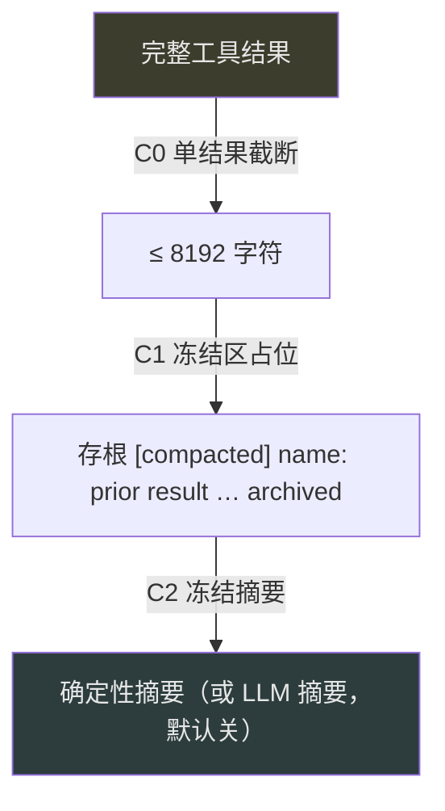
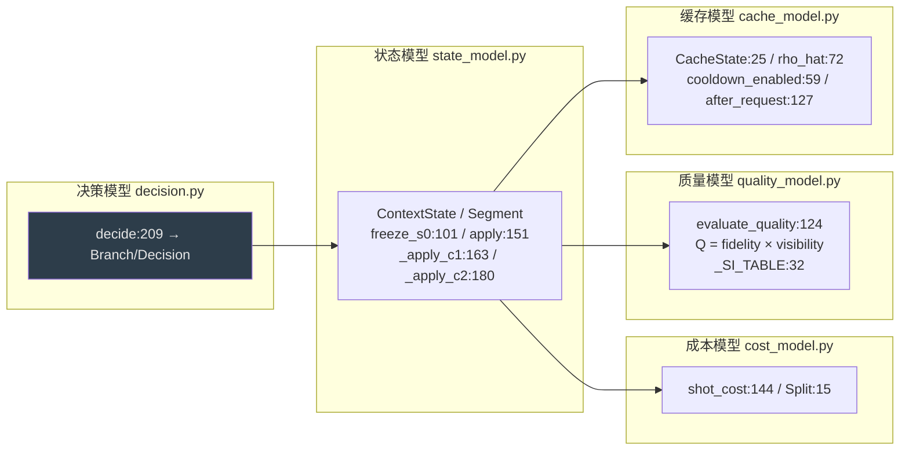

# XEYO 面试知识书 · 第五册 · 记忆与知识

> 覆盖系统：**S14 上下文压缩与 token 治理**、**S15 记忆系统（长期记忆）**、**S16 记忆压缩离线仿真台**、**S17 代码索引**
> 覆盖功能：**F009–F011、F065–F074**
> 对应岗位能力：AG-03（上下文工程）、AG-06（记忆系统 / RAG / 知识库 / 向量检索）
>
> **本册的核心论点是一句「否定」**：XEYO **明确不上向量检索**。这一册会给出完整证据链、替代方案、以及为什么这是一个可以讲成加分的回答。
> 全程未读 `docs/`。

---

## 目录

- [第 11 章 · S14 上下文压缩与 token 治理](#第-11-章--s14-上下文压缩与-token-治理)
- [第 12 章 · S15 记忆系统](#第-12-章--s15-记忆系统)
- [第 13 章 · S16 记忆压缩仿真台 / S17 代码索引](#第-13-章--s16-记忆压缩仿真台--s17-代码索引)
- [功能分册（F009–F011 / F065–F074）](#功能分册f009f011--f065f074)

---

# 第 11 章 · S14 上下文压缩与 token 治理

## 11.1 定位

**长会话保活层**。它解决一个具体矛盾：会话越长信息越多，但上下文窗口与成本都是硬约束。

XEYO 的解法是**三级压缩**（C0/C1/C2）+ 老化 + 重复折叠，且**压缩决策由一个可离线仿真的决策模型主导**（这是本册最独特的部分，见第 13 章）。

## 11.2 三级压缩（C0 / C1 / C2）



| 级 | 机制 | 常量 / 符号:行号 | 说明 |
| --- | --- | --- | --- |
| **C0** | 单条工具结果截断 | `MAX_TOOL_RESULT_CHARS=8192`（`compact.py:24`） | 保留尾部近轮（`KEEP_TAIL_TOOL_ROUNDS=3`，`:26`） |
| **C1** | 冻结区工具结果 → 存根 | `_project_tool_result_content:167`；占位文本 `[compacted] {name}: prior result … archived`（`:214-217`） | **不删原文**，只改投影 |
| **C2** | 冻结区 → 摘要 | 由 runtime 生成（`deterministic_c2_summary:554`）；compact 只负责 Apply | 确定性摘要为主；LLM 摘要默认关 |

**关键区分（面试常被追问）**：

- **C1 是「占位」**——把旧工具结果换成一个「这里曾经有个结果」的声明。模型知道「有东西但不在这」，需要时可以重新调用工具拿。
- **C2 是「摘要」**——把一段历史压成一段话。模型拿到的是**被加工过的信息**，不是「有个东西被藏起来了」。

**这两者的信任语义完全不同**：C1 的占位是**无损的**（原文可通过工具重新获取）；C2 是**有损的**（信息被重写）。所以二者触发的门槛不同。

**`aging` 时 C1 会升级**（`compact.py:214` 附近）：如果结果已经老化，存根会从「archived」升级为更精简的 `build_stub` 形式。

## 11.3 决策权的归属（S14 最值得讲的设计）

**`decide` 从哪来**：

| 档 | `XEYO_L5` 的值 | 行为 |
| --- | --- | --- |
| `project`（**默认**） | 默认链**不每轮 decide** | 走确定性规则 |
| `v61` | 每轮 decide | 调 `memory.simulator.decision.decide:209` |

**也就是说：压缩决策模型（`decide`）在默认档不是每轮都跑。** 这是一个重要的性能取舍——**决策本身有成本，所以只在需要时才算**。

**C2 的经济门槛**：不是「看到长就压」，而是要过 `c2_min_gain_chars` / `c2_min_save_ratio`（`simulator/replay.py:368-374`）这两道经济性检验，加上 `decide` 的 `J ≤ tau_switch × keep` 与 `Q ≥ θ`。**换言之：压缩必须证明「省下的 token 值这个钱与这个信息损失」。**

**这是一条很强的面试论点**：
> 我们的压缩不是「超过阈值就压」，而是**把压缩当成一个有成本、有收益、有质量损失的经济决策**。有个离线的仿真台（第 13 章）专门标定这些参数。**大多数系统的压缩策略是拍脑袋定的常数，我们至少让它可标定、可复现、可回放。**

## 11.4 老化（aging）

| 项 | 符号:行号 | 说明 |
| --- | --- | --- |
| 存根构造 | `build_stub:80` | 替换而非删除 |
| **豁免集** | `EXEMPT_TOOLS = {TodoWrite, AskUserQuestion}`（`:27`）；判定 `should_exempt:75` | 计划与提问结果**永不老化** |
| is_error 豁免 | 同上 | 错误结果不老化 |
| 远档折叠阈值 | `FOLD_AFTER=64`（`:23`） | — |
| 存根摘要上限 | `STUB_SUMMARY_MAX=60`（`:25`） | — |
| 开关 | `aging_enabled:40`（**默认关**） | — |

**为什么 `TodoWrite` 与 `AskUserQuestion` 必须豁免**（这是一个很好的注意力设计）：

> 因为这两类结果的**语义是「当前的计划」与「用户说过的话」**。它们一旦被压成「这里曾经有个待办清单」，模型就失去了「我现在该做什么」的唯一锚点。**它们的价值不随轮次衰减，反而随轮次增长**——所以不能按「新旧」来老化。

**这个「不分新旧、只看语义」的豁免判断，是「按信息性质而不是按时间」做压缩决策的范例。**

## 11.5 重复抑制（两道防线）

### 11.5.1 `repeat_guard`：递进提醒（只提醒，不拒执行）

| 项 | 符号:行号 | 说明 |
| --- | --- | --- |
| 阈值 | `DEFAULT_ADVICE_LEVELS = (3, 5, 8)`（`:39`） | `XEYO_REPEAT_TOOL_ADVICE` 可覆盖（`:60`） |
| 判定 | `observe:220` → `ACTION_ADVICE` / `ACTION_RUN` | **不改写 ToolResult**（`:8`/`:224`） |

**提醒措辞原文**（`advice_text:257`）：

```
'{tool}' 已用完全相同的参数连续调用 {count} 次。
```

**⚠ 这句措辞值得逐字分析**：它**只陈述事实**（「调用了几次」），**没有劝导**（没有「请换一种方式」/「这样做没用」），**没有评价**。这完全符合引擎铁律：**模型可见文本只承载状态/结果/事实**。

**而且「只提醒不拒执行」是刻意的**——引擎不替模型做「该不该再试」的判断。**限制只在执行层表达（如果权限层拒绝，那就拒绝），但不在这里说教。**

### 11.5.2 `repeat_fold`：字节级折叠

| 项 | 符号:行号 | 说明 |
| --- | --- | --- |
| 判据 | 同签名（`repeat_guard:165` `semantic_key`）+ 输出 sha256 **逐字节相同**（`_digest:73`；连续计数 `:124`） | 输出一变即重置 |
| 阈值 | `DEFAULT_FOLD_AFTER=3`（`:32`） | — |
| **永不拒执行** | `:15` | — |

**折叠文本原文**（`_REPEAT_SHORT:42` / `_FOLD_EXPLAIN:45-48`）：

```
[fold] 与上一条输出相同（第 3 次连续）——详情见首次输出。
[fold] 这是同一签名的第 3 次调用，输出与首次逐字节相同——引擎已折叠后续重复内容以节省上下文。
```

**「逐字节相同」这个判据很硬**——不看语义相似度，只比字节。**为什么不看语义**：因为语义相似度会误判（两次 Grep 结果「差不多」但差一行，可能是关键差异）。**字节级相同是唯一可以无争议自动折叠的情况。**

**`[fold]` 前缀恒保留**（`:32` 附近）——即使折叠，也告诉模型「这里发生过一次重复调用」。**这又是一个「不隐藏事实，只压缩体积」的设计。**

## 11.6 面试题 + 回答模板

### Q1：长会话上下文满了怎么办？

**回答模板**（按「分级 + 经济性」组织）：
> 三级压缩 + 两个安全机制。
> **C0 是单结果截断**（8192 字符），只动超长单条，保留最近 3 轮工具结果完整。
> **C1 是「占位」**：把冻结区的旧工具结果换成一句「`[compacted] name: prior result … archived`」。**注意这是无损的**——原文没删，模型需要时可以重新调工具拿。
> **C2 是「摘要」**：把一段历史压成一段话，**这是有损的**，所以门槛比 C1 高得多。
> **两个安全机制**：① **老化豁免**——`TodoWrite` 和 `AskUserQuestion` 的结果永不压缩，哪怕它们很旧，因为它们是「当前计划」和「用户原话」，价值不随轮次衰减；② **重复折叠**——同签名 + 输出逐字节相同的调用结果折叠成一行 `[fold]`，但**保留 `[fold]` 前缀**，不隐藏「这里发生过重复」这个事实。
> **最后一点也是我认为最有价值的**：压缩不是一个「超过阈值就压」的常数规则，而是**一个有成本、有收益、有质量损失的经济决策**——要过「省下的字符数」和「节省比例」两道经济性检验（`simulator/replay.py:368`）。我们甚至有离线的仿真台去标定这些参数。

**追问 1**：怎么防止压缩把关键信息压掉？
> 三层防护。① **语义豁免**而不是时间豁免——计划与用户原话永不压；② **无损优先**——C1 只是占位，原文还在，可以重新取回；③ **决策模型带质量约束**——`decide` 里有一个 `Q ≥ θ` 的质量门槛，压缩后的保真度低于阈值就不压。
> 另外我承认有一处不完美：C2 一旦是 LLM 摘要就是有损且不可逆的。所以 **LLM 摘要我们默认是关的**（`XEYO_C2_LLM_SUMMARY` 默认 `0`），默认走确定性摘要——**确定性摘要至少可复现、可审计**。

**追问 2**：你怎么知道压缩策略是对的？
> 因为有一个离线仿真台（`memory/simulator/`）。它把「决策-成本-质量-缓存」四个模型拆开：状态模型描述上下文构成、成本模型算 token 经济性、质量模型算保真度×可见性、缓存模型算 KV 命中。然后可以在真实 transcript 上回放，扫描参数。
> **关键约束是「仿真不改线上公式」**——`calibration.py` 只写 overlay（`:86` `apply_overlay`），不直接改线上参数。**这样仿真既能为线上调参，又不会让实验污染生产。**

---

# 第 12 章 · S15 记忆系统

## 12.1 定位与一条最重要的免责声明

**先说结论**：XEYO 的记忆系统**没有向量检索、没有 embedding、没有语义相似度**。

**证据（两条，可复现）**：

```bash
$ grep -rniE "embed|vector|cosine|tfidf|faiss|相似度" python/memory
python/memory/search.py:8:  # 留给日后 embedding / 双语别名表
```

**全仓仅在 `search.py:8` 的一条注释里出现过 `embedding` 这个词，且是「留给日后」**。此外 `search.py:1` 有明确声明：**「禁止在本函数里调模型」**。

**另外**：`python/evals/retrieval_bench.py` 是一个**「值不值得上向量」的对照实验**——不是「我们的向量检索评测」，而是「我们先用实验回答要不要做这件事」。

**面试怎么讲（这一题是本册的核心，务必按这个结构）**：

> **先回答问题**：我们没有用向量检索，是**有意的选择**，不是没做。
>
> **三个理由**：
> ① **规模不匹配**。我们的记忆是**个人级长期记忆**——几百到几千条笔记，不是百万级文档库。在这个量级上，「词法检索 + 结构化过滤」的召回率与向量检索差距很小，但延迟和依赖成本差很多。
> ② **确定性优先**。词法检索是**可解释、可复现**的——命中就是命中，没有「相似度 0.83 所以算命中」这种模糊边界。对 Agent 来说，**「为什么这条记忆被召回」必须可解释**，否则模型会把不相关的旧笔记当上下文，反而制造幻觉。
> ③ **依赖与运维**。向量检索需要 embedding 模型（要么调 API 增加成本与延迟，要么本地部署增加分发体积）。我们是桌面端 Agent，**每多一个模型依赖，安装包和启动就重一分**。
>
> **替代方案是什么**：关键词 + **CJK ngram**（中文按 2-gram/3-gram 切，不依赖分词器）+ 结构化过滤 + 重排。
>
> **我做过实验**：`evals/retrieval_bench.py` 就是为这个问题建的对照实验——**先用数据回答「上向量值不值」，而不是先写了再说**。这个顺序很重要。

**这段回答的杀伤力**：它把「我们没有 X」变成「我们评估过 X 并且有理由不做」。**面试官问「有没有向量检索」时，最差的回答是「有」（编造），其次是「没有」，最好的是「没有，因为…，我们有实验」。**

## 12.2 存储层

### 12.2.1 记忆目录结构

| 项 | 符号:行号 | 说明 |
| --- | --- | --- |
| 根目录 | `memdir.py:118` `memdir_root` → `base = xeyo_home() / "memory"` | 即 `~/.xeyo/memory/` |
| 域目录 | `resolve_memdir_id:105`；`USER_MEMDIR_ID="user"`（`:31`） | `~/.xeyo/memory/{wsid \| user}/` |
| 笔记写入 | `write_note:359` | `os.replace` |

**「域」的划分**：`user` 域（跨项目）+ 每个 workspace 一个域（项目内）。**这是「作用域」的第一层隔离。**

### 12.2.2 ⚠ `topic_filename` 忽略 scope：同 type+title 会互相覆盖

**源码原文**（`memdir.py:248-251`）：

```python
def topic_filename(note: MemoryNote) -> str:
    slug = _SLUG_RE.sub("-", (note.title or note.id).lower()).strip("-")[:40] or "note"
    return f"{note.type}-{slug}.md"
```

**关键**：文件名 = `{type}-{title_slug}.md`，**`scope` 与 `applies_to` 完全不参与**。

**后果**：在同一域内，两条 `type` 和 `title` 相同的笔记 → **同一文件 → `write_note` 用 `os.replace` 覆盖**。所以「共存的判定」（`coexist`）逻辑也随之失效——因为**文件名注定相同，物理上无法共存**。

**结论**：
- 跨域**不冲突**（不同目录）；
- **同域内同 type+title 会互相覆盖**（含本应 coexist 的情况）。

**面试讲法**（诚实 + 给修法）：
> 我们的笔记文件名是 `{type}-{title_slug}.md`——**这个命名忽略了 scope 和 applies_to**。
> 后果是：同一个域里两条 type 和 title 相同的笔记会落到同一个文件，写入时直接覆盖。我们本来有「共存判定」的逻辑，但因为文件名注定相同，那个逻辑实际上无法生效。
> 修法很清楚：把 scope/applies_to 编进文件名（或改用 id 作为文件名 + 元数据承载 scope）。**这是一个「数据结构选择错误导致上层逻辑失效」的典型案例**——上层逻辑本身没错，是它依赖的前提不成立。

**这段回答的价值**：它示范了「**定位到层次**」——不是「共存逻辑有 bug」，而是「文件名设计让共存逻辑无法成立」。**找到正确的抽象层，才叫定位到根因。**

## 12.3 索引层（sqlite，非向量）

| 项 | 符号:行号 | 说明 |
| --- | --- | --- |
| 存储 | **sqlite3**，库 `index.sqlite3`（`memindex.py:98` `db_path`） | 派生缓存 |
| **结构** | **全模块级函数，无类** | — |
| 启用 | `sqlite_index_enabled():90` **恒 True**（已固化） | — |
| 表 | `_SCHEMA:38-80` | `notes(domain,path,mtime,size,sha,fm_json,body)`、`rollouts`、`fragments`、`edges`、`meta` |

**⚠ 两点值得注意**：
1. **索引是 sqlite，不是向量库**。表结构里是 `path/mtime/size/sha` + frontmatter JSON + 正文——**这是「文件清单 + 倒排」的形态**。
2. **`sqlite_index_enabled()` 恒 True**——这是一个「已固化的开关」，与 `_memory_index_live_enabled()`（第一册，恒 False）形成对照。**「索引层可建」但「索引不注入生产上下文」——这两件事是分开的**，这是一个很容易讲混的点（见 §12.6 的追问）。

## 12.4 检索层（词法，非语义）

| 环节 | 符号:行号 | 说明 |
| --- | --- | --- |
| 强制约束 | `search.py:1` | **「禁止在本函数里调模型」** |
| **中文切分** | `_cjk_ngrams:120`（**n = 2, 3**） | 不依赖分词器 |
| 查询词 | `_query_terms:135` | 关键词 + CJK ngram（拉丁 AND / 谚文 OR） |
| 打分 | `score_note:68` | `confidence` + 近因 |
| 重排 | `query_reweight_score:107`（`_QUERY_TERM_CAP=3`，`:97`） | 查询词广度封顶 |

**⚠ 明确结论：没有 BM25。** 全仓无 BM25 实现。打分是「关键词匹配 + confidence + 近因」的加权，不是概率检索模型。

**「中文不用分词器，用 ngram」的取舍（这是一个很好的技术点）**：

> 中文分词需要词典 + 歧义消解，是另一个依赖。我们改成 **2-gram / 3-gram 切分**：把「记忆系统」切成「记忆」「忆系」「系统」等。好处是**零依赖、对未登录词（新词、专有名词、代码标识符）天然友好**；代价是**召回变宽**（会命中部分匹配），所以需要靠 **`_QUERY_TERM_CAP=3` 封顶**和重排来收敛。
> **为什么对 Agent 特别合适**：Agent 的记忆里充满了代码标识符、函数名、文件路径——**这些恰恰是分词词典覆盖不到的**。ngram 在这种文本上反而比词典分词更稳。

**`_QUERY_TERM_CAP = 3` 的作用**：限制参与打分的查询词数量（取前 3 个高权词）。**这是一个「用限制换精度」的手段**——避免「所有词都算一点分」导致排名被稀释。

## 12.5 治理层与其他

### 12.5.1 写入策略（`write_policy.py`）

| 项 | 符号:行号 | 说明 |
| --- | --- | --- |
| 门禁 | `refuse_reason:32` | 拒目录树 / 一次性计划 |
| 一次性计划 | `_EPHEMERAL:21` | — |
| 阈值 | `:47-49` | 行数 ≥6 且 treeish ≥4，或 ≥3 且 ≥40% |
| 长度阈值 | `:56` | `len ≥ 800` 且「斜杠+反斜杠」≥40 → 拒 |
| 性质 | **纯启发式，无 I/O** | — |

**这几条阈值为什么存在**：① 拒「目录树」——因为目录清单**一周就过期**，存进长期记忆必然变成错误信息；② 拒「一次性计划」——计划是临时状态，应该放 `TodoWrite` 而不是长期记忆；③ 长度 + 符号密度判据——**过滤掉「粘贴的代码/路径列表」**，因为那是「文件内容」而不是「知识」。

**「纯启发式无 I/O」是一个性能设计**：记忆写入在高频路径上，**不能为了判定而扫文件**。

### 12.5.2 治理（`governance.py`）

| 项 | 符号:行号 | 说明 |
| --- | --- | --- |
| 晋升准入 | `can_promote:146` | 需「用户确认 / verified_fact / diff 佐证 / agent 收割」（**agent 自收割 confidence 封顶 0.6**） |
| 遗忘 | `forget:236` | 标 `deleted` + 墓碑 |
| **禁止复活** | `may_resurrect:241` | **恒 `return False`** |

**两个设计要点**：

1. **agent 自收割的 confidence 封顶 0.6**——`can_promote` 里「仅 repeat（重复出现）不得晋升」。也就是说：**「模型自己反复说同一件事」不构成晋升理由**。这是防「模型自我强化幻觉」的关键门。

2. **`may_resurrect` 恒 False**——**已遗忘的 id 永远不能写回 active**。这是一个**单调性保证**：遗忘是不可逆的。**为什么不可逆**：如果遗忘可逆，那么「遗忘」就不再是可靠的安全动作（比如用户要求「删掉这条」后它又回来了）。**这个设计让 forget 成为一个可以承诺给用户的语义。**

### 12.5.3 指令文件（`instruction.py`）

| 项 | 符号:行号 | 说明 |
| --- | --- | --- |
| 入口 | `load_instruction_text:323` | — |
| `@include` 展开 | `_expand_includes:194` | — |
| **深度上限** | `MAX_INCLUDE_DEPTH=5`（`:24`）| 超限**返原文**（不报错） |
| **硬预算** | `MAX_CHARS=40_000`（`:23`） | — |
| **软预算** | `_DEFAULT_SOFT_CHARS=8_000`（`:25`）| `XEYO_INSTRUCTION_BUDGET` 可调 |
| 环引用 | `seen` 去重（`:209`）| — |

**三个设计要点**：

1. **深度上限 5 且超限返原文**——**fail-soft**：不因为一个错误的 include 链就让整份指令加载失败。
2. **软预算 8K / 硬预算 40K 双闸**——软预算用于「提醒」层，硬预算用于「截断」层。**两级预算是「温和提示 → 强制截断」的渐进设计。**
3. **环引用去重**——这是 `@include` 的必备防护（A include B，B include A）。

### 12.5.4 记忆开关面（`memory_switches.py`）

`MEMORY_SWITCHES`（`:41`）——**4 个开关**：

| 开关 | 默认值 | GUI | 运行时 | 行号 |
| --- | --- | --- | --- | --- |
| `XEYO_C2_LLM_SUMMARY` | `"0"` | True | True | `:43` |
| `XEYO_L5` | `"project"` | False | True | `:45` |
| `XEYO_TOOL_AGING` | `"0"` | False | True | `:46` |
| `XEYO_MEMORY_INDEX_LIVE` | `"0"` | False | **运行时读恒 False** | `:67` |

**注**：A4 / ω / F4 等 7+ 项已固化删键（即「已下线并移除配置面」）。

**⚠ 这张表的名堂在最后一列**：它同时记录「GUI 默认」与「运行时实际」。`XEYO_MEMORY_INDEX_LIVE` 的 GUI 默认是 False 而运行时**读也是 False 并且源码级恒关**——**这就是第一册 `_memory_index_live_enabled()` 恒 False 的配置面对应项**。

**「显示 == 生效」是这个表的设计目标**：开关面板不能显示一个「看起来开着但实际关着」的状态。注释里把「GUI 默认」和「运行时默认」并列，就是为了让这种不一致**在代码里可见**。

### 12.5.5 `journal`（变更日志）与 `session_md`

| 项 | 符号:行号 | 说明 |
| --- | --- | --- |
| 记录类型 | `journal.py:31` `ChangeRecord` | `seq/agent_id/path/action/file_hash_after/syntax_valid/conflict_task/diff` |
| 写入 | `record_change:140` | 加锁 + `fsync` |
| 查询 | `recent_changes:276` | **优先倒排索引，否则全扫** |
| GC | `gc:364` | TTL 清理 |
| 定位 | 模块 docstring `:7` | **唯一事实源**（append-only JSONL，每 workspace 一个） |

**`file_hash_after` + `syntax_valid` 的记录很有价值**：它让「这次改动之后文件是否语法合法」成为一个**可追溯的事实**，而不需要事后重算。**这是把「校验结果」落进日志、而不是每次重新推导**的设计。

## 12.6 面试题

### Q1：你的记忆系统怎么做检索？

**回答模板**：
> 词法检索，**不是向量检索**。
> 具体是：关键词匹配 + **中文用 2-gram/3-gram 而不是分词器**，配合 sqlite 索引做结构化过滤，最后用 confidence 与近因重排。并且有一条硬约束写在 `search.py` 第一行：**这个函数里禁止调模型**——召回必须纯本地、确定、可复现。
> **为什么不上向量**：① **规模不匹配**——个人级长期记忆是几百到几千条，不是百万文档，词法与向量的召回差距在这个量级很小；② **确定性优先**——Agent 必须能解释「为什么这条被召回」，模糊相似度会让模型把不相关旧笔记当上下文，反而制造幻觉；③ **依赖成本**——桌面端 Agent 多一个 embedding 模型就多一份安装体积、启动时间和在线依赖。
> **我做过对照实验**：`evals/retrieval_bench.py` 就是为「值不值得上向量」建的。**先有数据再决定，而不是先把向量库接上再说。**

**追问 1**：不用分词器，中文怎么处理？
> 用 ngram。把「记忆系统」切成「记忆」「忆系」「系统」这样的 2-gram 和 3-gram。好处是零依赖，而且**对未登录词天然友好**——Agent 记忆里全是函数名、文件路径、代码标识符，这些恰恰是分词词典覆盖不到的。代价是召回变宽，所以我们用「查询词封顶 3 个」（`_QUERY_TERM_CAP`）加重排来收敛。

**追问 2**：记忆索引会自动注入到上下文吗？
> **不会**，这是必须澄清的一点。这里有两个独立的东西：
> ① **索引层**（`memindex.py`）是可用的——sqlite 缓存，`sqlite_index_enabled()` 恒 True。
> ② **索引注入生产上下文**是**关闭的**——`_memory_index_live_enabled()`（`query_loop.py:355`）**硬编码 `return False`**，配置面 `XEYO_MEMORY_INDEX_LIVE` 的运行时值也是 False。
> 原因是有过事故：一个弱模型把索引条目**当成了任务对象**去执行。所以常驻注入被退役了，记忆改由模型**显式调 `Memory` 工具**读写。**「有索引」和「把索引塞进注意力」是两件事**——后者被证明有害。

### Q2：$（场景题）记忆里有一条过期的信息（比如「项目用 npm」，但已经换成 pnpm），怎么办？

**回答模板**：
> 分三层回答。
> **预防层**：`write_policy.py` 会拒掉那些**注定过期**的内容——目录树、一次性计划、粘贴的路径/代码清单。判据是启发式的（行数、treeish 比例、符号密度），目的是**不让「快照型信息」进长期记忆**。
> **纠错层**：笔记有 confidence 与近因，检索会重排；同时 `journal` 记录了每次变更的 `file_hash_after` 与 `syntax_valid`，所以「什么时候变的」是可追溯的事实。
> **遗忘层**：`forget`（`governance.py:236`）标 deleted + 墓碑，而且 **`may_resurrect` 恒 False**——**已遗忘的 id 永远不能复活**。这让 forget 成为一个可以承诺给用户的语义。
> **但我要承认一个缺口**：我们**没有自动的「事实冲突检测」**——没有机制在写入新笔记时发现「这条和旧的那条矛盾」。现在的做法是靠 `can_promote` 的准入门槛（用户确认 / verified_fact / diff 佐证）在源头减少错误，而不是在冲突时消解。**这是我会优先补的一块。**

## 12.7 源码证据清单

```
memory/memdir.py:31/105/118/248-251/359     域 / 根目录 / topic_filename / write_note
memory/memindex.py:38-80/90/98              schema / 固化开关 / db_path
memory/search.py:1/8/68/97/107/120/135      禁调模型 / embedding 注释 / 打分 / cap / ngram
memory/journal.py:7/31/140/276/364          ChangeRecord / 写入 / 查询 / GC
memory/governance.py:146/236/241            can_promote / forget / may_resurrect(False)
memory/write_policy.py:21/32/47-49/56       _EPHEMERAL / refuse_reason / 阈值
memory/instruction.py:23/24/25/194/209/323  MAX_CHARS / DEPTH / SOFT / 展开 / 去重 / 入口
memory/memory_switches.py:41/43/45/46/67    MEMORY_SWITCHES 四开关
memory/session_md.py:19/270                 会话侧车
```

---

# 第 13 章 · S16 记忆压缩仿真台 / S17 代码索引

## 13.1 S16：记忆压缩离线仿真台

### 13.1.1 定位

`python/memory/simulator/`（19 文件）。**它是一个「决策-成本-质量-缓存」四模型的离线仿真台**，用途是**为线上的压缩策略标定参数、做 A/B 与回放**。

**这是 XEYO 最独特的一块资产**——大多数 Agent 项目的压缩策略是几个拍脑袋的常数；这里把它做成了**可标定、可回放、可复现实验**的系统。

**入口**：`py -m memory.simulator`（`__main__.py:13` `main`）。

### 13.1.2 四个模型



| 模型 | 关键符号:行号 | 作用 |
| --- | --- | --- |
| **决策** | `decide:209`；`Branch` / `Decision` | v6.1 决策链：给定状态与参数，决定压不压、压到哪 |
| **状态** | `ContextState` / `Segment`；`freeze_s0:101`；`apply:151`；`_apply_c1:163`；`_apply_c2:180` | 上下文构成与压缩操作 |
| **成本** | `shot_cost:144`；`Split:15` | 每次请求的 token 经济性 |
| **质量** | `evaluate_quality:124`；`_SI_TABLE:32`；`λ_z` | **Q = fidelity × visibility** |
| **缓存** | `CacheState:25`；`rho_hat:72`；`cooldown_enabled:59`（恒 True）；`after_request:127` | KV 命中率估计与冷却 |

**「Q = fidelity × visibility」这个质量定义非常值得讲**：

> 压缩的质量不是「保真度」一个维度，而是**保真度 × 可见性**的乘积。
> **保真度**是「信息被保留了多少」；**可见性**是「这部分信息还在模型的注意力范围内吗」。
> 为什么必须相乘？因为**一段完美保真的信息，如果被压到上下文最深处，模型实际上看不见——它的质量贡献接近零**。反过来，可见但失真的信息也是负贡献。**乘积形式表达的就是「两个都必须成立」这个合取语义。**
> 这是一个把「上下文压缩」从「省 token」提升到「信息可得性」的建模。

### 13.1.3 回放、场景与标定

| 模块 | 关键符号:行号 | 作用 |
| --- | --- | --- |
| 回放 | `replay.py:252` `replay_messages`（接 `decide` / `try_extend_c2`）；`:471` `replay_all` | **在真实 transcript 上回放决策链** |
| 场景矩阵 | `scenarios.py:286` `iter_scenarios`；`:141` `state_from_messages` | 参数扫描 |
| 标定 | `calibration.py:33` `scan_rho`；`:72` `best_rho`；`:86` `apply_overlay` | **单参标定，只写 overlay** |
| CLI | `__main__.py:13` `main` | 子命令 `unit \| scenarios \| determinism \| replay \| probe \| calibrate \| report \| ab` |

**三个值得讲的设计**：

1. **`determinism` 子命令的存在**——它说明团队**把「同一输入是否产出同一结果」当成一个可独立验证的性质**。这是做仿真的前提：**不可复现的仿真不能用来标定参数。**

2. **`calibration` 只写 overlay（`:86` `apply_overlay`）**——**标定结果不直接改线上公式**。源码注释层面明确「不改线上公式」。
   > **这是一个非常成熟的工程决策**：仿真调参 → 产出 overlay → 用 overlay 做 A/B → 数据支持下才改线上默认。**把「实验」与「生产」用一层 overlay 隔开**，避免「跑了个扫描就把线上参数改了」。

3. **`ab` 子命令**——内置 A/B 对比。**这意味着「A/B 对比」不是一次性活动，而是仿真台的一个常规能力。**

### 13.1.4 面试题

**Q：$（系统设计题）你怎么给你的上下文压缩策略调参？**

> 我们不是「调参」，而是**把它变成一个有状态、有成本、有质量、有缓存的四模型系统，然后离线仿真**。
> **状态模型**描述上下文构成（哪些段、多长、冻结了没有）；**成本模型**算每次请求的 token 经济性；**质量模型**是「保真度 × 可见性」；**缓存模型**估 KV 命中率。
> 有了这四个模型，就能在**真实 transcript 上回放**：给定一组参数，跑一遍看成本与质量。还能做**参数扫描**（`scenarios.py`）和**单参标定**（`calibration.py` 的 `scan_rho` → `best_rho`）。
> 关键是两个工程约束：① **可复现**——有个 `determinism` 子命令专门验证「同输入同输出」；② **不污染生产**——标定只写 overlay，不改线上公式，要改线上必须另外走 A/B 有数据支持。
> 我认为这比「压到 100K 就开始摘要」这种常数规则强得多——**因为常数规则无法回答「为什么是 100K」，而这里有成本与质量的量化权衡。**

## 13.2 S17 代码索引

### 13.2.1 五个模块

| 文件 | 一句话职责 | 关键符号:行号 | 用 AST？ |
| --- | --- | --- | --- |
| `symbols.py` | 按需解析 + 哈希缓存的符号大纲 | `outline:76`；`locate:107`；`iter_symbols:165`；`_parse_python:225` | **是**（`ast.parse:225`） |
| `graph.py` | 工作区文件图 + import 边 | `build_workspace_graph:74`；`_python_import_specs:315` | **是**（`ast.parse:317`） |
| `cgraph.py` | L4 图谱最小原型（离线证据门） | `build_index:98`；`query_symbol:240`；`_build_edges:155` | **否**（边用正则 `name(` 近似） |
| `pack.py` | 同文件符号打包 | `pack_symbol_context:25`（预算 **8000**，`:15`） | 否（正则） |
| `changes.py` | diff ∩ 大纲 | `symbols_touched_by_hunks:32` | 否（复用 `outline`） |

### 13.2.2 两条明确结论

**结论 1：没有向量 / embedding / 语义相似度。**

```bash
$ grep -rniE "embed|vector|cosine|tfidf|faiss|语义向量" python/codeindex
# 零命中（仅 import ast 与 ast.parse 命中 "ast"）
```

**结论 2：用 AST 的是 `symbols.py` 和 `graph.py`；`cgraph.py` / `pack.py` / `changes.py` 用正则或复用大纲。**

**⚠ 关于 `cgraph.py` 的定位**：源码注释把它标为 **「L4 图谱最小原型（离线证据门）」**，边由正则 `name(` 近似（`:155`），sqlite 持久化。**「最小原型 + 离线证据门」这个自我定位很重要**——它诚实地说明这一块不是产线主力，而是「用来收集证据判断值不值得做」的原型。

### 13.2.3 面试题

**Q：你的 Agent 怎么理解一个陌生的大代码库？**

> 分两个通道。
> **按需通道（主力）**：`symbols.py` 用 AST 解析出符号大纲（`outline:76`），并按文件哈希缓存。模型要定位一个函数时，先拿大纲而不是读全文——**这比全文检索省 token，也比向量检索更精确**，因为符号边界是语法事实，不是相似度猜测。
> **结构通道**：`graph.py` 用 AST 抽 import 边，构建文件级依赖图（`build_workspace_graph:74`），让模型知道「改这个文件会影响谁」。另外 `changes.py` 把 git diff 的 hunk 映射回符号（`symbols_touched_by_hunks:32`），这样「这次改动碰了哪些函数」是精确答案而不是猜。
> **还有一条**：`pack.py` 把同一文件的多个符号打包成一个上下文块（预算 8000 字符），减少往返。
> **明确不用向量**：全仓 `codeindex/` 里没有 embedding 也没有相似度计算。**代码理解这件事上，AST 的精确边界比语义相似度更可靠**——因为代码本身就是有严格语法的。

---

# 功能分册（F009–F011 / F065–F074）

| 编号 | 功能 | 目标 | 入口:行号 | 亮点 / 风险 | 证据 |
| --- | --- | --- | --- | --- | --- |
| **F009** | 历史压缩（C1/C2） | 长会话 token 压缩 | `compact.py:24/26/167/214`；`runtime.py:1020/1072/554/745` | **C1 无损占位 vs C2 有损摘要**；决策过经济门槛 | 同左 |
| **F010** | 工具结果老化与打桩 | 冻结区继续推进 | `aging.py:27/40/75/80/23/25` | **语义豁免**（TodoWrite/AskUserQuestion 永不老化） | `aging.py:23/25/27/40/75/80` |
| **F011** | 重复调用抑制 | 防循环 | `repeat_guard.py:39/220/257/265`；`repeat_fold.py:32/42/45/73/124` | **只提醒不拒执行**；措辞纯事实无劝导 | 同上 |
| **F065** | 记忆目录与笔记 CRUD | 长期记忆文件 | `memdir.py:118/248/359` | ⚠ `topic_filename` 忽略 scope → 同 type+title 覆盖 | `memdir.py:31/105/118/248-251/359` |
| **F066** | 记忆索引（sqlite 派生缓存） | 加速检索 | `memindex.py:38-80/90/98` | **sqlite 不是向量库**；`sqlite_index_enabled` 恒 True | `memindex.py:38-80/90/98` |
| **F067** | 词法检索与重排 | 召回 | `search.py:1/68/107/120/135` | **明令禁止调模型**；CJK ngram 不用分词器 | `search.py:1/8/68/97/107/120/135` |
| **F068** | 记忆治理（准入/遗忘） | 保护记忆质量 | `governance.py:146/236/241` | agent 自收割 confidence 封顶 0.6；**`may_resurrect` 恒 False** | `governance.py:146/236/241` |
| **F069** | 指令文件加载（@include） | XEYO.md 链 | `instruction.py:323/194` | 深度 ≤5 **超限返原文（fail-soft）**；硬 40K / 软 8K 双闸 | `instruction.py:23/24/25/194/209/323` |
| **F070** | 会话侧车与增量 | session_md | `session_md.py:19/270` | — | 同左 |
| **F071** | 变更日志与因果边 | journal | `journal.py:7/31/140/276/364` | 记录 `file_hash_after` + `syntax_valid`（校验结果落盘不重算） | 同左 |
| **F072** | 记忆压缩决策仿真 | 离线选策略 | `simulator/decision.py:209`；`state_model.py:101/151/163/180`；`cost_model.py:15/144`；`quality_model.py:32/124`；`cache_model.py:25/59/72/127` | **Q = fidelity × visibility** | 同左 |
| **F073** | 真录回放与合成矩阵 | 复现/扫描 | `simulator/replay.py:252/471`；`scenarios.py:141/286`；`calibration.py:33/72/86`；`__main__.py:13` | **标定只写 overlay，不改线上公式** | 同左 |
| **F074** | 记忆开关面 | 开关一致性 | `memory_switches.py:41/43/45/46/67`；`query_loop.py:355` | **「显示 == 生效」**；`XEYO_MEMORY_INDEX_LIVE` 运行时恒 False | 同左 |

## 13.3 记忆层的其余组件（第四轮补全 · 2026-09-11）

> **为什么补这一节**：第 11–13 章讲的是记忆的**主链**（压缩 C0/C1/C2、老化、memdir 检索、代码索引）。做全书覆盖率审计时发现，`python/memory/` 下还有 **14 个源文件在本书中一次都没被提及**——它们不是无关代码，而是主链的**边界组件**（子代理隔离、晋升调度、引用锚点、保真切分）。被追问「记忆模块还有什么」时，这一节是补链的地方。

### 13.3.1 ⭐ 子代理记忆的隔离与回传（S21 × S15 交叉面）

**这是本节最值得讲的一条**：多 Agent 与记忆的交界处，最容易出的问题是「子代理把临时推断写进长期记忆」。

| 机制 | 符号 | 位置 | 作用 |
| --- | --- | --- | --- |
| 边界规则 | `AgentScope`（`:23`）、`scope_for`（`:49`） | `memory/agent_scope.py` | 主/子代理的权限位：`may_write_memdir`（`:81`）、`may_touch_session_md`（`:86`）子代理一律 `False` |
| 会话键隔离 | `scoped_session_id`（`:73`） | 同上 | 子代理落盘键 = `{main}__agent__{agent_id}`（`_safe_segment` `:67` 做转义），**不污染主 `session.md`** |
| 工具面收窄 | `filter_tool_names_for_scope`（`:91`） | 同上 | 子代理白名单里**剔除 `Memory` 工具**——物理上写不了长期记忆 |
| 候选采集 | `harvest_subagent_memories`（`:143`）、`harvest_main_session_memories`（`:232`） | `memory/subagent_memory.py` | 子代理**不直接写库**；用 `SUBAGENT_MEMORY_INSTRUCTION`（`:17`）约定的 `MEMORY_CANDIDATE` 标记输出，run 结束后解析 |
| 回传通道 | `enqueue_subagent_candidates`（`:216`）、`attach_subagent_result`（`:134`） | `memory/agent_scope.py` | 候选进 `candidates.jsonl` 等晋升；主 JSONL 只追加**一条**回传摘要，子代理全文留在侧链 |

**面试怎么讲**：「子代理的记忆是**三隔离 + 一单点回传**：写权限隔离（工具面剔除）、存储键隔离（独立 session 键）、摘要隔离（只回传一条）；唯一入口是候选采集——子代理只能**提议**，不能**落库**。跨模型调用一次都不发生（全靠约定标记解析），所以是廉价的。」

### 13.3.2 压缩决策权的开关：`XEYO_L5`（⚠ 源码内部自相矛盾）

| 项 | 值 | 位置 |
| --- | --- | --- |
| 开关名 | `XEYO_L5`（`ENV_KEY` `:14`） | `memory/l5_flag.py` |
| **实际生效默认** | **`"project"`** | `memory/memory_switches.py:45`（`MEMORY_SWITCHES` 第 2 项，default = `"project"`） |
| 自称默认 | `DEFAULT_MODE = "v61"`（`:16`），模块 docstring 写「``v61``（默认，2026-09-06 用户决策）」 | `memory/l5_flag.py:1-16` |
| 语义 | `v61` = 每轮跑 v6.1 自主 `decide`；`project` = C0+C1 快路径 + Path A 公式 | `use_v61`（`:35`） |
| `c2_gate` | 已**固化**，`c2_gate()`（`:40`）恒 `True`（旧 `XEYO_C2_GATE` 已删键） | 同上 |

**⚠ 这是一条「源码自己跟自己不一致」的实例，比结论本身更值得讲**：

- `l5_flag.l5_mode()`（`:19-32`）的实际求值路径是 `get_value("XEYO_L5")` → 返回 `"project"` 或 `"v61"`（二者都在 `_ALLOWED` 内，`:28-31` 两个分支必命中其一）。
- 而 `get_value`（`memory_switches.py:166-174`）对**已注册键永不返回空串**——未设时返回 `_DEFAULTS[key]`，即 `"project"`。
- 于是 `l5_flag.py:32` 的 `return DEFAULT_MODE` **不可达**；`DEFAULT_MODE = "v61"`（`:16`）**是不会被执行的死常量**。

**所以：实际生效默认 = `project`（不每轮 decide）；而 `l5_flag.py` 的 docstring 与常量名都在宣称「默认 v61」。** 第 11.3 节与 §12.5.4 开关表的原结论（默认 `project`）**成立**，此处补齐其**结构性理由**——不是「文档写错了」，而是**注册表与模块常量两处权威打架，且其中一处是死代码**。

**面试怎么讲（推荐版）**：
> 「这个开关的默认值有一处陷阱：`l5_flag.py` 里写着 `DEFAULT_MODE = "v61"`，看起来默认开；但真值来自 `memory_switches` 注册表的 `"project"`，而 `get_value` 对已注册键永远不返回空，所以那个常量**根本走不到**。**实际默认是 project（不每轮 decide）。** 这种『两处权威、一处是死代码』的情况，是我们后来统一到注册表单一权威的原因——跟开关面板的『显示 == 生效』是同一条设计原则。」

> **这一条同时修正了原 §11.3 的讲述方式**：原表把 `project` 标为「默认」是对的，但没给理由；现在有了——**默认来自注册表，不来自模块常量**。如果面试官追问「你怎么知道默认是这个」，答案是「读注册表的 default 字段，并验证那条 fallback 分支不可达」。

### 13.3.3 引用锚点与保真切分（两个「防失真」组件）

**`memory/citation.py` —— 让每一行压缩结果可回指原文**：
- `CitationEntry`（`:23`）是锚点结构；`render_block`（`:112`）渲染；`message_citation`（`:165`）/`note_file_citation`（`:175`）分别指向**原消息序号**与 **note 文件行**。
- 纯函数、无 I/O（**红线：不写文件**）。
- 接在主链：`runtime.py:35/463/724`、`search.py:198-467`（检索命中块）。
- **价值**：压缩是有损的（C2），但**锚点是无损的**——摘要行旁边带 `path:line` + `<rollout_ids>`，模型想验证可以顺着回去读。这是「有损压缩 + 无损索引」的组合。

**`memory/fidelity_segmenter.py` —— 按信息原子计权，而不是按段落**：
- `Atom`（`:50`）、`split_into_atoms`（`:247`）：把游离区 M 切成信息原子（栈 / tree / json / kv / 表 / 路径 / 兜底）。
- 末尾断言 **`Σweight == |M|`**（划分无损）——这是个可直接引用的工程细节。
- `atoms_histogram`（`:347`）做统计。
- **默认关**：`atoms_enabled()`（`:70`）读 **`XEYO_ATOM_SEGMENT`**；`runtime.py:865/968/1039` 是调用点。
- **价值**：解决「整条 `tool_result` 被当成一个事实单元」导致的保真下降——切成原子后，质量模型可以只折叠低价值原子。

### 13.3.4 晋升链：NightShift 与它的佐证

| 组件 | 关键符号 | 位置 | 要点 |
| --- | --- | --- | --- |
| 空闲蒸馏 | `maybe_schedule`（`:617`）、`should_run`（`:383`）、`run`（`:422`）、`append_candidates`（`:215`）、`_run_safe`（`:579`） | `memory/nightshift.py` | 投递点 `engine/query_engine.py:977-986`（`after_stop`）；**门闩 + 限频 + 常驻收敛链** |
| 限频参数 | `XEYO_MEMORY_PROMOTE_MAX_PER_RUN`（8）、`COOLDOWN_HOURS`（6.0）、`FOLLOWUP_DELAY`（30.0）、`FOLLOWUP_MAX_CHAIN`（2） | `nightshift.py:45-57` | **急件永不冷却**：Forget / 冲突 / 可晋升候选不受冷却压制，冷却只挡例行风暴 |
| 晋升佐证 | `WorkspaceDiff`（`:35`）、`collect`（`:129`）、`matches`（`:218`）、`candidate_path_tokens`（`:204`） | `memory/workspace_diff.py` | **只在晋升时做一次** git diff（绝不每轮比对，红线②）；`MAX_BYTES=4MB`（`:22`）截断；无证据不降权 |

### 13.3.5 工具输出摘要（`memory/summarize.py`）

`extract_tool_summary`（`:527`）与 `extract_value_facts`（`:278`）**按内容形态分派**，而不是无脑截前 N 字：

| 形态 | 处理 | 位置 |
| --- | --- | --- |
| 报错 / 栈回溯 | **取尾**（栈顶与异常类型在尾部） | `:419` `_read_summary` |
| grep 结果 | 取 `file:line` + 样本 | `:458` `_grep_summary` |
| 长文本 | 默认上限 `DEFAULT_MAX_TEXT = 160` | 同上 |

接在主链：`runtime.py:37/388`、`memory/session_md.py:405`。

### 13.3.6 simulator 的其余模块（第 13 章 13.1 的补全）

第 13.1 节讲了压缩仿真台的四模型与回放/标定，这里补上**其余 5 个文件**——它们是仿真台的**共享公式库**，其中两个**同时被产线热路径引用**：

| 文件 | 关键符号 | 位置 | 接线 | 要点 |
| --- | --- | --- | --- | --- |
| `simulator/params.py` | `Params`（`:31`）、`load_params`（`:118`）、`load_overlay`（`:107`） | 冻结默认参数 + overlay 覆盖 | 离线 + 共享 | **校准只覆盖「值」，不碰「公式」**（公式不可调，只调参）。默认值含 `window_tokens=128000`、`reserve_tokens=2048`、`alpha_hit=0.95`、`theta=0.35`、`tau_switch=0.85`、`omega_half_life_min=60.0` 等（`:31-78`） |
| `simulator/horizon.py` | `Trajectory`（`:15`）、`p0_trajectory`（`:30`）、`p1_trajectory`（`:66`）、`trajectory_for`（`:106`） | 共享 R=16 轨迹 | **仅离线** | 轨迹步数**不得超剩余轮数**，否则 `J(16)` 会高估「压缩过渡期 miss 摊薄」→ 结论偏乐观 |
| `simulator/projection.py` | `project`（`:35`）、`Projected`（`:28`）、`emit_segment`（`:10`）、`Span`（`:16`） | 动作依赖投影 Π_a | **仅离线** | 投影里**含 token 余数**，让决策看到的长度对齐真实发送体积 |
| `simulator/r_estimator.py` | `RGate`（`:35`）、`estimate_r_gate`（`:100`）、`dynamic_r_base`（`:86`）、`_dynamic_enabled`（`:76`） | 剩余轮数分级约束 | **双用**（产线 `runtime.py:1495/1512`） | 把「剩余轮数 R」从标量预测**降级为 {4,8,16} 布尔档位约束**——只当约束喂 `decide`，**不得作唯一选择器**（防 J/vote 对 R 过敏）。`XEYO_V61_DYNAMIC_R` 默认关 |
| `simulator/c2_gate.py` | `pressure_ratio`（`:40`）、`economic_gain_ok`（`:60`）、`tail_budget_tokens`（`:118`）、`l_hard_send_from`（`:132`） | C2 触发阈值几何化 | **双用**（产线 `runtime.py:1386/1432/1732/1800`） | 把 C2 的阈值/保尾**从硬编码常量换成窗口几何公式**；开关关时**回归到冻结逐字节行为**，HardTop 兜底防尾溢出 |

> **这解释了第 13.1 节的一个隐含结论**：仿真台不是「纯离线玩具」——`c2_gate` 与 `r_estimator` 的公式**被产线直接 import**。所以「仿真台的公式库 = 产线与仿真共用的单一事实源」，这也是「仿真结论可信」的结构性理由。

### 13.3.7 一条必须诚实披露的占位

**`memory/cache_profile.py` 是纯占位文档**：全文件仅 30 行 docstring，无任何实现；全仓 `grep "import cache_profile"` **零命中**。它列了多厂商 KV 画像的字段与一份 DeepSeek 价表，实现留空。

**面试怎么讲**：如果被问到 KV 缓存画像，**不要**把它当已实现功能。正确说法：「我们预留了多厂商 KV 画像的字段定义，但实现还没做——当前的成本模型走的是 `usage/pricing.py` 的静态价表与实测命中率标定。」**主动说出这一条，比被追问出来强得多。**

### 13.3.8 面试题 + 回答模板

**Q1（项目题）：你的多 Agent 系统里，子代理会产生记忆污染吗？**
> 不会，因为子代理在**物理上**写不进去：工具面被 `filter_tool_names_for_scope`（`memory/agent_scope.py:91`）剔除了 `Memory` 工具；落盘键被 `scoped_session_id`（`:73`）改成 `{main}__agent__{id}`；回主会话只能通过一条**候选**（`enqueue_subagent_candidates` `:216`）走 NightShift 晋升。等于「子代理只能提议，不能落库」。

**Q2（系统设计题）：压缩是有损的，你怎么保证信息不丢？**
> 两层组合：一是**锚点无损**——`memory/citation.py` 给每条压缩结果附 `path:line` 与 `<rollout_ids>`，想验证能顺着回去读原文；二是**切分无损**——`fidelity_segmenter.py` 把游离区切成信息原子，末尾用 `Σweight == |M|` 断言划分无损，让质量模型可以只折叠低价值原子而不是整段丢。**有损的是内容，无损的是索引。**

**Q3（排错题）：长会话里模型说「我记得之前有个配置文件」，但内容不对。你怎么查？**
> 先看压缩路径：如果是 C2 摘要导致的失真，看 `summarize.py:527` 的形态分派是否命中了正确分支（报错取尾 / grep 取 `file:line`）；再看是否 C1 占位（无损，原文可重取）；最后才怀疑原子切分。**顺序很重要：先查有损层，再查无损层**——无损层出问题的概率低得多。

**Q4（追问）：`XEYO_L5` 默认是什么？你怎么确定的？**
> **`project`** —— 但**不要**看 `l5_flag.py:16` 的 `DEFAULT_MODE = "v61"`，那是**死常量**：真值来自 `memory_switches.py:45` 注册表的 default 字段，且 `get_value`（`:166-174`）对已注册键**永不返回空**，所以 `l5_flag.py:32` 的 fallback 分支不可达。**判据 = 读注册表 + 验证 fallback 不可达，不是读模块常量。**（§13.3.2）

---

## 本册收益表（实测 / 可复现 · 2026-09-11 现场跑）

### 1. 侧挂模块收益（`scripts/bench_sidemod_benefit.py`，离线 ¥0）

| # | 模块 | 基线（默认关） | 开启后 | 收益性质 |
|---|---|---|---|---|
| P5-1 | ⑧.5 memindex 内容哈希签名 | 同秒编辑（同 mtime 同 size 改内容）**漏检 = True** | 检测 = **True** | 正确性（不漏检），**不是**省 IO |
| P5-2 | ⑧ content_index trigram 缓存 | 内容未变二建 **重算 300 次 / 686.6 ms** | 重算 **0 次 / 134.3 ms** | 重算 **−100%**、耗时 **−80.4%** |
| P5-3 | ⑮ 检索重排偏好 | 词法分主导（未必采用者在前） | 被采用者**优先** | 排序质量（**召回集不变**，P0 约束） |
| P5-4 | ④ 环境污染门 | 门关（skip）→ 污染**不拦** | 拦污染 / 放干净 | 评测诚实度 |
| P5-5 | ⑤ 报告口径 | 只有 `accuracy` | 4 字段（standard / strict / delta / leakage_rate） | 反 reward-hacking |
| P5-6 | ① 冷记忆 | 常忆有召回面（list） | 冷忆召回面 = `[]` | 记忆域隔离 |

### 2. 检索质量（`artifacts/benchmarks/retrieval/hitk.json`）

| 域 | 用例数 | hit@k | 命中 / 漏 |
|---|---|---|---|
| notes（中文自然语言笔记） | 5 | **0.4** | 2 / 3 |
| code（代码检索） | 5 | **1.0** | 5 / 0 |

> **两个数字必须一起讲**：`code = 1.0` 说明词法检索在**标识符 / 路径**上够用；`notes = 0.4` 说明它在**中文自然语言提问**上明显不够——这正是「要不要上向量」的**量化起点**（`evals/retrieval_bench.py` 是这条对照实验的入口）。只报 1.0 是选择性呈现。

### 3. 离线门

| # | 组 | 实测 | 证据 |
|---|---|---|---|
| P5-7 | 记忆压缩与检索 | **6/6 passed** | `mmau_results.json` 第 4 组（`tests/test_compact.py` + `tests/test_memory_search.py`） |
| P5-8 | 模拟器不变量 | **56/56 passed**（8.1 s） | 第 6 组（`tests/simulator`） |
| P5-13 | S14 上下文压缩与 token 治理 | 压缩契约门 | — | **6/6 passed**（**与 P5-7 同一组**，此处按 S14 归口，含 `tests/test_compact.py`） | `mmau_results.json` 第 4 组 |
| P5-14 | S14 压缩决策权 | 每轮是否由引擎决定压缩 | 引擎每轮 decide（模型失去主动权） | **默认 `XEYO_L5=project`，不每轮 decide**；老化有**语义豁免** | 权威 = `memory/memory_switches.py:45`（注册表 default）；`l5_flag.py:16` 的 `DEFAULT_MODE="v61"` 经核验为**不可达死常量**（§13.3.2）；`engine/compact.py:69/95/125`；`engine/aging.py:64/80/93`；**定性**（§11.2/§13.3.2） |
| P5-15 | S15×S21 子代理记忆隔离 | 子代理能否污染长期记忆 | 子代理可直接写 memdir | **三隔离 + 一单点回传**：工具面剔除 `Memory`（`agent_scope.py:91`）、独立 session 键（`:73`）、主 JSONL 只收一条摘要（`:134`）；候选经 `enqueue_subagent_candidates`（`:216`）等 NightShift 晋升 | `memory/agent_scope.py`；`memory/subagent_memory.py:143/232`；**定性**（§13.3.1） |

### 4. 代码索引（S17）

| # | 指标 | 基线 | 实测 | 证据 |
|---|---|---|---|---|
| P5-9 | 读 Python 小函数 token | 20,523 | **206**（−99%） | `scripts/bench_codeindex_benefit.py` |
| P5-10 | 读 TS 小方法 token | 830 | **51**（−94%） | 同上 |
| P5-11 | 符号召回率 | 正则 51% | symbols **100%** | 同上 |
| P5-12 | 内容哈希缓存二读耗时 | cold 14.60 ms | warm **0.39 ms**（−97.3%） | 同上边界清单 |

**复现命令**：

```bash
cd python
./.venv/Scripts/python.exe scripts/bench_sidemod_benefit.py    # P5-1…P5-6
./.venv/Scripts/python.exe evals/retrieval_bench.py            # hit@k
```

**⚠ 时效性**：P5-9…P5-12 依赖 `bench_codeindex_benefit.py`，其硬编码目标路径已失效（详见第三册收益表脚注），本次以临时副本测得。

## 本册自检

- [x] 第 11 章覆盖 S14：C0/C1/C2 三级 + **「无损占位 vs 有损摘要」的信任语义差异** / 决策权归属（`XEYO_L5` 默认 `project` 不每轮 decide；**第四轮补齐结构性理由**——权威在 `memory_switches.py:45` 注册表，`l5_flag.py:16` 的 `DEFAULT_MODE="v61"` 是不可达死常量，见 §13.3.2）/ 老化**语义豁免** / 两道重复防线（含措辞逐字分析）/ 2 道面试题
- [x] 第 13.3 节（第四轮补全）：`python/memory/` 此前**零提及的 9 个模块**（agent_scope / subagent_memory / l5_flag / citation / fidelity_segmenter / cache_profile / nightshift / workspace_diff / summarize）+ simulator 其余 5 个文件，含 **P5-15 子代理记忆三隔离** 与 **`cache_profile.py` 纯占位**的诚实披露
- [x] 第 12 章覆盖 S15：**「无向量检索」的完整证据链与三条理由** / `topic_filename` 忽略 scope 的数据结构级根因 / sqlite 索引 vs 注入开关的分离 / CJK ngram 取舍 / 治理（confidence 封顶 0.6、`may_resurrect` 恒 False）/ 指令双预算与 fail-soft / 开关表「显示==生效」
- [x] 第 13 章覆盖 S16/S17：四模型仿真台（**Q = fidelity × visibility** 的合取语义）/ `determinism` 子命令 / **标定只写 overlay** / codeindex 五模块（**哪些用 AST 哪些不用**）+ 两条明确结论
- [x] 功能分册覆盖 F009–F011 / F065–F074 共 13 项
- [x] 全部结论带 `文件:行号`；「无向量检索」给出**可复现的 grep 命令与输出**
- [x] 未读 `docs/`
- [x] **后续册已全部补齐**：第六~十册 + 附录 A（题库 65 题）+ 附录 B（讲解稿 + 覆盖自检）均已生成；全书系统覆盖 44/44、功能覆盖 116/116（见 `13` §B.6/§B.7）

---

**下一册**：`07-第六册-扩展与多智能体.md`（第 14–15 章：S18 MCP 客户端与网关 / S19 Skill 与插件 / S20 钩子 / S21 子代理运行时 / S22 DAG 调度器 / S23 跨进程 coord）
