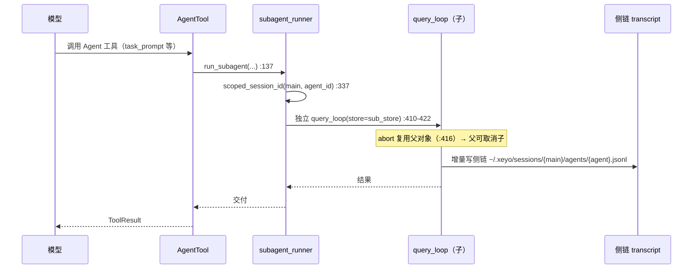

# XEYO 面试知识书 · 第六册 · 扩展与多智能体

> 覆盖系统：**S18 MCP 客户端与网关**、**S19 Skill 与插件**、**S20 生命周期钩子**、**S21 子代理运行时**、**S22 多代理 DAG 调度器**、**S23 跨进程多 Agent 协调**
> 覆盖功能：**F052、F075–F090**
> 对应岗位能力：AG-04（插件系统 / MCP）、AG-05（规划 / 任务分解 / 工作流 / 状态机）、AG-07（多智能体协作与通信）
>
> **本册是全书「讲述策略」最敏感的一册**（对应第一阶段 P0 项 C-04）。第 15 章会给出一张**精确到函数级的接线表**，把「已实现且有测试」与「产线已接线」分开——**这是本册的核心价值，也是你在面试里必须守住的边界**。
> 全程未读 `docs/`。

---

## 目录

- [第 14 章 · 扩展层：MCP / Skill / 插件 / 钩子](#第-14-章--扩展层mcp--skill--插件--钩子)
- [第 15 章 · 多智能体与任务规划](#第-15-章--多智能体与任务规划)
- [功能分册（F052 / F075–F090）](#功能分册f052--f075f090)

---

# 第 14 章 · 扩展层：MCP / Skill / 插件 / 钩子

## 14.1 S18 · MCP 客户端与网关

### 14.1.1 传输：**只有 stdio**

| 项 | 符号:行号 | 结论 |
| --- | --- | --- |
| 传输 Protocol | `McpTransport`（`mcp_client.py:429`） | `spawn` / `send` / `recv` / `close` |
| **生产实现** | `StdioMcpTransport`（`:547`） | **唯一** |
| spec 类型约束 | `McpServerSpec.transport`：`Literal["stdio"]`（`manifest.py:~76`） | 类型层面就排除了其他传输 |
| SSE / HTTP | — | **未实现**（仅预留） |

**⚠ 明确结论**：**MCP 只实现了 stdio 传输**。源码注释写明「production uses `StdioMcpTransport`」，且 manifest 的 spec 类型把 `transport` 约束为字面量 `"stdio"`——**不是「还没写」，而是「类型上就不允许」**。

**面试怎么讲**：
> 我们只支持 stdio 传输。这是一个**安全与简洁的取舍**：MCP server 是本地子进程，通信走 stdin/stdout，不需要网络暴露面、不需要认证、不需要处理 TLS 与重连语义。
> 代价是**不支持远程 MCP server**。如果要做，`McpTransport` Protocol（`mcp_client.py:429`）已经留好了扩展点——**抽象在，实现没做**。这是一个诚实的状态描述。

### 14.1.2 生命周期与重连（S18 最值得讲的部分）

| 项 | 符号:行号 | 说明 |
| --- | --- | --- |
| 启动 | `start():804` | **绝不抛异常**，skip-and-log |
| 停止 | `stop():828` | — |
| 重连 | `reconnect():835` | **= `stop()` + `start(force=True)`** |
| 握手 | `_spawn_and_init():840` | — |
| 退避器 | `ReconnectBackoff:375`；`next_delay:406` | 指数退避 |
| 基数 | `BACKOFF_BASE_S = 0.5`（`:61`） | — |
| 上限 | `BACKOFF_MAX_S = 30.0`（`:63`） | — |
| 最大次数 | `MAX_RECONNECT_ATTEMPTS = 10`（`:65`） | — |
| 重置窗口 | `RESET_UPTIME_S = 30.0`（`:67`） | 稳定运行 30 秒后重置退避 |

**三个设计要点**：

1. **`start()` 绝不抛异常**——注释层面明确「skip-and-log」。**理由**：一个坏掉的 MCP server **不能阻止会话启动**。这是「扩展是可选增强，不是启动前提」的架构立场。
2. **指数退避 `min(base × 2^n, max)`**——0.5s 起，封顶 30s，最多 10 次。**这是标准的重连退避**，但关键在下面这点。
3. **`RESET_UPTIME_S` 是退避的「自愈」机制**——如果一个 server 稳定运行了 30 秒，退避计数**重置**。**如果没有这个机制**，一个「启动时抖了几次、之后一直正常、很久之后又抖」的 server 会因为在早期累积了失败次数而很快放弃。
   > 这是一个很成熟的细节：**退避状态必须与「最近的稳定性」绑定，而不是与「历史失败总数」绑定。**

### 14.1.3 管理器与三源合并

| 项 | 符号:行号 | 说明 |
| --- | --- | --- |
| 单例 | `get_mcp_manager():586` | **cwd 进程级单例** |
| 收集 spec | `collect_specs():178` | 汇三源 |
| 挂载 | `attach_mcp_tools():186` | 启 server + 注册工具 + 注册网关 |
| 单 server 处理 | `_attach_one():220-259` | 坏 server 不影响其他 |
| required 失败 | `:257-259` | **仅记警告**，不抛 |

**三源优先级**：注释（`mcp_manager.py:6`）与 `mcp_scopes.py`（已知 `:181/226/271/352`）给出 **`project > user > plugin`**（workspace 更具体者优先）。

**⚠ 一个值得讲的细节**：`required` 的 MCP server 启动失败时**只记警告**，但会通过 T_now 的 `mcp_required_warn` 块（登记表第 10 项，第二册 §5.2）**把失败变成模型可见的事实**。
> **这是「fail-visible 而非 fail-silent」的范例**：不阻止流程，但绝不让失败隐形。因为如果 required 的工具悄悄没了，模型会以为工具不存在而绕路——**这比直接报错更难排查。**

### 14.1.4 `Mcp` 网关工具：身份的解析方式（安全核心）

| 项 | 符号:行号 | 说明 |
| --- | --- | --- |
| action 枚举 | `["list","describe","call","resources","read_resource"]`（`mcp_gateway.py:47`） | 5 个动作 |
| 解析链 | `_resolve:283` → `resolve_target:276` → `manager.resolve_tool:406` | — |
| 调用 | `_act_call:164` → `target.execute` | — |
| **红线** | `:15` | 网关不直连子代理注册表 |

**⚠ 身份解析在「已知工具集」内做精确/casefold 匹配，绝不从 args 取身份。**

**为什么要强调这一点（面试高频）**：

> 因为 `args` 是**模型可以自由生成的内容**。如果网关从 `args` 里读「我要调用哪个工具」然后再去执行，那么：
> ① **权限指纹会失效**——指纹是基于「这次调用的是哪个工具」算的，如果工具身份来自参数，模型就能通过改参数来伪造身份；
> ② **停用可以穿越**——用户停用了某个 MCP 工具，但如果它能通过网关用参数指定「我要调那个被停用的」，停用就形同虚设。
> 所以我们的做法是：**身份只能在「当前已知的注册工具集」里解析**（`resolve_target:276` → `manager.resolve_tool:406`），用 `(server, tool)` 精确或 casefold 匹配。**身份是查出来的，不是听来的。**

**并且网关不绕权限**（`:15` 注释）：`action=call` 走到 `target.execute`，但**在 `registry.run` 的三态门之后**——默认 MCP 工具走 `outbound_ask`（ASK）。**网关是「动态可达性的通道」，不是「权限的旁路」。**

### 14.1.5 配置：单一来源与 keep-last-good

| 项 | 符号:行号 | 说明 |
| --- | --- | --- |
| home 级 | `home_settings_path():50` | `~/.xeyo/settings.json` |
| workspace 级 | `workspace_settings_path():46` | `<ws>/.xeyo/settings.json` |
| **默认总开关** | `_DEFAULT`（`:31`）/ `ExtensionConfig`（`:134`） | **`enabled_extensions = False`（默认关）** |
| 读 JSON | `_read_json():76` | 坏 JSON / 非对象 → `_LAST_GOOD` 回退（`:94/103/113`） |
| 审计 | `_record_invalid():116-127` | 记 `config.invalid`（调用点 `:102/112`） |

**「默认关」的意义**：扩展是**显式选择性加入**的能力，不是默认开启。**这降低了「装了个客户端就自动执行外部进程」的风险面。**

**keep-last-good 的方向安全**（面试可讲）：
> 如果配置文件是坏的 JSON，我们**不会静默回默认值**——那样会「悄悄关掉用户开着的扩展」（或者更糟，按默认值打开一些）。我们的做法是用**上一次合法的配置**（keep-last-good），并写一条 `config.invalid` 审计。
> **方向是安全的**：宁可沿用旧的合法状态，也不猜测用户意图。

### 14.1.6 ⚠ `reconcile` 的全局 digest 无 session key（C-06 定论）

| 项 | 符号:行号 | 说明 |
| --- | --- | --- |
| 待发队列 | `_PENDING: list[str]`（`:21`） | 模块级全局 |
| 幂等表 | `_LAST_DIGESTS: dict[str, str]`（`:23`） | **键 = `kind`（变更类），无 session_id** |
| push | `publish_reconcile_block:49`；`publish_if_changed:35` | — |
| pull 兜底 | `manager._make_enabled_probe`（mtime 重读） | — |

**裁决依据**：`grep -n "_PENDING\|_LAST_DIGESTS" python/extension/reconcile.py` 命中 `:21/23/35/39/41/54/55/56/62/63/71`，**所有键都是 kind 或文本，没有任何 `session_id`**。

**结论**：`_PENDING` / `_LAST_DIGESTS` 是**模块级进程内全局，按 `kind` 幂等**。多会话并行时，「工具面变更」这类事件的 digest 与队列是**跨会话共享**的——**存在串台风险**（一个会话的变更可能被另一个会话的 digest 判为「已发过」而吞掉，或者被投给错误的会话）。

**面试怎么讲**：
> 这里有一个我们已经记录的缺陷。扩展层的 rename/启停事件走一个「push 为主 + pull 兜底」的 reconcile 机制（`:49`）。但它的**幂等表和待发队列是模块级全局的，键只有变更类别（`kind`）而没有 session id**（`:21/23`）。
> 后果是：多会话并行时，同一个 `kind` 的变更 digest 是共享的——**一个会话刚发过的变更，可能让另一个会话的同类变更被判定为「重复」而静默丢掉**。而这类事件是 **drain 语义（静默即永久丢失）**，丢了就真丢了。
> 修法是把键从 `kind` 改成 `(session_id, kind)`，并把队列按 session 分桶。**这是一个很典型的「全局状态在并发下暴露」的 bug**——和我们在容器路由那次事故里学到的是同一类问题。

**⚠ 与容器路由事故的呼应**：这两处是**同一类根因**（进程级共享状态用于「本该按会话隔离」的语义），一个已修（ContextVar），一个未修。**面试时把这两处并列讲，能显示你识别「同类根因模式」的能力。**

## 14.2 S19 · Skill 与插件

### 14.2.1 Skill 的扫描与加载

| 项 | 符号:行号 | 说明 |
| --- | --- | --- |
| workspace 扫描 | `skill_loader.py:271-275` | `<ws>/.xeyo/skills` |
| home 扫描 | `:280-283` | `~/.xeyo/skills` |
| plugin 扫描 | `:286-296` | 插件声明的 `skill_dirs` |
| 必需文件 | `:262` | 目录必须含 `SKILL.md` |
| frontmatter 字段 | `:50-59` | `name` / `description` / `tags` / `model_hint` / `paths` / `model_invocable` / `user_invocable` / `mcp_dependencies` |
| 解析 | `_parse_frontmatter_raw:140` | 手写解析 |
| 校验 | `_validated_meta:178` | **fail-closed** |
| 漂移检测 | `skill_store.py:119` `detect_drift`；`:71` `hash_skill_file`；`:25` `default_lock_path` | 锁文件 `skills-lock.json` |

**`model_invocable` / `user_invocable` 两个字段的设计值得讲**：它把「谁可以触发这个技能」变成显式声明——**用户可以直接 `/name` 直呼（对应 T_now 的 `skill_preinvoke` 块），也可以由模型按需加载（对应 `Skill` 工具）**。**两个通道，两套权限。**

**漂移检测**：`detect_drift` 比对锁文件里的 `computedHash` 与磁盘上 `hash_skill_file` 的结果。**用途**：技能内容被改过（升级、手改）时能感知，避免「锁文件说的版本」与「实际执行的内容」不一致。

### 14.2.2 插件来源与 npm 默认禁用

| 项 | 符号:行号 | 说明 |
| --- | --- | --- |
| 来源枚举 | `plugin_fetcher.parse_source:109` → `{local, github, npm}` | — |
| 来源校验 | `loader._lockfile_source_type:97` | 白名单 `("local","github","npm")` |
| **npm 禁用** | `install_from_npm:283` | **直接 `raise PluginError("npm plugin install is not enabled yet (feature-flag sidelined)")`**（`:285-288`） |
| 分派 | `install_from_spec:291` | 仍分派但立即抛错 |

**⚠ 明确结论：npm 安装是「显式抛错」而不是「默默不支持」。**

**这个细节值得讲**：
> 我们的插件来源声明支持 `local` / `github` / `npm` 三种，但 **npm 安装路径直接抛错**（`plugin_fetcher.py:283`），错误信息明确写着「not enabled yet (feature-flag sidelined)」。
> **为什么选择抛错而不是「不做」**：因为如果 `install_from_spec` 遇到 npm 来源时静默返回，用户会以为「装上了」但实际没有——**失败必须是可见的**。错误信息还说明了原因（feature flag 被挂起），让人知道这是有意为之而不是 bug。

**为什么 npm 被挂起**（可从安全角度推理，面试时可讲）：
> npm 安装意味着**执行第三方包管理器的解析与下载逻辑**，引入的风险面远大于「从 github 拉一个已知 tar 包」——供应链攻击面、postinstall 脚本、依赖树。**在桌面端 Agent 里，这条路径的风险收益比不划算**，所以挂起。

### 14.2.3 S20 · 生命周期钩子

| 项 | 符号:行号 | 说明 |
| --- | --- | --- |
| **5 个事件点** | `EVENTS = ("PreToolUse", "PostToolUse", "PermissionRequest", "SessionStart", "SessionEnd")`（`hooks.py:38`） | — |
| 来源 | `_plugin_hooks:72-97` | 读 `manifest.hooks` 的 `event` / `command` / `args` / `timeout_s` / `fail_policy` |
| 执行 | `subprocess.run`（`:127`） | **子进程** |
| 默认超时 | `_DEFAULT_TIMEOUT_S = 600`（`:41`） | 10 分钟 |
| **PermissionRequest fail-closed** | `_outcome_for:109` | 超时 → **abort**（`:111-113`）；非 0 退出 → `abort if fail_policy=="abort" else continue` |
| 短路 | `run_event_hooks:182-187` | **任一非 success 即短路** |
| 结果注入 | `publish_reconcile_block:162-181` | 不门控 |

**三个设计要点**：

1. **钩子是子进程**（`subprocess.run`）——**隔离**：钩子代码崩溃不会带崩引擎；但也意味着钩子**不能直接改内存状态**，只能通过 stdout 返回并注入。
2. **`PermissionRequest` 是 fail-closed**（`:11` 注释明确「一律 DENY」）——**超时 = 拒绝**，而不是放行。这是权限语义上的必然要求：**一个不确定的权限钩子不能成为「默认允许」的通道。**
3. **`PreToolUse` 在权限裁决之前执行**（第三册 §7.2）——所以钩子可以**先否决**，避免为注定被拒的调用做权限挂起。**代价是钩子代码运行在权限检查之前，必须被当作可信代码。**

**⚠ 一个隐含风险值得主动提**：钩子默认超时是 **600 秒**——对 `PreToolUse` 这样的前置钩子来说，10 分钟是**很长的**。如果钩子卡住，工具调用会被拖 10 分钟。**这是一个可以主动指出的可改进点**（`PreToolUse` 应该用远短的超时，比如 5-30 秒）。

## 14.3 面试题 + 回答模板

### Q1：你的工具面是怎么扩展的？

**回答模板**（这题的核心是「冻结 vs 扩展」的张力）：
> 这里有一个张力，我们的解法是让它变成一个通道。
> **张力**：工具的 schemas 在请求里位于很靠前的位置（第二册 §5 讲过，tools 数组是 KV 前缀的一部分），所以**会话内绝不能改工具表**——改了就是全量重算。
> **解法**：会话内启停扩展**不走改工具表，而走一个在会话起点就已经注册好的网关工具**。我们有一个 `Mcp` 工具，动作是 `list / describe / call / resources / read_resource`（`mcp_gateway.py:47`）。它内部再去解析并调用实际生效的工具。
> **关键安全约束是「身份只能查出来，不能听出来」**：`call` 的目标身份在**已知注册工具集**里做精确匹配（`resolve_target:276` → `manager.resolve_tool:406`），**绝不从参数里读**。因为参数是模型可自由生成的内容——从参数取身份会让权限指纹失效、让「停用」可以被穿越。
> 而且网关**不绕权限**：`call` 走到的 `execute` 仍然在 `registry.run` 的权限三态之后（默认 MCP 工具是 `outbound_ask` → ASK）。

**追问 1**：那会话内启停了扩展，模型怎么知道？
> 走 T_now 的 reconcile 块——`reconcile_events` 是一个登记在册的 T_now 块（第二册 §5.2 第 11 项），类别是 `event`，语义是 **consume（静默即永久丢失）**。所以启停会立刻以「工具面变更」的事实形式进模型注意力。
> **但我必须指出这里有个已知缺陷**：这个 reconcile 机制的幂等表是模块级全局的，键只有变更类别、没有 session id（`reconcile.py:21/23`）。多会话并行时有串台风险。修法是把键改成 `(session_id, kind)`。

**追问 2**：为什么 MCP 只支持 stdio？
> 本地子进程 + stdin/stdout，不需要网络暴露面、不需要认证、不需要处理 TLS。代价是不支持远程 server。抽象层（`McpTransport` Protocol）已经留好了，但实现没做——**这是一个有意收窄的范围，不是遗漏。**

---

# 第 15 章 · 多智能体与任务规划

## 15.1 ⚠ 本章的讲述纪律（务必先读）

第一阶段把这一章的基调列为 **P0 待确认**。本章的立场是：**把「已实现」「有测试」「产线接线」三件事分开说。**

**这张表就是本章的骨架**：

| 机制 | 已实现 | 有测试 | **产线接线** |
| --- | --- | --- | --- |
| 子代理派生（`Agent` 工具 → 独立 `query_loop`） | ✔ | ✔ | **✔ 已接线** |
| 子代理消息总线 / 结算 / 侧链持久化 | ✔ | ✔ | **✔ 已接线** |
| 任务分解（`decompose_tasks*` 5 函数） | ✔ | ✔（`test_multi_agent_p1.py`） | **✘ 无产线调用方** |
| DAG 调度执行器（`run_task_batch`） | ✔ | ✔（2 个测试文件） | **✘ 无产线调用方** |
| DAG 数据结构（`Task` / `toposort` / `build_tool_whitelist`） | ✔ | ✔ | **✔ 已接线** |
| `repair_task_graph` | ✔ | ✔ | **△ 已接线但只在 dormant 链内可达** |
| 跨进程 coord（CAS / worktree / reconciler） | ✔ | — | **△ 默认 backend=memory（零行为）** |

**面试时的正确说法**：「我实现了完整的任务 DAG 调度（含拓扑排序、白名单、断点续跑和测试），但在产品路径上我们最终选择的是**模型驱动动态派生**（`Agent` 工具），而不是引擎预分解。**DAG 执行器目前只被测试调用。**」
**这个说法比「我们有多代理 DAG 调度」强得多**——因为它展示了「实现 → 评估 → 选择」的判断过程，而后者一旦被追问接线点就会崩。

## 15.2 S21 · 子代理运行时（产线主力）

### 15.2.1 `Agent` 工具的派生路径

| 项 | 符号:行号 | 说明 |
| --- | --- | --- |
| 入口 | `agent_tool.py:83` `AgentTool`；调用点 `:316/454/473/480` | — |
| 运行器签名 | `subagent_runner.py:137-163` `run_subagent(*, workspace_root, agent_id, task_prompt, tool_whitelist, model_client, prompt_assembler, write_store, main_session_id, ...)` | — |
| **独立 query_loop** | import `:262`；调用 `:410-422` | — |
| **独立 store** | `store=sub_store`（`:411`） | **不复用父 store** |
| **独立 session id** | `session_id=scoped_session_id(main_session_id, agent_id)`（`:337`） | 作用域化 |
| **复用父 abort** | `abort=abort`（`:416`） | **父可取消子** |
| 侧链目录 | `_sidechain_dir:629` → `~/.xeyo/sessions/{main_session}/agents` | — |
| 侧链文件 | `_sidechain_path:826` → `…/{agent_id}.jsonl` | — |

**四个「独立 / 复用」的取舍（这是本章最能讲清设计的地方）**：

| 维度 | 选择 | 理由 |
| --- | --- | --- |
| `store` | **独立** | 子代理的消息不能污染主会话历史——否则主会话的上下文会被工人的中间过程撑爆 |
| `session_id` | **作用域化派生** | 让子代理有自己的 transcript、自己的读状态、自己的权限上下文 |
| `abort` | **复用父对象** | **用户打断必须能取消所有子代理**。如果每个子代理有自己的 abort，用户按一次停止就只停主循环，子代理会继续跑、继续花钱 |
| `tool_whitelist` | **显式传入** | 子代理拿到的是裁剪后的工具面（由 `build_tool_whitelist` 生成） |

**「abort 复用、store 独立」这个不对称很值得讲**：
> 我们让子代理**共享 abort、不共享 store**。因为这两件事的语义相反：**取消是「全局的意志」**（用户不想再跑了），而**历史是「局部的记录」**（工人的中间过程不该进主会话）。如果反过来（各 store 独立但 abort 独立），用户按停止就停不干净；如果 store 共享，主会话上下文会被工人的细节污染。

### 15.2.2 消息总线与结算

| 项 | 符号:行号 | 说明 |
| --- | --- | --- |
| 主→子 | `live_agents.post_to_agent:68` → `_INBOX:25`；子 `drain_agent_inbox:93` 消费 | **仅 park，不注入**（`:6-8`） |
| 子→主 | `abort_live_agent:50` 经 `_LIVE:23`；`is_live_agent:60` | — |
| key | `{session_id}::{agent_id}`（`:28-29`） | — |
| 结算记录 | `agent_settlement.record_agent_settlement:32` | 结果未带回主会话时 |
| 结算消费 | `drain_agent_settlements:57` → T_now 块「# 子代理结算」（`format_settlement_block:66`） | **drain 语义** |
| 结算枢纽 | `server/turn_settlement_hub.py:22` `on_turn_settled` | 由 `turn_runner` 的**单一 settlement 槽**调用 |
| 三租户分发 | `:28-65` | 分发到 `inbox_registry` / `goal_round_driver` / `job_registry` |

**两个设计要点**：

1. **主→子是「park，不注入」**（`:6-8` 注释）——消息进 `_INBOX` 队列，**等子代理结算时才被消费**。为什么？因为**子代理正在跑的时候，往它的上下文里插消息会破坏它正在执行的计划**。park 的语义是「等你有空再看」。
   > 这是一个很细的注意力设计：**「投递」不等于「立即打断」。**

2. **结算枢纽是「单一槽 + 三租户分发」**：`turn_runner` 只有一个 settlement 槽，turn 结束时调一次 `on_turn_settled`，由它分发给三个消费者（inbox / goal round driver / job registry）。
   > **为什么用一个槽而不是三个回调**：如果 turn_runner 直接持有三个回调，那么每加一个「turn 结束要做的事」就要改 turn_runner——**这是典型的「巨石长大」路径**。收成一个枢纽，turn_runner 只认一个槽，**新增消费者不改 turn_runner**。

## 15.3 ⚠ S22 · DAG 调度器（未接线，精确取证）

### 15.3.1 定义清单

| 符号 | 行号 |
| --- | --- |
| `TaskRunResult` | `scheduler.py:29` |
| `class Task` | `:37` |
| `toposort` | `:109` |
| `build_tool_whitelist` | `:191` |
| `repair_task_graph` | `:215` |
| `prepare_for_resume` | `:849`（方法） |
| `run_task_batch` | `:1054` |

### 15.3.2 接线表（区分 tests 与非 tests）

| 符号 | 产线调用方 | 测试调用方 | **结论** |
| --- | --- | --- | --- |
| `toposort` | `Scheduler.run()`（`:310`、`:329`）、`repair_task_graph`（`:238`）、内部（`:818`） | `test_agent_tool.py:187` | **已接线** |
| `build_tool_whitelist` | **`tools/agent_tool/agent_tool.py:444`、`:452`**；内部（`:210`、`:879`） | 有 | **已接线** |
| `repair_task_graph` | `subagent_runner.py:1032` | 有 | **已接线（但仅在 dormant 分解链内可达）** |
| `class Task` | `agent_tool.py`、scheduler 全量 | 广泛 | **已接线** |
| **`prepare_for_resume`** | **无**（仅 `run_task_batch:1089` 调它） | `test_multi_agent_p1.py` | **✘ 未接线** |
| **`run_task_batch`** | **无** | `test_multiagent_hardening.py`、`test_multi_agent_p1.py` | **✘ 未接线** |
| `SessionPool.scheduler_for` | **无任何调用方** | — | **✘ 未接线** |

### 15.3.3 任务分解链

| 函数 | 行号 | 职责 |
| --- | --- | --- |
| `user_requests_multi_tasks` | `:1062` | 判「用户是否在要求多任务」的话术 |
| `heuristic_split_tasks` | `:1100` | 文件「一个…一个…」的兜底拆分 |
| `decompose_tasks_stream` | `:1207` | 流式分解（调前两者） |
| `decompose_tasks` | `:1318` | 包装 stream（`:1331`） |
| `synthesize_multi_agent_answer` | `:1372` | 汇总多代理结果 |

**裁决证据**：全仓 grep 这 5 个名字 → **命中只有 `subagent_runner.py` 自身（定义 + 内部链）与 `tests/test_multi_agent_p1.py`**。`agent_tool.py` / `query_loop.py` / `turn_runner.py` **均无调用**。

**结论：5 个分解函数无产线调用方；多 Agent 任务分解未接线。**

### 15.3.4 面试怎么讲这件事（**P0 项，务必按此策略**）

**❌ 不要这样说**：
> 「XEYO 有一套多代理 DAG 调度器，支持任务分解、拓扑排序、并行执行和断点续跑。」
——**这会被一句「能看一下接线点吗」打穿。**

**✅ 应该这样说**：

> 我在 XEYO 里做过两块多代理相关的工作，**一块在产线上，一块我最终没有接线**，我把两块都讲一下。
>
> **第一块是产线在用的**：模型可以通过 `Agent` 工具**动态派生**子代理。每个子代理跑一条**独立的 `query_loop`**，有自己的 store 和 scoped session id，但**共享父的 abort**——因为用户按停止必须能取消所有子代理。子代理的中间过程写侧链 transcript（`~/.xeyo/sessions/{main}/agents/{agent}.jsonl`），不污染主会话历史。结算走一个「单一枢纽 + 三租户分发」的设计（`turn_settlement_hub.py:22`）：turn 结束时调一次 `on_turn_settled`，它再分发给 inbox / goal 轮驱动 / job 注册表。
>
> **第二块是我实现了但没有接到产线的**：一套完整的任务 DAG 调度——`Task` 数据模型、拓扑排序 `toposort`、工具白名单 `build_tool_whitelist`、图的修复 `repair_task_graph`，以及执行器 `run_task_batch` 加断点续跑 `prepare_for_resume`，还有任务分解（`decompose_tasks` 等 5 个函数）。**这些都有测试。**
> **但 `run_task_batch` 目前只被测试调用，分解链也没有产线入口。**
>
> **为什么没接线**：因为我们最终判断**「引擎预分解 DAG」不如「模型动态派生」**。理由是——**引擎分解必须猜模型想怎么切任务，猜错就是双倍浪费**（分错了再绕回来）；而 `Agent` 工具让模型自己决定「我要不要开个子代理、让它干什么」，**分解权在模型手上，引擎只提供能力**。这也和我们引擎的一条原则一致：**引擎不规划路线，只提供执行能力。**
>
> 所以现在的状态是：**能力（含 DAG 数据结构）已经在，执行器留作储备**。数据结构的几个部分确实被产线用了——`build_tool_whitelist` 被 `agent_tool.py:444` 调，`toposort` 和 `repair_task_graph` 在 scheduler 与 subagent_runner 内可达。**真正 dormant 的是「批量执行 + 断点续跑」这条链。**

**为什么这个回答远强于「我们有 DAG」**：

1. **主动划边界**——面试官最怕的是「候选人把设计了但没上线的能力说成已上线」。主动说清，直接建立信任。
2. **给出决策理由**——「引擎预分解要猜、猜错双倍浪费」是一个**有技术含量的判断**，且与项目原则（引擎只给信息不给导演）自洽。
3. **区分「能力」与「接线」**——「数据结构已接线、执行器未接线」这种精确度，只有真的读过代码的人才说得出。
4. **它把「未完成」转成了「有意识的取舍」**——这是从「实现者」到「决策者」的分界线。

**追问预案**：

**问**：既然写了为什么不用？
> 因为它是在「多代理」这个想法最有吸引力的时候写的，那时候我们假设引擎预分解能省 token、能并行加速。后来我们发现两件事：① **分解本身就是一次 LLM 调用**，它自己就花 token 和时间；② **模型动态派生的效果更好**，因为模型比引擎更清楚任务该怎么切。**所以 `run_task_batch` 就留在储备状态了。** 我没有删它——因为它有测试、是干净的、将来如果有「确定性批处理」类需求（比如评测时固定切分）还能用。

**问**：那你的代码里有 dead code 吗？
> 有，我承认。`run_task_batch` 与分解链目前是**有测试覆盖但无产线调用**的模块。**但我不认为它等同于「垃圾代码」**——它的数据结构部分在被使用（`Task`、`toposort`、`build_tool_whitelist`），只有「批量执行 + 断点续跑」这条链是休眠的。如果要做开源前的清理，**正确的处理是把它标成「储备能力」并写清适用场景，而不是删掉**——因为删掉会连带失去 `toposort` 的测试覆盖。

## 15.4 S23 · 跨进程多 Agent 协调

| 项 | 符号:行号 | 说明 |
| --- | --- | --- |
| **默认 backend** | `BACKEND_MEMORY="memory"`；`_DEFAULT={"coord":{"backend":"memory"}}`（`config.py:22-26`）；`coord_backend:61` 失败也回退 memory | **零持久化** |
| 任务入表 | `coord/planner.py:49` | DAG 入表 |
| **CAS 认领** | `store.py:209` `claim_task`；`revision+1` 乐观并发（`:224`） | pending/reopened 可认领；无 scope 拒绝（`:214-217`） |
| 熔断 | `REOPEN_LIMIT = 3`（`store.py:38`）；`_reopen_or_block:287` | 超过即 `blocked` |
| worktree 隔离 | `coord/worktree.py`；`worker_pool.py:53` | — |
| **三路合并** | `reconciler.py:93` `_reconcile_one` → **`git rebase main`**（`:107`） | 冲突 → `rebase --abort` + `reopen_conflict`（`:118-123`），**worktree 即弃**（`:125`） |
| 评审打回 | `coord/reviewer.py:40`；`ask_gate.py:54` | findings 打回 |

**协作模式（一句话）**：DAG 入表 → **CAS 认领 + scope 租约** → worktree 隔离 → **rebase 三路合并** → findings 打回。

**⚠ 关键状态：`coord.backend` 默认 `memory`**——也就是说**默认配置下这一层是进程内 dict，零持久化、零跨进程能力**。要用文件型 backend 需要显式配置（`file_store.py`）。

**此前未被提及的一项：`coord/presence_adapter.py`（`FileBackedPresence`）** ——它是 `session_presence` 的**文件后端**（coord 阶段 0）：

| 项 | 事实 |
| --- | --- |
| 契约 | 与 `engine.session_presence.SessionPresenceRegistry` **方法签名一一对应**；状态复用同一 `PresenceState`（**逻辑单份，存储分布**） |
| 存储分布 | presence 状态 / 锁：**per workspace root**（`<ws>/.xeyo/coord/`）；`session_id → root` 索引：**全局**（`~/.xeyo/coord/`）——为了支持 `drop` / `queue_notice` / `take_notices` 这类**无 cwd 的调用**能跨 workspace 反查 |
| **降级铁律** | 「**任何 coord IO/锁失败只记 debug，本进程操作照常语义完成**（尽力持久化），异常绝不外泄到 `write_store` / `policy` 等调用方」 |

**这条「降级铁律」值得单独讲**：presence（多会话/多 Agent 的在场与冲突感知）是**增强能力而非正确性依赖**——所以它的持久化失败**不允许**影响主链的写入与权限判定。**能做「增强层失败不影响核心路径」的区分，比把每个模块都做成关键路径更难。** 与 §15.6 扩展层「坏插件不搞挂启动」是同一条原则的不同实例。

**面试怎么讲**：
> 这一层是「跨进程 worker 池」的形态：任务进表、**CAS 认领**（用 `revision + 1` 做乐观并发），每个 worker 在独立 git worktree 里改，然后由**唯一的 reconciler** 用 `git rebase main` 做三路合并；冲突就 `rebase --abort` 并把任务重新 reopen；被打回超过 3 次（`REOPEN_LIMIT`）就熔断成 blocked。
> **但我要说清当前状态：默认 backend 是 `memory`（`config.py:22-26`），也就是进程内 dict。** 所以这一层**默认不提供真正的跨进程能力**，文件型 backend 需要另外配置。
> 我认为这个设计的价值在**「唯一 reconciler + CAS + 熔断」这三条不变式**：① **合并只能由一个角色做**（否则并行合并会产生互相覆盖）；② 认领必须原子（用 revision 做 CAS，避免两个 worker 抢同一任务）；③ 打回有次数上限（否则「打回 → 重做 → 再打回」会无限循环烧钱）。

**追问**：为什么用 `git rebase` 而不是 merge？
> 因为我们的目标是**把每个 worker 的改动线性叠加到 main 上**，保持历史干净、便于回溯。rebase 冲突时直接 `--abort` 并弃掉 worktree——**这是一个「快速失败」的选择**：与其在半冲突状态下猜测意图，不如把任务退回给 planner 重新分解。**在 Agent 场景里，「冲突的自动化解决」风险远高于「退回重做」的代价。**

## 15.5 面试题汇总

### Q1：你的多智能体是什么形态？

**回答模板**（用「两种范式」组织，避免混淆）：
> 有两种范式，**一种在产线，一种在储备**。
> **产线范式是「进程内子代理」**：模型通过 `Agent` 工具动态派生。子代理跑独立 `query_loop`、独立 store、scoped session id，但**共享父 abort**（用户停止必须停干净）。中间过程写侧链 transcript 不污染主会话。结算走「单一枢纽 + 三租户分发」。
> **储备范式是「跨进程 worker 池」**：DAG 入表 → CAS 认领 → worktree 隔离 → 唯一 reconciler 做 rebase 三路合并 → findings 打回熔断。**默认 backend 是 memory（进程内），不是真正的跨进程。**
> **而「引擎预分解 DAG」这条路我实现了但没接线**，因为最终判断是「分解权应该留给模型」——引擎预分解要猜，猜错就是双倍浪费。

**追问**：子代理之间能互相通信吗？
> 有消息总线（`live_agents.py`），但语义是**「park 不打断」**：主代理给子代理的消息进 inbox 队列（`:68`），等子代理**结算时**才被消费（`drain_agent_inbox:93`）。
> **为什么不是立即注入**：因为子代理正在执行一个计划，中途插消息会破坏它的执行上下文。**「投递」和「立即打断」是两件事**——我们只做投递。

### Q2：$（系统设计题）如果让你设计「多个 Agent 并行改同一个代码库」，你会怎么做？

**回答模板**（先讲不变式，再讲实现）：
> 我会先定三条**不变式**，因为并行改同一个库的正确性问题全都出在这三条上：
> **① 合并只能由一个角色做。** 多个 worker 各自合并会产生互相覆盖——A 合并时看到的 base 已经不包含 B 的改动。所以要有**唯一 reconciler**（`coord/reconciler.py:93`）。
> **② 认领必须原子。** 否则两个 worker 会抢同一个任务、做重复功。我们用**乐观并发**：`claim_task`（`store.py:209`）带 revision 检查，成功才 `revision + 1`（`:224`）。**乐观并发比悲观锁更适合这种场景**——冲突少、不需要长事务。
> **③ 打回必须有上限。** 「打回 → 重做 → 再打回」是无限循环烧钱。我们设 `REOPEN_LIMIT = 3`（`store.py:38`），超了熔断成 `blocked` 交给人。
> **实现层**：每个 worker 一个 git worktree 做隔离，合并用 `git rebase main`。**冲突时不尝试自动解决，直接 `--abort` + 重新 reopen**——因为「自动解决冲突」在语义层面的风险远高于「退回重做」。
> **我还会指出一个当前实现的限制**：默认 backend 是进程内 memory，所以现在这套只是「同进程多 worker」。要做真的跨进程，需要把 `store` 换成文件型 backend（`file_store.py` 已有），并处理「心跳 + 租约过期」——**因为进程会崩，崩了必须能回收它的任务**。

---

# 功能分册（F052 / F075–F090）

| 编号 | 功能 | 目标 | 入口:行号 | 亮点 / 风险 | 证据 |
| --- | --- | --- | --- | --- | --- |
| **F052** | 工具面变更 reconcile | 会话内启停同步 | `reconcile.py:21/23/35/49`；`mcp_manager.py:~355` | ⚠ **全局 digest 无 session key（C-06）** | `reconcile.py:21/23/35/49` |
| **F075** | MCP stdio 客户端与重连 | 外部工具进程 | `mcp_client.py:429/547/804/828/835/840`；`ReconnectBackoff:375/406` | **退避随稳定性重置**（`RESET_UPTIME_S=30`） | 同左 |
| **F076** | MCP 作用域与企业 deny | 权限与信任 | `mcp_scopes.py:181/226/271/352`；`mcp_manager.py:178/186` | 三源 `project > user > plugin` | 同左 |
| **F077** | `Mcp` 网关工具 | 会话内动态调用 | `mcp_gateway.py:47/164/276/283`；`manager.resolve_tool:406` | **身份只在已知工具集解析**；不绕权限 | 同左 |
| **F078** | Skill 发现与漂移检测 | 技能加载 | `skill_loader.py:50-59/140/178/262/271-296`；`skill_store.py:25/71/119` | `model_invocable`/`user_invocable` 双通道 | 同左 |
| **F079** | 插件安装与来源白名单 | 扩展安装 | `plugin_fetcher.py:109/283/291`；`loader.py:97`；`manifest.py:~76` | **npm 显式抛错**（不是静默不支持） | 同左 |
| **F080** | 生命周期钩子 | 5 事件点 | `hooks.py:38/41/72-97/109/127/182` | **PermissionRequest fail-closed**；⚠ PreToolUse 默认超时 600s 偏长 | 同左 |
| **F081** | 子代理上下文与预算 | 上下文隔离 | `subagent_context.py:27/35`；`subagent_runner.py:39/107/124/137-163/337/411/416` | **store 独立 + abort 共享**的不对称 | 同左 |
| **F082** | 子代理消息总线 | 主↔子通信 | `live_agents.py:23/25/28-29/50/60/68/93` | **park 不打断** | 同左 |
| **F083** | 子代理交付结算 | 结果汇总 | `agent_settlement.py:32/57/66`；`turn_settlement_hub.py:22/28-65` | **单一槽 + 三租户分发** | 同左 |
| **F084** | 侧链持久化与 GC | 子代理 transcript | `subagent_runner.py:629/826/382/497` | 侧链独立，不污染主历史 | 同左 |
| **F085** | 任务分解（模型+启发式） | 拆分多任务 | `subagent_runner.py:1062/1100/1207/1318/1372` | ⚠ **无产线调用方** | 同左 |
| **F086** | 任务 DAG 拓扑与白名单 | 依赖排序 | `scheduler.py:37/109/191/215` | **数据结构已接线**（`agent_tool.py:444`） | `scheduler.py:37/109/191/215`；`agent_tool.py:444/452` |
| **F087** | 任务 DAG 断点续跑 | checkpoint | `scheduler.py:849/1054` | ⚠ **执行器未接线**（仅测试） | 同左 |
| **F088** | 跨进程任务表与 CAS 认领 | 多 worker | `coord/planner.py:49`；`store.py:209/224`；`config.py:22-26/61` | **CAS 乐观并发**；默认 backend memory | 同左 |
| **F089** | worktree 隔离与三路合并 | 并行改动 | `coord/worktree.py`；`worker_pool.py:53`；`reconciler.py:93/107/118-125` | **唯一 reconciler**；冲突即 `--abort` | 同左 |
| **F090** | findings 打回与熔断 | 质量门 | `coord/reviewer.py:40`；`store.py:38/287`；`ask_gate.py:54` | `REOPEN_LIMIT=3` 防无限循环 | 同左 |

---

## 15.6 扩展层的异常契约（第四轮补全）

> **为什么补这一节**：覆盖率审计发现 `python/extension/errors.py` 在本书中**一次都没出现**。扩展层的异常类型不是边角料——它承载了「**坏插件不能搞挂启动**」这条关键契约。

`extension/errors.py` 是一棵四层异常树，**每一层对应一种失败边界**：

| 异常 | 位置 | 含义 | 调用方应做什么 |
| --- | --- | --- | --- |
| `ExtensionError` | `:6` | 扩展层**基类** | 统一捕获点 |
| `ManifestError` | `:10`（带 `name` 字段 `:14-23`） | 插件 manifest 非法（坏路径、缺字段、`min_xeyo` 不满足） | **跳过该插件并记录，不让单个坏插件搞挂启动**（docstring 原文） |
| `ConfigError` | `:27` | `settings.json` 读写 / 迁移失败 | 走 keep-last-good（见 §14 的配置单一来源） |
| `PluginError` | `:31` | 插件安装 / 更新 / 卸载 / 漂移相关失败 | 记录并继续 |
| `PluginConflictError` | `:35` | **插件同名冲突**（已存在，默认禁止覆盖他人安装） | 拒绝安装，**不静默覆盖** |

**三个可讲的点**：

1. **`ManifestError` 的方向是「跳过而不是崩溃」**——一个坏插件不能让整个应用起不来。这与 AGENTS.md「方向安全」是同一条原则：**失败要降级，不要扩散**。
2. **`PluginConflictError` 默认禁止覆盖**——同名插件不是「后来者胜利」，而是显式报错。这是供应链安全意识：**静默覆盖 = 你装的是谁写的插件都不确定**。
3. **异常类型携带 `name`**（`ManifestError.__str__` `:22` 输出 `[name] message`）——错误信息里带插件名，用户排查时不用猜是哪个插件。

**面试怎么讲**：「扩展层的异常树是按**失败边界**分的：manifest 坏了要跳过、配置坏了要保旧、插件冲突要拒绝覆盖。共同原则是**绝不让扩展的问题穿透成启动失败**——插件生态里，第三方代码的质量不可控，容器必须比内容更可靠。」

---

## 本册收益表（实测 / 可复现 + 负向披露 · 2026-09-11）

| # | 对应功能 | 指标 | 基线 | 实测 | 证据 |
|---|---|---|---|---|---|
| P6-1 | S18 工具面冻结 | 前缀稳定性 | — | 会话内启停 / 重复 attach 后 `schemas()` **逐字节相同** | `tests/extension/test_freeze_invariants.py`（字节比对断言） |
| P6-2 | S18 停用即时 DENY | 权限穿越 | — | 停用后 grant **不可穿越**，执行侧直接 DENY | 同上 |
| P6-3 | S18 MCP 重连 | 断线恢复能力 | — | 最多 **10** 次，退避 **0.5 s → 30 s** | `extension/mcp_client.py` `BACKOFF_BASE_S` / `BACKOFF_MAX_S` / `MAX_RECONNECT_ATTEMPTS` |
| P6-4 | S18/S19/S20 契约门 | 扩展层契约 | — | 扩展层契约测试全绿（15 文件） | `tests/extension/`：`test_freeze_invariants` / `test_reconcile` / `test_mcp_fingerprint_v2` / `test_mcp_gateway` / `test_mcp_exposure` 等 |
| P6-5 | S23 多代理成本归属 | 指标可归因 | 只有总量 | 按 agent 拆 `hit` / `miss` / `out` | `usage/multi_agent_metrics.py` → `~/.xeyo/metrics/multi_agent.jsonl` |

### 负向披露（**收益 = 0，如实计入**）

| # | 项 | 实际状态 | 影响 | 证据 |
|---|---|---|---|---|
| N6-1 | **S22 DAG 调度器** | `run_task_batch` **仅被 tests 调用**；`SessionPool.scheduler_for` **零调用方** | 产线多代理**不走 DAG**（走 `Agent` 工具 → 每子代理一条独立 `query_loop`） | `engine/scheduler.py`；§15.3 接线表 |
| N6-2 | 任务分解链 | `decompose_tasks*` / `synthesize_multi_agent_answer` 无产线调用方 | 同上 | 同上 |
| N6-3 | S23 跨进程 coord | 已实现 + 有测试，默认 backend = `memory` | 跨进程协作**未默认启用** | `coord/config.py` |
| N6-4 | `reconcile` 全局 digest 无 session key | `_PENDING` / `_LAST_DIGESTS` 是进程全局 | 活页块跨会话串台 | `extension/reconcile.py`；§14.1.6 |

> **N6-1 / N6-2 是本册开口前必须先读 §15.3.4 的地方**：DAG 调度器是**真实存在**的代码（`Task` / `toposort` / `repair_task_graph` 全套数据结构都在，且被 `agent_tool` 与 `subagent_runner` 引用），但**调度执行器没有接进产线**。按「实现了 + 有测试 + 主动判断不该接线」讲是加分项；说成「我们有 DAG 调度」会在追问下崩掉。

## 本册自检

- [x] 第 14 章覆盖 S18/S19/S20：**stdio 唯一传输（类型层面约束）** / 退避随稳定性重置 / `start()` 绝不抛异常 / **网关身份「查出来不听出来」** / keep-last-good 方向安全 / **C-06 定论（无 session key，附 grep 证据与修法）** / Skill 双通道 / **npm 显式抛错** / 钩子 fail-closed（含「PreToolUse 600s 偏长」的主动披露）
- [x] 第 15 章覆盖 S21/S22/S23：**章节开头放「讲述纪律表」** / 子代理四个独立-复用取舍 / park 不打断 / 单一槽三租户 / **DAG 精确接线表（逐符号区分 tests 与非 tests）** / 分解链 grep 证据 / **C-04 的完整面试讲法（❌/✅ 对照 + 追问预案）** / coord 三条不变式
- [x] 功能分册覆盖 F052 / F075–F090 共 17 项
- [x] **P0 项 C-04 已按「已实现 / 有测试 / 产线接线」三分法处理完毕**，并给出可直接背的面试话术
- [x] 全部结论带 `文件:行号`；2 处 `⚠` 未接线项已明确标注
- [x] 未读 `docs/`
- [x] **后续册已全部补齐**：第七~十册 + 附录 A（题库 65 题）+ 附录 B（讲解稿 + 覆盖自检）均已生成；全书系统覆盖 44/44、功能覆盖 116/116（见 `13` §B.6/§B.7）

---

**下一册**：`08-第七册-一致性与服务.md`（第 16–18 章：S24 回溯/检查点 / S26 后台任务与回合结算 / S27 Goal·Plan·TaskState / S28 HTTP·SSE 服务端 / S29 CLI）
