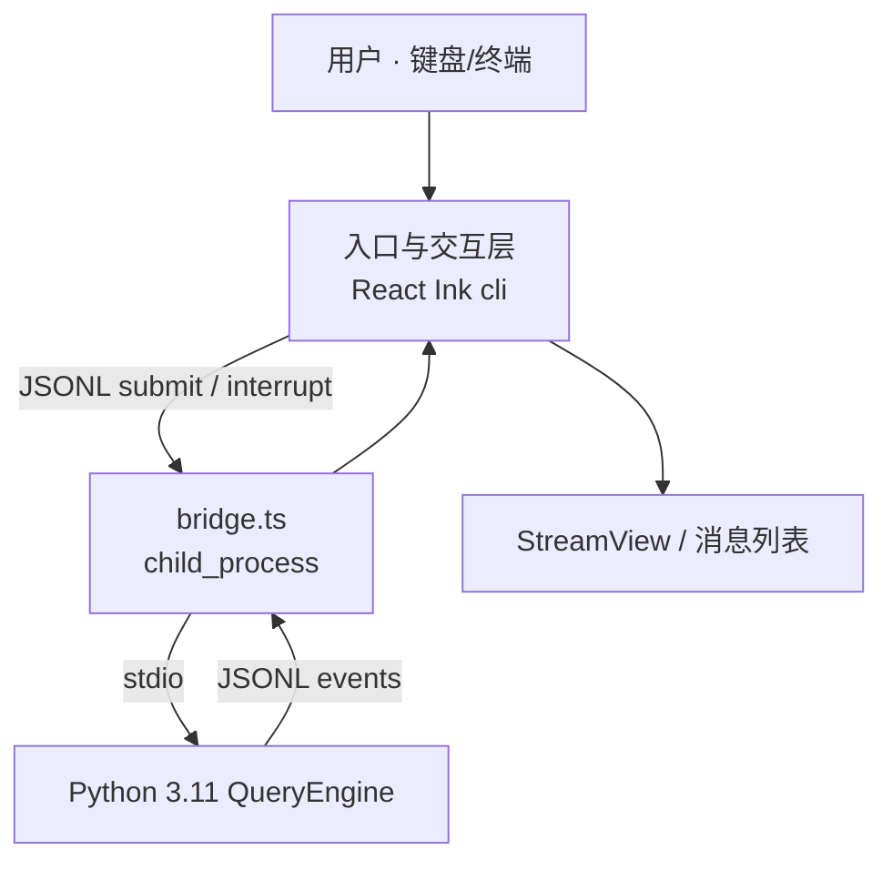
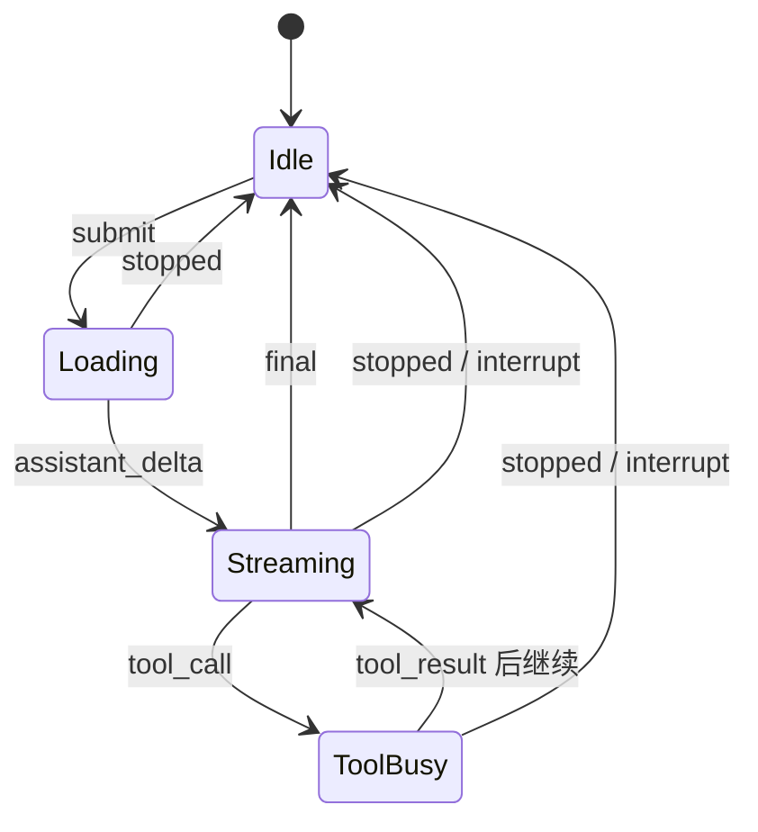
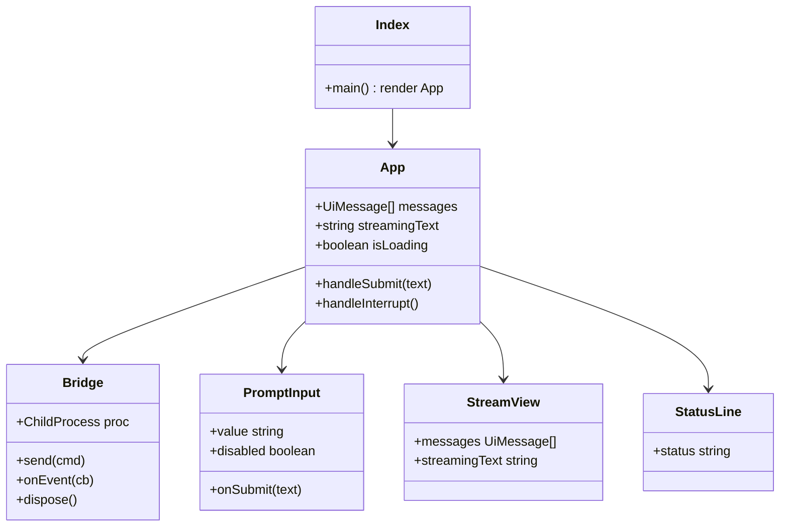

# Task 1 说明书：入口与交互层（终端 + React Ink）

> 任务范围：[`docs/tasks/01-single-session-main-loop.md`](../tasks/01-single-session-main-loop.md)  
> 技术：**终端进程 + TypeScript + React Ink**  
> 目录目标：`XEYO/gui/`  
> 本层**不**实现 QueryEngine；只负责 UI、键盘、JSONL 桥接。

---

## 1. 定位与职责

### 1.1 在整体中的位置

入口与交互层是用户**唯一**进出通道。用户不直接碰 Python / Java；所有输入、流式展示、中断都经过终端 Ink。



### 1.2 职责清单

| 职责 | 做 | 不做 |
|---|---|---|
| 进程入口 | `npm start` 拉起 Ink，进入 raw 终端模式 | CLI 参数全家桶、daemon、remote |
| 用户输入 | 多行文本框，Enter 提交 | Slash 命令解析、图片粘贴、vim 模式（可后补） |
| 渲染 | 消息列表 + 流式 delta + loading | Markdown 完整主题、虚拟滚动 |
| 中断 | Ctrl+C / Esc → 发 `interrupt` | 双击杀 Agent、远程 cancel |
| 与引擎通信 | spawn Python，读写 JSONL | 内嵌调用模型 / 工具 |
| 会话 UI 状态 | `messages`、`isLoading`、`streamingText` | AppState 权限/MCP/插件大盘 |

### 1.3 对照 Claude Code（源码事实）

| Claude Code | 路径 | XEYO Task 1 |
|---|---|---|
| 进程引导 | `src/entrypoints/cli.tsx` → `src/main.tsx` | `gui/src/index.tsx` |
| Ink Root | `src/ink.ts` `createRoot` / `render` | 官方 `ink` 包 `render(<App/>)` |
| 挂载 REPL | `src/replLauncher.tsx` `launchRepl` | 直接 `render(<App/>)` |
| App 壳 | `src/components/App.tsx` | `App.tsx`（极简，可无 AppStateProvider） |
| REPL 屏 | `src/screens/REPL.tsx` | `App.tsx` + 小组件（不要抄 5000 行） |
| 输入 | `src/components/PromptInput/PromptInput.tsx` | `PromptInput.tsx` |
| 消息列表 | `src/components/Messages.tsx` | `StreamView.tsx` |
| Spinner | `src/components/Spinner.tsx` | 一行 loading 文本即可 |
| 提交管线 | `handlePromptSubmit.ts` → `processUserInput` → `onQuery` → **`query()`** | `onSubmit` → JSONL `submit` → **Python QueryEngine** |
| 取消 | `REPL.onCancel` + `useCancelRequest` + `AbortController` | Ctrl+C → JSONL `interrupt` |
| Headless | `gui/print.ts` + `QueryEngine.ask()` | Task 1 **不做** headless；只做交互 Ink |

**关键差异**：源码里交互式 REPL **直接 `for await (query(...))`**，不经过 `QueryEngine`。`QueryEngine` 注释写明将来可给 REPL 用。XEYO Task 1 选择：**Ink 永远只说话给 Python QueryEngine**（经 JSONL），便于语言分层与单测。

---

## 2. Claude Code 启动链（阅读用，实现时简化）

### 2.1 交互式路径

```text
process.argv
  → entrypoints/cli.tsx :: main()
      快速路径（--version / bridge / daemon …）后
      → dynamic import main.tsx
  → main.tsx :: main()
      Commander 解析、setup()
      → getRenderContext(false)          // interactiveHelpers.tsx
      → createRoot(renderOptions)        // ink.ts
      → showSetupScreens(...)            // 信任/登录等 —— Task1 跳过
      → launchRepl(root, appProps, replProps, renderAndRun)
  → replLauncher.tsx :: launchRepl
      dynamic import App + REPL
      → renderAndRun(root, <App><REPL/></App>)
  → interactiveHelpers.tsx :: renderAndRun
      root.render(element)
      await root.waitUntilExit()
      gracefulShutdown(0)
```

### 2.2 Task 1 精简启动链

```text
node / tsx gui/src/index.tsx
  → render(<App />)                    // ink
  → App mount
      → spawn("python", ["-m", "xeyo.bridge"], { cwd, stdio: pipe })
      → 监听 stdout JSONL → setState
      → PromptInput.onSubmit → stdin.write(JSONL submit)
      → Ctrl+C → stdin.write(JSONL interrupt) 或 kill 信号策略见 §6
```

不做：`showSetupScreens`、Commander 子命令、FPS 遥测、ThemeProvider 全家桶（可用固定样式）。

---

## 3. REPL 核心交互模型（从源码抽象）

### 3.1 源码调用链（Enter → 渲染）

```text
[Enter]
  PromptInput.onSubmit(input)
    → REPL.onSubmit(input, helpers)
      → handlePromptSubmit({ input, onQuery, queryGuard, ... })
        → executeUserInput()
          → processUserInput(...)          // slash/bash 展开 —— Task1 跳过
          → onQuery(newMessages, abortController, shouldQuery, ...)
              → queryGuard.tryStart()      // 防并发查询
              → setMessages(prev => [...prev, ...newMessages])
              → onQueryImpl(...)
                  → for await (event of query({...}))
                      → onQueryEvent(event)
                          → handleMessageFromStream(event, ...)
                              → setMessages / setStreamingText / setStreamMode
              → finally: queryGuard.end(), resetLoadingState()
  → Ink 重绘 Messages + Spinner
```

### 3.2 XEYO Task 1 调用链

```text
[Enter]
  PromptInput.onSubmit(text)
    → App.handleSubmit(text)
        if (isLoading) return;           // 等价 QueryGuard：同时只跑一轮
        setIsLoading(true)
        append local UserBubble(text)
        bridge.send({ type: "submit", text })
    → bridge.onEvent(ev)
        switch ev.type:
          assistant_delta → append/update streaming text
          tool_call / tool_result → append tool rows
          final → commit assistant, setIsLoading(false)
          stopped → show reason, setIsLoading(false)
[Ctrl+C]
  → if isLoading: bridge.send({ type: "interrupt" })
  → else: exit process（或二次确认，Task1 可直接 exit）
```

### 3.3 UI 状态机（最小）



| 状态字段 | 类型 | 含义 |
|---|---|---|
| `messages` | `UiMessage[]` | 已提交展示的气泡（user / assistant / tool） |
| `streamingText` | `string` | 当前助手未完成文本 |
| `isLoading` | `boolean` | 本轮是否在跑（禁用重复提交） |
| `statusLine` | `string` | `idle` / `requesting` / `tool:echo` / `stopped:aborted` |

对齐源码：`REPL` 用 `messages` + `streamingText` + `streamMode`（`SpinnerMode`）；Task 1 用上表即可。

---

## 4. 组件设计（XEYO）

### 4.1 目录

```text
gui/
  package.json
  tsconfig.json
  src/
    index.tsx                 # 进程入口：render(<App/>)
    App.tsx                   # 状态机 + 布局
    bridge.ts                 # spawn Python + JSONL
    types.ts                  # UiMessage / BridgeEvent
    components/
      PromptInput.tsx         # 输入框
      StreamView.tsx          # 消息列表 + 流式行
      StatusLine.tsx          # loading / stopped 提示
```

### 4.2 类 / 模块关系



### 4.3 关键类型

```typescript
// types.ts
export type UiRole = 'user' | 'assistant' | 'tool' | 'system'

export type UiMessage = {
  id: string
  role: UiRole
  text: string
  toolName?: string
}

/** UI → Engine */
export type BridgeCommand =
  | { type: 'submit'; text: string }
  | { type: 'interrupt' }

/** Engine → UI */
export type BridgeEvent =
  | { type: 'assistant_delta'; text: string }
  | { type: 'tool_call'; name: string; input: unknown }
  | { type: 'tool_result'; name: string; output: string; is_error?: boolean }
  | { type: 'final'; text: string }
  | { type: 'stopped'; reason: 'max_turns' | 'aborted' | 'budget' | string }
  | { type: 'error'; message: string }
```

事件语义与引擎说明书 [`02-query-engine.md`](./02-query-engine.md) §7 一致，**禁止 UI 私自增字段**（要扩展两边一起改）。

### 4.4 组件行为规格

#### `PromptInput`

- 显示 `> ` 或简易多行输入（Ink `TextInput` / 自管 buffer）。
- `disabled === isLoading` 时忽略 Enter（或排队——Task1 **选择忽略**，对齐 `QueryGuard`「同时一轮」）。
- Enter：`onSubmit(trim(value))`，清空输入。
- 空串不提交。

#### `StreamView`

- 按 `messages` 顺序渲染：
  - `user`：前缀 `You:`
  - `assistant`：前缀 `Assistant:`
  - `tool`：前缀 `Tool[name]:`
- 若 `streamingText` 非空，末尾追加一行 `Assistant: {streamingText}▌`（光标可选）。
- Task1 不做虚拟列表；消息过多时可截断只显示最近 N 条（可选，默认不截）。

#### `StatusLine`

- `isLoading`：`… working` 或 `tool: echo`
- `stopped`：显示 reason
- 空闲：可不渲染

#### `Bridge`

```typescript
// 伪代码规格
class Bridge {
  constructor(opts: { pythonPath: string; module: string; cwd: string }) {
    this.proc = spawn(opts.pythonPath, ['-m', opts.module], {
      cwd: opts.cwd,
      stdio: ['pipe', 'pipe', 'inherit'], // stderr 直接打终端便于调试
      env: { ...process.env, PYTHONUNBUFFERED: '1' },
    })
    createInterface({ input: this.proc.stdout }).on('line', line => {
      const ev = JSON.parse(line) as BridgeEvent
      this.emit(ev)
    })
  }
  send(cmd: BridgeCommand) {
    this.proc.stdin.write(JSON.stringify(cmd) + '\n')
  }
  dispose() {
    this.proc.kill()
  }
}
```

要求：

1. **一行一个 JSON**（NDJSON / JSONL），禁止多行漂亮打印。  
2. Python 侧必须无缓冲（`PYTHONUNBUFFERED=1` 或 `-u`）。  
3. 子进程退出 → UI 显示 `error` 并退出 loading。  
4. App unmount / 进程退出时 `dispose()`。

---

## 5. 与源码组件的映射（实现时对照）

| 源码符号 | 文件 | Task1 对应 | 抄什么 / 不抄什么 |
|---|---|---|---|
| `launchRepl` | `replLauncher.tsx` | `index.tsx` `render` | 只抄「挂 App」；不抄 lazy 双 import 细节 |
| `REPL` Props | `REPL.tsx` | App 内聚状态 | 只要 messages/loading；不要 remote/ssh/mcp props |
| `onSubmit` | `REPL.tsx` | `App.handleSubmit` | 要「提交后锁 loading」；不要 slash 分支 |
| `onQuery` / `onQueryImpl` | `REPL.tsx` | **删除**，改 Bridge | 不要在 TS 里调模型 |
| `handleMessageFromStream` | `utils/messages.ts` | `App.onBridgeEvent` | 只处理 Task1 事件类型 |
| `QueryGuard` | `utils/QueryGuard.ts` | `if (isLoading) return` | 布尔锁即可 |
| `onCancel` | `REPL.tsx` | `handleInterrupt` | 发 interrupt；不做 partial 回写高级逻辑（可选加分） |
| `CancelRequestHandler` | `hooks/useCancelRequest.ts` | Ink `useInput` 监听 Ctrl+C | 不接完整 keybinding 系统 |
| `AppStateProvider` | `state/AppState.tsx` | **可不引入** | Task1 SessionState 在 Python |
| `useReplBridge` | `hooks/useReplBridge.tsx` | **不做** | 那是远端桥，不是本地 JSONL |

---

## 6. 中断行为规格

### 6.1 源码行为摘要

| 动作 | 源码 | 效果 |
|---|---|---|
| Esc / cancel 绑定 | `onCancel` → `abortController.abort('user-cancel')` | 停当前 query；可保留部分流式文本 |
| 中断 reason `interrupt` | 多处 `abort('interrupt')` | `queryLoop` 对 interruption 消息有特殊分支 |
| Headless | `QueryEngine.interrupt()` → `abort()` 无 reason | SDK 取消 |

### 6.2 Task 1 规范（必须实现）

1. **Loading 中**按 Ctrl+C：  
   - `bridge.send({ type: 'interrupt' })`  
   - UI 保持 Loading 直到收到 `stopped`（reason=`aborted`）或进程结束  
   - **禁止**再发第二次 submit 直到回到 Idle  
2. **Idle 中**按 Ctrl+C：  
   - `bridge.dispose()` + `process.exit(0)`（简单退出）  
3. Python 引擎收到 `interrupt` 后必须停止当前 `query_loop`（见 QueryEngine 说明书），并回推 `stopped`。  
4. Task1 **不区分** `user-cancel` / `interrupt` reason 字符串；统一 `aborted`。

---

## 7. JSONL 协议（入口侧完整表）

### 7.1 上行（Ink → Python）

| type | 字段 | 何时发 |
|---|---|---|
| `submit` | `text: string` | 用户 Enter |
| `interrupt` | （无） | Loading 中 Ctrl+C |

### 7.2 下行（Python → Ink）

| type | 字段 | UI 动作 |
|---|---|---|
| `assistant_delta` | `text` | 追加到 `streamingText`（增量或全量：约定 **增量**） |
| `tool_call` | `name`, `input` | `messages.push({role:'tool', text: 'call …'})` |
| `tool_result` | `name`, `output`, `is_error?` | `messages.push` 结果行 |
| `final` | `text` | `streamingText` 清零；push assistant；`isLoading=false` |
| `stopped` | `reason` | 状态行提示；`isLoading=false` |
| `error` | `message` | 显示错误；`isLoading=false` |

### 7.3 时序示例（echo）

```text
UI → {"type":"submit","text":"echo:hi"}
←  {"type":"assistant_delta","text":"..."}          # 可选
←  {"type":"tool_call","name":"echo","input":{"text":"hi"}}
←  {"type":"tool_result","name":"echo","output":"hi"}
←  {"type":"assistant_delta","text":"echoed: "}
←  {"type":"assistant_delta","text":"hi"}
←  {"type":"final","text":"echoed: hi"}
```

中断示例：

```text
UI → {"type":"submit","text":"long..."}
←  {"type":"assistant_delta","text":"..."}
UI → {"type":"interrupt"}
←  {"type":"stopped","reason":"aborted"}
```

---

## 8. 布局与视觉（Task1 最低要求）

终端一屏结构：

```text
┌─────────────────────────────────────┐
│ You: hello                          │
│ Assistant: hi there                 │
│ Tool[echo]: call {"text":"hi"}      │
│ Tool[echo]: hi                      │
│ Assistant: echoed: hi▌              │  ← streaming
│ … working                           │  ← StatusLine
├─────────────────────────────────────┤
│ > _                                 │  ← PromptInput
└─────────────────────────────────────┘
```

规则：

- 不引入卡片风、不堆 stats。  
- 单栏消息流 + 底部输入，对齐 REPL「对话优先」。  
- 颜色可选（Ink `Text` color）；无主题系统也合格。

---

## 9. 并发与队列策略

| 场景 | 源码 | Task1 |
|---|---|---|
| 查询进行中再输入 | `useCommandQueue` 可排队 | **禁止排队**：`isLoading` 时忽略提交 |
| 双开 query | `QueryGuard.tryStart` 失败 | 同左，布尔锁 |
| 多会话 Tab | 无（单 REPL） | 单进程单会话 |

---

## 10. 错误与进程生命周期

| 事件 | UI 行为 |
|---|---|
| Python 启动失败 | 打印错误，`process.exit(1)` |
| JSON 解析失败 | StatusLine 显示 parse error，不崩溃（可计数后退出） |
| 引擎 `error` 事件 | 展示 message，回 Idle |
| 用户正常退出 | dispose child，exit 0 |
| Ink 未捕获异常 | 尽量 dispose 后 rethrow |

---

## 11. 依赖建议

```json
{
  "name": "@xeyo/cli",
  "type": "module",
  "scripts": {
    "start": "tsx src/index.tsx"
  },
  "dependencies": {
    "ink": "^5",
    "react": "^18",
    "ink-text-input": "^6"
  },
  "devDependencies": {
    "tsx": "^4",
    "typescript": "^5",
    "@types/react": "^18",
    "@types/node": "^20"
  }
}
```

不必 vendoring Claude Code 的 `src/ink/*` fork；官方 Ink 足够 Task1。

环境变量：

| 变量 | 含义 | 默认 |
|---|---|---|
| `XEYO_PYTHON` | Python 可执行文件 | `python` / `py -3.11` |
| `XEYO_CWD` | 会话 cwd 传给引擎 | `process.cwd()` |
| `XEYO_ENGINE_MODULE` | Python `-m` 模块 | `xeyo.bridge` |

---

## 12. 测试与验收

### 12.1 手工验收（必须）

1. `npm start` 进入终端 UI。  
2. 输入普通文本 → 看到 assistant 回复 → 回到可输入。  
3. 输入 `echo:hi` → 看到 tool_call / tool_result / final。  
4. 提交后立即 Ctrl+C → 出现 `stopped: aborted`，可再次输入。  
5. 连续两轮对话，第二轮上下文正确（由引擎保证，UI 只展示）。  

### 12.2 可选自动化

- 对 `bridge.ts` 用 mock child process 测 JSONL 解析。  
- Ink 组件可用 `ink-testing-library`（非必须）。

### 12.3 完成定义（入口层）

- [ ] 仅通过终端 Ink 与用户交互  
- [ ] 不在 TS 内调用模型 API  
- [ ] JSONL 协议与引擎文档一致  
- [ ] Ctrl+C 中断路径打通  
- [ ] README 写明启动命令  

---

## 13. 明确不做（防膨胀）

- Web UI、VS Code 插件、第二入口  
- Slash 命令、权限弹窗（P3）、任务条（P4）  
- MCP / Bridge / Remote / SSH  
- 完整 Markdown / 语法高亮 / 虚拟滚动  
- 接入源码 `QueryEngine.ts`（那是 TS；我们对接 Python）  
- 复制整个 `REPL.tsx`

---

## 14. 实现检查清单（对照源码阅读）

阅读源码时建议打开：

1. `src/entrypoints/cli.tsx` — 看薄引导  
2. `src/replLauncher.tsx` — 看 App+REPL 挂载（全文很短）  
3. `src/screens/REPL.tsx` — 搜 `onSubmit`、`onQuery`、`onCancel`、`onQueryEvent`  
4. `src/utils/handlePromptSubmit.ts` — 理解提交管线边界  
5. `src/components/PromptInput/PromptInput.tsx` — 输入交互  
6. `src/utils/messages.ts` — `handleMessageFromStream` 事件分发思路  
7. `src/utils/QueryGuard.ts` — 并发锁语义  

实现时只保留上表「要抄的语义」，用 Ink + JSONL 重写。

---

## 15. 与 QueryEngine 说明书的接口契约

入口层保证：

1. 每次用户可见「一轮」对应恰好一次 `submit`（除非被忽略）。  
2. `interrupt` 只在 Loading 时发送。  
3. 收到 `final` 或 `stopped` 或 `error` 三者之一后必须解锁输入。  

引擎侧保证见 [`02-query-engine.md`](./02-query-engine.md)。

两边联调入口：先跑引擎 Fake 单测，再接 Ink Day 5。
